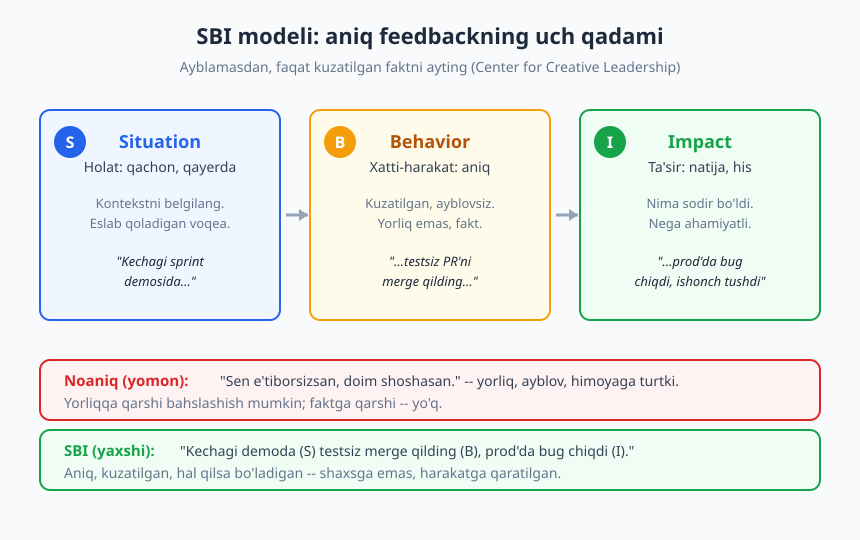
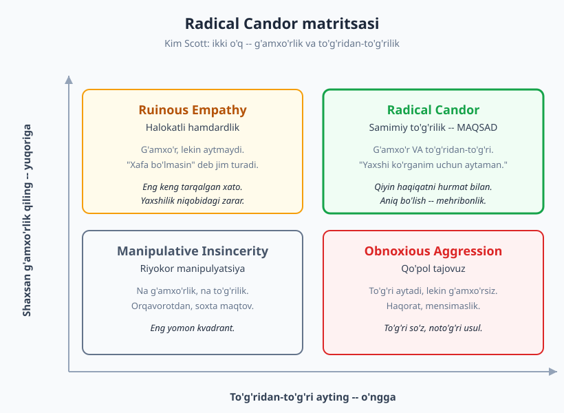
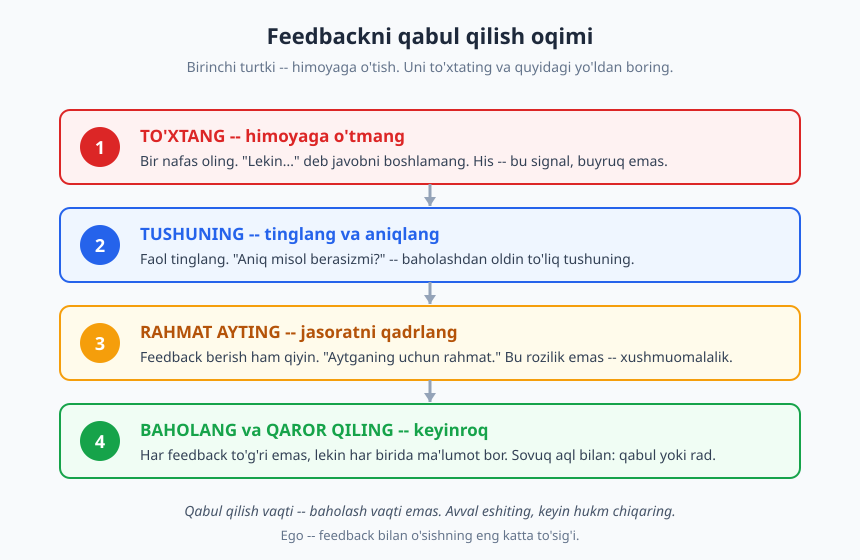

# 13 — Fikr-mulohaza: berish va qabul qilish

[⬅️ Oldingi: 12 — Faol tinglash va to'g'ri savol berish](./12-tinglash-savol-berish.md) · [🏠 README](./README.md) · [Keyingi: 14 — Jamoada ishlash va psixologik xavfsizlik ➡️](./14-jamoada-ishlash-xavfsizlik.md)

---

> **Bu bobda:** fikr-mulohaza (feedback) berish va qabul qilishning amaliy ramkalarini o'rganasiz: aniq va ayblovsiz feedback uchun **SBI modeli** (Center for Creative Leadership), feedback uslubini joylashtiradigan **Radical Candor** matritsasi (Kim Scott), kelajakka qaratilgan **feedforward** (Marshall Goldsmith) va eng qiyini — feedbackni himoyaga o'tmasdan qabul qilish ko'nikmasi.
>
> **Halollik / Eslatma:** feedback berish va qabul qilish — umrbod mashq qilinadigan ko'nikma, bir bobdan keyin "tugaydigan" narsa emas. Ramkalar sizga so'z va tartib beradi; lekin noqulaylikni yengish faqat takror-takror amaliyot bilan keladi.

---

## Nega feedback shunchalik qiyin

Tasavvur qiling: kechqurun jamoadoshingiz yozgan kodni ko'rib chiqyapsiz. U test yozmagan, o'zgaruvchilarning nomi tushunarsiz, ikkita joyda bir xil mantiq takrorlangan. Siz bilasiz: agar buni aytsangiz, u xafa bo'lishi mumkin. Agar aytmasangiz — kod shu holida prod'ga chiqadi va keyin hammaga qiyin bo'ladi. Yuragingiz tez ura boshlaydi. Aynan shu lahzada ko'pchilik osonroq yo'lni tanlaydi: jim turadi, yoki "umuman yaxshi" deb yozib qo'ya qoladi.

Feedback ikki tomon uchun ham noqulay. **Beruvchi** munosabatni buzishdan, "yomon odam" bo'lib ko'rinishdan qo'rqadi. **Oluvchi** esa tanqidni o'ziga hujum sifatida qabul qiladi — chunki miyamiz tanqidni jismoniy xavf bilan bir xil tarmoqda qayta ishlaydi. Bu evolyutsion: qadimda qabiladan rad etilish o'limga teng edi, shuning uchun biz tanqiddan instinktiv ravishda qo'rqamiz.

Lekin mana asosiy haqiqat: **feedbacksiz o'sish yo'q.** Siz o'zingizning ko'r nuqtangizni ko'ra olmaysiz — ta'rifi bo'yicha u "ko'r" nuqta. Boshqalar ko'radi. Ular aytmasa, siz o'sha xatoni yillab takrorlaysiz va nega o'smayotganingizni tushunmaysiz. Demak, feedback — bu **sovg'a**: kimdir o'z noqulayligini yengib, sizning o'sishingizga vaqt va xavf bag'ishladi.

> **Eslatma:** feedback ≠ tanqid. Tanqid — o'tmishga qaratilgan hukm ("buni yomon qilding"). Feedback — kelajakka qaratilgan ma'lumot ("buni bunday qilsang, natija yaxshiroq bo'ladi"). Niyat farq qiladi: tanqid o'zini ko'rsatish uchun, feedback o'sish uchun.

Bu bob shu noqulaylikni yo'qotmaydi — uni **boshqarsa bo'ladigan** narsaga aylantiradigan tuzilma beradi. Tuzilma bo'lsa, his-tuyg'u sizni boshqarmaydi; siz jarayonni boshqarasiz.

### Feedback madaniyatining ikki belgisi

Sog'lom jamoani noqulay jamoadan ajratib turadigan ikki narsa bor:

- **Chastota.** Feedback yiliga bir marta "performance review"da emas, balki har kuni, kichik dozalarda beriladi. Yiliga bir marta to'plangan tanqid — bu portlash. Har kungi kichik tuzatish — bu sug'orish.
- **Ikki tomonlama.** Faqat lead junior'ga emas, junior ham lead'ga feedback bera oladi. Buning uchun **psixologik xavfsizlik** kerak — bu haqda [14-bobda](./14-jamoada-ishlash-xavfsizlik.md) batafsil gaplashamiz.

---

## SBI modeli: aniq, ayblovsiz feedback

Yomon feedbackning eng keng tarqalgan kasalligi — **noaniqlik va yorliq qo'yish.** "Sen e'tiborsizsan", "Sen jamoaviy emassan", "Sening kodingni o'qib bo'lmaydi" — bularning hammasi shaxsga yorliq yopishtiradi. Yorliqqa qarshi bahslashish mumkin ("yo'q, men e'tiborliman!"), undan o'rganish esa qiyin — chunki aniq nima qilish kerakligi tushunarsiz.

Bu muammoni hal qilish uchun **Center for Creative Leadership (CCL)** **SBI modeli**ni taklif qilgan. SBI uch komponentdan iborat: **Situation (Holat) → Behavior (Xatti-harakat) → Impact (Ta'sir).**

### Uch qadam

1. **Situation (Holat).** Qachon va qayerda bo'lganini aniq belgilang. Bu feedbackni umumiy ("sen doim...") emas, aniq voqeaga bog'laydi. *"Kechagi sprint demosida..."*, *"Seshanba kuni mening PR'imga yozgan izohingda..."*
2. **Behavior (Xatti-harakat).** Siz **kuzatgan** aniq harakatni ayting — talqin yoki niyat emas, fakt. *"...testsiz PR'ni merge qilding..."* Yomon variant: *"...beparvolik qilding..."* ("beparvolik" — sizning talqiningiz, balki u shoshilinch bug'ni tuzatayotgan edi).
3. **Impact (Ta'sir).** O'sha harakat nimaga olib kelganini ayting — natija yoki sizning his-tuyg'ungiz. *"...natijada prod'da bug chiqdi va relizni kechiktirdik."* yoki *"...men o'zimni e'tibordan chetda qoldim deb his qildim."*

### Misol: noaniq vs SBI

> **❌ Noaniq:** "Sen code review'da juda qattiqqo'lsan, odamlarni cho'chitasan."
>
> **✅ SBI:** "Bugun Alisherning PR'iga (S) o'nlab izoh qoldirib, ularning yarmida 'bu noto'g'ri' deb yozgansan, sababsiz (B). Alisher menga keyin demoralizatsiya bo'lganini aytdi va keyingi PR'ini ochishdan cho'chiyapti (I)."

Ikkinchi variantni eshitgan odam aniq nimani o'zgartirish kerakligini biladi: izoh sonini emas, balki ohangni va izoh sababini. Birinchi variant esa faqat himoya uyg'otadi.

> **Diqqat:** SBI'da **niyatni taxmin qilmang.** "Sen ataylab..." yoki "Senga baribir..." — bu telepatiya. Siz faqat tashqi harakatni va o'z ta'siringizni bilasiz. Niyatni bilmoqchi bo'lsangiz — so'rang: "Bu yerda nima bo'lganini tushuntirib bera olasanmi?"

### SBI faqat tanqid uchun emas

Ko'pchilik SBI'ni faqat "yomon xabar" uchun ishlatadi. Aslida u **maqtov** uchun ham xuddi shunchalik kuchli — chunki aniq maqtov "molodes" degan quruq so'zdan ancha foydaliroq:

> "Bugungi incident paytida (S) sen darhol log'larni umumiy kanalga tashlab, har 10 daqiqada holatni yangilab turding (B). Buning natijasida hammamiz nima bo'layotganini bildik va vahima bo'lmadi (I). Rahmat."

Bu odam endi aynan nimani takrorlash kerakligini biladi.

---

## Radical Candor: g'amxo'rlik va to'g'rilik

SBI sizga **qanday** aytishni beradi. **Radical Candor** esa qanday **munosabatdan** turib aytishni beradi. Bu ramkani **Kim Scott** yaratgan (Google va Apple'da rahbar bo'lgan, keyin shu nomli kitob yozgan).

G'oya ikki o'q ustiga qurilgan:

- **Shaxsan g'amxo'rlik qiling (care personally)** — odamni inson sifatida ko'ring, uning muvaffaqiyatini chinakam xohlang.
- **To'g'ridan-to'g'ri ayting (challenge directly)** — fikringizni yashirmang, qiyin haqiqatni ham ayting.

Bu ikki o'q to'rtta kvadrat hosil qiladi:

| Kvadrant | G'amxo'rlik | To'g'rilik | Nima bo'ladi |
|---|---|---|---|
| **Radical Candor** (maqsad) | Bor | Bor | Qiyin haqiqatni hurmat bilan aytasiz — odam o'sadi |
| **Ruinous Empathy** (halokatli hamdardlik) | Bor | Yo'q | "Xafa bo'lmasin" deb jim turasiz — odam o'smaydi |
| **Obnoxious Aggression** (qo'pol tajovuz) | Yo'q | Bor | To'g'ri aytasiz, lekin haqorat bilan — odam yopiladi |
| **Manipulative Insincerity** (riyokorlik) | Yo'q | Yo'q | Orqavorotdan gapirasiz, soxta maqtaysiz — eng yomoni |

### Eng xavfli kvadrant — Ruinous Empathy

Scott'ning eng muhim kuzatuvi shu: ko'pchilik yaxshi odamlar **Ruinous Empathy** tuzog'iga tushadi. Ya'ni siz odamni yaxshi ko'rasiz, uni xafa qilishni istamaysiz — shuning uchun unga kerakli tanqidni **aytmaysiz.** Bu o'zingizni yaxshi his qilishingiz uchun, aslida esa o'sha odamga zarar yetkazasiz: u xatosini bilmay qoladi va o'smaydi.

> **Misol:** Junioringiz oylab kod yozyapti, lekin commit xabarlari tushunarsiz, PR'lari ulkan. Siz "hali yangi, o'rganadi" deb hech narsa demaysiz. Olti oydan keyin u senior bo'lmoqchi, lekin reddetiladi — chunki hech kim unga oddiy narsani vaqtida aytmagan. **Sizning "mehribonligingiz" uning karyerasiga to'sqinlik qildi.**

> **Trade-off:** Obnoxious Aggression ham zararli, lekin Scott aytadi: agar tanlash kerak bo'lsa, **jimlikdan ko'ra qo'pol bo'lsa ham aytish yaxshiroq** — chunki kamida ma'lumot yetib boradi. Eng yomoni — hech narsa aytmaslik. Lekin maqsad, albatta, ikkalasi: g'amxo'rlik bilan to'g'rilik.

### Radical Candor'ni qanday qo'llash

Radical Candor "qo'pollik uchun ruxsatnoma" emas — bu eng keng tarqalgan noto'g'ri tushunish. Amalda u shunday ko'rinadi:

- **Avval munosabatga vaqt ajrating.** Odam sizning g'amxo'rligingizni his qilmasa, to'g'ri so'zingiz hujumdek tuyuladi. Ishonch — to'g'rilik uchun ruxsatnoma.
- **Maqtovni ham, tuzatishni ham bering** — faqat tanqid beradigan odam Obnoxious tomonga og'adi.
- **Niyatingizni ochiq ayting:** "Buni senga yaxshilik istab aytyapman, janjal uchun emas."

---

## Maqtov, tuzatuvchi feedback va feedforward

### Ijobiy feedbackni past baholamang

Ko'pchilik faqat narsa buzilganda gapiradi. Bu xato. **Ijobiy feedback** — kuchli vosita, chunki u kerakli xatti-harakatni mustahkamlaydi. Lekin ikki shart bilan:

- **Aniq bo'lsin.** "Yaxshi ish" — bu hech narsa. "Sening refactoring'ing tufayli bu modul endi test qilsa bo'ladigan bo'ldi" — bu ma'lumot.
- **O'z vaqtida bo'lsin.** Voqeadan keyin darhol. Olti oy keyin maqtov ta'sirsiz.

> **Eslatma:** "Maqtov sendvichi" (yomonni ikki maqtov orasiga tiqish) — ko'pincha tavsiya etiladi, lekin amalda zararli bo'lishi mumkin. Odamlar tezda buni o'rganadi va har maqtovdan keyin "endi yomon xabar keladi" deb kutadi — shunda maqtov ham qadrsizlanadi. Yaxshisi: maqtovni va tuzatishni alohida, har biri samimiy holda bering.

### Tuzatuvchi feedbackning odobi

- **Xususiy joyda bering.** Maqtovni hammaning oldida ber, tuzatishni — to'rt ko'z bilan. Commit history yoki butun jamoa oldida tanqid — bu sharmandalik, feedback emas.
- **Harakatga qarating, shaxsga emas.** "Bu funksiya juda uzun" — yaxshi. "Sen tartibsiz odamsan" — yomon.
- **Bitta narsaga e'tibor bering.** Bir vaqtda 10 ta kamchilikni aytsangiz, odam hech birini eslab qolmaydi va faqat himoyaga o'tadi.

### Feedforward: kelajakka qarating

**Marshall Goldsmith** (rahbarlar bo'yicha mashhur murabbiy) 1990-yillar boshida **feedforward** g'oyasini ommalashtirgan. Mantig'i oddiy: o'tmishni o'zgartirib bo'lmaydi, shuning uchun "nima yomon qilding"ga emas, **"keyingi safar nimani boshqacha qilsa bo'ladi"**ga e'tibor bering.

> **Feedback:** "Kechagi taqdimoting chalkash edi, slaydlar juda zich edi." (o'tmish, himoya uyg'otadi)
>
> **Feedforward:** "Keyingi taqdimotda har slaydda bitta asosiy fikr qoldirsang, auditoriya yaxshiroq ergashadi." (kelajak, harakatga undaydi)

Feedforward ayblov hissini kamaytiradi, chunki "hali bo'lmagan narsa"ni muhokama qilasiz — uni himoya qilishning hojati yo'q. Eng kuchli yondashuv — SBI bilan o'tmishni aniqlash, keyin feedforward bilan kelajakka yo'naltirish.

---

## Feedbackni qabul qilish: eng qadrli ko'nikma

Feedback berishni o'rganish qiyin. Lekin uni **qabul qilish** — bundan ham qadrli va kamroq odamda bor ko'nikma. Sababi oddiy: berishni siz nazorat qilasiz, qabul qilishda esa boshqa birov sizning kamchiligingizni yuzingizga aytadi — va miyangiz darhol himoyaga shaylanadi.

### To'rt qadamli oqim

1. **To'xtang — himoyaga o'tmang.** Birinchi turtki har doim "Lekin...". Uni ushlab turing. Bir nafas oling. Yuzingizdagi mushaklar tarang bo'lganini sezsangiz — bu signal: hozir himoya rejimidasiz, demak yomon qaror qabul qilasiz.
2. **Tushuning — tinglang va aniqlang.** [Faol tinglash](./12-tinglash-savol-berish.md) ko'nikmangizni ishga soling. Javob tayyorlash o'rniga, tushunishga harakat qiling. Aniq emas bo'lsa, so'rang: "Aniq bir misol bera olasanmi?" — bu vaqtni ham yutadi, ham aniqlik beradi.
3. **Rahmat ayting.** Feedback berish ham qiyin va xavf — odam o'z noqulayligini yengib sizga vaqt ajratdi. "Aytganing uchun rahmat" deyish — bu **rozilik emas**, balki jasoratni qadrlash. Bu, shuningdek, kelgusida ham odamlar sizga ochiq gapirishini ta'minlaydi.
4. **Baholang va qaror qiling — keyinroq.** Mana eng muhim ajratish: **qabul qilish vaqti — baholash vaqti emas.** Issiq paytda hukm chiqarmang. Keyinroq, sovuq aql bilan o'ylang: bu feedback to'g'rimi? **Har feedback to'g'ri emas** — lekin har birida ma'lumot bor (kamida: o'sha odam sizni shunday ko'rmoqda — bu ham fakt).

### Code review feedbackini ego'siz qabul qilish

Dasturchi hayotida feedbackning eng tez-tez keladigan shakli — **code review.** Va aynan shu yerda ko'pchilik sinaydi. Kimdir sizning PR'ingizga izoh yozdi — va siz buni o'zingizga hujum deb qabul qilasiz.

Bu yerda bitta aqliy almashtirish hamma narsani o'zgartiradi: **kod siz emassiz.** Sizning kodingizdagi xato — sizning shaxsiyatingizdagi nuqson emas. Tajribali muhandislar o'z kodiga **aloqasiz** munosabatda bo'lishni o'rganadi: "bu kod yaxshilanishi kerak" degani "men yomonman" degani emas.

> **Suhbat — yomon reaksiya (❌):**
>
> **Reviewer:** "Bu yerda null tekshiruvi yo'q, foydalanuvchi bo'sh kiritsa, crash bo'ladi."
>
> **Muallif:** "Bunaqa bo'lmaydi, foydalanuvchi har doim qiymat kiritadi. Ortiqcha murakkablashtirmaylik."

> **Suhbat — yaxshi reaksiya (✅):**
>
> **Reviewer:** "Bu yerda null tekshiruvi yo'q, foydalanuvchi bo'sh kiritsa, crash bo'ladi."
>
> **Muallif:** "To'g'ri ko'rding, rahmat. Men frontend validatsiyaga ishonib qolibman — lekin backend ham himoyalanishi kerak. Tuzataman."

Ikkinchi muallif kuchsizroq emas — aksincha, kuchliroq. U faktni tan oldi, ego'sini chetga surdi va koddan yaxshiroq chiqdi. Code review'ning inson tomonini [15-bobda](./15-code-review-inson-tomoni.md) chuqurroq ko'ramiz.

> **Diqqat:** ego'siz qabul qilish "har feedbackga rozi bo'lish" degani emas. Ba'zan reviewer xato qiladi yoki kontekstni bilmaydi. Unda — himoya bilan emas, **dalil bilan** javob bering: "Bu joyda null kelmaydi, chunki yuqorida X funksiyasi uni filtrlaydi — qara." Bu xushmuomala kelishmovchilik, himoya emas.

Bu yondashuvning ildizi — [o'sish mentaliteti](./02-osish-mentaliteti.md): xatoni shaxsiy mag'lubiyat emas, o'sish nuqtasi sifatida ko'rish. Kim o'z kamchiligini ochiq tan ola olsa — o'sha eng tez o'sadi.

### Feedback so'rashni o'rganing

Eng yetuk dasturchilar feedback **kelishini kutmaydi** — uni **so'raydi.** Lekin "menga feedback berasanmi?" degan umumiy savol odatda "yo'q, hammasi yaxshi" degan foydasiz javob oladi. Aniq so'rang:

- "Mening bugungi taqdimotimda eng tushunarsiz qism qaysi edi?"
- "Agar bitta narsani o'zgartirsam, code review'larim qaysi tomondan yaxshilanadi?"
- "Stand-up'da men juda uzoq gapiryapmanmi?"

Aniq savol aniq javob oladi — va siz feedbackning ustasiga aylanasiz: nafaqat qabul qiluvchi, balki uni faol qidiruvchi.

---

## Asosiy g'oyalar (bobni qisqacha)

- **Feedback — sovg'a, tanqid emas.** Beruvchi ham, oluvchi ham noqulay, lekin **feedbacksiz o'sish yo'q** — chunki o'z ko'r nuqtangizni o'zingiz ko'rmaysiz.
- **SBI modeli** (CCL) feedbackni aniq qiladi: **Situation (holat) → Behavior (kuzatilgan harakat, yorliqsiz) → Impact (ta'sir).** Niyatni taxmin qilmang — faqat faktni ayting. Maqtov uchun ham ishlaydi.
- **Radical Candor** (Kim Scott) ikki o'q: **shaxsan g'amxo'rlik × to'g'ridan-to'g'ri aytish.** Maqsad — ikkalasi. Eng keng tarqalgan tuzoq — **Ruinous Empathy**: g'amxo'r, lekin aytmaydigan jimlik, bu o'sishga to'sqinlik qiladi.
- **Tuzatuvchi feedbackni xususiy, harakatga qaratilgan va bittalab bering;** maqtovni esa aniq va o'z vaqtida. **Feedforward** (Goldsmith) e'tiborni o'tmish aybidan kelajak harakatiga ko'chiradi.
- **Qabul qilish — eng qadrli ko'nikma:** **to'xta → tushun → rahmat ayt → keyinroq baholab qaror qil.** Qabul qilish vaqti baholash vaqti emas.
- **Kod siz emassiz.** Code review feedbackini **ego'siz** qabul qiling; har feedback to'g'ri bo'lmasa-da, har birida ma'lumot bor. Eng yetuklar feedbackni **so'raydi** — aniq savol bilan.

## Mashqlar

### Oson

**1-mashq.** Quyidagi noaniq feedbacklarning har birini **SBI** formatiga aylantiring (Holat → Xatti-harakat → Ta'sir). Yetishmagan ma'lumotni mantiqan to'ldiring:
- (a) "Sen stand-up'da juda chalkash gapirasan."
- (b) "Sening PR'laringni ko'rib chiqish qiyin."

**2-mashq.** Quyidagi feedback uslublarini Radical Candor matritsasining qaysi kvadrantiga tegishli ekanini aniqlang:
- (a) "Hammasi yaxshi, ishlaringni davom ettir" (aslida ish sifatsiz bo'lsa ham).
- (b) "Bu kodni faqat sen kabi tajribasiz odam yozadi."
- (c) Ko'zga "zo'r" deb, orqavorotdan boshqalarga "uning kodi dahshat" deb gapirish.
- (d) "Bu yondashuvda muammo bor, tushuntiraman — chunki loyiha muvaffaqiyatini istayman."

### O'rta

**3-mashq.** Oxirgi marta kimdir sizga bergan tanqidiy feedbackni eslang. O'sha paytdagi reaksiyangizni "to'xta → tushun → rahmat ayt → baholab qaror qil" oqimiga solib yozing: qaysi qadamni yaxshi bajardingiz, qaysi birida himoyaga o'tdingiz?

**4-mashq.** Jamoadoshingiz (yoki o'qish hamkoringiz) sizning ishingizdagi bitta yaxshi narsani tanlang va unga **SBI formatida ijobiy feedback** yozing — aniq holat, aniq harakat, aniq ijobiy ta'sir bilan. Quruq "molodes" emas.

### Qiyin

**5-mashq.** Siz lead'siz. Junioringiz oxirgi 3 ta PR'ida testsiz kod yubordi va eslatmangizga ham e'tibor bermadi. Unga beradigan feedbackingizni yozing. U: (a) SBI tuzilishida bo'lsin, (b) Radical Candor'ning to'g'ri kvadrantida (g'amxo'rlik + to'g'rilik), (c) oxirida feedforward bilan kelajakka yo'naltirsin. Suhbat namunasi ko'rinishida ("Lead: ...", "Junior: ...") yozing.

**6-mashq.** Siz kimdandir feedback oldingiz va u, sizningcha, **noto'g'ri** (reviewer kontekstni bilmaydi). Buni himoyaga o'tmasdan, lekin o'z fikringizni ham himoya qilib, qanday javob berasiz? "Rahmat aytish" bilan "rozi bo'lish" o'rtasidagi farqni amalda ko'rsatadigan javob yozing.

Yechimlar / Namunaviy yondashuvlar

### 1-mashq yechimi

- (a) **S:** "Bugun ertalabki stand-up'da" — **B:** "yangilikni tushuntirishga 4 daqiqa sarflading va texnik tafsilotga chuqur kirib ketding" — **I:** "natijada jamoaning yarmi nima qilayotganingni tushunmadi va yig'ilish cho'zildi." (Kelajak uchun: "asosiy fikrni bir jumlada aytsang, tafsilotni keyin qiziqqanga aytsang yaxshiroq bo'ladi.")
- (b) **S:** "Kechagi 400 qatorlik PR'ingda" — **B:** "10 ta o'zgarishni bir commit'ga jamlading va izoh yozmading" — **I:** "men o'zgarishlar mantig'ini tiklash uchun yarim soat sarfladim va baribir to'liq tushunmadim." (Feedforward: "PR'ni kichik, mantiqiy bo'laklarga bo'lsang, review tezroq va aniqroq bo'ladi.")

### 2-mashq yechimi

- (a) **Ruinous Empathy** — g'amxo'r ko'rinadi, lekin kerakli haqiqatni aytmaydi.
- (b) **Obnoxious Aggression** — qisman to'g'ri kuzatuv bo'lishi mumkin, lekin haqorat bilan, g'amxo'rliksiz.
- (c) **Manipulative Insincerity** — yuziga boshqacha, orqasidan boshqacha; na g'amxo'rlik, na to'g'rilik. Eng yomoni.
- (d) **Radical Candor** — to'g'ridan-to'g'ri muammoni aytadi, lekin niyatini (loyiha muvaffaqiyati) ochiq qilib g'amxo'rlikni ko'rsatadi.

### 3-mashq yechimi

To'g'ri javob yo'q — bu reflektiv mashq. Namunaviy tahlil: "Reviewer mening arxitektura tanlovimni tanqid qildi. **To'xta:** men darhol 'lekin men buni shu sababdan qildim' dedim — himoyaga o'tdim, qadamni o'tkazib yubordim. **Tushun:** keyinroq sovuganimda uning gapini qayta o'qib, haqligini tushundim. **Rahmat:** o'sha paytda aytmaganman, keyin yozib uzr so'radim. **Qaror:** yondashuvni o'zgartirdim." — Saboq: issiq paytda himoyaga o'tish refleksini sezish — bu ko'nikmaning birinchi qadami.

### 4-mashq yechimi

Namuna: "Kecha incident paytida (S) sen log'larni darhol umumiy kanalga tashlab, har bir qadamingni ovoz chiqarib yozib turding (B). Buning natijasida men muammoni parallel tekshira oldim va biz 20 daqiqada hal qildik — yolg'iz bo'lsam ancha ko'p vaqt ketardi (I). Buni keyin ham shunday qilsang zo'r bo'ladi." — Diqqat: "zo'r ishlading" emas, balki **aynan nima** zo'r ekanini ko'rsatadi, shuning uchun takrorlasa bo'ladi.

### 5-mashq yechimi

> **Lead:** "Bir daqiqa gaplashsak bo'ladimi? Senga oddiygina aytmoqchiman, chunki o'sishingni istayman. Oxirgi uchta PR'ingda (S) avtomatik testlar bo'lmadi va men buni o'tgan hafta eslatgan edim, lekin keyingisida ham qaytarildi (B). Natijada men har PR'ingni qo'lda sinab ko'rishim kerak bo'lyapti, bu review'ni sekinlashtiryapti va menda 'eslatmam eshitilmadi' degan tuyg'u qoldiryapti (I)."
>
> **Junior:** "Kechirasiz, ulguraman deb shoshildim..."
>
> **Lead:** "Tushunaman, ayblamayapman. Keyingi PR'lardan boshlab har biriga kamida bitta test qo'shsang va eslatma qaytsa darhol menga yozsang — birga yo'lini topamiz. Kelishdikmi?" (feedforward + birgalikda yechim)

Bu yechim: SBI tuzilishida, ochiq niyat (g'amxo'rlik) bilan, lekin muammoni aniq aytadi (to'g'rilik = Radical Candor), va oxirida kelajakka qaratilgan aniq qadam beradi.

### 6-mashq yechimi

Namuna: "Buni ko'rganing va aytganing uchun rahmat — bunday narsalarni o'tkazib yubormaslik muhim. Bu aniq joyda men null kelmasligiga ishonganman, chunki yuqorida `validateInput` funksiyasi bo'sh qiymatlarni filtrlaydi — qarab chiqsang, o'sha yerni ko'rsataman. Agar shunda ham xavf ko'rsang, men yetkazib bera olmagan kontekst bo'lishi mumkin, muhokama qilaylik." — Bu yerda: **rahmat** (jasoratni qadrlash) ≠ **rozilik**; o'z pozitsiyangizni **dalil** bilan himoya qilasiz (his bilan emas), va boshqa tomon haq bo'lishi ehtimolini ham ochiq qoldirasiz. Bu — kelishmovchilik, himoya rejimi emas.

---

[⬅️ Oldingi: 12 — Faol tinglash va to'g'ri savol berish](./12-tinglash-savol-berish.md) · [🏠 README](./README.md) · [Keyingi: 14 — Jamoada ishlash va psixologik xavfsizlik ➡️](./14-jamoada-ishlash-xavfsizlik.md)
