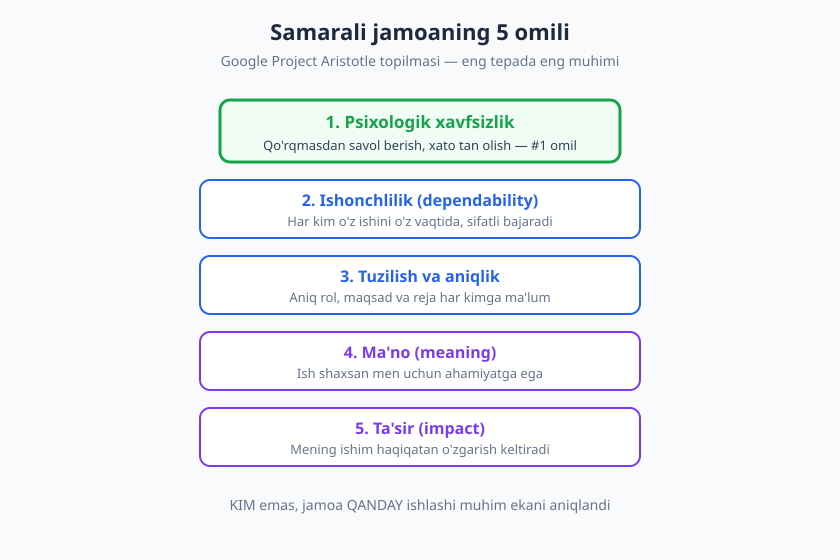
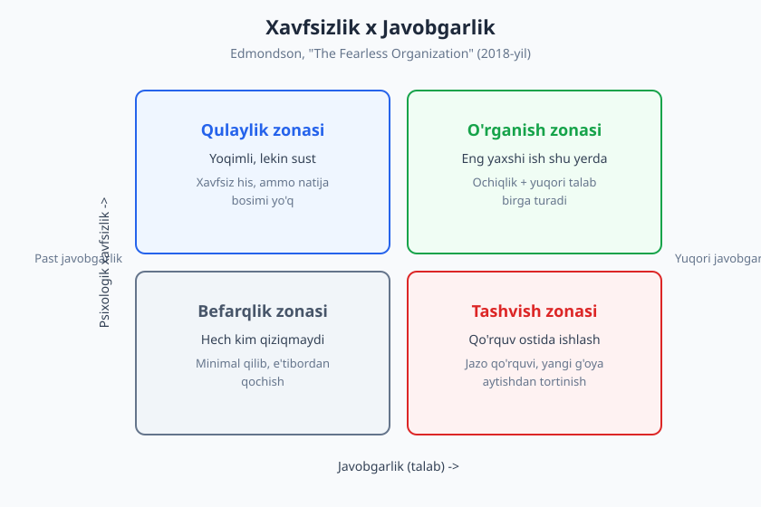
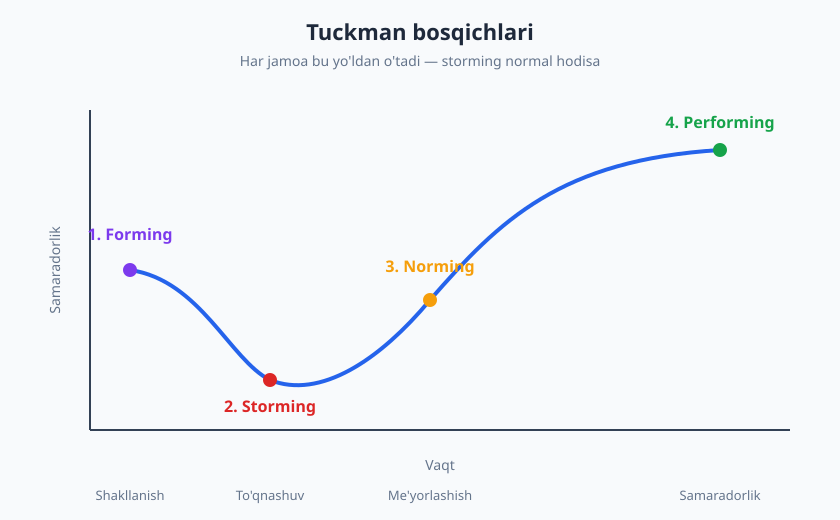

# 14 — Jamoada ishlash va psixologik xavfsizlik

[⬅️ Oldingi: 13 — Fikr-mulohaza: berish va qabul qilish](./13-feedback-berish-qabul.md) · [🏠 README](./README.md) · [Keyingi: 15 — Code review: texnik va inson tomoni ➡️](./15-code-review-inson-tomoni.md)

---

> **Bu bobda:** dasturiy ta'minot — jamoaviy ish ekanini va nega yakka kuchli dasturchidan kuchli jamoa ustun ekanini ko'ramiz. So'ng eng muhim tushuncha — **psixologik xavfsizlik** (Amy Edmondson, Google **Project Aristotle**) atrofida quramiz: u nima, nega #1 omil, va u talabchanlik yo'qligi emasligini. Keyin jamoa qanday bosqichlardan o'tishini (**Tuckman**), ishonch va ayblashsiz madaniyatni hamda sog'lom jamoaning kundalik amaliyotini o'rganamiz.

> **Halollik / Eslatma:** psixologik xavfsizlik bir tushlikda quriladigan narsa emas — u kichik, takroriy harakatlar bilan oylab to'planadi va bitta ayblovli reaksiya bilan tez buzilishi mumkin. Bu bob sizga xaritani beradi; lekin xavfsiz jamoa madaniyatini siz va jamoangiz har kuni amalda quradi. Junior sifatida ham sizning hissangiz bor — buni ham ko'rib o'tamiz.

---

## Nega jamoa

Boshlovchi dasturchilar ko'pincha bitta xayolparastlik bilan keladi: "men shu qadar kuchli kod yozsam-ki, hamma menga tan bersa". Bu zararli orzu — chunki haqiqatda zamonaviy dasturiy ta'minot **bir kishi ko'tara olmaydigan** narsa.

O'ylab ko'ring: oddiy bir veb-ilova ham frontend, backend, ma'lumotlar bazasi, deploy, monitoring, xavfsizlik, dizayn, mahsulot qarorlari — o'nlab qatlamdan iborat. Bularning hammasini bitta odam birdek chuqur biladi degani — afsona. Hatto eng tajribali muhandis ham butun tizimni boshida tutib turolmaydi. Aynan shu sababdan dasturchilik — **jamoa sporti**.

### "Bus factor" — bitta odamning xavfi

Jamoaning sog'ligini o'lchaydigan g'alati, lekin foydali tushuncha bor: **bus factor** (yoki "truck factor"). Savol oddiy: *jamoadagi nechta odam "avtobus urib ketsa" (ya'ni birdan ketib qolsa) loyiha to'xtab qoladi?*

- **Bus factor = 1** — eng xavfli holat. Faqat bitta odam deploy qila biladi, faqat u kishi to'lov tizimi kodini tushunadi, faqat u parollarni biladi. U ta'tilga chiqsa — jamoa shol bo'ladi. Bu odam ham qamoqda: ta'til ololmaydi, kasal bo'lolmaydi, chunki "usiz bo'lmaydi".
- **Yuqori bus factor** — bilim tarqalgan, hujjatlashtirilgan, bir nechta odam har bir muhim qismni tushunadi. Jamoa chidamli (resilient).

Bus factorni oshirish — bu texnik masala emas, **jamoaviy odat**: bilim ulashish, juftlashib ishlash (pair programming), hujjat yozish, "men bilmaydigan qismni boshqa o'rgansin" deb ataylab harakat qilish. Bu — keyingi bo'limlardagi madaniyatning amaliy mevasi.

### Jamoa = shaxslar yig'indisidan ko'p... yoki kam

Bu yerda muhim haqiqat bor. Yaxshi jamoa — a'zolarining yig'indisidan **kuchliroq**: g'oyalar bir-biriga urilib yangi yechim tug'iladi, biri to'xtaganda ikkinchisi davom ettiradi, xato boshqaning ko'zi bilan tez topiladi.

Lekin teskarisi ham rost: **yomon jamoa** a'zolarining yig'indisidan **kuchsizroq**. To'rt nafar zo'r muhandis bir-biriga ishonmasa, gapirmasa, har biri o'z burchagini himoya qilsa — natija to'rtta yolg'iz odamdan ham yomon. Energiya ishga emas, ichki kurashga sarflanadi.

Demak savol "jamoada zo'r odamlar bormi?" emas, balki **"bu odamlar qanday ishlaydi?"**. Aynan shu savolning javobi keyingi bo'limning markazida.

---

## Psixologik xavfsizlik

Agar bu bobdan faqat bitta tushunchani olib qoladigan bo'lsangiz — bu bo'lsin: **psixologik xavfsizlik**.

Bu atamani ilmiy maydonga olib kirgan — Garvard professori, tashkiliy xulq-atvor tadqiqotchisi **Amy Edmondson** (1999-yildan boshlab). Uning ta'rifi qisqa va aniq:

> **Psixologik xavfsizlik** — bu jamoa a'zosi **savol berish, xato tan olish, fikr bildirish, yordam so'rash yoki rozi emasligini aytishdan qo'rqmaydigan** muhit. Ya'ni: "men ahmoq, qobiliyatsiz yoki to'siq bo'lib ko'rinmayman" degan ishonch.

Diqqat qiling — bu "hamma bir-birini yaxshi ko'radi" yoki "hech qachon tanqid yo'q" degani EMAS. Bu **shaxslararo xavfni** olib tashlash haqida: aqlli savol berishni, "men bilmayman" deyishni, "bu g'oya ishlamaydi deb o'ylayman" deyishni xavfsiz qilish.

### Nega bu shunchalik muhim

Tasavvur qiling, jamoaviy stand-up'da siz kodda jiddiy muammoni payqadingiz, lekin gapirsangiz "nega oldin aytmading?" yoki "buni bilmaysanmi?" eshitishdan qo'rqasiz. Natija — jim turasiz. Muammo katta bo'lib chiqadi.

Mana shu — psixologik xavfsizlik yo'qligining narxi. Xavfsizlik past bo'lganda odamlar **ma'lumotni yashiradi**: xatoni bekitadi, savol bermaydi, yomon yangilikni kech aytadi, "men bilmayman" o'rniga bilganday qiladi. Va bularning hammasi — to'g'ridan-to'g'ri sifat, tezlik va xavfsizlikka zarba.

❌ **Xavfsiz bo'lmagan jamoada:** "Men bu kodni tushunmadim, lekin so'rasam ahmoq ko'rinaman — jim o'tiraman." → bug' production'ga chiqadi.
✅ **Xavfsiz jamoada:** "Bu qismni tushunmadim, kimdir 5 daqiqa tushuntira oladimi?" → muammo PR bosqichida hal bo'ladi.

Farq — odamda emas, **muhitda**.

### Project Aristotle: Google'ning topilmasi

2012-yilda Google katta savolga javob izladi: *nima uchun ba'zi jamoalar boshqalaridan ko'ra ancha samarali?* Loyiha **Project Aristotle** deb nomlandi va yuzlab ichki jamoa ustida olib borildi. Kutilgan javob — "eng aqlli odamlarni bir joyga yig'sang, eng yaxshi jamoa chiqadi" — **noto'g'ri** bo'lib chiqdi.

Topilma: jamoaning samarasi **kim** undaligiga emas, **jamoa qanday ishlashiga** bog'liq edi. Va eng muhim omil — ro'yxatning eng tepasida — aynan **psixologik xavfsizlik** bo'ldi.

Project Aristotle aniqlagan beshta omil (muhimlik tartibida):

1. **Psixologik xavfsizlik** — eng kuchli omil. Qo'rqmasdan tavakkal qilish, savol berish, xato tan olish.
2. **Ishonchlilik (dependability)** — har kim o'z ishini o'z vaqtida va sifat bilan bajaradi; bir-biriga tayanish mumkin.
3. **Tuzilish va aniqlik (structure & clarity)** — aniq rol, maqsad va reja; kim nima qilishini hamma biladi.
4. **Ma'no (meaning)** — ish a'zo uchun shaxsan ahamiyatli.
5. **Ta'sir (impact)** — odam o'z ishi haqiqatan farq qiladi deb his qiladi.

Diqqat: birinchi omil qolgan to'rttasini ham **quvvatlaydi**. Xavfsizlik bo'lmasa, odamlar bir-biriga ochiq tayana olmaydi (ishonchlilik), noaniqlikni so'roq qila olmaydi (aniqlik), va ishning ma'nosi haqida halol gapira olmaydi. Shuning uchun bu — poydevor.

### Xavfsizlik talabchanlik yo'qligi EMAS

Mana eng ko'p yanglishadigan nuqta — buni Edmondsonning o'zi o'n yildan beri ommaga tushuntirib keladi:

> **Psixologik xavfsizlik — past talab degani EMAS.** Bu "hamma hamma narsani qila oladi, hech kim hech narsa uchun javob bermaydi" degani emas. Aksincha — eng yaxshi natija **yuqori xavfsizlik VA yuqori javobgarlik** birga bo'lganda chiqadi.

Edmondson buni mashhur 2x2 matritsa bilan ko'rsatadi (kitobi: *"The Fearless Organization"*, 2018-yil). Bir o'q — psixologik xavfsizlik, ikkinchi o'q — javobgarlik (talab darajasi):

| | Past javobgarlik | Yuqori javobgarlik |
|---|---|---|
| **Yuqori xavfsizlik** | **Qulaylik zonasi** — yoqimli, lekin sust. Hech kim bosim sezmaydi, natija ham past. | **O'rganish zonasi** — eng yaxshi ish shu yerda. Ochiqlik + yuqori talab birga. |
| **Past xavfsizlik** | **Befarqlik zonasi** — hech kim qiziqmaydi, minimal qilib qutuladi. | **Tashvish zonasi** — qo'rquv ostida ishlash. Yangi g'oya, savol bostiriladi. |

Ko'p odam "psixologik xavfsizlik" deganda **qulaylik zonasini** tasavvur qiladi — hech kim hech kimni rangitmaydigan, lekin hech narsa ham yurmaydigan muhit. Bu xato. Maqsad — **o'rganish zonasi**: bu yerda odamlardan ko'p narsa kutiladi (yuqori standart), ammo ular xato qilishdan, savol berishdan, rozi emasligini aytishdan qo'rqmaydi. Talab va xavfsizlik — qarama-qarshi emas, **birga** yuradigan ikki o'lcham.

---

## Tuckman bosqichlari: jamoa qanday yetiladi

Yangi jamoa darhol uyg'un ishlay boshlamaydi. Bu — normal. 1965-yilda psixolog **Bruce Tuckman** jamoalar rivojlanishining naqshini ta'rifladi va u bugun klassik modelga aylandi: **forming → storming → norming → performing** (keyinchalik beshinchi bosqich — **adjourning** qo'shildi).

- **1. Forming (shakllanish).** Jamoa endigina yig'ildi. Hamma xushmuomala, ehtiyotkor, "yaxshi ko'rinishga" intiladi. Rollar noaniq, har kim yo'lni paypaslab izlaydi. Samaradorlik o'rtacha — ko'p energiya bir-birini tushunishga ketadi.
- **2. Storming (to'qnashuv).** Eng noqulay, lekin eng zarur bosqich. Endi haqiqiy fikrlar yuzaga chiqadi: arxitektura bo'yicha tortishuv, jarayon bo'yicha kelishmovchilik, "men bunday qilmagan bo'lardim" lar. Samaradorlik vaqtincha **pasayadi**. Ko'p jamoa shu yerda qotib qoladi yoki o'ralashib ketadi — chunki ziddiyatni "yomon belgi" deb o'ylab, undan qochadi.
- **3. Norming (me'yorlashish).** To'qnashuvlardan kelishuv tug'iladi: jamoa o'z qoidalarini, normalarini, ishlash uslubini topadi. "Biz bu yerda PR'ni shunday qilamiz, qaror shunday qabul qilamiz." Ishonch o'sadi, samaradorlik ko'tarila boshlaydi.
- **4. Performing (samaradorlik).** Jamoa endi yetuk: har kim rolini biladi, ishonch yuqori, ziddiyat sog'lom hal qilinadi, energiya ishga yo'naladi. Bu — o'sha "yig'indidan kuchliroq" holat.
- **5. Adjourning (tarqalish).** Loyiha tugaydi, jamoa qayta tuziladi. Bu bosqichni tan olish ham muhim — yaxshi xayrlashish keyingi jamoaga tajriba olib o'tadi.

> **Diqqat:** **storming — kasallik emas, o'sish belgisi.** Ko'p yangi yetakchi xato qiladi: jamoada tortishuv chiqsa, "bizda muammo bor" deb vahimaga tushadi va ziddiyatni bostiradi. Aslida sog'lom storming — jamoa haqiqiy fikrlarni stolga qo'yayotganining belgisi. Uni bostirsangiz, jamoa "soxta norming"ga o'tadi: tashqaridan tinch, ichdan kelishmovchilik bug'lanib turadi. Storming'dan **o'tib ketish** kerak, undan **qochish** emas.

Yana bir muhim nuqta: jamoa tarkibi o'zgarsa (yangi a'zo keldi, kimdir ketdi, lead almashdi) — jamoa odatda oldingi bosqichga **qaytadi**. Bu chiziqli, bir martalik yo'l emas. Yangi odam qo'shilishi performing jamoani vaqtincha forming/storming'ga tushirishi mumkin — va bu normal.

---

## Ishonch va ayblashsiz madaniyat

Psixologik xavfsizlikning poydevori — **ishonch**. Lekin ishonch shior bilan ("keling, bir-birimizga ishonaylik") qurilmaydi. U kichik harakatlar bilan to'planadi.

### Ishonch qanday quriladi

- **So'zga amal (reliability).** Aytgan narsangizni qilasiz. "Ertaga ko'rib chiqaman" desangiz — ko'rib chiqasiz. Kichik va'dalarni bajarish — ishonchning eng arzon va eng kuchli g'ishti.
- **Ochiqlik (vulnerability).** "Men buni bilmayman", "Men xato qildim", "Yordam kerak" — bularni birinchi bo'lib aytish, ayniqsa kuchli a'zo tomonidan, jamoaga "bu yerda buni aytish xavfsiz" degan signal beradi. Ishonch ko'pincha kimdir birinchi bo'lib ochilishidan boshlanadi.
- **Kompetentlik (competence).** Ishingizni puxta qilish. Bu yerda ishonchning ikki turini ajratish foydali: *men sizning niyatingizga ishonaman* (ochiqlik) va *men sizning ishingizga ishonaman* (kompetentlik). Sog'lom jamoada ikkalasi ham bor.

Junior sifatida xavotirlanmang: sizdan hammani bilish kutilmaydi. Ishonchni siz **so'zda turish** va **halol "bilmayman" deyish** orqali qurasiz — bu kompetentlikdan kam emas.

### Ayblashsiz (blameless) post-mortem

Bironta narsa buzildi — production yiqildi, ma'lumot yo'qoldi, deploy noto'g'ri ketdi. Endi tanlov: **kimni ayblash** kerak, yoki **nima buzilganini** tushunish kerak?

Yetuk muhandislik madaniyati ikkinchisini tanlaydi — bu **ayblashsiz post-mortem** (blameless postmortem) deb ataladi. Asosiy tamoyil:

> Odamlar deyarli har doim o'sha paytdagi ma'lumot, ehtiyot va imkoniyat doirasida **eng yaxshi** qarorni qabul qilgan deb hisoblanadi. Demak savol "kim ahmoqlik qildi?" emas, balki **"qanday tizim bunday xatoga yo'l qo'ydi?"**.

Misol bilan farqni ko'ring:

❌ **Ayblovli:** "Ali production bazasini o'chirib yubordi. Ali ehtiyotsiz, endi unga ishonib bo'lmaydi."
→ Natija: Ali (va boshqalar) keyingi safar xatoni **yashiradi**, qo'rqib ishlaydi, hech kim haqiqatni aytmaydi.

✅ **Ayblashsiz:** "Production bazasi o'chdi. Qanday qilib bitta buyruq, bitta odam tomonidan, tasdiqsiz, production'ga yetib bordi? Bizda nega himoya yo'q edi (tasdiq, backup, ruxsat ajratish)?"
→ Natija: tizim tuzatiladi, xato qaytmaydi, odamlar muammoni ochiq aytadi.

Diqqat — ayblashsiz madaniyat **javobgarlikni yo'q qilmaydi**. U javobgarlikni odamning shaxsiyatidan **tizim va harakatga** ko'chiradi. "Sen yomonsan" emas, "keling birga tizimni mustahkamlaylik". Aynan shu — xavfsizlik va javobgarlik bir vaqtda turishining amaliy ko'rinishi. (Bu g'oya [16-bobdagi](./16-nizolarni-hal-qilish.md) qiyin suhbatlarga va [15-bobdagi](./15-code-review-inson-tomoni.md) ego'siz code review'ga uzviy bog'liq.)

---

## Sog'lom jamoa amaliyoti

Madaniyat — mavhum tushuncha emas; u kichik, takroriy harakatlardan iborat. Mana sog'lom jamoaning kundalik amaliyoti:

### Umumiy egalik (shared ownership)

Sog'lom jamoada "bu **mening** kodim, sen tegma" yo'q. Kod — jamoaniki. Har kim har qaysi qismni (oqilona doirada) tuzatishi, yaxshilashi mumkin. Bu bus factorni oshiradi va "kod egasi"ning yolg'iz qolib charchashini oldini oladi. Aksincha: "kod silos"i (har kim faqat o'z burchagini biladi) — xavfli va mo'rt.

### Bilim ulashish

- **Pair / mob programming** — birga kod yozish bilim tarqalishining eng tez yo'li.
- **Tech talk / demo** — har kim o'rgangan narsasini jamoaga qisqa ulashadi.
- **Hujjat va savol-javob** — yozma bilim jamoaning umumiy mulkiga aylanadi. "Men tushuntirib charchadim" o'rniga "men yozib qo'yaman, hamma o'qiydi".

### Yangi a'zoni qabul qilish (onboarding)

Yangi odam jamoaga qo'shilganda, uning birinchi haftalari madaniyat haqida hamma narsani aytib beradi. Yaxshi onboarding: aniq birinchi vazifa (kichik, lekin haqiqiy), tayinlangan "buddy" (savolga javob beradigan inson), va eng muhimi — **"har qancha savol bersang bo'ladi"** degan aniq ruxsat. Yangi a'zoning savollari — bu jamoa hujjati va jarayonidagi teshiklarni ko'rsatadigan eng yaxshi auditdir.

### Turfa fikrni qadrlash

Bir xil fikrlaydigan jamoa — qulay, lekin ko'r. Turli tajriba, turli yondashuv — bu xatoni tezroq topish va yaxshiroq yechim tug'ilishining manbai. Lekin turfa fikr faqat **xavfsiz muhitda** ish beradi: odam "menikidan boshqacha o'ylayman" deb ayta olmasa, xilma-xillikning foydasi yo'qoladi. Bu yerda doira yopiladi — xavfsizlik turfa fikrni ochadi, turfa fikr esa jamoani kuchaytiradi.

### "Men bilmayman" deya olish madaniyati

Eng kuchli jamoalarda eng tajribali odamlar ham bemalol "men bilmayman" yoki "men xato qildim" deydi. Bu — psixologik xavfsizlikning eng aniq lakmus testi. Agar senior "bilmayman" desa va dunyo qulamasa, junior ham o'rganadi: bu yerda halollik xavfsiz.

> **Eslatma — junior sifatida sizning hissangiz.** "Men yangiman, madaniyatni o'zgartira olmayman" deb o'ylash xato. Siz ham hissa qo'shasiz: savolni ochiq berib (boshqalar ham botinmagan bo'lishi mumkin), o'z xatoyingizni halol aytib, hamkasbingizga rahmat aytib, code review'da ehtirom bilan yozib. Madaniyat — yetakchining yolg'iz ishi emas, har bir a'zoning kundalik tanlovlari yig'indisi.

---

## Asosiy g'oyalar (bobni qisqacha)

- **Dasturchilik — jamoa sporti.** Zamonaviy tizimni bitta odam ko'tara olmaydi. **Bus factor** past (= 1) bo'lsa, jamoa mo'rt; bilim ulashish uni oshiradi. Yaxshi jamoa a'zolari yig'indisidan kuchli, yomon jamoa — kuchsiz.
- **Psixologik xavfsizlik (Amy Edmondson)** — savol berish, xato tan olish, fikr bildirish va yordam so'rashdan qo'rqmaslik muhiti. **Google Project Aristotle** uni samarali jamoaning **#1 omili** deb topdi (qolgan 4: ishonchlilik, tuzilish/aniqlik, ma'no, ta'sir).
- **Xavfsizlik ≠ past talab.** Edmondsonning 2x2 si: eng yaxshi natija **yuqori xavfsizlik + yuqori javobgarlik = o'rganish zonasi**da. Faqat xavfsizlik — qulaylik zonasi (sust); faqat talab — tashvish zonasi (qo'rquv).
- **Tuckman bosqichlari (Bruce Tuckman):** forming → storming → norming → performing (+ adjourning). **Storming — kasallik emas, o'sish belgisi**; undan o'tish kerak, qochish emas. Jamoa o'zgarsa, oldingi bosqichga qaytadi.
- **Ishonch** so'zga amal qilish, ochiqlik (vulnerability) va kompetentlikdan quriladi — shior bilan emas, kichik takroriy harakatlar bilan.
- **Ayblashsiz (blameless) post-mortem:** odamni emas, **tizimni** tuzat. "Kim ahmoqlik qildi?" emas, "qanday tizim bu xatoga yo'l qo'ydi?". Javobgarlikni yo'q qilmaydi — uni harakatga yo'naltiradi.
- **Sog'lom jamoa amaliyoti:** umumiy egalik, bilim ulashish, yaxshi onboarding, turfa fikrni qadrlash, va "men bilmayman" deya olish madaniyati. **Junior ham** har kuni shu madaniyatga hissa qo'shadi.

---

## Mashqlar

### Oson

**1-mashq.** O'z jamoangizning psixologik xavfsizligini quyidagi savollar bilan baholang (har biriga "ha / ba'zan / yo'q"): (a) Stand-up'da "men buni tushunmadim" deyish menga xavfsiz tuyuladimi? (b) Xato qilsam, ayblanishdan ko'ra "qanday tuzatamiz?" suhbati bo'ladimi? (c) Lead'ga "men bu qaror bilan rozi emasman" deya olamanmi? (d) Yordam so'rasam, bu zaiflik deb qabul qilinmaydimi? Nechta "ha" chiqdi? Qaysi savol eng kuchsiz?

**2-mashq.** O'z jamoangizning **bus factor**ini taxminan baholang: qaysi bitta tizim yoki bilim faqat bitta odam qo'lida? Agar o'sha odam bir hafta yo'q bo'lsa, nima to'xtaydi? Bitta aniq misol yozing.

### O'rta

**3-mashq.** Jamoangiz hozir Tuckman'ning qaysi bosqichida ekanini aniqlang (forming / storming / norming / performing). Buni asoslang: qanday belgilar shu xulosaga olib keldi? Agar storming'da bo'lsangiz — bu qotib qolgan ("yashirin" ziddiyat) yoki sog'lom (ochiq tortishuv) storming'mi?

**4-mashq.** Quyidagi ayblovli gapni **ayblashsiz** qilib qayta yozing: *"John deploy'ni buzdi, butun sayt 2 soat yiqildi, u juda ehtiyotsiz."* Sizning versiyangiz odamga emas, tizimga qaratilgan bo'lsin va kamida bitta "qanday qilib tizim bunga yo'l qo'ydi?" savolini o'z ichiga olsin.

### Qiyin

**5-mashq.** Tasavvur qiling: siz jamoaga yangi qo'shilgan junior'siz. Stand-up'da arxitektura qarori muhokama qilinmoqda va sizga u xato tuyulmoqda, lekin gapirishdan qo'rqasiz ("yangiman, ahmoq ko'rinaman"). Psixologik xavfsizlik nuqtai nazaridan: (a) jim turishingizning jamoaga real narxi nima? (b) qo'rquvni kamaytirib, lekin fikringizni aytadigan jumlani yozing (savol shaklida bo'lsa ham bo'ladi).

**6-mashq.** Siz endi jamoa lead'isiz. Jamoangizda hamma juda xushmuomala, hech qachon tortishmaydi, hamma "ha, zo'r" deydi — lekin natijalar past va innovatsiya yo'q. Edmondson matritsasidan foydalanib, jamoa qaysi zonada ekanini aniqlang va uni "o'rganish zonasi"ga olib chiqish uchun **uchta aniq harakat** yozing (xavfsizlikni saqlab, javobgarlikni oshiradigan).

Yechimlar / Namunaviy yondashuvlar

### 1-mashq yechimi
Bu reflektiv mashq — "to'g'ri javob" yo'q, maqsad — ongli baho. Agar ko'p savolga "yo'q" chiqsa, bu jamoa muammosi (sizning zaifligingiz emas) — va bu kuchsiz nuqta odatda eng katta yaxshilanish imkoniyatidir. Masalan, (c) "lead bilan rozi emasligimni ayta olmayman" eng past bo'lsa — bu jamoa fikr xilma-xilligidan foydalanmayotganini bildiradi. Eng muhim saboq: bu savollarning javobi **odamga emas, muhitga** bog'liq — siz "qo'rqoq" emassiz, muhit qo'rquv tug'diradi.

### 2-mashq yechimi
Namuna: "To'lov integratsiyasini faqat Dilshod tushunadi — kod ham, tashqi API kalitlari ham unda. U o'tgan oy kasal bo'lganda, to'lov bilan bog'liq bug' bir hafta turib qoldi, chunki boshqa hech kim bu qismga tegishga jur'at qilmadi. Bus factor bu qism uchun = 1." Yechim yo'nalishi: Dilshod bilan juftlashib bir-ikki kishi shu qismni o'rgansin, va u o'z bilimini hujjatga tushirsin. Maqsad — Dilshodni "ozod qilish" (ta'tilga chiqa olsin) va jamoani mustahkamlash.

### 3-mashq yechimi
Belgilar bo'yicha yo'naltiruvchi: **Forming** — hamma ehtiyotkor, xushmuomala, rollar noaniq. **Storming** — ochiq tortishuv, "men bunday qilmagan bo'lardim", jarayon bo'yicha kelishmovchilik. **Norming** — jamoa o'z qoidalarini topgan ("biz PR'ni shunday qilamiz"). **Performing** — ravon, ishonchli, ziddiyat sog'lom hal bo'ladi. Muhim ajratish: agar tashqaridan tinch, lekin ichdan norozilik bug'lanib tursa — bu performing emas, **bostirilgan storming** (eng xavfli holat, chunki muammo yashirin). Sog'lom storming — ochiq, hurmatli tortishuv — aslida yaxshi belgi.

### 4-mashq yechimi
Namunaviy ayblashsiz versiya: *"Deploy production'ni 2 soatga yiqitdi. Keling tushunamiz: bu o'zgarish qanday qilib test va tasdiq bosqichlaridan o'tib production'ga yetdi? Bizda nega avtomatik tekshiruv yoki bosqichma-bosqich (staged) deploy yo'q edi? Va eng muhimi — qanday himoya qo'ysak, kelajakda bitta noto'g'ri deploy butun saytni yiqitmaydi?"* E'tibor bering: John ismi yo'qoldi, ayb so'zlari yo'qoldi, e'tibor **tizim teshigiga** ko'chdi. Bu Johnni "oqlash" emas — bu kelajakda muammo qaytmasligini ta'minlash. Odamni ayblash xatoni yashirishga olib keladi; tizimni tuzatish — uni yo'qotadi.

### 5-mashq yechimi
(a) **Jim turishning narxi:** agar sizning xavotiringiz haqiqiy bo'lsa, jamoa xato qarorni qabul qiladi va uni keyinroq — qimmatroq narxda — tuzatadi. Bundan tashqari, ehtimol siz yagona shubhalanuvchi emassiz; sizning jim turishingiz boshqalarning ham jim turishini "tasdiqlaydi". Eng yomoni — siz o'zingizni "ovozsiz" deb o'rgatasiz, va bu odat bo'lib qoladi.
(b) Namunaviy jumla (savol shaklida, xavfsiz, lekin fikrli): *"Men bu sohada yangiman, shuning uchun adashayotgan bo'lishim mumkin — lekin bir narsani tushunishga yordam berasizmi? Agar X holat yuz bersa, bu yondashuv qanday ishlaydi? Men buni xavf deb o'yladim, balki noto'g'ri tushungandirman."* Bu jumla: o'z noaniqligini tan oladi (xavfni kamaytiradi), lekin asl shubhani stolga qo'yadi. Ko'pincha "balki adashayapman, lekin..." eng kuchli fikrni ham aytishga yo'l ochadi.

### 6-mashq yechimi
**Zona:** hamma xushmuomala, hech kim tortishmaydi, lekin natija past — bu klassik **qulaylik zonasi** (yuqori xavfsizlik, past javobgarlik). Odamlar bir-birini rangitmaydi, lekin haqiqiy tortishuv, yuqori standart va halol tanqid ham yo'q. Uchta aniq harakat (xavfsizlikni saqlab, javobgarlikni oshiradigan):
1. **Aniq standart va maqsad o'rnating.** "Bu sprint'da nimaga erishamiz va sifat o'lchovi nima?" — natija bo'yicha aniqlik javobgarlikni ko'taradi (Aristotle'ning "tuzilish" omili).
2. **Sog'lom kelishmovchilikni ataylab rag'batlantiring.** Retro'da "bu yondashuvga qarshi nima deya olamiz?" deb so'rang; o'zingiz birinchi bo'lib o'z g'oyangizni tanqid qiling — bu "bu yerda rozi bo'lmaslik xavfsiz" signalini beradi.
3. **Ochiq, ayblashsiz fikr-mulohaza joriy eting.** Nafaqat maqtov, balki aniq, hurmatli yaxshilash takliflari ham normal bo'lsin (SBI modeli — [13-bob](./13-feedback-berish-qabul.md)). Maqsad — odamlar bir-birini rangitishni boshlamasin, balki bir-biridan **ko'proq talab qilishni** xavfsiz his qilsin.

Asosiy saboq: "yoqimli" jamoa "samarali" jamoa demaydi. O'rganish zonasi — bu qulaylik ustiga **yuqori standart** qo'shganda paydo bo'ladi.

---

[⬅️ Oldingi: 13 — Fikr-mulohaza: berish va qabul qilish](./13-feedback-berish-qabul.md) · [🏠 README](./README.md) · [Keyingi: 15 — Code review: texnik va inson tomoni ➡️](./15-code-review-inson-tomoni.md)
