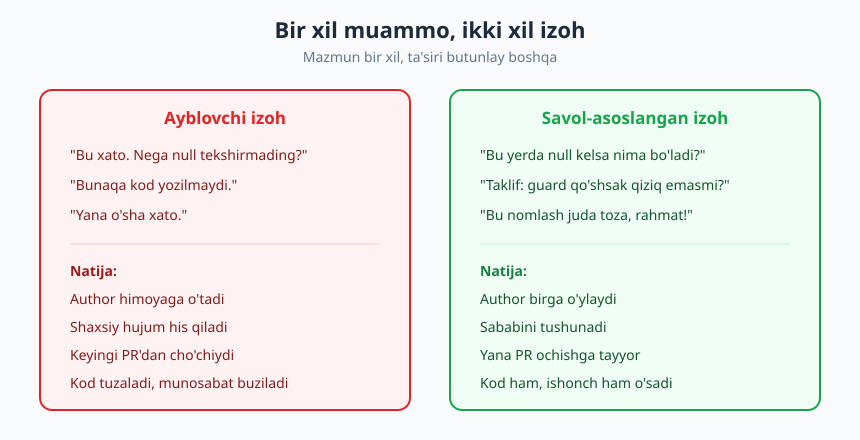
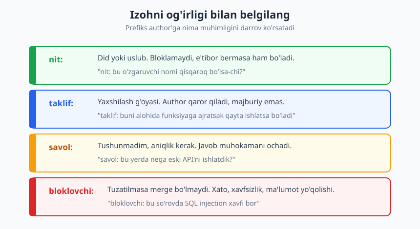
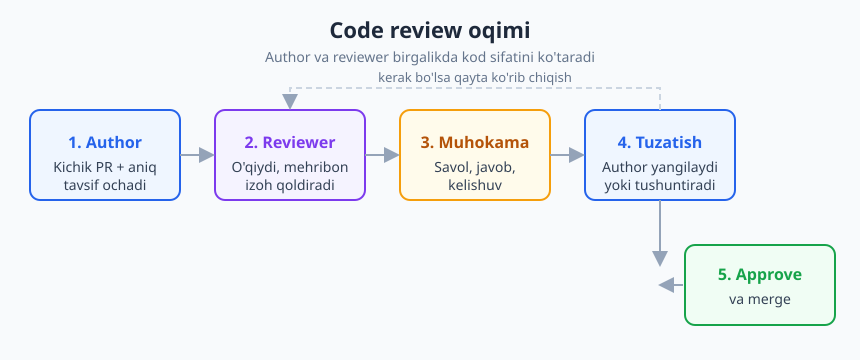

# 15 — Code review: texnik va inson tomoni

[⬅️ Oldingi: 14 — Jamoada ishlash va psixologik xavfsizlik](./14-jamoada-ishlash-xavfsizlik.md) · [🏠 README](./README.md) · [Keyingi: 16 — Nizolarni hal qilish va qiyin suhbatlar ➡️](./16-nizolarni-hal-qilish.md)

---

> **Bu bobda:** code review'ni faqat "xato qidirish" emas, balki sifat, bilim ulashish va umumiy egalikni quradigan **hamkorlik jarayoni** sifatida ko'rasiz. Yaxshi review izohini yozishni (aniq, mehribon, harakatga yo'naltirilgan), muhim muammoni nitpick'dan ajratishni (**Conventional Comments** uslubi), Gerald Weinberg'ning **ego'siz dasturlash** (egoless programming) g'oyasini va reviewer hamda author uchun etiketni o'rganasiz.
>
> **Halollik / Eslatma:** code review'ning texnik qismi (bug, xavfsizlik, dizayn) ko'p kitobda bor — bu bob asosan **inson tomoniga** qaraydi, chunki aynan shu yerda ko'pchilik qoqiladi: bilimi yetarli, lekin review'da odamni ranjitadi yoki o'zi ranjib qoladi. Ohangni o'zgartirish — bir bobdan keyin "tugaydigan" emas, har PR'da mashq qilinadigan ko'nikma.

---

## Code review nima uchun kerak

Ko'pchilik code review'ni bitta maqsad bilan tasavvur qiladi: **xato topish.** Go'yo reviewer — bu eshik oldidagi qorovul, kodni prod'ga o'tkazmaslik uchun turibdi. Bu tasavvur ham noto'g'ri, ham zararli: u review'ni "men topdim — sen xato qilding" o'yiniga aylantiradi, bu yerda esa g'olib va mag'lub bor.

Aslida code review bir vaqtning o'zida **to'rtta** ish qiladi va xato topish — ulardan faqat bittasi:

- **Sifat.** Ha, review bug, dizayn nuqsoni, chetga chiqqan holatlarni (edge case) ushlaydi. Lekin "ikkinchi juft ko'z" bundan kengroq: kod o'qiladigan, qo'llab-quvvatlanadigan bo'lishini ham ta'minlaydi.
- **Bilim ulashish.** Review — jamoadagi eng arzon va eng tabiiy o'qitish vositasi. Junior senior'ning izohidan o'rganadi; senior junior yozgan yangi kutubxonadan xabar topadi. Kod orqali butun jamoa bir-birini o'qitadi.
- **Umumiy egalik (collective ownership).** PR'ni boshqa odam ko'rib chiqsa, kod endi faqat bitta odamning "boshida" qolmaydi. Muallif kasal bo'lsa, ketsa yoki shunchaki unutsa — yana kamida bitta odam o'sha kodni ko'rgan, tushunadi. Bu — avtobus omili (bus factor) muammosiga davo.
- **Mualliflik mas'uliyati.** Kodingizni boshqa odam o'qishini bilsangiz, siz uni boshqacha yozasiz — toza, izohli, tushunarli. Review'ning shu "kuzatilayotganman" effekti hatto izoh yozilmasdan oldin sifatni oshiradi.

> **Eslatma:** review'ning maqsadi — **kodni yaxshilash**, author'ni "tuzatish" emas. Bu farq nozik, lekin ohangda butunlay seziladi. Birinchi holatda siz va author bir tomonda, muammo qarshi tomonda turasiz. Ikkinchisida siz author'ga qarshi turasiz.

Shuning uchun bu kitobda code review IV qism — "Jamoa va hamkorlik" — ichida turibdi, "muhandislik ko'nikmalari" emas. Texnikasi muhim, lekin review'ni buzadigan yoki tuzatadigan narsa — odamlar orasidagi munosabat.

---

## Yaxshi review izohi yozish

Bitta review izohi — kichik xabar. Lekin u har kuni o'nlab marta yoziladi, va uning ohangi jamoa madaniyatini sekin-asta shakllantiradi. Yaxshi izohning uch sifati bor: **aniq, mehribon, harakatga yo'naltirilgan.**

### Buyruq emas — savol va taklif

Eng kuchli o'zgarish: tasdiq (hukm) o'rniga savol bering. Savol author'ni mudofaaga emas, birga o'ylashga taklif qiladi.

> **❌ Hukm:** "Bu xato. Bu yerda null'ni tekshirmagansan."
>
> **✅ Savol:** "Bu yerda `user` null bo'lib kelsa nima bo'ladi? Men shu yo'lni o'tkazib yuborgandirman."

Ikkinchi variant bir nechta ishni qiladi. Birinchidan, u author'ga "balki sen haqsan, men chalkashdim" deydigan joy qoldiradi — kamtarlik. Ikkinchidan, agar author haqiqatan null holatni boshqargan bo'lsa-yu, siz ko'rmagan bo'lsangiz, savol sizni noqulay ahvolga solmaydi. Uchinchidan, javob author'ning o'zini muammoni topishga olib keladi — bu eng yaxshi o'rganish.

Albatta, har izoh savol bo'lishi shart emas. Ba'zida fakt — fakt. Lekin **standart rejim — savol va taklif**, hukm esa istisno.

### Sababini tushuntiring

"Buni o'zgartir" — bu buyruq. "Buni o'zgartir, **chunki...**" — bu o'qitish. Sabab bo'lmasa, author taklifni ko'r-ko'rona bajaradi yoki bahslashadi. Sabab bo'lsa, u qoidani tushunadi va keyingi safar o'zi qo'llaydi.

> **❌ Sababsiz:** "Bu yerda `try/catch` ishlatma."
>
> **✅ Sababli:** "taklif: bu yerda `try/catch` butun blokni o'rab oladi, shuning uchun haqiqiy xato ham yutilib ketishi mumkin. Faqat tashqi chaqiruvni o'rasak, qolgan buglar ko'rinib qoladi."

### Yaxshi kodni ham maqtang

Review faqat tuzatish ro'yxati bo'lsa, author har PR'dan keyin o'zini yomon his qiladi — go'yo u faqat xato qiladi. Aslida kodda yaxshi joylar ham bor. Ularni **aytib o'ting.** Bu sun'iy xushomad emas: aniq maqtov ("bu test holatlari juda to'liq, rahmat") author'ga nima to'g'ri ekanini o'rgatadi va review'ni bir tomonlama hujumdan ikki tomonlama suhbatga aylantiradi.

> **Diqqat:** maqtov ham aniq bo'lsin. "Yaxshi PR" — quruq. "Bu xatoni alohida funksiyaga ajratishing o'qishni ancha osonlashtirdi" — author aniq nimani takrorlashni biladi.

### Kichik dialog namunasi

Yomon va yaxshi review qanday ko'rinishini ko'raylik. Bitta muammo — funksiya juda uzun:

> **❌ Yomon ohang**
>
> **Reviewer:** "Bu funksiya juda uzun va chalkash. O'qib bo'lmaydi."
> **Author** (ichida): *"Demak men yomon kod yozaman."* (tashqarida himoyaga o'tadi yoki jim bo'ladi)

> **✅ Yaxshi ohang**
>
> **Reviewer:** "taklif: bu funksiya bir nechta ishni qilyapti (validatsiya + saqlash + xabar yuborish). Ularni alohida funksiyalarga bo'lsak, har birini test qilish osonroq bo'lardi. Sen qanday fikrdasan?"
> **Author:** "Rozi, validatsiyani ajrataman. Xabar yuborishni shu yerda qoldirsam maylimi? U faqat shu joyda ishlatiladi."
> **Reviewer:** "Albatta, mantiqiy. Rahmat!"

Ikkinchi dialogda muammo bir xil, lekin u **hamkorlikka** aylandi: ikkalasi ham kodga qaradi, author qaror jarayonida ishtirok etdi, kelishmovchilik (xabar yuborish) hurmat bilan hal bo'ldi.

Bu ohangni qabul qila olish — bevosita psixologik xavfsizlikka bog'liq, biz [14-bobda](./14-jamoada-ishlash-xavfsizlik.md) ko'rgan. Xavfsiz jamoada author savol bera oladi va bahslashadi; xavfsiz bo'lmaganida esa jim rozi bo'lib qo'yadi — bu esa o'rganishni o'ldiradi.

---

## Muhim vs nitpick: izohni belgilang

Review'dagi eng katta sirli azob — author barcha izohni **bir xil og'irlikda** ko'radi. "O'zgaruvchi nomi qisqaroq bo'lsa-chi" izohi va "bu yerda SQL injection bor" izohi bir xil ko'rinishda turadi. Author qaysi biri majburiy, qaysi biri ixtiyoriy ekanini bilmaydi — natijada yo hammasini muhim deb stress qiladi, yo hammasini bir xil e'tiborsiz qoldiradi.

Yechim oddiy: **har izohni og'irligi bilan belgilang.** Bu g'oya **Conventional Comments** deb nomlangan yengil konvensiyada rasmiylashtirilgan — izoh boshiga uning turini bildiruvchi qisqa yorliq qo'yiladi.

Amalda foydali to'rt belgi:

| Belgi | Ma'nosi | Author nima qiladi |
|---|---|---|
| `nit:` | Did/uslub, mayda narsa | Xohlasa o'zgartiradi, e'tibor bermasa ham mayli |
| `taklif:` | Yaxshilash g'oyasi | O'ylab ko'radi, qaror o'zida — majburiy emas |
| `savol:` | Tushunmadim, aniqlik kerak | Javob beradi; muhokama ochiladi |
| `bloklovchi:` | Merge'ni to'xtatadigan muammo | Tuzatishi shart — xato, xavfsizlik, ma'lumot yo'qolishi |

Bitta `nit:` prefiks butun ohangni o'zgartiradi. "O'zgaruvchini qayta nomla" — buyruqday eshitiladi. "nit: o'zgaruvchini qayta nomlasak qanday bo'larkin?" — author darrov tushunadi: bu majburiy emas, faqat fikr.

> **Trade-off:** ko'p reviewer'ning yashirin odati — nitpick'lar bilan PR'ni bosib tashlash. Yigirmata `nit:` ham author'ni charchatadi. Yaxshi qoida: **agar nit shunchalik mayda bo'lsa, uni aytmaslik ham mumkin** — yoki bittasini misol qilib aytib, "qolganlari ham shunaqa" deb o'tib keting. Review — muhim narsalar uchun, har vergul uchun emas.

### Did urushini avtomatlashtiring

Review izohlarining katta qismi — formatlash, bo'sh joy, qator uzunligi, import tartibi. Bular ustida odam vaqt sarflashi — isrof. Bundan ham yomoni, bu izohlar shaxsiy did urushiga aylanadi: "men tab yoqtiraman" / "men bo'shliq yoqtiraman".

Yechim — bu masalalarni **odamdan olib, mashinaga bering.** Linter va formatter (avtomatik formatlovchi) did masalasini bir marta, butun jamoa uchun hal qiladi: endi "to'g'ri stil" — bu konfiguratsiyada yozilgan narsa, hech kimning didi emas. Reviewer shunda asosiy ishga — mantiq, dizayn, xavfsizlik — diqqat qaratadi.

> **Eslatma:** "kompyuter aytdi" — bu hech kimni ranjitmaydi. Linter "qator 80 belgidan oshdi" deganida, bu shaxsiy emas. Aynan shu narsa formatter'ni shunday qimmatli qiladi: u eng ko'p uchraydigan, eng ahamiyatsiz va eng ko'p janjal chiqaradigan izohlarni butunlay yo'qotadi.

---

## Ego'siz dasturlash

1971-yilda **Gerald Weinberg** "The Psychology of Computer Programming" (Dasturlashning psixologiyasi) kitobida bugun ham markaziy bo'lib qolgan g'oyani kiritdi: **egoless programming** — ego'siz dasturlash.

Weinberg shu narsani ko'rsatdi: ko'p dasturchi o'z kodini o'zining bir qismi, o'z aqlining isboti deb ko'radi. Natijada, kodga qilingan har qanday tanqid — shaxsga qilingan hujumday his qilinadi. Bunday dasturchi xatosini berkitadi, boshqaga kodini ko'rsatmaydi, review'da har izohga qarshi kurashadi. Bu — o'sishning eng katta to'sig'i.

Ego'siz dasturlashning markaziy g'oyasi bitta jumlada: **kod — bu siz emas.**

Sizning qiymatingiz — kod yozgan **bitta lahzangizda** emas, balki o'rganish va yaxshilanish qobiliyatingizda. Kodda xato topilishi — sizning yomon dasturchi ekaningizni emas, balki o'sha kod parchasi hali tugamaganini bildiradi. Bu farq — junior'ni senior'dan ajratib turadigan ichki pozitsiya.

Bu ikki tomonga ishlaydi:

- **Reviewer sifatida:** izohingizni **kodga** qarating, shaxsga emas. "**Sen** null'ni o'tkazib yubording" o'rniga "**bu funksiyada** null holati ko'rinmayapti". Birinchisi ayblaydi, ikkinchisi muammoni ko'rsatadi. So'z — kichik, ta'sir — katta.
- **Author sifatida:** o'z kodingizga tanqidni **mudofaasiz** qabul qiling. Bu eng qiyini va bevosita [13-bobdagi](./13-feedback-berish-qabul.md) feedback qabul qilish ko'nikmasiga tayanadi: birinchi instinkt — himoyalanish ("lekin men shunday qildim, chunki..."), lekin to'g'ri harakat — avval **tinglash**, savol bersa tushunish, keyin javob berish.

> **Diqqat:** ego'siz dasturlash "his-tuyg'uni o'ldir" degani emas. Kodingiz tanqid qilinganida noxush bo'lish — normal. Maqsad — o'sha noxushlikni **mudofaaga aylantirmaslik**. His paydo bo'ladi, lekin u sizning javobingizni boshqarmaydi.

### Author va reviewer — bir jamoada

Eng zararli xato — review'ni **jang** deb ko'rish: reviewer hujum qiladi, author himoyalanadi. Aslida ikkalasining ham bitta maqsadi bor: **eng yaxshi kodni birga chiqarish.** Agar review oxirida author o'rgangan bo'lsa va kod yaxshilangan bo'lsa — ikkalasi ham yutdi. "Kim haq edi" degan savol umuman noto'g'ri savol.

| Review = jang | Review = hamkorlik |
|---|---|
| Reviewer: "men topdim, sen xato qilding" | Reviewer: "keling, bu joyni birga ko'ramiz" |
| Author: har izohga qarshi kurashadi | Author: tinglaydi, savol beradi, kelishadi |
| G'olib va mag'lub bor | Kod va jamoa yutadi |
| Ohang: ayblovchi | Ohang: hamkor |

---

## Reviewer va author etiketi

Yaxshi review — ikki tomonning birgalikdagi mas'uliyati. Quyida har tomon uchun amaliy qoidalar.

### Author etiketi (review'ni osonlashtirish)

- **Kichik PR bering.** 50 qatorlik PR'ga puxta review olasiz; 2000 qatorlik PR'ga "menimcha yaxshi, LGTM" olasiz. Reviewer 400 qatordan keyin charchaydi va xatolarni ko'rmay qo'yadi. Kichik PR — author va reviewer uchun ham sovg'a.
- **Kontekst bering.** PR tavsifida **nima** o'zgardi, **nega** kerak, **qanday** sinab ko'rganingizni yozing. Reviewer kontekstni qidirib vaqt sarflamasin. Yaxshi tavsif — review'ning yarmi.
- **O'zingizni avval review qiling.** PR ochishdan oldin o'z diff'ingizni o'qing. Ko'p mayda xato (debug log qoldirib ketish, izoh) shu yerda ushaladi — reviewer'ning vaqtini muhim narsaga qoldiring.
- **Tez javob bering.** PR uzoq ochiq tursa, eskiradi, konflikt chiqadi, reviewer kontekstini unutadi. Review'ga javob — prioritet ishlardan biri.
- **Kelishmovchilikni hurmat bilan hal qiling.** Rozi bo'lmasangiz — bu normal. Lekin "yo'q" o'rniga "men buni shunday qildim, chunki X. Sen Y'ni nazarda tutyapsanmi?" deng. Agar kelishuv bo'lmasa — buni keyingi bobda ko'ramiz: [16-bob](./16-nizolarni-hal-qilish.md) qiyin suhbat va "disagree and commit" haqida.

### Reviewer etiketi

- **Tez ko'rib chiqing.** Sizning bir kunlik kechikishingiz author'ni bloklaydi. Imkon bo'lsa, PR'ni bir necha soat ichida ko'ring.
- **Diqqatni muhimga qarating.** Avval dizayn va mantiqni ko'ring, keyin mayda narsalarni. Agar dizaynda katta muammo bo'lsa, vergullar ahamiyatsiz.
- **Aniq harakat so'rang.** "Bu yaxshi emas" — author nima qilishni bilmaydi. "Buni shunday qilsak yaxshiroq bo'lar edi: ..." — aniq.
- **Approve qilishdan qo'rqmang.** Mukammal kod yo'q. Agar kod yetarlicha yaxshi bo'lsa va qolgan izohlar `nit:` bo'lsa — approve qiling, author o'zi hal qilsin. Har vergulni tuzatguncha PR'ni ushlab turish — sekinlatadi va author'ni charchatadi.

> **Eslatma — "review" ≠ "perfectsiyaga majburlash".** Review'ning maqsadi — kodni *yetarlicha yaxshi va xavfsiz* qilish, sizning shaxsiy idealingizga moslashtirsh emas. Agar author boshqacha, lekin ishlaydigan yo'l tanlagan bo'lsa — bu sizning uslubingizdan farq qilgani uchungina bloklovchi emas.

> **Texnik muloqot bog'lanishi:** review izohi ham yozma muloqotning bir turi. Aniqlik, qisqalik, ohang — [9-bobdagi](./09-texnik-muloqot-asoslari.md) texnik muloqot tamoyillari shu yerda to'liq qo'llaniladi: auditoriyani (author'ni) bil, sababini ayt, abstraksiya darajasini moslang.

---

## Asosiy g'oyalar (bobni qisqacha)

- **Code review faqat xato topish emas** — u bir vaqtning o'zida **sifat**, **bilim ulashish**, **umumiy egalik** va **mualliflik mas'uliyatini** quradi. Maqsad — kodni yaxshilash, author'ni "tuzatish" emas.
- Yaxshi izoh **aniq, mehribon, harakatga yo'naltirilgan**. Standart rejim — **hukm emas, savol va taklif**; doimo **sababini tushuntiring** va yaxshi kodni ham aniq **maqtang**.
- **Conventional Comments** uslubida har izohni og'irligi bilan belgilang: **`nit:` / `taklif:` / `savol:` / `bloklovchi:`** — author qaysi biri majburiy ekanini darrov ko'radi.
- **Did urushini avtomatlashtiring**: linter va formatter formatlash izohlarini odamdan olib, mashinaga beradi — "kompyuter aytdi" hech kimni ranjitmaydi.
- **Ego'siz dasturlash** (Gerald Weinberg, 1971): **kod — bu siz emas**. Izohni shaxsga emas, **kodga** qarating; tanqidni **mudofaasiz** qabul qiling.
- **Author etiketi**: kichik PR, yaxshi tavsif, tez javob, kelishmovchilikni hurmat bilan. **Reviewer etiketi**: tez ko'rib chiq, muhimga qarat, aniq harakat so'ra, approve'dan qo'rqma.
- Review — **hamkorlik, jang emas.** "Kim haq edi" emas, "kod va jamoa yutdimi" — to'g'ri savol shu.

---

## Mashqlar

### Oson

**1-mashq.** Quyidagi qo'pol review izohini qayta yozing. Uni savol yoki taklif shakliga keltiring, sababini qo'shing va kerak bo'lsa `nit:`/`taklif:`/`bloklovchi:` belgi bilan belgilang:
> "Bu kod juda yomon. Bunday qilinmaydi. Hammasini qaytadan yoz."

**2-mashq.** O'tgan oyda siz olgan (yoki bergan) bitta review izohini eslang. U "jang" ohangida edimi yoki "hamkorlik" ohangida? Uni qarama-qarshi ohangda qayta yozib ko'ring.

### O'rta

**3-mashq.** Quyidagi 4 ta izohni og'irligi bo'yicha (`nit:` / `taklif:` / `savol:` / `bloklovchi:`) belgilang va tartiblang — qaysi biri avval e'tibor talab qiladi?
> a) "Bu o'zgaruvchini `data` emas, `userList` desak yaxshiroq."
> b) "Bu funksiya foydalanuvchi parolini log'ga yozyapti."
> c) "Bu yerda nega `for` o'rniga `while` ishlatding?"
> d) "Bu mantiqni alohida funksiyaga ajratsak, qayta ishlatsa bo'lardi."

**4-mashq.** Siz reviewer'siz va author'ning PR'ida 18 ta mayda formatlash muammosi (bo'sh joy, qator uzunligi) bor. Bularning hammasini izoh qilib yozasizmi? Yo'q bo'lsa — nima qilasiz? Yondashuvingizni 2-3 jumlada yozing.

### Qiyin

**5-mashq.** O'zingiz uchun **author self-review nazorat ro'yxati** tuzing — PR ochishdan oldin o'zingizdan so'raydigan 6-8 ta savol (masalan: "Debug log'larni o'chirdimmi?", "Tavsifda 'nega' yozilganmi?"). Uni keyingi PR'ingizda haqiqatan ishlating.

**6-mashq.** Siz author'siz. Reviewer sizning dizayningizni tanqid qildi va siz **rozi emassiz** — sizning yo'lingiz to'g'ri deb o'ylaysiz. Ego'siz dasturlash va hamkorlik tamoyillariga amal qilib, qanday javob yozasiz? Javobingizni real izoh shaklida yozing (3-5 jumla).

Yechimlar / Namunaviy yondashuvlar

### 1-mashq yechimi
Asl izoh shaxsga hujum qiladi ("juda yomon"), aniq harakat bermaydi va butun ishni rad etadi. Qayta yozish — muammoni ajrating, sababini ayting, yo'l ko'rsating:
> "Bu funksiya bir nechta ishni bajaryapti, shuning uchun o'qish va test qilish qiyinlashyapti. **taklif:** uni 2-3 kichik funksiyaga bo'lsak, har birini alohida sinab ko'rsa bo'lardi. Validatsiya qismidan boshlasak qanday bo'larkin?"
Agar muammo haqiqatan jiddiy (masalan ishlamaydigan mantiq) bo'lsa, `bloklovchi:` qo'shib aniq nuqtani ko'rsating — lekin baribir ohang hamkorlik bo'lib qoladi.

### 2-mashq yechimi
Bunda "to'g'ri javob" yo'q — maqsad ohangni sezishni o'rganish. Tipik farq: "jang" ohangida "**sen** ...", buyruq, sababsiz; "hamkorlik" ohangida "**bu kodda** ...", savol/taklif, sabab bilan. Agar siz bergan izohingizni qayta o'qib uyalsangiz — bu yaxshi belgi: siz endi farqni ko'ryapsiz. Tipik kashfiyot: ko'p izoh sababini yozmaslik tufayli buyruqday eshitilgan.

### 3-mashq yechimi
Tartib — eng muhimdan:
1. **`bloklovchi:` (b)** — parolni log'ga yozish jiddiy xavfsizlik muammosi, merge bo'lmasligi kerak. Bu birinchi.
2. **`savol:` (c)** — `while` vs `for` tanlovini tushunish kerak; balki sabab bor, balki yo'q. Javob muhokamani ochadi.
3. **`taklif:` (d)** — qayta ishlatish foydali, lekin majburiy emas; author qaror qiladi.
4. **`nit:` (a)** — nomlash didga oid, eng kam og'irlik. E'tibor bermasa ham bo'ladi.

### 4-mashq yechimi
18 ta mayda formatlash izohini qo'lda yozish — isrof va author'ni charchatadi. Yaxshi yondashuv:
- **Avtomatlashtir**: agar loyihada linter/formatter yo'q bo'lsa, asosiy taklif — uni qo'shish. Shunda bu izohlar butunlay yo'qoladi va kelajakda ham takrorlanmaydi.
- Agar shu PR uchun zarur bo'lsa: bittasini misol qilib `nit:` bilan ko'rsating ("nit: bu yerda qator uzun; loyihada formatter yo'q ekan, bir marta yo'lga qo'ysak shu turdagi izohlar yo'qoladi") — qolganini birma-bir yozmang.
- Asosiy g'oya: did/format — odamning emas, mashinaning ishi.

### 5-mashq yechimi
Namunaviy nazorat ro'yxati (o'zingiznikiga moslang):
1. Diff'ni boshidan oxirigacha o'zim o'qib chiqdimmi?
2. Debug log, `console.log`, vaqtinchalik kod qoldimi?
3. Tavsifda **nima**, **nega**, **qanday sinaganim** yozilganmi?
4. PR yetarlicha kichikmi? (Katta bo'lsa, bo'lib yuborsam bo'ladimi?)
5. Yangi kodga test qo'shdimmi yoki nega yo'qligini tushuntirdimmi?
6. Chetga chiqqan holatlar (null, bo'sh, xato) boshqarilganmi?
7. Nomlash va izohlar boshqa odam uchun tushunarlimi?
8. Maxfiy ma'lumot (parol, token) tasodifan qo'shib yuborilmaganmi?
Bu ro'yxat reviewer'ning vaqtini muhim narsalarga qoldiradi.

### 6-mashq yechimi
Kalit — pozitsiyani **mudofaa** emas, **birga tekshirish** sifatida ifodalash. Avval reviewer'ning fikrini tushunganingizni ko'rsating, keyin o'z sababingizni va savol bilan yakunlang:
> "Sening fikringni tushundim — `B` yondashuv bu yerda tozaroq ko'rinishi mumkin. Men `A`'ni quyidagi sabab bilan tanladim: u tashqi servisga qaramlikni kamaytiradi va kelajakdagi `X` o'zgarish uchun moslashuvchanroq. Lekin men `B`'ning afzalligini to'liq ko'rmayotgan bo'lishim mumkin — sen qaysi muammoni hal qilishni nazarda tutyapsan? Agar `B` real xavfni oldini olsa, men o'z qarorimni qayta ko'raman."
Bu javob ego'siz: u "men haqman" demaydi, balki sababini ochadi va o'zgarishga ochiq qoladi. Agar kelishuv baribir bo'lmasa — bu [16-bobning](./16-nizolarni-hal-qilish.md) mavzusi (disagree and commit).

---

[⬅️ Oldingi: 14 — Jamoada ishlash va psixologik xavfsizlik](./14-jamoada-ishlash-xavfsizlik.md) · [🏠 README](./README.md) · [Keyingi: 16 — Nizolarni hal qilish va qiyin suhbatlar ➡️](./16-nizolarni-hal-qilish.md)
