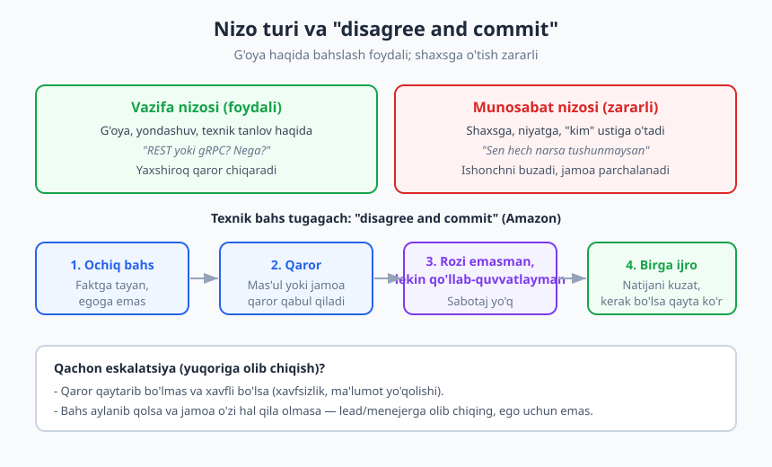
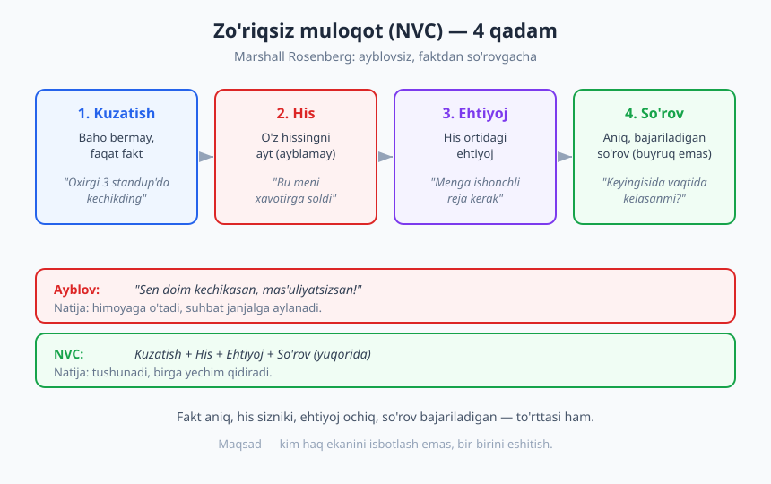
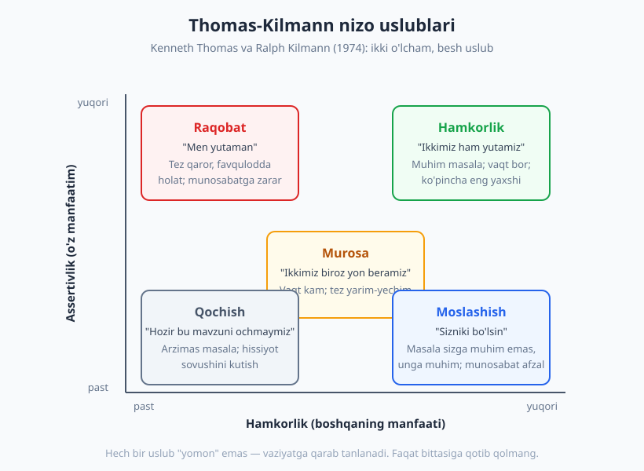

# 16 — Nizolarni hal qilish va qiyin suhbatlar

[⬅️ Oldingi: 15 — Code review: texnik va inson tomoni](./15-code-review-inson-tomoni.md) · [🏠 README](./README.md) · [Keyingi: 17 — Masofaviy ish va taqsimlangan jamoa ➡️](./17-masofaviy-ish-jamoa.md)

---

> **Bu bobda:** nizoning nima ekanini va nega u muqarrar ekanini ko'ramiz; vazifa nizosini munosabat nizosidan ajratamiz; Marshall Rosenberg'ning zo'riqsiz muloqot (NVC) to'rt qadamini, Harvard'ning "qiyin suhbat" uch qatlamini va Thomas-Kilmann'ning besh nizo uslubini o'rganamiz; nihoyat "disagree and commit" tamoyili bilan texnik kelishmovchilikni qanday yopishni ko'ramiz.
>
> **Halollik / Eslatma:** bu ko'nikma faqat o'qishdan o'smaydi — har bir ramka faqat real, hayajonli suhbatda sinaganda ish beradi. Bu yerdagi dialoglar "ssenariy" emas, balki naqsh: o'z so'zingizni topishingiz kerak. Ba'zi nizolar (toksiklik, suiiste'mol) bu ramkalardan tashqarida — ularda chegara qo'yish va kerak bo'lsa HR/menejer kerak bo'ladi.

---

## Nizo nega muqarrar — va nega bu yomon emas

Bir necha kishi bitta natija uchun ishlasa, ular albatta turli yo'lni tanlaydi. Sizning fikringizcha kodni hozir refactor qilish kerak; hamkasbingizcha — keyin. Siz testni avval yozasiz; u keyin. Siz "tez yetkazib berish" muhim deysiz; u "to'g'ri qilish" muhim deydi. Bu — nizo. Va u **jamoa sog'lom ekanining belgisi**, kasallik emas.

Nizosiz jamoa ikki holatda bo'ladi: yo hamma bir xil o'ylaydi (deyarli imkonsiz), yo odamlar o'z fikrini aytishdan qo'rqadi. Ikkinchisi xavfli — bu psixologik xavfsizlik yo'qligining alomati (buni [14-bobda](./14-jamoada-ishlash-xavfsizlik.md) ko'rgan edik). Demak maqsad nizoni **yo'q qilish** emas. Maqsad — uni **sog'lom o'tkazish**: g'oyalar to'qnashsin, shaxslar emas.

> **Eslatma:** "Sog'lom nizo" — bu yumshoq, hammaga yoqadigan suhbat degani emas. Bu o'tkir, hatto noqulay bo'lishi mumkin. Farq mavzudasiz: bahs **muammo** ustidami yoki **odam** ustida.

### Vazifa nizosi va munosabat nizosi

Tashkiliy psixologiyada nizoni ikki turga ajratish keng tarqalgan: **vazifa nizosi** (task conflict) va **munosabat nizosi** (relationship conflict).

- **Vazifa nizosi** — *ish, g'oya, yondashuv* haqida. "Bu API'ni qanday dizayn qilamiz?", "Bu deadline real'mi?", "Mikroservis kerakmi yoki monolit yetarlimi?" Bunday nizo — *foydali*. U turli nuqtai nazarni stol ustiga olib chiqadi, ko'r nuqtalarni ochadi va ko'pincha yakka qarordan yaxshiroq natija beradi.
- **Munosabat nizosi** — *shaxs, niyat, xarakter* haqida. "Sen hech narsa tushunmaysan", "U doim o'zinikini o'tkazadi", "Bu odam bilan ishlab bo'lmaydi." Bunday nizo deyarli har doim *zararli*. U ishonchni yemiradi, jamoani guruhlarga bo'ladi va energiyani ishdan o'g'irlaydi.

Eng katta xavf — **vazifa nizosi munosabat nizosiga aylanib ketishi**. "Men bu dizaynga qo'shilmayman" (vazifa) tez orada "Sen yomon muhandissan" (munosabat) ga aylanishi mumkin, agar ehtiyot bo'lmasangiz.

### "Yaxshi niyat faraz qil" (assume good intent)

Aylanishning oldini oladigan eng kuchli odat — **yaxshi niyat faraz qilish** (assume good intent / assume positive intent). Hamkasbingiz noto'g'ri qaror qilganida miyangiz birinchi taklif qiladigan tushuntirish ko'pincha eng yomoni bo'ladi: "U meni mensimadi", "Atayin qildi". Lekin ko'p hollarda haqiqat zerikarli: u shoshqaloqlik qildi, kontekstni bilmadi yoki boshqa muammo bilan band edi.

> ❌ **Yomon:** "U mening kommentimni e'tiborsiz qoldirdi — demak meni hurmat qilmaydi."
>
> ✅ **Yaxshi:** "U kommentimni ko'rmagan bo'lishi mumkin yoki boshqacha tushungan. So'rab ko'ray: 'Salom, o'sha thread'dagi taklifimni ko'rding mi? Sening fikring qanday?'"

Yaxshi niyat faraz qilish — soddalik emas. Bu *strategiya*: u sizni himoyalanish va hujum siklidan chiqaradi va suhbatni faktga qaytaradi. Agar ko'p marta sinab ham, niyat haqiqatan yomon ekani aniqlansa — o'shanda boshqa chora ko'rasiz. Lekin **birinchi** taxminni yaxshi tomondan boshlang.

## Zo'riqsiz muloqot (NVC): faktdan so'rovgacha

Nizoda eng ko'p uchraydigan xato — **kuzatish (fakt) bilan bahoni (talqin)** aralashtirish. "Sen doim kechikasan" — bu fakt emas, bu ayblov. Unga javoban odam himoyaga o'tadi ("Doim emas-ku!") va suhbat mavzudan chiqib, kim haq ekanini isbotlash jangiga aylanadi.

**Zo'riqsiz muloqot** (Nonviolent Communication, NVC) — psixolog **Marshall Rosenberg** 1960-yillarda ishlab chiqqan va keyinroq "Nonviolent Communication" kitobida bayon qilgan model. U bitta oddiy g'oyaga asoslanadi: har bir his ortida qondirilmagan **ehtiyoj** turadi, va agar siz ayblov o'rniga ehtiyojni aytsangiz, qarshi tomon eshitadi. NVC to'rt qadamdan iborat:

1. **Kuzatish** — baho bermay, faqat kuzatilgan faktni ayting. "Oxirgi 3 standup'ga kechikding."
2. **His** — bu fakt sizda qanday his uyg'otganini ayting (uni boshqaga *yopishtirmay*). "Bu meni xavotirga soldi."
3. **Ehtiyoj** — his ortidagi ehtiyojni ayting. "Menga sprint rejasi ishonchli bo'lishi kerak."
4. **So'rov** — aniq, bajariladigan so'rov bering (buyruq emas). "Keyingi standup'ga vaqtida kela olasanmi? Yoki kech qolsang, oldindan yozasanmi?"

### Misol: ayblovni NVC'ga aylantirish

Tasavvur qiling, hamkasbingiz Pull Request'ingizni uch kun ko'rib chiqmadi va ish to'xtab qoldi. Birinchi xayolga keladigan gap:

> ❌ "Sen mening PR'imni butunlay e'tiborsiz qoldirding. Sening uchun mening ishim muhim emasmi?"

Endi NVC bo'yicha:

> ✅ **Kuzatish:** "PR'imni seshanba kuni ochgandim, hali review bo'lmadi."
> ✅ **His:** "Bu meni biroz tashvishga soldi, chunki bilmayman keyingi qadamni boshlasam bo'ladimi."
> ✅ **Ehtiyoj:** "Menga bu task'ni shu sprint'da yopish muhim."
> ✅ **So'rov:** "Bugun yoki ertaga ko'rib chiqa olasanmi? Yoki band bo'lsang, boshqa kim ko'rishi mumkinligini aytasanmi?"

Farqni sezdingizmi? Birinchi variant ayblov va niyatni o'qishni o'z ichiga oladi ("muhim emasmi?"). Ikkinchisida hech qanday ayblov yo'q — faqat fakt, sizning hissiyotingiz, ehtiyojingiz va aniq so'rov. Qarshi tomonga himoyalanadigan narsa qolmaydi; unga *yordam beradigan* narsa qoladi.

> **Diqqat:** NVC'ni mexanik "skript" sifatida ishlatmang. "Men kuzatyapman-ki..." deb robotdek gapirsangiz, sun'iy chiqadi. Ramka — *o'ylash tarzi*: faktni baholashdan ajrat, hisni o'zingga ol, ehtiyojni och, so'rovni aniq qil. So'zlar tabiiy bo'lsin.

## Qiyin suhbatlar: uchta yashirin qatlam

Ba'zi suhbatlar oldindan bizni hayajonga soladi: ishdan ketish niyatini aytish, hamkasbning ishini tanqid qilish, deadline o'tib ketishini menejerga aytish. Harvard Negotiation Project'dan **Douglas Stone, Bruce Patton va Sheila Heen** "Difficult Conversations: How to Discuss What Matters Most" (1999) kitobida shunday suhbatlarni o'rgandilar. Ularning markaziy topilmasi: har bir qiyin suhbat aslida **uchta suhbatdan** iborat, va biz odatda faqat birinchisini ko'ramiz.

| Qatlam | Savol | Tipik xato |
|---|---|---|
| **Nima bo'ldi** (faktlar) | Kim nima dedi/qildi? Kim aybdor? | "Men haqman, u xato" — ikki tomon ham faktni boshqacha ko'radi |
| **His-tuyg'ular** | Bu meni qanday his qildiradi? | Hissiyotni yashirish yoki, aksincha, otib chiqarish |
| **O'ziga xoslik** (identity) | Bu mening o'zim haqimdagi tasavvurimga nima qiladi? | "Demak men yomon dasturchiman" — ichki xavotir |

**Nima bo'ldi** qatlami eng ko'rinadigani: kim aybdor, kim haq, kim nima dedi. Lekin bu yerda asosiy tuzoq — *har kim faktni o'z burchidan ko'radi* va "haqiqat" deb o'z talqinini biladi. Yechim — ayblash o'rniga har ikki tomon hikoyasini tushunish va "ikkalamiz ham hissa qo'shgan bo'lishimiz mumkin" deb ochiq bo'lish.

**His-tuyg'ular** qatlami ko'pincha yashirin, lekin u suhbatni boshqaradi. Aytilmagan g'azab yoki xafalik gapingizning ohangida chiqib ketadi. Yechim — hissiyotni *aytib* qo'yish ("To'g'risi, bu meni biroz xafa qildi"), lekin uni qurol qilib ishlatmaslik.

**O'ziga xoslik** qatlami eng chuqur va ko'pincha eng og'rituvchisi. Hamkasbingiz "Bu kod sifatsiz" deganida, siz "Demak men yomon dasturchiman" deb eshitishingiz mumkin — chunki bu sizning o'zingiz haqingizdagi tasavvuringizga tegadi. Shuning uchun ba'zi suhbatlar mantiqdan tashqari og'ir keladi: ular bizning *kimligimizga* tegadi.

### Qiyin suhbatga tayyorgarlik

Yaxshi qiyin suhbat *suhbat boshlanmasdan oldin* yutiladi. Amaliy tayyorgarlik:

- **Maqsadni aniqlang.** Nima istayapsiz — odamni "yutish"mi yoki muammoni hal qilish? Agar maqsad "to'g'riligimni isbotlash" bo'lsa, to'xtang.
- **O'z hissa va talqiningizni tan oling.** "Men ham vaqtida aytmadim", "Men ham noaniq yozdim" — kamtarlik suhbatni teng qiladi.
- **Xususiy joy va vaqt tanlang.** Ochiq ofisda yoki umumiy kanalda emas. Maqtov — ommada, tanqid — yakkama-yakka.
- **"Men" tilida gapiring.** "Sen meni chalg'itding" emas, "Men diqqatni yo'qotdim". "Sen-tili" ayblaydi; "men-tili" o'z tajribangizni ulashadi.
- **Birgalikdagi hikoyani taklif qiling.** "Keling, nima bo'lganini birga aniqlaymiz" — bu sizni qarshi emas, *bir tomonda* qiladi.

> **Dialog namunasi.** Lead deadline o'tib ketishini junior'ga aytmoqchi:
>
> **Lead:** "Salom, ikki daqiqa vaqting bormi? Auth task haqida. Men sezdimki, planlangan kun o'tdi, lekin PR hali ochilmadi. (kuzatish) To'g'risi, men bu haqda relizdan oldin gapirmaganimizdan xavotirdaman. (his + ehtiyoj) Nima bo'lyapti — qayerda qotib qoldik?" (ochiq savol, ayblov emas)
>
> **Junior:** "Kechirasiz... OAuth flow kutganimdan murakkab chiqdi, lekin aytishga uyaldim."
>
> **Lead:** "Tushunarli, bu normal — OAuth hammani kaltaklaydi. Endi: bugun birga 30 daqiqa o'tirib, qayeri qoldi ko'ramizmi? Va kelgusida bunday qotib qolsang, ertasi standup'da ayt — bu zaiflik emas, jamoa shu uchun bor."

E'tibor bering: lead ayblamadi, faktni aytdi, o'z xavotirini bo'lishdi, so'rov berdi va junior'ning *o'ziga xosligiga* xavf solmadi ("bu zaiflik emas"). Bu — NVC, qiyin-suhbat qatlamlari va psixologik xavfsizlik birgalikda ishlagani.

## Nizo uslublari: Thomas-Kilmann modeli

Odamlar nizoga turlicha munosabat bildiradi, va siz odatda bittasiga moyilsiz. **Kenneth Thomas va Ralph Kilmann** 1974-yilda Thomas-Kilmann Conflict Mode Instrument (TKI) modelini taqdim etdilar. U xulq-atvorni ikki o'lcham bo'yicha joylashtiradi:

- **Assertivlik** — o'z manfaatingizni qanchalik himoya qilasiz (vertikal o'q).
- **Hamkorlik** — qarshi tomon manfaatini qanchalik hisobga olasiz (gorizontal o'q).

Bu ikki o'qdan beshta uslub kelib chiqadi:

| Uslub | Assertivlik / Hamkorlik | Qachon o'rinli |
|---|---|---|
| **Raqobat** (competing) | Yuqori / Past | Favqulodda holat, tez qaror kerak, prinsipial masala (xavfsizlik) |
| **Hamkorlik** (collaborating) | Yuqori / Yuqori | Masala muhim, vaqt bor, ikki tomon ham yutishi mumkin |
| **Murosa** (compromising) | O'rta / O'rta | Vaqt kam, "yetarlicha yaxshi" yechim kerak, tomonlar teng kuchda |
| **Qochish** (avoiding) | Past / Past | Masala arzimas, hissiyot qizigan — keyinroq qaytish kerak |
| **Moslashish** (accommodating) | Past / Yuqori | Masala sizga muhim emas, unga muhim; munosabat afzal |

Muhim nuqta: **birorta ham uslub "to'g'ri" yoki "noto'g'ri" emas**. Har birining o'rni bor. Production yonayotganida raqobat (tez qaror) to'g'ri; arxitektura tanlovida hamkorlik to'g'ri; rang/formatlash kabi arzimas janjalda qochish yoki moslashish to'g'ri.

Muammo — odamlar bitta uslubga *qotib qolishi*da. Doim raqobat qiladigan odam jamoani charchatadi; doim qochadigan odam muhim masalalarni ko'mib tashlaydi; doim moslashadigan odam o'z fikrini yo'qotadi va ichida g'azab yig'adi. **O'z standart uslubingizni biling** — va vaziyat boshqasini talab qilganda ataylab o'zgartiring. Ko'p texnik bahsda **hamkorlik** eng yaxshi natija beradi, chunki maqsad — yutish emas, eng yaxshi yechimni topish.

## Texnik kelishmovchilik va "disagree and commit"

Texnik bahslar bitmas-tuganmas bo'lishi mumkin. Ikki tajribali muhandis monolit va mikroservis haqida soatlab bahslashishi mumkin — chunki ikkalasining ham haqiqat ulushi bor. Bir paytda bahsni **to'xtatib, qaror qilish** kerak. Aks holda jamoa harakatsiz qoladi ("analysis paralysis").

Bu yerda Amazon'ning mashhur liderlik tamoyili yordam beradi: **"Disagree and commit"** (rozi bo'lmasang ham, qaror chiqqach ortidan tur). Mantiq oddiy:

1. **Ochiq bahslashing.** O'z dalilingizni to'liq, kuchli ifoda eting. Faktga, o'lchovga, foydalanuvchi ehtiyojiga tayaning — egoga emas. Bu bosqichni qisqartirmang: agar fikringizni aytmasangiz, keyin "men aytgandim" deyishga haqqingiz yo'q.
2. **Qaror qabul qiling.** Mas'ul shaxs (tech lead, owner) yoki jamoa qaror qiladi. Qaror chiqdi — bahs yopildi.
3. **Rozi bo'lmasangiz ham, qo'llab-quvvatlang.** Bu eng muhim qadam. "Men hali ham X afzal deb o'ylayman, lekin Y tanlandi — men uni to'liq qo'llab-quvvatlayman" deysiz. **Yashirin sabotaj yo'q** — qarorni ichdan buzish, "men aytgandim"ni kutib o'tirish, yoki yarim ko'ngil bilan ishlash — bularning hammasi jamoani zaharlaydi.
4. **Natijani kuzating.** Qaror noto'g'ri chiqsa, *ma'lumot bilan* qayta ko'rib chiqishni so'rang — "menimcha xato edi" emas, "shu metrikalar ko'rsatyaptiki, qayta baholaylik".

> **Trade-off:** "Disagree and commit" — har doim ham emas. Agar qaror **qaytarib bo'lmas va xavfli** bo'lsa (ma'lumot yo'qoladi, xavfsizlik buziladi, qonun buziladi), "commit" qilmang — **eskalatsiya qiling**. Lekin eskalatsiya egoni qondirish uchun emas, real xavf uchun bo'lsin. Ko'pchilik qaror qaytarib bo'ladigan ("two-way door") turdan — ularda tez qaror va commit yutadi.

Texnik qarorlarni hujjatlash (masalan ADR — Architecture Decision Record) bu jarayonni osonlashtiradi: nima va *nega* tanlangani yozilsa, keyinchalik "kim haq edi" bahsi o'rniga "qaror konteksti shunday edi" hujjati qoladi. Buni [23-bobda](./23-texnik-qaror-tradeoff.md) chuqurroq ko'ramiz.

> **Dialog namunasi.** Standup'dan keyin, retro'da:
>
> **Dilnoza:** "Men hali ham GraphQL'ni REST'ga afzal ko'rardim — frontend uchun yengilroq bo'lardi."
>
> **Tech lead:** "Tushunaman, sening dalilingni eshitdik va u kuchli edi. Lekin jamoa REST'ni tanladi, chunki hozir hamma uni biladi va deadline yaqin. Sen buni qo'llab-quvvatlay olasanmi?"
>
> **Dilnoza:** "Ha, albatta. Kelishdik — REST bilan ketamiz. Faqat: keyingi loyihada GraphQL'ni jiddiy ko'rib chiqaylik, va men buni ADR'ga yozib qo'yaman, dalillar saqlanib qolsin."

Bu — disagree and commit'ning ideal ko'rinishi: fikr aytildi, qaror qabul qilindi, Dilnoza qo'llab-quvvatladi, lekin kelajak uchun eshikni ham ochiq qoldirdi. Hech kim yutmadi yoki yutqazmadi — jamoa oldinga ketdi.

## Nizo qizib ketganda: deeskalatsiya

Ba'zan, eng yaxshi niyatga qaramay, suhbat qizib ketadi — ovoz ko'tariladi, gaplar shaxsga o'tadi. Bunda quyidagilar yordam beradi:

- **Tanaffus oling.** "Keling, 10 daqiqa tanaffus qilaylik va keyin qaytaylik" — bu zaiflik emas, donolik. Qizigan miya yaxshi qaror qilmaydi.
- **Hissiyotni nomlang.** "Menimcha ikkimiz ham hozir biroz asabiymiz" — hissiyotni ochiq aytish uning kuchini kamaytiradi.
- **Umumiy maqsadga qayting.** "Ikkalamiz ham bu loyiha muvaffaqiyatli bo'lishini xohlaymiz, to'g'rimi?" — bu sizlarni qarama-qarshi tomondan bir tomonga qaytaradi.
- **Faol tinglashga o'ting.** Bahslashish o'rniga: "To'g'ri tushundimmi — sen X dan xavotirdasanmi?" Buni [12-bobda](./12-tinglash-savol-berish.md) ko'rgan edik — tinglash nizoni eng tez sovutadigan vositadir.

Agar nizo takrorlanaversa, shaxsiy bo'lib qolsa yoki bir tomon doimo bostirsa — bu endi yakka suhbatdan chiqib, jamoa madaniyati yoki menejer aralashuvini talab qiladigan masala. Bu zaiflik emas; ba'zi nizolarni yakka o'zingiz hal qila olmaysiz, va buni tan olish — yetuklik belgisi.

## Asosiy g'oyalar (bobni qisqacha)

- **Nizo muqarrar va ko'pincha foydali.** Maqsad uni yo'q qilish emas, **vazifa nizosini** (g'oya haqida — foydali) **munosabat nizosiga** (shaxs haqida — zararli) aylanishidan saqlash. Har doim **yaxshi niyat faraz qiling**.
- **Zo'riqsiz muloqot (NVC, Marshall Rosenberg):** kuzatish → his → ehtiyoj → so'rov. **Faktni bahodan ajrating**, hisni o'zingizga oling, ayblov o'rniga ehtiyoj va aniq so'rovni ayting.
- **Har bir qiyin suhbat uch qatlamli** (Stone, Patton, Heen — Harvard): **nima bo'ldi** (faktlar), **his-tuyg'ular** va **o'ziga xoslik** (identity). Eng og'ir suhbatlar bizning *kimligimizga* tegadi.
- **Qiyin suhbatga tayyorlaning:** maqsadni aniqlang, o'z hissangizni tan oling, xususiy joy tanlang, **"men" tilida** gapiring.
- **Thomas-Kilmann besh uslubi** (assertivlik × hamkorlik): raqobat, hamkorlik, murosa, qochish, moslashish. **Birortasi "yomon" emas** — vaziyatga moslang, bittasiga qotib qolmang. **O'z standart uslubingizni biling.**
- **"Disagree and commit" (Amazon):** ochiq bahslash → qaror → rozi bo'lmasangiz ham qo'llab-quvvatlash → kuzatish. **Ma'lumotga tayaning, egoga emas.** Qaytarib bo'lmas xavfli qarorda esa **eskalatsiya** qiling.

## Mashqlar

### Oson

**1-mashq.** Quyidagi ayblovli gaplarni NVC to'rt qadami (kuzatish, his, ehtiyoj, so'rov) bo'yicha qayta yozing:
- (a) "Sen kodni hech qachon hujjatlashtirmaysan."
- (b) "Standup'da meni doim bo'lasan, gapimni tugatmaysan."

**2-mashq.** Thomas-Kilmann beshta uslubini eslang. Quyidagi har bir vaziyatda qaysi uslub eng o'rinli — ayting va bir jumlada asoslang:
- (a) Production'da ma'lumotni o'chiradigan migration deploy bo'lay deyapti.
- (b) Hamkasb o'zgaruvchini `temp` deb nomladi, siz `buffer` afzal ko'rardingiz.
- (c) Ikki haftadan keyin chiqadigan releaz uchun arxitektura tanlovi.

### O'rta

**3-mashq.** O'tgan oydagi *real* nizoingizni eslang (hamkasb, lead yoki guruh chati bilan). Yozib oling: (1) bu vazifa nizosi edimi yoki munosabat nizosi? (2) o'sha paytda Thomas-Kilmann'ning qaysi uslubidan foydalandingiz? (3) endi qaysi uslub yaxshiroq bo'lardi va nega?

**4-mashq.** Bitta qiyin suhbatni (masalan, deadline o'tganini menejerga aytish) "uch qatlam" bo'yicha tahlil qiling. Yozing: (1) **nima bo'ldi** qatlamida har ikki tomon faktni qanday boshqacha ko'rishi mumkin; (2) **his-tuyg'ular** qatlamida siz qanday his qilyapsiz; (3) **o'ziga xoslik** qatlamida bu sizning o'zingiz haqingizdagi qaysi tasavvuringizga tegadi.

### Qiyin

**5-mashq.** Quyidagi "disagree and commit" ssenariysini to'liq dialog sifatida yozing (kamida 6 replika). Vaziyat: siz jamoada test framework sifatida X'ni qattiq targ'ib qildingiz, lekin jamoa Y'ni tanladi. Dialogda ko'rsating: (a) o'z fikringizni qisqa, ego'siz takrorlash; (b) qarorni samimiy qabul qilish; (c) kelajak uchun eshikni ochiq qoldirish; (d) sabotajga o'tmaslik.

**6-mashq.** O'zingizning **standart nizo uslubingizni** aniqlang. Oxirgi 3-4 nizoni eslab, har birida qaysi Thomas-Kilmann uslubini ishlatganingizni yozing. Naqsh bormi? Agar bitta uslubga moyil bo'lsangiz (masalan, doim qochish yoki doim raqobat), o'zingizga bitta aniq savol bering: "U holatda boshqa uslub qanday natija berardi?" Keyingi nizoda ataylab sinab ko'radigan bitta yangi uslubni tanlang.

Yechimlar / Namunaviy yondashuvlar

### 1-mashq yechimi
- **(a)** Kuzatish: "Oxirgi uchta PR'da README va funksiya izohlari yangilanmadi." His: "Bu meni biroz tashvishga soladi." Ehtiyoj: "Yangi qo'shilganlar kodni tez tushunishi men uchun muhim." So'rov: "Keyingi PR'ga qisqa izoh qo'sha olasanmi? Yoki birga 15 daqiqa o'tirib, nimani hujjatlash kerakligini kelishaylikmi?"
- **(b)** Kuzatish: "Bugungi standup'da men gapirayotganda ikki marta gapim bo'lindi." His: "Bu meni biroz noqulay qildi." Ehtiyoj: "Menga fikrimni oxirigacha aytish imkoni kerak." So'rov: "Keyin men tugatguncha kutib, keyin qo'sha olasanmi?"

### 2-mashq yechimi
- **(a)** **Raqobat** — favqulodda, qaytarib bo'lmas xavf. Tez to'xtatish kerak, bahslashishga vaqt yo'q. Bu "disagree and commit" emas, eskalatsiya/to'xtatish holati.
- **(b)** **Qochish** yoki **moslashish** — bu arzimas (bikeshedding). Ikkala nom ham ishlaydi; bunga energiya sarflash isrof. "Sizniki bo'lsin" deng va davom eting.
- **(c)** **Hamkorlik** — muhim, vaqt bor (ikki hafta), ikki tomon ham nima bilishini stol ustiga olib chiqsa, yaxshiroq qaror chiqadi.

### 3-mashq yechimi
"To'g'ri javob" yo'q — bu reflektiv mashq. Yaxshi javob: nizo turini halol aniqlaysiz (ko'pincha biz munosabat nizosi deb o'ylaganimiz aslida yomon boshqarilgan vazifa nizosi bo'lib chiqadi). Standart uslubingizni tan olasiz va muqobilini ko'rasiz. Masalan: "Bu vazifa nizosi edi, lekin men uni shaxsiy qabul qildim. Men qochishni tanladim — indamadim va ichimda g'azab yig'dim. Hamkorlik yaxshiroq bo'lardi: ochiq 'sen X dan xavotirdasanmi?' deb so'rasam, birga yechim topardik."

### 4-mashq yechimi
Namunaviy tahlil (deadline o'tgani): (1) **Nima bo'ldi** — siz "task kutilganidan murakkab chiqdi" deb ko'rasiz; menejer "u o'z vaqtida signal bermadi" deb ko'rishi mumkin. Ikkalasi ham qisman haq. (2) **His** — uyat, tashvish, ehtimol himoyalanish istagi. (3) **O'ziga xoslik** — "demak men ishonchsiz dasturchiman" yoki "men yaxshi baholay olmayman". Aynan shu qatlam suhbatni mantiqdan og'irroq qiladi. Yechim: faktni oldindan ayting, o'z hissangizni tan oling ("oldinroq signal bermaganim xato edi"), va o'ziga-xoslik xavfini kichraytiring ("bitta kech qolgan task meni yomon dasturchi qilmaydi — saboq oldim").

### 5-mashq yechimi
Namunaviy dialog:
> **Siz:** "Men hali ham Vitest'ni afzal ko'rardim — tezroq va konfiguratsiyasi sodda. Lekin dalilimni aytib bo'ldim, eshitildi." *(fikrni ego'siz takrorlash)*
> **Lead:** "Ha, dalillaring kuchli edi. Jamoa Jest'ni tanladi, chunki ko'pchilik uni biladi va mavjud setup bor."
> **Siz:** "Tushunaman, mantiqli. Kelishdik — Jest bilan ketamiz, men ham unga to'liq o'taman." *(samimiy qabul)*
> **Lead:** "Rahmat, bu juda qadrli."
> **Siz:** "Bitta narsa: olti oydan keyin migration og'ir bo'lmasligi uchun, men test'larni framework'ga bog'liq bo'lmaydigan tarzda yozaylik degan edim — buni ADR'ga yozib qo'ysam bo'ladimi?" *(eshikni ochiq qoldirish, sabotaj emas — konstruktiv)*
> **Lead:** "Ajoyib fikr, yoz."

Kalit: hech qayerda "men aytgandim", ohangda xafalik yoki yashirin qarshilik yo'q. Fikr saqlandi, lekin qaror to'liq qo'llab-quvvatlandi.

### 6-mashq yechimi
Bu shaxsiy audit — "to'g'ri javob" yo'q, lekin naqsh juda ochuvchi bo'ladi. Ko'p dasturchilar ikkita uchga moyil: **qochish** (nizodan qo'rqib indamaslik — keyin ichda g'azab to'planadi) yoki **raqobat** (har texnik bahsda yutishga urinish — jamoa charchaydi). Yechim: moyilligingizni nomlash allaqachon yarim yo'l. Keyin "bu vaziyatda boshqa uslub qanday bo'lardi?" degan savolni har nizodan oldin bering. Masalan, doimiy qochuvchi uchun keyingi qadam: bitta kichik nizoda ataylab fikr bildirib ko'rish (hamkorlik). Maqsad — repertuaringizni kengaytirish, bitta uslubni "to'g'ri" deb almashtirib qo'yish emas.

---

[⬅️ Oldingi: 15 — Code review: texnik va inson tomoni](./15-code-review-inson-tomoni.md) · [🏠 README](./README.md) · [Keyingi: 17 — Masofaviy ish va taqsimlangan jamoa ➡️](./17-masofaviy-ish-jamoa.md)
