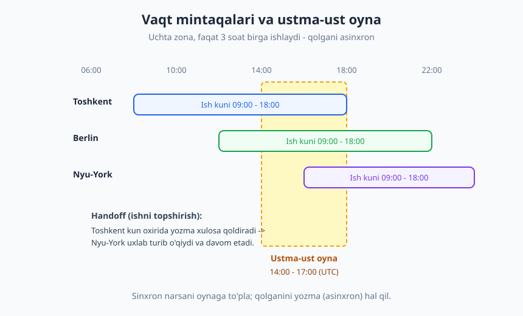
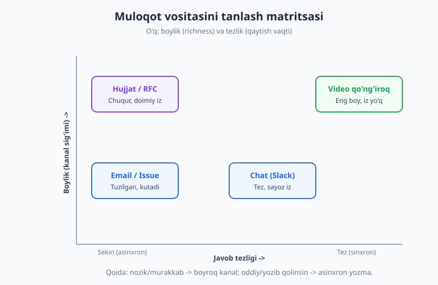
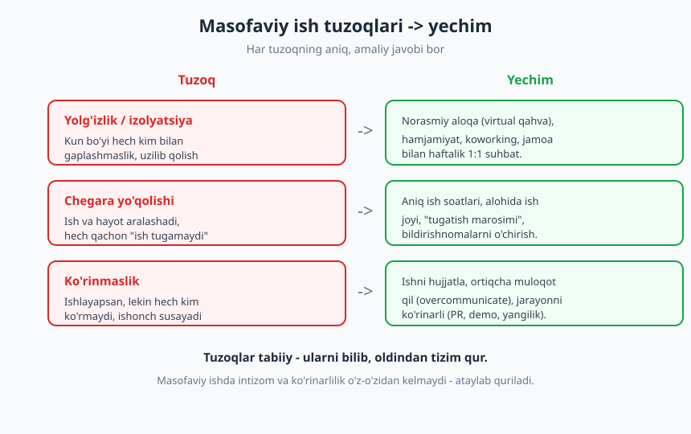

# 17 — Masofaviy ish va taqsimlangan jamoa

[⬅️ Oldingi: 16 — Nizolarni hal qilish va qiyin suhbatlar](./16-nizolarni-hal-qilish.md) · [🏠 README](./README.md) · [Keyingi: 18 — Agile, Scrum va jamoa jarayonlari ➡️](./18-agile-scrum-jarayonlar.md)

---

> **Bu bobda:** bugun ko'p dasturchi masofadan ishlaydi — ayniqsa xalqaro mijoz yoki freelance bilan. Masofaviy ish o'ziga xos ko'nikma talab qiladi: u shunchaki "uydan ishlash" emas. Shu bobda **asinxron-birinchi (async-first)** madaniyatni, **vaqt mintaqalari** bo'ylab ishni topshirish (handoff)ni, masofadan **ishonch qurish**ni va o'zini boshqarish — yolg'izlik, chegara, ko'rinmaslik tuzoqlarini — qanday yengishni o'rganamiz.

> **Halollik / Eslatma:** masofaviy ish hammaga bir xil mos kelmaydi va u "erkinlik" deb sotiladigan reklama emas. U intizom, yozma muloqot va ongli chegara talab qiladi. Bu yerdagi tamoyillar yo'lni ko'rsatadi, lekin har bir jamoaning o'z me'yorlari bor — kuzating va moslang. Masofaviy ishda yaxshi bo'lish — bir kechada emas, oylar amaliyot bilan keladi.

---

## Masofaviy ishning afzalligi va xavfi

Masofaviy ish (remote work) — dasturchilik kasbining eng katta imtiyozlaridan biri. O'zbekistonda yashab, Berlin yoki Nyu-Yorkdagi kompaniyaga ishlash, dunyo bo'ylab freelance mijoz topish, kun tartibini o'zingiz qurish — bularning hammasi endi real. Lekin har bir afzallikning ortida unga juftlangan xavf turadi. Masofaviy ishni ongli boshqarmasangiz, aynan uning kuchli tomonlari sizga qarshi ishlaydi.

| Afzallik | Unga juftlangan xavf |
|---|---|
| **Moslashuvchanlik** — vaqt va joyni o'zingiz tanlaysiz | Chegara yo'qoladi — ish hech qachon "tugamaydi" |
| **Global imkoniyat** — yuqori maoshli xalqaro ish | Vaqt mintaqasi farqi, raqobat, madaniy farq |
| **Diqqat** — ochiq ofis shovqini yo'q | Yolg'izlik, ijtimoiy izolyatsiya |
| **Yo'lga vaqt ketmaydi** — kuniga 1-2 soat tejov | "Doim onlayn" bo'lib qolish bosimi |
| **Avtonomiya** — sizga ishonadilar | Ko'rinmaslik — mehnatingizni hech kim ko'rmaydi |

O'zbekistonlik dasturchi uchun bu jadvalning eng muhim qatori — **global imkoniyat**. Mahalliy bozordan bir necha barobar yuqori maosh, xalqaro tajriba, kuchli muhandislar bilan ishlash imkoni masofaviy ish orqali ochiladi. Lekin u eshik ikki tomonga ham ochiq: siz dunyo bilan raqobat qilasiz, va sizdan **mahalliy ofis xodimidan ko'ra ko'proq mustaqillik va yozma muloqot** kutiladi. Ofisda lead sizning stol ustingizda turib tushuntirib bera oladi; masofada esa siz savolingizni shunday yozishingiz kerakki, boshqa vaqt mintaqasidagi odam bir o'qishda tushunsin.

> **Diqqat:** masofaviy ish o'z-o'zidan "yaxshi" yoki "yomon" emas. U **kuchaytirgich** (amplifier). Agar siz intizomli, yozma muloqotda kuchli, o'zini boshqara oladigan bo'lsangiz — masofa sizni ozod qiladi. Agar tartibsiz, kommunikatsiyada zaif bo'lsangiz — masofa bu zaifliklarni kattalashtiradi. Yaxshi xabar: bularning hammasi o'rganiladigan ko'nikma.

Qolgan bo'limlar aynan shu ko'nikmalarni — afzallikni saqlab, xavfni bartaraf qiladigan amaliy tizimlarni — beradi.

---

## Asinxron-birinchi madaniyat

Masofaviy, ayniqsa vaqt mintaqalari bo'ylab taqsimlangan jamoaning yuragi — **asinxron-birinchi (async-first)** ish uslubi. Bu tushunchani [10-bobda](./10-yozma-asinxron-muloqot.md) batafsil ko'rdik; shu yerda uni masofaviy kontekstga qo'llaymiz.

Eslatib o'tamiz: **sinxron** muloqotda ikki tomon bir vaqtda mavjud (yig'ilish, qo'ng'iroq, jonli chat — javob darhol keladi); **asinxron**da siz xabar qoldirasiz, qarshi tomon o'ziga qulay vaqtda javob beradi (PR izohi, issue, hujjat, Slack thread). Bir ofisda o'tirgan jamoa sinxronga suyanishi mumkin — boshingizni burib so'rasangiz, javob darhol keladi. Taqsimlangan jamoada bu **imkonsiz**: hamkasbingiz uxlayotgan bo'lishi mumkin. Demak, standart rejim **asinxron** bo'lishi shart, sinxron esa — zarur bo'lgandagina.

Async-first masofaviy jamoaning to'rtta tamoyili:

1. **Yetarli kontekst bering.** Asinxron yozuvda siz yonida emassiz — "anavi narsa", "biz kelishganidek" kabi noaniqliklar ishlamaydi. Savol yoki taklifni **o'zicha to'liq** yozing: nima, nega, qaysi havola, qanday qaror kerak. Yaxshi qoida: yozayotganda "agar bu odam menga 8 soat keyin javob bersa, qaytadan so'rashga to'g'ri kelmasligi uchun unga yana nima kerak?" deb o'ylang.
2. **Javobni kutib o'tirmang.** Asinxron yozdingizmi — boring, bloklanmagan boshqa ishni qiling. Odamning darhol javobini kutib Slack'ni har 30 soniyada yangilash — asinxronlikning butun foydasini yo'qotadi. Shuning uchun ishingizni shunday tashkil qilingki, doim **bloklanmaydigan zaxira vazifa** bo'lsin.
3. **Yozma hujjat — haqiqat manbai (single source of truth).** Og'zaki aytilgan qaror masofada yo'qoladi — uni eshitmagan odam bilmaydi. Qaror, kelishuv, sabab — hammasi doimiy, qidiriladigan joyda (issue, hujjat, README) yozilishi kerak. Bu mavzu shunchalik muhimki, unga alohida bob ajratilgan: [24-bob — hujjatlashtirish](./24-hujjatlashtirish.md).
4. **Yig'ilishni kamaytiring.** Har bir sinxron yig'ilish bir nechta odamning **chuqur ish** (deep work — [6-bob](./06-diqqat-chuqur-ish.md)) blokini buzadi, va vaqt mintaqasi farqida kimdir uchun bu yig'ilish yarim tunda bo'ladi. Agar muammoni yozma hal qilib bo'lsa — yig'ilish chaqirmang. Amaliy mezon: "bu yig'ilish o'rniga uch xatboshilik xabar yozsam bo'lmaydimi?"

### Yozma birinchi: aniq misol

Yomon (sinxronga moslangan, masofada ishlamaydi) va yaxshi (asinxronga moslangan) yondashuvni taqqoslaymiz:

> ❌ **Yomon (Slack'da):**
> "Salom, bir narsa so'ramoqchiman, bo'shmisan?"
> *(8 soat o'tadi, hamkasb uyg'onadi, "ha, bo'shman" deydi, siz allaqachon uxlagansiz — yana 8 soat yo'qoladi.)*

> ✅ **Yaxshi (Slack/issue'da):**
> "Salom! To'lov modulida bir savol bor, javobing menga ertaga davom etishga kerak.
> **Kontekst:** Checkout sahifasida `order_total` ba'zan 0 chiqyapti (havola: PR #412, qatorda 88).
> **Savol:** chegirma hisoblanishi `applyDiscount()` dan oldinmi yoki keyinmi bo'lishi kerak edi? Hujjatda topa olmadim.
> **Menga kerak:** ha/yo'q yetadi, kod o'zgartirishi shart emas. Javobingni kutmayman — boshqa task'ga o'taman."

Ikkinchi xabar bir raundda javob oladi va siz yo'q paytingizda ham ish davom etadi. Asinxron-birinchi madaniyatning butun mohiyati shu: **har bir xabar o'zicha to'liq bo'lsin, toki javob bir aylanishda kelsin.**

---

## Vaqt mintaqalari va "handoff"

Taqsimlangan jamoada eng aniq texnik qiyinchilik — **vaqt mintaqalari** farqi. Toshkent (UTC+5), Berlin (UTC+1), Nyu-York (UTC-5) bir jamoada bo'lsa, Toshkent va Nyu-York o'rtasida **10 soat** farq bor. Ya'ni Toshkentda ish tugayotganda, Nyu-Yorkda endi boshlanmoqda.

### Ustma-ust oyna (overlap)

Turli zonadagi a'zolar ish kuni qisman ustma-ust tushadigan **oyna (overlap window)** — bu sinxron muloqot uchun yagona umumiy vaqt. Yuqoridagi misolda bu oyna ehtimol bir necha soat. Bu oyna **oltin** — uni isrof qilmang:

- **Oynada faqat sinxron talab qiladigan ishni qiling** — jonli muhokama, qiyin kelishuv, demo, retro. Yakka holda yozib bo'ladigan ishni oynaga tiqishtirmang.
- **Oynadan tashqari hamma narsa asinxron** — kod yozish, review, hujjat. Bu — chuqur ish vaqti.
- **Yig'ilishni oynaga to'plang**, kun davomiga sochib tashmang. Aks holda har bir zona uchun kun "yamoq-yamoq" bo'ladi.

### Handoff: ishni topshirish

Vaqt mintaqasi farqi xavf emas — to'g'ri ishlatilsa, **afzallik**. "Quyoshni ortidan ergashish" (follow-the-sun) modelida ish kun bo'yi to'xtamaydi: Toshkent uxlaganda, Nyu-York davom etadi. Buning kaliti — **handoff** (ishni topshirish): kun oxirida keyingi zonaga aniq yozma estafeta qoldirish.

Yaxshi handoff xabarining tuzilishi:

> **Bugun nima qildim:** Checkout bug'ini topdim, sabab `applyDiscount()` ikki marta chaqirilishi (PR #412 da tuzatdim, review kutyapti).
> **Hozir qayerda turibdi:** PR #412 ochiq, testlar yashil. Faqat Dilshodning review'i kutilyapti.
> **Senga nima qoldim:** agar review'da muammo bo'lmasa — merge qilib, staging'ga deploy qilsang bo'ladi. Deploy ko'rsatmasi: `runbook/deploy.md`.
> **Bloklangan / e'tibor:** prod DB migratsiyasiga tegmaslik kerak, u alohida task (ISSUE-330).

Bu xabar tufayli Nyu-York hamkasbi siz uxlayotganda ham aniq nima qilishni biladi — sizdan so'rashga, javobingizni kutishga hojat yo'q.

### Yig'ilishni adolatli rejalashtirish

Agar oyna tor bo'lsa, kimdir noqulay vaqtda yig'ilishga kirishga majbur bo'ladi. Bu yukni **adolatli taqsimlang**: har safar bir xil odam yarim tunda o'tirmasin. Amaliy yo'llar:

- Takrorlanuvchi yig'ilish vaqtini **navbat bilan aylantiring** (bir hafta Toshkentga qulay, keyingisi Nyu-Yorkka).
- "Hamma kelishi shart" yig'ilishlarni minimumga tushiring; ko'pini yozib qoldiring (record) — kelolmagan odam keyin ko'radi.
- Yig'ilishdan keyin **xulosani yozing** (decision log), toki kelolmagan zona qarorni o'qisin.

> **Trade-off:** vaqt mintaqasi farqi handoff uchun afzallik, lekin sinxron hamkorlik uchun to'siq. Qaysi biri ustun — ishning turiga bog'liq. Mustaqil, parallel ish (har kim o'z modulida) — farq foyda; chambarchas, doimiy muhokama talab qiladigan ish — farq og'riq. Jamoa tuzilishini shunga qarab quring.

---

## Masofadan ishonch qurish

Ofisda ishonch ko'p qismi **passiv** quriladi: birga tushlik, koridorda hazil, stol ustida yordam. Hamkasbingiz sizni har kuni ko'radi, ishlayotganingizni "his qiladi". Masofada bu yo'q — sizni hech kim ko'rmaydi. Demak masofada ishonch faqat **so'z va natija** orqali, ataylab quriladi. Mana uning ustunlari.

### Ortiqcha muloqot (overcommunicate)

Ofisda "kerakli muloqot" yetarli; masofada esa biroz **ortiqchasi** to'g'ri me'yor. Bu suhbat bilan bezor qilish degani emas — bu **o'z holatingni ko'rinarli qilish** degani:

- Vazifani boshladingizmi — bir qator yozib qo'ying ("ISSUE-330 ustida ishlay boshladim").
- To'siqqa duch keldingizmi — jim o'tirmang, ayting ("X da bloklandim, Y kerak").
- Ish kechikadimi — **oldindan** ogohlantiring, deadline kuni emas.
- Tugatdingizmi — natijani ko'rsating (PR, demo, qisqa yangilik).

Sukunat masofada **xavotir** tug'diradi. Ofisda lead sizni ko'rib turadi; masofada uch kun jim bo'lsangiz, u "ishlayaptimi yoki yo'qmi?" deb o'ylay boshlaydi. Bir qator yangilik bu xavotirni bartaraf qiladi.

### Ko'rinarli bo'lish — ishni hujjatlash

Masofada **"ishlash" yetarli emas — ishlayotganingiz ko'rinishi kerak.** Bu o'zini ko'z-ko'z qilish emas; bu mehnatingizni **iz qoldiradigan** shaklga solishdir. PR yozsangiz, izoh qoldirsangiz, hujjat yangilasangiz, demo qilsangiz — bularning hammasi "men ishladim va mana natija" degan ko'rinadigan dalil. Ko'rinmaydigan ish masofada **mavjud emasdek** qabul qilinadi — bu adolatsiz, lekin haqiqat. Yaxshi xabar: ko'rinarlilik hujjatlashtirish bilan tabiiy keladi.

### Va'daga amal qilish

Ishonchning eng asosiy g'ishti — **so'zingizga amal qilish**. Masofada bu yanada muhim, chunki sizni boshqa hech narsa "himoya" qilmaydi. "Ertaga yuboraman" deb va'da bersangiz va yubormasangiz, ofisda buni hazil bilan yopib bo'lardi; masofada bu ishonchni emiradi. Qoida oddiy: **kam va'da bering, ko'p bajaring** (under-promise, over-deliver). Aniq bo'lmasangiz — "ertaga" emas, "payshanbagacha aniqlik beraman" deng.

### Video qachon kerak

Asinxron-birinchi "hech qachon kamerani yoqma" degani emas. Ba'zi holatlarda **boyroq kanal** — video — to'g'ri tanlov:

Yuqoridagi matritsa muloqot vositalarini ikki o'q bo'yicha joylaydi: **boylik** (qancha nuance, ohang, mimika uzatiladi) va **tezlik** (javob qancha tez keladi). Tanlov qoidasi:

| Vaziyat | Tavsiya etiladigan kanal | Nega |
|---|---|---|
| Oddiy savol, tezkor | Chat / Slack | Tez, yengil |
| Tuzilgan savol, kutish mumkin | Issue / Email | Iz qoladi, kontekst to'liq |
| Chuqur qaror, sabablar bilan | Hujjat / RFC | Doimiy, qidiriladigan |
| Nozik, hissiy, qiyin suhbat | Video qo'ng'iroq | Ohang va mimika muhim |
| Tanishish, ishonch qurish | Video qo'ng'iroq | Yuzni ko'rish yaqinlashtiradi |

Asosiy nuqta: **nizo, feedback, qiyin xabar — bularni matnda yozmang.** Matn ohangni yo'qotadi va masofada noto'g'ri o'qiladigan har bir jumla katta tushunmovchilikka aylanishi mumkin. Yangi odam bilan tanishganda ham, hech bo'lmasa bir marta video orqali ko'rishish keyingi butun yozma muloqotni iliqroq qiladi.

---

## O'zini boshqarish va yolg'izlikni yengish

Masofaviy ishning eng katta sinovi — texnik emas, **shaxsiy**. Ofisda atrof-muhit sizni tartibga soladi: ish boshlanish vaqti, hamkasblar, tushlik, uyga qaytish. Masofada bu tashqi tuzilma yo'q — uni **o'zingiz qurishingiz** kerak. Mana uchta asosiy tuzoq va ularning yechimi.

### Uy ofisi va ish tartibi

Aniq **ish joyi** — masofaviy intizomning poydevori. Imkon bo'lsa, ishga ajratilgan alohida burchak yoki xona bo'lsin; bo'lmasa, hech bo'lmasa "ish rejimi" va "dam rejimi"ni ajratadigan ritual bo'lsin (masalan, ish stoliga o'tirish = ish, divanga o'tish = dam). Maqsad — miyangizga "hozir ish vaqti" yoki "hozir ish tugadi" signalini berish. Kiyim, ish boshlash vaqti, hatto bir piyola choy — bularning hammasi shu signal vazifasini o'taydi.

### Ish-hayot chegarasi

Masofada eng yashirin xavf — **ish hech qachon tugamasligi**. Laptop yoningizda, Slack telefoningizda, va "bitta xabarga" javob berib, yana ishga kirib ketasiz. Bu sekin **burnout**ga olib boradigan yo'l ([8-bob — stress, burnout va muvozanat](./08-stress-burnout-muvozanat.md) buni chuqur ko'radi). Chegarani **ataylab** quring:

- **Aniq ish soatlari** belgilang va ularga amal qiling. Ofisdagidek "boshlanish" va "tugash" vaqti bo'lsin.
- **"Tugatish marosimi"** — ish kunini yopadigan ritual (kompyuterni o'chirish, ertangi reja yozish, "ish tugadi" deb o'zga aytish). Bu miyaga ish tugaganini bildiradi.
- **Ish soatidan keyin bildirishnomalarni o'chiring.** Slack/email kechqurun ko'rinmasin. Dam olish — dangasalik emas, u sizni ertaga samarali qiladi.

### Chalg'ishni boshqarish

Uy — chalg'ishlarga to'la: oila, uy yumushlari, telefon, ijtimoiy tarmoq. Masofaviy ishda chuqur ishga kirish ofisdan ham qiyinroq bo'lishi mumkin. Bu yerda [6-bobdagi](./06-diqqat-chuqur-ish.md) chuqur ish tamoyillari to'g'ridan-to'g'ri qo'llanadi: vaqt bloklari (timeboxing), bildirishnomalarni o'chirish, atrof-muhitni tozalash. Masofada qo'shimcha qiyinchilik — chegarani **boshqalarga ham** o'rgatish kerak: oila "uyda bo'lsa, bo'sh" deb o'ylamasligi uchun ish vaqtingizni ular bilan kelishing.

### Ijtimoiy izolyatsiyaga qarshi

Yolg'izlik — masofaviy ishning eng kam gapiriladigan, lekin eng jiddiy xavfi. Kun bo'yi hech kim bilan jonli gaplashmaslik kayfiyat, motivatsiya va hatto sog'liqqa ta'sir qiladi. Bunga **ataylab** qarshi turing:

- **Norasmiy aloqa qiling.** Faqat ish haqida emas — jamoada "virtual qahva" (15 daqiqa ishsiz suhbat), hazil kanali, haftalik 1:1 norasmiy uchrashuv. Bu vaqt isrofi emas — bu jamoa ishonchini va sizning ruhiy salomatligingizni quradigan investitsiya.
- **Hamjamiyatga qo'shiling.** Mahalliy dasturchilar uchrashuvlari, online jamoalar, ochiq kod loyihalari — ish tashqarisida ham "men yolg'iz emasman" hissini beradi.
- **Uydan chiqing.** Ba'zan koworking, kutubxona yoki kafeda ishlash atrofda boshqa odamlar borligini his qildiradi — bu kichik narsa, lekin katta farq qiladi.
- **Tanangizga g'amxo'rlik.** Yurish, mashq, tashqarida sayr — masofaviy ishda harakat o'z-o'zidan kelmaydi (ofisga yo'l ham yo'q), uni rejaga kiriting.

> **Eslatma:** masofaviy ishda yolg'izlikni his qilish — zaiflik emas, **inson tabiati**. Biz ijtimoiy mavjudotmiz. "Men kuchli odamman, menga hamkasb kerak emas" demang — bu o'zingizni aldash. Eng samarali masofaviy ishchilar aynan ijtimoiy aloqani ataylab quradigan odamlardir.

---

## Asosiy g'oyalar (bobni qisqacha)

- **Masofaviy ish — kuchaytirgich, ne'mat ham, la'nat ham emas.** U sizning kuchli tomonlaringizni (intizom, yozma muloqot) ham, zaif tomonlaringizni ham kattalashtiradi. O'zbekistonlik dasturchi uchun u **global imkoniyat** eshigini ochadi — lekin ko'proq mustaqillik talab qiladi.
- **Asinxron-birinchi (async-first) — masofaviy jamoaning yuragi.** Standart rejim — yozma; sinxron faqat zarurda. Har xabar **o'zicha to'liq** bo'lsin (yetarli kontekst), javobni kutib o'tirmang, yozma hujjat = **haqiqat manbai**, yig'ilishni kamaytiring.
- **Vaqt mintaqasi farqi — to'g'ri ishlatilsa afzallik.** **Ustma-ust oyna**ni sinxron ish uchun asrang; **handoff** (aniq yozma estafeta) bilan ish kun bo'yi to'xtamaydi. Yig'ilish yukini **adolatli** taqsimlang — bir odam doim yarim tunda o'tirmasin.
- **Masofada ishonch so'z va natija orqali, ataylab quriladi.** **Ortiqcha muloqot** qiling (holatni ko'rinarli qiling), ishni **hujjatlang** (ko'rinmaydigan ish = mavjud emas), va **va'daga amal qiling** (kam va'da, ko'p bajar).
- **Boyroq kanalni to'g'ri tanlang.** Nizo, feedback, qiyin suhbat — **matnda emas, video**da. Matn ohangni yo'qotadi.
- **Chegara va tartib o'z-o'zidan kelmaydi — quriladi.** Aniq ish joyi, aniq ish soatlari, "tugatish marosimi", bildirishnomalarni o'chirish — bularsiz masofa **burnout**ga yo'l ochadi.
- **Yolg'izlik — jiddiy, real xavf.** Norasmiy aloqa, hamjamiyat, uydan chiqish, tanaga g'amxo'rlik — ijtimoiy izolyatsiyaga ataylab qarshi turing. Bu zaiflik emas, inson tabiati.

---

## Mashqlar

### Oson

**1-mashq.** O'zingiz (yoki orzu qilgan) masofaviy ish stsenariysini oling: siz Toshkentda, jamoa Berlin va Nyu-Yorkda. Uchchala zonaning ish soatlarini bir o'qqa chizing va **ustma-ust oyna**ni toping. Bu oyna necha soat? Qaysi ishni unga to'plagan bo'lardingiz, qaysi ishni undan tashqariga chiqarardingiz?

**2-mashq.** Quyidagi yomon (sinxronga moslangan) Slack xabarini **asinxron-birinchi** qilib qayta yozing: *"Salom, bandmisan? Bir narsa so'ramoqchiman."* Sizning versiyangizda kamida quyidagilar bo'lsin: kontekst, aniq savol, qanday javob kerakligi, va "javobingni kutmayman" signali.

### O'rta

**3-mashq.** Bitta xususiyat (feature) tanlang — masalan "foydalanuvchi profilini tahrirlash". Siz Toshkentda ish kunini tugatyapsiz, ishni Nyu-York hamkasbingizga topshiryapsiz. To'liq **handoff xabari** yozing (bugun nima qildim / hozir qayerda turibdi / senga nima qoldim / e'tibor berilsin). Maqsad — hamkasb sizdan **hech narsa so'ramasdan** davom eta olsin.

**4-mashq.** O'z uy ofisingizni (yoki ishlaydigan joyingizni) **audit qiling**. Quyidagi savollarga halol javob bering va har biriga bitta yaxshilash yozing: (a) Ish va dam joyim ajratilganmi? (b) Ish soatlarim aniqmi yoki "qancha kerak bo'lsa"mi? (c) Ish kunini yopadigan ritualim bormi? (d) Kun davomida hech kim bilan jonli gaplashamanmi? (e) Bildirishnomalar kechqurun o'chadimi?

### Qiyin

**5-mashq.** Siz xalqaro jamoaga yangi qo'shilgan masofaviy dasturchisiz. Birinchi haftada sezdingiz: jamoa deyarli butun ishni sinxron yig'ilishlar bilan hal qiladi, va bu yig'ilishlar har kuni sizning vaqtingiz bo'yicha yarim tunda. Siz hali yangi va "muammo ko'tarish"dan tortinasiz. (a) Bu vaziyatning sizga va jamoaga real narxini ayting. (b) Async-first tomon **kichik, xavfsiz qadam** taklif qiladigan xabar yozing — butun madaniyatni o'zgartirishni talab qilmasdan, lekin o'z muammoyingizni stolga qo'yib.

**6-mashq.** Tasavvur qiling: siz uch oydan beri masofadan ishlaysiz va sezyapsizki — ish ertalab uyg'onganingizdan kechgacha cho'zilyapti, dam olish kunlari ham Slack'ga qaraysiz, hech kim bilan jonli gaplashmaysiz, va motivatsiya pasaymoqda. Bu — masofaviy ishning uchta klassik tuzog'i bir vaqtda. Har bir tuzoqni nomlang va har biriga **bitta aniq, bugundan boshlanadigan harakat** yozing. Keyin: bu o'zgarishlar sizni "kamroq ishlaydigan" qiladimi yoki "barqarorroq ishlaydigan"mi — farqni tushuntiring.

Yechimlar / Namunaviy yondashuvlar

### 1-mashq yechimi
Toshkent (UTC+5), Berlin (UTC+1), Nyu-York (UTC-5) ish soatlari 09:00-18:00 deb olsak: Toshkent 09-18 = UTC 04-13; Berlin 09-18 = UTC 08-17; Nyu-York 09-18 = UTC 14-23. Uchchalasining kesishuvi — UTC bo'yicha juda tor yoki umuman yo'q (Toshkent 13:00 da, Nyu-York 14:00 da boshlaydi). Demak amalda ko'pi bilan **ikki zona** bir vaqtda ustma-ust tushadi (masalan Berlin va Nyu-York UTC 14-17). Saboq: uchchala zona kamdan-kam birga bo'sh bo'ladi — bu jamoa **asinxron ishlashga majbur**. Oynaga: faqat hamma kerak bo'lgan jonli muhokama (umumiy retro, qaror). Oynadan tashqariga: kod yozish, review, hujjat — yakka, chuqur ish.

### 2-mashq yechimi
Namunaviy asinxron versiya: *"Salom! Auth modulida bir savolim bor, javobing menga ertaga davom etishga kerak (shoshilinch emas). **Kontekst:** login token'ining yashash muddati hozir 1 soat (config: `auth.php`, qator 24). **Savol:** bu ataylab 1 soatmi, yoki uzaytirsak bo'ladimi? Mijoz tez-tez qayta login qilishdan shikoyat qilyapti. **Menga ha/yo'q yetadi**, kod o'zgartirishi shart emas. Javobingni kutmayman — boshqa task'ga o'taman, qachon bo'sh bo'lsang yoz."* E'tibor bering: kontekst (qaysi fayl), aniq savol, sabab (mijoz shikoyati), kerakli javob darajasi (ha/yo'q), va "kutmayman" signali — hammasi bir xabarda. Bu bir aylanishda javob oladi.

### 3-mashq yechimi
Namunaviy handoff:
> **Bugun nima qildim:** Profil tahrirlash formasini yasadim (PR #520). Ism, email, avatar maydonlari ishlaydi, frontend validatsiya qo'shildi. Testlar yashil.
> **Hozir qayerda turibdi:** PR #520 ochiq, review kutyapti. Faqat **avatar yuklash** qismi tugamagan — fayl hajmi cheklovi (5MB) hali backend'da tekshirilmayapti.
> **Senga qoldim:** (1) PR'ni review qil, muammo bo'lmasa avatar cheklovini backend'ga qo'sh (`UserController@update`, namuna `ProductController` da bor). (2) So'ng staging'ga deploy: `runbook/deploy.md`.
> **E'tibor:** avatar saqlash uchun S3 kaliti `.env.staging` da bor, prod'ga **tegmaslik** kerak. Savol bo'lsa issue'ga yoz, ertaga ertalab o'qiyman.

Asosiy mezon: hamkasb bu xabarni o'qib, sizdan hech narsa so'ramasdan davom eta oladimi? Agar "u nimani nazarda tutdi?" degan savol qolsa — handoff to'liq emas.

### 4-mashq yechimi
Bu reflektiv audit — "to'g'ri javob" yo'q, maqsad — ongli ko'rish. Namunaviy yaxshilashlar: (a) ish va dam joyi aralash bo'lsa — hech bo'lmasa "ish stoli = ish" rituali o'rnating. (b) "qancha kerak bo'lsa" javob bersangiz — bu chegara yo'qligi belgisi; aniq soat belgilang (masalan 09:00-18:00). (c) ritual yo'q bo'lsa — eng oddiyi: kun oxirida laptopni yopib, ertangi 3 ta vazifani yozib qo'ying. (d) hech kim bilan gaplashmasangiz — haftada bir "virtual qahva" yoki hamjamiyat qo'shing. (e) bildirishnoma o'chmasa — telefon Slack'ini ish soatidan keyin "Do Not Disturb"ga qo'ying. Eng zaif javob odatda eng katta yaxshilanish imkoniyatidir.

### 5-mashq yechimi
(a) **Real narx:** sizga — surunkali uyqu yetishmasligi, charchoq, va asta-sekin burnout; bu uzoqda samaradorlikni va hatto ishda qolishni xavf ostiga qo'yadi. Jamoaga — siz (va ehtimol boshqa zonadagilar) yig'ilishlarda charchagan, kam hissa qo'shadigan holatda bo'lasiz, va eng yaxshi g'oyalaringiz aytilmay qoladi. Sukunat saqlash "muammo yo'q"dek ko'rinadi, lekin aslida jamoaning bir qismini ko'rinmas tarzda zaiflashtiradi.
(b) Namunaviy xabar (kichik, xavfsiz qadam, ayblovsiz): *"Jamoaga qo'shilganimdan juda xursandman! Bir kichik narsani ko'tarsam maylimi — joriy yig'ilishlar mening vaqtim bo'yicha ~00:00 da bo'lyapti, shu sabab ba'zilarida to'liq diqqat bilan qatnasha olmayman. Yechimni hammaga o'zgartirishni taklif qilmayman — balki shunchaki bitta tajriba qilib ko'rsak: keyingi hafta status yangiliklarni yig'ilish o'rniga yozma (async) qilib ko'rsakmi? Agar foydali bo'lmasa, qaytaramiz."* Bu xabar: o'z muammoyingizni aniq qo'yadi (xavfsizlik uchun "kichik narsa" deb yumshatib), ayblamaydi, va **kichik, qaytariladigan tajriba** taklif qiladi — bu butun madaniyatni o'zgartirishdan ancha xavfsiz va qabul qilinishi osonroq.

### 6-mashq yechimi
Uchta tuzoq va harakat:
1. **Chegara yo'qolishi** ("ertalabdan kechgacha cho'zilyapti") → bugun aniq tugash vaqti belgilang (masalan 18:00) va "tugatish marosimi" qo'ying: 18:00 da laptopni yoping, ertangi rejani yozing.
2. **"Doim onlayn" bosimi** ("dam olish kunlari ham Slack'ga qaraysiz") → telefondan Slack bildirishnomalarini ish soati va dam kunlaridan tashqari o'chiring; dam kunini "ishsiz" deb himoya qiling.
3. **Ijtimoiy izolyatsiya** ("hech kim bilan gaplashmaysiz, motivatsiya pasaymoqda") → bugun bir hamkasbga "virtual qahva" yoki mahalliy dasturchilar jamoasiga qo'shilishni rejalashtiring.

**Farq:** bu o'zgarishlar sizni "kamroq ishlaydigan" qilmaydi — ular sizni **barqarorroq** qiladi. Burnout — uzoq masofa poygasi sprint bilan o'tilmaydi. Chegara qo'yish soatlarni kamaytirishdek ko'rinadi, lekin aslida u sizning oylar va yillar davomida **barqaror, sifatli ishlash** qobiliyatingizni saqlaydi. Charchagan, yolg'iz dasturchi — qisqa muddatda ko'p "soat" ishlashi mumkin, lekin uzoqda u sekinroq, xato ko'proq, va ketib qolish ehtimoli yuqori.

---

[⬅️ Oldingi: 16 — Nizolarni hal qilish va qiyin suhbatlar](./16-nizolarni-hal-qilish.md) · [🏠 README](./README.md) · [Keyingi: 18 — Agile, Scrum va jamoa jarayonlari ➡️](./18-agile-scrum-jarayonlar.md)
