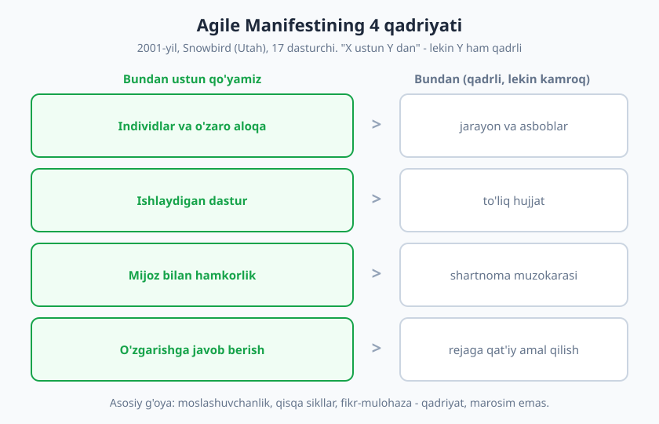
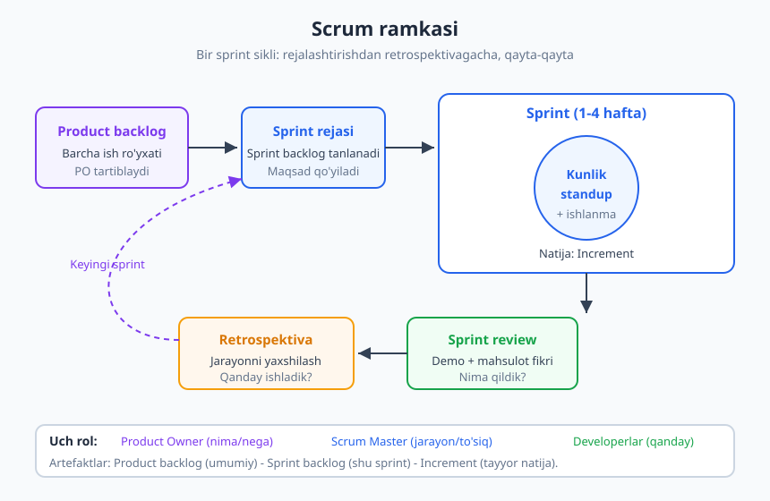
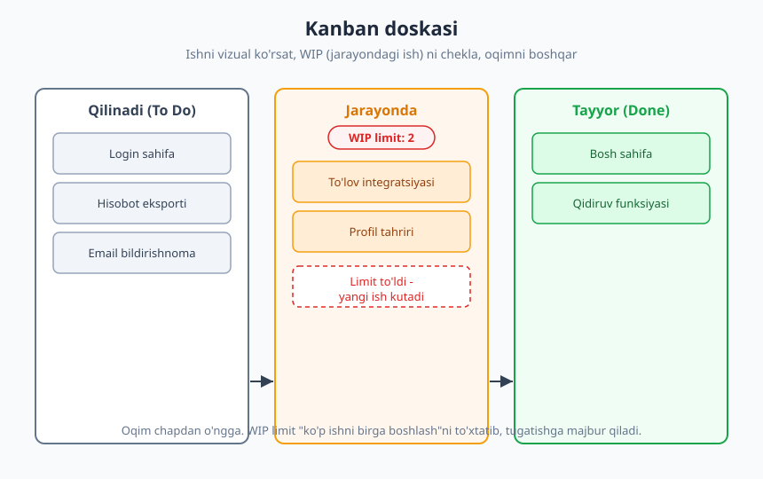

# 18 — Agile, Scrum va jamoa jarayonlari

[⬅️ Oldingi: 17 — Masofaviy ish va taqsimlangan jamoa](./17-masofaviy-ish-jamoa.md) · [🏠 README](./README.md) · [Keyingi: 19 — Muammoni hal qilish va tahliliy fikrlash ➡️](./19-muammoni-hal-qilish.md)

---

> **Bu bobda:** deyarli har bir jamoa qandaydir Agile jarayonda ishlaydi — ko'pincha Scrum yoki Kanban. Biz **Agile falsafasini** (2001-yilgi Manifest, 4 qadriyat), **Scrum**ning rollari, marosimlari va artefaktlarini, hamda **Kanban**ni ko'ramiz. Lekin diqqat: bu texnik qo'llanma emas. Biz jarayonning **inson tomoniga** urg'u beramiz — marosim qanday qilib mexanik nazoratga emas, haqiqiy hamkorlikka xizmat qiladi. Oxirida "soxta Agile" tuzog'ini va undan qanday chiqishni o'rganamiz.

> **Halollik / Eslatma:** jarayon o'zi mahsulot yetkazib bermaydi — odamlar yetkazadi. Scrum'ni mukammal "kitobcha bo'yicha" bajarib ham yomon ishlash mumkin, va deyarli hech qanday rasmiy marosimsiz ajoyib ishlash ham mumkin. Bu bob sizga ramkani beradi; lekin uni qadriyatga aylantirish — har kuni, har bir standup va retroda, siz va jamoangiz qiladigan tanlovga bog'liq.

---

## Agile falsafasi

Avval bir noto'g'ri tushunchani tuzatamiz: **Agile — metodologiya emas.** U Scrum ham, Kanban ham, doska ham, stikerlar ham emas. Agile — bu **qadriyatlar va tamoyillar to'plami**: dasturiy ta'minotni qanday yaratish haqidagi fikrlash tarzi. Scrum va Kanban — Agile ruhini amalga oshiruvchi *ramkalar*. Bu farqni boshdanoq tushunib olish — keyingi hamma narsani joyiga qo'yadi.

### Manifest qayerdan keldi

2001-yilning fevralida, AQSh, Yuta shtatidagi Snowbird kurortida, 17 nafar tajribali dasturchi yig'ildi. Ular turli yondashuv tarafdori edi (Scrum, Extreme Programming, va boshqalar), lekin bitta umumiy norozilik ularni birlashtirdi: o'sha davrda hukmron bo'lgan og'ir, hujjatga botgan, "avval butun rejani tuzamiz, keyin yil davomida amal qilamiz" uslubi (ko'pincha "sharshara" — *waterfall* deyiladi) ko'p loyihani halokatga olib borardi. Reja qog'ozda chiroyli, lekin haqiqat o'zgarganda esa mijozga foydasiz mahsulot yetkazilardi.

Shu uch kunda ular **Agile Manifestini** yozdi — atigi to'rt qadriyat va o'n ikki tamoyildan iborat qisqa hujjat. Uning kuchi soddaligida.

### To'rt qadriyat

Manifest to'rt jumladan iborat, har biri "X **ustun** Y" shaklida:

1. **Individlar va o'zaro aloqa** > jarayon va asboblar.
2. **Ishlaydigan dastur** > to'liq hujjat.
3. **Mijoz bilan hamkorlik** > shartnoma muzokarasi.
4. **O'zgarishga javob berish** > rejaga qat'iy amal qilish.

Bu yerda eng ko'p yanglishadigan nuqta bor, va u juda muhim. Manifest aytadi: *"O'ng tomondagi narsalarning qadri bor, lekin biz chap tomondagilarni ko'proq qadrlaymiz."* Ya'ni bu **"hujjat yozmang"** yoki **"reja kerak emas"** degani EMAS. Hujjat ham, reja ham, asbob ham — qadrli. Gap **ustuvorlik** haqida: ziddiyat chiqqanda, qaysi tomonni tanlaysiz?

Misol bilan ko'raylik. Jamoangiz ikki haftadan beri batafsil texnik hujjat yozmoqda, lekin hali bitta ishlaydigan ekran yo'q. Agile aytadi: avval mijoz qo'lida ushlab ko'radigan kichik, ishlaydigan bo'lakni yetkazing — chunki **ishlaydigan dastur** mijozdan haqiqiy fikr olib keladi, mukammal hujjat esa faqat taxminlarni tasdiqlaydi. Hujjatni keyin, real fikr asosida yozasiz.

> **Eslatma:** Agile'ning yuragi — **qisqa sikllar va fikr-mulohaza (feedback)**. Katta, uzoq, "hammasini oldindan rejalashtiramiz" o'rniga: kichik bo'lak yetkaz → real foydalanuvchidan o'rgan → yo'nalishni tuzat → yana yetkaz. Noaniqlik dunyosida bu — tezroq to'g'ri yo'lni topishning eng ishonchli usuli.

Asosiy g'oyani yodda tuting: **Agile — qadriyat, marosim emas.** Doskangiz bo'lishi, har kuni standup qilishingiz mumkin — lekin agar o'zgarishga qarshilik qilsangiz, mijozdan uzoqlashsangiz, odamlarni jarayonga qul qilsangiz — siz Agile emassiz, siz shunchaki yangi nom ostidagi eski sharshara'siz.

---

## Scrum asoslari

**Scrum** — Agile ruhini amalga oshiruvchi eng keng tarqalgan ramka. Uni 1990-yillarda **Ken Schwaber** va **Jeff Sutherland** ishlab chiqdi (Sutherland Manifest imzolagan 17 kishidan biri). Scrum ishni **sprint** deb ataladigan qisqa, qat'iy davrlarga (odatda 1–4 hafta, ko'pincha 2 hafta) bo'ladi va har sprint oxirida tayyor, ishlaydigan natija yetkaziladi.

Scrum'ni uch qism orqali tushunish oson: **rollar**, **hodisalar** (marosimlar) va **artefaktlar**.

### Uch rol

- **Product Owner (PO)** — *nima* va *nega*ga javobgar. U mahsulotning qadrini maksimallashtiradi: nima muhim, nima keyin, nima umuman kerak emasligini hal qiladi. PO biznes/foydalanuvchi tomonining ovozi.
- **Scrum Master (SM)** — *jarayon*ga javobgar. U boshliq emas — u **xizmatkor-yetakchi**: jamoaning yo'lidagi to'siqlarni olib tashlaydi, marosimlarning foydali o'tishini ta'minlaydi, jamoani tashqi chalg'itishlardan himoya qiladi. SM odamlarni boshqarmaydi, **jarayonni** yengillashtiradi.
- **Developerlar** — *qanday* qilishga javobgar. Bu kod yozuvchilar, testchilar, dizaynerlar — sprint maqsadiga erishish uchun ishni amalda bajaradigan o'z-o'zini tashkil qiluvchi jamoa. Scrum'da ular **birgalikda** javobgar: "bu mening ishim emas" degan gap yo'q.

### Beshta asosiy hodisa (marosim)

| Hodisa | Qachon | Maqsadi |
|---|---|---|
| **Sprint** | Doimiy davr (1–4 hafta) | Hamma boshqa hodisalarni o'rab turadigan asosiy konteyner. |
| **Sprint rejalashtirish** | Sprint boshida | Backlog'dan shu sprintga nima olinishini va sprint maqsadini belgilash. |
| **Kunlik standup** (daily) | Har kuni, ~15 daqiqa | Jamoa sinxronlashadi: oldinga harakat va to'siqlarni ko'rsatish. |
| **Sprint review** | Sprint oxirida | Tayyor ishni **demo** qilish, manfaatdorlardan fikr olish. |
| **Retrospektiva** (retro) | Sprint oxirida | Jamoa **jarayonning o'zini** muhokama qiladi: nima yaxshi ketdi, nimani yaxshilaymiz. |

### Uch artefakt

- **Product backlog** — mahsulot uchun barcha istalgan ishlarning tartiblangan ro'yxati. PO uni boshqaradi va doim qayta tartiblaydi.
- **Sprint backlog** — shu sprintga tanlangan ishlar + ularni bajarish rejasi. Bu jamoaning shu davrdagi majburiyati.
- **Increment** — sprint oxiridagi **tayyor, ishlaydigan** natija. Har increment "bitgan" (Definition of Done) ta'rifiga mos kelishi kerak — yarim tayyor ish increment emas.

Bularning hammasi bitta maqsadga xizmat qiladi: **qisqa, takrorlanuvchi sikllar bilan tezroq fikr olish va yo'nalishni tuzatish**. Sprint tugadi — increment chiqdi — review'da fikr olindi — retroda jarayon yaxshilandi — keyingi sprint boshlandi. Doira aylanaveradi.

---

## Marosimlarning soft tomoni

Mana bu bobning yuragi. Yuqoridagi rollar va marosimlarni har kim yodlab oladi. Lekin **marosim shakli bilan, ruhi yo'qolib ham bajariladi** — va aynan shunda u zararli bo'ladi. Keling, asosiy uch marosimning *inson* tomonini ko'raylik.

### Standup: nazorat emas, sinxronlash

Kunlik standup — Scrum'ning eng tez-tez takrorlanadigan, shu sababli eng tez buziladigan marosimi. Klassik shakli — har kim uch savolga javob beradi: *kecha nima qildim, bugun nima qilaman, qanday to'siqlar bor.*

Muammo shu yerda boshlanadi. Ko'p jamoada standup **bossga hisobot berish** marosimiga aylanadi — har kim navbat bilan menejerga "men ishlayapman, ko'ring" deb isbotlaydi. Bu — soft tomonning buzilishi.

❌ **Soxta standup:** "Kecha auth modulida ishladim. Bugun ham auth'da ishlayman." (Hech kim eshitmaydi, hamma telefoniga qaraydi, gap menejerga qaratilgan, to'siq aytilmaydi — chunki "zaif ko'rinaman".)

✅ **Maqsadli standup:** "Kecha login'ni tugatdim. Bugun parol tiklashga o'taman, lekin **bitta to'siq bor** — SMS API kalitiga ruxsatim yo'q. Kimda bor?" (Qisqa, to'siqqa urg'u, gap **jamoaga** qaratilgan, kimdir darrov yordam taklif qiladi.)

Standup — bu **jamoa uchun**, menejer uchun emas. Uning asl maqsadi: jamoa bir-biriga sinxronlashsin va **to'siqlar yuzaga chiqsin**. Yaxshi standup'ning soft qoidalari: qisqa bo'lsin (15 daqiqa), texnik chuqur muhokamani standup'dan tashqariga olib chiqing ("buni standup'dan keyin ikkalamiz gaplashamiz"), va eng muhimi — to'siqni aytish **xavfsiz** bo'lsin. To'siqni aytish uchun psixologik xavfsizlik kerak — bu [14-bobda](./14-jamoada-ishlash-xavfsizlik.md) chuqur ko'rilgan. Standup'da "men tiqilib qoldim" deb ayta olmaydigan jamoa — standup'dan foyda olmaydi.

### Retrospektiva: ayblovsiz yaxshilanish

Retro — Scrum'ning eng qadrli, lekin eng ko'p e'tiborsiz qoldiriladigan marosimi. Maqsadi oddiy: jamoa **jarayonning o'ziga** qarab, "nima yaxshi ketdi, nima yomon, nimani o'zgartiramiz" deydi.

Retroning kuchi to'g'ridan-to'g'ri uning **xavfsizligiga** bog'liq. Agar retro ayblash maydoniga ("Dilshod yana kechikdi, shuning uchun deadline o'tib ketdi") aylansa — odamlar o'zini himoya qila boshlaydi, haqiqatni yashiradi, va retro foydasiz teatrlga aylanadi. Yaxshi retro **ayblovsiz** (blameless) bo'ladi: muammo odamda emas, **tizimda** qidiriladi.

❌ **Ayblovli retro:** "Test bosqichi yana kechikdi. Bu QA jamoasining aybi."
✅ **Ayblovsiz retro:** "Test bosqichi kechikdi. **Qaysi jarayon** buni keltirib chiqardi? Balki ishni juda kech topshirdik? Yoki test muhiti tayyor emasmidi? Qanday qilamiz keyingi safar bu qaytmasin?"

Bu yondashuv — [14-bobdagi](./14-jamoada-ishlash-xavfsizlik.md) ayblovsiz post-mortem g'oyasining bevosita amaliyoti. Yaxshi retro bitta qoida bilan boshlanadi: *har kim o'sha paytdagi ma'lumot va sharoit doirasida eng yaxshisini qilgan deb hisoblaymiz.* Va retro **harakat bilan** tugashi shart — agar har retroda "muloqotni yaxshilaymiz" deb gap qolib, hech narsa o'zgarmasa, jamoa retroga ishonchini yo'qotadi. Retro = bitta-ikkita **aniq, kuzatiladigan** o'zgarish.

### Review: demo va haqiqiy fikr

Sprint review — jamoa o'z ishini ko'rsatadigan joy. Lekin uning soft tomoni shundaki, bu **maqtanish** yoki **rasmiy taqdimot** emas — bu **fikr olish** mexanizmi. Yaxshi demo jonli, ishlaydigan mahsulotni ko'rsatadi (slayd emas!) va manfaatdorlarga ochiq savol beradi: "bu siz kutgan narsami? nimasi noto'g'ri?"

Demoni yaxshi olib borish — bu taqdimot ko'nikmasi, va u [11-bobda](./11-ogzaki-taqdimot-public-speaking.md) batafsil ko'rilgan. Asosiy soft nuqta: demo'da **kamchilikni yashirmang**. "Bu ishlaydi, lekin chetki holatda hali muammo bor" — bu zaiflik emas, ishonch quradi va review'ning butun maqsadini (haqiqiy fikr) himoya qiladi.

> **Trade-off:** marosim — vosita, maqsad emas. Agar standup hech qanday to'siqni hal qilmayotgan bo'lsa, retro hech narsani o'zgartirmayotgan bo'lsa — marosimni "to'g'ri bajarish"da emas, uning **maqsadini tiklash**da muammo. Marosimni mexanik bajarish — vaqt o'g'risi; uni maqsadli qilish — jamoa vositasi.

---

## Kanban

Scrum yagona Agile ramka emas. Ikkinchi keng tarqalgani — **Kanban**. Uni dasturiy ta'minotga **David J. Anderson** moslagan (2000-yillar o'rtasida, Microsoft'dagi loyihalarda boshlab). G'oya esa undan ham eskiroq — Toyota ishlab chiqarish tizimidan, **Taiichi Ohno** mehnatidan kelib chiqqan: "kanban" yapon tilida "vizual signal" yoki "doska" degani.

Kanban'ning uch asosiy g'oyasi bor:

1. **Ishni vizual qil.** Hamma vazifa doskada ko'rinadi: ustunlar odatda **Qilinadi → Jarayonda → Tayyor**. Hech narsa "yashirin" emas — butun jamoa ishning holatini bir qarashda ko'radi.
2. **WIP'ni chekla.** WIP — *Work In Progress*, ya'ni "jarayondagi ish". Kanban'ning eng kuchli g'oyasi: "Jarayonda" ustuniga **limit** qo'yiladi (masalan, maksimum 2 ta vazifa). Limit to'lsa — yangi ishni *boshlay olmaysiz*, avval mavjudini *tugatishingiz* kerak.
3. **Oqimni boshqar.** Maqsad — ishning chap ustundan o'ng ustunga **silliq oqishi**. To'siqlar (bottleneck) doskada darhol ko'rinadi: agar bir ustunda kartalar to'planib qolsa — o'sha yerda muammo bor.

WIP limitining soft tomoni juda chuqur: u bizni **boshlashni to'xtatib, tugatishga majbur qiladi**. Ko'p dasturchining (va jamoaning) yashirin kasalligi — bir vaqtning o'zida o'nta ishni "boshlab qo'yish", lekin hech birini tugatmaslik. WIP limit bunga "yo'q" deydi: avval qo'lingdagini bitir. Bu kontekst almashinuvi narxini ham kamaytiradi — bu mavzu [6-bobda](./06-diqqat-chuqur-ish.md) ko'rilgan.

### Scrum va Kanban: qisqa farq

| | Scrum | Kanban |
|---|---|---|
| **Ritm** | Qat'iy sprintlar (1–4 hafta) | Doimiy oqim, sprint yo'q |
| **Rollar** | Aniq (PO, SM, Developerlar) | Majburiy rol yo'q |
| **Asosiy cheklov** | Sprintga sig'gan ish | WIP limiti |
| **O'zgarish** | Sprint o'rtasida o'zgarish tavsiya etilmaydi | Istalgan vaqtda yangi ish qo'shilishi mumkin |
| **Eng mos** | Reja qilinadigan, davrlik yetkazib berish | Doimiy, oqimli ish (masalan support, DevOps) |

Qaysi biri "yaxshiroq"? — noto'g'ri savol. Ikkalasi ham Agile qadriyatga xizmat qiladi; tanlov jamoa va ish turiga bog'liq. Ko'p jamoa ikkalasini aralashtiradi ("Scrumban"). Muhimi — ramka emas, qadriyat: vizual ishmi, qisqa siklmi, fikr-mulohazami — hammasi bir maqsadga, moslashuvchanlikka xizmat qilsin.

---

## "Soxta Agile" (fake agile)

Endi eng muhim ogohlantirish. Sanoatda keng tarqalgan kasallik bor, uni **"soxta Agile"** (yoki "kargo-kult Agile", "Agile teatri") deyiladi. Ta'rifi oddiy: jamoa Agile'ning **marosimlarini** bajaradi, lekin **qadriyatlarini** unutadi. Shakl bor, ruh yo'q.

Bu eng xavfli holat — chunki jamoa "biz Agile'miz" deb o'ylaydi, lekin aslida marosim ortiga yashiringan eski sharshara'da ishlaydi. Belgilariga qarang:

- **Standup = nazorat yig'ilishi.** Maqsad jamoa sinxronlashuvi emas, menejerning kim nima qilayotganini tekshirishi. Odamlar to'siq aytmaydi, "band ko'rinishga" intiladi.
- **Retrospektiva = formal rasmiyatchilik.** Har safar bir xil shikoyat takrorlanadi, hech narsa o'zgarmaydi. Yoki retro butunlay "vaqt yo'q" deb tashlab ketiladi.
- **Sprint = miqdor poygasi.** Sprint maqsadga emas, "qancha story point bajardik" raqamiga aylanadi. Jamoa raqamni "chiroyli ko'rsatish" uchun ishlaydi, mahsulot uchun emas.
- **"O'zgarishga javob" yo'q.** Sprint rejasi muqaddas; mijoz fikri kelsa ham, "rejada yo'q edi" deb rad etiladi. Bu — to'g'ridan-to'g'ri 4-qadriyatga xiyonat.
- **Velocity = qamchin.** Jamoaning tezligi ("velocity") yaxshilanish vositasi emas, jamoalarni bir-biriga taqqoslash va bosim o'tkazish quroli bo'lib qoladi.

Buning ildizi nima? Ko'pincha — **qo'rquv va ishonchsizlik**. Menejment jamoaga ishonmaydi, shuning uchun marosimlarni nazorat vositasiga aylantiradi. Va aynan shu yerda bu bob [22-bobga](./22-baholash-rejalashtirish.md) ko'prik quradi: baholash (estimation) va velocity'ni **bashorat** uchun ishlatish — sog'lom; ularni **majburlash va jazolash** uchun ishlatish — soxta Agile'ning eng yorqin belgisi. Story point o'lchov bo'lishi kerak, qamchin emas.

### Qanday tuzatish

Soxta Agile'dan chiqish yo'li — har bir marosimga qaytib **"bu nima uchun?"** deb so'rash:

- Standup foydasizmi? — Uni nazoratdan jamoa vositasiga qaytaring: menejer emas, jamoa olib borsin; to'siqqa urg'u bering.
- Retro o'zgartirmayaptimi? — Har retro **bitta aniq harakat** bilan tugasin, va keyingi retroda o'sha harakat bajarilganini tekshiring.
- Sprint maqsadsizmi? — Raqam emas, **sprint maqsadi** (bitta jumla: "bu sprintda foydalanuvchi parolini tiklay oladi") markazga qaytsin.
- O'zgarish rad etilyaptimi? — "Reja muqaddas" emas; mijoz fikri kelsa, uni backlog'da ko'rib chiqing.

> **Diqqat:** sog'lom Agile va soxta Agile'ni ajratuvchi yagona, eng aniq test bu: **odamlar yomon yangilikni ayta oladimi?** Agar standup'da "men tiqilib qoldim", retroda "bu jarayon ishlamayapti", demo'da "bu hali tayyor emas" deyish xavfsiz bo'lsa — bu sog'lom Agile. Agar bularning hammasi yashirilsa, "hammasi yaxshi" teatri o'ynalsa — bu soxta Agile, marosim qanchalik mukammal bajarilmasin. Hammasi yana o'sha [13-bobdagi](./13-feedback-berish-qabul.md) ochiq fikr-mulohaza va [14-bobdagi](./14-jamoada-ishlash-xavfsizlik.md) psixologik xavfsizlikka borib taqaladi.

Dasturchi sifatida sizning roli: marosimni mexanik o'tash emas, uning maqsadiga hissa qo'shish. Standup'da haqiqiy to'siqni ayting. Retroda samimiy, lekin ayblovsiz fikr bildiring. Demo'da kamchilikni yashirmang. Aynan shu kichik tanlovlar jamoangizni soxta Agile'dan haqiqiy Agile'ga ajratadi.

---

## Asosiy g'oyalar (bobni qisqacha)

- **Agile — falsafa, metodologiya emas.** 2001-yilgi **Manifest** (17 dasturchi, Snowbird) 4 qadriyatni belgiladi: **individlar va o'zaro aloqa > jarayon/asbob; ishlaydigan dastur > to'liq hujjat; mijoz bilan hamkorlik > shartnoma; o'zgarishga javob > rejaga amal.** "X ustun Y" — lekin Y ham qadrli. Yuragi: **qisqa sikllar va fikr-mulohaza**.
- **Scrum (Schwaber & Sutherland)** ishni **sprint**larga bo'ladi. Uch rol: **Product Owner** (nima/nega), **Scrum Master** (jarayon/to'siq, xizmatkor-yetakchi), **Developerlar** (qanday). Beshta hodisa: sprint, rejalashtirish, kunlik standup, review, retro. Uch artefakt: product backlog, sprint backlog, increment.
- **Marosimning soft tomoni hal qiluvchi.** **Standup** — jamoa uchun sinxronlash va **to'siqni ochish**, menejerga hisobot emas. **Retro** — **ayblovsiz**, odamni emas tizimni tuzatadi, va bitta aniq harakat bilan tugaydi. **Review** — jonli demo + haqiqiy fikr, kamchilikni yashirmaslik.
- **Kanban (David Anderson, Toyota/Ohno'dan)** — **ishni vizual qil, WIP'ni chekla, oqimni boshqar.** WIP limit "ko'p ishni boshlab tashlash"ni to'xtatib, **tugatishga** majbur qiladi.
- **Scrum vs Kanban** — qaysi biri yaxshi degan savol noto'g'ri; ish turiga qarab tanlanadi (yoki aralashtiriladi). Muhimi ramka emas, **qadriyat**.
- **Soxta Agile (fake agile)** — marosim bajariladi, qadriyat unutiladi. Belgilar: standup = nazorat, retro = formal, sprint = raqam poygasi, o'zgarish rad etiladi, velocity = qamchin. Ildizi — **ishonchsizlik**.
- **Eng aniq test:** odamlar **yomon yangilikni ayta oladimi?** Ayta olsa — sog'lom Agile; yashirilsa — soxta Agile, marosim qanchalik mukammal bo'lmasin.

---

## Mashqlar

### Oson

**1-mashq.** Agile Manifestining 4 qadriyatini xotirangizdan yozing (qaramasdan). Keyin har bir qadriyat uchun o'z ish/o'qish tajribangizdan bitta misol o'ylab toping: qachon "chap tomon"ni "o'ng tomon"dan ustun qo'yish foydali bo'lardi? (Masalan: "qachon men hujjat yozish o'rniga ishlaydigan prototip ko'rsatganimda tezroq fikr oldim".)

**2-mashq.** O'z jamoangizdagi (yoki tasavvurdagi) kunlik standupni baholang: u **jamoa uchunmi** yoki **menejerga hisobotmi**? Quyidagi belgilarga qarab "ha/yo'q" bilan baholang: (a) to'siqlar ochiq aytiladimi? (b) odamlar bir-birini eshitadimi yoki navbat kutadimi? (c) 15 daqiqada tugaydimi? (d) texnik bahslar standup'dan keyinga olinadimi? Eng kuchsiz nuqta qaysi?

### O'rta

**3-mashq.** Quyidagi soxta-retro yangilanishini **samarali** retroga aylantiring. Soxta: *"Hammasi yaxshi o'tdi. Deadline'ni o'tkazib yubordik, lekin keyingi safar tezroq ishlaymiz. Tugatdik."* Sizning versiyangiz: (a) aniq bir muammoni nomlasin, (b) uni **odamga emas tizimga** qaratsin, (c) **bitta aniq, kuzatiladigan harakat** bilan tugasin.

**4-mashq.** O'zingiz uchun yaxshi standup yangilanishini yozing — siz hozir ustida ishlayotgan (yoki o'rganayotgan) haqiqiy vazifa bo'yicha. Uch element bo'lsin: (1) kecha tugatgan **aniq** natija, (2) bugungi reja, (3) agar bo'lsa — **aniq to'siq** va undan kimga yordam kerakligi. Standup qoidasiga rioya qiling: qisqa, jamoaga qaratilgan, to'siqqa urg'u.

### Qiyin

**5-mashq.** Sizning jamoangiz: har kuni standup qiladi, har 2 haftada retro o'tkazadi, doskada Scrum bor — lekin mahsulot sekin yetkaziladi, hech kim yomon yangilikni aytmaydi, va menejer har standup'da "kim nima qilyapti" deb so'raydi. Bu **soxta Agile**mi? Asoslang: qaysi 3 belgini ko'ryapsiz? Va har bir belgini tuzatish uchun **bitta aniq harakat** taklif qiling (jami 3 harakat). Diqqat: harakatlaringiz marosimni "ko'proq qilish" emas, uning **maqsadini tiklash**ga qaratilgan bo'lsin.

**6-mashq.** Sizdan yangi jamoa uchun jarayon tanlash so'ralmoqda. Jamoa ikki xil ish qiladi: (a) yangi mahsulot funksiyalarini rejalik yetkazib berish, va (b) doimiy, kutilmagan support so'rovlari (bug, mijoz shikoyati). Scrum, Kanban yoki aralash (Scrumban) — qaysi birini tavsiya qilasiz va **nega**? Har bir ish turi (a va b) uchun alohida fikr yuriting, va tanlovingizni Scrum/Kanban farqlari jadvaliga tayanib asoslang.

Yechimlar / Namunaviy yondashuvlar

### 1-mashq yechimi
To'rt qadriyat: (1) individlar va o'zaro aloqa > jarayon/asbob; (2) ishlaydigan dastur > to'liq hujjat; (3) mijoz bilan hamkorlik > shartnoma; (4) o'zgarishga javob > rejaga amal. Misol namunalari: (2) "Loyiha boshida 40 sahifa dizayn hujjati o'rniga ishlaydigan kichik prototip qildim — mijoz uni ko'rib darrov 'yo'q, men buni boshqacha xohlardim' dedi, va men 40 sahifani qayta yozishdan qutuldim." (4) "Sprint o'rtasida foydalanuvchidan muhim fikr keldi; rejani 'muqaddas' deb saqlash o'rniga uni qabul qilib, ustuvorlikni o'zgartirdik." Asosiy saboq: chap tomon o'ng tomonni **yo'q qilmaydi** — ziddiyat chiqqanda qaysi tomonni tanlash haqida.

### 2-mashq yechimi
Bu reflektiv mashq — "to'g'ri javob" yo'q. Yo'naltiruvchi: agar (a) "to'siqlar aytilmaydi" bo'lsa — bu eng jiddiy belgi, chunki standup'ning asosiy maqsadi aynan to'siqni ochish; bu ko'pincha psixologik xavfsizlik yo'qligidan (odamlar "zaif ko'rinishdan" qo'rqadi). Agar (b) "navbat kutiladi, hech kim eshitmaydi" bo'lsa — standup sinxronlash emas, monolog teatriga aylangan. Eng ko'p uchraydigan kasallik: standup menejerga qaratilgan. Yechim — menejer emas, jamoa standupni olib borsin; gap bir-biriga, to'siqqa qaratilsin.

### 3-mashq yechimi
Namunaviy samarali retro: *"Bu sprintda deadline'ni o'tkazib yubordik. Aniq muammo: integratsiya testlari oxirgi kungacha boshlanmadi, va ular kutilganidan ko'p xato chiqardi — biz testni juda kech boshladik. Bu odamning aybi emas, jarayonimizda test bosqichi sprint oxiriga qisilib qolgan. **Harakat:** keyingi sprintda har bir funksiyani 'tayyor' deb belgilashdan oldin integratsiya testini ham yozamiz (Definition of Done'ga qo'shamiz), shunda test oxirgi kunga to'planmaydi. Buni keyingi retroda tekshiramiz."* E'tibor bering: (a) aniq muammo nomlandi (test kech boshlandi), (b) odamga emas tizimga qaratildi ("jarayonimizda qisilib qolgan"), (c) bitta aniq, kuzatiladigan harakat bilan tugadi.

### 4-mashq yechimi
Namuna (auth funksiyasi misolida): *"Kecha login formasini va validatsiyani tugatdim — endi noto'g'ri parolda aniq xato xabari chiqadi. Bugun parolni tiklash oqimiga o'taman. **To'siq:** SMS yuborish uchun tashqi xizmat kalitiga ruxsatim yo'q — Aziz akadan so'rab olishim kerak, kimda ruxsat bor?"* Bu namunada uch element ham bor: aniq tugagan natija (login + validatsiya), bugungi reja (parol tiklash), va aniq to'siq + yechim manbai (SMS kaliti, Aziz aka). Soxta versiya ("auth'da ishlayapman, ertaga ham auth'da ishlayman") esa hech qanday aniqlik, to'siq yoki natija bermaydi — eshituvchiga foydasiz.

### 5-mashq yechimi
**Ha, bu klassik soxta Agile.** Uch belgi va tuzatish:
1. **Hech kim yomon yangilikni aytmaydi** — psixologik xavfsizlik yo'q. *Harakat:* lead/SM birinchi bo'lib o'z xatosini yoki to'sig'ini ochiq aytsin ("men bu qismda tiqilib qoldim, yordam kerak"), shunda "bu yerda halollik xavfsiz" signali beriladi.
2. **Menejer standup'da "kim nima qilyapti" deb so'raydi** — standup nazorat yig'ilishiga aylangan. *Harakat:* menejer standupni *olib bormasin*; jamoa o'zi olib borsin, gap menejerga emas bir-biriga qaratilsin. Menejer ish holatini doskadan ko'rsin, standup'da emas.
3. **Mahsulot sekin yetkaziladi, marosim bor lekin natija yo'q** — marosim mexanik, qadriyat yo'q. *Harakat:* har retroni bitta aniq harakat bilan yakunlang va keyingi retroda uni tekshiring (retroni "yaxshilanish dvigateli"ga qaytaring), va har sprintga aniq **maqsad** qo'ying (raqam emas). Diqqat: yechim "ko'proq standup" yoki "uzunroq retro" emas — bu marosimning *maqsadini* tiklash.

### 6-mashq yechimi
Namunaviy tavsiya: **aralash (Scrumban) yoki ikki oqimni ajratish.** Asoslash:
- **(a) Rejalik mahsulot funksiyalari** — bu **Scrum**ga juda mos: ishni oldindan rejalashtirish mumkin, sprint maqsadi qo'yiladi, davriy yetkazib berish va review mahsulot fikrini olib keladi. Sprint ritmi reja qilinadigan ishga barqarorlik beradi.
- **(b) Doimiy, kutilmagan support so'rovlari** — bu **Scrum**ga yomon mos keladi, chunki bug va shikoyat sprint rejasiga sig'maydi (qachon kelishini bilmaysiz), va ular sprintni doim buzadi. Bu **Kanban**ga ideal: WIP limit bilan oqimli ishlanadi, yangi so'rov istalgan vaqtda qo'shiladi, sprint majburiyatini buzmaydi.
- **Eng amaliy yechim:** mahsulot ishini Scrum sprintlarida olib boring, support ishini alohida Kanban oqimida (yoki navbatchi/"on-call" dasturchi) yuriting — shunda kutilmagan support rejali sprintni buzmaydi. Bu Scrum/Kanban jadvalidagi farqlarga to'g'ridan-to'g'ri tayanadi: Scrum = reja + qat'iy ritm, Kanban = oqim + istalgan vaqtda o'zgarish. Asosiy saboq: ramka ishga moslashadi, ish ramkaga emas — bu Agile qadriyatining o'zi.

---

[⬅️ Oldingi: 17 — Masofaviy ish va taqsimlangan jamoa](./17-masofaviy-ish-jamoa.md) · [🏠 README](./README.md) · [Keyingi: 19 — Muammoni hal qilish va tahliliy fikrlash ➡️](./19-muammoni-hal-qilish.md)
