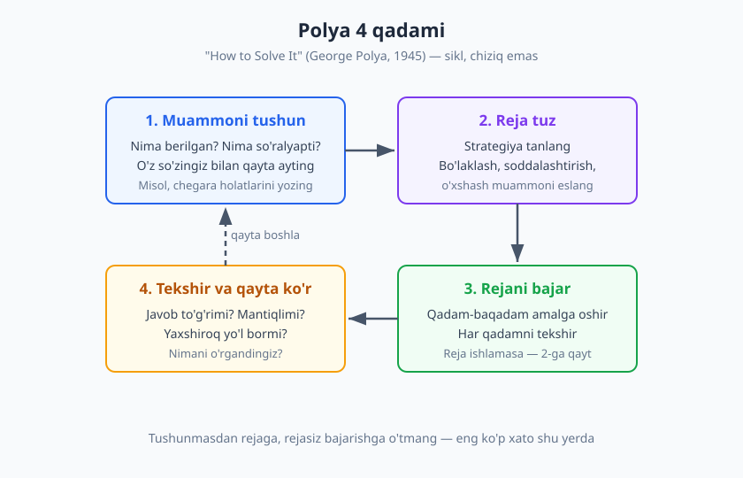
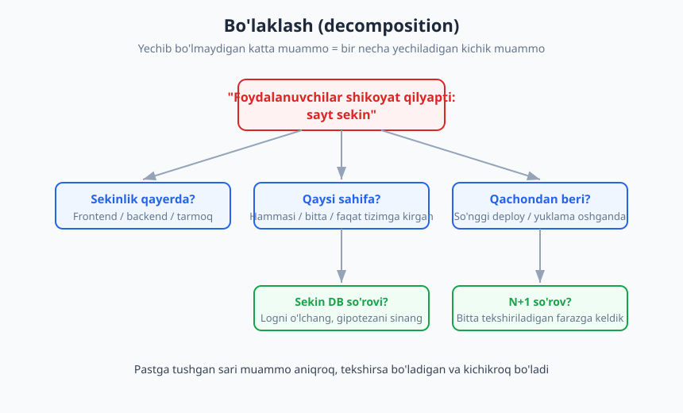
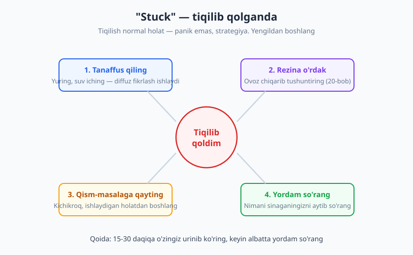

# 19 — Muammoni hal qilish va tahliliy fikrlash

[⬅️ Oldingi: 18 — Agile, Scrum va jamoa jarayonlari](./18-agile-scrum-jarayonlar.md) · [🏠 README](./README.md) · [Keyingi: 20 — Debugging: tizimli yondashuv ➡️](./20-debugging-tizimli.md)

---

> **Bu bobda:** Dasturlashning yuragi — muammo yechishni tizimli ko'nikma sifatida o'rganamiz. George Polya'ning 4 qadami, to'g'ri muammoni topish (reframing, XY muammosi, 5 Nega), katta muammoni bo'laklash, birinchi printsiplar, teskari ishlash va gipoteza sinash bilan ishlaymiz. Oxirida — "stuck" holatidan, ya'ni tiqilib qolganda chiqishning amaliy strategiyalari.
>
> **Halollik / Eslatma:** Muammo yechish — tug'ma iste'dod emas, balki **o'rganib bo'ladigan, mashq bilan o'sadigan** ko'nikma. Bu bobdagi ramkalar sizga panika o'rniga jarayon beradi; lekin haqiqiy mahorat faqat yuzlab muammoni qadam-baqadam yechish bilan keladi. Bu bob V qism — muhandislik hard skill'lari — ni ochadi.

---

## Muammo yechish — o'rganib bo'ladigan ko'nikma

Yangi dasturchini ish boshida nima qiynaydi? Sintaksis emas. Sintaksisni Google qiladi. Uni qiynaydigan narsa — **xato chiqqanda, talab tushunarsiz bo'lganda, kod ishlamayotganda nimadan boshlashni bilmaslik.** Ekranga tikilib o'tirib, ichida "men buni hech qachon yecholmayman" degan ovoz eshitiladi. Bu — panika, jarayon emas.

Endi tajribali muhandisni kuzating. U ham javobni bilmaydi. Lekin u **panika qilmaydi** — u *boshlaydi*. Muammoni qayta o'qiydi. Bir misol oladi va qo'lda hisoblaydi. Faraz qiladi, sinaydi, faraz noto'g'ri chiqsa keyingisini sinaydi. Tashqaridan qaraganda u "tezroq o'ylayotganday" ko'rinadi. Aslida u tezroq emas — u **tizimli**. Uning miyasida tartibsiz urinish o'rniga takrorlanadigan bir jarayon ishlaydi.

Bu eng muhim xabar: **muammo yechish — iste'dod emas, ko'nikma.** "Men shunchaki algoritmik fikrlay olmayman" degan gap — ko'pincha yolg'on. Aslida o'sha odam hech qachon *tizimli jarayonni* ko'rmagan yoki mashq qilmagan, shuning uchun har safar noldan, tasodifiy boshlaydi. Ko'nikmani esa o'rganish mumkin.

> **Eslatma:** Junior va senior orasidagi eng katta farq — bilim hajmida emas, *tiqilganda nima qilishida*. Junior qotib qoladi yoki tasodifiy narsalarni sinab ko'radi ("shu yerga `await` qo'shsam-chi?"). Senior tizimli torayadi: muammoni bo'lakdan ajratadi, gipoteza tuzadi, o'lchaydi. Bu bob aynan o'sha jarayonni ochiq qiladi.

Bu kitobning butun maqsadi — sizning boshingizdagi "tartibsiz urinish"ni "takrorlanadigan jarayon"ga aylantirish. Va eng yaxshi tomoni: jarayonni qog'ozga yozish mumkin, demak mashq qilsa bo'ladi.

---

## Polya 4 qadami — klassik ramka

Bu jarayonning eng mashhur, eng tekshirilgan tasnifi 1945-yilda yozilgan. Matematik **George Polya** o'zining *"How to Solve It"* (Qanday yechish kerak) kitobida har qanday muammoni yechishni 4 qadamga ajratdi. Kitob matematika o'qituvchilari uchun yozilgan bo'lsa-da, qadamlar shu qadar umumiy chiqdiki, bugun dasturchilar, muhandislar va olimlar uni qo'llaydi.

### 1-qadam: Muammoni tushun

Eng ko'p e'tibordan chetda qoladigan, lekin eng muhim qadam. Yechishga shoshilishdan oldin: **Aniq nima berilgan? Aniq nima so'ralyapti?** Polya o'quvchilarga muammoni *o'z so'zlari bilan qayta aytib berishni* tavsiya qilardi — agar qayta ayta olmasangiz, demak tushunmagansiz.

Dasturchi misolida bu shunday ko'rinadi:

- ❌ **Yomon:** "Funksiya ishlamayapti" — darrov kodga sho'ng'iydi.
- ✅ **Yaxshi:** "Funksiya `[3, 1, 2]` ni kutyapti, `[1, 2, 3]` qaytarishi kerak edi, lekin `[1, 2]` qaytaryapti. Demak oxirgi element yo'qolyapti."

Ikkinchi holatda muammo allaqachon yarmi yechilgan, chunki u **aniq**. Tushunish qadamida bering: kirish nima, kutilgan chiqish nima, chegara holatlari (bo'sh ro'yxat? bitta element? takrorlar?) qanday. Ko'pincha shu yerda javobning o'zi ko'rinib qoladi.

### 2-qadam: Reja tuz

Endi *qanday* yechishni o'ylaysiz — hali kod yozmasdan. Polya bu yerda bir nechta savol beradi: **Shunga o'xshash muammoni ilgari ko'rganmisiz?** Muammoni soddalashtirsa bo'ladimi? Teskaridan boshlasa-chi? Strategiyalarni keyingi bo'limda batafsil ko'ramiz (bo'laklash, birinchi printsiplar, teskari ishlash).

Reja — "shu funksiyani har bir elementni aylanib chiqib filtrlayman, keyin saralash kerakmi tekshiraman" kabi bir-ikki jumlalik fikr. Aniq kod emas, *yo'nalish*.

### 3-qadam: Rejani bajar

Endi rejani kodga aylantirasiz — qadam-baqadam, har qadamni tekshirib. Bu yerda muhim qoida: agar reja ishlamayotgan bo'lsa, ko'r-ko'rona davom etmang. **2-qadamga qayting va boshqa reja tuzing.** Ko'p odam yomon rejani soatlab "tuzatishga" urinib vaqt yo'qotadi, holbuki butunlay boshqa yondashuv 10 daqiqada ishlardi.

### 4-qadam: Tekshir va qayta ko'r

Javob chiqdi — tamommi? Yo'q. Polya'ning eng qiymatli qadami shu: **orqaga qarab tekshiring.** Javob to'g'rimi (chegara holatlarida ham)? Mantiqlimi? **Yaxshiroq yo'l bormidi?** Va eng muhimi: *nimani o'rgandingiz, keyingi safar shunga o'xshash muammoda nimadan foydalanasiz?* Aynan shu qadam sizni har muammodan kuchliroq qilib chiqaradi — aks holda siz har safar noldan boshlaysiz.

| Qadam | Asosiy savol | Dasturchi xatosi (qadamni o'tkazib yuborganda) |
|---|---|---|
| 1. Tushun | Nima berilgan, nima so'ralyapti? | Talabni o'qimasdan kod yozish |
| 2. Reja tuz | Qaysi strategiya? O'xshash muammo bormi? | Strategiyasiz, tasodifiy yozishni boshlash |
| 3. Bajar | Rejani qadam-baqadam amalga oshir | Yomon rejani soatlab tuzatishga urinish |
| 4. Tekshir | To'g'rimi? Yaxshiroq yo'l bormi? | Ishladi-ku deb to'xtash, chegara holatini sinamaslik |

> **Diqqat:** Ko'pchilik to'g'ridan-to'g'ri 3-qadamdan boshlaydi — kod yozadi. Sirning kaliti 1 va 2-qadamda: *to'g'ri tushunilgan, yaxshi rejalangan* muammo ko'pincha o'zini yechadi.

---

## To'g'ri muammoni yechish

Endi eng nozik, eng qimmat saboq. Tasavvur qiling: siz murakkab muammoni Polya bo'yicha mukammal yechdingiz — lekin u **noto'g'ri muammo** edi. Siz hech kimga kerak bo'lmagan narsani ajoyib qildingiz. Bu — eng qimmat xato, chunki ko'p mehnat sarflanadi va natijasi nolga teng.

> **Trade-off:** Tez yechish va to'g'ri narsani yechish orasida tanlov bo'lsa, *to'g'ri narsani* tanlang. Noto'g'ri muammoni qanchalik tez yechsangiz, shunchalik tez adashasiz.

### Muammoni qayta ramkalash (reframing)

Ko'p hollarda sizga "muammo" deb berilgan narsa aslida **yechimning bir varianti**, asl muammo emas. Buni ochish uchun "haqiqiy muammo nima?" deb so'rang.

> **Boshliq:** "Bu hisobotni Excel'ga eksport qiladigan tugma qo'shing."
>
> **Siz (reframing):** "Bir savol — odamlar Excel bilan nima qilmoqchi? Agar ular sonni boshqasiga yuborayotgan bo'lsa, ehtimol shunchaki shu sahifaga havola yetar. Agar ular boshqa hisobni qayta hisoblayotgan bo'lsa, balki o'sha hisobni biz ko'rsatib qo'yganimiz yaxshiroqdir?"

Bu yerda siz tugmani rad qilmayapsiz — siz **muammoning ortidagi maqsadni** ochyapsiz. Ko'pincha asl ehtiyoj boshqacha bo'ladi va undan ham sodda yechim bor.

### XY muammosi

Bu — reframing'ning eng mashhur shakli. **XY muammosi:** odam aslida **X** muammosini yechmoqchi, lekin o'zicha **Y** yechimni tanlab qo'ygan, va sizdan faqat **Y haqida** so'rayapti. Siz Y ustida vaqt sarflaysiz, holbuki X ni butunlay boshqa, sodda usulda yechsa bo'lardi.

> **Klassik misol:**
>
> **Savol:** "Fayl nomining oxirgi 3 ta belgisini qanday olaman?"
>
> **Asl X:** Aslida unga **fayl kengaytmasi** kerak edi. Lekin `.jpeg` 4 ta belgi, `.c` esa 1 ta — "oxirgi 3 ta belgi" (Y) noto'g'ri yechim. To'g'ri savol: "Fayl kengaytmasini qanday olaman?"

Shuning uchun savol berilganda **"sen nimaga erishmoqchisan?"** deb so'rash — bu hurmatsizlik emas, balki ko'pincha haqiqiy yordam. Bu mavzuni [12-bobda](./12-tinglash-savol-berish.md) — faol tinglash va to'g'ri savol berishda — chuqurroq ko'rgansiz; XY muammosi o'sha ko'nikmaning muammo yechishdagi to'g'ridan-to'g'ri natijasi.

### Simptom va ildiz sabab: 5 Nega

Ko'rinadigan muammo — odatda **simptom**, kasallikning o'zi emas. Agar siz simptomni "davolasangiz" (masalan, qotib qoladigan serverni har kuni qayta ishga tushirsangiz), muammo qaytaveradi. Asl sababga yetib borish kerak.

Bunda eng sodda va kuchli vosita — **"Besh nega" (5 Whys)**, Toyota ishlab chiqarish tizimida Taiichi Ohno ommalashtirgan usul. Muammodan boshlab, ketma-ket "nega?" deb so'rayverasiz, har javob keyingi savolning asosi bo'ladi:

> 1. **Sayt qulab tushdi.** Nega? — Server xotirasi tugadi.
> 2. **Nega xotira tugadi?** — Bitta jarayon barcha xotirani yedi.
> 3. **Nega yedi?** — U katta faylni butunlay xotiraga yukladi.
> 4. **Nega butunlay yukladi?** — Kod faylni qism-qism (stream) o'qimaydi.
> 5. **Nega oldin sezilmadi?** — Test faqat kichik fayllar bilan o'tkazilgan.

Mana — ildiz sabab: simptom "server qulashi" emas, balki *kod katta fayllarni stream qilmaydi va testlar buni qamramaydi.* Agar siz faqat serverni qayta ishga tushirib qo'yganingizda, ertaga yana qulardi. "Besh" — qat'iy raqam emas; ba'zan 3 ta, ba'zan 6 ta nega kerak bo'ladi. Maqsad — *o'zgartirilsa muammoni butunlay yo'qotadigan* sababga yetish.

---

## Bo'laklash va strategiyalar

Polya'ning 2-qadami — reja tuzish. Endi rejani tuzishning amaliy strategiyalarini ko'ramiz. Bularni "asboblar to'plami" deb tasavvur qiling: muammoning shakliga qarab birini yoki bir nechtasini tanlaysiz.

### Bo'laklash (decomposition)

Eng asosiy strategiya. Katta, "yechib bo'lmaydigan" muammoni **kichik, yechiladigan qism-masalalarga** bo'lasiz. "Foydalanuvchi profilini saqlash, validatsiya va rasm yuklash bilan" — bitta katta muammo. Uni bo'laklang: (1) formani ko'rsatish, (2) ma'lumotni validatsiya, (3) rasmni yuklash, (4) bazaga yozish. Endi har biri alohida, sodda, yechiladigan vazifa.

Bo'laklashning kuchi — psixologik ham: katta muammo qo'rqitadi, kichik bo'lak qo'rqitmaydi. Va har bir kichik bo'lakni yechganingizda kichik g'alaba olasiz — bu sizni oldinga undaydi.

### Birinchi printsiplardan fikrlash (first principles)

Muammoni eng asosiy, shubhasiz haqiqatlargacha buzib, undan qaytadan quring — "odatda shunday qilinadi" degan taxminlarni tashlab. Bu — ayniqsa "biz har doim shunday qilamiz" devori oldida foydali. So'rang: *"Bu qoida fizika qonunimi yoki shunchaki odatmi? Agar noldan boshlasak, qanday yechardik?"*

Misol: "Bizda har doim 5 ta server bor, demak yangi xizmatga ham 5 ta kerak." Birinchi printsip: *Aslida nima kerak — yuklamani ko'tarish. Yuklama qancha? Bitta server qancha ko'taradi?* Ehtimol javob — 1 yoki 10, lekin "5" odat, qonun emas edi.

### Teskari ishlash (working backwards)

Boshidan emas, **natijadan** boshlang. "Men nimaga erishmoqchiman?" deb yakuniy holatni aniq tasvirlang, keyin "shunga yetish uchun undan oldin nima bo'lishi kerak?" deb orqaga qadam tashlang. Labirintni chiqishdan boshlab yechishga o'xshaydi. Bu ayniqsa maqsad aniq, lekin yo'l noaniq bo'lganda kuchli: "Foydalanuvchi tasdiq xatini olishi kerak ← demak email yuborilishi kerak ← demak ro'yxatdan o'tish saqlanishi kerak ← demak forma validatsiyadan o'tishi kerak."

### Gipoteza tuzib sinash

Bu — debugging'ning yuragi, [20-bobda](./20-debugging-tizimli.md) chuqurroq ko'rasiz. Asosiy g'oya ilmiy metoddan: tasodifan o'zgartirishlar kiritish o'rniga, **aniq bir farazni** ayting ("muammo keshda deb o'ylayman"), uni **tekshiradigan eng kichik tajribani** o'tkazing, natijaga qarab farazni tasdiqlang yoki rad eting. Bitta o'zgartirish — bitta tajriba. Bir vaqtda 5 narsani o'zgartirsangiz, nima ish berganini bilmaysiz.

### Soddalashtir — kichik holatdan boshla

Murakkab holat qiynayaptimi? Eng kichik, eng sodda holatni oling. "1 million qatorli ma'lumotni qayta ishlash" qiyin — avval **3 qatorni** to'g'ri qayta ishlang. "Foydalanuvchilar daraxti bilan grafni qurish" qiyin — avval **2 ta foydalanuvchini** chizing. Sodda holat ishlaganda, ko'pincha umumiy yechim o'zi ko'rinadi, chunki siz tuzilmani tushunib oldingiz.

| Strategiya | Qachon ishlatish | Kalit savol |
|---|---|---|
| Bo'laklash | Muammo katta va ko'p qismli | "Buni kichik qismlarga qanday bo'laman?" |
| Birinchi printsiplar | "Biz har doim shunday qilamiz" devori | "Bu qonunmi yoki odatmi?" |
| Teskari ishlash | Maqsad aniq, yo'l noaniq | "Natijadan oldin nima bo'lishi kerak?" |
| Gipoteza sinash | Xato sababini topish (debugging) | "Qaysi bitta farazni sinab ko'raman?" |
| Soddalashtirish | Murakkab holat qo'rqitadi | "Eng kichik holatni yecha olamanmi?" |

---

## "Stuck" — tiqilib qolganda

Hammasini to'g'ri qildingiz, lekin baribir tiqilib qoldingiz. **Bu — normal.** Har bir muhandis — eng tajribalisi ham — har kuni tiqiladi. Farq shundaki, tajribali odam tiqilishni *muvaffaqiyatsizlik belgisi* emas, *jarayonning oddiy qismi* deb biladi. Panika qilish o'rniga, u "stuck"dan chiqish strategiyalariga o'tadi.

### Tanaffus qiling — diffuz fikrlash

Bu maslahat dangasalikka o'xshaydi, lekin ilmiy asosga ega. Miyamiz ikki rejimda ishlaydi: **fokuslangan** (bir narsaga qattiq tikilish) va **diffuz** (bo'shashgan, fonda ulanishlar qurish). Soatlab ekranga tikilganingizda fokuslangan rejim charchaydi va yangi g'oya kelmaydi. Yurishga chiqsangiz, dush qabul qilsangiz yoki shunchaki boshqa narsa qilsangiz, miya diffuz rejimga o'tadi — va ko'pincha yechim "hech qayoqdan" o'zi paydo bo'ladi. "Tushlikdan keyin tushundim" tajribasi aniq shu.

> **Eslatma:** Tiqilganda 20 daqiqalik tanaffus ko'pincha 2 soatlik qiynalishdan samaraliroq. Uyalmang — bu mehnatdan qochish emas, *boshqacha mehnat*.

### Rezina o'rdak (rubber duck)

Muammoni — go'yo stol ustidagi rezina o'rdakka — ovoz chiqarib, batafsil tushuntiring. Hayratlanarli tez-tez sodir bo'ladigan narsa: tushuntirayotganingizda, hali gapingizni tugatmasdan, "shu yerda... oh, men buni unutibman!" deb o'zingiz yechimni topasiz. Sababi — *tushuntirish miyangizni boshqa kishi tushunadigan, ketma-ket, mantiqiy formaga majburlaydi*, va o'sha jarayonda sizning o'z taxminingizdagi yoriq ko'rinib qoladi. Tirik odam ham, hatto matnga yozish ham bo'ladi. Bu texnikani [20-bobda](./20-debugging-tizimli.md) batafsil ko'rasiz.

### Qism-masalaga qayting

Tiqilish ko'pincha siz juda katta tishlam olganingizdan. Orqaga qadam tashlang va **ishlaydigan eng kichik narsaga** qayting. "Butun xususiyat ishlamayapti" — mayli, *bitta* eng sodda holat ishlaydimi? Undan ishonchli poydevor quring va kichik qadamlar bilan oldinga yuring. Ko'pincha tiqilish nuqtasi — bu siz o'tkazib yuborgan biror sodda taxmin bo'ladi.

### Yordam so'rash — qachon va qanday

Yordam so'rash — kuchsizlik emas, **professionallik.** Lekin uni to'g'ri qilish kerak:

- **Qachon?** Umumiy qoida: o'zingiz **15-30 daqiqa** chin dildan urinib ko'ring. Darrov so'rasangiz — o'rganmaysiz va o'zingizni mustaqil yechimdan mahrum qilasiz. Soatlab qiynalsangiz — jamoa vaqtini behuda sarflaysiz. O'rtasi to'g'ri.
- **Qanday?** Yomon savol: "Ishlamayapti, yordam bering." Yaxshi savol kontekst beradi:

> ✅ "X funksiyasi `[3,1,2]` da `[1,2]` qaytaryapti, `[1,2,3]` kutilgandi. Bu filtr `>0` shartidan deb o'yladim, lekin o'zgartirib ko'rdim — yordam bermadi. Indeks chegarasi xato bo'lishi mumkinmi deb gumon qilyapman. Loglarni qo'shdim, mana natija: ..."

Bu savol (1) muammoni aniq aytadi, (2) **nimani allaqachon sinaganingizni** ko'rsatadi, (3) o'z gumoningizni beradi. Bunday so'rovga javob berish oson va yordam beruvchi sizning vaqtini hurmat qilganingizni ko'radi. Yaxshi savol berish ko'nikmasini [12-bobda](./12-tinglash-savol-berish.md) ko'rgansiz.

> **Diqqat:** Yordam so'raganingizda nimani sinaganingizni aytib bering — bu nafaqat javobni tezlashtiradi, balki ko'pincha aytayotganingizda o'zingiz yechimni topasiz (rezina o'rdak effekti).

Va nihoyat: tiqilish — o'rganishning bir qismi. Sizni qiynagan muammo — aynan sizni o'stiradigan muammo. Bu mavzuni [3-bobda](./03-organishni-organish.md) — o'rganishni o'rganishda — chuqurroq ko'rasiz: noqulaylik zonasi (challenge zone) aynan o'sish sodir bo'ladigan joy. Ba'zida qiyin texnik qaror oldida tiqilasiz — u yerda muammo "qaysi yechim to'g'ri" emas, "qaysi murosa (trade-off) maqbul"; bu boshqa turdagi fikrlashni talab qiladi va uni [23-bobda](./23-texnik-qaror-tradeoff.md) ko'rasiz.

---

## Asosiy g'oyalar (bobni qisqacha)

- **Muammo yechish — o'rganib bo'ladigan ko'nikma**, tug'ma iste'dod emas. Tajribali dasturchini ajratadigan narsa — u tezroq emas, balki **tizimli**: panika o'rniga takrorlanadigan jarayon.
- **Polya 4 qadami** (1945): muammoni **tushun → reja tuz → bajar → tekshir**. Ko'pchilik 3-qadamdan boshlaydi (kod yozadi); sirning kaliti 1 va 2-qadamda.
- **To'g'ri muammoni yeching.** Eng qimmat xato — noto'g'ri muammoni mukammal yechish. **Reframing**, **XY muammosi** ("sen aslida nimaga erishmoqchisan?") va **5 Nega** bilan simptomdan **ildiz sabab**ga o'ting.
- **Strategiyalar to'plami:** **bo'laklash** (katta → kichik), **birinchi printsiplar** ("qonunmi yoki odat?"), **teskari ishlash** (natijadan), **gipoteza sinash** (bitta faraz — bitta tajriba), **soddalashtirish** (kichik holatdan).
- **Tiqilish (stuck) — normal**, muvaffaqiyatsizlik emas. Strategiyalar: **tanaffus** (diffuz fikrlash), **rezina o'rdak**, **qism-masalaga qaytish**, **yordam so'rash**.
- **Yordam so'rashning qoidasi:** 15-30 daqiqa o'zingiz urining, keyin **kontekst bilan** so'rang — muammo, nimani sinaganingiz, gumoningiz. Yaxshi savol ko'pincha aytayotganda o'zi yechiladi.

## Mashqlar

### Oson

**1-mashq.** Hozir ustingizdagi (yoki yaqinda yechgan) biror texnik muammoni oling. Uni qog'ozga **Polya 1-qadami** bo'yicha yozing: aniq nima berilgan, aniq nima so'ralyapti, qanday chegara holatlari bor. Tushunchangizni "o'z so'zingiz bilan" bir paragrafda qayta ayting.

**2-mashq.** Quyidagi savolda XY muammosini toping: "Bir matndan oxirgi vergulga qadar bo'lgan qismni qanday o'chiraman?" — bu odam aslida nimaga erishmoqchi bo'lishi mumkin? Kamida 2 ta ehtimoliy "X"ni yozing.

### O'rta

**3-mashq.** Bitta katta vazifani (masalan: "loyihaga foydalanuvchi profili sahifasini qo'shish") oling va uni **bo'laklang** — kamida 5 ta mustaqil, yechiladigan qism-masalaga. Har birini bitta jumlada yozing va qaysi biri eng oson "birinchi g'alaba" bo'lishini belgilang.

**4-mashq.** Yaqinda duch kelgan biror nosozlikni oling va unga **5 Nega**ni qo'llang. Har bir "nega"ni va javobini yozing. Yetib borgan ildiz sababingiz dastlabki simptomdan farq qiladimi? Agar farq qilsa — siz to'g'ri qildingiz.

### Qiyin

**5-mashq.** Bir muammoni oling va unga ketma-ket **uchta** strategiyani qo'llab ko'ring: avval bo'laklash, keyin teskari ishlash (natijadan boshlash), keyin soddalashtirish (eng kichik holat). Har bir yondashuv muammoni boshqacha ko'rsatdimi? Qaysi biri eng foydali bo'ldi va nega?

**6-mashq.** "Reframing mashqi": ish joyingizda (yoki o'quv loyihangizda) sizga "yechim" ko'rinishida berilgan biror talabni eslang ("X tugmani qo'sh", "Y formatda eksport qil"). Uning ortidagi **asl maqsadni** toping va savol bering: "Agar maqsad bu bo'lsa, butunlay boshqa, soddaroq yechim bormi?" Kamida bitta muqobil yechimni yozing.

Yechimlar / Namunaviy yondashuvlar

### 1-mashq yechimi
Maqsad — o'zingizni 1-qadamga (tushunish) majburlash. Namunaviy yozuv: *"Berilgan: API'dan kelgan foydalanuvchilar ro'yxati, ba'zilarining `email` maydoni bo'sh. So'ralayotgan: faqat emaili borlarni ko'rsatish, lekin sonni (jami nechta foydalanuvchi) to'liq ko'rsatish. Chegara holatlar: ro'yxat bo'sh bo'lsa? Hamma emaili bo'sh bo'lsa? Email bor lekin noto'g'ri formatda bo'lsa?"* Agar chegara holatlarni o'ylab, ulardan biri (masalan, noto'g'ri format) sizga yangi savol tug'dirgan bo'lsa — siz muammoni endigina chuqur tushundingiz.

### 2-mashq yechimi
"Oxirgi vergulga qadar o'chirish" — Y (tanlangan yechim). Ehtimoliy X'lar: (a) **Ro'yxatdagi oxirgi elementni olmoqchi** — vergul bilan ajratilgan qatordan oxirgi qiymat kerak (to'g'ri yechim — bo'lish/split, "o'chirish" emas). (b) **Sonni toza ko'rinishga keltirmoqchi** — masalan `"1,234,"` ni `1234` qilmoqchi (to'g'ri yechim — formatlash/parse). Har ikki holatda ham "oxirgi vergulgacha o'chirish" mo'rt va noto'g'ri yondashuv; asl maqsadni so'rash to'g'riroq, sodda yechimga olib keladi.

### 3-mashq yechimi
Namunaviy bo'laklash: (1) Marshrut va bo'sh sahifani ko'rsatish; (2) Backend'dan foydalanuvchi ma'lumotini olish; (3) Ma'lumotni sahifada ko'rsatish (ism, rasm); (4) "Tahrirlash" formasini qo'shish; (5) Formani validatsiya qilish; (6) O'zgarishni saqlash va xatoni ko'rsatish. Eng oson "birinchi g'alaba" — odatda (1): faqat bo'sh sahifani marshrutga ulash, bu darrov ko'rinadigan natija beradi va qolganiga poydevor bo'ladi. Muhimi — har bir qism alohida sinab ko'riladigan, "tugadi" deb aytish mumkin bo'lgan darajada kichik.

### 4-mashq yechimi
Namuna: *"Test bazasi qulab tushdi. Nega? — Disk to'ldi. Nega? — Log fayllar tozalanmaydi. Nega? — Log rotatsiyasi sozlanmagan. Nega? — Bu serverni qo'lda, hujjatsiz sozlaganmiz. Nega? — Yangi serverni tayyorlash uchun yozma jarayon yo'q."* Simptom "baza qulashi" edi; ildiz sabab — *server tayyorlashda standart, hujjatlashtirilgan jarayon yo'qligi*. Yechim disk tozalash emas, balki jarayonni tuzatish. Agar sizning "nega"laringiz dastlabki muammodan butunlay boshqa joyga olib kelgan bo'lsa — bu kutilgan natija; aynan shuning uchun 5 Nega kuchli.

### 5-mashq yechimi
Maqsad — bitta muammoni turli "linzalar" orqali ko'rish. Masalan "1 milliondan ortiq yozuvni hisobotga jamlash sekin": **bo'laklash** — yuklash / filtrlash / jamlash / ko'rsatishga ajratadi (qaysi bosqich sekinligini ajratadi). **Teskari ishlash** — "yakuniy hisobot qanday ko'rinishda? Unga aslida qancha yozuv kerak?" deb so'raydi (ehtimol millionning yarmi keraksiz). **Soddalashtirish** — 100 ta yozuvda sinab, mantiq to'g'rimi tekshiradi. Ko'pincha har biri boshqa narsani ochadi: bo'laklash *qayer* sekin ekanini, teskari ishlash *ortiqcha ish*ni, soddalashtirish *mantiq xatosi*ni. "Eng foydalisi" muammoga bog'liq — lekin uchtasini ham sinab ko'rish odati sizni ko'p tomonlama fikrlovchi qiladi.

### 6-mashq yechimi
Namuna: talab — "Har bir hisobotga PDF eksport tugmasi qo'sh." Asl maqsadni so'rasangiz: *"Buxgalter bu sonni har oy menejerga emailda yuboradi."* Endi muqobillar ko'rinadi: (a) tizim har oy avtomatik email yuborsa — tugma ham, qo'lda ish ham kerak emas; (b) menejerga to'g'ridan-to'g'ri "faqat ko'rish" havolasi berilsa — PDF umuman kerak emas. PDF tugma — ishlaydigan, lekin ehtimol eng yomon variant edi. Saboq: "yechim" ko'rinishidagi talab ortida ko'pincha soddaroq haqiqiy maqsad yashiringan — uni ochish reframing'ning butun mohiyatidir.

---

[⬅️ Oldingi: 18 — Agile, Scrum va jamoa jarayonlari](./18-agile-scrum-jarayonlar.md) · [🏠 README](./README.md) · [Keyingi: 20 — Debugging: tizimli yondashuv ➡️](./20-debugging-tizimli.md)
