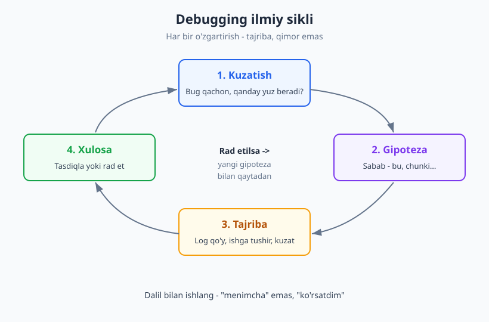
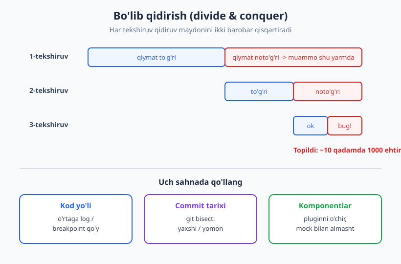
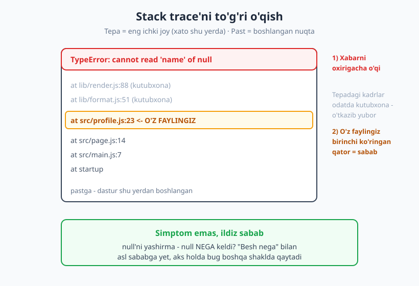

# 20 — Debugging: tizimli yondashuv

[⬅️ Oldingi: 19 — Muammoni hal qilish va tahliliy fikrlash](./19-muammoni-hal-qilish.md) · [🏠 README](./README.md) · [Keyingi: 21 — Begona kodni o'qish va kodbazada harakatlanish ➡️](./21-begona-kodni-oqish.md)

---

> **Bu bobda:** debugging'ni "tasodifiy o'zgartirib ishlatib ko'rish" o'rnatilgan odatidan ilmiy, tizimli jarayonga aylantirasiz. Ilmiy metod sikli (kuzatish → gipoteza → tajriba → xulosa), barqaror reproduksiya, bo'lib qidirish (divide & conquer), David Agans'ning 9 qoidasi va xato xabari / stack trace'ni to'g'ri o'qish ko'nikmasini ko'rib chiqamiz.
>
> **Halollik / Eslatma:** debugging — kitobdan emas, soatlab ter to'kib o'rganiladigan ko'nikma. Bu bob sizga **xarita** beradi, lekin haqiqiy mahorat faqat o'zingiz yuzlab bug'ni quvib, har birida bu qadamlarni qo'llab borganingizda o'sadi. Ramkalar yo'lni qisqartiradi, ammo yo'lni o'zingiz bosib o'tasiz.

---

## Debugging — tafakkur, panika emas

Bug paydo bo'lganda ko'pchilik dasturchining birinchi refleksini tasavvur qiling: kodga qaytadi, "shu yer bo'lsa kerak" deb bir qatorni o'zgartiradi, ishga tushiradi, ishlamaydi; boshqa qatorni o'zgartiradi, ishga tushiradi, yana ishlamaydi. Yarim soatdan keyin kod o'n joyda o'zgartirilgan, dasturchi nima qilganini eslay olmaydi, va — agar omadi kelsa — nimadir "tasodifan" ishlab ketadi. Lekin **nega** ishlab ketganini hech kim bilmaydi. Bu — debugging emas, bu **lotereya**.

Bu yondashuvning nomi bor: **shotgun debugging** (miltiq bilan otish) yoki **changing things at random** (tasodifiy o'zgartirish). U ikki sababdan yomon:

1. **Bilim qoldirmaydi.** Tasodifan "tuzalsa" ham, siz muammoni *tushunmadingiz*. Demak u boshqa shaklda yana qaytadi va siz yana noldan boshlaysiz.
2. **Yangi bug yaratadi.** O'nta tasodifiy o'zgartirishning to'qqiztasi keraksiz; ular kodni buzadi, lekin siz buni hozir sezmaysiz. Oradan bir hafta o'tib "yangi" bug paydo bo'ladi — aslida siz uni o'sha kuni o'zingiz ekib qo'ygansiz.

Tizimli debugging — bu boshqacha aqliy holat. Bu **panika emas, tafakkur**. Bu **his-tuyg'u emas, dalil**. "Menimcha shu yerda" o'rniga "Men buni *bilaman*, chunki ko'rsatdim" deyish. Debugging aslida — kichik ilmiy tadqiqot: sizda **sirli hodisa** (dastur noto'g'ri ishlayapti) bor, va siz uning **sababini** dalil bilan aniqlashingiz kerak.

Bu yondashuvning ildizi — bobning markaziy ramkasi — **ilmiy metod** (scientific method). Bu metodni biror bir kishi "ixtiro" qilmagan; u asrlar davomida shakllangan va odatda **Francis Bacon** (XVII asr), keyinroq esa **Galileo** kabi olimlarning ishlariga bog'lanadi. Dasturlashga uni ko'plab muallif moslagan; eng aniq ifodalardan biri **David J. Agans**ning *"Debugging"* (2002) kitobida. Sikl shunday:

| Qadam | Ilmiy metodda | Debugging'da |
|---|---|---|
| **Kuzatish** | Hodisani aniq tasvirla | Bug aynan qachon, qanday yuz beradi? |
| **Gipoteza** | Sababni taxmin qil | "Sabab — null qiymat shu yerda" |
| **Bashorat** | Gipoteza to'g'ri bo'lsa nima kutiladi? | "Agar shunday bo'lsa, bu log bo'sh chiqadi" |
| **Tajriba** | Sinab ko'r | Logni qo'y, ishga tushir, kuzat |
| **Xulosa** | Tasdiqla yoki rad et | To'g'ri → tuzat. Noto'g'ri → yangi gipoteza |

Eng muhim farq shu: **har bir o'zgartirish — tajriba, qimor emas.** Siz nimanidir o'zgartirishdan oldin *nima kutayotganingizni* bilasiz. Agar kutgan natija chiqsa — gipoteza tasdiqlandi. Chiqmasa — bu ham ma'lumot, behuda emas. Bu fikrlash tarzi haqida 19-bobdagi [tahliliy fikrlash va gipoteza](./19-muammoni-hal-qilish.md) bilan chambarchas: debugging — muammo yechishning aniq, dasturchiga xos bir turi.



> **Diqqat:** Eng katta dushman — sabrsizlik. "Shoshmasdan bir daqiqa o'ylab olsam edi" hissi — debugging'ning eng tez-tez takrorlanadigan afsusi. Tezlik — sekin o'ylashdan keladi.

---

## Reproduksiya — birinchi qadam

Hech qachon *takrorlay olmagan* bug'ni tuzata olmaysiz. Bu — debugging'ning birinchi va eng muhim qoidasi. Sababi oddiy: agar bug'ni xohlagan paytda chaqira olmasangiz, (a) sababini izlash uchun qayta-qayta kuzata olmaysiz, va (b) tuzatganingizdan keyin — *haqiqatan* tuzatganingizni qanday bilasiz? Belki o'zi g'oyib bo'lgandir.

Shuning uchun birinchi maqsad — **"make it fail"** (uni ishlamaydigan qil). Bu g'alati eshitiladi: nima uchun bug'ni *qaytarishga* harakat qilaman? Chunki ishonchli reproduksiya — bu sizning **tajriba stendingiz**. U bo'lmasa, har bir tajriba "balki ishlagandir, balki yo'q" degan tumanda qoladi.

### Reproduksiya retsepti

Yaxshi reproduksiya quyidagilarni aniq yozadi:

- **Boshlang'ich holat** — qanday ma'lumot bazasi, qaysi foydalanuvchi, qaysi konfiguratsiya?
- **Aniq qadamlar** — 1, 2, 3... nima qilinadi (bosiladi, kiritiladi, yuboriladi)?
- **Kutilgan natija** — nima bo'lishi kerak edi?
- **Haqiqiy natija** — nima bo'ldi (xato xabari, noto'g'ri qiymat, qotib qolish)?

Bu — aynan yaxshi **bug-report**ning tuzilishi. Agar bir kun o'zingiz QA yoki foydalanuvchidan "ishlamayapti" degan xabarni olsangiz, birinchi savolingiz: "Aynan qanday qadamlar bilan?" bo'lishi kerak.

### Minimal reproduksiya — kichraytirish

Bug ko'pincha katta, chalkash kontekstda paydo bo'ladi: butun ilova ishlayotgan, o'nta ekran, yuzta ma'lumot. Bu — yomon tajriba muhiti, juda ko'p "shovqin" bor. Maqsad — **minimal reproduksiya**: bug hali ham yuz beradigan eng kichik, eng sodda holat.

Buni **kichraytirish** (minimization) deyiladi. Usul — bo'laklarni birma-bir olib tashlash va har safar "bug hali ham bormi?" deb so'rash:

> Ilovaning yarmini olib tashladim — bug hali bormi? Bor → demak sabab qolgan yarmida.
> Yana yarmini... yo'qoldi → demak sabab men hozir olib tashlagan qismda.

Ko'pincha o'nlab fayl va yuzlab qatordan iborat muammoni 10 qatorlik mustaqil misolga siqib bo'ladi. Va — sir shu yerda — ko'pchilik hollarda **kichraytirishning o'zi javobni ko'rsatib beradi.** Misolni soddalashtirib borarkansiz, qaysi qism bug'ni "ushlab turganini" ko'rasiz.

> **Eslatma:** "Mendagi mashinada ishlaydi" (works on my machine) — reproduksiya muammosining klassik belgisi. Agar bir joyda ishlab, boshqa joyda ishlamasa, demak boshlang'ich holatda farq bor: versiya, konfiguratsiya, ma'lumot, vaqt mintaqasi, til sozlamasi. "Ishlaydi" va "ishlamaydi" muhitlari o'rtasidagi **farqlar ro'yxati** — sizning gipotezalaringiz ro'yxati.

### Barqaror takrorlanmaydigan ("flaky") bug

Eng yomon turi — gohida bo'ladigan, gohida bo'lmaydigan bug ("flaky"). Bu ham reproduksiya muammosi, faqat ehtimollik darajasida. Bunday holatda maqsad — **takrorlanish ehtimolini oshirish**: nima bug'ni ko'paytiradi? Ko'p so'rov yuborsang-chi? Sekin tarmoqda-chi? Bir vaqtning o'zida bir nechta jarayonda-chi? Aksariyat "flaky" bug ortida **vaqt** (race condition), **tartib** (boshqa tartibda kelgan ma'lumot) yoki **tashqi holat** (kesh, vaqt zonasi) yotadi.

---

## Bo'lib qidirish (divide & conquer)

Bug aniqlandi va takrorlanmoqda. Endi savol: **u qayerda?** Zamonaviy kodbaza ulkan — yuz minglab qator. Bug'ni topish — pichanzorda ignani qidirish. Yechim — **bo'lib qidirish** (divide and conquer), aniqrog'i **binar qidiruv**.

G'oya: muammo "makonini" (kod yo'li, vaqt oralig'i, commit'lar tarixi) **yarmga bo'lib**, qaysi yarmda muammo borligini aniqlab, keyin o'sha yarmni yana yarmga bo'lasiz. Har bir tekshiruv qidiruv maydonini ikki barobar qisqartiradi. 1000 qadamlik yo'lda muammo — atigi ~10 tekshiruvda topiladi (chunki 2¹⁰ ≈ 1000).



### Uchta sahnada bo'lib qidirish

**1. Kod yo'li bo'ylab.** Ma'lumot A nuqtadan kirib, Z nuqtaga chiqadi va Z'da noto'g'ri. Sabab oraliqda. Yo'lning **o'rtasiga** bir tekshiruv qo'ying — qiymat shu yerda hali to'g'rimi? To'g'ri → muammo orqada (oxirgi yarmda). Noto'g'ri → muammo oldinda (birinchi yarmda). Bu tekshiruv ko'pincha oddiy **log** yoki **debugger**dagi to'xtash nuqtasi (breakpoint).

```
Kirish A ───> [1] ───> [2] ───> [3] ───> [4] ───> Chiqish Z (noto'g'ri)
                         ▲
                  shu yerda tekshir: qiymat to'g'rimi?
              to'g'ri  -> muammo [3]-[4] orasida
              noto'g'ri -> muammo [1]-[2] orasida
```

**2. Vaqt (commit tarixi) bo'ylab — `git bisect`.** "Bir hafta oldin ishlardi, hozir ishlamaydi" — klassik holat. Yuzlab commit oralig'ida buzg'unchi commit qaysi? Qo'lda har birini tekshirish — uzoq. **`git bisect`** aynan binar qidiruvni avtomatlashtiradi: siz "yaxshi" (ishlagan) va "yomon" (ishlamaydigan) commit'larni belgilaysiz, Git o'rtasidagi commit'ga o'tadi, siz "yaxshimi-yomonmi?" deb javob berasiz, va u oraliqni yarimga bo'lib boraveradi — bir necha qadamda aynan buzg'unchi commit topiladi. (Bu vositani [Git & GitHub](../git-github/README.md) kitobida amalda ko'rasiz.)

**3. Konfiguratsiya / komponentlar bo'ylab.** Pluginlarni yarimini o'chir — muammo qoldimi? Bog'liqliklarni (dependency) bittadan kamayt. Tashqi xizmatlarni soxta (mock) bilan almashtir. Har biri — maydonni bo'lish.

### Oltin qoida: bir vaqtda bitta narsani o'zgartir

Bo'lib qidirishning yuragida — **change one thing at a time** (bir vaqtda bitta narsani o'zgartir) qoidasi. Agar bir vaqtda uchta narsani o'zgartirsangiz va bug yo'qolsa — *qaysi biri tuzatdi?* Bilmaysiz. Belki biri tuzatdi, ikkinchisi yangi bug ekib ketdi, uchinchisi behuda. Har bir o'zgartirishdan keyin **faqat o'sha o'zgartirish ta'sirini** kuzating. Bu sekinroq tuyuladi, lekin aslida tezroq — chunki har bir natija aniq ma'lumot beradi.

> **Trade-off:** Tezlik vasvasasiga qarshi turing. "Hammasini birdan o'zgartirib, ishlasa zo'r" — qisqa muddatda tez, lekin ishlamasa (ko'pincha shunday bo'ladi) siz hech narsa o'rganmaysiz va boshidan boshlaysiz. Bitta-bitta — sekin, lekin har qadamda oldinga.

---

## David Agans'ning 9 qoidasi

Debugging haqida yozilgan eng amaliy va sevimli kitoblardan biri — **David J. Agans**ning *"Debugging: The 9 Indispensable Rules for Finding Even the Most Elusive Software and Hardware Problems"* (2002). Agans o'n yillab apparat va dasturiy ta'minot muammolarini quvib, debugging'ni 9 ta universal qoidaga jamladi. Ular til, platforma va hatto soha (dasturmi, apparatmi, hattoki maishiy texnikami) mustaqil. Mana ular qisqacha:

1. **Tizimni tushun (Understand the System).** Nimani tuzatayotganingizni bilmasangiz, tuzata olmaysiz. Hujjatni o'qing, arxitekturani tasavvur qiling. (Bu — 21-bob, [begona kodni o'qish](./21-begona-kodni-oqish.md) bilan to'g'ridan-to'g'ri bog'liq.)
2. **Ishlamasligini ko'rsat (Make It Fail).** Reproduksiya. Yuqorida ko'rdik — birinchi qadam.
3. **O'ylashni bas qil va qara (Quit Thinking and Look).** Eng ko'p qoqiladigan joy. Faraz qilish o'rniga — **kuzat**. Log qo'y, debugger'da to'xta, haqiqiy qiymatlarni ko'r. Dasturchilar ko'pincha "shunday bo'lsa kerak" deb soatlab o'ylaydilar, holbuki bir nazar haqiqiy holatni ochib beradi.
4. **Bo'lib hal qil (Divide and Conquer).** Binar qidiruv — yuqorida ko'rdik.
5. **Bir narsani o'zgartir (Change One Thing at a Time).** Yuqorida ko'rdik — o'zgaruvchini izolyatsiya qil.
6. **Izoh qoldir (Keep an Audit Trail).** Nima qilganingizni, nima kuzatganingizni **yozib boring**. "Logni shu yerga qo'ydim → bo'sh chiqdi → demak A funksiyaga umuman kirilmagan." Yarim soatdan keyin xotirangiz aldaydi; daftar aldamaydi.
7. **"Rozetkani tekshir" (Check the Plug).** Eng oddiy, eng aniq narsani tekshirishni unutmang. Kompyuter yonadimi? To'g'ri faylni tahrir qilyapsizmi? To'g'ri serverga ulanganmisiz? Saqlab, qayta yukladingizmi? Murakkab gipotezaga sho'ng'ishdan oldin — aniqdan boshlang.
8. **Yangi ko'z (Get a Fresh View).** Toliqqaningizda boshqa odamga muammoni tushuntiring. Ko'pincha tushuntirayotganingizdayoq javobni o'zingiz topasiz (rubber duck — pastda). Bu — 12-bobdagi [to'g'ri savol berish va tushuntirish](./12-tinglash-savol-berish.md) ko'nikmasi bilan bir oilada.
9. **Tuzatmagan bo'lsang — tuzalmagan (If You Didn't Fix It, It Ain't Fixed).** Bug "o'zicha yo'qolmaydi". Agar nima uchun yo'qolganini tushunmasangiz — u qaytadi. Va tuzatganingizdan keyin **reproduksiya bilan tasdiqlang**: avval ishlamaydigan qadamni qayta bajaring, endi ishlayaptimi?

Bu qoidalarni yodlash shart emas; ularni *odatga aylantirish* kerak. E'tibor bering: 9 qoidaning aksariyati ushbu bobning boshqa bo'limlari — bu tasodif emas, chunki ular debugging'ning umumiy skeletini tashkil etadi.

---

## Log va stack trace o'qish, rubber duck

Tizimli yondashuvni o'rgandik. Endi — kundalik amaliy qurol: xato xabarlari va loglarni **o'qish** ko'nikmasi. Ajablanarlisi shuki, ko'pchilik dasturchi xato xabarini *o'qimaydi* — qizil matnni ko'rib panika qiladi, e'tiborni yopadi va darrov Google'ga yuguradi. Holbuki javob ko'pincha aynan o'sha xabarning ichida turadi.

### Xato xabarini oxirigacha o'qing

Birinchi qoida: **xabarni oxirigacha o'qing.** Xato xabari odatda aynan nima, qayerda va nega xato bo'lganini aytadi: xato turi, fayl nomi, qator raqami. Ko'pincha dasturchi faqat birinchi qatorni ko'rib taxmin qila boshlaydi, holbuki to'rtinchi qatorda aniq sabab yozilgan. Xabarni **sekin, har so'zini** o'qing — bu bir necha daqiqa, lekin yarim soatlik taxminni tejaydi.

### Stack trace'ni to'g'ri o'qing

**Stack trace** (chaqiruvlar zinapoyasi) — xato yuz bergan paytda qaysi funksiya qaysi funksiyani chaqirgani ro'yxati. Uni o'qishda ikki narsani biling:

- **Tepada — eng "ichki" joy** (xato aynan shu yerda otildi). **Pastda — eng "tashqi" joy** (dastur boshlangan nuqta).
- Ko'pincha tepadagi bir necha qator — **kutubxona kodi** (sizniki emas). Birinchi navbatda **o'zingizning faylingiz** birinchi marta ko'ringan qatorni toping — odatda haqiqiy sabab shu yerda. Kutubxona kodi to'g'ri ishlaydi; siz uni noto'g'ri *chaqirgansiz*.

Stack trace'ni "teskari" o'qish foydali: pastdan yuqoriga qarab "men shu funksiyani chaqirdim → u buni → u buni → mana shu yerda yiqildi" deb hikoyani tiklang.



### Log darajalari

Loglar — kodning "qora qutisi"dan ovoz. Yaxshi log gipotezani tasdiqlash yoki rad etishning eng tez yo'li. Darajalarni (level) farqlang:

| Daraja | Nima uchun |
|---|---|
| `DEBUG` | Tafsilotli, faqat debugging vaqtida — har bir qadam, qiymat |
| `INFO` | Normal hodisalar — "buyurtma yaratildi" |
| `WARN` | G'alati, lekin halokatli emas — "qayta urinish 2/3" |
| `ERROR` | Xato yuz berdi — diqqat talab qiladi |

Debugging paytida vaqtincha qo'shadigan log — bu **tajriba asbobi**. "Gipotezam: bu funksiyaga umuman kirilmayapti" → kirishiga log qo'y → log chiqmadi → gipoteza tasdiqlandi. Faqat **tuzatgandan keyin vaqtinchalik loglarni tozalashni unutmang** (Agans #6 — audit trail daftarda qoladi, kodda emas).

### Rubber duck debugging

Eng kuchli, eng arzon va eng kam ishlatiladigan texnika — **rubber duck debugging** (rezina o'rdak bilan debugging). Nomi *"The Pragmatic Programmer"* (Andrew Hunt & David Thomas, 1999) kitobidagi voqeadan: bir dasturchi stolida rezina o'rdakcha saqlar va har bir muammoni unga **ovoz chiqarib, qatorma-qator** tushuntirar ekan. Sehr shundaki — ko'pincha tushuntirishni oxiriga yetkazmasdan, "shoshmang, bu yerda men..." deb javobni o'zi topadi.

Nega ishlaydi? Chunki **tushuntirish — fikrlashning boshqa rejimi.** Boshingizda "shunday bo'lsa kerak" deb o'tib ketgan qadamni boshqaga (yoki o'rdakka) gapirganda, har bir bo'g'inni aniq aytishga majbur bo'lasiz. Aynan shu majburiyat — siz "o'tkazib yuborgan" noto'g'ri taxminni yuzaga chiqaradi. Mavjud o'rdak shart emas: hamkasbingiz, devor, yoki Slack'da o'zingizga yozayotgan xabar ham bo'ladi. Bu — 02-bobdagi [o'sish mentaliteti](./02-osish-mentaliteti.md)ning amaliy ko'rinishi: "bilmaslik"dan uyalmay, ovoz chiqarib fikrlash.

> **Eslatma:** Hamkasbga murojaat qilishdan oldin rubber duck'ni sinab ko'ring — ehtimol uning vaqtini olmasdan o'zingiz topasiz. Topmasangiz ham, o'rdakka tushuntirib bo'lgach, muammoni hamkasbga aniq, qisqa qilib bayon qila olasiz.

### Simptom emas, ildiz sabab

Va nihoyat — eng muhim ogohlantirish: **simptomni emas, ildiz sababni (root cause) tuzating.** Bug ko'rinishi — bu kasallikning isitmasi, kasallikning o'zi emas. "Bu yerda `null` kelyapti, men `if (x != null)` qo'shaman" — bu simptomni yashirish. Asl savol: **null nega keldi?** Belki yuqorida bir funksiya hech qachon qiymat qaytarmaydi — haqiqiy bug o'sha yerda.

Ildizga yetish uchun **"Besh nega" (5 Whys)** texnikasini qo'llang (Toyota / Taiichi Ohno; biz uni 12-bobda [savol berish](./12-tinglash-savol-berish.md) kontekstida ko'rgan edik):

> Sahifa qotib qoldi. **Nega?** — So'rov javob bermadi.
> **Nega?** — Ma'lumot bazasi so'rovi juda sekin.
> **Nega?** — Indeks ishlatilmadi.
> **Nega?** — So'rov noto'g'ri ustun bo'yicha filtrlaydi.
> **Nega?** — Yaqinda sxema o'zgardi, lekin so'rov yangilanmadi.

Mana — ildiz sabab. `if`-tekshiruv qo'yib qo'ysangiz, sahifa "tuzaladi", lekin asl muammo (eskirgan so'rov) qoladi va boshqa joyda yana otiladi. Simptomni emas — sababni o'ldiring.

---

## Asosiy g'oyalar (bobni qisqacha)

- **Debugging — tafakkur, panika emas.** Tasodifiy o'zgartirish (shotgun debugging) — anti-naqsh; u bilim qoldirmaydi va yangi bug ekadi. O'rniga **ilmiy metod**: kuzat → gipoteza → tajriba → xulosa. Har bir o'zgartirish — **tajriba, qimor emas**.
- **Reproduksiya — birinchi qadam.** Takrorlay olmagan bug'ni tuzata olmaysiz. **"Make it fail"** — ishonchli reproduksiya yarating, so'ng uni **minimal**ga kichraytiring. Ko'pincha kichraytirishning o'zi javobni ochadi.
- **Bo'lib qidirish (divide & conquer)** — muammo makonini **yarimga bo'lib** torayting: kod yo'lida log/breakpoint, commit tarixida **`git bisect`**, konfiguratsiyada komponentlarni o'chirish. ~10 qadamda 1000 ehtimoldan birini topasiz.
- **Bir vaqtda bitta narsani o'zgartir** — aks holda nima tuzatganini yoki nima buzganini bilmaysiz. Sekinroq ko'rinadi, lekin tezroq.
- **David Agans'ning 9 qoidasi** — ayniqsa "**o'ylashni bas qil va qara**" (faraz emas, kuzat), "**izoh qoldir**" (audit trail), "**rozetkani tekshir**" (oddiyni unutma) va "**tuzatmagan bo'lsang — tuzalmagan**" (reproduksiya bilan tasdiqla).
- **Xato xabari va stack trace'ni o'qing** — xabarni **oxirigacha**, stack trace'da **o'z faylingiz** birinchi ko'ringan qatorni toping. **Rubber duck** — muammoni ovoz chiqarib tushuntiring; tushuntirishning o'zi yechim beradi.
- **Simptom emas, ildiz sabab.** `null` ni yashirish — davo emas, niqob. **"Besh nega"** bilan asl sababga yeting, aks holda bug boshqa shaklda qaytadi.

## Mashqlar

### Oson

**1-mashq.** Oxirgi marta uchratgan bir bug'ni eslang (yoki kelajakdagisini tasavvur qiling). Uning uchun **bitta aniq gipoteza** yozing — "Menimcha sabab ___, chunki ___" shaklida. So'ng o'sha gipotezani **tasdiqlash yoki rad etish uchun bitta tajriba** yozing (qaysi logni qayerga qo'yasiz / nimani kuzatasiz va nima kutasiz?).

**2-mashq.** Quyidagi xato xabarini (yoki o'zingiznikidan birini) oling va uch savolga javob bering: (a) xato **turi** nima? (b) **qaysi fayl va qator**? (c) stack trace'da **birinchi ko'ringan o'z faylingiz** qaysi? Bunga o'z loyihangizdagi haqiqiy xatoni ishlating.

### O'rta

**3-mashq.** Tasavvur qiling: kichik dastur ma'lumotni 5 bosqichdan o'tkazadi (`kirish → tozalash → hisoblash → formatlash → chiqish`) va oxirgi natija noto'g'ri. **Binar qidiruv rejasini** yozing: birinchi tekshiruvni qaysi bosqichga qo'yasiz va nima uchun? Natijaga qarab keyingi tekshiruvni qayerga ko'chirasiz? (Ikki ehtimol — "to'g'ri" va "noto'g'ri" — uchun ham yozing.)

**4-mashq.** **Rubber duck** mashqi: hozir sizni qiynayotgan bir muammoni (texnik bo'lishi shart emas) oling va uni ovoz chiqarib (yoki yozma ravishda, qatorma-qator) bir "o'rdak"ka tushuntiring — har bir qadamni: "Men buni qilaman, chunki...". Tushuntirishni oxirigacha yetkazing. Qaysi qadamda "shoshmang..." degan his paydo bo'ldi?

### Qiyin

**5-mashq.** Bir bug uchun **"Besh nega" zanjirini** to'liq yozing — simptomdan boshlab kamida 5 marta "nega?" so'rab, ildiz sababga yeting. So'ng ikkita yechim taklif qiling: (a) faqat **simptomni** yashiradiganini, (b) **ildiz sababni** tuzatadiganini. Ikkalasining trade-off'ini bir jumlada izohlang.

**6-mashq.** O'zingizning oxirgi debugging seansingizni tahlil qiling (yoki keyingisini kuzatib boring). David Agans'ning 9 qoidasidan **qaysilariga amal qildingiz, qaysilarini buzdingiz?** Har bir buzilgan qoida uchun: u qancha vaqtingizni "yedi"? Keyingi safar nimani boshqacha qilasiz? Bitta aniq odat-o'zgartirishni belgilang.

<details markdown="1">
<summary>Yechimlar / Namunaviy yondashuvlar</summary>

### 1-mashq yechimi

Namunaviy: "Menimcha sabab — foydalanuvchi profili yuklanmasdan turib sahifa uni ishlatishga urinmoqda, chunki yangilanish so'rovi asinxron va kechikmoqda. **Tajriba:** profilni ishlatadigan funksiya boshiga `console.log(profil)` qo'yaman. **Kutaman:** agar gipotezam to'g'ri bo'lsa, bu log `undefined` chiqaradi. Chiqsa — tasdiqlandi; profil kelmagan." Muhimi — gipoteza **tekshiriladigan** (falsifiable) bo'lsin va siz **oldindan** nima kutayotganingizni yozasiz.

### 2-mashq yechimi

Ko'nikma — xabarni *o'qishga majbur qilish*. (a) tur: masalan `TypeError`, `NullPointerException`, `404` va h.k. (b) fayl/qator: xabarning oxiriroq qismida, ko'pincha aniq ko'rsatiladi. (c) "o'z faylim": stack trace'ning tepadan pastga qarab birinchi marta **kutubxona emas, o'z papkangizdagi** fayl ko'ringan qator — bu odatda sizning xatongiz yashiringan joy. Agar har uch savolga javob topsangiz, ko'pincha Google shart emas.

### 3-mashq yechimi

Eng samarali birinchi tekshiruv — **o'rtaga**, ya'ni `hisoblash` bosqichidan keyin (5 bosqichning 3-si). Shu yerda qiymatni log qiling.
- **To'g'ri** chiqsa → muammo `formatlash` yoki `chiqish`da (oxirgi yarim). Keyingi tekshiruv — `formatlash`dan keyin.
- **Noto'g'ri** chiqsa → muammo `kirish`, `tozalash` yoki `hisoblash`da (birinchi yarim). Keyingi tekshiruv — `tozalash`dan keyin.
Har tekshiruv qidiruv maydonini yarimga qisqartiradi. 5 bosqich uchun ko'pi bilan ~3 tekshiruvda aniq bosqich topiladi.

### 4-mashq yechimi

"To'g'ri javob" yo'q — bu reflektiv mashq. Asosiy kuzatish: ko'pchilik odam tushuntirishning o'rtasiga yetmasdan "shoshmang, men bu yerda ___ deb o'ylabman, lekin aslida ___" deb to'xtaydi. Aynan o'sha to'xtash nuqtasi — siz boshingizda "o'tkazib yuborgan" noto'g'ri taxmin. Agar topmagan bo'lsangiz ham, endi muammoni boshqaga aniq bayon qila olasiz — bu ham yutuq.

### 5-mashq yechimi

Namunaviy zanjir (sekin sahifa): qotdi → so'rov sekin → DB so'rovi sekin → indeks ishlamadi → so'rov noto'g'ri ustunda → sxema o'zgargan, so'rov yangilanmagan (**ildiz**).
- (a) Simptom yechimi: timeout'ni oshirish yoki spinner ko'rsatish — sahifa "qotmaydi", lekin sekinligicha qoladi.
- (b) Ildiz yechimi: so'rovni yangi sxemaga moslab, indeksdan foydalanadigan qilish.
- **Trade-off:** (a) tez va arzon, lekin muammoni yashiradi va boshqa joyda qaytaradi; (b) ko'proq mehnat, lekin sababni yo'qotadi. Vaqt qisib turganda (a) ni *vaqtinchalik* qilib, (b) ni darrov rejaga qo'yish — pragmatik o'rta yo'l (lekin "vaqtinchalik" haqiqatan vaqtinchalik bo'lsin).

### 6-mashq yechimi

"To'g'ri javob" yo'q — bu o'z-o'zini kuzatish. Eng ko'p buziladigan qoidalar odatda: **#3 (o'ylashni bas qil va qara)** — faraz qilib soatlab vaqt yo'qotish; **#5 (bir narsani o'zgartir)** — bir vaqtda bir nechtasini o'zgartirib chalkashish; **#6 (izoh qoldir)** — nima qilganini eslay olmay, bir tekshiruvni qayta-qayta takrorlash. Maqsad — bittasini tanlab, keyingi seansda ongli ravishda boshqacha qilish (masalan: "har bir gipotezani daftarga yozaman"). Bir vaqtda bitta odat — bu bobning o'z qoidasi kundalik hayotga ham tegishli.

</details>

---

[⬅️ Oldingi: 19 — Muammoni hal qilish va tahliliy fikrlash](./19-muammoni-hal-qilish.md) · [🏠 README](./README.md) · [Keyingi: 21 — Begona kodni o'qish va kodbazada harakatlanish ➡️](./21-begona-kodni-oqish.md)
