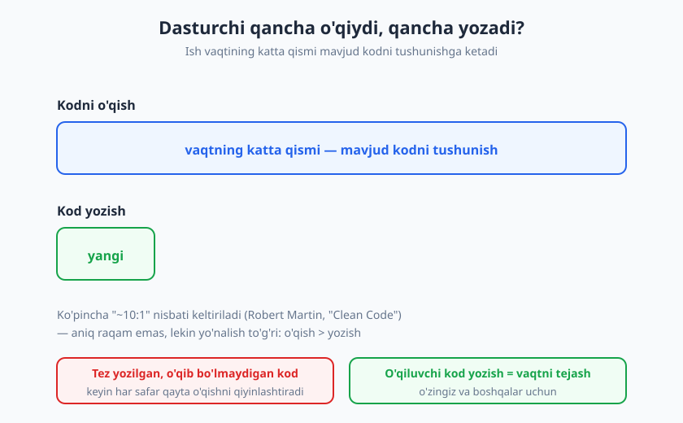
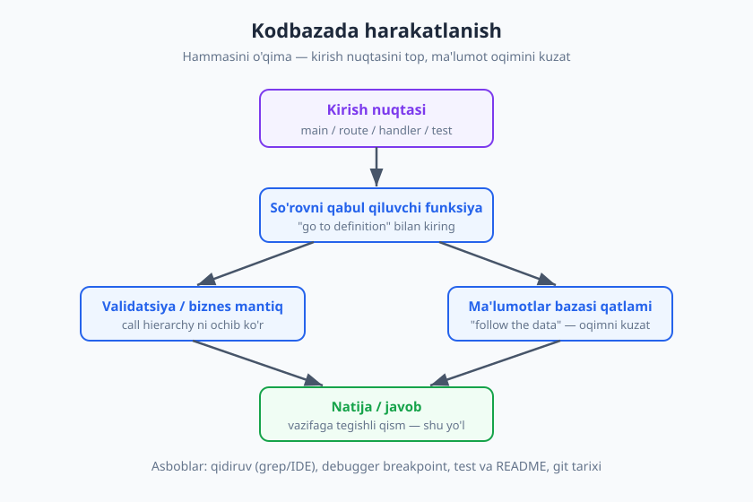
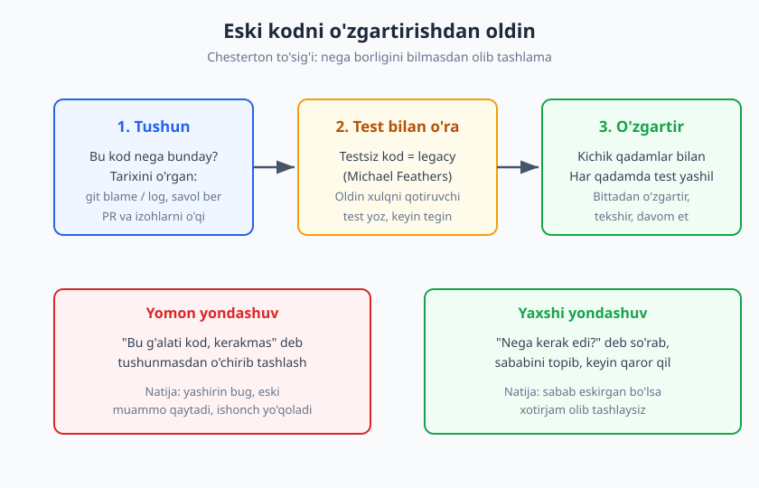

# 21 — Begona kodni o'qish va kodbazada harakatlanish

[⬅️ Oldingi: 20 — Debugging: tizimli yondashuv](./20-debugging-tizimli.md) · [🏠 README](./README.md) · [Keyingi: 22 — Baholash (estimation) va rejalashtirish ➡️](./22-baholash-rejalashtirish.md)

---

> **Bu bobda:** Dasturchining eng kam o'rgatiladigan, lekin eng ko'p ishlatiladigan ko'nikmasi — **begona kodni o'qish**. Nega o'qish yozishdan ko'p ekanini, kodni qanday strategiya bilan (yuqoridan-pastga, ma'lumot oqimini kuzatib) o'qishni, katta kodbazada qanday harakatlanishni, eski (legacy) kod bilan ehtiyotkorlik bilan ishlashni va "Chesterton to'sig'i" tamoyilini ko'ramiz.
>
> **Halollik / Eslatma:** Kod o'qish — faqat ko'p kod o'qib o'sadigan ko'nikma. Bu bob sizga xarita va asboblar beradi, lekin chinakam tezlik faqat yuzlab fayl, o'nlab begona kodbaza ko'rgandan keyin keladi. Birinchi yangi loyihada o'zingizni sekin sezish — bu kuchsizlik emas, normal.

---

## Dasturchi kod yozmaydi — kod o'qiydi

Ko'pchilik dasturlashni shunday tasavvur qiladi: odam ekran oldida o'tirib, boshidan kelgan kodni klaviaturada teradi. Aslida ish joyidagi kunlaringizning katta qismi boshqacha o'tadi — siz **mavjud kodni o'qiysiz**: kimdir yozgan funksiyani tushunishga urinasiz, xato qayerdan kelganini izlaysiz, yangi xususiyatni qayerga ulashni aniqlaysiz. Yangi qator yozishdan oldin, ko'pincha o'nlab qator o'qiysiz.

Robert Martin o'zining *"Clean Code"* (2008) kitobida buni keskin ifodalaydi: o'qish va yozish vaqtining nisbati **taxminan 10:1** ga yaqin — ya'ni biz yozgan har bir qator uchun atrofidagi mavjud kodni qayta-qayta o'qiymiz. Bu aniq, o'lchangan raqam emas — u "ko'pincha keltiriladigan" baho, qo'lda hisoblangan emas. Lekin yo'nalish shubhasiz to'g'ri: **o'qish yozishdan sezilarli ko'p.**



Bu oddiy haqiqatdan ikkita muhim xulosa chiqadi.

**Birinchi xulosa — o'qiluvchi kod yozing.** Agar kod o'qishga yozishdan ko'p vaqt ketsa, demak kodni *o'qishni osonlashtirish* — yozishni biroz qiyinlashtirsa ham — sof yutuq. "Aql-zukko" bir qatorli yechim, uni keyin yarim soat tushunish kerak bo'lsa, yomon yechim. O'zingiz uchun ham: bugun yozgan kodingizni olti oydan keyin o'qiganingizda, u siz uchun ham "begona kod" bo'ladi. Aniq nomlar, kichik funksiyalar, ortiqcha aql-zukkolikning yo'qligi — bularning hammasi *kelajakdagi o'quvchi* uchun. Bu mavzu hujjatlashtirish bilan ham bog'liq — uni [24-bobda](./24-hujjatlashtirish.md) ko'rasiz.

**Ikkinchi xulosa — kod o'qishni alohida ko'nikma sifatida mashq qiling.** Universitetda va kurslarda bizga *yozishni* o'rgatishadi: "mana masala, kod yozing". Lekin "mana begona 50 000 qatorli loyiha, undagi to'lov xatosini toping" degan mashq deyarli berilmaydi. Natijada ko'p dasturchi yozishni yaxshi biladi, lekin begona kodbaza oldida o'zini yo'qotadi. Ishga kirgan birinchi kuningizdagi birinchi vazifangiz — kod yozish emas, balki **mavjud kodbazani tushunish** bo'ladi.

> **Eslatma:** Junior va senior orasidagi sezilmaydigan farqlardan biri — senior begona kodga tushganda kamroq qo'rqadi. U "men buni hech qachon tushunmayman" demaydi; u tizimli ravishda kirish nuqtasini topadi, oqimni kuzatadi va kerakli qismgacha boradi. Bu — o'rganib bo'ladigan jarayon, sehr emas.

---

## Kodni qanday o'qish kerak

Kitobni boshidan oxirigacha o'qiganday, kodni `A` faylidan `Z` fayligacha ketma-ket o'qib chiqolmaysiz — bu vaqtni behuda sarflaydi va miyani to'ldiradi. Kod o'qishning o'ziga xos strategiyalari bor.

### Hammasini o'qishga urinmang

Eng katta yangi-dasturchi xatosi — **butun kodbazani tushunishga urinish**. Bunday qilmang. Sizning maqsadingiz — odatda *aniq bir vazifa*: bitta xatoni tuzatish, bitta xususiyat qo'shish. Demak sizga butun tizim emas, **shu vazifaga tegishli yo'l** kerak. Qolgan 95% kodni hozircha "qora quti" deb qoldiring — kerak bo'lganda ochasiz.

Buni shunday tasavvur qiling: notanish shaharga bordingiz va sizga "vokzaldan mehmonxonaga boring" deyildi. Siz butun shahar xaritasini yodlamaysiz — faqat o'sha bitta marshrutni topasiz. Kod ham xuddi shunday: butun "shaharni" emas, kerakli "marshrutni" o'rganing.

### Yuqoridan-pastga va pastdan-yuqoriga

Kodni o'qishning ikki asosiy yo'nalishi bor, va tajribali dasturchi ikkalasini ham vaziyatga qarab ishlatadi.

**Yuqoridan-pastga (top-down):** umumiy manzaradan boshlaysiz — papkalar tuzilishi, asosiy modullar, arxitektura — keyin asta-sekin detalga tushasiz. "Bu loyihada `auth/`, `payments/`, `api/` papkalari bor; menga to'lov kerak, demak `payments/` ga kiraman; u yerda `charge.js` bor..." Bu yondashuv yangi kodbaza bilan tanishishda eng yaxshi: avval o'rmonni ko'rasiz, keyin daraxtni.

**Pastdan-yuqoriga (bottom-up):** aniq bir qatordan boshlaysiz (masalan, xato chiqqan funksiyadan) va "bu kim chaqiradi? bu qayerga ulanadi?" deb yuqoriga ko'tarilasiz. Bu debugging paytida tabiiy — sizda aniq nuqta bor (stack trace), va undan tarqalasiz.

> **Trade-off:** Yuqoridan-pastga — keng tushuncha beradi, lekin sekin; pastdan-yuqoriga — tez natija beradi, lekin umumiy manzarani ko'rsatmaydi. Yangi loyihada avval biroz yuqoridan-pastga aylanib chiqing (papka tuzilishi, README), keyin vazifaga oid joyda pastdan-yuqoriga chuqurlashing.

### Kirish nuqtasini toping

Har bir dasturning **kirish nuqtasi** bor — kod bajarilishi boshlanadigan joy. Uni topish — o'qishning eng samarali boshlanishi. Loyiha turiga qarab:

- **Veb-server:** marshrut (route) ta'riflari — `GET /users` qaysi funksiyaga ulanadi.
- **CLI dastur:** `main` funksiyasi yoki kirish skripti.
- **Kutubxona:** ommaviy API — tashqaridan chaqiriladigan funksiyalar ro'yxati.
- **Frontend:** ilova ildizi (root komponent) yoki sahifa komponenti.
- **Eng foydali "yashirin eshik":** **test fayllari.** Yaxshi yozilgan test — kodning qanday chaqirilishi va nima qaytishini aniq ko'rsatadi. Ko'pincha bitta testni o'qish butun dokumentatsiyadan tezroq tushuntiradi.

### Ma'lumot oqimini kuzating ("follow the data")

Kod o'qishning eng kuchli texnikasi — **bir bo'lak ma'lumotni boshidan oxirigacha kuzatish.** Bitta savol oling: "Foydalanuvchi formaga email kiritganda, u qayerga boradi?" Va emailni qadam-baqadam kuzating: forma → so'rov (request) → validatsiya → biznes mantiq → ma'lumotlar bazasi. Bu yo'l bo'ylab siz aynan vazifaga kerak qismlarni ko'rasiz, qolganini chetlab o'tasiz.



Bu — kod o'qishni xaotik "u yer-bu yerga sakrash"dan tizimli "bitta ipni ushlab borish"ga aylantiradi. Ip — ma'lumot. Uni qo'yib yubormang.

| Yondashuv | Qachon eng yaxshi | Boshlash nuqtasi |
|---|---|---|
| Yuqoridan-pastga | Yangi kodbaza bilan tanishish | Papka tuzilishi, README, arxitektura |
| Pastdan-yuqoriga | Aniq xato yoki funksiya bor | Stack trace, xato chiqqan qator |
| Kirish nuqtasidan | "Bu so'rov qanday ishlanadi?" | main / route / handler / test |
| Ma'lumot oqimi | "Bu qiymat qayerga boradi?" | Kirish ma'lumotini ushlab kuzatish |

---

## Katta kodbazada harakatlanish

Strategiya bor — endi vositalar. Zamonaviy muhit kod o'qishni ancha osonlashtiradi; ulardan to'liq foydalaning.

### Qidiruv — eng tez yo'l

Begona kodbazada **qidiruv** sizning eng yaqin do'stingiz. Notanish matn (xato xabari, tugma yorlig'i, funksiya nomi) ni qidirish — ko'pincha to'g'ridan-to'g'ri kerakli joyga olib boradi. Ekranda "Tasdiqlash muvaffaqiyatsiz" degan xato ko'rdingizmi? O'sha matnni butun loyihada qidiring — u qayerda yozilganini, demak qaysi kod uni chiqarayotganini topasiz. Bu — IDE qidiruvi yoki `grep` kabi matn-qidiruv vositalari bilan bir necha soniyalik ish.

### IDE imkoniyatlari

Zamonaviy muharrir (IDE) kod ichida "navigatsiya" qiladi, oddiy matn sifatida emas:

- **"Go to definition" (ta'rifga o'tish):** funksiya nomiga bosib, u qayerda yozilganini ochasiz. Begona kodda eng ko'p ishlatiladigan tugma.
- **"Find usages / call hierarchy" (chaqiruvlar iyerarxiyasi):** "bu funksiyani kim chaqiradi?" — pastdan-yuqoriga o'qishning asosiy vositasi. Funksiyani o'zgartirishdan oldin, uni kimlar ishlatishini ko'rishga yordam beradi.
- **"Go to references":** o'zgaruvchi yoki klass qayerlarda ishlatilganini ko'rsatadi.

Bu vositalarni o'rganishga sarflagan har bir daqiqa o'zini yuz baravar qaytaradi.

### Debugger bilan o'rganish

Debugger nafaqat xato tuzatish uchun — u **kodni o'rganish** uchun ham ajoyib. Tushunmoqchi bo'lgan joyga **breakpoint** qo'ying, dasturni ishga tushiring va kod o'sha nuqtaga kelganda **to'xtaydi**. Endi siz "jonli" kodni ko'rasiz: o'zgaruvchilar qanday qiymatda, qaysi yo'ldan kelgan, keyin qayerga boradi. Statik o'qishda taxmin qiladigan narsalarni debugger sizga *aniq ko'rsatadi*. Bu texnikani [20-bobda](./20-debugging-tizimli.md) chuqurroq ko'rgansiz — u yerda debugger xato izlash uchun edi, bu yerda esa kodni *tushunish* uchun.

### Test va hujjatlarni o'qing

Yangi kodbazada birinchi o'qiydigan narsangiz — **README**. U ko'pincha loyihaning maqsadi, qurish (build) usuli va asosiy tushunchalarini beradi. Keyin **testlar**: ular kodning qanday ishlatilishini *ishlaydigan misol* bilan ko'rsatadi. Hujjat eskirgan bo'lishi mumkin, lekin o'tadigan test — yolg'on gapirmaydi, chunki u har gal tekshiriladi.

### Commit tarixi — kodning xotirasi

Kod *nima* qilishini fayldan ko'rasiz, lekin *nega* shunday qilishini ko'pincha faqat **tarix** aytadi. `git blame` har bir qatorni kim, qachon va **qaysi commit**da yozganini ko'rsatadi. O'sha commit'ning xabarini va unga bog'liq pull request'ni o'qisangiz — ko'pincha "nega bu g'alati shart qo'shilgan?" degan savolingizga javob topasiz: "2019-yilda mijoz X muammosi uchun qo'shilgan". `git log` esa faylning butun evolyutsiyasini ko'rsatadi. Git bilan ishlashni alohida o'rgansangiz arziydi — u kod o'qishning yashirin super-kuchidir.

> **Diqqat:** Begona kodda "bu nega bunday yozilgan?" degan savolingiz bo'lsa, kodni emas — **tarixini** so'rang. `git blame` ko'pincha kommentariyadan ko'ra ko'proq haqiqatni aytadi.

---

## Legacy (eski) kod bilan ishlash

Ertami-kechmi siz **legacy kod**ga duch kelasiz — yillar oldin yozilgan, hujjatsiz, asl muallifi allaqachon ketgan, "tegishga qo'rqiladigan" kod. Bu — har bir real loyihada bor narsa, va u bilan ishlash alohida ko'nikma.

### "Legacy" nima — kutilmagan ta'rif

Michael Feathers o'zining sohada klassik bo'lib qolgan *"Working Effectively with Legacy Code"* (2004) kitobida legacy'ga g'ayrioddiy, lekin juda foydali ta'rif beradi: **legacy kod — bu testsiz kod.** Yoshi yoki uslubi muhim emas — agar kodning to'g'ri ishlashini avtomatik tekshiradigan test bo'lmasa, har qanday o'zgartirish — ko'r-ko'rona, xavfli qadam, chunki nimani buzganingizni darrov bilmaysiz. Aksincha, kecha yozilgan kod ham, testsiz bo'lsa, allaqachon "legacy" dir.

Bu ta'rif nima uchun foydali? Chunki u sizga aniq harakat beradi: legacy kod bilan ishlashning kaliti — **avval test bilan o'rab olish, keyin o'zgartirish.** Testlash mavzusini [testlash kitobida](../testing/README.md) chuqur ko'rasiz; bu yerda muhimi — *nega* test legacy bilan ishlashda markaziy ekani.



### Tushunmasdan o'zgartirmang

Legacy kod bilan ishlashning birinchi qoidasi: **tushunmagan kodni o'zgartirmang.** Yangi dasturchi ko'pincha sabrsizlanadi — "bu chalkash, men buni toza qilib qayta yozaman". Bu — eng xavfli yo'l. Chalkash ko'rinadigan kod ko'pincha *yillar davomida topilgan real muammolarning yechimi* — har bir "g'alati" shart kimdir tunlab tuzatgan haqiqiy xatoning izi bo'lishi mumkin. Siz uni "tozalaganingizda", o'sha xatolarni qaytarib olib kelasiz.

### Kichik qadamlar bilan harakat qiling

Legacy kodni katta, bir martalik "qayta yozish" bilan emas, **kichik, xavfsiz qadamlar** bilan yaxshilang:

1. O'zgartirmoqchi bo'lgan joyni **tushuning** (o'qish, tarix, debugger).
2. Uning hozirgi xulqini **qotiruvchi test** yozing — kod *hozir nima qilsa*, shuni yozib qo'ying (to'g'ri yoki noto'g'ri bo'lishidan qat'i nazar — bu "xulqni muhrlash" testi).
3. Endi kichik o'zgartirish kiriting va testni ishga tushiring — yashil bo'lsa, xulqni buzmadingiz.
4. Yana kichik qadam, yana test. Asta-sekin oldinga.

Bu sekin ko'rinadi, lekin "katta jasur o'zgartirish" qilib, butun tizimni sindirib, keyin kunlab tuzatishdan ko'ra ancha tez va xavfsiz. Tajriba shuni o'rgatadi: legacy kodda **sekin — bu tez.**

> **Trade-off:** "Hammasini qayta yozaman" (rewrite) vasvasasi kuchli, lekin u deyarli har doim baholangandan uzoq va xavfli chiqadi. Ko'p hollarda bosqichma-bosqich yaxshilash (refactoring) — bir vaqtning o'zida ishlaydigan tizimni saqlab, kichik bo'laklarni almashtirish — to'g'riroq qaror. Bu turdagi qarorlar — "qaysi yechim to'g'ri" emas, "qaysi murosa maqbul" — alohida fikrlashni talab qiladi.

---

## Chesterton to'sig'i — nega borligini bilmasdan olib tashlama

Legacy kod bilan ishlashning eng muhim aqliy modeli — **Chesterton to'sig'i (Chesterton's Fence).** Bu — ingliz yozuvchisi G.K. Chesterton 1929-yilda *"The Thing"* nomli essesida keltirgan masal. Mazmuni shunday:

> Tasavvur qiling, yo'l o'rtasida bir to'siq (panjara) turibdi. Bir islohotchi keladi va deydi: "Bu to'siqning foydasini ko'rmayapman, olib tashlaylik." Aqlliroq odam unga javob beradi: "Agar nega borligini ko'rmayotgan bo'lsang, men senga uni olib tashlashga ruxsat bermayman. Borib o'yla. Qachonki qaytib kelib *nega* bu yerda ekanini menga aytib bersang — shunda, ehtimol, men senga uni olib tashlashga ruxsat beraman."

Bu masalning kodga tatbiqi to'g'ridan-to'g'ri: **agar bir kod bo'lagining nega borligini tushunmasangiz, uni olib tashlash (yoki o'zgartirish) huquqini hali qozonmagansiz.** Avval *nega borligini* tushuning. Sabab hali ham amal qilsa — qoldiring. Sabab eskirgan bo'lsa — endi xotirjam, bila turib olib tashlaysiz.

### Amalda qanday ko'rinadi

Faraz qiling, kodda g'alati ko'rinadigan qator bor:

```
// Vaqtinchalik tuzatish, keyinroq olib tashlanadi
if (user.country === "XX") {
    timeout = timeout * 3;
}
```

❌ **Yomon reaksiya:** "Bu nimaga kerak? `XX` degan davlat yo'q-ku. O'chiraman."

✅ **Yaxshi reaksiya:** "Bu nega qo'shilgan?" — `git blame` qilasiz, commit'ni topasiz: "2021-yil, `XX` regionidagi sekin tarmoq tufayli mijoz shikoyat qildi, vaqtni uchga oshirdik". Endi siz *sababni* bilasiz. Savol: bu sabab hali ham amal qiladimi? Agar o'sha region endi yo'q yoki tarmoq tuzatilgan bo'lsa — endi *bila turib*, hujjatlashtirib olib tashlaysiz. Agar hali kerak bo'lsa — qoldirasiz va, ehtimol, izohini yaxshilaysiz.

Farq nozik, lekin muhim: ikkala holatda ham kod o'chirilishi mumkin — lekin yaxshi yo'lda siz **sababni bilib** qaror qilasiz, ko'r-ko'rona emas. Chesterton to'sig'i sizni "o'chirmaslik"ka emas, **"tushunmasdan o'chirmaslik"ka** chaqiradi.

### Yangi kodbazaga onboarding

Yangi ish yoki yangi loyihaga qo'shilganingizda — bu butun bob amaliyotga aylanadigan payt. Bir nechta amaliy maslahat:

- **Savol berishdan uyalmang.** "Bu modul nima uchun?" degan savol — johillik emas, professional qiziqish. Tajribali a'zolar yangi odamning savollarini qadrlaydi (ular ko'pincha eskirgan narsalarni ham ko'rsatib beradi). Yaxshi savol berish ko'nikmasini [9-bobda](./09-texnik-muloqot-asoslari.md) ko'rgansiz.
- **Kichik vazifadan boshlang.** Birinchi kunlaringizda butun arxitekturani qamrab oladigan vazifa olmang. Kichik xato tuzatish yoki kichik xususiyat — bu sizga kodbaza ichida "marshrut" o'rganish, qurish-test-deploy jarayonini ko'rish imkonini beradi. Birinchi maqsad — *kichik narsani oxirigacha yetkazish*, katta narsani yarim qilib qo'yish emas.
- **Qaror tarixini hurmat qiling.** Siz kelmagunizgacha jamoa ko'p qarorlar qabul qilgan. Ularning hammasi ham mukammal emas, lekin har birining sababi bor edi. "Nega buni mikroservis qilmagansiz?" degan savolni hujum sifatida emas, qiziqish sifatida bering.

> **Eslatma:** Yangi joyda "bu yerda hammasi noto'g'ri qilingan" degan birinchi taassurot — deyarli har doim noto'g'ri. Siz hali kontekstni bilmaysiz. Avval *nega* shunday qilinganini tushuning, keyin baho bering. Chesterton to'sig'i — faqat kod uchun emas, butun jamoaga qo'shilish madaniyati uchun ham.

---

## Asosiy g'oyalar (bobni qisqacha)

- **Dasturchi kod yozishdan ko'ra ko'proq kod o'qiydi** — ko'pincha "~10:1" nisbati keltiriladi (Robert Martin, "Clean Code"). Aniq raqam emas, lekin yo'nalish to'g'ri: shuning uchun **o'qiluvchi kod yozing** va **kod o'qishni alohida mashq qiling**.
- **Hammasini o'qishga urinmang.** Maqsad — butun tizim emas, **vazifaga tegishli yo'l**. Kirish nuqtasini (main / route / handler / test) toping va **ma'lumot oqimini** ("follow the data") boshidan oxirigacha kuzating.
- **Yuqoridan-pastga** (arxitekturadan detalga) va **pastdan-yuqoriga** (xato qatoridan yuqoriga) — ikkala yo'nalishni vaziyatga qarab ishlating.
- **Vositalar:** qidiruv (grep/IDE), "go to definition", call hierarchy, **debugger bilan o'rganish** (breakpoint qo'yib jonli oqimni ko'rish), README va testlar, **git blame/log** (kodning "nega"siga javob).
- **Legacy = testsiz kod** (Michael Feathers). Kalit qoida: **tushunmasdan o'zgartirma**, oldin **xulqni qotiruvchi test** yoz, keyin **kichik qadamlar** bilan o'zgartir. "Sekin — bu tez."
- **Chesterton to'sig'i** (G.K. Chesterton, 1929): nega borligini bilmasdan kodni olib tashlama. Avval *nega* borligini (tarix, `git blame`) tushun; sabab eskirgan bo'lsa — endi **bila turib** o'chir. Yangi kodbazaga onboarding'da: **savol ber, kichik vazifadan boshla, qaror tarixini hurmat qil.**

## Mashqlar

### Oson

**1-mashq.** Hozir ishlayotgan (yoki yaqinda ko'rgan) biror loyihani oching va uning **kirish nuqtasini** toping: dastur bajarilishi qayerdan boshlanadi? Bir-ikki jumlada yozing: bu qanday loyiha (server / CLI / frontend / kutubxona) va kirish nuqtasi qaysi fayl/funksiyada.

**2-mashq.** Bir kod faylida tushunmaydigan bir qator yoki bir shartni tanlang. `git blame` (yoki IDE ning shu vositasi) bilan u **qachon va qaysi commit**da qo'shilganini toping. Commit xabarini o'qing — u kodning "nega"sini tushuntiradimi? Topganingizni yozing.

### O'rta

**3-mashq.** Bir aniq xususiyatni (masalan, "foydalanuvchi tizimga kirganda nima sodir bo'ladi?") tanlang va uni kodbaza bo'ylab **boshidan oxirigacha kuzating** ("follow the data"). O'tgan har bir bosqichni (forma → so'rov → validatsiya → ... → natija) ketma-ket ro'yxat qilib yozing. Yo'lda nechta fayl/funksiyadan o'tdingiz?

**4-mashq.** Loyihangizdagi eng chalkash yoki eng kam tushunarli **bitta modul/funksiyani** tanlang va uni **hujjatlashtiring**: u nima qiladi, kirish va chiqishi nima, qachon chaqiriladi. Buni faqat kodni o'qib (3-shaxsga tushuntirayotganday) yozing. Yozish jarayonida o'zingiz tushunmagan joylar ko'rinadimi?

### Qiyin

**5-mashq.** Loyihangizda (yoki ochiq kod loyihasida) **"g'alati" ko'rinadigan** bir kod bo'lagini toping — magic raqam, g'alati shart, tushunarsiz vaqtinchalik tuzatish. Unga **Chesterton to'sig'i**ni qo'llang: tarixini o'rganing (`git blame`, PR, izoh), nega qo'shilganini aniqlang va yozing. Sabab hali ham amal qiladimi? Sizning xulosangiz: qoldirasizmi, o'zgartirasizmi yoki olib tashlaysizmi — va **nega**?

**6-mashq.** Bir legacy (testsiz) funksiyani tanlang va uni o'zgartirishga tayyorlang — lekin o'zgartirmasdan oldin: (a) uning **hozirgi xulqini** qog'ozda tasvirlang (turli kirishlarda nima qaytaradi), (b) shu xulqni tekshiradigan **kamida bitta test** g'oyasini yozing (kod yozolmasangiz ham, "X kirsa Y kutaman" shaklida). Endi o'ylang: bu test bo'lmasa, o'zgartirish qanday xavfli bo'lar edi?

<details markdown="1">
<summary>Yechimlar / Namunaviy yondashuvlar</summary>

### 1-mashq yechimi
Maqsad — "kirish nuqtasi" tushunchasini real loyihaga bog'lash. Namunaviy yozuv: *"Bu — veb-server (Express/Laravel/Django). Kirish nuqtasi — marshrutlar fayli (`routes.js` / `web.php` / `urls.py`); masalan `POST /login` qatori `AuthController.login` funksiyasiga ulanadi. Demak login oqimini o'rganish uchun men o'sha funksiyadan boshlayman."* Agar loyiha CLI bo'lsa, kirish nuqtasi odatda `main` yoki `bin/` papkasidagi skript; frontend bo'lsa — ilova ildizi (root komponent) yoki sahifa. Asosiysi — siz endi "qayerdan boshlashni" bilasiz, butun loyihaga tarqalmaysiz.

### 2-mashq yechimi
`git blame <fayl>` har bir qator yonida commit hash, muallif va sanani ko'rsatadi. Qiziqtirgan qatorning hash'ini olib, `git show <hash>` bilan to'liq commit'ni va xabarini ko'rasiz. Yaxshi commit xabari "nega"ni aytadi: masalan *"Fix: handle empty cart on checkout (#482)"* — demak g'alati `if (cart.length === 0)` sharti bo'sh savatcha xatosi uchun qo'yilgan. Agar xabar yomon ("update", "fix") bo'lsa — bu ham saboq: o'zingiz yaxshi commit xabari yozish muhimligini ko'rsatadi. Topilma: kod *nima* qilishini fayldan, *nega* qilishini tarixdan bilasiz.

### 3-mashq yechimi
Namunaviy "follow the data" ro'yxati (login uchun): (1) Login formasi — foydalanuvchi email/parol kiritadi; (2) Forma `POST /login` so'rovini yuboradi; (3) Marshrut `AuthController.login` ga ulaydi; (4) Validatsiya — maydonlar to'g'rimi; (5) Biznes mantiq — parol bazadagi hash bilan solishtiriladi; (6) Sessiya/token yaratiladi; (7) Javob — muvaffaqiyat yoki xato qaytadi. Siz, ehtimol, 4-6 fayldan o'tgansiz. Muhim xulosa: siz **butun kodbazani emas, faqat shu ipni** o'qidingiz — va login qanday ishlashini to'liq tushundingiz. Aynan shu — samarali kod o'qish.

### 4-mashq yechimi
Hujjatlashtirishning kuchi — u sizni **tushunishga majbur qiladi.** Namunaviy yozuv: *"`recalculatePrices(order)` funksiyasi — buyurtmadagi har bir mahsulot narxini chegirma va soliq bilan qayta hisoblaydi. Kirish: `order` obyekti (mahsulotlar ro'yxati bilan). Chiqish: yangilangan `order` (har mahsulotda `finalPrice` maydoni bilan). Checkout sahifasi yuklanganda chaqiriladi."* Yozayotib, ehtimol, "shu yerda nega ikki marta yaxlitlanyapti?" kabi tushunmagan joylaringiz ko'rinadi — bu normal va foydali: hujjatlash sizning tushunchangizdagi yoriqlarni ochadi (rezina o'rdak effektining bir ko'rinishi). Bu mashqni [24-bobda](./24-hujjatlashtirish.md) chuqurroq rivojlantirasiz.

### 5-mashq yechimi
Chesterton to'sig'ining to'liq sikli. Namuna: g'alati qator — `retries = 5` (nega aynan 5?). Tarix: `git blame` → commit *"Increase retries: payment gateway flaky during 2022 sale"*. Sabab: 2022-yilgi katta savdo paytida to'lov shlyuzi beqaror edi, qayta urinishlar oshirilgan. Hozir amal qiladimi? Tekshirasiz: shlyuz hali ham beqarormi? Agar provayder o'zgargan/barqarorlashgan bo'lsa — `5` ortiqcha bo'lishi mumkin, lekin **bila turib** kamaytirasiz va izoh qo'shasiz. Agar hali kerak bo'lsa — qoldirasiz, lekin izohni yaxshilaysiz ("retries=5: 2022 savdo davridagi shlyuz beqarorligi uchun, 2025-da qayta ko'rilsin"). Xulosa qaysi bo'lishidan qat'i nazar — siz uni **ko'r-ko'rona emas, sababni bilib** qildingiz. Aynan shu Chesterton to'sig'ining mohiyati.

### 6-mashq yechimi
Maqsad — "test bilan o'rab olish, keyin o'zgartirish" mantig'ini his qilish. Namuna: funksiya — `formatPhone(raw)`. (a) Hozirgi xulq: *"`'998901234567'` kirsa `'+998 90 123 45 67'` qaytadi; bo'sh string kirsa bo'sh qaytadi; 12 ta raqamdan kam kirsa — `null` qaytadi (sinab ko'rdim)."* (b) Test g'oyalari: "`'998901234567'` kirsa `'+998 90 123 45 67'` kutaman", "`''` kirsa `''` kutaman", "`'123'` kirsa `null` kutaman". Endi savol: bu testlar bo'lmasa, formatlashni o'zgartirganingizda (masalan, yangi format qo'shsangiz) — eski holatlar buzilganini **darrov bilmas edingiz**; xato faqat productionda, mijoz shikoyatidan keyin chiqardi. Test — bu sizning "o'zgartirish to'rim". Aynan shuning uchun Feathers legacy bilan ishlashda testni markazga qo'yadi.

</details>

---

[⬅️ Oldingi: 20 — Debugging: tizimli yondashuv](./20-debugging-tizimli.md) · [🏠 README](./README.md) · [Keyingi: 22 — Baholash (estimation) va rejalashtirish ➡️](./22-baholash-rejalashtirish.md)
