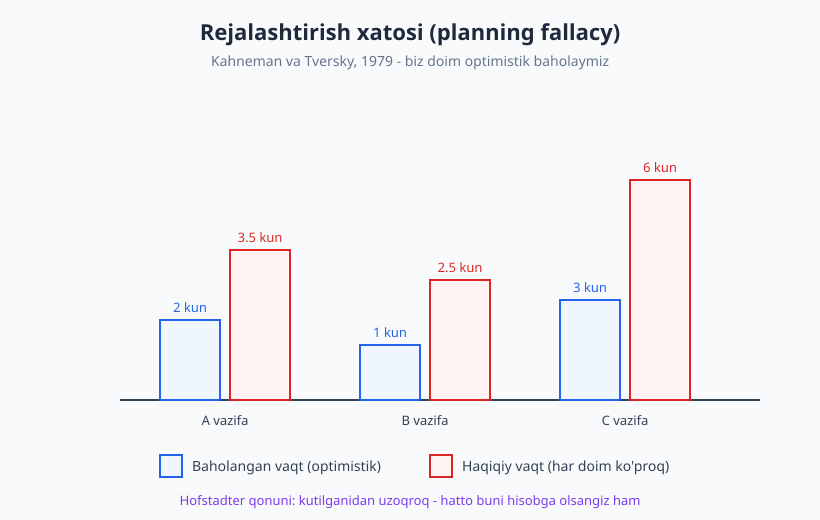
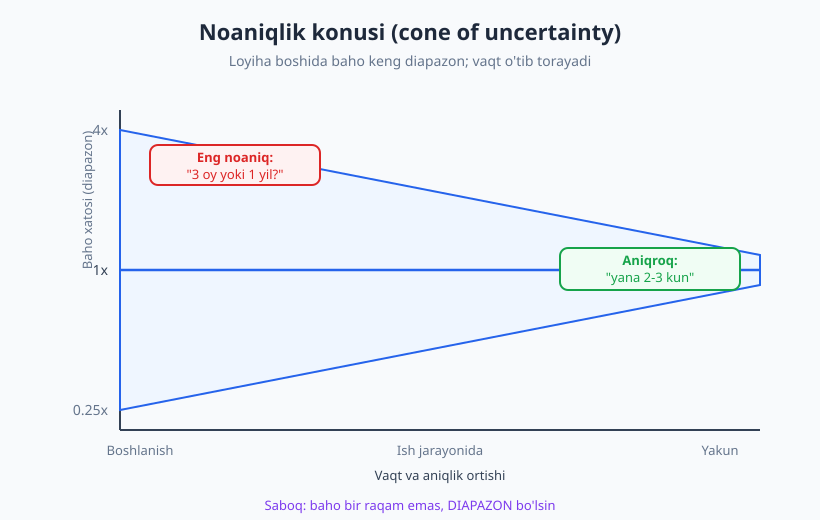
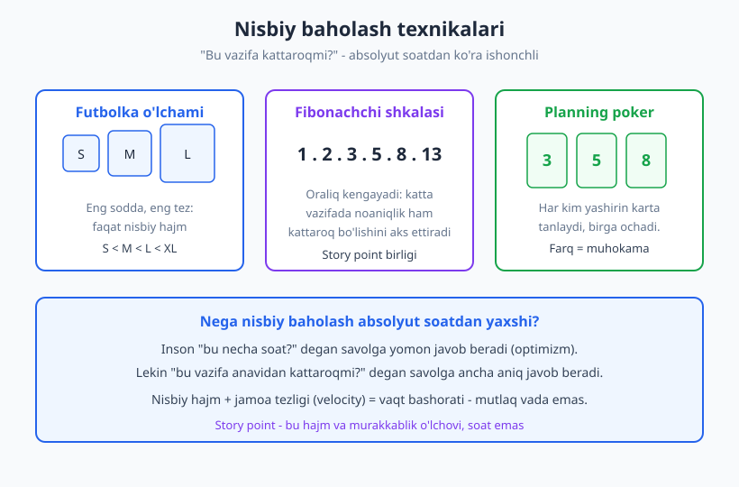

# 22 — Baholash (estimation) va rejalashtirish

[⬅️ Oldingi: 21 — Begona kodni o'qish va kodbazada harakatlanish](./21-begona-kodni-oqish.md) · [🏠 README](./README.md) · [Keyingi: 23 — Texnik qaror va trade-off'lar ➡️](./23-texnik-qaror-tradeoff.md)

---

> **Bu bobda:** "Bu qancha vaqt oladi?" — dasturchini eng ko'p qiynaydigan savol. Nega baholash tabiatan qiyin ekanini (rejalashtirish xatosi, Hofstadter qonuni, noma'lum noma'lumliklar), noaniqlik konusi (Boehm/McConnell) nega bahoni diapazonga aylantirishini, nisbiy baholashni (story point, futbolka o'lchami, Fibonachchi, planning poker), bo'laklash va buferni, va eng muhimi — noaniqlikni halol muloqot qilishni o'rganamiz.
>
> **Halollik / Eslatma:** Baholash — **o'rganib bo'ladigan, lekin tabiatan noaniq** ko'nikma. Hech bir ramka sizga aniq raqam bermaydi — chunki kelajakni hech kim bilmaydi. Bu bobning maqsadi sizni "yaxshi taxminchi" qilish emas, balki **noaniqlikni ochiq ushlaydigan va halol yetkazadigan** dasturchi qilish. Aniqlik tajriba bilan, faqat amaliyotda o'sadi.

---

## Nega baholash qiyin

Bir kuni lead sizdan so'raydi: "Bu xususiyatni qancha vaqtda qilasan?" Siz bir lahza o'ylab, "Uch kunda bo'ladi" deysiz. Ikki haftadan keyin u hali ham tugamagan. Tanish hikoya, to'g'rimi? Bu — yagona sizning muammoyingiz emas. Bu — **butun sohaning** muammosi, va uning sabablari aniq nomlangan.

Birinchi sabab: **dasturlash — noma'lumlik bilan ishlash.** Agar vazifa to'la ma'lum bo'lsa, u allaqachon kutubxonada yoki Stack Overflow'da yechilgan va siz uni nusxa olib qo'ya qolardingiz. Sizga *yangi* kod yozish kerak bo'lsa, demak hech kim aynan shu narsani aynan shu sharoitda qilmagan. Baho — kelajakdagi, hali ko'rmagan ishingiz haqidagi taxmin. Ishni qilib bo'lgach, "ha, oson edi" deyish oson; lekin baho ishdan *oldin* beriladi, eng kam ma'lumotga ega bo'lganingizda.

### Rejalashtirish xatosi — biz tabiatan optimistmiz

Ikkinchi sabab psixologik. **Rejalashtirish xatosi (planning fallacy)** — bu kognitiv xatolik bo'lib, biz vazifaning qancha vaqt olishini **muntazam ravishda kam baholaymiz.** Uni 1979-yilda psixologlar **Daniel Kahneman va Amos Tversky** ta'rifladi (mashhur "Intuitive prediction" ishida; Kahneman keyinchalik buni *"Sekin va tez fikrlash"* kitobida ham yozdi).

Mexanizm sodda: baho berayotganda biz ongimizda **eng yaxshi stsenariy**ni tasavvur qilamiz — hammasi silliq ketadi, hech narsa buzilmaydi, telefon jiringlamaydi. Kahneman buni **ichki ko'rinish (inside view)** deb atadi: biz aynan shu vazifaga tikilamiz, qadamlarni xayolan chizamiz va ideal yo'lni hisoblaymiz. Lekin haqiqiy hayotda bo'ladigan kutilmagan to'siqlar — buzilgan test, kutilmagan bog'liqlik, kasal bo'lib qolgan hamkasb — bularning hech biri o'sha xayoliy stsenariyga kirmaydi.

Buning davosi — **tashqi ko'rinish (outside view):** "shunga *o'xshash* o'tgan vazifalar menda qancha vaqt olgan edi?" Bu savol og'riqli, lekin ancha aniqroq. Agar oxirgi besh marta "uch kunlik" vazifangiz o'rtacha sakkiz kunda tugagan bo'lsa — yangi "uch kunlik" vazifa ham ehtimol sakkiz kun. Tarixingiz — bahoyingizdan ko'ra rost gapiradi.

### Hofstadter qonuni

Bu hodisaning eng mashhur, yarim hazil ifodasi — **Hofstadter qonuni:**

> *"Har doim kutilganidan uzoqroq vaqt oladi — hatto siz Hofstadter qonunini hisobga olgan bo'lsangiz ham."*

Buni kognitiv olim **Douglas Hofstadter** 1979-yilgi *"Gödel, Escher, Bach"* kitobida yozgan. Hazil shundaki: siz "men optimistman, shuning uchun bahomni ikkiga ko'paytiraman" desangiz ham — baribir kam baholaysiz. Qonun o'z-o'ziga murojaat qiladi. Bu — baholashga **kamtarlik bilan** yondashish kerakligining kulgili, ammo chuqur eslatmasi.

### Noma'lum noma'lumliklar

Uchinchi sabab — eng nozigi. Bilimni uch toifaga bo'lish mumkin:

- **Ma'lum ma'lumliklar:** "Ma'lumotlar bazasiga ulanishim kerakligini bilaman, va buni qanday qilishni ham bilaman."
- **Ma'lum noma'lumliklar:** "Tashqi API'dan foydalanishim kerak, lekin uning hujjatini hali o'qimaganman." — Bu xavfni hisoblaysiz, chunki uning borligini bilasiz.
- **Noma'lum noma'lumliklar:** "O'sha API kunlik so'rov chegarasiga ega va biz uni ikkinchi haftada bilib qolamiz." — Bularni baholashda **hisobga olib bo'lmaydi**, chunki ular borligidan ham bexabarsiz.

Aynan **noma'lum noma'lumliklar** baholarni buzadi. Va ularning soni vazifa qanchalik yangi va murakkab bo'lsa, shunchalik ko'p. Shuning uchun "loyihaning oxirgi 10%i vaqtning yarmini oladi" degan maqol bejiz emas — o'sha 10%ga yashiringan kutilmagan narsalar to'planib qoladi.

> **Diqqat:** Baholash xatosi — sizning shaxsiy kamchiligingiz emas. Bu — butun sohaning, hatto eng tajribali muhandislarning ham doimiy muammosi. Maqsad xatoni nolga tushirish emas (bu imkonsiz), balki xatoni **bilib turish** va uni **halol yetkazish**.

---

## Noaniqlik konusi — baho diapazon, raqam emas

Agar baho tabiatan noaniq bo'lsa, eng halol javob — bitta raqam emas, **diapazon.** Bu g'oyani vizual qiladigan klassik model bor: **noaniqlik konusi (cone of uncertainty).**

Bu modelni dasturlash sohasiga **Barry Boehm** 1981-yilgi *"Software Engineering Economics"* kitobida kiritgan (u uni "Funnel Curve" — voronka egri chizig'i deb atagan). "Cone of uncertainty" nomini esa **Steve McConnell** ommalashtirgan (*"Software Project Survival Guide"*, 1997 va *"Software Estimation"*, 2006).

G'oya quyidagicha. Loyiha **boshida** — siz eng kam ma'lumotga ega bo'lganingizda — bahoyingiz juda noaniq: haqiqiy vaqt sizning bahoyingizdan to'rt baravar ko'p yoki to'rt baravar kam bo'lishi mumkin. Ish jarayonida noma'lumliklar ma'lumga aylanadi: arxitekturani aniqlaysiz, API'ni sinab ko'rasiz, qiyin joylarni topasiz. Konus **torayadi** — baho aniqlashadi. Yakunga yaqin esa "yana ikki-uch kun" deyish mumkin, chunki deyarli hammasi ma'lum.

Bundan ikki muhim amaliy xulosa chiqadi:

1. **Bahoni diapazon sifatida bering.** "Uch kun" emas, "**uch-besh kun**". "Bir oy" emas, "**uch haftadan ikki oygacha**". Diapazon yolg'on emas — u **rost**: u noaniqlikni ochiq aytadi. Bitta raqam berish — go'yo siz kelajakni aniq bilgandek ko'rsatadigan yolg'on aniqlik (false precision).
2. **Bahoni qayta ko'rib chiqing.** Baho — bir martalik shartnoma emas. Ish ketganda ko'proq bilib qolasiz; bilganingizda bahoni yangilang va buni jamoaga ayting. "Kechagi bahom uch kun edi, lekin endi muammoning bu qismini ko'rib, besh kun ko'rinyapti" — bu professionallik, nochillik emas.

> **Trade-off:** Aniq bitta raqam *qulay* — menejer rejaga qo'yishi oson. Lekin u *yolg'on*. Diapazon esa *noqulay*, ammo *rost*. Yaxshi muhandis qulaylik o'rniga rostlikni tanlaydi — va diapazonni qanday tushuntirishni o'rganadi: "Pastki chegara — hammasi silliq ketsa; yuqori chegara — odatdagi to'siqlar chiqsa."

Diapazonni **ishonch darajasi** bilan ham berish mumkin: "90% ishonch bilan — ikki haftada; 50% ishonch bilan — bir haftada." Bu menejerga rejani xavf darajasiga qarab tuzishga imkon beradi.

---

## Nisbiy baholash — soatdan ko'ra hajmni o'lcha

Inson miyasi "bu necha soat oladi?" degan savolga yomon javob beradi (yuqorida ko'rdik — optimizm). Lekin "bu vazifa anavidan kattaroqmi?" degan savolga **ancha aniq** javob beradi. Aynan shu kuzatuv **nisbiy baholash (relative estimation)** asosida yotadi — agile jamoalarda keng tarqalgan yondashuv.

### Story point va Fibonachchi shkalasi

**Story point** — vazifaning *hajmi va murakkabligi* o'lchovi, **soat emas.** Bir vazifa 3 ball, boshqasi 5 ball desangiz — siz "ikkinchisi birinchisidan biroz kattaroq va murakkabroq" deyapsiz, "soat" haqida emas. Vaqtni keyin jamoaning **tezligi (velocity)** — ya'ni jamoa bir sprintda o'rtacha necha ball bajarishi — orqali hisoblanadi.

Ko'pincha **Fibonachchi shkalasi** ishlatiladi: 1, 2, 3, 5, 8, 13... Oraliq ataylab kengayadi, chunki vazifa qanchalik katta bo'lsa, baho ham shunchalik noaniq. "8 yoki 13 mi?" degan savol "11 yoki 12 mi?" degan soxta aniqlikdan ko'ra ma'noliroq — katta vazifada 12 va 13 farqini hech kim ajrata olmaydi.

### Futbolka o'lchami va planning poker

Eng sodda nisbiy shkala — **futbolka o'lchami (t-shirt sizing):** S / M / L / XL. Hech qanday raqam yo'q, faqat nisbiy hajm. Bu loyihaning erta, juda noaniq bosqichida — "bu xususiyat S mi yoki XL mi?" — ajoyib ishlaydi.

**Planning poker** — bu baholashni jamoaviy qiladigan o'yin. Har bir jamoa a'zosi vazifa uchun kartani **yashirin** tanlaydi, keyin hamma **bir vaqtda** ochadi. Agar baholar yaqin bo'lsa — kelishildi. Agar kimdir 3, boshqasi 13 desa — bu **eng qimmatli daqiqa:** ular vazifani turlicha tushunishgan. "Nega 13?" deb so'rang — ehtimol u siz bilmagan murakkablikni ko'rgan ("bu yerda eski migratsiya bor, uni ham yangilash kerak"). Yashirin tanlash muhim: aks holda birinchi gapirgan odam (ko'pincha eng katta lavozimli) hammaning fikrini "langar" qilib qo'yadi.

| Texnika | Birlik | Eng yaxshi qachon |
|---|---|---|
| Futbolka o'lchami | S / M / L / XL | Erta, juda noaniq bosqich; tez saralash |
| Fibonachchi (story point) | 1, 2, 3, 5, 8, 13 | Sprint planning, jamoaviy backlog |
| Planning poker | Fibonachchi kartalar | Jamoa bilan birga baholash, fikr to'qnashuvi |
| Absolyut soat/kun | soat, kun | Aniq, kichik, yaxshi tushunilgan vazifa |

> **Eslatma:** Story point — jamoa **ichida** ma'noli. Bir jamoaning "5"i boshqa jamoaning "5"iga teng emas, va story point'ni xodimlarni taqqoslash yoki "tezroq ishla" deb bosim qilish uchun ishlatish — bu metrikani buzadi. Nisbiy baholashning maqsadi — bashorat, nazorat emas.

---

## Bo'laklash va bufer

Nisbiy baholash ham, diapazon ham yaxshi — lekin baholashni **aniqroq** qiladigan eng kuchli texnika sodda: **bo'laklash (decomposition).**

### Kichik bo'lak — aniqroq baho

Katta vazifani baholash qiyin, chunki u ichida ko'p noma'lumlik yashiradi. "Foydalanuvchi profili tizimini qil" — bu necha kun? Bilmaysiz. Lekin uni bo'laklang:

- Profil sahifasi marshrutini ochish — yarim kun
- Backend'dan ma'lumot olish — bir kun
- Sahifada ko'rsatish — yarim kun
- Tahrirlash formasi — bir kun
- Validatsiya va saqlash — bir kun
- Rasm yuklash — *bu noma'lum, alohida tekshirish kerak*

Endi ikki narsa yutdingiz. Birinchidan, har bir kichik bo'lakni baholash **ancha aniqroq**, va xatolar ko'pincha bir-birini qisman kompensatsiya qiladi (biri tezroq, biri sekinroq). Ikkinchidan — va bu muhimroq — bo'laklash jarayonida **noma'lum noma'lumliklar ma'lum noma'lumliklarga aylanadi.** "Rasm yuklashni hali bilmayman" — buni endi ko'rdingiz; demak uni alohida tekshirib (spike), keyin baholash mumkin. Bo'laklashning o'zi — noaniqlikni kamaytiruvchi vosita.

Umumiy qoida: agar bir bo'lak baxosi ikki-uch kundan oshsa, u **hali yetarli bo'laklanmagan** — ichida yashiringan noma'lumlik bor degani. Uni yana mayda qiling.

### Bufer — qo'sh, lekin yashirma

**Murphy qonuni:** "Buzilishi mumkin bo'lgan narsa buziladi." Baho — eng yaxshi stsenariy bo'lgani uchun, real rejaga **bufer** (zaxira vaqt) qo'shish oqilona. Lekin bufer bilan ishlashda bitta katta xato bor: uni **yashirish.**

- ❌ **Yomon:** Ichingizda "uch kun" deb hisoblaysiz, lekin "besh kun" deb aytasiz va farqni o'zingizga sir saqlaysiz. Natija: hech kim haqiqiy bahoni bilmaydi, reja yolg'on raqamlarga quriladi, va Parkinson qonuni bo'yicha ish baribir besh kunni to'liq egallaydi.
- ✅ **Yaxshi:** "Asosiy ish uch kun, lekin rasm yuklash qismida noaniqlik bor, shuning uchun zaxira bilan besh kun deb rejalashtiraman" deysiz. Bufer ochiq, sababli, va u **xavfga bog'langan.**

Bufer — jazo emas, **noaniqlikning halol bahosi.** Uni butun loyiha darajasida ushlash (har vazifaga emas, umumiy zaxira sifatida) ko'pincha sog'lomroq, chunki u alohida vazifalardagi optimizm va pessimizmni o'rtachalashtiradi.

### #NoEstimates — boshqacha yondashuv

Ba'zi jamoalar boshqa yo'lni tanlaydi. **#NoEstimates** harakati shuni taklif qiladi: agar baholash shunchalik noaniq bo'lsa, soat/ball baholashga vaqt sarflash o'rniga, ishni **juda kichik, taxminan teng** bo'laklarga bo'ling va shunchaki **oqim (flow)** bilan ishlang — har hafta nechta bo'lak tugayotganini sanang va shu tarixiy tezlik bilan bashorat qiling.

Bu — baholashni rad etish emas, balki uni boshqa joyga ko'chirish: batafsil oldindan baho o'rniga, **kichik bo'laklash + o'lchangan o'tmish tezligi.** Asosiy g'oya kuchli: agar barcha bo'laklaringiz mayda va o'xshash bo'lsa, "soni" ham "ballari" kabi yaxshi bashorat beradi — lekin bo'laklashga sarflagan harakatingiz o'zini oqlaydi (yuqorida ko'rdik). Har jamoa uchun emas, lekin bilishga arzigulik nuqtai nazar.

---

## Noaniqlikni muloqot qilish

Baholashning eng muhim qismi — texnika emas, **muloqot.** Aniq raqam berishdan ko'ra, noaniqlikni **halol va aniq** yetkazish ko'p marta qimmatroq. Bu — to'g'ridan-to'g'ri 10-bobdagi yozma va aniq muloqot ko'nikmasining ([10-bob](./10-yozma-asinxron-muloqot.md)) baholashga tatbiqi.

### "Bilmayman"ni ayta olish

Junior dasturchining eng katta qo'rquvi — "bilmayman" deyish. Go'yo bu kuchsizlik. Aslida — buning aksi. Soxta ishonch bilan "ikki kunda bo'ladi" deb, keyin ikki haftada tugatish — **mana shu** ishonchni yo'qotadi. Halol "hozir aniq ayta olmayman, lekin..." esa ishonch **quradi.**

Sir shundaki: "bilmayman"ni hech qachon yolg'iz qoldirmang. Unga doim **keyingi qadam** ulang:

> ❌ **Yomon:** "Bilmayman."
>
> ✅ **Yaxshi:** "Hozir aniq ayta olmayman, chunki bu API bilan ishlamaganman. Ertaga yarim kun ajratib, kichik prototip qilib ko'raman — keyin ishonchli baho beraman."

Ikkinchi javob noaniqlikni tan oladi, ammo **passiv emas** — u aniq reja taklif qiladi. Bu "spike" deb ataladi: baholashdan oldin noma'lumlikni kamaytirish uchun qisqa, vaqti chegaralangan tadqiqot.

### Taxminni aniq ayt

Har bir baho — bir nechta **taxminga (assumption)** asoslanadi. Ularni ovoz chiqarib ayting:

> "Bu baho — agar dizayn tayyor bo'lsa va menga test muhitiga kirish berilsa, **degan taxmin bilan**. Agar dizayn hali ishlanayotgan bo'lsa, baho o'zgaradi."

Taxminni aytishning ikki foydasi bor. Birinchidan, agar taxmin noto'g'ri bo'lsa, hamma darrov ko'radi va bahoni qayta ko'rib chiqasiz. Ikkinchidan — bu sizni **himoyalaydi:** "men dizayn tayyor deb o'ylab baho berdim, lekin u uch hafta kechikdi" — bu sizning xatongiz emas, taxminning buzilishi. Yashirin taxminlar — kechikishlarning eng ko'p sababi.

### Baho ≠ va'da

Bu — eng muhim farq, va uni jamoaga ham o'rgatish kerak. **Baho — sizning eng yaxshi taxminingiz. Va'da — majburiyat.** Bu ikkisi bir narsa emas.

| | Baho (estimate) | Va'da (commitment) |
|---|---|---|
| Nima bu | Hozirgi bilim asosidagi taxmin | Bajarishga majburiyat |
| Aniqlik | Diapazon, noaniq | Aniq, sanaga bog'liq |
| O'zgaradimi | Ha, yangi ma'lumot bilan | Yo'q (o'zgarsa — qayta muzokara) |
| Kim beradi | Texnik mutaxassis | Jamoa, kelishuv bilan |

Muammo shunda: menejer ko'pincha bahoni eshitib, uni **va'da** deb yozib qo'yadi. Shuning uchun bahoni berayotganda tilni aniq tanlang: "Bu — **baho**, va'da emas. Ish ketganda aniqlashadi va sizga xabar beraman." Va'da berishdan oldin esa — agar kerak bo'lsa — diapazonning **yuqori** chegarasini, taxminlar bilan birga oling.

### Erta signal ber — kutilmaganda xabar ber

Eng yomon narsa — deadline kuni "ulgurmadim" deyish. Eng yaxshisi — muammoni **birinchi sezgan** kuningizda aytish. Agar uchinchi kuni baho buzilayotganini ko'rsangiz, beshinchi kungacha kutmang:

> "Ogohlantirmoqchiman: profil qismi kutilganidan murakkabroq chiqdi (eski ma'lumotlarni ko'chirish kerak ekan). Hali tugamadi; yangi bahom — yana ikki-uch kun. Erta xabar berdimki, reja moslashtirilsin."

Bu — **yomon yangilik**, lekin **erta** yomon yangilik. Erta signal jamoaga moslashishga, prioritetni o'zgartirishga, yordam yuborishga imkon beradi. Kech signal — faqat panika. Bu ko'nikma muammoni hal qilish bobi bilan ([19-bob](./19-muammoni-hal-qilish.md)) bog'liq: tiqilganingizni erta tan olish.

### Baholash — jamoa ishi

Va nihoyat: baholashni **yolg'iz** qilmang. Eng yaxshi baho — ishni qiladigan odamlar **birga** bergan baho. Planning poker buning bir shakli; sprint planning marosimi ([18-bob](./18-agile-scrum-jarayonlar.md)) — uning tashkiliy doirasi. Jamoaviy baholashda har kim o'z bilimini qo'shadi: kimdir o'sha qismni ilgari ko'rgan, kimdir yashirin xavfni biladi. Bitta odam ko'rmaydigan noma'lumlikni jamoa ko'radi — va aynan shu noma'lumliklar baholarni buzadi.

---

## Asosiy g'oyalar (bobni qisqacha)

- **Baholash tabiatan qiyin**, chunki dasturlash — noma'lumlik bilan ishlash. **Rejalashtirish xatosi** (Kahneman va Tversky, 1979): biz "ichki ko'rinish" bilan eng yaxshi stsenariyni tasavvur qilib, **muntazam optimistik** baholaymiz. Davo — **tashqi ko'rinish**: "o'xshash o'tgan ishlar menda qancha vaqt olgan?"
- **Hofstadter qonuni:** "har doim kutilganidan uzoqroq — hatto buni hisobga olsangiz ham". **Noma'lum noma'lumliklar** baholarni buzadi, va ular yangi/murakkab ishda ko'p.
- **Noaniqlik konusi** (Boehm/McConnell): baho boshda eng noaniq, vaqt o'tib torayadi. Xulosa — baho **bitta raqam emas, DIAPAZON** ("3-5 kun"), va uni yangi ma'lumot bilan **qayta ko'rib chiq.**
- **Nisbiy baholash** absolyut soatdan ishonchliroq: inson "kattaroqmi?" degan savolga "necha soat?" dan yaxshi javob beradi. **Story point** (hajm, soat emas) + **Fibonachchi** + **futbolka o'lchami** + **planning poker** (yashirin, jamoaviy).
- **Bo'laklash** bahoni aniqlashtiradi va noma'lumlikni ochadi; **bufer** qo'sh, lekin **yashirma** — uni xavfga bog'la. **#NoEstimates** — kichik bo'lak + o'lchangan oqim tezligi bilan baholashni almashtiradigan muqobil.
- **Noaniqlikni halol muloqot qil:** "bilmayman"ni keyingi qadam (spike) bilan ayt, **taxminlarni** ovoz chiqarib bildir, **baho ≠ va'da** ekanini aniq qil, va muammoni **erta** signal ber. Eng yaxshi baho — **jamoaviy** baho.

## Mashqlar

### Oson

**1-mashq.** Bir kichik texnik vazifani oling (masalan: "loginsiz sahifaga oddiy aloqa formasi qo'shish"). Unga **bitta raqam emas, diapazon** bilan baho bering — pastki chegara (hammasi silliq ketsa) va yuqori chegara (odatdagi to'siqlar chiqsa). Har bir chegara qanday taxmindan kelib chiqayotganini bir jumlada yozing.

**2-mashq.** "Bilmayman"ni keyingi qadam bilan ulashni mashq qiling. Quyidagi savolga yomon javobni ("bilmayman") yaxshi javobga aylantiring: lead so'raydi — "Bu yangi to'lov tizimini ulash qancha vaqt oladi?" Siz bu API bilan ishlamagansiz. **"Hali bilmayman, X dan keyin aniqlayman"** shaklida javob yozing.

### O'rta

**3-mashq.** Bitta katta vazifani — "loyihaga xabarnoma (notification) tizimi qo'shish" — **bo'laklang** (kamida 5-6 mustaqil bo'lak). Har bir bo'lakni alohida baholang (diapazon bilan). Qaysi bo'lakda **noma'lumlik** eng ko'p? Uni qanday **spike** (qisqa tekshiruv) bilan kamaytirgan bo'lardingiz?

**4-mashq.** O'tmishdagi bahongizni tahlil qiling: oxirgi 3-4 ta "shuncha vaqtda bo'ladi" deb aytgan vazifangizni eslang. Har biri uchun **baholangan vs haqiqiy** vaqtni yozing. O'rtacha qancha marta kam baholagansiz? Bu nisbatni keyingi bahongizga "tashqi ko'rinish" tuzatmasi sifatida qo'llab ko'ring.

### Qiyin

**5-mashq.** "Baho ≠ va'da" suhbatini yozing. Vaziyat: menejer "Bu xususiyatni 5-iyulgacha mijozga va'da qildim — ulgurasanmi?" deb so'rayapti, lekin sizning halol bahongiz — diapazon (4-9 kun) va bugun 28-iyun. Menejerga **hurmatli, ammo halol** javobni dialog ko'rinishida yozing: bahoni va'dadan ajrating, taxminlarni ayting, va xavfni qanday kamaytirishni taklif qiling.

**6-mashq.** "Erta signal" mashqi: tasavvur qiling, siz baholagan vazifaning yarmidasiz va bahoning ikki baravar oshishini ko'ryapsiz (kutilmagan murakkablik chiqdi). Jamoaga (yoki lead'ga) yuboradigan **qisqa, asinxron xabar** yozing ([10-bob](./10-yozma-asinxron-muloqot.md) uslubida): nima o'zgardi, yangi baho nima, va siz qanday yo'l taklif qilasiz. Xabaringizda ayb-uzr emas, **harakat** ustun bo'lsin.

Yechimlar / Namunaviy yondashuvlar

### 1-mashq yechimi
Maqsad — bitta raqam o'rniga diapazon va uning ortidagi taxminlarni ko'rsatish odatini qurish. Namunaviy yozuv: *"Aloqa formasi — **yarim kundan ikki kungacha**. Pastki chegara (yarim kun): mavjud forma komponenti bor, faqat maydonlarni o'zgartiraman va mavjud email yuborish funksiyasidan foydalanaman degan taxmin bilan. Yuqori chegara (ikki kun): spam himoyasi (CAPTCHA) talab qilinsa va email yuborish hali sozlanmagan bo'lsa, ularni ham qilish kerak."* Agar diapazoningiz juda keng chiqsa (yarim kun vs ikki kun = 4x), bu yomon emas — bu vazifada hali noma'lumlik borligini halol ko'rsatadi, va u spike bilan toraytirilishi mumkin.

### 2-mashq yechimi
"Bilmayman"ni hech qachon yolg'iz qoldirmang — unga aniq keyingi qadam ulang. Namuna: *"Ochig'i, hozir aniq ayta olmayman — bu to'lov API'si bilan ilgari ishlamaganman, va u yerda integratsiya nozikliklari (webhook, xavfsizlik, test rejimi) bo'lishi mumkin. Ertaga yarim kun ajrataman: hujjatini o'qib, eng kichik test to'lovini o'tkazib ko'raman (spike). Shundan keyin sizga ishonchli diapazon beraman — taxminan ertaga tushdan keyin."* Bu javob (1) noaniqlikni halol tan oladi, (2) passiv qolmaydi — aniq, vaqti chegaralangan reja beradi, (3) qachon javob bo'lishini aytadi. Bu — "bilmayman"ni professional javobga aylantirishning namunasi.

### 3-mashq yechimi
Namunaviy bo'laklash ("xabarnoma tizimi"): (1) Ma'lumotlar bazasida xabarnoma jadvalini yaratish — yarim-bir kun; (2) Xabarnoma yaratish mantig'i (qaysi hodisa xabar tug'diradi) — bir-ikki kun; (3) Foydalanuvchiga ko'rsatish (ro'yxat, "o'qildi" holati) — bir kun; (4) Real vaqt yetkazish (WebSocket yoki push) — **ikki-besh kun, eng noaniq**; (5) Email/SMS kanali — bir-uch kun (tashqi xizmatga bog'liq); (6) Sozlamalar (foydalanuvchi qaysi xabarni xohlaydi) — bir kun. Eng ko'p noma'lumlik (4)da — real vaqt yetkazishda, chunki bu infratuzilmaga bog'liq. **Spike:** yarim kun ajratib, WebSocket'ning eng oddiy versiyasini bitta xabar uchun ishga tushirib ko'rasiz — bu noma'lum noma'lumliklarni (masshtab, ulanish uzilishi) ma'lumga aylantiradi va bahoni ancha toraytadi.

### 4-mashq yechimi
Bu mashqning maqsadi — "tashqi ko'rinish" odatini qurish. Namuna: vazifa A — baho 2 kun, haqiqiy 3 kun (1.5x); vazifa B — baho 1 kun, haqiqiy 4 kun (4x); vazifa C — baho 3 kun, haqiqiy 5 kun (1.7x). O'rtacha kam baholash koeffitsiyenti ~2.4x. Endi keyingi safar bahongiz "uch kun" chiqsa, "tashqi ko'rinish" tuzatmasi bilan reja uchun ~7 kunni mo'ljallashingiz mumkin — va bu yorug' raqam ko'pincha haqiqatga yaqinroq chiqadi. Muhim saboq: bu koeffitsiyent sizni ayblash uchun emas — u **butun sohada** mavjud. Uni bilish — bahoni yaxshilashning eng kuchli va eng arzon usuli, chunki u shaxsiy optimizmingizni real ma'lumot bilan tuzatadi.

### 5-mashq yechimi
Maqsad — bahoni va'dadan ajratish, lekin menejerga foydali bo'lib qolish. Namunaviy dialog:

> **Menejer:** "Bu xususiyatni 5-iyulgacha mijozga va'da qildim — ulgurasanmi?"
>
> **Siz:** "Halol javob beray. Mening **bahom** — 4 dan 9 kungacha; bugun 28-iyun, ya'ni 5-iyulgacha 7 ish kuni bor. Ya'ni *katta ehtimol* ulgurasiz, lekin *kafolat emas* — bu baho, va'da emas. Eng katta noaniqlik — to'lov integratsiyasida; men hali u API bilan ishlamaganman (taxminim: u oddiy webhook bilan ishlaydi). Taklif: ertaga yarim kun spike qilaman va integratsiyani sinab ko'raman. Agar u silliq chiqsa, 5-iyulni ishonch bilan va'da qila olamiz. Agar muammo chiqsa, sizga ertaga aytaman — shunda mijozga oldindan realroq sana yoki qisqartirilgan birinchi versiya taklif qilish vaqti bo'ladi."

Bu javob: bahoni va'dadan ochiq ajratadi, taxminni aytadi, noaniqlikni kamaytiradigan aniq qadam (spike) beradi va menejerga *erta* qaror qabul qilish imkonini saqlaydi. "Yo'q, ulgurmayman" ham, soxta "ha, albatta" ham emas — uchinchi, professional yo'l.

### 6-mashq yechimi
Yaxshi erta-signal xabari qisqa, aniq va harakatga yo'naltirilgan — ayb-uzr yoki uzun tushuntirishsiz. Namuna:

> **Sarlavha: Profil migratsiyasi — baho yangilandi (yana ~3 kun)**
>
> "Ogohlantirmoqchiman: profil xususiyatini ishlayotib, kutilmagan murakkablikka duch keldim — eski foydalanuvchi ma'lumotlarini yangi formatga ko'chirish kerak ekan, va bu dastlabki bahoga kirmagan edi. **Holat:** asosiy qism tayyor, migratsiya qoldi. **Yangi baho:** yana 2-4 kun (oldingi 'ertaga tugaydi' o'rniga). **Taklif:** (a) migratsiyani alohida vazifa qilib, asosiy qismni hozir relizga chiqaramiz, yoki (b) hammasini birga, yana 3 kun kutamiz. Sizningcha qaysi biri yaxshi? Erta xabar berdimki, sprint rejasini moslashtirishga vaqt bo'lsin."

E'tibor bering: xabar **erta** (yarmida, oxirida emas), **aniq raqamli** (yangi diapazon), **tanlov** beradi (a yoki b) va ohangi himoyalanuvchi emas, hamkorlikka yo'naltirilgan. Aynan shunday xabar ishonchni *quradi*, garchi u yomon yangilik bo'lsa ham.

---

[⬅️ Oldingi: 21 — Begona kodni o'qish va kodbazada harakatlanish](./21-begona-kodni-oqish.md) · [🏠 README](./README.md) · [Keyingi: 23 — Texnik qaror va trade-off'lar ➡️](./23-texnik-qaror-tradeoff.md)
