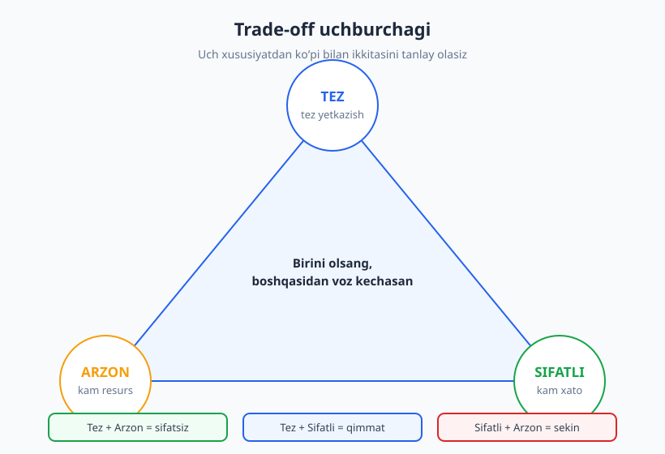
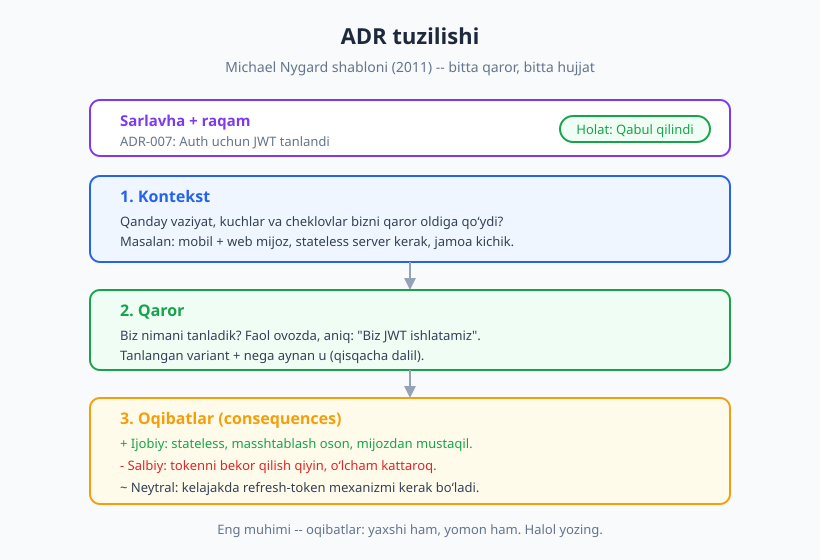
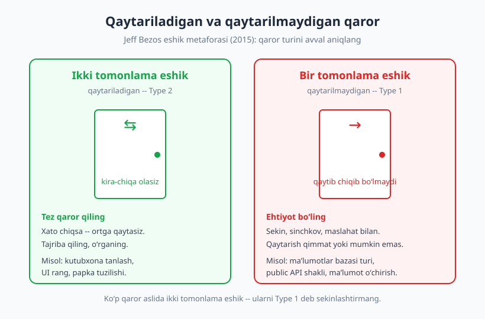

# 23 — Texnik qaror va trade-off'lar

[⬅️ Oldingi: 22 — Baholash (estimation) va rejalashtirish](./22-baholash-rejalashtirish.md) · [🏠 README](./README.md) · [Keyingi: 24 — Hujjatlashtirish ko'nikmasi ➡️](./24-hujjatlashtirish.md)

---

> **Bu bobda:** Senior dasturchini junior'dan ajratadigan eng kuchli ko'nikmalardan biri — to'g'ri texnik qaror qabul qilish. Har bir qaror — bu murosaga kelish (trade-off): birini olsangiz, boshqasidan voz kechasiz. Biz qaror jarayonini, Arxitektura qaror yozuvini (ADR — Michael Nygard), Jeff Bezos'ning "qaytariladigan va qaytarilmaydigan eshik" ramkasini, over-engineering va YAGNI tamoyilini hamda qarorni jamoaga tushuntirishni o'rganamiz.
>
> **Halollik / Eslatma:** Bu bobda sizga "qaysi texnologiya yaxshiroq" degan tayyor javoblar berilmaydi — chunki ular yo'q. Mohirlik — *qaror qabul qilish jarayonida*, javobni yodlashda emas. Bu ko'nikma faqat ko'p qaror qabul qilib, ularning oqibatini ko'rib (ba'zan achchiq) o'sadi.

---

## Hamma narsa trade-off

Muhandislikda eng muhim haqiqatlardan biri shu: **bepul tushlik yo'q.** Har bir texnik qaror nimanidir beradi va nimanidir oladi. Tezlikni oshirsangiz — ko'pincha xotira yoki murakkablik narxiga. Tizimni moslashuvchan qilsangiz — soddalikni yo'qotasiz. Tez yetkazsangiz — sifat yoki texnik qarz (technical debt) hisobiga. Bu — fizika qonuni emas, lekin amaliyotda deyarli har doim shunday.

Yangi dasturchi ko'pincha "eng yaxshi"ni qidiradi: "Eng yaxshi ma'lumotlar bazasi qaysi?", "Eng yaxshi framework qaysi?". Tajribali muhandis bu savolni eshitganda ichida tabassum qiladi, chunki u biladi: **"eng yaxshi" — kontekstsiz ma'nosiz so'z.** To'g'ri savol — "*bu vaziyatda*, *bu cheklovlar bilan*, *bu jamoa uchun* nima mos keladi?".

> **Trade-off:** "Eng yaxshi amaliyot" (best practice) — foydali boshlang'ich nuqta, lekin kontekstsiz dogma. Bir loyihada to'g'ri bo'lgan narsa boshqasida halokat bo'lishi mumkin. Har doim so'rang: "Bu amaliyot qaysi muammoni yechadi va menda o'sha muammo bormi?"

Klassik misol — "loyiha uchburchagi": **tez, sifatli, arzon** — bularning faqat ikkitasini tanlay olasiz. Tez va arzon xohlasangiz — sifat pasayadi. Tez va sifatli xohlasangiz — qimmatga tushadi (ko'proq odam, ko'proq vaqt). Bu uchburchak soddalashtirilgan, lekin asosiy g'oyani aniq ko'rsatadi: **resurslar cheklangan, demak tanlov muqarrar.**

### Trade-off'ni ko'rinadigan qiling

Eng katta xato — trade-off mavjudligini *inkor qilish*. "Bu yechim hamma jihatdan yaxshi" deyilsa — kimdir narxni yashiryapti yoki ko'rmayapti. Senior dasturchining vazifasi — *yashirin narxni ochiq qo'yish*:

- ❌ **Yomon:** "Keling, mikroservislarga o'tamiz, bu zamonaviy va masshtablanadi."
- ✅ **Yaxshi:** "Mikroservis masshtablashni osonlashtiradi, lekin deploy, monitoring va xatolarni izlashni murakkablashtiradi. Bizning jamoa 4 kishi — bu murakkablikni ko'tara olamizmi? Hozircha monolit yetarli emasmi?"

Ikkinchi gapda qaror hali aytilmagan — lekin trade-off ochildi. Endi jamoa *bilib turib* tanlaydi, "moda"ga ergashib emas. Tizim darajasidagi bunday trade-off'lar — masshtab, kesh, queue, CAP teoremasi — alohida chuqur mavzu; ularni [Dasturiy arxitektura](../arxitektura/README.md) kitobida tizimli ko'rasiz. Bu bobda esa biz *qaror qabul qilish ko'nikmasiga* — har qanday texnologiyaga teng tegishli bo'lgan fikrlash usuliga — e'tibor qaratamiz.

---

## Qaror jarayoni: emotsiya emas, ehtiyoj

Yaxshi qaror tasodif emas — u **takrorlanadigan jarayon**ning natijasi. Junior ko'pincha birinchi xayoliga kelgan yechimga yopishadi yoki eng yangi, eng "hayajonli" texnologiyani tanlaydi (bunga "resume-driven development" — CV uchun texnologiya tanlash — deb hazil qilishadi). Senior esa kichik, ammo qat'iy jarayonni bosib o'tadi.

### To'rt qadam

1. **Variantlarni aniqlang.** Kamida 2–3 ta real variant yozing. Agar sizda faqat bitta variant bo'lsa — bu qaror emas, taxmin. "Hech qanday narsa qilmaslik" ham ko'pincha haqiqiy variant ("do nothing" baseline).
2. **Mezonlarni belgilang.** Bu qaror uchun qaysi *sifatlar* muhim? Tezlikmi? Soddalikmi? Jamoa tanishligimi? Narxmi? Xavfsizlikmi? Mezonlarni *oldindan* yozing — yechimni ko'rgandan keyin emas. Aks holda siz allaqachon yoqtirgan yechimga moslab mezon "to'qiysiz".
3. **Har variantning trade-off'ini baholang.** Har bir variantni mezonlar bo'yicha o'tkazing: bu nimani beradi, nimani oladi? Bu yerda jadval juda foydali.
4. **Dalil bilan tanlang.** "Menga shu yoqadi"ni "bu mezonlar bo'yicha eng yaxshi mos keladi, chunki..."ga aylantiring.

| Mezon | Variant A: o'zimiz qurish | Variant B: tayyor kutubxona |
|---|---|---|
| Yetkazish tezligi | Sekin (haftalar) | Tez (kunlar) |
| Moslashuvchanlik | To'liq nazorat | Kutubxona chegarasida |
| Texnik xizmat | Biz ko'taramiz | Hamjamiyat ko'taradi |
| Jamoa tanishligi | Past | Yuqori |

Bu jadval qarorni *ko'rinadigan* qiladi. Endi tanlovni dalil bilan asoslash mumkin: "Tez yetkazish va texnik xizmat bizning asosiy mezonlarimiz bo'lgani uchun, B'ni tanladik — moslashuvchanlikdan biroz voz kechib."

> **Diqqat:** Eng muhim savol — **"Buni nega tanlayapman?"** Agar javobingiz "chunki hamma shunday qiladi" yoki "chunki bu yangi" bo'lsa — to'xtang. Yaxshi javob ehtiyojga asoslanadi: "chunki bizning *aniq* muammomiz bu, va bu yechim aynan shuni hal qiladi." Moda va emotsiya — yomon maslahatchi.

### Mukammal qaror kutmang

Diqqat: bu jarayon "to'liq tahlil bilan falaj bo'lib qolish" (analysis paralysis) degani emas. Ko'pincha sizda to'liq ma'lumot bo'lmaydi va bo'lmaydi ham. Maqsad — *mukammal* qaror emas, *asoslangan* qaror. Qancha vaqt sarflash — qarorning og'irligiga bog'liq (buni keyingi bo'limda — eshik metaforasida — aniq ko'ramiz).

---

## ADR — Arxitektura qaror yozuvi

Tasavvur qiling: bir yildan keyin yangi dasturchi kodga qaraydi va so'raydi: "Nega bu yerda navbat (queue) ishlatilgan? Oddiy chaqiruv yetarli ku?" Hech kim eslamaydi. Qarorni qabul qilgan odam ketgan. Hujjat yo'q. Endi yangi dasturchi yo qo'rqib tegmaydi (chunki nega borligini bilmaydi), yoki olib tashlaydi va biror narsani buzadi. Bu — **institutsional xotira yo'qolishi.**

Yechim — **ADR (Architecture Decision Record — Arxitektura qaror yozuvi).** Bu g'oyani **Michael Nygard** 2011-yilda *"Documenting Architecture Decisions"* nomli maqolasida ommalashtirdi. ADR — bu *muhim* texnik qarorni, uning konteksti va oqibatlari bilan birga yozib qoldiradigan qisqa hujjat (odatda bitta sahifa).

### Nygard shabloni

ADR ataylab **sodda** — agar uni to'ldirish qiyin bo'lsa, hech kim yozmaydi. Klassik shablon:

- **Sarlavha va raqam:** masalan, `ADR-007: Autentifikatsiya uchun JWT tanlandi`.
- **Holat (status):** Taklif qilindi / Qabul qilindi / Bekor qilindi / Almashtirildi (boshqa ADR bilan). Qarorlar o'zgaradi — eski ADR'ni o'chirmang, holatini "almashtirildi" qiling va yangisiga havola bering.
- **Kontekst:** *Qanday* vaziyat bizni qaror oldiga qo'ydi? Qaysi kuchlar, cheklovlar, ehtiyojlar bor edi? Bu — eng muhim qism, chunki kelajakdagi o'quvchi aynan *vaziyatni* bilmaydi.
- **Qaror:** Biz *nimani* tanladik? Faol ovozda, aniq: "Biz JWT ishlatamiz". Va qisqacha — nega aynan u.
- **Oqibatlar (consequences):** Bu qarordan nima kelib chiqadi — *yaxshi ham, yomon ham*. Halol bo'ling: salbiy oqibatlarni ham yozing. "JWT'ni bekor qilish qiyin" — bu kelajakda kimnidir asraydi.

> **Eslatma:** ADR'ning siri — **oqibatlar** bo'limida. Ko'pchilik faqat "biz X'ni tanladik" deb yozadi. Lekin qiymat — qarorning *narxini* ham yozishda. "Bu bizga A va B'ni beradi, lekin C'dan voz kechamiz" — mana shu yozuv bir yildan keyin oltinga teng bo'ladi.

### Nega kelajak uchun muhim

ADR — **kelajakdagi o'zingizga va jamoangizga yozilgan xat.** U "nega" savoliga javob beradi, "nima" ga emas (nima — kodning o'zida ko'rinadi). Kontekst vaqt o'tishi bilan yo'qoladi: bugun aniq bo'lgan sabab 6 oydan keyin esdan chiqadi. ADR o'sha kontekstni muzlatib qoldiradi.

Bu — hujjatlashtirishning eng kuchli, eng arzon shakli. Hujjat yozish ko'nikmasini umuman olganda [24-bobda](./24-hujjatlashtirish.md) chuqurroq ko'rasiz; ADR esa o'sha mavzuning eng amaliy, eng tez foyda beradigan turi. Maslahat: ADR'ni qaror *qabul qilingan paytda* yozing, keyinga qoldirmang — chunki keyin kontekst yodingizda qolmaydi.

---

## Qaytariladigan va qaytarilmaydigan qaror

Endi qaror qabul qilishni *tezlashtiradigan* eng kuchli aqliy modellardan birini ko'ramiz. Hamma qaror bir xil og'irlikda emas. Ba'zilari arzimas, ba'zilari taqdir hal qiluvchi. Ularni bir xil jiddiylik bilan ko'rsangiz — ham vaqt yo'qotasiz, ham xato qilasiz.

**Jeff Bezos** Amazon aksiyadorlariga yozgan 2015-yilgi xatida bu farqni mashhur metafora bilan tushuntirdi: **bir tomonlama eshik** va **ikki tomonlama eshik.**

- **Ikki tomonlama eshik (qaytariladigan, Type 2):** kira-chiqa olasiz. Xato qilsangiz, ortga qaytib boshqa yo'l tanlaysiz. Bunday qarorlarni **tez** qabul qiling — uzoq muhokamaga arzimaydi. Misol: qaysi kutubxonani ishlatish, papka tuzilishi, o'zgaruvchi nomi, UI rangi. Xato chiqsa — almashtirasiz, tamom.
- **Bir tomonlama eshik (qaytarilmaydigan, Type 1):** o'tib bo'lgach, qaytib chiqolmaysiz (yoki juda qimmatga). Bunday qarorlarni **sekin, sinchkov, maslahat bilan** qiling. Misol: ma'lumotlar bazasining asosiy turini tanlash, public API shaklini e'lon qilish (minglab mijoz unga bog'lanib qoladi), foydalanuvchi ma'lumotini o'chirib tashlash.

Bezos'ning asosiy ogohlantirishi shu edi: tashkilot kattalashgani sayin, odamlar **ikki tomonlama eshik qarorlarini ham xuddi bir tomonlama eshik kabi** sekin va qo'rqib qabul qila boshlaydi. Natija — sustlik, ortiqcha ehtiyotkorlik, kam tajriba va sekinlashgan ixtiro.

> **Diqqat:** Ko'p qaror — aslida ikki tomonlama eshik. Ularni Type 1 deb sekinlashtirmang. "Bu kutubxonani tanlasak, keyin pushaymon bo'lsak almashtira olamizmi?" — agar javob "ha, bir kunda" bo'lsa — *darrov tanlang va ishni davom ettiring.* Tez harakat — bu beparvolik emas, qaror turini to'g'ri baholash.

Birinchi qadam — har doim **qaror turini aniqlash:** "Bu qaytariladimi yoki yo'qmi?". Bu bitta savol sizning vaqtingizni va asabingizni juda ko'p tejaydi. Qaytariladigan bo'lsa — tez harakat qiling. Qaytarilmaydigan bo'lsa — to'xtang, variantlarni yozing, ADR yozing, jamoa bilan maslahatlashing.

---

## Over-engineering va YAGNI

Junior dasturchining eng ko'p uchraydigan xatosi — **trade-off'ni noto'g'ri tomonga og'dirish:** *kelajakni ortiqcha bashorat qilish.* "Balki kelajakda 5 xil ma'lumotlar bazasini qo'llab-quvvatlash kerak bo'lar" deb, hozir kerak bo'lmagan abstraksiya qatlamlari quradi. "Balki millionlab foydalanuvchi bo'lar" deb, 100 ta foydalanuvchi uchun murakkab masshtablash arxitekturasini yasaydi. Bu — **over-engineering** (ortiqcha muhandislik).

Bunga qarshi eng mashhur tamoyil — **YAGNI: "You Aren't Gonna Need It"** ("Senga bu kerak bo'lmaydi"). Bu g'oya **Ekstremal dasturlash (Extreme Programming)** metodologiyasidan, Kent Beck va Ron Jeffries kabi mualliflardan keladi. Mohiyati: *hozir kerak bo'lmagan narsani, "kelajakda kerak bo'lar" deb, hozir qurmang.*

Nega? Chunki:

- **Kelajakni bashorat qilish — yomon chiqadi.** Siz "kerak bo'ladi" deb o'ylagan narsa ko'pincha kerak bo'lmaydi, kerak bo'lgani esa boshqacha shaklda keladi.
- **Har bir qo'shilgan murakkablik — narx.** Uni yozish, o'qish, sinash, saqlash kerak. Ishlatilmaydigan moslashuvchanlik — sof zarar.
- **Sodda yechimni keyinroq murakkablashtirish oson; murakkabni soddalashtirish qiyin.** Demak soddadan boshlash kam tavakkal.

> **Trade-off:** YAGNI — "hech qachon kelajak haqida o'ylamang" degani EMAS. Bu — *spekulyativ* (taxminiy) murakkablikni kechiktiring degani. Real, ma'lum ehtiyoj uchun rejalashtiring; "balki kerak bo'lar" uchun emas. Farq nozik, lekin muhim. Qaytarilmaydigan qarorlarda (yuqoridagi eshik) kelajakni ko'proq o'ylash kerak, qaytariladiganlarda — kamroq.

### "Yetarlicha yaxshi" — satisficing

Mukammallikka intilish ham o'zicha tuzoq. Iqtisodchi va olim **Herbert Simon** *satisficing* tushunchasini kiritdi ("satisfy" + "suffice" — "qoniqtirish" + "yetarli bo'lish"): ko'p qarorda eng maqbul (optimal) yechimni cheksiz qidirish o'rniga, **belgilangan mezonlarni qondiradigan birinchi yetarlicha yaxshi yechimni** tanlash to'g'riroq. Optimalni qidirish ko'pincha qo'shimcha foydadan ko'ra ko'proq vaqt yeydi.

Amaliyotda: ✅ "Bu yechim bizning 3 ta asosiy mezonimizni qondiradi — yetarli, ketdik" ko'pincha ❌ "Keling, 8 ta variantni 2 hafta solishtirib, mukammalini topaylik"dan yaxshiroq. Ayniqsa qaytariladigan qarorlarda — mukammalni qidirish isrof.

| Yondashuv | Belgisi | Qachon to'g'ri |
|---|---|---|
| Over-engineering | "Balki kelajakda kerak bo'lar" | Deyarli hech qachon |
| YAGNI / sodda | "Hozir aniq kerak bo'lganini qil" | Ko'p hollarda, ayniqsa qaytariladiganda |
| Satisficing | "Yetarlicha yaxshi — ketdik" | Qaytariladigan, kam tavakkalli qaror |
| Optimallashtirish | "Eng yaxshisini qidiramiz" | Qaytarilmaydigan, qimmat, kam uchraydigan qaror |

Sodda yechim ko'pincha to'g'ri yechim. "Aqlli" kod — ko'pincha keraksiz kod. Eng yaxshi muhandislar murakkablikni ko'rsatmaydi — ular undan *qochadi*.

---

## "Buy vs build" va qarorni muloqot qilish

### Tayyor olish yoki o'zi qurish

Tez-tez uchraydigan, klassik trade-off qarori — **"buy vs build"** (sotib olish/tayyorini ishlatish yoki o'zi qurish). Autentifikatsiya kerakmi? Tayyor xizmat (masalan, identifikatsiya provayderi) olasizmi yoki o'zingiz qurasizmi? To'lov tizimi? Qidiruv? Bularning har biri katta qaror.

Umumiy qoida: **o'zingizning asosiy qiymatingiz (core) bo'lmagan narsani sotib oling; asosiy farqlovchi qiymatingizni o'zingiz quring.** Agar siz to'lov kompaniyasi bo'lsangiz — to'lov mexanizmini o'zingiz qurasiz (bu sizning core'ingiz). Agar siz oddiy do'kon bo'lsangiz — to'lovni tayyor xizmatdan oling, vaqtingizni mahsulotingizga sarflang.

Trade-off'larni sanang:

- **Tayyorini olish (buy):** Tez, sinalgan, boshqalar saqlaydi. Lekin: pul to'laysiz, moslashuvchanlik chegaralangan, tashqi bog'liqlik (vendor lock-in), nazorat kam.
- **O'zi qurish (build):** To'liq nazorat va moslik. Lekin: sekin, qimmat (vaqt!), xatolarni o'zingiz topasiz, abadiy saqlash sizning bo'yningizda.

Ko'p junior "build"ni afzal ko'radi — qiziqarli, o'rgatadi. Lekin biznes nuqtai nazaridan ko'pincha "buy" to'g'ri: g'ildirakni qayta ixtiro qilish — odatda isrof.

### Qarorni jamoaga tushuntirish

Eng yaxshi qaror ham, agar tushuntirilmasa, qarshilikka uchraydi. Qaror — texnik ish emas, **ijtimoiy ish ham.** Buni quyidagicha qiling:

> **Lead:** "Men ikkita variantni ko'rdim — o'zimiz autentifikatsiya qurish yoki tayyor xizmat olish. Asosiy mezonlarim: yetkazish tezligi va xavfsizlik. Tayyor xizmat ikkalasida ham yutadi, chunki xavfsizlik bizning core'imiz emas va biz uni o'zimiz xavfsizroq qila olmaymiz. Trade-off — oylik to'lov va biroz kamroq moslik. Men tayyor xizmatga moyilman. Fikrlaringiz qanday?"

E'tibor bering: lead (1) **variantlarni** ko'rsatdi, (2) **mezonlarni** ochiq aytdi, (3) **trade-off'ni** yashirmadi, (4) o'z fikrini aytdi, lekin (5) **muhokamaga ochiq qoldirdi**. Bu — ishonch quradigan muloqot. Buyruq emas, dalil.

Va muqarrar — kimdir rozi bo'lmaydi. Bu **normal va foydali.** Kelishmovchilikni qadrlang: u ko'pincha siz ko'rmagan trade-off'ni ochadi. Qiyin suhbatni va kelishmovchilikni boshqarishni [16-bobda](./16-nizolarni-hal-qilish.md) — nizolarni hal qilishda — chuqurroq ko'rasiz. Ko'pincha to'g'ri natija — **"disagree and commit"** (rozi bo'lmasdan ham qo'llab-quvvatlash): muhokama qilamiz, qaror qabul qilinadi, keyin hatto rozi bo'lmaganlar ham uni to'liq qo'llab-quvvatlaydi. Qaror cheksiz muhokama qilinmaydi.

Va nihoyat — qarorni **hujjatlang.** Aytilgan qaror unutiladi, yozilgani qoladi. Bu yerda biz aylanib ADR'ga qaytamiz: muhim qaror qabul qilindimi — uni yozing. Texnik muloqotning aniq, soddalashtirilgan tilini [9-bobda](./09-texnik-muloqot-asoslari.md) ko'rgansiz — o'sha ko'nikma aynan shu yerda, qarorni tushuntirish va yozishda ish beradi.

---

## Asosiy g'oyalar (bobni qisqacha)

- **Hamma narsa trade-off:** bepul tushlik yo'q. Har qaror nimanidir beradi va oladi. **"Eng yaxshi" — kontekstsiz ma'nosiz**; "vaziyatga mos" bor. Senior'ning ishi — yashirin narxni ochiq qilish.
- **Qaror jarayoni:** variantlarni aniqla → mezonlarni *oldindan* belgila → har variantning trade-off'ini bahola → **dalil bilan tanla.** Asosiy savol: "Buni *nega* tanlayapman?" Javob ehtiyojga asoslansin, moda yoki emotsiyaga emas.
- **ADR (Michael Nygard, 2011):** muhim qarorni **kontekst → qaror → holat → oqibatlar** ko'rinishida yoz. Eng qimmatlisi — **oqibatlar** (yaxshi ham, yomon ham). Bu kelajakdagi jamoaga yozilgan xat.
- **Eshik metaforasi (Bezos, 2015):** **ikki tomonlama eshik** (qaytariladigan) — *tez* qaror qil; **bir tomonlama eshik** (qaytarilmaydigan) — *sekin, sinchkov* qaror qil. Ko'p qaror aslida qaytariladigan — sekinlashtirma.
- **YAGNI va over-engineering:** kelajakni *spekulyativ* bashorat qilma. **Sodda yechim ko'pincha to'g'ri.** Herbert Simon'ning **satisficing'i** — mezonni qondiradigan birinchi "yetarlicha yaxshi"ni ol, mukammalni cheksiz qidirma.
- **Buy vs build:** asosiy bo'lmagan narsani **sotib ol**, farqlovchi qiymatingni **o'zing qur.** Qarorni jamoaga variant + mezon + trade-off bilan tushuntir, kelishmovchilikni qadrla, **disagree & commit**, va hujjatla.

## Mashqlar

### Oson

**1-mashq.** O'zingiz yaqinda qabul qilgan (yoki ko'rgan) biror texnik qarorni oling — masalan, qaysi kutubxona, qaysi ma'lumotlar bazasi yoki qanday papka tuzilishini tanlash. Uni **ikki tomonlama eshik** (qaytariladigan) yoki **bir tomonlama eshik** (qaytarilmaydigan) toifasiga ajrating. Nega shunday deb o'yladingiz — bir jumlada asoslang.

**2-mashq.** Bitta sodda qaror uchun (masalan: "loyihada sanani qanday formatlaymiz" yoki "qaysi test kutubxonasini ishlatamiz") kamida **3 ta mezon** yozing — bu qarorda qaysi sifatlar muhim. Mezonlarni yechimni tanlashdan *oldin* yozishga harakat qiling.

### O'rta

**3-mashq.** Quyidagi to'rt qarorni qaytariladigan / qaytarilmaydiganga ajrating va har birini qanchalik sekin/tez qabul qilish kerakligini belgilang: (a) yangi UI ranglari sxemasi; (b) public API'da maydon nomi; (c) foydalanuvchilar jadvalini o'chirib, yangisini yaratish; (d) kod formatlovchi (linter) qoidalari. Har birini bir jumlada asoslang.

**4-mashq.** O'zingiz ishlayotgan (yoki o'rganayotgan) loyihada bitta muhim texnik qaror uchun **mini-ADR** yozing. To'rt qismni to'ldiring: Kontekst (qanday vaziyat), Qaror (nimani tanladingiz), Holat (qabul qilingan), Oqibatlar (kamida 1 ijobiy va 1 salbiy). Salbiy oqibatni halol yozishga e'tibor bering.

### Qiyin

**5-mashq.** Bitta real "buy vs build" qarorini oling (masalan: autentifikatsiya, to'lov, email yuborish, qidiruv). Ikkala variant uchun jadval tuzing — kamida 4 mezon bo'yicha trade-off'larni sanang. Keyin tanlovingizni *dalil bilan* asoslab, jamoaga aytadigan 3–4 jumlalik tushuntirishni yozing (yuqoridagi "Lead" dialogi namunasidek: variant + mezon + trade-off + fikr so'rash).

**6-mashq.** O'zingiz ko'rgan yoki yozgan biror **over-engineering** misolini eslang — "kelajakda kerak bo'lar" deb qurilgan, lekin amalda ishlatilmagan murakkablik. (Topa olmasangiz, o'ylab toping.) Endi unga **YAGNI**ni qo'llang: o'sha qarorni qaytadan ko'rib, eng sodda "yetarlicha yaxshi" (satisficing) yechim qanday bo'lardi? Sodda yechim qaysi haqiqiy ehtiyojni qoldirib ketardi (agar qoldirsa)?

Yechimlar / Namunaviy yondashuvlar

### 1-mashq yechimi
Maqsad — qaror turini avtomatik aniqlash odatini shakllantirish. Namuna: *"Loyihada `dayjs` sana kutubxonasini tanladim — bu **ikki tomonlama eshik**. Agar keyinroq u kamlik qilsa, sana bilan ishlash bir necha joyda bo'lgani uchun, almashtirish bir-ikki kunlik ish, qiyin emas. Demak uzoq o'ylamasdan tez tanlash to'g'ri edi."* Agar siz qaytarilmaydigan qaror tanlagan bo'lsangiz (masalan, ma'lumotlar bazasi turi), uni sekin va sinchkov qabul qilganingizni asoslang. Asosiy o'rganish: qaror oldida birinchi savol — "bu qaytariladimi?".

### 2-mashq yechimi
Namuna ("qaysi test kutubxonasini ishlatamiz"): mezonlar — (1) **Jamoa tanishligi** (allaqachon bilamizmi?), (2) **Hujjat va hamjamiyat** (muammo chiqsa yordam topiladimi?), (3) **Tezlik** (testlar qancha tez ishlaydi?), (4) **Integratsiya** (mavjud asbob-uskunalarimizga mos keladimi?). Muhimi — mezonlarni *oldin* yozish, chunki agar siz allaqachon bir kutubxonani yoqtirgan bo'lsangiz, "to'g'ri javob"ga moslab mezon to'qish vasvasasi katta. Mezon — sudya, advokat emas.

### 3-mashq yechimi
(a) **Qaytariladigan** — rang sxemasini istalgan vaqtda o'zgartirasiz, tez qaror qiling. (b) **Qaytarilmaydigan (yoki juda qimmat)** — public API'ga mijozlar bog'lanib qoladi; maydon nomini keyin o'zgartirsangiz, ularning kodini buzasiz. Sekin va sinchkov, ehtimol ADR bilan. (c) **Qaytarilmaydigan** — jadvalni o'chirsangiz, ma'lumot yo'qoladi; bu eng ehtiyotkorlik talab qiladigan turi (zaxira, maslahat, sekinlik). (d) **Qaytariladigan** — linter qoidalarini istalgan vaqtda sozlaysiz; tez tanlang, behuda bahslashmang. Asosiy o'rganish: qaror turini to'g'ri baholash sizning vaqt va e'tiboringizni to'g'ri taqsimlaydi.

### 4-mashq yechimi
Namuna: *"**Kontekst:** Mobil va web mijozlarimiz bor, serverni stateless qilishni xohlaymiz, jamoa kichik (3 kishi). **Qaror:** Sessiya o'rniga JWT token ishlatamiz. **Holat:** Qabul qilindi. **Oqibatlar:** + Server stateless bo'ladi, masshtablash oson; + Mobil va web bir xil mexanizmni ishlatadi. − Tokenni muddatidan oldin bekor qilish qiyin; − Token o'lchami sessiya ID'dan kattaroq, har so'rovda yuboriladi."* Asosiy o'rganish: salbiy oqibatni halol yozish — bu kelajakdagi o'zingizni va jamoangizni asraydi ("nega tokenni bekor qila olmayapmiz?" degan savolga bir yildan keyin javob tayyor bo'ladi). Yomon ADR faqat ijobiyni sanaydi.

### 5-mashq yechimi
Namuna (autentifikatsiya — buy vs build):

| Mezon | Build (o'zi qurish) | Buy (tayyor xizmat) |
|---|---|---|
| Yetkazish tezligi | Sekin (haftalar) | Tez (kunlar) |
| Xavfsizlik | Biz mas'ul, xato xavfi yuqori | Mutaxassislar saqlaydi |
| Narx | Ishlab chiqish + saqlash vaqti | Oylik to'lov |
| Moslashuvchanlik | To'liq nazorat | Provayder chegarasida |

Tushuntirish: *"Ikkita variantni ko'rib chiqdim. Asosiy mezonlarim — yetkazish tezligi va xavfsizlik. Autentifikatsiya bizning asosiy mahsulotimiz (core) emas, va biz uni o'zimiz mutaxassislardan xavfsizroq qila olmaymiz. Trade-off — oylik to'lov va biroz kamroq moslik, lekin bu bizning core'imiz emasligi uchun maqbul. Men tayyor xizmatga moyilman — fikrlaringiz qanday?"* Asosiy o'rganish: "core bo'lmaganini sotib ol" qoidasi + trade-off'ni ochiq aytib jamoaga tushuntirish.

### 6-mashq yechimi
Namuna: *Over-engineering* — "ma'lumotlar bazasini istalgan vaqtda almashtira olamiz" deb, hamma so'rovlar ustiga universal abstraksiya qatlami (repository + bir nechta interfeys) qurilgan, holbuki loyiha bitta bazada ishlaydi va almashtirish hech qachon kerak bo'lmagan. **YAGNI'ni qo'llash:** abstraksiyani olib tashlab, to'g'ridan-to'g'ri baza bilan ishlash — kod ancha qisqaradi, o'qish osonlashadi. "Yetarlicha yaxshi" yechim aynan shu. Sodda yechim *nazariy* "bazani almashtirish" qulayligini qoldirib ketadi — lekin bu real ehtiyoj emas edi (spekulyativ), shuning uchun YAGNI to'g'ri. Agar kelajakda *haqiqatan* almashtirish kerak bo'lsa, abstraksiyani o'shanda qo'shasiz — murakkablikni soddadan o'stirish, murakkabni soddalashtirishdan oson. Asosiy o'rganish: "balki kerak bo'lar" — over-engineering signali; real, ma'lum ehtiyoj — rejalashtirish signali.

---

[⬅️ Oldingi: 22 — Baholash (estimation) va rejalashtirish](./22-baholash-rejalashtirish.md) · [🏠 README](./README.md) · [Keyingi: 24 — Hujjatlashtirish ko'nikmasi ➡️](./24-hujjatlashtirish.md)
