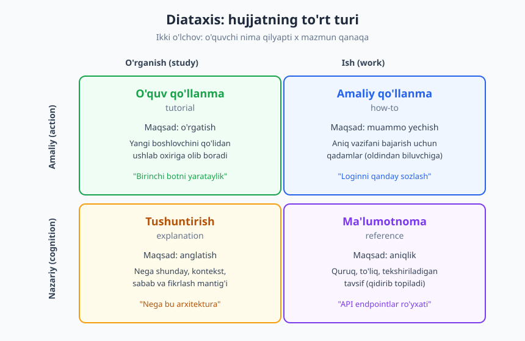
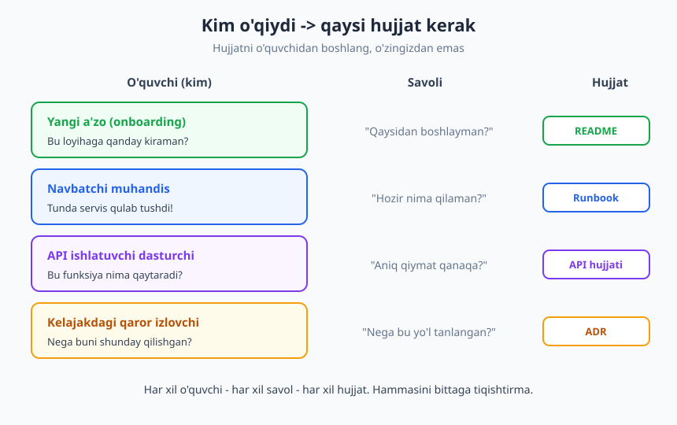
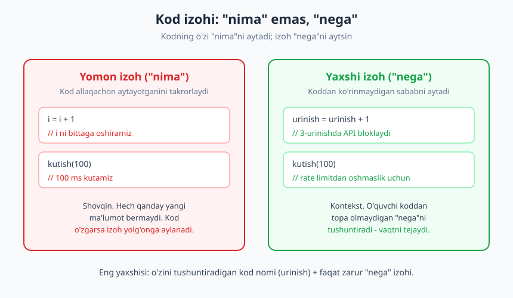

# 24 — Hujjatlashtirish ko'nikmasi

[⬅️ Oldingi: 23 — Texnik qaror va trade-off'lar](./23-texnik-qaror-tradeoff.md) · [🏠 README](./README.md) · [Keyingi: 25 — CV, portfolio va GitHub profil ➡️](./25-cv-portfolio-github.md)

---

> **Bu bobda:** yaxshi hujjat — yaxshi muhandislikning belgisi. **Kod nima qilishini, hujjat esa nega qilishini aytadi.** Shu bobda nega umuman hujjat yozamizni (kelajakdagi o'zingiz, jamoa, bus factor), hujjatni to'rt turga ajratuvchi **Diátaxis** ramkasini (Daniele Procida), dasturchining kunlik hujjatlarini (README, runbook, ADR, API hujjati), kod izohlarining "nima emas, nega" qoidasini va yaxshi hujjat amaliyotini o'rganamiz.

> **Halollik / Eslatma:** mukammal hujjat — afsona; hech kim birdaniga ideal hujjat yozmaydi, va siz ham yozmaysiz. Hujjat — kod kabi, doimiy parvarish talab qiladi: eskirgan hujjat ba'zan umuman hujjatsizlikdan ham zararliroq. Bu bob sizga ramka va odat beradi, lekin yaxshi yozuvchi bo'lish faqat ko'p yozish va o'quvchidan fikr olib borish bilan keladi.

---

## Nega umuman hujjat yozamiz

Ko'p dasturchi hujjatni "majburiy, zerikarli ortiqcha ish" deb biladi — kod tayyor, ishlayapti, yana nima kerak? Bu qarash bitta muhim haqiqatni o'tkazib yuboradi: **kod bir marta yoziladi, lekin ko'p marta o'qiladi.** Va uni o'qiyotgan odam — ko'pincha siz yozgan paytdagi kontekstga ega emas. U sizning miyangizdagi "nega"ni ko'rmaydi; u faqat kodni va — agar yozgan bo'lsangiz — hujjatni ko'radi.

Hujjat aslida kimga kerakligini sanab chiqaylik — bu ro'yxat "nega yozaman?" savoliga eng yaxshi javob:

- **Kelajakdagi o'zingiz.** Bu eng kam kutilgan, lekin eng tez seziladigan foyda. Olti oydan keyin o'sha skriptga qaytasiz va "men buni nega shunday yozgan ekanman?" deysiz. O'sha paytdagi o'zingiz — hozirgi o'zingizga begona odam. Hujjat — kelajakdagi o'zingizga yozilgan xat.
- **Jamoangiz.** Siz bilgan narsa faqat sizning boshingizda qolsa, har bir hamkasb o'sha narsani bilish uchun **sizni** to'xtatishi kerak. Bu sizni "tirik hujjat"ga aylantiradi — chiroyli tuyuladi, lekin amalda bu sizni doimiy uzilishlar manbaiga aylantiradi va jamoani sekinlashtiradi.
- **Yangi qo'shilgan a'zo (onboarding).** Yangi odam loyihaga kirishda eng ko'p og'riq chekadi. Yaxshi README va onboarding qo'llanma uning birinchi haftasini bir necha kunga qisqartiradi. Hujjatning sifatini sinashning eng yaxshi usuli — yangi odamni kuzating: u qayerda qoqildi?
- **Bus factor.** Achchiq nomli, lekin jiddiy tushuncha: *"agar bu odamni avtobus urib ketsa, loyiha to'xtaydimi?"* Agar biror tizimni faqat bitta odam tushunsa, bus factor = 1 — bu jamoa uchun jiddiy xavf. Hujjat bilimni bitta boshdan jamoaga tarqatadi va bu xavfni kamaytiradi. (Bilimni jamoaga tarqatish g'oyasini [4-bobda](./04-bilim-boshqaruvi-eslab-qolish.md) ko'rgan edik — hujjat shuning amaliy quroli.)

> **Asosiy iqtisod:** hujjat yozish bir martalik xarajat, o'qish esa ko'p martalik daromad. Bir marta 20 daqiqa sarflab yozasiz; o'sha hujjatni 50 kishi har biri 20 daqiqalik savol-javobsiz tushunadi. Vaqt jihatdan deyarli har doim foydali — agar hujjat haqiqatan o'qilsa.

Hujjatlashtirish — bu mohiyatan [9-bob](./09-texnik-muloqot-asoslari.md) va [10-bobda](./10-yozma-asinxron-muloqot.md) ko'rgan **yozma muloqot** ko'nikmasining maxsus, uzoq muddatli shakli. O'sha boblardagi "auditoriyani bil, soddalashtir, nima-nega-qanday" tamoyillari bu yerda ham asos bo'lib qoladi — faqat o'quvchi endi sizdan vaqt va makon bilan uzoqroqda turadi.

---

## Diátaxis: hujjatni to'rt turga ajratish

Hujjat haqida eng keng tarqalgan xato — **turli xil hujjatlarni bir-biriga aralashtirish.** Misol: kimdir loyiha README'sini ochadi, "qanday boshlayman?" deb umid qiladi, lekin u yerda barcha sozlama variantlarining quruq ro'yxatini topadi. Yoki aksincha — chuqur sozlamani izlaydi, lekin "salom dunyo"ni qo'lidan ushlab o'rgatadigan darslikka duch keladi. Ikkala holatda ham hujjat bor, lekin u **noto'g'ri o'quvchiga noto'g'ri shaklda** yetkazilgan.

Bu muammoni tartibga soladigan eng mashhur ramka — **Diátaxis** (yunoncha "tartib, joylashuv"), uni texnik yozuvchi **Daniele Procida** ishlab chiqqan (Django jamoasidagi ishidan kelib chiqqan, keyin alohida ramka sifatida rivojlangan). Diátaxis hujjatni **to'rt turga** ajratadi, va har birining **maqsadi va o'quvchisi boshqacha.**



Ikki o'lcham bo'yicha:

- **Gorizontal:** o'quvchi hozir **o'rganyaptimi** (study) yoki **ish bajaryaptimi** (work)?
- **Vertikal:** mazmun **amaliy** (qadamlar, harakat) mi yoki **nazariy** (tushuncha, bilim)mi?

Shu ikki o'lchov to'rt kvadrat beradi:

| Tur | O'quvchi | Maqsad | Misol |
|---|---|---|---|
| **O'quv qo'llanma** (tutorial) | O'rganyapti | O'rgatish, ishonch berish | "Birinchi botingizni yarataylik" — qo'lidan ushlab oxirigacha |
| **Amaliy qo'llanma** (how-to) | Ish bajaryapti | Aniq muammoni yechish | "Loginni OAuth bilan qanday sozlash" — bilganga, retsept |
| **Ma'lumotnoma** (reference) | Ish bajaryapti | Aniqlik, to'liqlik | "API endpointlar ro'yxati", "config kalitlari" — quruq, tekshiriladigan |
| **Tushuntirish** (explanation) | O'rganyapti | Anglatish, kontekst | "Nega biz event-driven arxitekturani tanladik" |

Eng muhim saboq — **bu to'rttasini bir hujjatda aralashtirmang.** Darslik (tutorial) o'rtasida to'satdan barcha sozlama variantlarini sanay boshlasangiz, o'rganayotgan odamni cho'ktirib qo'yasiz. Ma'lumotnoma o'rtasida "nega bu shunday loyihalashtirilgan" deb falsafaga kirsangiz, aniq qiymat izlaganni adashtirasiz.

> **Diqqat:** darslik (tutorial) va amaliy qo'llanma (how-to) ko'pincha aralashtiriladi, lekin ular tubdan boshqacha. **Tutorial** — o'rganayotgan, hech narsa bilmaydigan odam uchun; uning vazifasi — ishonch berish, "men buni qila olaman" hissi. **How-to** — allaqachon biladigan, aniq vazifasi bor odam uchun; u "salom" demaydi, to'g'ridan-to'g'ri retseptga o'tadi. Birini ikkinchisining o'rniga ishlatsangiz — ikkala o'quvchi ham norozi.

Diátaxisni ko'r-ko'rona qonun deb qabul qilmang — bu **fikrlash vositasi.** Uning eng katta foydasi shunchaki shu savolni berishga majbur qilishida: *"Men hozir kim uchun, qaysi turdagi hujjat yozyapman?"* Shu bitta savol ko'p chalkash hujjatni oldini oladi.

---

## Dasturchining kunlik hujjatlari

Diátaxis — umumiy ramka. Endi dasturchi amalda eng ko'p yozadigan aniq hujjat turlariga o'tamiz. Ularning har biri yuqoridagi to'rtlikning bir yoki bir nechtasiga tushadi.



### README — loyihaga birinchi eshik

README — loyihaning yuzi. Uni eng birinchi va eng ko'p odam o'qiydi: yangi a'zo, kelajakdagi siz, loyihangizni baholayotgan begona. Yaxshi README uchta savolga **tez** javob beradi:

- **Bu nima?** Loyiha bir-ikki jumlada nimani qiladi. (Eng ko'p unutiladigan qism — muallif "hammaga ma'lum" deb o'ylaydi, lekin begona uchun emas.)
- **Qanday o'rnataman?** Noldan ishga tushirish qadamlari — nusxalab-joylashtirsa ishlaydigan darajada aniq.
- **Qanday ishlataman?** Bitta minimal, ishlaydigan misol. "Salom dunyo" darajasidagi eng kichik foydalanish.

Yaxshi README qo'shimcha ravishda: talablar (versiyalar), konfiguratsiya, hissa qo'shish qoidalari va litsenziyani qamrashi mumkin. Lekin yuqoridagi uchtasi — minimal majburiy yadro.

> ❌ **Yomon README:** faqat loyiha nomi va "TODO: docs". Yangi odam birinchi qadamdayoq qotib qoladi.
>
> ✅ **Yaxshi README:** bir abzas "bu nima", aniq o'rnatish bloki, ishlaydigan bitta misol. O'qigan odam 5 daqiqada loyihani ishga tushira oladi.

### Runbook — operatsion qo'llanma

Runbook — **incident** (favqulodda holat) paytida o'qiladigan amaliy qo'llanma. Uning o'quvchisi — yarim tunda uyqudan turgan, asabiy navbatchi muhandis. Bunday o'quvchi nazariya o'qishni xohlamaydi — unga **aniq, ketma-ket qadamlar** kerak: "Agar servis javob bermasa: 1) dashboardni och, 2) bu metrikani tekshir, 3) agar X bo'lsa — shu buyruqni ishga tushir, 4) yordam bermasa — bu odamni chaqir."

Yaxshi runbook belgilari: aniq triggerni nomlaydi ("qachon bu qo'llanmani ochaman"), qadamlar nusxalab ishlatiladigan, har qadam **kutilgan natijani** aytadi, va "agar bu ishlamasa — keyingisi" tarmoqlari bor. Runbook — toza **how-to** turidagi hujjat: o'quvchi o'rganmoqchi emas, muammoni hozir yechmoqchi.

### ADR — qaror yozuvi

**ADR** (Architecture Decision Record — arxitektura qaror yozuvi) — muhim texnik qaror **nega** qabul qilinganini yozib qoladigan qisqa hujjat. Bu Diátaxisning **tushuntirish** (explanation) turi: u "nima qilish kerak"ni emas, "nega shunday qaror qilingan"ni saqlaydi. Tipik ADR: kontekst (muammo nima edi), qaror (nima tanlandi), ko'rib chiqilgan muqobillar, oqibatlar (trade-off'lar). Texnik qaror va trade-off mantig'ini, ADR tuzilishini [23-bobda](./23-texnik-qaror-tradeoff.md) batafsil ko'rgan edingiz — bu bob esa uni **hujjat sifatida** qanday yozishga qaraydi.

ADRning butun qadri shunda: olti oydan keyin kimdir "nega biz Kafka emas, oddiy navbat ishlatdik?" deb so'raganda, javob odamning xotirasida emas, yozilgan ADRda turadi. Qaror yozilmasa — u har gal qaytadan muhokama qilinadi.

### API hujjati va onboarding qo'llanma

- **API hujjati** — sizning kodingizni **ishlatadigan** boshqa dasturchi uchun. Bu asosan **ma'lumotnoma** (reference): har funksiya/endpoint nimani qabul qiladi, nimani qaytaradi, qanday xato beradi — aniq va to'liq. Bunga ko'pincha qisqa **how-to** misollar qo'shiladi ("autentifikatsiyani qanday qo'shish"). Eng yaxshisi — koddan ajralmaydigan hujjat (masalan, izoh yoki sxemadan generatsiya qilinadigan), shunda u eskirmaydi.
- **Onboarding qo'llanma** — yangi a'zoning birinchi haftasi uchun "qayerdan boshlayman" xaritasi: muhitni qanday sozlash, qaysi hujjatlarni o'qish, kim bilan tanishish, birinchi kichik vazifa. Bu README va boshqa hujjatlarni bog'lab turadigan kirish nuqtasi.

---

## Kod izohlari: "nima" emas, "nega"

Hujjatning eng zich shakli — **kod izohi.** Va aynan shu yerda eng ko'p xato qilinadi. Asosiy qoida bitta:

> **Kod "nima qilishini" o'zi aytadi. Izoh "nega qilishini" aytsin.**

Kodni o'qigan har bir dasturchi `i = i + 1` ning `i`ni oshirishini ko'radi — buni izohlash hech narsa qo'shmaydi, faqat shovqin. Lekin nima uchun aynan shu yerda 100 millisekund kutilayotgani — koddan **ko'rinmaydi**. Aynan shu — izoh kerak bo'lgan joy.



Quyidagi taqqos buni aniq ko'rsatadi:

> ❌ **Yomon ("nima"ni takrorlaydi):**
> ```
> kutish(100)   // 100 millisekund kutamiz
> ```
> Izoh kod allaqachon aytayotganini takrorlaydi. Hech qanday yangi ma'lumot yo'q.
>
> ✅ **Yaxshi ("nega"ni aytadi):**
> ```
> kutish(100)   // API rate limitidan oshmaslik uchun har so'rov orasida 100ms
> ```
> Endi o'quvchi koddan topa olmaydigan **sababni** biladi — va bu raqamni o'zgartirishdan oldin nima xavf borligini tushunadi.

Yana bir muhim haqiqat: **eng yaxshi izoh — yozilmagan izoh, agar kodning o'zi tushunarli bo'lsa.** O'zini tushuntiradigan kod — yaxshi nomlar, kichik funksiyalar — ko'p izohga ehtiyojni yo'qotadi. `urinishlarSoni` o'zgaruvchisi `x` dan ko'ra ming marta tushunarli, va u hech qanday izohni talab qilmaydi. Izoh — kod o'zini tushuntira olmaydigan joyda kerak: tashqi sabab, nostandart qaror, "bu yerda ehtiyot bo'l" ogohlantirishi, vaqtinchalik yamoq sababi.

> **Eng katta xavf — eskirgan izoh.** Kod o'zgaradi, izoh esa joyida qoladi — endi u **yolg'on** gapiradi. Eskirgan izoh izohsizlikdan ham yomonroq: u o'quvchini ataylab adashtiradi. Shuning uchun izoh yozsangiz — kodni o'zgartirganda izohni ham yangilashni odat qiling. Kamroq, lekin to'g'ri izoh — ko'p, lekin chirigan izohdan afzal.

Demak, izoh qoidasini xulosalasak: **"nima"ni izohlama** (kod aytadi), **"nega"ni izohla** (kod ayta olmaydi), **yaxshi nom orqali izohga ehtiyojni kamaytir**, va **izohni kod bilan birga yangilab tur**.

---

## Yaxshi hujjat amaliyoti

Diátaxis va aniq hujjat turlarini bildik. Endi — turidan qat'i nazar, **har qanday** hujjatni yaxshi qiladigan amaliy odatlar.

### O'quvchini bil

Bu eng muhim qoida — va u [9-bobning](./09-texnik-muloqot-asoslari.md) "auditoriyani bil" tamoyilining aynan o'zi. Hujjat yozishdan oldin so'rang: **kim buni o'qiydi va u nimani allaqachon biladi?** Mutlaqo yangi odam uchun yozilgan README jargonga to'la bo'lmasligi kerak; tajribali dasturchi uchun how-to esa har bir asosiy tushunchani qaytadan tushuntirib o'tirmasligi kerak. O'quvchini noto'g'ri tasavvur qilish — eng ko'p hujjatni foydasiz qiladigan sabab.

### Sodda til va aniq misol

- **Sodda yozing.** Qisqa jumla, oddiy so'z, kam jargon. Hujjat — chiroyli adabiyot tanlovi emas; uning yagona maqsadi — o'quvchi tushunishi. Murakkab yozuv ko'pincha murakkab fikrning emas, dangasalikning belgisi.
- **Har doim misol bering.** Bitta ishlaydigan, nusxalab sinab ko'rsa bo'ladigan misol — uzun nazariy tushuntirishdan kuchliroq. Odamlar misoldan o'rganadi. Ayniqsa how-to va README'da: misolsiz hujjat — yarim hujjat.

### Hujjatni yangilab tur

Eskirgan hujjat — kod o'zgargan, hujjat eski qolgan — **zararli.** U o'quvchini noto'g'ri yo'lga boshlaydi, va u hujjatga umuman ishonchni yo'qotadi (bir marta aldangan odam butun hujjatga shubha bilan qaraydi). Shuning uchun:

- **"Docs as code"** — hujjatni kod bilan **bir joyda** (repozitoriyada, versiya nazoratida) saqlang. Shunda hujjat kod bilan birga ko'rib chiqiladi (review), birga o'zgaradi, "uzoq, unutilgan wiki sahifasi"ga aylanmaydi.
- O'zgarish kiritganda o'zingizdan so'rang: *"bu o'zgarish biror hujjatni yolg'onga aylantirdimi?"* Agar ha — hujjatni ham o'sha PR'da yangilang.

### Mukammallikni kutma

Ko'p odam "ideal hujjat yoza olmasam, umuman yozmayman" tuzog'iga tushadi. Bu xato. **Biror hujjat — hech qanday hujjatdan yaxshi.** Qisqa, nomukammal, lekin to'g'ri README — bo'sh README'dan ming marta foydali. Hujjat — kod kabi iterativ: avval ishlaydigan minimalni yozing, keyin o'quvchilarning savollaridan bilib, yaxshilab boring. Eng yaxshi hujjat manbasi — o'quvchilar bergan takroriy savollar: agar uch kishi bir narsani so'rasa, javobni hujjatga yozib qo'ying.

> **Trade-off:** hujjatga ham vaqt ketadi, va hamma narsani hujjatlash mumkin emas. Hammasini emas, **eng ko'p o'qiladigan va eng tez eskiradigan** narsalarni hujjatlang: loyihaga kirish (README), incident qadamlari (runbook), muhim qarorlar (ADR), tashqi interfeys (API). Bir martalik, oson kod uchun batafsil hujjat — ko'pincha ortiqcha sarmoya.

---

## Asosiy g'oyalar (bobni qisqacha)

- **Kod "nima qilishini", hujjat "nega qilishini" aytadi.** Hujjat yozishning sababi — **kelajakdagi o'zingiz**, **jamoa**, **yangi a'zo (onboarding)** va **bus factor**ni kamaytirish. Kod bir marta yoziladi, ko'p marta o'qiladi.
- **Diátaxis** (Daniele Procida) hujjatni to'rt turga ajratadi: **tutorial** (o'rgatish), **how-to** (muammo yechish), **reference** (aniqlik), **explanation** (anglatish). Har birining o'quvchisi va maqsadi boshqa — eng katta xato ularni **aralashtirish**.
- **Dasturchi hujjatlari:** README (loyihaga kirish — nima/o'rnatish/ishlatish), runbook (incident qadamlari), ADR (qaror "nega"si), API hujjati (reference + misol), onboarding qo'llanma.
- **Kod izohi qoidasi:** "nima"ni izohlama (kod aytadi), **"nega"ni izohla** (kod ayta olmaydi). O'zini tushuntiradigan **yaxshi nom** > ko'p izoh. **Eskirgan izoh — yolg'on**, izohsizlikdan yomonroq.
- **O'quvchini bil** — kim o'qiydi, u nimani biladi? Sodda yoz, **misol ber**, o'quvchini noto'g'ri tasavvur qilma.
- **Hujjatni yangilab tur:** "docs as code" — kod bilan bir joyda, versiya nazoratida, birga review qilinadi. O'zgarish hujjatni yolg'onga aylantirdimi — o'sha PR'da yangila.
- **Mukammallikni kutma:** biror hujjat hech qandayidan yaxshi. Iterativ yoz; o'quvchilarning takroriy savollari — eng yaxshi hujjat ro'yxati.

---

## Mashqlar

### Oson

**1-mashq.** O'zingiz yaqinda yozgan (yoki ishlatgan) bir loyiha uchun README'ning **uchta yadro bo'limini** yozing: "Bu nima?" (1–2 jumla), "Qanday o'rnataman?" (aniq qadamlar), "Qanday ishlataman?" (bitta minimal misol). Begona odam shu uch bo'limni o'qib loyihani ishga tushira oladimi — shu mezon bilan tekshiring.

**2-mashq.** Quyidagi "nima" izohlarni "nega" izohlarga aylantiring (kontekstni o'zingiz faraz qiling):
- `summa = summa * 1.2   // summani 1.2 ga ko'paytiramiz`
- `if (urinish > 3) toxtat()   // urinish 3 dan katta bo'lsa to'xtaymiz`
Har biriga koddan ko'rinmaydigan "nega"ni qo'shing.

### O'rta

**3-mashq.** Quyidagi hujjatlarni **Diátaxis** to'rt turi (tutorial / how-to / reference / explanation) bo'yicha toifalang va har biri uchun bir jumlada nega shu turga tegishliligini yozing:
1. "Birinchi marta loyihani o'rnatib, salom-dunyo botini ishga tushiramiz"
2. "Barcha konfiguratsiya kalitlari va ularning standart qiymatlari"
3. "Nega biz monolitdan mikroservisga o'tdik"
4. "Production'da ma'lumotlar bazasini qanday qayta tiklash (restore)"

**4-mashq.** Bitta kichik tizim (masalan: "kechasi ishlaydigan backup skripti") uchun qisqa **runbook** yozing. Quyidagilar bo'lsin: trigger ("qachon bu qo'llanmani ochaman"), 3–5 ta aniq qadam (har biri kutilgan natija bilan), va "agar ishlamasa — keyingi qadam / kimni chaqirish". O'quvchi — yarim tunda turgan navbatchi deb tasavvur qiling.

### Qiyin

**5-mashq.** O'zingiz tushunadigan, lekin hech qaerda yozilmagan bir texnik qaror oling (masalan: "nega bu loyihada falon kutubxonani tanladik" yoki "nega bu jadval shunday tuzilgan"). Uni **ADR** sifatida yozing: Kontekst (muammo nima edi), Qaror (nima tanlandi), Ko'rib chiqilgan muqobillar (kamida 1), Oqibatlar (trade-off'lar). Har bo'lim 1–3 jumla. Olti oydan keyingi begona o'quvchi "nega?" savoliga shu hujjatdan javob topadimi — shu mezon bilan tekshiring.

**6-mashq.** Bitta funksiyaning hujjatini Diátaxisning **ikki turida** yozing va farqni sezing: (a) **reference** — funksiya nimani qabul qiladi, nimani qaytaradi, qanday xato beradi (quruq, to'liq); (b) **how-to** — "bu funksiya bilan falon vazifani qanday bajarish" (aniq, misolli retsept). Keyin bir abzasda: nega bu ikkalasi bir hujjatga sig'maydi, va qaysi o'quvchi qaysini izlaydi?

<details markdown="1">
<summary>Yechimlar / Namunaviy yondashuvlar</summary>

### 1-mashq yechimi
Namuna (faraziy "savdo-bot" loyihasi uchun):
- **Bu nima?** "Telegram orqali kichik do'kon buyurtmalarini qabul qiladigan bot. Mahsulot ko'rsatadi, savatcha to'playdi, buyurtmani adminga yuboradi."
- **Qanday o'rnataman?** "1) Repozitoriyani nusxalang, 2) bog'liqliklarni o'rnating, 3) `.env` faylida `BOT_TOKEN` ni qo'ying, 4) `start` buyrug'i bilan ishga tushiring." (Har qadam aniq buyruq bilan bo'lishi kerak.)
- **Qanday ishlataman?** "Botga `/start` yozing — u mahsulotlar ro'yxatini ko'rsatadi." Bitta minimal, ishlaydigan misol.

Mezon: begona odam shu uch bo'limni o'qib, savol bermay loyihani ishga tushira olsa — README yaxshi. Eng ko'p unutiladigan — "Bu nima?" bo'limi.

### 2-mashq yechimi
- `summa = summa * 1.2` -> `// QQS 20% qo'shamiz (mahalliy soliq talabi)` — endi o'quvchi 1.2 raqamining sababini va uni o'zgartirish xavfini biladi.
- `if (urinish > 3) toxtat()` -> `// 3 urinishdan keyin tashqi API IP'ni vaqtincha bloklaydi, shuning uchun to'xtaymiz` — koddan ko'rinmaydigan tashqi sabab.

Kalit — har ikkala "yaxshi" izoh koddan **o'qib bo'lmaydigan** narsani aytadi: nega aynan 1.2, nega aynan 3. Eski izohlar esa kodning o'zini takrorlagandi.

### 3-mashq yechimi
1. **Tutorial** — o'rganayotgan, "birinchi marta" odam uchun, qo'lidan ushlab oxiriga olib boradi (o'rgatish maqsadi).
2. **Reference** — to'liq, quruq ro'yxat; o'quvchi aniq qiymat izlaydi, o'qib o'rganmaydi (aniqlik maqsadi).
3. **Explanation** — "nega" savoliga javob, qaror konteksti; harakat qadamlari emas, anglatish (kontekst maqsadi).
4. **How-to** — aniq vazifasi bor (restore) odam uchun retsept; u o'rganmoqchi emas, muammoni yechmoqchi (muammo yechish maqsadi).

Kalit — turni **o'quvchining holati** belgilaydi: u o'rganyaptimi yoki ish bajaryaptimi, amaliy qadam kerakmi yoki tushuncha kerakmi.

### 4-mashq yechimi
Namuna ("Kechalik backup skripti ishlamadi" runbook):
- **Trigger:** "Ertalab 'backup muvaffaqiyatsiz' ogohlantirishi kelganda yoki backup fayli bugungi sanada yo'q bo'lsa."
- **Qadamlar:**
  1. Backup loglarini och (`logs/backup-YYYY-MM-DD.log`). *Kutilgan: oxirgi qatorda xato sababi ko'rinadi.*
  2. Disk joyini tekshir. *Kutilgan: 10% dan ko'p bo'sh joy; agar to'lgan bo'lsa — sabab shu.*
  3. Backup buyrug'ini qo'lda ishga tushir. *Kutilgan: "OK" va yangi fayl paydo bo'ladi.*
  4. Agar qo'lda ham xato bersa — ma'lumotlar bazasiga ulanishni tekshir.
- **Agar ishlamasa:** "Ma'lumotlar bazasi javob bermasa — DBA jamoasini (#db-oncall) chaqir va incidentni ochib qo'y."

Kalit — har qadam **nusxalab ishlatiladigan** va **kutilgan natijani** aytadi; navbatchi o'ylab o'tirmasdan ergasha oladi.

### 5-mashq yechimi
Namuna (ADR: "API uchun REST emas, GraphQL tanlandi"):
- **Kontekst:** Mobil ilova bir ekranda 5 xil resursdan ma'lumot oladi; REST'da bu 5 ta alohida so'rov, sekin va ko'p trafik.
- **Qaror:** API qatlamida GraphQL ishlatamiz — mijoz bitta so'rovda kerakli maydonlarni so'raydi.
- **Muqobillar:** (1) REST + maxsus "aggregat" endpointlar — har yangi ekranga yangi endpoint kerak, ko'paya boradi; (2) REST'ni saqlab, mijozda birlashtirish — sekin va batareyani yeydi.
- **Oqibatlar:** Mobil tezlashadi va trafik kamayadi (+), lekin server tomonida keshlash murakkablashadi va jamoa GraphQL'ni o'rganishi kerak (-).

Mezon: olti oydan keyingi begona "nega REST emas?" deb so'rasa — javob shu hujjatda, odamning xotirasida emas. Eng muhim bo'lim — **muqobillar va oqibatlar**, chunki ular qarorni "men shunday xohladim" dan "men shu sabablarga ko'ra shunday qildim" ga aylantiradi.

### 6-mashq yechimi
Namuna (`narxHisobla(mahsulot, chegirma)` funksiyasi uchun):
- **(a) Reference:** "Kiritma: `mahsulot` (obyekt, `narx` maydoni bilan), `chegirma` (0–1 oraliq son). Qaytaradi: yakuniy narx (son). Xato: `chegirma` 0–1 dan tashqarida bo'lsa, `XatoQiymat` qaytaradi." — quruq, to'liq, har holat qamralgan.
- **(b) How-to:** "Mavsumiy 20% chegirma qo'llash uchun: `narxHisobla(mahsulot, 0.2)` deb chaqiring. Bir nechta mahsulotga qo'llash uchun ro'yxat ustida aylanib chaqiring. Misol: ..." — aniq vazifa uchun retsept.
- **Nega bir hujjatga sig'maydi:** reference'ni **aniq qiymat izlayotgan** dasturchi qidiradi ("xato qachon chiqadi?") — unga retsept halaqit beradi; how-to'ni esa **aniq vazifasi bor** odam izlaydi ("chegirmani qanday qo'llayman?") — unga to'liq parametr ro'yxati ortiqcha. Ikki xil o'quvchi, ikki xil holat — shuning uchun Diátaxis ularni ajratadi.

Kalit saboq — bir xil funksiya haqida ikki xil hujjat yozish mumkin va kerak, chunki o'quvchining **maqsadi** har xil. "Hammasini bitta sahifaga" — eng keng tarqalgan hujjat xatosi.

</details>

---

[⬅️ Oldingi: 23 — Texnik qaror va trade-off'lar](./23-texnik-qaror-tradeoff.md) · [🏠 README](./README.md) · [Keyingi: 25 — CV, portfolio va GitHub profil ➡️](./25-cv-portfolio-github.md)
