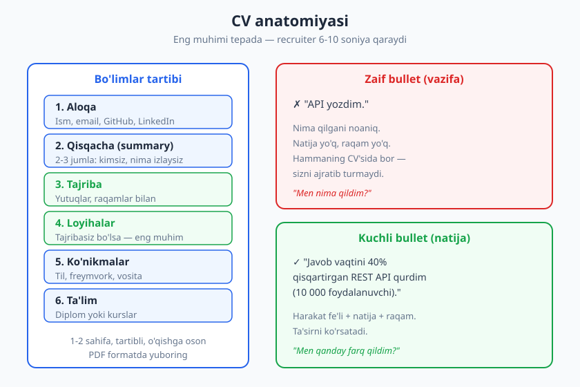
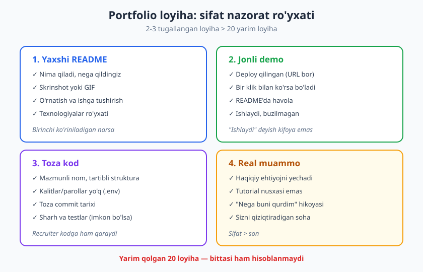
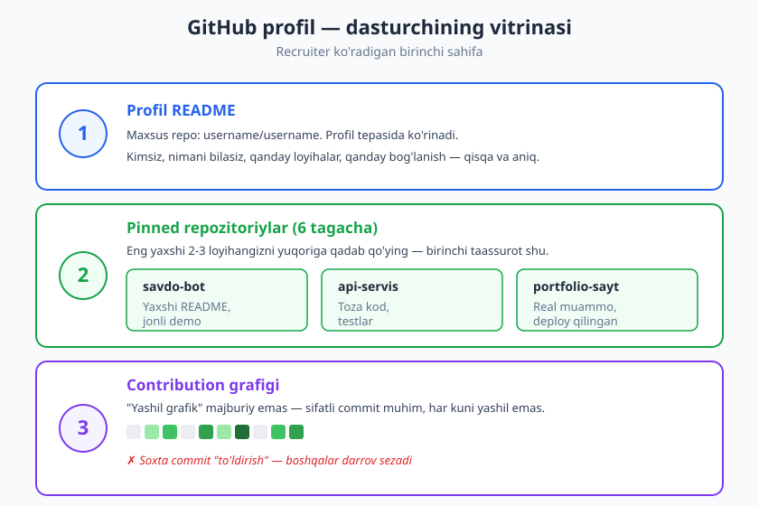

# 25 — CV, portfolio va GitHub profil

[⬅️ Oldingi: 24 — Hujjatlashtirish ko'nikmasi](./24-hujjatlashtirish.md) · [🏠 README](./README.md) · [Keyingi: 26 — Texnik intervyuga tayyorgarlik ➡️](./26-texnik-intervyu.md)

---

> **Bu bobda:** Ishni topishning birinchi qadami — o'zingizni ko'rsata olish. CV (rezyume), portfolio va GitHub — dasturchining "vitrinasi". Yutuq-asoslangan bayonni (vazifa emas, natija), ATS (avtomatik saralash tizimi) dan o'tishni, kuchli portfolio loyihalarni va GitHub/LinkedIn profilini qurishni o'rganamiz. Maqsad — O'zbekistonlik dasturchi mahalliy va xalqaro bozorga ham kira oladigan amaliy maslahat.
>
> **Halollik / Eslatma:** CV, portfolio yoki "yashil grafik" sizning o'rningizga kodlay olmaydi — ular faqat **eshikni ochadi**. Yaxshi vitrina yomon dasturchini yashira olmaydi; lekin yaxshi dasturchini ko'rinmas qilib qo'yadigan yomon vitrina — juda ko'p. Bu bob aynan o'sha ko'rinmaslikni tuzatadi. Bu bob VI qism — Karyera — ni ochadi.

---

## Nega "vitrina" muhim

Tasavvur qiling: siz oyiga 200 ta CV oladigan recruiter'siz. Har biriga qancha vaqt ajratasiz? Tadqiqotlar va recruiter'larning o'z e'tiroflari shuni ko'rsatadiki — **birinchi saralashda CV'ga atigi bir necha soniya** qaraladi. Ko'p marta keltiriladigan raqam 6-10 soniya. Bu aniq ilmiy o'lchov emas, lekin haqiqatni yetkazadi: sizning CV'ngiz diqqat bilan o'qilmaydi — u **skanlanadi**.

Bu sizga yoqmasligi mumkin. "Men 3 oy ishladim shu loyihada, ular 6 soniya qaraydimi?" Ha. Va bu adolatsizlik emas — bu **hajm**. Shuning uchun o'yin qoidasi oddiy: muhim narsani topish oson bo'lsin. Yashirmang, bezamang, ko'mmang.

Dasturchining vitrinasi uch qismdan iborat va ular bir-birini quvvatlaydi:

- **CV** — birinchi eshik. Skanlanadi, filtrlandi, qabul yoki rad.
- **GitHub** — isbot. CV "men API yozaman" deydi; GitHub buni *ko'rsatadi*.
- **LinkedIn** — ko'rinish. Recruiter sizni *topadi*, network quriladi.

Ko'pchilik faqat birinchisiga e'tibor beradi. Ajralib turadiganlar uchalasini ham bog'lab, bir xil hikoyani aytadi.

> **Eslatma:** O'zbekistonlik dasturchi uchun yaxshi xabar shu: xalqaro bozor (remote, freelance, relokatsiya) ko'pincha **diplomingizni emas, ishingizni** ko'radi. GitHub'dagi haqiqiy loyiha — universitet nomidan kuchliroq dalil. Bu sizning foydangizga — chunki kodni hamma ko'ra oladi, lekin diplomni faqat O'zbekistonda taniyishadi.

---

## CV (rezyume) asoslari

CV — bu sizning butun hayotingiz hikoyasi emas. Bu **bitta maqsadli hujjat**: "meni intervyuga chaqiring" degan ariza. Maqsadi sizni ishga olish emas — *keyingi qadamga* (suhbatga) o'tkazish. Shuni yodda tutsangiz, ko'p qaror osonlashadi.

### Tuzilish: nima qayerda turadi

Yaxshi CV — **qisqa (1-2 sahifa), tartibli, o'qishga oson.** Standart bo'limlar va ularning eng samarali tartibi:

| Bo'lim | Nima yoziladi | Maslahat |
|---|---|---|
| **Aloqa** | Ism, email, telefon, GitHub, LinkedIn havolasi | Email professional bo'lsin (`cool_boy_2003@...` emas) |
| **Qisqacha (summary)** | 2-3 jumla: kimsiz, nimani izlaysiz | Har vakansiyaga moslang; bu eng ko'p o'qiladigan joy |
| **Tajriba** | Ish joylari, eng yangisi tepada | Vazifa emas — **yutuq** yozing (pastda batafsil) |
| **Loyihalar** | Portfolio loyihalari | Tajribasiz bo'lsangiz — **bu eng muhim bo'lim** |
| **Ko'nikmalar** | Til, freymvork, vosita | Halol bo'ling; "ekspert" deb yozsangiz so'rashadi |
| **Ta'lim** | Diplom yoki kurslar | Tajriba ortgani sayin pastga tushadi |

Asosiy printsip — **eng muhimini tepaga.** Recruiter yuqoridan pastga skanlaydi va ko'pincha pastgacha yetib bormaydi. Agar siz junior bo'lsangiz va eng kuchli narsangiz portfolio loyihalari bo'lsa — ularni ta'limdan oldinga qo'ying. CV "to'g'ri tartib" haqida emas, *sizning kuchli tomoningiz birinchi ko'rinishi* haqida.

> **Diqqat:** Bir CV — barcha vakansiyaga emas. Har bir vakansiya uchun summary va eng yuqoridagi 2-3 bulletni moslashtiring. Bu 10 daqiqalik ish, lekin javob darajasini sezilarli oshiradi. Backend vakansiyaga frontend yutuqlaringizni tepaga chiqarmang.

### Nimani YOZMASLIK kerak

- **Surat, tug'ilgan sana, oilaviy holat** — xalqaro standartda kerak emas, ba'zan zarar (noxolislik). O'zbekistonda ba'zi kompaniyalar so'rashi mumkin, lekin texnik vakansiyalarda — kamdan-kam.
- **"Stressga chidamli, jamoaviy, mas'uliyatli"** — bu bo'sh so'zlar; hamma yozadi, hech kim isbotlamaydi. Buning o'rniga jamoada qilgan **aniq ishingizni** ko'rsating.
- **10 yil oldingi ahamiyatsiz tajriba** yoki har bir texnologiya nomi. CV — antalog emas, tanlangan vitrina.
- **Yolg'on.** "React'da ekspert" deb yozasiz — intervyuda 5 daqiqada ochiladi. Ishonchni bir marta yo'qotsangiz, qaytarib bo'lmaydi.

---

## Yutuq-asoslangan bayon: vazifa emas, NATIJA

Bu — butun CV'dagi eng muhim ko'nikma. Aksariyat CV **vazifalar ro'yxati**: "API yozdim", "saytni qildim", "testlar yozdim". Bu nima qilganingizni aytadi, lekin **qanday farq qilganingizni** aytmaydi. Recruiter o'qiydi va: "Xo'sh? Hamma shuni yozadi" deb o'tib ketadi.

Kuchli bayon **natijaga yo'naltirilgan**. Formula oddiy:

> **Harakat fe'li + nima qildingiz + natija (+ raqam, imkon bo'lsa)**

Taqqoslang:

| ❌ Zaif (vazifa) | ✅ Kuchli (natija + raqam) |
|---|---|
| "API yozdim" | "Javob vaqtini 40% qisqartirgan REST API qurdim (10 000 foydalanuvchi)" |
| "Bug'larni tuzatdim" | "Eng ko'p shikoyat keltirgan 3 ta kritik bug'ni topib tuzatdim, qo'llab-quvvatlash so'rovlari 25% kamaydi" |
| "Testlar yozdim" | "Asosiy modulga test qopqog'ini 30% dan 80% gacha ko'tardim, regressiya buglar deyarli yo'qoldi" |
| "Jamoada ishladim" | "3 kishilik jamoada to'lov modulini muddatidan oldin yetkazdik" |

Farqni ko'ryapsizmi? Chap tomon — *siz nima bilan band edingiz*. O'ng tomon — *siz qanday qiymat yaratdingiz*. Recruiter ikkinchisini xohlaydi, chunki u kelajakni bashorat qiladi: "bu odam kelganda nima qiladi?"

### Raqam topolmasam-chi?

Eng ko'p beriladigan e'tiroz: "lekin men raqam o'lchamadim-ku!" Bu rost bo'lishi mumkin — har doim ham aniq metrika bo'lavermaydi. Ikki yo'l bor:

1. **Yaqinlashtiring, lekin halol.** "Taxminan 500 foydalanuvchi", "har kuni ishlatiladi" — aniq raqam yo'q bo'lsa, kattalik tartibini ayting. Yolg'on raqam yozmang — intervyuda so'rashadi.
2. **Raqam bo'lmasa — ta'sirni ayting.** Har natija raqamli bo'lishi shart emas: "Yangi ishchilar uchun onboarding hujjatini yozdim — endi ular 1-kuni mustaqil ishga tushadi" — bu raqamsiz, lekin kuchli natija.

> **Trade-off:** Raqam ishonarli bo'lsin. "Tizimni 10 000% tezlashtirdim" — hech kim ishonmaydi, aksincha zarar. Kichik, real raqam ("15% kamaytirdim") bahaybat, isbotsiz raqamdan kuchliroq. Halollik — bu yerda strategiya.

Bu ko'nikma 09-bobdagi **"nima → nega → qanday"** mantig'iga juda yaqin: yaxshi texnik muloqot ham, yaxshi CV ham *ta'sirni* markazga qo'yadi, jarayonni emas. Buni [09-bob — Texnik muloqot asoslari](./09-texnik-muloqot-asoslari.md) da chuqurroq ko'rgansiz.

---

## ATS: mashina sizni o'qiganda

Mana ko'pchilik bilmaydigan haqiqat: ko'p o'rta va katta kompaniyalar CV'ni **avval odam emas, dastur o'qiydi.** Bu dastur — **ATS (Applicant Tracking System — nomzodlarni kuzatish tizimi).** U yuzlab CV'ni qabul qiladi, matnni ajratib oladi, kalit so'zlarni qidiradi va recruiter'ga saralangan ro'yxat beradi. Agar CV'ngiz ATS'ni chalg'itsa — odam uni umuman ko'rmaydi.

Bu, ayniqsa, xalqaro va yirik kompaniyalarga ariza berganda muhim. O'zbekistondagi kichik studiyalar ATS ishlatmasligi mumkin, lekin global remote bozorda bu — standart.

### ATS'dan o'tish qoidalari

- **Oddiy format.** Murakkab ikki-ustunli dizayn, jadval ichiga joylangan matn, grafik ikonkalar — ATS bularni ko'pincha noto'g'ri o'qiydi yoki tashlab yuboradi. Bir ustunli, tartibli, oddiy CV — eng xavfsiz.
- **PDF formatida** yuboring (agar e'londa boshqa format so'ralmasa). PDF tartibni saqlaydi. Lekin u **matnli PDF** bo'lsin — rasmga aylangan CV (skanlangan) ATS uchun bo'sh varaq.
- **Vakansiyadagi kalit so'zlar.** E'londa "REST API", "Docker", "agile" yozilgan bo'lsa va siz buni bilsangiz — aynan shu so'zlarni CV'da ishlating. ATS aynan moslikni qidiradi. "Konteynerlashtirish" deb yozsangiz, ATS "Docker" ni topmaydi. **Bu yolg'on yozish degani emas** — siz bilgan narsani e'lon tilida ifodalash.
- **Standart sarlavhalar.** "Tajriba", "Ko'nikmalar", "Ta'lim" — ATS shularni qidiradi. "Mening sarguzashtlarim" kabi ijodiy sarlavhalar tizimni chalg'itadi.
- **Haddan tashqari dizayndan voz keching.** Chiroyli infografik CV inson uchun ta'sirli bo'lishi mumkin, lekin mashinani chalg'itadi. Vizual ijodni portfolio saytingizga oling, CV'ni oddiy saqlang.

> **Diqqat:** ATS uchun optimallashtirish "tizimni aldash" emas. Maqsad — *sizning haqiqiy ko'nikmangiz mashina tomonidan to'g'ri o'qilishi*. Yo'q ko'nikmani kalit so'z sifatida tiqishtirmang — intervyuda ochiladi va ishonch yo'qoladi.

---

## Portfolio loyihalari: son emas, sifat

Tajribasiz yoki kam tajribali dasturchi uchun **portfolio — eng kuchli quroli.** CV'da "men o'rganaman" deb yozish oson; deploy qilingan, ishlaydigan loyiha buni *isbotlaydi*. Lekin bu yerda eng katta xato — **miqdor ortidan quvish.**

**2-3 ta yaxshi, tugallangan, deploy qilingan loyiha — 20 ta yarim qolgan loyihadan kuchliroq.** Nega? Chunki yarim loyiha aslida *salbiy* signal: u "men boshlay olaman, lekin tugata olmayman" deydi. Recruiter esa ishni *tugatadigan* odam izlaydi. GitHub'ingiz to'la "todo-app", "calculator", "tutorial-clone" bilan bo'lsa — bu hammaning portfoliosi, sizniki emas.

### Yaxshi portfolio loyihasi nimaga ega

1. **Yaxshi README.** Bu loyihaning yuzi. Nima qiladi, nega qurdingiz, qanday ishga tushiriladi, qaysi texnologiyalar — barchasi aniq. Skrinshot yoki GIF qo'shing. README yozish — alohida ko'nikma; uni [24-bob — Hujjatlashtirish ko'nikmasi](./24-hujjatlashtirish.md) da to'liq o'rgangansiz, shu bilimni shu yerda ishga soling.
2. **Jonli demo.** "Kodi mana, o'zingiz ishga tushiring" — yetarli emas. Recruiter'ning vaqti yo'q. Loyihani deploy qiling (bepul hostinglar yetarli) va README'ga **ishlaydigan havola** qo'ying. Bir klik bilan ko'rsa bo'lsin.
3. **Toza kod.** Recruiter (yoki kelajakdagi lead) kodga ham qaraydi. Mazmunli nomlar, tartibli struktura, **kalitlar/parollar repoda yo'q** (`.env` ishlatilgan), toza commit tarixi. Bu yerda Git ko'nikmasi muhim — agar commit'laringiz "fix", "fix2", "asd" bo'lsa, bu yaxshi taassurot qoldirmaydi. Git'ni puxta o'rganish uchun [Git & GitHub kitobiga](../git-github/README.md) qarang.
4. **Real muammo yechadi.** Eng kuchli loyiha — *haqiqiy ehtiyojni* yechadigan loyiha. Tutorial nusxasi emas. "Men do'konimiz uchun zakaz boshqaruvini yozdim", "talabalar uchun dars jadvali botini qildim" — bu sizni eslab qoladigan qiladi. Sizni qiziqtiradigan sohani tanlang: ishtiyoq kodda ko'rinadi.

> **Trade-off:** Loyihangiz dunyoni o'zgartirishi shart emas. Kichik, lekin **tugallangan va sayqallangan** loyiha — bahaybat, lekin chala loyihadan afzal. "Tugatish" — junior'ni mid'dan ajratadigan eng ishonchli signal.

### Qaysi loyihani qilish kerak?

- O'zingiz ishlatadigan narsani qiling — shunda uni haqiqatan sinaysiz va sayqallaysiz.
- Bir loyiha **chuqurlikni** ko'rsatsin (to'liq, deploy, test bilan), boshqasi **kengligingizni** (boshqa stack yoki soha).
- Mavjud open-source loyihaga hissa qo'shish ham portfolio — hatto kuchliroq, chunki bu *jamoada, real kodbazada* ishlay olishingizni ko'rsatadi.

---

## GitHub va LinkedIn profil

CV — bir varaq qog'oz. GitHub va LinkedIn — sizning **doimiy, jonli vitrinangiz.** Recruiter ko'pincha CV'ni o'qigach, GitHub'ingizni ochadi. U yerda nima ko'rishi muhim.

### GitHub profilini sozlash

- **Profil README.** GitHub'da maxsus xususiyat bor: agar siz nomingiz bilan bir xil nomli repo yaratsangiz (`username/username`), uning README'si profilingiz tepasida ko'rinadi. Bu yerda qisqacha: kimsiz, nimani bilasiz, asosiy loyihalaringiz, bog'lanish. Bu — GitHub'dagi "summary"ingiz.
- **Pinned repozitoriylar.** Profilga 6 tagacha repo "qadab" qo'yish mumkin. Eng yaxshi 2-3 loyihangizni qadang — recruiter birinchi ko'radigan narsa shu. Yarim loyihalarni qadamang; ular orasida eng yaxshisi yo'qolib ketadi.
- **Toza commit va tarix.** Mazmunli commit xabarlari, tartibli repo'lar. Eski, tashlab ketilgan, README'siz repo'lar profilni "shovqinli" qiladi. Eski mashq repolarini arxivlang yoki private qiling.
- **"Yashil grafik" haqida halol gap.** Contribution grafigi (har kungi yashil kvadratlar) — ko'p muhokama qilinadi, lekin **majburiy emas.** Har kuni commit qilish sizni yaxshi dasturchi qilmaydi; sifatli ish qiladi. Soxta commit bilan grafikni "to'ldirish" — yomon g'oya, chunki tajribali ko'z buni darrov sezadi (bo'sh commit'lar, mazmunsiz o'zgarishlar). Tabiiy faollik — yetarli. **Sifat muhim, rang emas.**

> **Eslatma:** Yangi boshlovchilar GitHub'ni bo'm-bo'sh qoldirib qo'yishdan qo'rqadi. Qo'rqmang — har kim noldan boshlaydi. Bitta yaxshi, tugallangan loyiha — yuzta bo'sh kundan yaxshiroq hikoya aytadi. Bugun bittadan boshlang.

### LinkedIn — ko'rinish va aloqa

GitHub kodingizni ko'rsatadi; LinkedIn esa *sizni topiladigan* qiladi. Ko'p recruiter aynan LinkedIn orqali nomzod qidiradi.

- **To'liq profil.** Aniq lavozim sarlavhasi ("Backend Developer | Node.js, PostgreSQL"), professional rasm, qisqacha "about" bo'limi — CV summary'ingizning kengaytirilgan varianti. To'liqsiz profil qidiruvda pastga tushadi.
- **Tajriba va loyihalar** — CV bilan izchil bo'lsin. Bir joyda bir narsa, boshqa joyda boshqa narsa — ishonchni pasaytiradi.
- **Faollik va networking.** Boshqalarning postlariga mazmunli izoh, o'z o'rganganlaringizni ulashish, sohadagi odamlar bilan bog'lanish — bularning hammasi sizni *ko'rinadigan* qiladi. Ish ko'pincha e'lon orqali emas, **tanish orqali** keladi. Bu — networking, va biz uni [29-bob — Networking, shaxsiy brend va jamoa](./29-networking-shaxsiy-brend.md) da chuqurroq ko'ramiz.

> **Diqqat:** Vitrina bir-biriga mos bo'lsin. CV'da, GitHub'da, LinkedIn'da **bir xil hikoya** aytilsin. Recruiter uchalasini ham ochadi — agar ular qarama-qarshi (CV'da "senior", GitHub'da bo'sh) bo'lsa, ishonch yo'qoladi. Izchillik — bu yerda eng kuchli signal.

---

## Hammasini birlashtirish: 1 haftalik reja

Nazariya yetarli. Agar siz ish qidirayotgan bo'lsangiz, mana amaliy ketma-ketlik:

1. **1-kun:** GitHub'ni tozalang. Eng yaxshi 2-3 loyihani aniqlang, qolganini arxivlang. Pinned repolarni sozlang.
2. **2-3-kun:** Eng kuchli loyihangizga **a'lo README** yozing (24-bob), agar deploy qilinmagan bo'lsa — deploy qiling.
3. **4-kun:** Profil README yarating. LinkedIn profilini to'ldiring.
4. **5-kun:** Bir varaqli CV yozing. Har bulletni "vazifa → natija + raqam" formulasiga o'tkazing.
5. **6-kun:** Aniq bir vakansiya oling. CV summary va yuqori bulletlarni o'shanga moslang, kalit so'zlarni qo'shing (ATS).
6. **7-kun:** Boshqa odamga ko'rsating. "6 soniyada nimani ko'rding?" deb so'rang. Ular birinchi ko'rgan narsa siz xohlagan narsami?

Bu reja "bir martalik" emas — har yangi vakansiyaga CV'ni qayta moslaysiz, har yangi loyihada GitHub o'sadi. Vitrina — jonli, doimiy ish.

---

## Asosiy g'oyalar (bobni qisqacha)

- **CV skanlanadi, o'qilmaydi** (atigi bir necha soniya). Eng muhimni **tepaga** qo'ying, qisqa (1-2 sahifa) va tartibli saqlang.
- **Vazifa emas, natija yozing.** Formula: **harakat fe'li + nima qildingiz + raqam**. "API yozdim" zaif; "javob vaqtini 40% qisqartirgan API qurdim" kuchli.
- **ATS — mashina o'quvchi.** Oddiy format, **PDF**, vakansiyadagi kalit so'zlar, standart sarlavhalar. Haddan tashqari dizayn tizimni chalg'itadi.
- **Portfolioda sifat > son.** 2-3 ta **tugallangan, deploy qilingan, README'li** loyiha — 20 ta yarim loyihadan kuchli. Real muammo yechsin.
- **GitHub — isbot.** Profil README, pinned repo, toza commit. **"Yashil grafik" majburiy emas** — sifat muhim, soxta commit zarar.
- **LinkedIn — ko'rinish.** To'liq profil, faollik, networking. Ish ko'pincha tanish orqali keladi.
- **Izchillik — eng kuchli signal.** CV, GitHub va LinkedIn bir xil, halol hikoyani aytsin. Yolg'on bir intervyuda ochiladi.

---

## Mashqlar

### Oson

**1-mashq.** Quyidagi zaif CV bulletlarini "harakat fe'li + natija + raqam" formulasiga aylantiring. Raqam ma'lum bo'lmasa, mantiqiy taxmin qo'shing (lekin halol darajada):
- a) "Ma'lumotlar bazasi bilan ishladim."
- b) "Frontend qildim."
- c) "Mijozlar bilan gaplashdim."

**2-mashq.** O'zingizning hozirgi GitHub profilingizni oching (yo'q bo'lsa — tasavvur qiling). Quyidagilarni sanab chiqing: (1) Profil README bormi? (2) Nechta repo pinned? (3) Pinned repolardan nechtasida ishlaydigan README va deploy havolasi bor? Har "yo'q" — bu sizning bugungi vazifangiz.

### O'rta

**3-mashq.** Bitta portfolio loyihasi rejasini tuzing. Yozing: (1) Qanday **real muammoni** yechadi va kim uchun? (2) Qaysi texnologiyalar? (3) "Tugallangan" deb hisoblash uchun minimal nima bo'lishi kerak (MVP)? (4) Qayerga deploy qilasiz? Tutorial nusxasi bo'lmasin — sizni qiziqtiradigan narsa bo'lsin.

**4-mashq.** Bitta haqiqiy vakansiya e'lonini toping (LinkedIn, hh.uz, yoki Telegram kanalidan). E'londan **kalit so'zlarni** (texnologiyalar, ko'nikmalar) ajratib oling. Endi o'z CV'ngizni (yoki taxminiy CV'ngizni) ko'rib chiqing: qaysi kalit so'zlar mavjud, qaysilari yo'q? Yo'qlaridan qaysi birini **halol** qo'sha olasiz (ya'ni rostan bilasiz)?

### Qiyin

**5-mashq. (GitHub profil auditi)** O'z GitHub profilingizni begona recruiter ko'zi bilan to'liq audit qiling. Quyidagi har bandni 1-5 ball bilan baholang va har biriga bitta aniq yaxshilash harakatini yozing: (a) profil README sifati, (b) pinned repolar sifati, (c) eng yaxshi loyihaning README'si, (d) commit xabarlarining sifati, (e) deploy qilingan loyihalar soni. Eng past ballli bandni shu hafta tuzating.

**6-mashq. (Izchillik tekshiruvi)** O'zingizning CV, GitHub va LinkedIn (yoki ularning loyihalarini) yonma-yon qo'ying. Uchalasi **bir xil hikoyani** aytadimi? Har birida o'zingizni qanday ta'riflagansiz (masalan: "junior backend", "fullstack", "Python developer")? Agar ular bir-biriga mos kelmasa — bitta aniq, halol "professional identifikatsiya" tanlang va uchchalasini shunga moslang. Natijani bir jumlada yozing: "Men ... man va ... izlayman."

Yechimlar / Namunaviy yondashuvlar

### 1-mashq yechimi

Maqsad — vazifani natijaga aylantirish. Namunalar (raqamlar — ishonarli taxmin):
- a) ❌ "Ma'lumotlar bazasi bilan ishladim" → ✅ "Sekin ishlaydigan 3 ta so'rovni indeks qo'shib optimallashtirdim, hisobot sahifasi 4 soniyadan 0.5 soniyaga tushdi."
- b) ❌ "Frontend qildim" → ✅ "5 ta asosiy sahifani responsive qilib qayta yozdim, mobil foydalanuvchilar uchun yuklash vaqtini 30% kamaytirdim."
- c) ❌ "Mijozlar bilan gaplashdim" → ✅ "10 ta mijoz bilan talab to'plash uchrashuvini o'tkazib, noaniq talablarni 2 hafta oldindan aniqlab oldim, qayta ishlash kamaydi."

Diqqat: har birida **harakat fe'li** (optimallashtirdim, qayta yozdim, o'tkazdim) + **natija** + iloji boricha **raqam** bor. Raqamlaringiz halol bo'lsin — intervyuda so'rashadi.

### 2-mashq yechimi

Bu — diagnostika mashqi, "to'g'ri javob" yo'q. Lekin yaxshi natija quyidagicha ko'rinadi: profil README mavjud va to'ldirilgan; 3-6 ta repo pinned; har pinned repoda kamida bitta skrinshot, ishga tushirish yo'riqnomasi va (web loyiha bo'lsa) deploy havolasi bor. Agar ko'p "yo'q" chiqsa — bu yomon emas, bu **yo'l xaritangiz**. Bobning oxiridagi 1 haftalik rejani shu yerdan boshlang.

### 3-mashq yechimi

Kuchli reja namunasi: "**Muammo:** Bizning kichik do'kon zakazlarni qog'ozda yozadi, adashadi. **Yechim:** Telegram bot orqali zakaz qabul qilish va kunlik hisobot. **Kim uchun:** ota-onamning do'koni (real foydalanuvchi!). **Stack:** Node.js + grammY + PostgreSQL. **MVP:** zakaz qo'shish, ro'yxat ko'rish, kunlik jami. **Deploy:** bepul hosting + boshqariladigan DB." Bu kuchli, chunki: real foydalanuvchi bor, aniq tugash chizig'i bor, va sizning hikoyangiz bor ("oilaviy do'kon uchun qurdim"). Zaif reja: "yana bitta todo-app qilaman" — hech kimni qiziqtirmaydi.

### 4-mashq yechimi

Aytaylik e'londa: "Node.js, REST API, PostgreSQL, Docker, agile jamoa". Siz Node va PostgreSQL bilasiz, REST API yozgansiz, lekin Docker'ni hali o'rganmagansiz. To'g'ri yondashuv: Node, PostgreSQL, REST API'ni CV'da **aynan o'sha so'zlar bilan** yozing (ATS topadi). Docker'ni — agar asoslarini bilsangiz "tanish" deb yozish mumkin, lekin "ekspert" emas; umuman bilmasangiz — yozmang. Bo'shliqni ko'rdingizmi? Bu sizning keyingi o'rganish maqsadingiz. Kalit so'zni *to'g'ri ifodalash* — yaxshi; *yolg'on tiqishtirish* — yomon.

### 5-mashq yechimi

Namunaviy audit: README "kim ekanim noaniq" (2/5 → qisqa, aniq summary yozaman); pinnedlar orasida 2 ta tutorial-clone bor (3/5 → ularni olib, real loyihani qadayman); eng yaxshi loyiha README'si faqat sarlavha (2/5 → skrinshot + ishga tushirish + deploy havolasi qo'shaman); commitlar "fix", "fix2" (2/5 → keyingi loyihada mazmunli xabar yozaman); deploy qilingan 0 ta (1/5 → eng yaxshi loyihani shu hafta deploy qilaman). Eng past — deploy (1/5), demak ustuvor vazifa: bitta loyihani jonli ishga tushirish. Audit kuchi shundaki, u "hammasini yaxshila" o'rniga **bitta aniq keyingi qadam** beradi.

### 6-mashq yechimi

Ko'p odamda nomuvofiqlik chiqadi: CV'da "Fullstack Developer", LinkedIn'da "Student", GitHub'da asosan frontend loyihalar. Bu recruiter'ni chalkashtiradi: "bu kim aslida?" Yechim — bitta halol, aniq pozitsiya tanlash. Masalan: "Men **junior frontend developer**man va React yo'nalishida birinchi ishimni izlayman." Endi: CV summary'si shunga moslanadi, LinkedIn sarlavhasi "Junior Frontend Developer | React" bo'ladi, GitHub'da React loyihalari qadaladi. Izchil hikoya — kuchli hikoya. "Hamma narsani qila olaman" — aslida "hech narsada aniq emasman" degan signal beradi.

---

[⬅️ Oldingi: 24 — Hujjatlashtirish ko'nikmasi](./24-hujjatlashtirish.md) · [🏠 README](./README.md) · [Keyingi: 26 — Texnik intervyuga tayyorgarlik ➡️](./26-texnik-intervyu.md)
