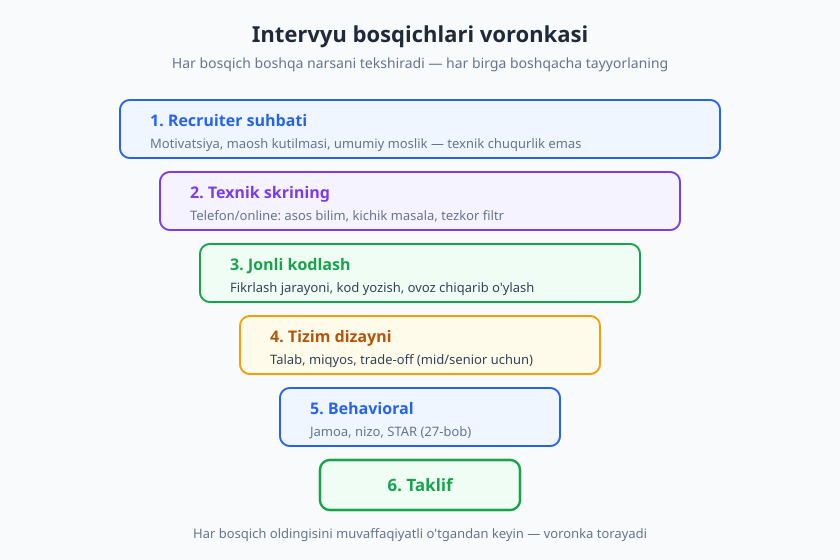
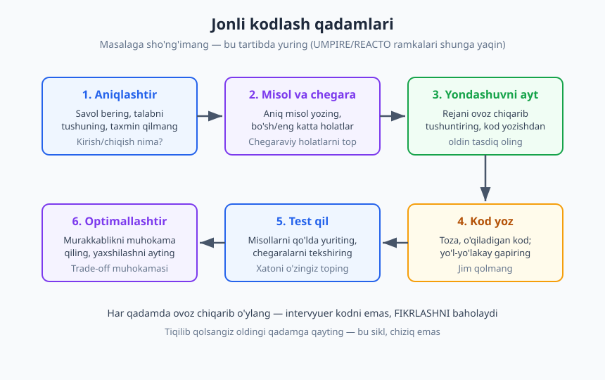
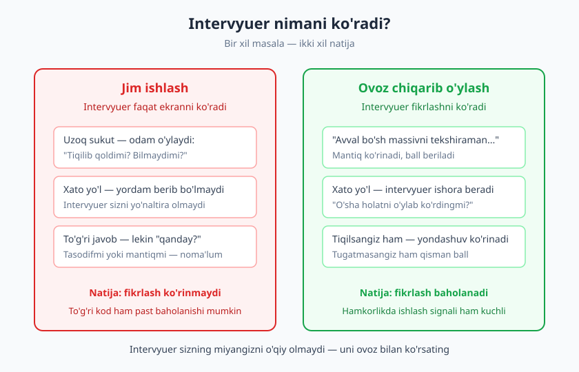

# 26 — Texnik intervyuga tayyorgarlik

[⬅️ Oldingi: 25 — CV, portfolio va GitHub profil](./25-cv-portfolio-github.md) · [🏠 README](./README.md) · [Keyingi: 27 — Behavioral intervyu va STAR metodi ➡️](./27-behavioral-intervyu-star.md)

---

> **Bu bobda:** Texnik intervyu — alohida ko'nikma, kod yozish ko'nikmasidan farqli. Yaxshi dasturchi bo'lish yetarli emas; intervyuda o'zingizni *ko'rsata olishingiz* kerak. Bu bobda intervyu bosqichlarini, jonli kodlash (live coding) jarayonini, "ovoz chiqarib o'ylash" (think aloud) san'atini, "bilmayman" holatini boshqarishni, tizim dizayni suhbatining asoslarini va tayyorgarlik strategiyasini o'rganamiz.
>
> **Halollik / Eslatma:** Bu bob algoritm yoki ma'lumotlar tuzilmasini *o'rgatmaydi* — bu uchun [Algoritmlar](../algoritmlar/README.md) va [1000 masala](../1000-masala/README.md) kitoblari bor. Bu bob jarayonni va yondashuvni beradi. Intervyu ko'nikmasi ham faqat o'qib emas, **mashq qilib** o'sadi — soxta intervyu, vaqt bilan masala yechish, takror.

---

## Nega intervyu alohida ko'nikma

Tasavvur qiling: ikki dasturchi bir xil darajada kod yoza oladi. Biri intervyudan o'tadi, ikkinchisi yo'q. Farq nimada? Ko'pincha farq — *ishlay olishda emas, ishlayotganini ko'rsata olishda.*

Bu adolatsizdek tuyuladi, va qisman shunday ham. Lekin sababini tushunish kerak: intervyuda intervyuer sizning bir necha yilingizni emas, **bir necha soatingizni** ko'radi. U sizning haqiqiy qobiliyatingizni to'g'ridan-to'g'ri o'lchay olmaydi — faqat *signal* yig'adi. Va o'sha signallar ko'pincha kodning o'zida emas: *qanday savol berasiz, tiqilib qolganda nima qilasiz, fikringizni qanday tushuntirasiz, xatongizni qanday topasiz.*

Shuning uchun intervyu — bu bilim sinovi emas (faqat), bu **xulq-atvor sinovi** ham. Va xulq-atvorni mashq qilish mumkin. Ko'p kuchli dasturchi intervyuda yiqiladi, chunki ular faqat *kod yozishni* mashq qildi — *intervyu bermaslikni* emas.

> **Eslatma:** Intervyuning haqiqatan ham bir nuqsoni bor: u ko'pincha kunlik ishga o'xshamaydi. Ish joyida hech kim sizdan oq doskada algoritmni yoddan yozishni so'ramaydi. Bu real — lekin o'yin qoidasi shu, va siz unda yutib chiqishni o'rganasiz. Buni "men yaxshi dasturchi emasman" deb qabul qilmang; bu shunchaki *boshqa ko'nikma*.

Yaxshi xabar shuki, intervyu ko'nikmasi — eng tez o'sadigan ko'nikmalardan biri. Bir oy maqsadli mashq, bir nechta soxta intervyu — va siz sezilarli farqni ko'rasiz. Bu bobning maqsadi — sizga o'sha mashqning xaritasini berish.

---

## Intervyu bosqichlari: nima nimani tekshiradi

Ko'p odam "texnik intervyu" deganda bitta narsani — oq doskadagi kodlashni — tasavvur qiladi. Aslida bu bir necha bosqichli **voronka** (funnel). Har bosqich oldingisini o'tganlarni filtrlaydi va *boshqacha* narsani tekshiradi. Agar har bosqich nimani izlashini bilsangiz — har biriga to'g'ri tayyorlanasiz.

Tipik ketma-ketlik (kompaniyaga qarab o'zgaradi, ba'zi bosqichlar qo'shilib ketadi):

| Bosqich | Kim o'tkazadi | Nima tekshiriladi | Sizning maqsadingiz |
|---|---|---|---|
| **1. Recruiter suhbati** | HR / recruiter | Motivatsiya, maosh kutilmasi, umumiy moslik | Iliq, aniq bo'ling; texnik chuqurlikka kirmaydi |
| **2. Texnik skrining** | Muhandis (telefon/online) | Asos bilim, bitta-ikkita kichik masala | Tezkor, toza fikrlash; vaqtni isrof qilmang |
| **3. Jonli kodlash** | 1-2 muhandis | Fikrlash, kod, muloqot, chegaraviy holatlar | Ovoz chiqarib o'ylash; jarayonni ko'rsating |
| **4. Tizim dizayni** | Senior muhandis | Miqyos, komponent, trade-off (mid/senior uchun) | Talabni aniqlang, qaror sababini ayting |
| **5. Behavioral** | Lead / menejer | Jamoa, nizo, mas'uliyat (27-bob) | STAR bilan aniq hikoya; halol bo'ling |
| **6. Taklif** | Recruiter | — | Bu yerda 28-bob boshlanadi (muzokara) |

Eng muhim tushuncha: **birinchi bosqich texnik emas.** Recruiter suhbatida algoritm so'ralmaydi — u sizning motivatsiyangizni, aloqa ko'nikmangizni va maosh kutilmangizni tekshiradi. Bu yerda "men kuchli algoritmchiman" deb gapirish o'rinsiz; bu yerda *iliq, aniq va tayyor* bo'lish kerak. Ko'p nomzod bu bosqichni yengil deb o'ylab, tayyorgarliksiz keladi va birinchi to'siqda yiqiladi.

Skrining bosqichi — tez filtr. Maqsad sizni *tasdiqlash* emas, *rad etmaslik*. Bu yerda hiyla-nayrang kerak emas; aniq, ishonchli asoslarni ko'rsating. Jonli kodlash va tizim dizayni — bobning markazi, ularni alohida ko'rib chiqamiz.

> **Diqqat:** Har kompaniya bu bosqichlarni boshqacha tartiblaydi. Kichik studiyada bitta suhbat — recruiter, texnik va behavioral bir o'tirishda. Yirik kompaniyada 5-6 ta alohida raund. Imkon bo'lsa recruiter'dan **jarayon qanday** ekanini oldindan so'rang — bu o'rinli savol va sizni tayyor ko'rsatadi.

---

## Jonli kodlash: masalaga sho'ng'imang

Mana eng keng tarqalgan xato. Intervyuer masalani aytadi, va nomzod darhol kod yoza boshlaydi. Bir necha daqiqadan keyin u tiqilib qoladi, chunki masalani to'liq tushunmagan. Bu — intervyuda yiqilishning eng tez yo'li.

To'g'ri yondashuv sabr bilan boshlanadi. Tan olingan ramkalar bor — masalan **UMPIRE** (Understand, Match, Plan, Implement, Review, Expand) yoki **REACTO** (Repeat, Examples, Approach, Code, Test, Optimize) — ularning nomi har xil, lekin mohiyati bir xil. Bu yerda biriga moslangan oddiy olti qadamni beraman.

### Olti qadam

1. **Aniqlashtiring (savol bering).** Masalani o'z so'zlaringiz bilan qaytaring va savol bering. "Kirish doim butun sonmi? Salbiy bo'lishi mumkinmi? Bo'sh ro'yxat kelishi mumkinmi? Natija qanday formatda kerak?" Bu savollar sizni *zaif* emas, *puxta* ko'rsatadi. Real ishda ham talab har doim noaniq — buni 12-bobdagi aniqlovchi savol va 22-bobdagi noaniqlik bilan ishlash bog'laydi.
2. **Misol va chegaraviy holatlar.** Aniq bir misol yozing: "kirish [3, 1, 2] bo'lsa, chiqish [1, 2, 3] bo'ladimi?" Keyin chegaralarni o'ylang: bo'sh kirish, bitta element, takrorlanuvchi qiymatlar, juda katta hajm. Chegaraviy holatlarni *o'zingiz* topish — kuchli signal.
3. **Yondashuvni ayting (kod yozishdan oldin).** Rejangizni ovoz chiqarib tushuntiring: "Avval xesh-jadval quraman, keyin bir marta yuraman — bu O(n) bo'ladi." Intervyuerdan tasdiq oling: "Shu yondashuv ma'qulmi, yoki boshqasini ko'rsataymi?" Bu — *eng muhim qadam*. Noto'g'ri yo'lda 20 daqiqa kod yozgandan ko'ra, 2 daqiqa rejani muhokama qilish yaxshiroq.
4. **Kod yozing.** Endi kod yozing — toza, o'qiladigan, mazmunli nomlar bilan. Yozayotganda gapiring: "Bu yerda har elementni aylanib chiqaman..." Sukutda yozmang.
5. **Test qiling.** Kodni o'zingiz "yuriting" — 2-qadamdagi misol va chegaralar bilan qo'lda tekshiring. Xatoni *intervyuer aytishidan oldin* o'zingiz toping — bu juda kuchli signal. "Mana bu yerda bo'sh ro'yxatda xato chiqadi, tuzataman."
6. **Optimallashtiring.** Vaqt va xotira murakkabligini (Big-O) muhokama qiling. "Bu O(n²), agar saralangan ma'lumot bo'lsa O(n log n) ga tushira olaman." Yaxshilash yo'lini aytish — hatto ulgurmasangiz ham — fikrlash chuqurligini ko'rsatadi.

> **Trade-off:** Bu qadamlarni mexanik bajarmang. Agar masala juda oddiy bo'lsa, aniqlashtirishni qisqartiring. Agar murakkab bo'lsa, yondashuvga ko'proq vaqt sarflang. Ramka — *o'ylashning tayanchi*, qattiq ritual emas. Intervyuer sizning fikrlashingizni ko'radi, qadamlarni sanaganingizni emas.

### Ovoz chiqarib o'ylash — eng muhim odat

Agar bu bobdan bitta narsa eslab qolsangiz, mana bu bo'lsin: **intervyuer sizning miyangizni o'qiy olmaydi.** U faqat siz aytgan va yozgan narsani ko'radi. Jim ishlasangiz — uning oldida bo'sh ekran va sukut. To'g'ri javobga kelsangiz ham, u *qanday* kelganingizni bilmaydi — tasodifmi yoki mantiqmi?

Aksincha, ovoz chiqarib o'ylasangiz, intervyuer:

- Sizning **fikrlash jarayoningizni** ko'radi va baholaydi — natija to'liq bo'lmasa ham.
- Siz xato yo'lga kirsangiz, **ishora bera oladi** — "o'sha holatni o'ylab ko'rdingmi?" Jim ishlasangiz, u sizni yo'naltira olmaydi.
- Sizning **hamkorlikda ishlash** ko'nikmangizni ko'radi — bu real ishning aksi.

Bir misol. Tiqilib qolgan ikki nomzod:

> **Nomzod A (jim):** *(5 daqiqa sukut, ekranni o'chirib-yoqadi, hech narsa aytmaydi)*
>
> **Nomzod B (ovoz chiqarib):** "Hmm, bu yerda tiqilib qoldim. Men xesh-jadval bilan yechmoqchi edim, lekin takror qiymatlar muammoni qiyinlashtiryapti. Bir daqiqa — agar qiymat o'rniga indeksni saqlasam-chi? Yoki balki saralashdan boshlasam yaxshiroqmi?"

Ikkalasi ham tiqilib qoldi. Lekin B intervyuerga *ishlaydigan miya* ko'rsatdi, A esa bo'sh ekran. B'ga intervyuer yordam bera oladi; A'ga yo'q. Ko'pincha ikkalasi bir xil masalada qolib ketadi, lekin B o'tadi, A yo'q.

> **Diqqat:** Ovoz chiqarib o'ylash sizga tabiiy kelmasligi mumkin — ko'p odamga kelmaydi. Bu — *mashq qilinadigan* ko'nikma. Yolg'iz mashq qilganda ham, garchi hech kim eshitmasa, ovozingizni chiqarib gapiring. Soxta intervyuda buni majburiy qiling. Bir necha haftada bu odatga aylanadi.

---

## "Bilmayman" holatini boshqarish

Eng katta qo'rquvlardan biri: "Agar bilmasam-chi? Agar tiqilib qolsam-chi?" Mana sizni yengillashtiradigan haqiqat: **sizdan hamma narsani bilish kutilmaydi.** Yaxshi intervyuer ham buni biladi. Ular ko'pincha ataylab *qiyin yoki ochiq* masala beradi — javobni bilishingizni emas, *qanday yondashishingizni* ko'rish uchun.

Demak, tiqilib qolish — muvaffaqiyatsizlik emas, balki *sinovning bir qismi*. Muhimi — qanday reaksiya berasiz. Mana to'g'ri yo'l:

- **Ovoz chiqarib o'ylang** (yana). Tiqilib qolsangiz, jim qolmang. "Hozir ikki yo'l ko'ryapman, lekin ikkalasida ham muammo bor..." — bu sukutdan ming marta yaxshi.
- **Oddiy yechimdan boshlang.** Optimal yechim kelmasa, "ishlaydigan, lekin sekin" yechimni ayting va yozing. "Avval brute-force qilaman, keyin yaxshilashga harakat qilaman." Ishlaydigan sekin yechim — ishlamaydigan optimaldan yaxshiroq. Bu — 19-bobdagi muammoni hal qilish mantig'ining aynan o'zi.
- **Intervyuerga savol bering.** "Men shu yo'lga kirdim — to'g'ri yo'nalishdamanmi?" Intervyuer dushman emas; ko'pincha u sizga yordam bermoqchi. Yaxshi savol — *zaiflik emas, etuklik* belgisi.
- **Halol bo'ling.** Biror narsani bilmasangiz, bilgandek qilmang. "Men bu algoritmni yoddan bilmayman, lekin printsipini tushunaman va shu yerdan chiqarishga harakat qilaman" — bu yolg'ondan ko'ra ming marta kuchli. Yolg'on darrov ochiladi va ishonchni butunlay yo'qotadi.

Solishtiring:

> ❌ **Yomon:** *(jim qoladi, keyin)* "Bilmayman." *(va to'xtaydi)*
>
> ✅ **Yaxshi:** "Bu aniq algoritmni yoddan bilmayman, ochig'i. Lekin keling, asoslardan chiqarishga harakat qilaman. Agar har elementni boshqalari bilan solishtirsam, bu ishlaydi-yu, lekin sekin. Yaxshiroq yo'l bormi deb o'ylayapman — balki ma'lumotni avval tartiblash kerakdir?"

Ikkinchisi ham javobni bilmaydi. Lekin u *muammoga qanday yondashishini* ko'rsatadi — va aynan shu baholanadi. Eng yengilmas masala ham aslida sinov: "bu odam qiyinchilikda taslim bo'ladimi yoki kurashadimi?"

> **Eslatma:** Real ishda ham siz har kuni *bilmaydigan* narsangizga duch kelasiz — va o'shanda ham aynan shu ko'nikma (oddiydan boshlash, savol berish, halol bo'lish) kerak. Intervyuer buni biladi. "Bilmayman, lekin shunday topaman" — bu junior'dan ko'ra senior signalidir.

---

## Tizim dizayni suhbati asoslari

Mid va senior darajada ko'pincha alohida **tizim dizayni** (system design) raundi bo'ladi. "URL qisqartirgich qanday qurasiz? Instagram'ning lentasini qanday dizayn qilasiz?" — kabi ochiq savollar. Bu raund ko'p nomzodni qo'rqitadi, chunki "to'g'ri javob" yo'qdek tuyuladi. Va aslida ham yo'q — **aynan shu mohiyati.** Bu raund javobni emas, *fikrlash usulingizni* tekshiradi.

Bu bob bu mavzuni o'rgatmaydi — bu chuqur soha va [Dasturiy arxitektura](../arxitektura/README.md) kitobi unga bag'ishlangan. Bu yerda intervyu kontekstidagi *yondashuvni* beraman.

### Tuzilgan yondashuv

1. **Talablarni aniqlang.** Darhol komponent chizmang. Avval savol bering: "Necha foydalanuvchi? O'qish ko'pmi yoki yozish? Qanday funksiyalar muhim? Kechikish (latency) qanchalik muhim?" Funksional va nofunksional talablarni ajrating. Bu — jonli kodlashning 1-qadami bilan bir xil odat: *aniqlashtirishdan boshlang*.
2. **Miqyosni baholang.** Taxminiy hisob qiling: "Agar 1 million foydalanuvchi kuniga 10 marta ishlatsa, bu sekundiga taxminan 100 so'rov." Aniq raqam shart emas — *kattalik tartibi* va uni hisoblash usuli muhim.
3. **Yuqori darajadagi komponentlar.** Asosiy bloklarni chizing: mijoz, API, baza, kesh, navbat. Murakkablikni birdan kiritmang — avval oddiy ishlaydigan tizim, keyin kengaytiring.
4. **Trade-off'larni muhokama qiling.** Mana eng muhim qism. "SQL yoki NoSQL? SQL izchillik beradi, NoSQL miqyosni osonlashtiradi — bizning holatda o'qish ko'p, shuning uchun..." Har qarorning *sababini* va *narxini* ayting. Bu aynan 23-bobdagi trade-off mantig'i.

> **Diqqat:** Tizim dizaynida eng katta xato — darhol "to'g'ri arxitektura"ni aytishga shoshilish. Intervyuer mukammal dizayn kutmaydi; u sizning *fikrlash jarayoningizni* — talabni aniqlash, variantlarni taqqoslash, sababni tushuntirish — ko'rmoqchi. "Bilmayman" o'rniga "bir necha variant bor, keling taqqoslaylik" deng.

Yana bir bog'lanish: tizim dizayni suhbatida ham, jonli kodlashda ham, bir xil meta-ko'nikma g'alaba keltiradi — *aniqlashtir, fikrla, sababini ayt*. Ikkalasi ham bilim sinovi emas, *fikrlash sinovi*.

---

## Tayyorgarlik va hayajonni boshqarish

Endi eng amaliy qism: intervyuga *qanday* tayyorlanish kerak. Tayyorgarlik tasodifiy bo'lmasligi kerak — u tizimli bo'lsa, natija ham ishonchli bo'ladi.

### Muntazam mashq

Intervyu ko'nikmasi — *mushak*. Bir kecha o'tirib o'rganib bo'lmaydi; muntazam mashq kerak.

- **Masala yeching, lekin to'g'ri.** Kuniga 1-2 ta masalani [Algoritmlar](../algoritmlar/README.md) va [1000 masala](../1000-masala/README.md) kitoblaridan yoki onlayn platformalardan yeching. Lekin **miqdor ortidan quvmang** — 500 ta masalani yodlashdan ko'ra, 100 tasini *chuqur* tushunish (naqshlarni ko'rish, yondashuvni umumlashtirish) yaxshiroq.
- **Vaqt bilan mashq qiling.** Intervyuda vaqt bosimi bor. Mashq qilganda taymer qo'ying — bu real sharoitga yaqinlashtiradi.
- **Ovoz chiqarib mashq qiling.** Yolg'iz yechganda ham gapiring. Bu g'alati tuyuladi, lekin intervyu kunida ovoz chiqarib o'ylash tabiiy kelishi uchun shart.

### Soxta intervyu

Eng kuchli vosita — **soxta (mock) intervyu.** Do'st, mentor yoki onlayn xizmat orqali real intervyuni simulyatsiya qiling. Nega bu muhim?

- Sizga *bosim ostida ishlash*ni o'rgatadi — bu yolg'iz mashqda yo'q.
- Sizga *feedback* beradi: "sen juda tez kod yoza boshlading, avval aniqlashtirmading." Bu zaif tomonlaringizni ochadi (13-bobdagi feedback qabul qilish bu yerda asqotadi).
- Sizni *kuzatilayotganga* o'rgatadi — birovning oldida fikrlash boshqacha his.

### Take-home topshiriqlar

Ba'zi kompaniyalar oq doska o'rniga **uyga vazifa** (take-home) beradi — "shu kichik loyihani 2 kunda qiling." Bu sizning real kodlash uslubingizni ko'rsatadi, demak sifat muhim:

- **Talabni o'qing va bajaring** — ortiqcha emas, kam emas. Over-engineering ham yomon signal.
- **Toza kod, mazmunli commit, README.** Bu — kichik portfolio loyihasi (25-bob). README'da qanday ishga tushirish va qaror sabablarini yozing.
- **Test qo'shing** — hatto bir nechta. Bu sifatga e'tiboringizni ko'rsatadi.

### Hayajonni boshqarish

Intervyu — stressli, va bu **normal.** Hayajon yo'qolmaydi; uni *boshqarish* o'rganiladi. Bu 11-bobdagi taqdimot hayajonini boshqarish bilan bir xil:

- **Mashq hayajonni kamaytiradi.** Soxta intervyu qancha ko'p bo'lsa, real intervyu shuncha tanish tuyuladi.
- **Nafas va pauza.** Savol kelganda darhol javob bermang. "Bir daqiqa o'ylab olay" deyish — to'liq joiz va sizni bosiq ko'rsatadi.
- **Asoslarni eslang.** Hayajon "men hech narsa bilmayman"ni keltiradi. Bu — Dunning-Kruger ta'siri emas, oddiy stress. Chuqur nafas oling, oddiy qadamdan boshlang.
- **Uxlang.** Intervyu oldidan tunda yaxshi uxlash — yana bitta masala yechishdan muhimroq. Charchagan miya tiqilib qoladi. Buni 08-bobdagi muvozanat bilan bog'lang.
- **Rad — fojia emas.** Har bir "yo'q" — keyingisiga tayyorgarlik. Eng kuchli dasturchilar ham rad etilgan. Intervyudan keyin: "nima yaxshi bo'ldi, nimani yaxshilash kerak?" deb yozib qo'ying — bu sizni har raundda kuchaytiradi.

> **Trade-off:** Cheksiz tayyorgarlik ham tuzoq. Bir nuqtada "yetarli tayyorman" deb intervyuga kirish kerak — chunki haqiqiy intervyu eng yaxshi o'qituvchi. "Yana bir oy o'rganay" ko'pincha qo'rquvni kechiktirish. Tayyorgarlik 70% bo'lganda boshlang, qolganini real intervyularda o'rganing.

---

## Asosiy g'oyalar (bobni qisqacha)

- **Intervyu — alohida ko'nikma**, kod yozishdan farqli. U bilimni emas, *signalni* o'lchaydi: qanday fikrlaysiz, gaplashasiz, tiqilib qolganda nima qilasiz. Va u **mashq qilinadi**.
- **Bosqichlarni biling.** Recruiter → skrining → jonli kodlash → tizim dizayni → behavioral → taklif. Har biri boshqa narsani tekshiradi; **birinchi bosqich texnik emas**.
- **Masalaga sho'ng'imang.** Olti qadam: **aniqlashtir → misol/chegara → yondashuv → kod → test → optimallashtir**. Kod yozishdan oldin rejani tasdiqlang.
- **Ovoz chiqarib o'ylang — eng muhim odat.** Intervyuer miyangizni o'qiy olmaydi; fikringizni *ovoz bilan ko'rsating*. Jim to'g'ri javob ovozli xato yondashuvdan past baholanishi mumkin.
- **"Bilmayman" — fojia emas.** Oddiy yechimdan boshlang, savol bering, halol bo'ling. Yengilmas masala ham sinov: *qanday* kurashasiz?
- **Tizim dizayni — javob emas, fikrlash sinovi.** Talabni aniqlang, miqyosni baholang, **trade-off'ni sababi bilan** muhokama qiling.
- **Tayyorgarlik tizimli bo'lsin.** Muntazam mashq (miqdor emas, chuqurlik), **soxta intervyu**, take-home'ga sifatli yondashuv, hayajonni boshqarish, uxlash. Rad — keyingisiga material.

---

## Mashqlar

### Oson

**1-mashq.** Bitta oddiy masalani oling (masalan: "ro'yxatdagi eng katta ikkita sonni toping"). Uni **ovoz chiqarib**, taymer qo'yib yeching — go'yo intervyu kabi. Olti qadamning har birini ataylab bajaring: aniqlashtir, misol, yondashuv, kod, test, optimallashtir. O'zingizni yozib oling (ovoz yoki video) va keyin tinglang: qaysi qadamlarni o'tkazib yubordingiz?

**2-mashq.** Quyidagi masala uchun kamida **5 ta aniqlovchi savol** yozing (kod yozmang, faqat savollar): "Foydalanuvchilar ro'yxatidan takror email manzillarni toping." Masalan: "Email katta-kichik harfga sezgirmi?" Maqsad — kod yozishdan oldin qanday savol berishni mashq qilish.

### O'rta

**3-mashq.** "Bilmayman" holatini mashq qiling. O'zingiz *bilmaydigan* bir mavzuni oling (masalan, tanish bo'lmagan algoritm). Endi go'yo intervyuda turibsiz: bu mavzu bo'yicha masalaga **qanday yondashishingizni** ovoz chiqarib aytib bering — oddiydan boshlash, savol berish, halollik. Yozma yoki ovozli — bir paragraf.

**4-mashq.** Bitta tizim dizayni savolini oling: "Oddiy URL qisqartirgich (kabi `bit.ly`) qanday qurardingiz?" Javob *yozmang* — buning o'rniga to'rt qadamni reja qiling: (1) qanday talab savollarini berasiz, (2) qanday miqyos hisobini qilasiz, (3) qaysi asosiy komponentlar, (4) qaysi bitta trade-off'ni muhokama qilasiz. Har qadamga 2-3 jumla.

### Qiyin

**5-mashq. (To'liq soxta intervyu)** Bir do'st yoki mentordan 45 daqiqalik soxta texnik intervyu o'tkazishni so'rang (yoki onlayn xizmatdan). Shartlar: ular sizga oldindan ko'rmagan masala bersin, siz **ovoz chiqarib** ishlang, ular faqat kuzatib feedback bersin. Tugagach so'rang: "(a) aniqlashtirish yetarlimidi? (b) men yetarlicha ovoz chiqarib o'yladimmi? (c) tiqilib qolganimda nima qildim?" Uchta eng muhim feedback nuqtasini yozib qo'ying va keyingi mashqda ularga e'tibor bering.

**6-mashq. (O'z-o'zini audit)** O'tgan (yoki tasavvur qilingan) bir intervyu tajribangizni eslang — yoki 1-mashqdagi yozuvni qayta ko'ring. Quyidagi har bandni 1-5 ball bilan baholang va har biriga bitta aniq yaxshilash yozing: (a) masalani aniqlashtirish, (b) ovoz chiqarib o'ylash, (c) chegaraviy holatlarni topish, (d) tiqilganda yondashuv, (e) hayajonni boshqarish. Eng past ballli bandni keyingi hafta maqsadli mashq qiling.

Yechimlar / Namunaviy yondashuvlar

### 1-mashq yechimi

Bu — amaliy mashq, "to'g'ri javob" yo'q, lekin yaxshi bajarish quyidagicha ko'rinadi. Yozuvni tinglaganda odatda ikki narsa ochiladi: (1) ko'p odam aniqlashtirishni o'tkazib, darhol kodga o'tadi — bu eng keng tarqalgan xato; (2) ko'p odam test bosqichini umuman bajarmaydi. Agar siz "kirish bo'sh bo'lsa-chi?", "bitta element bo'lsa-chi?" deb so'ramagansiz va kodni qo'lda yurmagan bo'lsangiz — bu sizning keyingi mashq nuqtangiz. Eng kuchli signal: xatoni *intervyuer aytishidan oldin o'zingiz* topish.

### 2-mashq yechimi

Kuchli savollar namunasi: (1) "Email katta-kichik harfga sezgirmi? (`A@x.com` va `a@x.com` bir xilmi?)" (2) "Ro'yxat hajmi qancha — xotiraga sig'adimi yoki oqim (stream) kerakmi?" (3) "Faqat takrorlarni topaymi yoki ularni sanaymi ham?" (4) "Bo'sh yoki yaroqsiz email bo'lishi mumkinmi?" (5) "Natija tartibi muhimmi?" (6) "Bo'sh ro'yxat kelishi mumkinmi?" Diqqat: bu savollar masalani *toraytiradi* va sizni puxta ko'rsatadi. Yomon yondashuv — hech narsa so'ramay, "katta-kichik harf bir xil" deb *taxmin qilib* kod yozish, keyin oxirida noto'g'ri ekanini bilish.

### 3-mashq yechimi

Namunaviy javob: "Bu algoritmni yoddan bilmayman, ochig'ini aytsam. Lekin yondashishga harakat qilaman. Avval eng oddiy, ishlaydigan yechimni o'ylayman — garchi sekin bo'lsa ham — shunda kamida nimadir ishlaydi. Keyin so'rardim: ma'lumot tartiblanganmi yoki katta hajmlimi? Chunki bu yaxshiroq yo'lni ochishi mumkin. Agar tiqilib qolsam, sizdan to'g'ri yo'nalishdami deb so'rardim." Bu javobning kuchi: u bilmaslikni *yashirmaydi*, lekin *taslim ham bo'lmaydi* — aynan shu baholanadi. Yomon javob: "bilmayman" deb to'xtash.

### 4-mashq yechimi

Namunaviy reja: **(1) Talab savollari:** Necha foydalanuvchi/havola? O'qish (qisqa havolani ochish) yozishdan necha barobar ko'p? Havola qancha yashashi kerak (muddat)? Maxsus (custom) havola kerakmi? **(2) Miqyos:** "Aytaylik kuniga 1 million yangi havola — bu sekundiga ~12 yozuv, lekin o'qish ehtimol 100 barobar ko'p, ya'ni ~1200 o'qish/sek. Demak o'qishga optimallashtirish kerak." **(3) Komponentlar:** mijoz → API → ID generator (qisqa kod) → baza (kod↔URL) → kesh (ommabop havolalar uchun). **(4) Trade-off:** "Qisqa kodni qanday generatsiya qilaman — tasodifiymi yoki ketma-ketmi? Ketma-ket oddiy, lekin taxmin qilinadigan; tasodifiy xavfsizroq, lekin to'qnashuvni tekshirish kerak. O'qish ko'p bo'lgani uchun keshni kuchli ishlataman." Diqqat: aniq javob emas — *fikrlash* va *sabab* baholanadi.

### 5-mashq yechimi

Bu — real mashq, eng qimmatli mashqlardan biri. "To'g'ri javob" — sizning *feedbackni qabul qilishingiz*. Ko'p odamga birinchi soxta intervyu og'riqli bo'ladi (juda tez kod yozdim, ovoz chiqarmadim, tiqilib qolib jim bo'ldim) — bu **normal va aynan maqsad**. Muhimi: feedbackni mudofaasiz qabul qiling (13-bob) va aniq uchta nuqtani keyingi mashqqa olib o'ting. Bir soxta intervyu — o'nlab yolg'iz masaladan ko'proq o'rgatadi, chunki u sizning *intervyu xulqingizni* ochadi, kod bilimingizni emas.

### 6-mashq yechimi

Namunaviy audit: aniqlashtirish (2/5 → darhol kodga o'taman, keyingi safar 3 ta savol berishni majburiy qilaman); ovoz chiqarib o'ylash (2/5 → jim ishlayman, mashqda ovozni majburlayman); chegaraviy holatlar (3/5 → ba'zilarini topaman, ro'yxatni oldindan tayyorlayman: bo'sh/bitta/katta); tiqilganda (1/5 → jim qolaman, "oddiydan boshlash" ni mashq qilaman); hayajon (2/5 → titrayman, soxta intervyu bilan ko'nikaman). Eng past — tiqilganda yondashuv (1/5), demak ustuvor mashq: ataylab qiyin masala olib, tiqilib qolishni va o'shanda ovoz chiqarib o'ylashni mashq qilish. Audit kuchi — "hammasini yaxshila" emas, *bitta aniq keyingi qadam* beradi.

---

[⬅️ Oldingi: 25 — CV, portfolio va GitHub profil](./25-cv-portfolio-github.md) · [🏠 README](./README.md) · [Keyingi: 27 — Behavioral intervyu va STAR metodi ➡️](./27-behavioral-intervyu-star.md)
