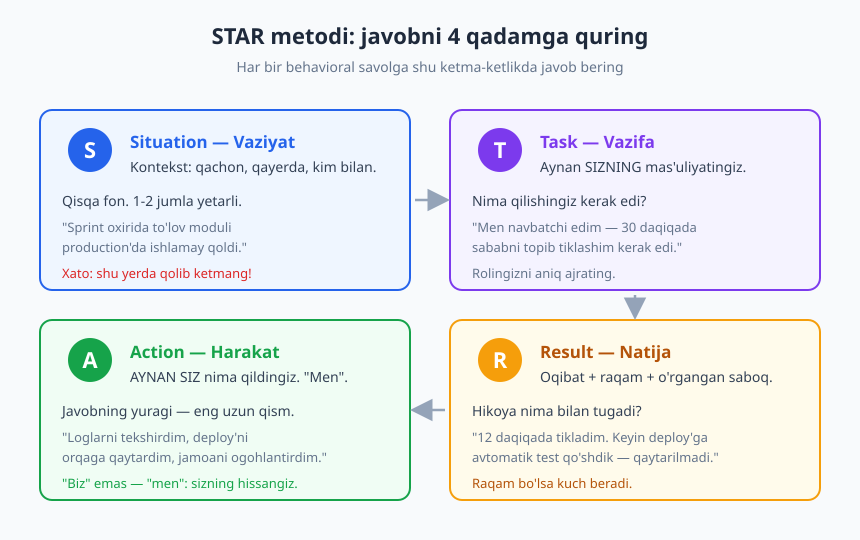
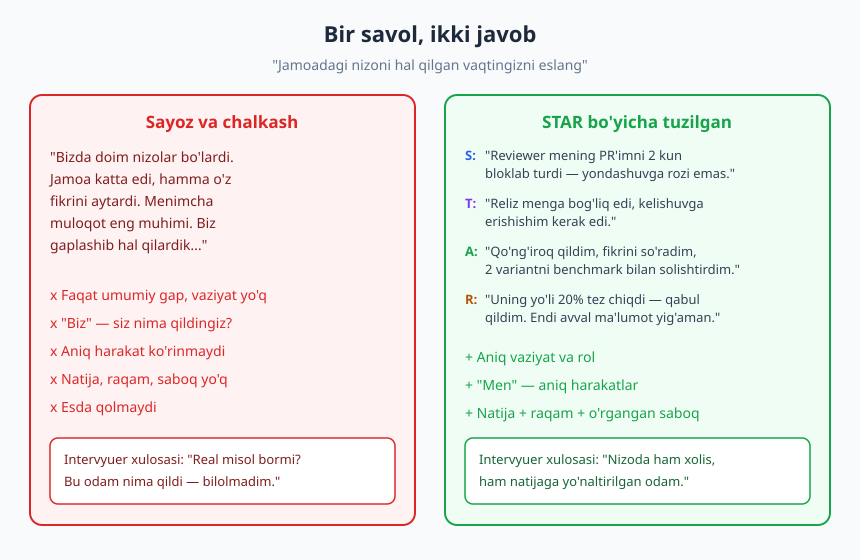
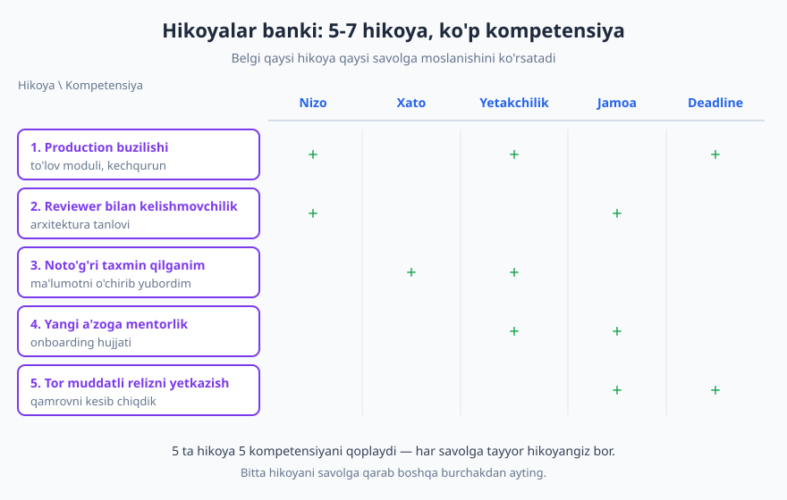

# 27 — Behavioral intervyu va STAR metodi

[⬅️ Oldingi: 26 — Texnik intervyuga tayyorgarlik](./26-texnik-intervyu.md) · [🏠 README](./README.md) · [Keyingi: 28 — Maosh muzokarasi va ish taklifini baholash ➡️](./28-maosh-muzokara.md)

---

> **Bu bobda:** Texnik intervyudan o'tdingiz — algoritmni yechdingiz, kod yozdingiz. Lekin intervyu shu bilan tugamaydi. Deyarli har bir jiddiy kompaniya **behavioral intervyu** (xulq-atvor suhbati) ham o'tkazadi: "qanday odamsiz, jamoada qanday ishlaysiz, qiyinchilikda o'zingizni qanday tutasiz?" Bu suhbatni boshqarishning eng kuchli vositasi — **STAR metodi**. Hikoyalar bankini tayyorlash, qiyin savollarga halol javob berish va intervyuerga to'g'ri savol berishni o'rganamiz.
>
> **Halollik / Eslatma:** STAR — to'qima hikoya o'ylab topish vositasi emas, balki **real tajribangizni tartibli aytib berish** vositasi. Yolg'on hikoya intervyuda darrov ochiladi: tajribali intervyuer "keyin nima bo'ldi?", "nega aynan shunday qildingiz?" deb chuqurlashtiradi va to'qima javob shu yerda qulaydi. Bu bob sizga halol tajribangizni kuchli ifodalashni o'rgatadi — yangi tajriba o'ylab topishni emas.

---

## Behavioral intervyu nima

Tasavvur qiling: ikki nomzod bir xil texnik darajada. Ikkalasi ham algoritmni yechdi, ikkalasi ham toza kod yozdi. Kompaniya birini tanlashi kerak. Endi savol texnik emas: **"Bu odam bilan har kuni ishlash qanday bo'ladi? Deadline tig'izlashganda u panika qiladimi? Xato qilganda yashiradimi yoki tan oladimi? Kelishmovchilikda jamoa bilan birga qoladimi?"** Aynan shu savollarga javob izlaydigan suhbat — **behavioral intervyu**.

Uning mantig'i bitta kuchli taxminda: **o'tmishdagi xatti-harakat kelajakdagi xatti-harakatni eng yaxshi bashorat qiladi.** Boshqacha aytganda, "Siz nima qilardingiz?" (gipotetik) degandan ko'ra "Siz nima qildingiz?" (real) degan savol ishonchliroq. Chunki gipotetik savolga hamma "to'g'ri" javob beradi — kitobcha javobni. Lekin real vaziyatda odam haqiqatan nima qilgani — uning xarakterini ochadi.

> **Eslatma:** Behavioral intervyu g'oyasi 1970-yillarda **behavioral interviewing** (xulq-atvorga asoslangan suhbat) yondashuvi sifatida shakllandi. Uni ishlab chiqqan va keng tarqatgan kompaniyalardan biri — **Development Dimensions International (DDI)**, ular STAR akronimini ham ommalashtirgan. G'oya: nomzodning kelajakdagi ish ko'rsatkichini taxmin uchun emas, *o'tgan real misol* asosida baholash.

Behavioral savollar deyarli har doim bir andaza bilan boshlanadi:

- "Bir vaqtni eslang, qachonki jamoadoshingiz bilan kelisha olmagansiz..."
- "Menga deadline'ni o'tkazib yuborgan vaqtingiz haqida gapiring."
- "Sizga eng qiyin bo'lgan texnik qarorni tasvirlab bering."
- "Tashabbusni o'zingiz boshlagan vaqtingizni eslang."

Bu savollar o'rgatilgan emas — ular **kompetensiyalarni** (ko'nikma sohalari) tekshiradi. Eng ko'p tekshiriladiganlari:

| Kompetensiya | Tipik savol | Nima tekshiriladi |
|---|---|---|
| **Jamoada ishlash** | "Qiyin jamoadosh bilan qanday ishladingiz?" | Hamkorlik, empatiya |
| **Nizo** | "Kelishmovchilikni qanday hal qildingiz?" | Xolislik, muloqot |
| **Muvaffaqiyatsizlik** | "Eng katta xatongiz nima edi?" | Mas'uliyat, o'sish |
| **Yetakchilik** | "Tashabbusni qachon o'zingiz oldingiz?" | Egalik hissi, ta'sir |
| **Bosim/deadline** | "Tig'iz muddatda qanday ishladingiz?" | Prioritetlash, bosimga chidam |
| **Boshqalarga ta'sir** | "Birovni fikringizga qanday ko'ndirdingiz?" | Ishontirish, diplomatiya |

Diqqat qiling: bu savollarning hech biri "to'g'ri javob"ni qidirmaydi. Ular sizning **fikrlash jarayoningizni va qadriyatlaringizni** qidiradi. Shuning uchun "nima dedingiz" emas — "qanday o'yladingiz va nima qildingiz" muhim.

---

## STAR metodi: javobni tuzilishga solish

Eng katta muammo behavioral intervyuda — javobning **chalkashligi**. Odam savolni eshitadi, miyasiga birinchi kelgan xotirani aytishni boshlaydi, fikr tarmoqlanib ketadi, intervyuer esa "xo'sh, bu odam aslida nima qildi?" deb tushunolmay qoladi. Yaxshi javob — yaxshi kod kabi: **tartibli, mantiqiy oqimda, har qism o'z o'rnida.** Mana shu tartibni beradigan ramka — **STAR**.

STAR — to'rt qadamning bosh harflari:

- **S — Situation (Vaziyat):** Kontekst. Qachon, qayerda, kim bilan? Tinglovchi hikoyani tasavvur qila olishi uchun yetarlicha fon. **Lekin qisqa** — 1-2 jumla. "O'tgan loyihada, sprint oxirida, to'lov moduli production'da ishlamay qoldi."
- **T — Task (Vazifa):** Aynan **sizning** mas'uliyatingiz. Bu vaziyatda nima qilishingiz kerak edi? "Men o'sha kuni navbatchi edim — 30 daqiqada sababni topib, tizimni tiklashim kerak edi." Bu qadam ko'pincha tashlab ketiladi, lekin u sizning rolingizni jamoanikidan ajratadi.
- **A — Action (Harakat):** Hikoyaning **yuragi**. AYNAN siz nima qildingiz? Bu yerda eng muhim qoida: **"biz" emas, "men" deng.** "Biz hal qildik" — kim hal qildi? Sizning hissangiz qani? "Loglarni tekshirdim, oxirgi deploy'ni sabab deb topdim, uni orqaga qaytardim va jamoani kanalda ogohlantirdim." Bu — eng uzun qism bo'lishi kerak.
- **R — Result (Natija):** Oqibat. Hikoya nima bilan tugadi? Imkon bo'lsa **raqam** bilan, va eng muhimi — **nimani o'rgandingiz.** "Tizimni 12 daqiqada tikladim. Keyin shu xato qaytmasligi uchun deploy quvuriga avtomatik smoke-test qo'shdik."

### Eng keng tarqalgan ikki xato

**Xato 1: Faqat Situation'da qolib ketish.** Ko'p odam vaziyatni tushuntirib, fonni bo'yab, kontekstni 5 daqiqa aytadi-yu, lekin "men nima qildim"ga umuman yetib bormaydi. Intervyuer fonni emas, **sizni** ko'rmoqchi. Qoidaga aylantiring: vaqtingizning kamida yarmi — **Action**'da.

**Xato 2: Action'ni "biz" bilan o'tkazib yuborish.** "Biz muammoni hal qildik, biz relizni yetkazdik" — bu sizning hissangizni ko'rinmas qiladi. Jamoa muhim, ammo intervyuer sizni ishga oladi, jamoani emas. Jamoaga hurmatni saqlang, lekin **o'z ulushingizni aniq ayting**: "Jamoa ustida ishladi; men aynan to'lov integratsiyasini yozdim va testlarni qo'shdim."

> **Diqqat:** STAR — qattiq qolip emas, **skelet**. Har qadamning nomini ovoz chiqarib aytib o'tirmang ("Situation: ..., Task: ..."). U faqat sizning ichki tartibingiz bo'lsin — tabiiy, oqar hikoya qiling, lekin ichida to'rttala qadam bo'lsin.

---

## Hikoyalar bankini tayyorlash

Behavioral intervyuga "tayyorlanish" — yangi javob yodlash emas. Bu — **hikoyalar banki** qurish: 5-7 ta kuchli, real hikoyani oldindan tanlab, ularni STAR bo'yicha tuzib qo'yish. Intervyuda har qanday savol kelsa, siz noldan o'ylab o'tirmaysiz — bankingizdan eng mosini tanlab, savolga moslab aytasiz.

Bu nega ishlaydi? Chunki behavioral savollar cheksiz emas. Ular **bir necha kompetensiya** atrofida aylanadi (yuqoridagi jadval). Va ajoyib jihati: **bitta kuchli hikoya bir necha kompetensiyani qoplaydi.** "Production buzilishi" hikoyasi bir vaqtning o'zida bosimga chidam, mas'uliyat va tashabbusni ko'rsatadi.

### Qanday hikoyalarni tanlash kerak

Banking uchun har xil **turdagi** hikoyalarni tanlang, ular birgalikda kompetensiyalarning ko'pini qoplasin:

1. **Nizo / kelishmovchilik** — jamoadosh, lead yoki reviewer bilan rozi bo'lmagan, lekin oqibatda yechim topgan vaqtingiz.
2. **Xato / muvaffaqiyatsizlik** — siz aybdor bo'lgan, mas'uliyatni olgan va o'rgangan vaqtingiz. (Eng qiymatli hikoya turi — pastda alohida.)
3. **Yetakchilik / tashabbus** — hech kim aytmasa ham, muammoni ko'rib o'zingiz hal qila boshlagan vaqtingiz. Lavozim "lead" bo'lishi shart emas — tashabbus muhim.
4. **Jamoa / hamkorlik** — boshqalar bilan birga, bir-biringizni ko'tarib yetkazgan ish; yangi a'zoga yordam.
5. **Qiyin qaror / deadline** — noaniqlikda yoki tig'iz muddatda qaror qabul qilgan, qamrovni kesgan, prioritet qo'ygan vaqtingiz.

Bularning ustiga **bitta texnik yutuq** (faxrlanadigan ishingiz) va **bitta murakkab muammoni yechgan** hikoya qo'shsangiz — banking to'la bo'ladi.

> **Trade-off:** 5-7 hikoya — yetarli, lekin **20 ta emas.** Maqsad — har savolga moslay oladigan oz sonli, lekin chuqur o'ylangan hikoya. Ko'p hikoyani yuzaki bilgandan, oz hikoyani har burchakdan bilgan afzal. Har bir hikoyani: "bu nizoni ham, mas'uliyatni ham, muloqotni ham ko'rsata oladimi?" deb tekshiring.

### Bitta hikoyani turli savolga moslash

Mahorat shu yerda. Siz "production buzilishi" hikoyangizni tanlaysiz va savolga qarab **boshqa burchakni** yoritasiz:

- Savol *bosim* haqida bo'lsa → "30 daqiqada qanday xotirjam ish qildim" tomonini.
- Savol *mas'uliyat* haqida bo'lsa → "bu mening deploy'im sabab bo'lgan, men tan oldim" tomonini.
- Savol *jarayonni yaxshilash* haqida bo'lsa → "keyin smoke-test qo'shib qaytarilmasligini ta'minladim" tomonini.

Bitta voqea — uchta savolga uchta hikoya. Hikoyaning yadrosi bir xil, urg'u boshqa. Aynan shu sizni tayyor va ishonchli ko'rsatadi.

> **Diqqat:** Hikoyalar **real va halol** bo'lsin. To'qima hikoya "qog'ozda" mukammal ko'rinadi, lekin intervyuer chuqurlashtiruvchi savol berganda ("o'sha paytda jamoa qanday munosabatda bo'ldi?", "yana nima qilsa bo'lardi?") to'qima detallar bir-biriga zid chiqadi. Real hikoyaning cheksiz detali bor — chunki u haqiqatan bo'lgan. Halollik bu yerda nafaqat axloq, balki **strategiya**.

---

## Qiyin savollar va ularni ramkalash

Ba'zi savollar atayin noqulay — ular sizning o'zini tutishingizni, mudofaaga o'tasizmi yoki yetuklik ko'rsatasizmi, shuni sinaydi. Bularga oldindan tayyorlanish shart, chunki "joyida" yaxshi javob topish qiyin.

### "Eng katta kamchiligingiz nima?"

Eng ko'p qo'rqiladigan savol. Ikki yomon yo'l bor, ikkalasidan ham qoching:

- ❌ **Yashirin maqtanish:** "Men juda perfeksionistman / haddan ko'p ishlayman." Intervyuer buni ming marta eshitgan — bu sizni "halol emas" qiladi.
- ❌ **Halokatli rostgo'ylik:** "Men deadline'larni doim o'tkazib yuboraman." Bu — o'zingizni rad qilish.

✅ **To'g'ri yo'l:** **Real, lekin ustida ishlayotgan** kamchilikni tanlang va **nima qilayotganingizni** ayting. Formula: *real kamchilik + buning ta'siri + uni yumshatish uchun aniq harakat*.

> "Men avval baholashda (estimation) juda optimist edim — vazifalarni kerakidan tez tugayman deb o'ylardim, oqibatda ba'zan kechikardim. Buni sezgach, endi har baholashga bufer qo'shaman va katta vazifani kichik bo'laklarga bo'lib o'lchayman. Oxirgi sprintlarda baholarim ancha aniqlashdi."

Bu javob kuchli, chunki: real kamchilik (yashirin maqtanish emas), o'z-o'zini bilish (o'zini ko'ra olish) va o'sish mentaliteti ko'rsatiladi. Bu yerda [02-bob — O'sish mentaliteti va imposter sindromi](./02-osish-mentaliteti.md) dagi g'oya markazda: kamchilik — ayb emas, **o'sish nuqtasi**.

### "Nega oldingi ishdan ketdingiz?" (yoki ketyapsiz?)

Bu yerda eng katta tuzoq — **oldingi joyni yomonlash.** "Lead'im dahshat edi, kompaniya tartibsiz edi" — bu sizni yomon ko'rsatadi (intervyuer: "demak men haqimda ham shunday gapiradi"). Hatto sabab haqiqatan ham yomon muhit bo'lsa ham, uni **ijobiy ramkada** ayting — nimadan qochayotganingizni emas, **nima sari intilayotganingizni** urg'ulang.

| ❌ Salbiy ramka | ✅ Ijobiy ramka |
|---|---|
| "U yerda hech narsa o'rganmadim" | "Men endi kattaroq tizimlar va mentorlik bor joyda o'smoqchiman" |
| "Maosh juda kam edi" | "Mas'uliyatim o'sdi, men buni aks ettiradigan rol izlayapman" |
| "Boshliq bilan kelisha olmadim" | "Men ochiq feedback madaniyati bor jamoada eng yaxshi ishlayman" |

### "Xato qilgan vaqtingizni aytib bering"

Bu savolning maqsadi sizni "yiqitish" emas — **mas'uliyat olasizmi va o'rganasizmi**, shuni ko'rish. Eng yomon javob: "men jiddiy xato qilmaganman" (yolg'on yoki o'zini tanqid qila olmaslik belgisi). To'g'ri javob STAR bilan quriladi va uchta narsani ko'rsatadi:

1. **Aybni qabul qilish** — "men ... ni noto'g'ri taxmin qildim", "men tekshirmadim". Boshqani ayblamang.
2. **Tuzatish harakati** — darhol nima qildingiz (Action).
3. **O'rgangan saboq** — endi nimani boshqacha qilasiz (Result). Bu eng muhim qism.

> "Migratsiya skriptini production'da bevosita ishga tushirdim, avval staging'da sinamadim. Bir jadval ma'lumoti buzildi. Darhol jamoaga aytdim, backup'dan tikladik — 40 daqiqa nosozlik bo'ldi. O'shandan beri qoidam: hech qachon migratsiyani avval staging'da sinamasdan production'ga qo'ymayman, va bunday operatsiyani yolg'iz qilmayman — kimdir tekshiradi."

Bu javob kuchli, chunki mas'uliyat to'liq olingan, panika emas — tizimli javob ko'rsatilgan, va saboq aniq. Xatoni yashirgandan ko'ra, undan o'rganganini ko'rsatgan odam — **kuchliroq nomzod**. Mudofaa emas, o'sish ko'rsating.

> **Eslatma:** Bu yondashuv [13-bob — Fikr-mulohaza: berish va qabul qilish](./13-feedback-berish-qabul.md) dagi "mudofaasiz qabul qilish" ko'nikmasiga bevosita bog'liq. Kamchilik yoki xato haqida tinch, ochiq gapira olish — pishgan professionalning belgisi. Mudofaaga o'tish — aksincha — yetuklik yetishmasligini ko'rsatadi.

---

## Intervyuerga savol berish

Intervyu — **bir tomonlama imtihon emas, ikki tomonlama uchrashuv.** Siz ham kompaniyani baholayapsiz: bu yerda ishlash sizga to'g'ri keladimi? Suhbat oxirida deyarli har doim "Sizda savol bormi?" deb so'rashadi. Bunga "yo'q, hammasi tushunarli" deb javob berish — eng katta xatolardan biri.

Nega? Chunki savol bermaslik ikki narsani anglatadi: yo siz **qiziqmaysiz**, yo **tayyorlanmagansiz**. Ikkalasi ham yomon signal. Aksincha, o'ylangan savol — siz jiddiy, qiziquvchan va bu rolni chinakam ko'rib chiqayotganingizni ko'rsatadi.

### Yaxshi savollar nimaga qaratiladi

- **Jamoa va madaniyat:** "Jamoa code review'ni qanday olib boradi?", "Yangi a'zo birinchi oyda qanday qo'llab-quvvatlanadi?", "Jamoada qaror qanday qabul qilinadi?"
- **O'sish:** "Bu rolda 6-12 oyda muvaffaqiyat qanday ko'rinadi?", "Bu yerda odamlar qanday o'sadi?"
- **Kunlik ish:** "Tipik ish kuni qanday o'tadi?", "Vaqtning qancha qismi yangi kod, qancha qismi mavjud kod ustida ketadi?"
- **Qiyinchiliklar:** "Hozir jamoa oldidagi eng katta texnik qiyinchilik nima?", "Bu rolda eng qiyin tomoni nima bo'ladi?"

Bu savollar samimiy bo'lsin — haqiqatan bilmoqchi bo'lgan narsangizni so'rang. Yodlangan, "ta'sir qilish uchun" savol sun'iy eshitiladi. Eng yaxshi savollar ko'pincha suhbat davomida tabiiy tug'iladi — intervyuer biror narsa aytadi, siz uni chuqurlashtirasiz.

> **Diqqat:** Birinchi suhbatda **maosh va imtiyozlardan boshlamang** (agar ular o'zlari ko'tarmasa). Bu savollar muhim, lekin ularning o'z vaqti bor — odatda taklif bosqichida. Bu mavzuni [28-bob — Maosh muzokarasi](./28-maosh-muzokara.md) da to'liq ko'ramiz. Boshida — rol, jamoa va o'sish haqida so'rang.

Bir nechta kuchli savolni oldindan tayyorlab boring, lekin suhbatda javob berilganlarini olib tashlang — qolganini so'rang. 2-4 ta o'ylangan savol — yetarli.

---

## Hammasini birlashtirish

Behavioral intervyu — texnik intervyuning "yumshoq" yarmi emas; u ko'pincha **yakuniy qarorni** hal qiladi. Ikki texnik teng nomzoddan biri tanlanganda, farqni aynan shu suhbat yaratadi. Tayyorlanish formulasi oddiy:

1. **Hikoyalar bankini quring** — 5-7 real hikoya, STAR bo'yicha tuzilgan, kompetensiyalarni qoplaydigan.
2. **STAR'ni mashq qiling** — ovoz chiqarib, vaqtingizning yarmi Action'da, "men" tilida.
3. **Qiyin savollarga tayyorlaning** — kamchilik, ketish sababi, xato — har biriga halol, o'sishga yo'naltirilgan javob.
4. **Savol tayyorlang** — jamoa, o'sish, kunlik ish haqida 3-4 ta samimiy savol.

Va eng muhimi: **halol bo'ling.** STAR — haqiqatni yashirish emas, uni tartibli va kuchli aytib berish vositasi. Real tajribangiz — sizning eng kuchli quroli.

---

## Asosiy g'oyalar (bobni qisqacha)

- **Behavioral intervyu** xarakteringizni tekshiradi: o'tmishdagi xatti-harakat kelajakni bashorat qiladi. "Siz nima **qildingiz**?" — gipotetik emas, real.
- **STAR**: **S**ituation (qisqa kontekst) → **T**ask (sizning rolingiz) → **A**ction (AYNAN siz, "men") → **R**esult (natija + raqam + saboq). Action — eng uzun qism.
- **Ikki asosiy xato:** faqat vaziyatda qolib ketish va Action'ni "biz" bilan o'tkazib yuborish. Vaqtingizning yarmi Action'da bo'lsin.
- **Hikoyalar banki:** 5-7 real hikoya tayyorlang, har biri bir necha kompetensiyani qoplasin. Bitta hikoyani savolga qarab boshqa burchakdan ayting.
- **Hikoyalar halol bo'lsin** — to'qima detallar chuqurlashtiruvchi savolda qulaydi. Halollik bu yerda strategiya.
- **Qiyin savollar:** kamchilik (real + ustida ishlayotgan), ketish sababi (ijobiy ramka), xato (mas'uliyat + saboq). Mudofaa emas, **o'sish** ko'rsating.
- **Intervyuerga savol bering** — intervyu ikki tomonlama. Savol bermaslik = qiziqmaslik signali. Jamoa, o'sish, kunlik ish haqida samimiy 2-4 savol.

---

## Mashqlar

### Oson

**1-mashq.** O'zingizning hayotingizdan bitta real voqeani tanlang (loyiha, o'qish, ish — qiyinchilik bo'lgan har qanday holat). Uni **STAR bo'yicha** to'rt qismga yozib chiqing: Situation (1-2 jumla), Task (sizning rolingiz), Action (aynan siz nima qildingiz — kamida 3 ta aniq harakat), Result (natija + iloji bo'lsa raqam + o'rgangan saboq). Action qismi eng uzun bo'lsin.

**2-mashq.** Quyidagi sayoz javobni STAR bo'yicha qayta yozing: *"Bizda bir marta katta muammo bo'lgandi, hammamiz ishladik, gaplashdik va oxirida hal qildik."* Yetishmayotgan to'rt elementni (aniq vaziyat, sizning rolingiz, sizning harakatingiz, o'lchanadigan natija) to'ldiring — istasangiz tasavvuriy, lekin ishonarli detallar bilan.

### O'rta

**3-mashq.** **Hikoyalar banki rejasi.** Quyidagi 5 kompetensiya uchun har biriga o'z hayotingizdan bittadan real voqeani belgilang (bir jumlada): (1) nizo/kelishmovchilik, (2) xato/muvaffaqiyatsizlik, (3) yetakchilik/tashabbus, (4) jamoada hamkorlik, (5) tig'iz deadline. Keyin tekshiring: bu 5 hikoyaning qaysi biri **bir nechta** kompetensiyani qoplay oladi? Matritsa chizing.

**4-mashq.** "Eng katta kamchiligingiz nima?" savoliga **o'zingiz uchun** javob yozing. Formula: *real kamchilik (yashirin maqtanish emas) + uning ta'siri + uni yumshatish uchun hozir qilayotgan aniq harakatingiz*. Keyin uni baland ovozda 30 soniyada aytib ko'ring — tabiiy chiqdimi?

### Qiyin

**5-mashq. (Intervyuerga 5 savol)** O'zingiz qiziqayotgan real bir rol (yoki kompaniya) uchun intervyuerga beradigan **5 ta savol** tayyorlang. Shartlar: kamida bittasi jamoa madaniyati haqida, bittasi o'sish haqida, bittasi kunlik ish haqida, bittasi qiyinchiliklar haqida bo'lsin. Maoshni o'z ichiga olmasin. Har bir savol yonida bir jumlada yozing: **nega** aynan shu javob siz uchun muhim?

**6-mashq. (To'liq mock intervyu)** Bitta behavioral savolni tanlang — masalan "Jamoadosh bilan kelishmovchilikni qanday hal qildingiz?". Hikoyalar bankingizdan eng mos hikoyani oling va to'liq STAR javobini yozing. Endi o'zingizga uchta **chuqurlashtiruvchi savol** bering (intervyuer beradigan tipdan: "Boshqacha qilsangiz bo'larmidi?", "Jamoadosh keyin qanday munosabatda bo'ldi?", "O'shandan nima o'rgandingiz?") va ularga ham javob bering. Javoblaringiz bir-biriga zid chiqmadimi? Agar chiqsa — bu hikoya yetarlicha real yoki yetarlicha o'ylangan emas.

Yechimlar / Namunaviy yondashuvlar

### 1-mashq yechimi

Bu sizning shaxsiy hikoyangiz, "to'g'ri javob" yo'q — lekin kuchli javob shunday ko'rinadi. **S:** "Universitet loyihasida 4 kishilik jamoada veb-ilova qildik, taqdimotga 3 kun qolganda backend ishlamay qoldi." **T:** "Men backend'ni yozgan edim — sababini topib, tuzatishim kerak edi." **A:** "Loglarni ko'rdim, ma'lumotlar bazasi ulanishi uzilayotganini topdim; ulanishlar sonini cheklab pool qo'shdim, lokalda sinadim, keyin jamoaga o'zgarishni tushuntirdim." **R:** "Ilova taqdimotgacha barqaror ishladi, a'lo baho oldik. Men o'rgandimki, resurs cheklovlarini boshidan o'ylash kerak — keyingi loyihada buni dizaynda hisobga oldim." Diqqat: Action — eng uzun, "men" tilida, Result'da saboq bor.

### 2-mashq yechimi

Sayoz javobning muammosi — to'rttala STAR elementi ham yo'q. Qayta yozish namunasi: **S:** "O'tgan yili e-commerce loyihasida, qora juma aksiyasidan 2 kun oldin, sayt yuk ostida sekinlashardi." **T:** "Men performance bo'yicha mas'ul edim — kechikishni kamaytirishim kerak edi." **A:** "Sekin so'rovlarni profiling bilan topdim, eng og'ir ikkita so'rovga indeks qo'shdim, mahsulot ro'yxatiga keshlash yoqib qo'ydim va natijani yuk testi bilan tasdiqladim." **R:** "Sahifa yuklanishi 4 soniyadan 0.8 soniyaga tushdi, aksiya kunida sayt yiqilmadi. Shundan keyin biz har relizdan oldin yuk testini majburiy qildik." Endi javob aniq: kim, nima, qancha.

### 3-mashq yechimi

Bu diagnostika mashqi. Namunaviy matritsa (har kishida boshqacha bo'ladi):
- **Nizo:** reviewer bilan arxitektura bo'yicha kelishmovchilik.
- **Xato:** staging'siz migratsiya ishga tushirib, ma'lumotni buzganim.
- **Yetakchilik:** hech kim aytmasa ham, takrorlanuvchi bug uchun avtomatik test yozganim.
- **Jamoa:** yangi xodimga onboarding hujjati yozib, uni 1-haftada mustaqil ishga tushirgan.
- **Deadline:** demo'ga qamrovni kesib, eng muhim 3 funksiyani yetkazgan.
Tekshiruv: "reviewer bilan kelishmovchilik" hikoyasi bir vaqtda **nizo**ni ham, **muloqot**ni ham, **texnik qaror**ni ham qoplaydi. "Migratsiya xatosi" esa **xato**ni ham, **mas'uliyat**ni ham, **jarayonni yaxshilash**ni ham. Demak 5 hikoya 8-10 kompetensiyani qoplaydi — bank yetarli.

### 4-mashq yechimi

Kuchsiz javob: "Men perfeksionistman" (yashirin maqtanish — intervyuer ishonmaydi). Kuchli javob namunasi: "Men avval boshqalardan yordam so'rashga sekin edim — 'o'zim hal qilaman' deb soatlab tiqilib qolardim, vaqt ketardi. Buni sezgach, endi o'zimga qoida qo'ydim: 30 daqiqa tiqilib qolsam, savolni aniq shakllantirib so'rayman. Natijada ham tezroq yechaman, ham jamoa bilan ko'proq o'rganaman." Bu kuchli, chunki: real kamchilik, aniq ta'sir (vaqt yo'qotish), va aniq, amaldagi tuzatish harakati. O'sish mentaliteti yaqqol ko'rinadi.

### 5-mashq yechimi

Namunaviy 5 savol va sabablari:
1. *(Madaniyat)* "Jamoa code review'ni qanday olib boradi — har PR ko'riladimi, ohang qanday?" — **Nega:** kundalik ishimning katta qismi review, sog'lom madaniyat menga muhim.
2. *(O'sish)* "Bu rolda 6 oyda muvaffaqiyat qanday ko'rinadi?" — **Nega:** kutilmalar aniq bo'lsa, to'g'ri narsaga e'tibor beraman.
3. *(Kunlik ish)* "Tipik haftada yangi funksiya va mavjud kodni qo'llab-quvvatlash nisbati qanday?" — **Nega:** ish mazmunining realligini bilmoqchiman.
4. *(Qiyinchilik)* "Hozir jamoa oldidagi eng katta texnik qiyinchilik nima?" — **Nega:** men nimaga hissa qo'shishimni va muhitni tushunaman.
5. *(Madaniyat/o'sish)* "Yangi xodim birinchi oyda qanday qo'llab-quvvatlanadi?" — **Nega:** onboarding sifati jamoa madaniyati haqida ko'p narsa aytadi.
Har savol samimiy — javob mening qarorimga ta'sir qiladi.

### 6-mashq yechimi

To'liq STAR javob namunasi (nizo): **S:** "Reviewer mening PR'imni ikki kun bloklab turdi — u boshqa yondashuvni afzal ko'rardi, men o'zimnikiga ishonardim." **T:** "Reliz menga bog'liq edi, lekin uning roziligisiz birlashtira olmasdim — kelishuvga erishishim kerak edi." **A:** "PR ostida munozarani to'xtatdim, qo'ng'iroq qildim, uning xavotirini eshitdim. Ikki yondashuvni kichik benchmark bilan solishtirib chiqdim va natijani u bilan ko'rdik." **R:** "Uning yo'li haqiqatan 20% tezroq edi — men o'zimnikidan voz kechdim. Reliz bir kun kechikdi, lekin to'g'ri yechim chiqdi. Endi katta qarorda avval ma'lumot yig'aman, keyin bahslashaman."

Chuqurlashtiruvchi savollar:
- *"Boshqacha qilsangiz bo'larmidi?"* — "Ha, munozarani PR ostida emas, darrov qo'ng'iroq bilan boshlashim kerak edi — ikki kun yozishmaga ketmasdi."
- *"Reviewer keyin qanday munosabatda bo'ldi?"* — "Munosabatimiz yaxshilandi — u keyin meni boshqa qarorlarga ham jalb qila boshladi, chunki ochiq bahsga tayyorligimni ko'rdi."
- *"Nima o'rgandingiz?"* — "Ego'ni texnik haqiqatdan ajratishni: 'kim haq' emas, 'qaysi yo'l yaxshiroq' muhim."

Javoblar bir-biriga zid emas — bu hikoya real va o'ylangan. Agar zid chiqsa (masalan "munosabat yomonlashdi" desangiz, lekin "u meni keyin jalb qildi" desangiz), bu hikoyani qayta ishlash kerak.

---

[⬅️ Oldingi: 26 — Texnik intervyuga tayyorgarlik](./26-texnik-intervyu.md) · [🏠 README](./README.md) · [Keyingi: 28 — Maosh muzokarasi va ish taklifini baholash ➡️](./28-maosh-muzokara.md)
