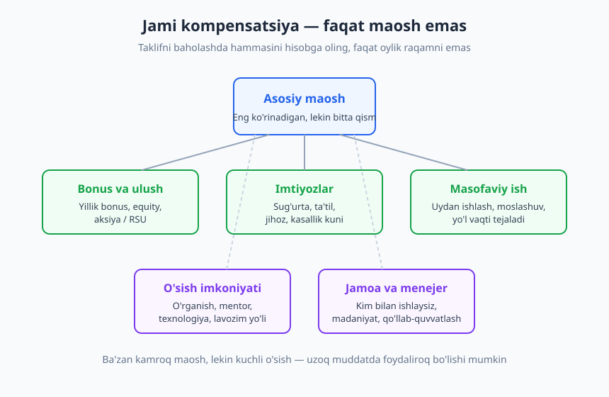
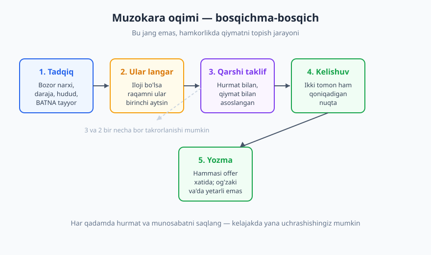
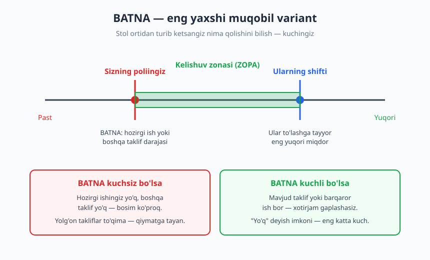

# 28 — Maosh muzokarasi va ish taklifini baholash

[⬅️ Oldingi: 27 — Behavioral intervyu va STAR metodi](./27-behavioral-intervyu-star.md) · [🏠 README](./README.md) · [Keyingi: 29 — Networking, shaxsiy brend va jamoa ➡️](./29-networking-shaxsiy-brend.md)

---

> **Bu bobda:** Intervyudan o'tdingiz, taklif keldi — endi eng ko'p e'tibordan chetda qoladigan ko'nikma boshlanadi: **muzokara**. Ko'p dasturchi birinchi raqamni shartsiz qabul qiladi va katta qiymatni yo'qotadi. Biz taklifni to'liq (faqat maosh emas) baholashni, o'z bozor narxingizni tadqiq qilishni, **BATNA** (eng yaxshi muqobil variant — Roger Fisher va William Ury) tushunchasini, hurmatli qarshi taklif yozishni va kelishuvni yozma rasmiylashtirishni o'rganamiz.
>
> **Halollik / Eslatma:** Muzokara — manipulyatsiya emas, **adolatli qiymatni topish** jarayoni. Maqsad ish beruvchini aldash emas; sizning hissangizga mos haqni so'rash. Aniq maosh raqamlari bermaymiz — ular bozor va vaqt bilan tez eskiradi. O'rniga har qanday bozorda (O'zbekiston, xalqaro, masofaviy) ishlaydigan **printsip va metodologiyaga** urg'u beramiz.

---

## Nega ko'pchilik muzokara qilmaydi (va nega bu xato)

Tasavvur qiling: oylar davomida o'rgandingiz, portfolio qurdingiz, intervyudan o'tdingiz. Va nihoyat taklif keldi. Birinchi his — yengillik va minnatdorchilik. "Voy, meni qabul qilishdi!" Aynan shu daqiqada ko'pchilik bitta jumla aytadi: **"Ha, roziman, qachondan boshlay?"** — va shu bilan muzokara imkonini abadiy yopadi.

Bu xato uchta noto'g'ri ishonchdan kelib chiqadi:

- **"Muzokara qilsam, taklifni qaytarib olishadi."** Real hayotda bu deyarli hech qachon bo'lmaydi. Kompaniya sizni tanlash uchun haftalar sarfladi (intervyu, vaqt, qaror). Hurmatli savol bergani uchun taklifni bekor qilish — ular uchun ham yo'qotish. Eng yomon javob — "kechirasiz, byudjet shu" — bu sizni dastlabki raqamdan past qilmaydi.
- **"Muzokara — qo'pol, ochko'zlik."** Aksincha. Ish beruvchilar muzokarani **kutadi** — bu jarayonning normal qismi. Tajribali menejer dastlabki raqamni ko'pincha biroz pastroq qo'yadi, aynan kelishuv uchun joy qoldirib. Muzokara qilmasangiz, o'sha qoldirilgan joy shunchaki yo'qoladi.
- **"Men hali junior'man, so'rashga haqqim yo'q."** Sizning darajangiz emas, **bozor qiymatingiz** muhim. Junior ham bozor narxiga ega; ko'p junior aynan ma'lumotsizligi tufayli o'z narxidan past ishlaydi.

Raqamni ko'taring: agar siz har gal birinchi taklifni qabul qilsangiz, butun karyerangiz davomida yig'ilib katta farq paydo bo'ladi — chunki keyingi oshirishlar va keyingi ishdagi maosh ko'pincha **joriy maoshingizdan** hisoblanadi. Bir martalik past start — yillar bo'yi quyiroq traektoriya.

> **Diqqat:** Muzokara — bir martalik voqea emas, **ko'nikma**. Birinchi safar noqulay bo'ladi — bu normal. Lekin bu o'rganiladigan, mashq qilinadigan narsa. Bu bob sizga skript va ramka beradi; qolganini amaliyot hal qiladi.

---

## 1. Taklifni to'liq baholash — bu faqat maosh emas

Eng birinchi va eng ko'p qilinadigan xato — taklifni **bitta raqamga** qisqartirish. "Ular 800, bular 1000 berdi, demak ikkinchisi yaxshiroq." Bu — sayoz qarash. Ish taklifi — bu **jami kompensatsiya paketi**, va maosh uning faqat bir qismi.

Taklifni baholaganda quyidagi qatlamlarning **hammasini** ko'rib chiqing:

| Qatlam | Nima kiradi | Nega muhim |
|---|---|---|
| **Asosiy maosh** | Oylik / yillik qat'iy to'lov | Eng ko'rinadigan, lekin bitta qism |
| **O'zgaruvchan to'lov** | Yillik bonus, equity (ulush/aksiya), RSU | Ba'zan maoshdan ko'p; lekin "kafolatsiz" |
| **Imtiyozlar** | Sug'urta, ta'til kunlari, jihoz, kasallik kuni, ovqat | Pulga aylantirilsa katta qiymat |
| **Ish rejimi** | Masofaviy / gibrid / ofis, moslashuvchan soat | Vaqt va sifat — ham pul, ham hayot |
| **O'sish** | O'rganish byudjeti, mentor, texnologiya, lavozim yo'li | Uzoq muddatli karyera qiymati |
| **Jamoa va menejer** | Kim bilan ishlaysiz, madaniyat, qo'llab-quvvatlash | Kundalik baxt va o'sish shu yerda |

### Equity va bonus — ehtiyot bo'ling

Startaplar ko'pincha "biz sizga ulush (equity) beramiz" deydi. Bu qiziq, lekin **xayoliy pul emas**. Aniqlashtiring: necha foiz? Qiymatlash qancha? Vesting (egalik huquqi qachon to'liq o'tadi) jadvali qanday? Ko'pincha ulush 4 yilda asta-sekin ochiladi va kompaniya muvaffaqiyatsiz bo'lsa — qiymati nol. Equity — **lotereya bileti emas, lekin kafolat ham emas**. Uni "ehtimoliy qo'shimcha" deb baholang, asosiy maosh o'rniga emas.

### Maosh emas, qiymat: anti-misol vs misol

❌ **Sayoz qiyos:**
> "A kompaniya 1200, B kompaniya 1000 berdi. A'ni olaman."

✅ **To'liq qiyos:**
> "A — 1200, lekin ofisga har kuni borish (kuniga 2 soat yo'l), eski texnologiya, o'rganish byudjeti yo'q. B — 1000, lekin to'liq masofaviy (2 soat/kun tejaladi), mentor biriktirilgan, yangi stack, yillik o'rganish byudjeti bor. B'da men 2 yilda kuchliroq dasturchi bo'laman — bu kelajakdagi maoshim demak."

Ba'zan **kamroq maosh, lekin ko'proq o'sish** — uzoq muddatda aqlli tanlov. Ayniqsa karyera boshida: 22 yoshda 200 dollar farq emas, balki **siz qanchalik tez o'sishingiz** muhimroq. Lekin buni ham mutlaqlashtirmang — "tajriba uchun bepul ishla" degan ekspluatatsiya emas. Qiymat ikki tomonlama bo'lishi shart.

> **Eslatma:** Taklif kelganda **shoshmang**. "Rahmat, men buni jiddiy ko'rib chiqaman va [2-3 kun] ichida javob beraman" deyish — to'liq normal va professional. Hech bir yaxshi kompaniya sizni "hozir ha yoki yo'q" deb siqmaydi. Agar siqsa — bu o'zi qizil bayroq. Yozma taklifni sovuq aql bilan, stol ustida o'qing.

---

## 2. Bozor narxini bilish — ma'lumotsiz muzokara qilolmaysiz

Muzokaraning poydevori — **o'z qiymatingizni bilish**. Agar bozor narxini bilmasangiz, na ishonch bilan raqam ayta olasiz, na taklif adolatli ekanini baholay olasiz. Ma'lumot — bu kuch; ma'lumotsizlik — bu zaiflik.

### Nimani tadqiq qilish kerak

Sizning bozor qiymatingiz bir nechta o'lchovga bog'liq:

- **Daraja:** junior / middle / senior — bu nom emas, mas'uliyat va mustaqillik darajasi.
- **Stack va talab:** ba'zi texnologiyalar bozorda kamyob va shuning uchun qimmat.
- **Hudud:** Toshkent, viloyat, yoki masofaviy. Bu juda muhim farq.
- **Mijoz turi:** mahalliy kompaniya, xalqaro autsorsing, yoki to'g'ridan-to'g'ri xorijiy ish beruvchi.

> **Trade-off:** Masofaviy ish bozor narxini tubdan o'zgartiradi. Agar siz O'zbekistondan turib xorijiy kompaniyaga (yoki global freelance bozoriga) ishlasangiz, qiymatingiz mahalliy narxga emas, **global narxga** yaqinlashadi. Bu O'zbekistonlik dasturchining eng katta imkoniyatlaridan biri — kodingizni hamma joydan ko'rsa bo'ladi. Lekin shuni ham bilingki, global mijoz global raqobat ham demak: sifat va muloqot global darajada bo'lishi kerak.

### Ma'lumotni qayerdan olasiz

- **Hamkasblar va tarmoq.** Eng ishonchli manba — sohada ishlaydigan, sizga o'xshash darajadagi odamlarning real raqamlari. Bu noqulay mavzu, lekin do'stona, maxfiy so'rov ko'p narsani ochadi. (Networking haqida [29-bobda](./29-networking-shaxsiy-brend.md) gaplashamiz.)
- **Maosh so'rovnomalari va ochiq ma'lumot.** Mahalliy IT-jamoalar (Telegram guruhlari, hamjamiyat so'rovnomalari) va xalqaro platformalar (umumiy diapazon beradigan saytlar) — diapazon haqida tasavvur beradi. Bitta manbaga ishonmang, bir nechtasini kesishtiring.
- **Vakansiyalarning o'zi.** Maoshi ko'rsatilgan e'lonlarni kuzating — ular bozorni ko'rsatadi. Hatto raqamsiz e'lon ham talab darajasini ochadi.
- **Recruiter'lar.** Texnik recruiter'lar ko'p kompaniyaning raqamini biladi. Ulardan "shu daraja uchun bozorda diapazon qanday?" deb so'rashingiz mumkin.

Maqsad — bitta aniq raqam emas, balki **diapazon** chiqarish: "Mening darajam, stack'im va hududim uchun bozor X dan Y gacha." Shu diapazon — sizning langar va asosingiz.

> **Diqqat:** O'z narxingizni baholaganda ikki tomonlama xatodan saqlaning. **Imposter sindromi** (2-bob) sizni o'z qiymatingizni pasaytirishga undaydi — "men buncha pulga arzimayman". **Dunning-Kruger** esa aksincha — kam tajribali odam o'zini ortiqcha baholashi mumkin. Halol, ma'lumotga asoslangan o'rta nuqtani toping. Tarmoqdagi hamkasblar bu yerda oyna vazifasini bajaradi.

---

## 3. Muzokara asoslari — langar, raqam va ohang

Endi taktikaga o'tamiz. Lekin yodda tuting: muzokara — bu **hamkorlik, jang emas** ([16-bob](./16-nizolarni-hal-qilish.md) ohangiga tayaning). Maqsad — ikki tomon ham qoniqadigan kelishuvga yetish, "g'alaba" qozonish emas.

### Raqamni birinchi aytmang (iloji bo'lsa)

Klassik maslahat: imkon bo'lsa, **birinchi raqamni ish beruvchi aytsin**. Sababi oddiy — agar siz birinchi aytsangiz va past raqam aytsangiz, o'zingizni o'zingiz cheklab qo'yasiz; ular bundan ko'p to'lashga tayyor bo'lgan bo'lishi mumkin. Agar ular birinchi aytsa, sizda ko'proq ma'lumot bo'ladi.

Shuning uchun "Maosh kutilmangiz qancha?" degan savolga to'g'ridan-to'g'ri raqam bilan javob berishdan oldin urinib ko'ring:

> **Recruiter:** Maosh bo'yicha kutilmangiz qancha?
>
> **Siz:** Bu lavozim uchun belgilangan byudjet diapazoningiz qanday? Men umumiy paketni ko'rib, mos kelishimni baholamoqchiman.

Ko'pincha ular diapazonni aytadi. Agar **majburlasa** ("biz avval sizdan eshitamiz"), tayyor bo'lgan tadqiqotingizga tayanib **diapazon** bering, bitta raqam emas:

> **Siz:** Mening darajam va bu stack bo'yicha qilgan tadqiqotimga ko'ra, men [X]–[Y] diapazonida o'ylayapman. Aniq raqam to'liq paketga — masofaviy ish, o'sish, imtiyozlarga — ham bog'liq.

### Langar (anchoring) effekti

**Langar (anchoring)** — birinchi aytilgan raqam butun muzokarani o'ziga tortadi. Agar ular 800 desa, butun suhbat 800 atrofida aylanadi; agar siz 1200 desangiz, atrof 1200 ga suriladi. Shuning uchun diapazon berishga majbur bo'lsangiz, **realistik, lekin o'z tomoningizga biroz yuqori** langar qo'ying — lekin bozordan uzilib ketmang (asossiz raqam sizni jiddiy emas qiladi).

### Ohang — hurmat va qiziqish

Muzokara — qarama-qarshilik emas, **birgalikda yechim qidirish**. Ohangingiz buni aks ettirsin:

✅ **Yaxshi:**
> "Bu taklif meni juda qiziqtiradi va men jamoaga qo'shilishni xohlayman. Maosh raqami ustida birga ishlay olamizmi? Men [Y] ni ko'proq mos deb o'ylardim, sabablarini tushuntiraman."

❌ **Yomon:**
> "Bu juda kam. Men kamida [Y] olishim kerak, aks holda boshqa joyga ketaman."

Birinchisi — eshikni ochiq qoldiradi, hamkorlik ohangida. Ikkinchisi — ultimatum, devorga suyaydi. Ikkalasi ham bir xil raqamni so'rashi mumkin, lekin **ohang natijani belgilaydi**.

> **Eslatma:** "Hurmatli" degani "yumshoq va voz kechadigan" degani emas. Siz qat'iy bo'lishingiz mumkin — lekin odamga emas, **muammoga qattiq** bo'ling. "Men sizni hurmat qilaman, lekin bu raqam mening bozor tadqiqotimga mos kelmaydi" — bu ham hurmatli, ham qat'iy.

---

## 4. BATNA va dalil — kuchingiz qayerdan keladi

Muzokaradagi eng kuchli tushuncha — **BATNA**. Bu atama Roger Fisher va William Ury'ning 1981-yilda chiqqan klassik kitobi **"Getting to Yes"** dan keladi va "Best Alternative To a Negotiated Agreement" — ya'ni **kelishuvga erishilmasa, eng yaxshi muqobil variantingiz** degani.

### Nega BATNA muhim

Sizning muzokaradagi kuchingiz so'zlaringizdan emas, **stoldan turib ketsangiz nima qolishidan** keladi. Agar sizda boshqa taklif yoki barqaror hozirgi ish bo'lsa — siz xotirjam gaplasha olasiz, chunki "yo'q" deyish imkoningiz bor. Agar sizda hech narsa bo'lmasa — siz har qanday raqamga rozi bo'lishga moyilsiz, va buni ish beruvchi ham seziladi.

- **Kuchli BATNA:** boshqa kompaniyaning taklifi yoki yaxshi joriy ishingiz. Bu sizga "yo'q" deyish erkinligini beradi — eng katta kuch.
- **Kuchsiz BATNA:** ishsizsiz, boshqa taklif yo'q, ijara to'lash kerak. Bunda bosim sizda. Lekin bu **yolg'on takliflar to'qishingiz** kerak degani emas (pastga qarang).

BATNA tushunchasi bilan bog'liq yana bir g'oya — **ZOPA (Zone of Possible Agreement)**, ya'ni kelishuv zonasi: sizning eng past qabul qiladigan nuqtangiz bilan ularning eng yuqori to'lay oladigan nuqtasi orasidagi maydon. Muzokara — shu zona ichida ikki tomonga ham maqbul nuqtani topish.

### Yolg'on taklif to'qimang

Bu yerda halollik chizig'i bor. Ba'zilar "menda boshqa taklif bor" deb **yolg'on** aytishni maslahat beradi. Buni qilmang:

- **Bu blöf ochilishi mumkin** — "Qaysi kompaniya? Qancha berdi?" deb so'rashsa, qiynalasiz.
- **Ishonchni buzadi** — agar fosh bo'lsa, butun munosabat zaharlanadi.
- **Kerak emas** — siz haqiqiy qiymatingizga tayanib, yolg'onsiz ham kuchli muzokara qila olasiz.

Agar haqiqiy boshqa taklifingiz bo'lsa — uni hurmat bilan eslatishingiz mumkin. Bo'lmasa — qiymatga tayaning.

### Talabingizni QIYMAT bilan asoslang, ehtiyoj bilan emas

Bu — eng muhim printsiplardan biri. Maoshni so'raganda **nega arzishingizni** ko'rsating, shaxsiy ehtiyojingizni emas.

❌ **Ehtiyojga asoslangan (zaif):**
> "Menga ko'proq kerak, chunki ijara qimmatlashdi va mashina olmoqchiman."

✅ **Qiymatga asoslangan (kuchli):**
> "Men oldingi ishimda shunga o'xshash tizimni noldan qurganman va jamoaga tezda foyda keltira oldim. Bu rolda men shu tajribani olib kelaman — shuning uchun [Y] adolatli deb o'ylayman."

Ish beruvchi sizning ijarangiz haqida qayg'urmaydi — bu qattiq, lekin haqiqat. U **siz qanday muammoni hal qilishingiz** haqida qayg'uradi. Talabingizni jamoaga qo'shadigan qiymatingiz bilan bog'lang. Bu yerda [27-bobdagi STAR hikoyalaringiz](./27-behavioral-intervyu-star.md) va [25-bobdagi portfoliongiz](./25-cv-portfolio-github.md) dalil bo'lib xizmat qiladi.

> **Diqqat:** Maoshdan tashqarini ham muzokara qiling. Agar maosh diapazonida joy qolmasa, boshqa qatlamlarni so'rang: qo'shimcha ta'til, masofaviy ish kunlari, o'rganish byudjeti, lavozim/oshirish jadvali, ishni boshlash sanasi, signing bonus. Ko'pincha maosh qat'iy bo'lsa ham bu qatlamlarda moslashuv bor.

---

## 5. Yozma kelishuv va qaror — og'zaki va'da yetarli emas

Muzokara kelishuvga yetdi — endi eng oxirgi, lekin hayotiy qadam: **hammasini yozma rasmiylashtirish**.

### Og'zaki va'da — va'da emas

> **Diqqat:** "Menejer aytdiki, 6 oydan keyin oshiramiz" — bu **hech narsa**. Og'zaki va'dani isbotlab bo'lmaydi; odamlar almashadi, esdan chiqadi, inkor qilinadi. Muzokarada kelishilgan **har bir narsa** — maosh, bonus, oshirish jadvali, masofaviy rejim, boshlash sanasi — yozma taklif xatida (offer letter) yoki shartnomada bo'lishi shart.

Agar muzokarada og'zaki biror narsa va'da qilingan bo'lsa, uni xushmuomalalik bilan yozma so'rang:

> **Siz:** Suhbatimiz uchun rahmat, hammasi juda aniq bo'ldi. Kelishganimizdek — [maosh], [masofaviy rejim] va 6 oydan keyingi ko'rib chiqish — bularni rasmiy taklif xatiga kiritib yuborsangiz, men ko'rib imzolayman.

### Qarshi taklif (counteroffer) jarayoni

Muzokara ko'pincha bir necha qadamdan iborat: ular taklif beradi → siz qarshi taklif berasiz → ular javob beradi. Bu **savdolashish emas**, hamkorlikda yaqinlashish. Qarshi taklif berganda:

1. **Minnatdorchilik** bilan boshlang ("taklif uchun rahmat, men juda qiziqyapman").
2. **Aniq raqam yoki diapazon** bering, asossiz "ko'proq" emas.
3. **Asosingizni** qisqa ayting (qiymat, bozor tadqiqoti).
4. **Eshikni ochiq** qoldiring ("birga yechim topishimizga ishonaman").

### Qabul qilish va rad etish — ikkalasi ham hurmat bilan

**Qabul qilsangiz** — yozma tasdiqni oling, minnatdorchilik bildiring, va boshlash tafsilotlarini aniqlang.

**Rad etsangiz** — bu eng muhim daqiqalardan biri. IT — kichik dunyo; bugun rad etgan kompaniya ertaga sizning hamkasbingiz, mijozingiz yoki keyingi ish beruvchingiz bo'lishi mumkin. Hech qachon ko'priklarni yoqmang:

> **Siz:** Taklif va sarflagan vaqtingiz uchun chin dildan minnatdorman. Ko'p o'ylab, hozir men boshqa imkoniyatni tanladim — bu qaror oson bo'lmadi. Jamoangiz bilan tanishganimdan mamnunman va kelajakda yo'limiz yana kesishishi mumkinligiga umid qilaman.

Bu — munosabatni saqlaydi. Networking nuqtai nazaridan ([29-bob](./29-networking-shaxsiy-brend.md)), bugun hurmat bilan rad etilgan kompaniya — ertangi imkoniyat.

> **Eslatma:** "Exploding offer" — ya'ni "24 soat ichida javob bering yoki taklif yo'qoladi" — bosimga e'tibor bering. Adolatli kompaniya o'ylash uchun oqilona vaqt beradi (odatda bir necha kun). Sun'iy shoshilinch — ko'pincha sizni muzokara qilmaslikka majburlash taktikasi. Xotirjamlik bilan "menga ko'rib chiqish uchun [N] kun kerak" deyishga haqlisiz.

---

## Asosiy g'oyalar (bobni qisqacha)

- **Muzokara — kutilgan, normal jarayon**, manipulyatsiya emas. Birinchi taklifni so'zsiz qabul qilish — ko'p dasturchining eng qimmat xatosi; raqam karyera bo'ylab yig'iladi.
- Taklifni **jami kompensatsiya** sifatida baholang: maosh + bonus/equity + imtiyoz + ish rejimi + **o'sish** + jamoa. Ba'zan kamroq maosh, ko'proq o'sish — aqlliroq.
- **Bozor narxingizni biling** — ma'lumotsiz muzokara qilolmaysiz. Daraja, stack, hudud, masofaviy=global. Bir nechta manbani kesishtiring va **diapazon** chiqaring.
- **Raqamni iloji boricha ular birinchi aytsin** (langar effekti); majbur bo'lsangiz tadqiqotga asoslangan diapazon bering. Ohang — **hurmat va hamkorlik**, ultimatum emas.
- **BATNA** (Fisher va Ury, "Getting to Yes") — kuchingiz stoldan turib ketsangiz nima qolishidan keladi. Yolg'on taklif to'qimang; talabingizni **qiymat bilan asoslang, ehtiyoj bilan emas**.
- **Hamma narsa yozma bo'lsin** — og'zaki va'da va'da emas. Qarshi taklifni minnatdorchilik bilan bering; qabul yoki rad — ikkalasi ham hurmat bilan, **munosabatni saqlab**.

## Mashqlar

### Oson

**1-mashq.** O'zingizning hozirgi (yoki maqsad qilgan) darajangiz uchun jami kompensatsiyaning oltita qatlamini (maosh, bonus/equity, imtiyoz, ish rejimi, o'sish, jamoa) ro'yxatga oling. Har biri uchun "men uchun bu qanchalik muhim?" deb 1–5 ball qo'ying. Qaysi qatlamlar siz uchun maoshdan ham muhimroq?

**2-mashq.** "Maosh kutilmangiz qancha?" degan savolga **raqam aytmasdan** javob beradigan ikkita jumlani yozing — biri diapazon so'raydigan, biri to'liq paketga ishora qiladigan.

### O'rta

**3-mashq.** O'z bozor narxingizni aniqlash uchun **tadqiqot rejasi** tuzing: 4 ta aniq manba (kim/qayer), har biridan nima so'rashingiz, va natijani qanday diapazonga yig'ishingiz. Rejani bajaring va diapazon chiqaring.

**4-mashq.** Qo'lingizda ikkita farazli taklif bor (o'zingiz tuzing): A — yuqori maosh, eski stack, ofis; B — past maosh, masofaviy, mentor va o'sish byudjeti. Ularni **jami kompensatsiya** bo'yicha jadval qilib taqqoslang va o'z prioritetlaringiz asosida tanlovingizni asoslang.

### Qiyin

**5-mashq.** To'liq **qarshi taklif skriptini** yozing (3–5 jumla): minnatdorchilik → aniq diapazon → qiymatga asoslangan dalil (o'zingizning real tajribangizdan) → ochiq eshik. Keyin uni ovoz chiqarib mashq qiling yoki do'stingiz bilan rol-o'ynang.

**6-mashq.** Quyidagi vaziyatni hal qiling: kompaniya "byudjet qat'iy, maoshni oshira olmaymiz" dedi, lekin siz taklifni biroz pastroq deb hisoblaysiz. Maoshdan **tashqari** muzokara qilish mumkin bo'lgan kamida 4 ta qatlamni va har biri uchun bitta jumlali hurmatli so'rovni yozing.

Yechimlar / Namunaviy yondashuvlar

### 1-mashq yechimi
Namuna (junior, masofaviy maqsad qilgan): Maosh — 4 (asosiy, lekin yagona emas), Bonus/equity — 2 (junior'da kam ahamiyat), Imtiyoz — 3, Ish rejimi — 5 (masofaviy men uchun hayotiy), O'sish — 5 (mentor va yangi stack karyeramni belgilaydi), Jamoa — 4. Bu odamda **o'sish va masofaviy ish maoshdan ham muhim** — demak u 1000 dollar + kuchli mentor taklifini 1200 dollar + yolg'iz ishlash taklifidan ustun qo'yishi mantiqiy. Maqsad — o'z prioritetingizni avvaldan bilish, toki taklif kelganda hissiyot bilan emas, reja bilan tanlang.

### 2-mashq yechimi
Diapazon so'raydigan: *"Bu rol uchun byudjet diapazoningiz qanday? Men umumiy paketni ko'rib mos kelishimni baholamoqchiman."* Paketga ishora qiladigan: *"Aniq raqam to'liq paketga — masofaviy rejim, o'sish va imtiyozlarga — ham bog'liq, shuning uchun avval umumiy taklifni eshitsam yaxshi bo'lardi."* Ikkalasi ham to'pni hurmat bilan ularning tomoniga qaytaradi va sizga ma'lumot ustunligini beradi.

### 3-mashq yechimi
Namunaviy reja: (1) **Tarmoq** — sizga o'xshash darajadagi 2-3 hamkasbdan maxfiy, do'stona so'rov ("og'ir bo'lmasa, shu daraja uchun bozor qanaqa?"). (2) **Hamjamiyat so'rovnomalari** — mahalliy IT-jamoa maosh so'rovnomalari (diapazon uchun). (3) **Vakansiyalar** — maoshi ko'rsatilgan e'lonlarni 2 hafta kuzatish. (4) **Recruiter** — "shu daraja/stack uchun bozor diapazoni qanday?" Natija: 4 manbani kesishtirib bitta diapazon — masalan "mening profilim uchun bozor X–Y", o'rta nuqta esa sizning langaringiz. Muhim: bitta manbaga ishonmang, kesishtiring.

### 4-mashq yechimi
Jadval namunasi (raqamsiz, nisbiy): A — maosh **yuqori**, stack **eski** (o'rganish past), rejim **ofis** (yo'l vaqti yo'qoladi), o'sish **past**. B — maosh **past**, stack **yangi**, rejim **masofaviy** (vaqt tejaladi), o'sish **yuqori** (mentor + byudjet). Agar siz karyera boshida bo'lsangiz va o'sishga ustunlik bersangiz — B mantiqiy, chunki 2 yilda B sizni kuchliroq (va shu sabab qimmatroq) dasturchi qiladi. Agar moliyaviy bosim katta yoki stack sizga muhim emas bo'lsa — A. **To'g'ri javob yo'q** — muhimi, qarorni prioritetingizga bog'lab asoslash, faqat bitta raqamga emas.

### 5-mashq yechimi
Namuna: *"Taklif uchun katta rahmat — men jamoangizga qo'shilishni chin dildan xohlayman. Maosh bo'yicha esa men [X–Y] diapazonida o'ylagandim. Buning sababi: oldingi loyihada men shunga o'xshash tizimni noldan qurib, jamoaga tez foyda keltirgan edim, va bu rolda ham o'sha tajribani olib kelaman. Raqam ustida birga ishlashimizga ishonaman — bu men uchun to'g'ri qaror bo'lishini xohlayman."* Diqqat: minnatdorchilik, qiymatga asoslangan dalil (ehtiyoj emas), hamkorlik ohangi, ochiq eshik.

### 6-mashq yechimi
Maoshdan tashqari muzokara qilinadigan qatlamlar va namunaviy so'rovlar: (1) **Ta'til** — *"Maosh qat'iy bo'lsa, qo'shimcha bir necha ta'til kuni ko'rib chiqilishi mumkinmi?"* (2) **Masofaviy kunlar** — *"Haftada 2 kun masofaviy ishlash imkoni bormi? Bu men uchun katta qiymat."* (3) **O'rganish byudjeti** — *"Yillik kurs/konferensiya byudjeti haqida kelishsak bo'ladimi?"* (4) **Oshirish jadvali** — *"6 oydan keyin rasmiy ko'rib chiqish va oshirishni yozma kelishuvga kiritsak bo'ladimi?"* (5) **Signing bonus** yoki **boshlash sanasi**. Asosiy g'oya: maosh qotib qolsa ham, paketning boshqa qatlamlarida deyarli har doim moslashuv bor — va ularni **yozma** oling.

---

[⬅️ Oldingi: 27 — Behavioral intervyu va STAR metodi](./27-behavioral-intervyu-star.md) · [🏠 README](./README.md) · [Keyingi: 29 — Networking, shaxsiy brend va jamoa ➡️](./29-networking-shaxsiy-brend.md)
