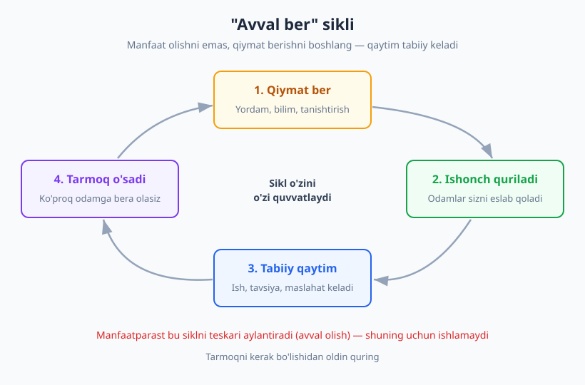
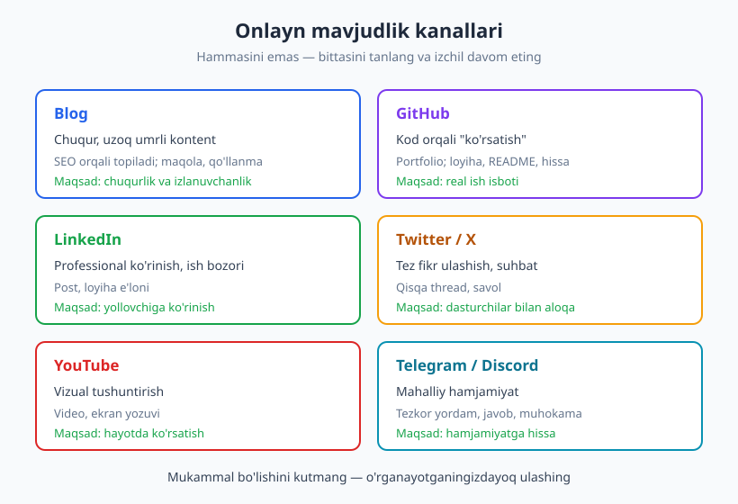
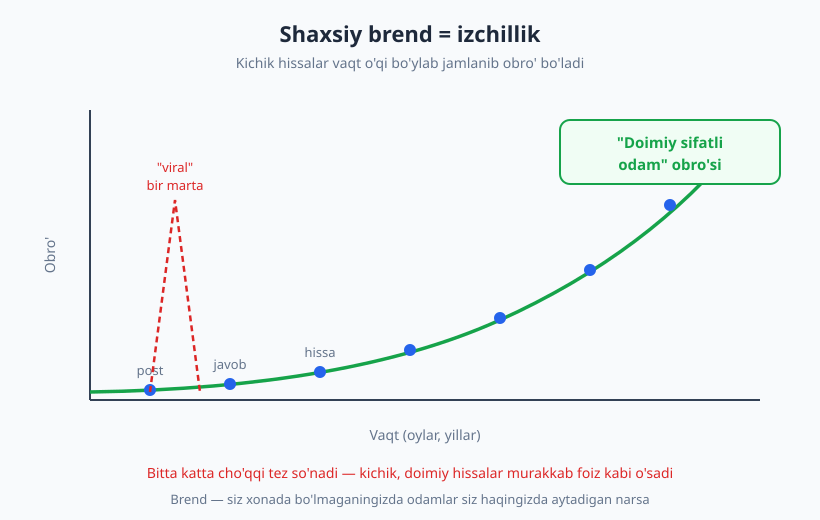

# 29 — Networking, shaxsiy brend va jamoa

[⬅️ Oldingi: 28 — Maosh muzokarasi va ish taklifini baholash](./28-maosh-muzokara.md) · [🏠 README](./README.md) · [Keyingi: 30 — Junior'dan senior va lead'gacha: o'sish va mentorlik ➡️](./30-junior-senior-lead-mentorlik.md)

---

> **Bu bobda:** karyerangizdagi imkoniyatlarning ko'pi ochiq ariza orqali emas, balki **aloqa** orqali keladi. Networking nima ekanini (va nima EMASligini) ko'ramiz, "avval ber" (give first) tamoyilini, ochiq o'rganishni (learning in public), hamjamiyatga hissa qo'shishni va shaxsiy brend — ya'ni sizning obro'ingiz — qanday tabiiy quriladiganini o'rganamiz.
>
> **Halollik / Eslatma:** networking — bir kechada bo'ladigan hodisa emas. Bu ekilgan urug': bugun ekkaningiz bir yildan keyin meva beradi. Tezkor natija va'da qiluvchi "10 ta ulanish so'rovi yubor" maslahatlaridan ehtiyot bo'ling — bu yerda **izchillik va samimiylik** ishlaydi, hiyla emas.

---

## Networking nima va nima EMAS

So'rang odamdan: "networking nima?" — ko'pchilik yuzini burishtiradi. Ko'z oldiga konferensiyada vizitka tarqatib yuruvchi, har bir suhbatni "bu menga nima beradi?" deb o'lchovchi, faqat kerak bo'lganda yozadigan manfaatparast odam keladi. Agar networking shu bo'lsa — undan jirkanish to'g'ri. Lekin bu networking emas, bu uning **karikaturasi**.

Haqiqiy networking — bu oddiygina **professional munosabatlar to'rini** qurish va saqlash. Ya'ni: o'z sohangizda odamlarni tanish, ular bilan samimiy aloqada bo'lish, bir-biringizga foyda berish. Bu yangi narsa emas — odamlar minglab yillardan beri "tanish-bilish" orqali ish topadi, savdo qiladi, o'rganadi. Yangi bo'lgani — internet buni masshtablashtirdi: endi qishloqdagi dasturchi ham Twitter/X orqali San-Fransiskodagi muhandis bilan gaplasha oladi.

Farqni aniq qo'yaylik:

| ❌ Networking EMAS (manfaatparastlik) | ✅ Networking (samimiy munosabat) |
|---|---|
| Faqat ish kerak bo'lganda yozasiz | Doimiy, sababsiz aloqada bo'lasiz |
| "Menga nima berasiz?" | "Men senga qanday yordam beraman?" |
| Vizitka soni — maqsad | Bir necha chuqur munosabat — maqsad |
| Olishga shoshilasiz | Avval berasiz, qaytim haqida o'ylamaysiz |
| Munosabat — vosita | Munosabat — qadriyat |
| Yuzaki, transaksion | Vaqt bilan chuqurlashadi, ishonchga asoslanadi |

> **Eslatma:** introvert odamlar ko'pincha "men networking qila olmayman, men shovqinli tadbirlarni yoqtirmayman" deb o'ylaydi. Lekin networking shovqinli xona degani emas. Bitta odamga foydali blog yozish, GitHub'da kimningdir issue'siga sifatli javob berish, mentoringizga minnatdorlik xati yozish — bularning hammasi networking, va aynan ular ko'pincha "vizitka tarqatish"dan kuchliroq ishlaydi.

### "Avval ber" (give first) tamoyili

Networkingning yuragida bitta oddiy g'oya yotadi: **avval bering, keyin so'rang.** Bu g'oya turli mualliflarda turlicha nomlanadi — Adam Grant uni "Give and Take" kitobida "beruvchilar" (givers) va "oluvchilar" (takers) farqi orqali ko'rsatadi: uzoq muddatda doimiy beruvchilar ko'proq yutadi. Keith Ferrazzi esa "Never Eat Alone" kitobida munosabatlarni "kerak bo'lguncha kutmasdan" qurishni targ'ib qiladi.

Mantiq sodda: agar siz odamlarga doimiy ravishda qiymat bersangiz — bilim ulashasiz, kimnidir tanishtirasiz, vaqtingizni ajratasiz — atrofingizda **ishonch** to'planadi. Va bir kun sizga yordam kerak bo'lganda (ish, tavsiya, maslahat), bu ishonch tabiiy ravishda qaytim beradi. Hech kim "men senga A bergandim, endi B ber" deb hisob ochmaydi — bu hisob-kitob emas. Bu shunchaki: odamlar yaxshilik qilgan odamga yaxshilik qilishni xohlaydi.

Eng muhim qoida: **tarmoqni kerak bo'lishidan oldin quring.** Ishsiz qolganingizda "menga ish kerak" deb yozish kech. Munosabatlar oylar, yillar davomida quriladi. Bugun, ishingiz joyida turganda, sababsiz yaxshilik qila boshlang.

Dasturchi uchun "berish" qanday ko'rinadi?

- Hamkasbingiz qoqilib turgan bug'ni hal qilishga 20 daqiqa ajratdingiz.
- Telegram guruhda kimningdir savoliga to'liq, foydali javob yozdingiz.
- O'zingiz o'rgangan qiyin mavzu bo'yicha blog yozdingiz — bu ham "berish".
- Ikki tanishingizni bir-biriga tanishtirdingiz ("sen backend qidiryapsan, mana bu odam aynan shu ustida ishlaydi").
- Birovning ochiq kodli loyihasiga (open source) kichik tuzatish yubordingiz.

Bu siklning go'zalligi — u **o'zini o'zi quvvatlaydi**. Qiymat berasiz → ishonch quriladi → tarmoq kengayadi → ko'proq odamga qiymat bera olasiz → ko'proq ishonch. Manfaatparast esa bu siklni teskari aylantirmoqchi bo'ladi (avval olish) va shuning uchun u hech qachon ishlamaydi.

## Ochiq o'rganish va kontent yaratish

Eng kuchli, eng arzon va eng kam ishlatiladigan networking vositasi — **ochiq o'rganish** (learning in public). Bu atamani dasturchilar orasida Shawn "swyx" Wang ommalashtirgan. G'oya: o'rganayotgan narsangizni **yopiq daftarda emas, ochiqda** hujjatlang. Blog yozing, Twitter/X'da nima o'rganganingizni ulashing, LinkedIn'da loyihangiz haqida post qiling, YouTube'da tushuntiring.

Bu uchunchi bobda ko'rgan o'rganish g'oyalari bilan chambarchas bog'liq — [03-bob: O'rganishni o'rganish](./03-organishni-organish.md)da ko'rganimizdek, biror narsani **boshqaga tushuntirish** (Feynman texnikasi) uni o'zingiz mustahkamlashning eng kuchli usuli. Ochiq o'rganish shuni networking bilan birlashtiradi.

Nega bu ishlaydi? Uchta foyda bir vaqtda keladi:

1. **O'zingiz mustahkamlaysiz.** Biror narsani yozib tushuntirish uchun siz uni chinakam tushunishingiz kerak. Yarim tushunilgan mavzu yozayotganda "teshik"larini ko'rsatadi.
2. **Ko'rinarli bo'lasiz.** Sizning ismingiz o'sha mavzu bilan bog'lanadi. Kimdir "React hook'lari" bo'yicha qidirsa va sizning maqolangizni topsa — siz endi unga "begona" emas.
3. **Boshqalarga foyda berasiz.** Siz hozir o'rganayotgan narsa — kimningdir ertaga qidirayotgan javobi. Sizdan bir qadam orqada turgan odam uchun siz eng yaxshi o'qituvchisiz, chunki muammoni hali eslaysiz.

> **Diqqat — mukammallik tuzog'i:** ochiq o'rganishni boshlamaydigan odamlarning sababini so'rang — deyarli har doim bitta javob: "men hali yetarlicha bilmayman" yoki "mendan yaxshi yozadiganlar bor". Bu tuzoq. Siz **ekspert bo'lish uchun** yozmaysiz — siz **o'rganayotganingiz uchun** yozasiz. "Bugun men X'ni qanday tushunganim" degan kamtarin post "X bo'yicha to'liq qo'llanma"dan ko'ra ko'proq odamga foyda beradi. Mukammal bo'lishini kutsangiz — hech qachon boshlamaysiz.

### Kontentni qayerda ulashish

Har bir kanal o'z maqsadiga xizmat qiladi — hammasini bir vaqtda qilish shart emas. Bittasini tanlang va izchil davom eting.

| Kanal | Eng yaxshi nima uchun | Format |
|---|---|---|
| **Blog (shaxsiy/Hashnode/dev.to)** | Chuqur, uzoq umrli kontent; SEO orqali topiladi | Maqola, qo'llanma |
| **GitHub** | Kod orqali "ko'rsatish"; portfolio | Loyiha, README, hissa |
| **LinkedIn** | Professional ko'rinish, ish bozori | Post, loyiha e'loni |
| **Twitter/X** | Tez fikr ulashish, dasturchilar bilan suhbat | Qisqa thread, savol |
| **YouTube** | Vizual tushuntirish, hayotda ko'rsatish | Video, ekran yozuvi |
| **Telegram/Discord** | Mahalliy hamjamiyat, tezkor yordam | Javob, muhokama |

Boshlash uchun amaliy maslahat: bitta texnik post yozing. Sarlavhasi — yaqinda hal qilgan bitta muammoyingiz: "X xatosini qanday topdim va tuzatdim". Tuzilishi sodda: muammo nima edi → nima sinab ko'rdim → nima ishladi → saboq. Bu 30 daqiqalik ish, lekin u **ko'rinadi** va **qoladi**.

## Hamjamiyatga hissa qo'shish

Networking — yolg'iz emas, hamjamiyat ichida bo'lish. Va hamjamiyatga eng yaxshi kirish yo'li — **iste'mol qilish emas, hissa qo'shish.** Faqat o'qiydigan, hech narsa bermaydigan odam ko'rinmas qoladi. Bir marta foydali narsa bersangiz — esda qolasiz.

Hissa qo'shishning bir necha yo'li bor:

**Ochiq kodli (open source) loyihalarga hissa.** Bu eng kuchli signallardan biri — chunki sizning ishingiz ochiq, real va boshqalar tomonidan ko'riladi. Boshlash uchun katta loyihaning yadrosini yozish shart emas: hujjatdagi xatoni tuzatish, kichik bug'ni hal qilish, test qo'shish — hammasi qiymat. Git va pull request jarayoni bilan tanish bo'lsangiz (bu [Git & GitHub kitobida](../git-github/README.md) batafsil), birinchi hissangizni bugun qila olasiz. "good first issue" yorlig'i bilan belgilangan issue'lardan boshlang.

**Savollarga javob berish.** Stack Overflow, Telegram va Discord guruhlari, Reddit — bularda har kuni odamlar qoqilib turadi. Siz allaqachon bilgan narsa kimning uchundir qutqaruvchi javob. Sifatli, sabrli javob yozing (savol berishning teskarisi — [12-bob: Faol tinglash va to'g'ri savol berish](./12-tinglash-savol-berish.md)da ko'rgan tinglash ko'nikmasi bu yerda ham kerak). Vaqt o'tib siz "o'sha har doim yordam beradigan odam" bo'lasiz.

**Meetup va konferensiyalarda qatnashish — yoki gapirish.** Tadbirlarga borish — yangi odamlar bilan tanishishning to'g'ridan-to'g'ri yo'li. Lekin bir qadam oldinga: **o'zingiz gapiring.** Meetupda 10 daqiqalik "lightning talk" qilish — siz haqingizda bir yillik blog yozishdan ko'ra tezroq ko'rinish beradi. Hayajondan qo'rqsangiz, bu tabiiy — [11-bob: Og'zaki muloqot, taqdimot va public speaking](./11-ogzaki-taqdimot-public-speaking.md)da hayajonni boshqarish va taqdimot tuzishni ko'rganmiz. Birinchi marta qiyin, ikkinchi marta osonroq.

**Mahalliy hamjamiyatni qurish.** O'zbekistonda dasturchilar hamjamiyati tez o'smoqda — Telegram guruhlari, mahalliy meetuplar, universitet klublari. Bu yerda imkoniyat ikki tomonlama: siz o'rganasiz, va siz qura olasiz. Agar shahringizda biror tilning meetupi bo'lmasa — uni boshlang. Tashkilotchi bo'lish — eng kuchli networking, chunki siz markazda turasiz va hamma sizni biladi.

> **Trade-off:** hamjamiyatga hissa qo'shish vaqt oladi, va u darhol ish yoki pul bermaydi. Bu — uzoq muddatli sarmoya. Agar siz "bu menga bu hafta nima beradi?" deb o'lchasangiz, to'xtaysiz. Ammo bir yildan keyin orqaga qarasangiz — eng yaxshi imkoniyatlaringiz aynan shu hissalardan o'sib chiqqanini ko'rasiz.

## Shaxsiy brend = sizning obro'ingiz

"Shaxsiy brend" so'zi ko'pchilikni cho'chitadi — u sun'iy, "influencer"larga xos, yasama imidj yaratishdek tuyuladi. Keling, bu tushunchani tozalaymiz.

**Shaxsiy brend — bu siz haqingizda yaratgan yolg'on emas. Bu odamlar sizni qanday bilishlari.** Amazon asoschisi Jeff Bezos'ning mashhur ta'rifi bor: *"Brend — siz xonada bo'lmaganingizda odamlar siz haqingizda aytadigan narsa."* Demak, sizning brendingiz allaqachon mavjud — siz uni qursangiz ham, qurmasangiz ham. Savol shu: u **tasodifanmi** shakllanadi, yoki siz uni **ongli ravishda** shakllantirasizmi?

Yaxshi dasturchi brendi yasama narsalardan emas, real fazilatlardan quriladi:

- **Ishonchli:** so'z berdimi — bajaradi. Deadline'ni hurmat qiladi.
- **Yordamchi:** boshqalarni ko'taradi, bilimni ushlab qolmaydi.
- **Malakali:** ishini sifatli qiladi, o'rganishda davom etadi.
- **Halol:** bilmasligini tan oladi, xatosini yashirmaydi.

E'tibor bering — bularning hammasi bu kitobning oldingi boblarida ko'rgan ko'nikmalar. Sizning brendingiz — bu sizning **xulq-atvoringizning yig'indisi**. Marketing emas.

### Izchillik (consistency) — brendning yagona qurilish materiali

Brend bir kunda qurilmaydi. U **izchillik** orqali, vaqt o'tib jamlanadi. Bitta ajoyib blog post sizni mashhur qilmaydi. Lekin ikki yil davomida har oy bitta foydali narsa ulashsangiz — odamlar sizni "o'sha doimiy sifatli kontent beradigan odam" deb taniydi.

Bu — qiziq matematika. Bitta katta harakat (bir marta viral bo'lish) — kamdan-kam va nazoratsiz. Lekin kichik, doimiy harakatlar (har hafta bitta yaxshi javob, har oy bitta post) jamlanib, **murakkab foiz** kabi o'sadi. Obro' shunday quriladi: tomchi-tomchi, lekin to'xtovsiz.

### Onlayn iz (digital footprint) — ehtiyot bo'ling

Brendning ikkinchi tomoni — **digital footprint**, ya'ni internetda qoldirgan izingiz. Yollovchi (recruiter) sizni ko'rishdan oldin Google qiladi, GitHub profilingizni ochadi, Twitter'ingizni varaqlaydi. Bu — bu kitobning [25-bob: CV, portfolio va GitHub profil](./25-cv-portfolio-github.md) bilan to'g'ridan-to'g'ri bog'liq: CV'ingiz ajoyib bo'lib, lekin onlayn izingiz qarama-qarshi bo'lsa, ishonch buziladi.

Amaliy qoidalar:

- **Professional va shaxsiyni ajrating** (yoki ikkalasini ham toza tuting). Twitter'da do'stlaringizga hazil yozsangiz — eslang, yollovchi ham o'qiydi.
- **Toksik bo'lmang.** Onlayn janjal, kibr, boshqalarni kamsitish — bularning hammasi qoladi va sizning brendingizga zarar yetkazadi. Internet hech narsani unutmaydi.
- **Eski izni audit qiling.** 5 yil oldin yozgan o'ylamasdan post hozir sizga tegishli emas bo'lishi mumkin — lekin u hali ham ochiq. Vaqti-vaqti bilan o'zingizni Google qiling.

> **Diqqat:** maqsad — qo'rqoq va sun'iy bo'lish emas. Siz hali ham o'zingiz bo'lishingiz mumkin va kerak. Maqsad — **professional kontekstda sizni baholaydigan odam ko'rganda xijolat tortmasligingiz.** Oddiy mezon: "buni bo'lajak rahbarim ko'rsa, men noqulay bo'lamanmi?"

## Munosabatlarni saqlash

Tarmoq qurish — yarim ish. Ikkinchi yarmi — uni **saqlash**. Ko'p odam tanishadi, keyin aloqani uzadi va bir yildan keyin "menga ish kerak" deb yozadi. Bu sovuq va noqulay. Munosabat — o'simlik kabi: vaqti-vaqti bilan sug'orilmasa, qurib qoladi.

Saqlashning oddiy odatlari:

- **Sababsiz aloqada bo'ling.** Yangi yil bilan tabriklang. Tanishingizning loyihasi haqida xabar ko'rsangiz — "ajoyib ish!" deb yozing. Foydali maqola topsangiz — "bu sizga qiziq bo'lishi mumkin" deb yuboring. Bu daqiqalar, lekin ular munosabatni tirik tutadi.
- **Minnatdorlikni ifoda eting.** Kimdir sizga yordam berdimi — rahmat ayting, va eslab qoling. Mentoringizga, sizni tavsiya qilgan odamga, qiyin paytda yordam berganga — minnatdorlik xati yozing. Bu kichik harakat, lekin u kuchli iz qoldiradi.
- **Yordam berganni qaytaring.** Kimdir sizga ish topishda yordam berdimi — vaqti kelganda siz ham boshqaga yordam bering. Bu "qarz to'lash" emas, bu siklni davom ettirish.
- **Mentor va hamkasblar bilan aloqani uzmang.** Ish joyini almashtirsangiz — eski hamkasblaringiz endi turli kompaniyalarga tarqaydi, va bu sizning tarmog'ingizni **kengaytiradi**. Ular bilan aloqada qoling.

### Sifat > son

Eng muhim xulosa: **kichik, sifatli tarmoq yuzlab yuzaki "ulanish"dan kuchliroq.** LinkedIn'da 5000 ta ulanishingiz bo'lishi mumkin — lekin agar ulardan hech biri sizni shaxsan bilmasa, ular sizni tavsiya qilmaydi. Aksincha, 20 ta odam sizni chinakam biladi, ishonadi va hurmat qiladi — ana shu 20 odam sizning karyerangizni o'zgartiradi.

Robin Dunbar nomli antropolog topgan "Dunbar soni" bor — inson ongli ravishda taxminan 150 ta barqaror munosabatni saqlay oladi, va undan ham yaqinrog'i — atigi 15 chamasi. Demak, hammasini "ushlab qolaman" deb urinmang. Bir necha chuqur, samimiy munosabatga sarmoya qiling. Ana shular — sizning haqiqiy tarmog'ingiz.

| Yuzaki tarmoq | Chuqur tarmoq |
|---|---|
| 5000 ulanish, 0 suhbat | 30 odam, doimiy aloqa |
| Sizni eslamaydilar | Sizni tavsiya qiladilar |
| Faqat raqam | Haqiqiy ishonch |
| Kerak bo'lganda javob yo'q | Kerak bo'lganda yelka tutadi |

## Asosiy g'oyalar (bobni qisqacha)

- **Networking — manfaatparastlik emas, samimiy munosabat.** Maqsad — "menga nima berasiz" emas, balki o'zaro qiymat va ishonch. Tarmoqni **kerak bo'lishidan oldin** quring.
- **"Avval ber" (give first):** doimiy ravishda qiymat bering — yordam, bilim, tanishtirish — va qaytim tabiiy ravishda, hisob-kitobsiz keladi.
- **Ochiq o'rganish (learning in public)** uchta foydani birlashtiradi: o'zingiz mustahkamlaysiz, ko'rinarli bo'lasiz, boshqalarga foyda berasiz. **Mukammal bo'lishini kutmang** — o'rganayotganingizdayoq yozing.
- **Hamjamiyatga iste'molchi emas, hissa qo'shuvchi sifatida kiring:** open source, savollarga javob, meetupda qatnashish yoki gapirish, mahalliy hamjamiyat qurish.
- **Shaxsiy brend = obro'**, yasama imidj emas. U real fazilatlardan (ishonchli, yordamchi, malakali, halol) va **izchillikdan** quriladi. Onlayn izingizni professional tuting.
- **Munosabatni saqlang:** sababsiz aloqa, minnatdorlik, yordamni qaytarish. **Sifat songa qaraganda muhimroq** — bir necha chuqur munosabat yuzlab yuzaki ulanishdan kuchli.

## Mashqlar

### Oson

**1-mashq.** O'zingizning hozirgi tarmog'ingizni yozib chiqing: oxirgi 6 oyda professional kontekstda gaplashgan 10 ta odamni ro'yxatlang (hamkasb, o'qituvchi, online tanish, mentor). Har biri yonida belgilang: oxirgi marta qachon aloqada bo'lgansiz? Kim bilan munosabat "qurib qolgan"?

**2-mashq.** Bitta texnik post uchun tezkor reja yozing. Faqat ikki narsa: (a) **mavzu** — yaqinda o'zingiz hal qilgan yoki o'rgangan bitta aniq narsa; (b) **tuzilish** — 4 ta sarlavha (masalan: muammo / sinab ko'rganlarim / yechim / saboq). Hozir yozmang — faqat skeletni tuzing.

### O'rta

**3-mashq.** Bitta hamjamiyat hissasini rejalashtiring va sanasini qo'ying. Tanlang: (a) ishlatadigan ochiq kodli loyihangizning "good first issue"laridan birini topish; yoki (b) Telegram/Discord guruhda kutub turgan bitta savolga to'liq javob yozish; yoki (c) meetupda 10 daqiqalik talk mavzusini tanlash. Aniq qadamni va deadline'ni yozing.

**4-mashq.** O'zingizning onlayn izingizni audit qiling. Inkognito rejimda ismingizni Google qiling, GitHub va LinkedIn profilingizni "begona ko'zi bilan" ko'ring. Uchta savolga javob bering: (1) yollovchi birinchi nimani ko'radi? (2) qarama-qarshi yoki noqulay narsa bormi? (3) eng kuchli signal qaysi, va u yetarlicha ko'rinadimi?

### Qiyin

**5-mashq.** "Avval ber" eksperimenti: keyingi bir hafta davomida har kuni bittadan **so'ramasdan beriladigan** yordam qiling va yozib boring. Misol: bir savolga javob, bir tanishtirish, bir foydali havola, bir mehnatga "ajoyib ish" deyish. Hafta oxirida tahlil qiling: qaysi biri eng tabiiy bo'ldi? Bu sizning aloqalaringizni qanday o'zgartirdi?

**6-mashq.** Keyingi 12 oy uchun "shaxsiy brend" rejasini yozing. Uchta qism: (1) **Pozitsiya** — qaysi mavzu bilan tanilishni xohlaysiz? (2) **Kanal** — bitta asosiy kanal tanlang (blog/Twitter/YouTube/GitHub) va izchillik ritmini belgilang (masalan: oyiga 1 post). (3) **Birinchi qadam** — keyingi 7 kunda qiladigan aniq harakat. Real, kichik va davom ettiriladigan bo'lsin.

Yechimlar / Namunaviy yondashuvlar

### 1-mashq yechimi
Bu mashqning asosiy maqsadi — tarmog'ingiz "ko'rinmas" emasligini anglash. Ko'pchilik ro'yxat tuzgach hayron qoladi: "qarib qolgan" munosabatlar ko'p bo'ladi — bir yil oldin yaxshi gaplashgan, keyin yo'qolgan tanishlar. Bu normal. Endi 2-3 tasini tanlang va bu hafta sababsiz qisqa xabar yozing ("yaqinda sizning X loyihangiz esimga tushdi, qalaysiz?"). Maqsad — tarmoqni "qayta sug'orish". Hech qanday "to'g'ri raqam" yo'q — agar 10 ta odam topa olmasangiz ham, bu sizga networkingni qaerdan boshlashni ko'rsatadi.

### 2-mashq yechimi
Namunaviy skelet: **Mavzu** — "Docker konteynerda environment o'zgaruvchilari nega ko'rinmadi". **Tuzilish:** (1) Muammo — lokalda ishladi, konteynerda yo'q. (2) Sinab ko'rganlarim — `.env` faylini tekshirish, `docker logs`. (3) Yechim — `.env` build vaqtida emas, runtime'da kerak edi; `env_file` ni `docker-compose`ga qo'shdim. (4) Saboq — build-time va run-time o'zgaruvchilari farqi. Diqqat: mukammal bo'lishi shart emas. Aynan shu "kichik va aniq" post — "Docker bo'yicha to'liq qo'llanma"dan ko'ra ko'proq o'qiladi, chunki u bitta aniq muammoni hal qiladi.

### 3-mashq yechimi
Eng muhimi — **mavhum niyatni aniq qadamga aylantirish.** "Open source'ga hissa qo'shaman" — niyat. "Shanba kuni soat 10da `axios` repo'sining good-first-issue yorlig'ini ochib, bittasini tanlayman va PR yuboraman" — bu reja. Deadline va aniq harakat bo'lmasa, hissa "bir kuni" qoladi va hech qachon kelmaydi. Agar ikkilanayotgan bo'lsangiz, eng past to'siqlisini tanlang: ko'pincha bu — guruhda bitta savolga sifatli javob yozish, chunki uni hoziroq qila olasiz.

### 4-mashq yechimi
Ko'p odam bu auditdan keyin ikki narsani topadi: (1) GitHub profili bo'sh yoki tashlandiq — README yo'q, pin qilingan loyiha yo'q (buni [25-bob](./25-cv-portfolio-github.md) bo'yicha tuzating); (2) eski, professional bo'lmagan post yoki rasm. Yechim — o'chirish shart emas, lekin eng ko'rinadigan joyni (GitHub bio, LinkedIn sarlavhasi, profil rasmi) toza va aniq qiling. "Eng kuchli signal" odatda — real loyiha yoki real hissa; agar u ko'rinmasa, uni yuzaga chiqaring (pin, sarlavha, qisqacha tavsif).

### 5-mashq yechimi
Bu mashqning maqsadi — "berish" qiyin emas, balki **odat** ekanini his qilish. Ko'pchilik birinchi 2-3 kunni qiynalib o'tkazadi (nima beraman?), keyin ko'zlari ochiladi: kun davomida "berish" imkoniyatlari to'lib yotibdi — faqat ilgari sezmaganman. Eng tabiiy bo'lgani odatda — javob berish yoki tanishtirish, chunki ular sizning mavjud bilimingizga tayanadi. Saboq: networking alohida "vazifa" emas, u sizning kundalik xulqingizning bir qismi bo'lishi mumkin. Kuch ham talab qilmaydi — faqat e'tibor.

### 6-mashq yechimi
Namunaviy reja: **Pozitsiya** — "frontend performance optimizatsiyasi" (tor, aniq mavzu, "umuman frontend"dan yaxshi). **Kanal** — shaxsiy blog + LinkedIn'da e'lon, ritm: oyiga 1 post. **Birinchi qadam** — bu hafta blog platformasini sozlash (dev.to bepul) va 2-mashqdagi skeletni to'liq postga aylantirish. Eng keng tarqalgan xato — pozitsiyani juda keng olish ("men hamma narsa haqida yozaman") va ritmni juda baland qo'yish ("har kuni post"). Tor pozitsiya + barqaror, kamtarin ritm = izchillik = brend. Esda tuting: bitta viral post emas, ikki yillik tomchi-tomchi hissa obro' quradi.

---

[⬅️ Oldingi: 28 — Maosh muzokarasi va ish taklifini baholash](./28-maosh-muzokara.md) · [🏠 README](./README.md) · [Keyingi: 30 — Junior'dan senior va lead'gacha: o'sish va mentorlik ➡️](./30-junior-senior-lead-mentorlik.md)
