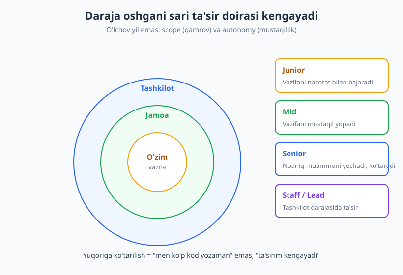
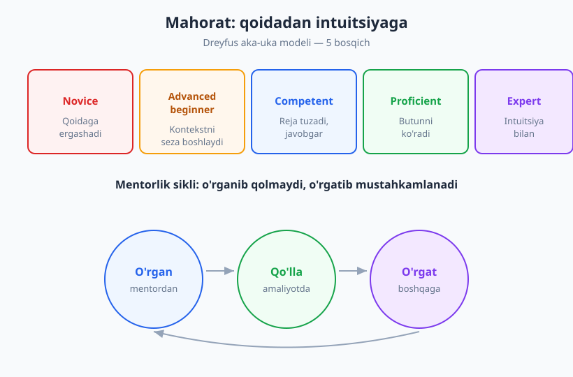
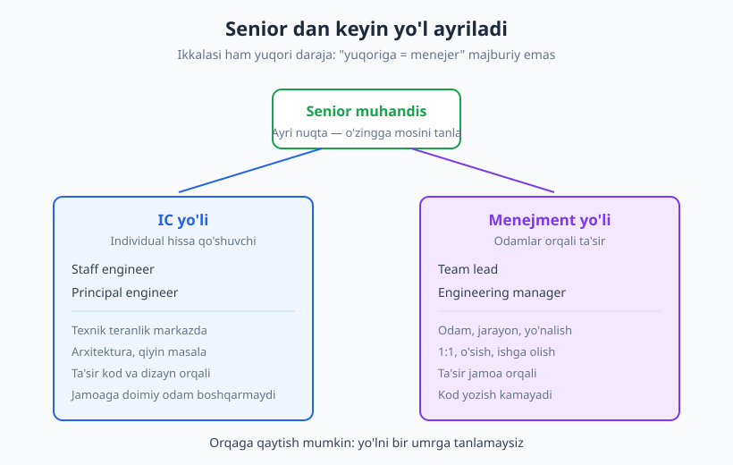

# 30 — Junior'dan senior va lead'gacha: o'sish va mentorlik

[⬅️ Oldingi: 29 — Networking, shaxsiy brend va jamoa](./29-networking-shaxsiy-brend.md) · [🏠 README](./README.md)

---

> **Bu bobda:** karyera darajalari (junior, mid, senior, staff, lead) aslida nimani anglatishini ko'ramiz — yil emas, balki **ta'sir doirasi (scope)** va **mustaqillik (autonomy)**. Dreyfus aka-uka mahorat modeli, IC va menejment yo'llarining ayriligi, hamda mentorlikni — ham olishni, ham berishni — o'rganasiz. Va nihoyat, butun kitobni bog'laymiz.
>
> **Halollik / Eslatma:** "Junior" yoki "senior" so'zining ta'rifi kompaniyadan kompaniyaga farq qiladi — universal standart yo'q. Bu bobdagi ramkalar o'sish yo'nalishini ko'rsatadi, lekin sizning kompaniyangizdagi konkret tartib (level rubric) bilan solishtiring. Darajaga "sakrab" o'tib bo'lmaydi — u har kungi izchil amaliyotning natijasi.

---

## Darajalar aslida nima o'lchaydi

Yangi dasturchilar ko'pincha darajani **tajriba yili** bilan o'lchaydi: "men 2 yil ishladim, demak endi mid bo'lishim kerak". Bu xato. Vaqt — faqat *imkoniyat*, kafolat emas. Bir odam 5 yilda bir xil vazifani 5 marta takrorlashi, boshqasi esa 2 yilda chuqur o'sishi mumkin.

Darajani aniqroq tasvirlaydigan ikki o'lcham bor:

- **Ta'sir doirasi (scope)** — sizning ishingiz qancha keng joyga ta'sir qiladi? Bitta vazifagami, butun jamoagami, yoki tashkilotgami?
- **Mustaqillik (autonomy)** — sizga qancha nazorat kerak? Har qadamda yo'l-yo'riq kerakmi, yoki noaniq muammoni o'zingiz olib boshdan oyoq yopa olasizmi?

Bu ikki o'lcham bo'yicha darajalarni shunday tushunish mumkin:

| Daraja | Ta'sir doirasi | Mustaqillik |
|---|---|---|
| **Junior** | Bitta aniq vazifa | Nazorat va yo'l-yo'riq bilan ishlaydi |
| **Mid** | Bitta xususiyat / komponent | Vazifani mustaqil yopadi |
| **Senior** | Jamoa, bir nechta tizim | Noaniq muammoni o'zi aniqlab yechadi |
| **Staff / Principal** | Bir nechta jamoa, yo'nalish | Tashkilot darajasida muammo qo'yadi |
| **Lead / Manager** | Jamoa va odamlar | Jamoa orqali natija beradi |

Mana konkret farq. Bitta vazifa — "tugma bosilganda foydalanuvchi profili saqlansin" — beriladi:

- **Junior:** vazifani bajaradi. "Qanday qilaman?" deb so'raydi, namunaga qaraydi, code review'da tuzatishlar oladi. Bu **mutlaqo normal va kerakli bosqich** — junior o'rganish uchun bor.
- **Mid:** vazifani o'zi yopadi. Edge case'larni o'ylaydi, test yozadi, savol kam beradi. Bajarish ishonchli.
- **Senior:** to'xtab so'raydi: "Bu tugma kerakmi o'zi? Profil avtomatik saqlansa yaxshiroq emasmi? Bu boshqa ekranlarga qanday ta'sir qiladi?" Ya'ni **to'g'ri ishni tanlash** — kodni yozishdan oldingi qaror.

E'tibor bering: junior "qanday qilaman?" deb so'raydi (how), senior esa "nima qilamiz va nega?" deb so'raydi (what/why). Bu siljish — butun karyera o'sishining markazi.

> **Diqqat:** "Yuqori daraja = ko'proq kod yozish" degan tasavvur noto'g'ri. Aksincha, daraja oshgani sari shaxsan yozgan kodingiz **kamayadi**, lekin sizning qarorlaringiz va ta'siringiz orqali jamoa yozadigan kodning **sifati va to'g'riligi oshadi**.

---

## Nima o'zgaradi: o'zimdan jamoaga, jamoadan tashkilotga

Karyera o'sishini bitta jumla bilan aytsa bo'ladi: **ta'sir doirangiz "o'zim"dan "jamoa"ga, undan "tashkilot"ga kengayadi.** Diagrammadagi konsentrik doiralar aynan shu — har bir keyingi qatlam avvalgisini o'rab oladi.

### Senior'ni nima ajratib turadi

Ko'p odam o'ylaydi: senior = "juda yaxshi kod yozadigan odam". Texnik teranlik kerak, ammo yetarli emas. Senior'ni uch narsa ajratadi:

1. **Texnik teranlik** — chuqur biladi, qiyin muammoni yechadi. Bu poydevor.
2. **Mulohaza (judgment)** — qachon mukammal yechim kerak, qachon "yetarli darajada yaxshi" bas qiladi; qaysi trade-off'ni tanlash. Bu — kontekstga qarab to'g'ri qarorni ko'ra bilish. (Texnik qaror va trade-off mantig'ini [23-bobda](./23-texnik-qaror-tradeoff.md) batafsil ko'rgan edik.)
3. **Force multiplier (kuch ko'paytiruvchi)** — boshqalarni samaraliroq qiladi. Yaxshi code review, aniq hujjat, to'g'ri arxitektura qarori — bularning hammasi sizning shaxsiy hissangizdan **ko'p marta** kattaroq ta'sir beradi, chunki ular butun jamoaning ishini tezlashtiradi.

Force multiplier g'oyasi muhim: agar siz haftada o'z ishingizni 10% tezlatsangiz — bu kichik foyda. Lekin agar siz besh kishilik jamoaning har birini 10% tezlatsangiz — bu sizning shaxsiy hissangizdan besh barobar ko'p. Senior'lik aynan shu o'tish: **o'z mahsuldorligingizdan boshqalarning mahsuldorligiga.**

### Soft skill aynan shu nuqtada hal qiladi

Mana bu kitobning markaziy g'oyasi, oxirgi bobda yana takrorlanadi: junior darajada texnik mahorat asosiy cheklov. Lekin daraja oshgani sari, cheklov **texnikadan insonga** siljiydi.

Senior bo'lish uchun siz qaroringizni tushuntirishingiz (muloqot — [09-bob](./09-texnik-muloqot-asoslari.md) va undan keyingi muloqot boblari), boshqalarga foydali feedback berishingiz ([13-bob](./13-feedback-berish-qabul.md)), nizoni hal qilishingiz, jamoada psixologik xavfsizlik yaratishingiz kerak. Eng kuchli muhandislarni texnik daho qilmaydi — ularni jamoasini **ko'tara olishi** qiladi.

Boshqacha aytganda: T-shaped dasturchining ([01-bob](./01-skills-nima-t-shaped.md)) **gorizontal chizig'i** — soft skill — aynan senior darajada o'z samarasini to'liq beradi. Bu kitobda o'rgangan har bir narsa shu nuqtada birlashadi.

> **Eslatma:** Hozir junior bo'lsangiz, bularning hammasidan bezovta bo'lmang. Junior'ning vazifasi — yaxshi ijrochi bo'lish va tez o'rganish. Senior xatti-harakatlari sekin-asta, tabiiy ravishda quriladi. Ularni hozirdan *kuzatib* boring, lekin o'zingizdan bir kunda hammasini talab qilmang.

---

## Mahorat egallash bosqichlari: Dreyfus modeli

Daraja — tashkilotning sizga bergan unvoni. **Mahorat** esa — sizning ichingizdagi haqiqiy ko'nikma darajangiz. Bu ikkisi har doim ham mos kelmaydi. Mahoratning qanday o'sishini eng yaxshi tushuntiradigan ramka — **Dreyfus aka-uka mahorat egallash modeli** (Stuart va Hubert Dreyfus, 1980-yillarda taklif qilingan).

Model besh bosqichni ajratadi:

| Bosqich | Xulq-atvor |
|---|---|
| **Novice (yangi boshlovchi)** | Qoidalarga qat'iy ergashadi. Kontekstni ko'rmaydi, har qadamga ko'rsatma kerak. |
| **Advanced beginner** | Vaziyatni qisman sezadi. Ba'zi qoidalarni o'zi qo'llaydi, lekin hali to'liq tasavvur yo'q. |
| **Competent (qobil)** | Reja tuza oladi, javobgarlikni his qiladi. Muhimni muhim emasdan ajratadi. |
| **Proficient (mahoratli)** | Vaziyatni **butun** holida ko'radi. Naqshlarni sezadi, tajribaga tayanadi. |
| **Expert (ekspert)** | Intuitsiya bilan ishlaydi. Qoida haqida o'ylamaydi — shunchaki "to'g'ri"sini biladi. |

Modelning eng muhim saboqi: **mahorat qoidaga amaldan intuitsiyaga o'tishdir.** Yangi boshlovchi qoidalarga muhtoj ("if shu bo'lsa, buni qil"). Ekspert esa qoidalardan oshib ketgan — u shunchaki naqshni taniydi va to'g'ri harakat qiladi, ko'pincha nima uchun ekanini darrov tushuntira ham olmaydi.

Bundan ikkita amaliy xulosa chiqadi:

1. **Yangi boshlovchiga aniq qoida bering, eksperga emas.** Junior'ga "shu naqshni ishlat, mana namuna" deyish foydali. Lekin senior'ga shunday desangiz — uni cheklaysiz; unga muammoni va kontekstni bering, qoidani emas. Mentorlik darajaga moslashishi kerak.
2. **O'sish chiziqli emas.** Siz bir sohada ekspert, boshqa sohada novice bo'lishingiz mumkin — bu mutlaqo normal. Yangi til, yangi domen, yangi rol — har biri sizni qaytadan "novice" qiladi. ([03-bobdagi](./03-organishni-organish.md) "learning plateau" — o'rganish tekisligi — shu yerda yana paydo bo'ladi.) Tajribali senior ham yangi sohaga kirganda kamtarlik bilan novice bo'lishni biladi — bu zaiflik emas, balki kuchli o'rganuvchining belgisi.

> **Trade-off:** Ekspert intuitsiyasi tez, lekin u **notanish vaziyatda** sizni aldashi mumkin — chunki u eski naqshlarga tayanadi. Shuning uchun eng yaxshi ekspertlar muhim qarorda intuitsiyani to'xtatib, ataylab "novice"day bosqichma-bosqich tekshiradi. Tezlik va ehtiyotkorlik orasida muvozanat.

---

## Ikki yo'l: IC va menejment

Senior darajaga yetganingizdan keyin ko'pincha yo'l ayriydi. Va bu yerda eng keng tarqalgan tushunmovchilik yashaydi: **"yuqoriga ko'tarilish = menejer bo'lish" — bu MAJBURIY EMAS.**

Ko'pchilik kompaniyada ikkita parallel karyera yo'li (dual ladder) bor:

- **IC yo'li (Individual Contributor — individual hissa qo'shuvchi):** senior → staff engineer → principal engineer. Siz odam boshqarmaysiz, lekin ta'siringiz **texnik teranlik, arxitektura va qiyin masalalarni yechish** orqali oshadi. Staff engineer butun jamoaning texnik yo'nalishiga ta'sir qiladi — odamlarga buyruq bermay turib.
- **Menejment yo'li:** senior → team lead → engineering manager. Bu yerda siz **odamlar orqali** natija berasiz: 1:1 suhbatlar, jamoa a'zolarining o'sishi, ishga olish, jarayon, yo'nalish. Kod yozish vaqtingiz keskin kamayadi.

Ikkala yo'l ham **bir xil darajada yuqori** va qadrlanadi. Principal engineer va engineering manager odatda bir xil "level"da turadi. Tanlov — sizning nimadan zavq olishingizga bog'liq:

| Savol | IC yo'liga moyillik | Menejment yo'liga moyillik |
|---|---|---|
| Sizni nima quvontiradi? | Qiyin texnik muammoni yechish | Odamlarning o'sishini ko'rish |
| Kunni qanday o'tkazgingiz keladi? | Chuqur ish, kod, dizayn | Suhbatlar, koordinatsiya |
| Nimadan charchamaysiz? | Murakkab tizimni tushunish | Boshqalarning muammosini eshitish |
| Muvaffaqiyat sizga nima? | "Men yechdim" | "Mening jamoam yechdi" |

> **Diqqat:** Bu tanlov **bir umrlik emas.** Ko'p muhandislar menejment'ga o'tib, keyin yana IC'ga qaytadi (buni "engineer/manager pendulum" deyishadi). Yo'lni tajriba qilib ko'rish — xato emas. Faqat menejment'ni "ko'tarilish" deb, IC'ni "joyida qolish" deb tushunmang — bu ikkisi **ikki xil ish**, biri ikkinchisidan ustun emas.

Agar hali bilmasangiz qaysi yo'l sizniki — bu normal. Senior bo'lguningizcha tanlash shart emas. Hozircha ikkalasidan ham bir oz tatib ko'ring: kichik mentorlik qiling (menejment ta'mi), qiyin texnik muammoni oxirigacha olib boring (IC ta'mi). Tanlov o'zi vaqt bilan oydinlashadi.

---

## Mentorlik: olish va berish

Mentorlik — o'sishning eng kuchli tezlatgichi. Va u **ikki tomonlama**: siz ham mentor topasiz, ham boshqalarga mentor bo'lasiz. Qizig'i shundaki, berish ham, olish ham — ikkalasi ham sizni o'stiradi.

### Mentor topish (olish)

Mentor — sizdan oldinroq bir yo'lni bosib o'tgan odam. U sizning xatolaringizni oldindan ko'radi va vaqtingizni tejaydi. ([03-bobda](./03-organishni-organish.md) mentor topishni ko'rgan edik — bu yerda qisqacha eslatamiz.)

Yaxshi mentorlik so'rovi — aniq va kichik. Yomon va yaxshi yondashuvni solishtiring:

> ❌ "Salom, menga mentor bo'la olasizmi?" — Bu juda katta, noaniq va majburiyat. Ko'pchilik javob bermaydi.

> ✅ "Salom, men async muloqotni yaxshilamoqchiman. Sizning RFC'laringiz juda aniq. Yarim soat ajratib, bittasini ko'rib, nima yaxshi ishlayotganini aytib bera olasizmi?" — Aniq, kichik, hurmatli.

Mentor rasmiy bo'lishi shart emas. Code review'da diqqat bilan o'qigan har bir kishi — sizning kichik mentoringiz. Maslahat so'rang, lekin keyin **harakat qiling va natijani qaytaring** — bu mentor uchun eng katta minnatdorchilik.

### Mentor bo'lish (berish)

Endi qiziq tomoni: **boshqaga o'rgatish — o'zingizni o'rgatishning eng kuchli usuli.** Feynman texnikasini eslang ([03-bob](./03-organishni-organish.md)): biror narsani tushuntirib bera olmasangiz, demak uni o'zingiz to'liq tushunmagansiz. Mentorlik sizni o'z bilimingizdagi teshiklarni topishga majbur qiladi.

Mentor bo'lish uchun senior bo'lish shart emas. Siz faqat **bir qadam oldinda** bo'lsangiz kifoya. Ikkinchi yildagi dasturchi birinchi kunidagi dasturchiga ko'p narsa o'rgata oladi — chunki u hozirgina o'sha yo'ldan o'tgan, qiyinchiliklarni yangi eslaydi.

Kichik mentorlik amaliyotlari — bular ham to'liq hisoblanadi:

- **Code review** — tuzatishni tushuntirib, "nega"sini ayting, faqat "noto'g'ri" demang. Bu o'rgatish.
- **Juftlik (pair programming)** — birga o'tirib ishlash, fikrni ovoz chiqarib aytish. Eng tez bilim uzatish.
- **Savolga sabr bilan javob** — "bu juda oddiy-ku" demaslik. Sizga oddiy bo'lgani — boshqaga yangi.

### Tech lead ko'nikmalari

Agar siz kichik bir loyihaga yoki jamoaga rahbarlik qilsangiz (tech lead), to'rt asosiy ko'nikma kerak bo'ladi:

1. **Yo'nalish berish** — "nima qilyapmiz va nega" ni aniq qilish. Jamoa adashmasligi uchun.
2. **Jamoani ko'tarish (force multiplier)** — har kim eng yaxshi ishini qila olishi uchun to'siqlarni olib tashlash. Sizning ishingiz — boshqalarni g'ildiratish.
3. **Qaror qilish** — barcha rozi bo'lmaganda ham yo'nalishni tanlash va javobgarlikni olish. "Disagree and commit" ([16-bobni](./16-nizolarni-hal-qilish.md) eslang — nizo va kelishmovchilikni hal qilish ko'nikmalari).
4. **Muloqot** — yuqoridan (menejment) jamoaga va jamoadan yuqoriga axborotni aniq uzatish. Lead — ko'prik.

Eng oson unutiladigan ko'nikma — **sabr**. Yangi odamga o'rgatish sekin. Ba'zan o'zingiz qilsangiz tezroq bo'ladi. Lekin agar har doim o'zingiz qilsangiz — jamoa o'smaydi va siz force multiplier emas, **bottleneck (tor joy)** bo'lib qolasiz. Sekin o'rgatish — uzoq muddatda eng tez yo'l.

> **Eslatma:** Mentorlik — bu boshqalarga *javob berish* emas, balki ularning *o'zi javob topishiga yordam berish*. Eng yaxshi mentor savol beradi ("Sen nima sinab ko'rding? Nima bo'lishini kutyapsan?"), darrov yechimni aytib qo'ymaydi. Bu — [12-bobdagi](./12-tinglash-savol-berish.md) faol tinglash va savol berish ko'nikmasining amaliy ko'rinishi.

---

## Yakun: yo'l davom etadi

Mana, biz oxirgi bobning oxiriga keldik. Endi orqaga bir nazar tashlaylik.

Bu kitob boshida bitta va'da bergan edik: kodning **narigi yarmi** — qanday o'ylash, gaplashish, hamkorlik qilish, vaqtni boshqarish va karyera qurish. O'ttiz bob davomida biz juda ko'p ramka ko'rib chiqdik: o'sish mentaliteti, Eisenhower matritsasi, deep work, SBI feedback, NVC, Tuckman bosqichlari, STAR, Dreyfus modeli. Lekin ramkalar — faqat **xarita**. Xarita yo'lni bosib o'tmaydi — uni siz bosib o'tasiz.

Va eng muhim haqiqat shu: **bu ko'nikmalarning hech biri "tugamaydi".** Muloqotni "o'rganib bo'lib", keyin to'xtab bo'lmaydi. Yaxshi tinglash, aniq yozish, foydali feedback berish, vaqtni boshqarish — bularning hammasi **bir umrlik mashq**. Eng kuchli senior'lar ham hali ham o'sishda davom etadi. Farq shundaki, ular o'sishni ish deb bilishadi, hodisa deb emas.

Shuning uchun sizga oxirgi maslahat — eng kichigi va eng kuchlisi: **kichik, izchil qadamlar.** Bu kitobni o'qib chiqib, ertaga hamma narsani o'zgartirishga urinmang — bu ishlamaydi. Aksincha:

- Bitta bobni tanlang — sizga hozir eng kerakli bo'lganini.
- Undan **bitta** mashqni 1–2 hafta amaliyotga qo'ying.
- Keyin keyingisiga o'ting.

Atomar odatlar mantig'i ([07-bob](./07-maqsad-odatlar.md)): har kuni 1% yaxshilanish bir yilda ulkan farqga aylanadi. Karyera — sprint emas, marafon. Va eng yaxshisi — bu marafonda yutuq egasi siz emas, balki **kim bo'lib o'sganingiz**.

Junior'dan senior'gacha bo'lgan yo'l texnik bilim bilan boshlanadi, lekin **inson bo'lib yetilish** bilan tugaydi: kamtarlik bilan o'rgan, saxiylik bilan o'rgat, sabr bilan o's. Endi navbat sizniki. Kitobni yoping va birinchi kichik qadamni bugun tashlang.

Yo'l davom etadi. Omad tilaymiz.

---

## Asosiy g'oyalar (bobni qisqacha)

- **Daraja yil bilan emas, ta'sir doirasi (scope) va mustaqillik (autonomy) bilan o'lchanadi.** Junior vazifani nazorat bilan bajaradi, senior noaniq muammoni mustaqil yechadi va boshqalarni ko'taradi.
- **Junior "qanday?" deb so'raydi, senior "nima va nega?" deb so'raydi.** O'sish — ijrodan to'g'ri ishni tanlashga siljish.
- **Senior'ni texnik teranlik + mulohaza (judgment) + force multiplier ajratadi.** Soft skill aynan shu darajada hal qiluvchi — butun kitob shu nuqtada birlashadi.
- **Dreyfus modeli:** novice'dan expertgacha o'tish — qoidaga amaldan intuitsiyaga o'tish. O'sish chiziqli emas; har yangi sohada qaytadan novice bo'lasiz.
- **IC va menejment — ikkita teng yuqori yo'l.** "Yuqoriga = menejer" majburiy emas; tanlov bir umrlik emas, o'zingizga mosini sinab ko'ring.
- **Mentorlik ikki tomonlama:** mentor topish va mentor bo'lish — ikkalasi ham o'stiradi. O'rgatish — o'rganishning eng kuchli usuli. Kichik mentorlik (review, juftlik) ham hisoblanadi.
- **Bu ko'nikmalar bir umrlik mashq.** Kichik, izchil qadamlar — bitta odat, bir necha hafta, keyin keyingisi.

## Mashqlar

### Oson

**1-mashq.** O'zingizning **joriy darajangizni** baholang. Yuqoridagi jadval (junior/mid/senior) va ikki o'lchov — scope va autonomy — bo'yicha o'zingizni qaerda ko'rasiz? Bitta jumla bilan yozing: "Men hozir vazifani ... darajada mustaqil bajaraman, ta'sirim ... gacha yetadi."

**2-mashq.** Dreyfus modelini ikki sohaga qo'llang: (a) o'zingiz eng kuchli bo'lgan bitta texnik ko'nikma, (b) o'zingiz yangi boshlagan bitta ko'nikma. Har biri uchun qaysi bosqichda (novice → expert) ekaningizni belgilang. Bir odam ham novice, ham proficient bo'lishi mumkinligini his qiling.

### O'rta

**3-mashq.** **Keyingi daraja xatti-harakatlarini** aniqlang. Hozirgi darajangizdan bir pog'ona yuqoridagi odamni (jamoangizdagi haqiqiy kishi) tanlang. U sizdan **boshqacha** qiladigan 3 ta aniq xatti-harakatni yozing (masalan: "u kod yozishdan oldin to'xtab, muammoni qayta savol qiladi"). Bularning bittasini shu hafta o'zingiz sinab ko'ring.

**4-mashq.** IC va menejment yo'llari jadvalidagi to'rt savolga halol javob bering. Javoblaringiz qaysi yo'lga moyilroq? Hech bo'lmaganda hozircha — qaysi biri sizga ko'proq quvonch keltiradi? Bu "majburiy tanlov" emasligini eslab, faqat moyillikni nomlang.

### Qiyin

**5-mashq.** **Mentorlik rejasini** tuzing — *olish* tomoni. Sizning bitta aniq o'sish maqsadingizni yozing. Keyin: kim bu sohada sizdan oldinda? Unga yuborish uchun **aniq, kichik, hurmatli** mentor so'rovini yozing (yuqoridagi ✅ namuna kabi). Real odamni tanlang va bu hafta yuboring.

**6-mashq.** **Mentorlik rejasini** tuzing — *berish* tomoni. Sizdan bir qadam orqada bo'lgan kishini toping (yangi xodim, kichik kursdoshingiz). Siz unga o'rgatishingiz mumkin bo'lgan bitta narsani aniqlang. Keyin keyingi code review yoki juftlik sessiyasida buni qanday **o'rgatish** (faqat "to'g'rilash" emas) rejasini yozing: qaysi savolni berasiz, qanday "nega"ni tushuntirasiz?

Yechimlar / Namunaviy yondashuvlar

### 1-mashq yechimi
Bu reflektiv mashq — "to'g'ri javob" yo'q, lekin halollik muhim. Namunaviy javob: "Men hozir aniq berilgan vazifani mustaqil bajaraman (mid darajaga yaqin), lekin noaniq, ochiq muammolarda hali yo'l-yo'riq kerak — bu meni junior va mid orasiga qo'yadi." Diqqat: o'zingizni past yoki yuqori baholashga emas, **aniq** baholashga harakat qiling. Imkon bo'lsa, mentoringiz yoki lead'ingizdan ham fikr so'rang — o'zini baholash ko'pincha noxolis (Dunning-Kruger).

### 2-mashq yechimi
Maqsad — "men junior" yoki "men senior" degan **yagona** yorliq xato ekanini his qilish. Misol: "SQL'da men proficient — naqshlarni intuitiv ko'raman. Lekin Kubernetes'da men hali novice — har qadamga hujjat va misol kerak." Bu normal. Eng kuchli muhandislar ham yangi sohada kamtarlik bilan novice bo'lishni biladi. Bu mashq sizni "men hamma narsani bilishim kerak" bosimidan ozod qiladi.

### 3-mashq yechimi
Namunaviy 3 xatti-harakat (senior'da ko'p uchraydigan): (1) kod yozishdan oldin "bu to'g'ri muammomi?" deb to'xtaydi; (2) qarorini hujjatlashtiradi va "nega"sini yozadi (ADR); (3) code review'da faqat xato topmay, kichik o'rgatadi. Bularni "men bilaman"dan "men qilaman"ga o'tkazish — butun mashqning maqsadi. Bittasini tanlab, shu hafta ataylab takrorlang.

### 4-mashq yechimi
Bu yerda **noto'g'ri** javob — "menejment, chunki u yuqoriroq". Bu xato tasavvur (bobni qayta o'qing). To'g'ri yondashuv — zavq manbangizni topish: agar "men yechdim" sizni quvontirsa — IC'ga moyilsiz; agar "mening jamoam yechdi va men ularga yordam berdim" quvontirsa — menejmentga. Ko'pchilik ikkalasidan ham tatib ko'rgach aniqlaydi. Hozir aniq bilmaslik — mutlaqo normal.

### 5-mashq yechimi
Kuchli so'rovning 3 belgisi: (1) **aniq** — qaysi ko'nikma; (2) **kichik** — yarim soat, bitta narsa, abadiy majburiyat emas; (3) **hurmatli** — uning vaqtini qadrlaysiz va nega aynan u ekanini aytasiz. Namuna: "Sizning ish baholashlaringiz juda aniq chiqadi. 30 daqiqa ajratib, mening keyingi baholashimni birga ko'rib, qayerda xato qilayotganimni ko'rsata olasizmi?" Yuborgandan keyin — maslahatni qo'llang va natijani qaytaring.

### 6-mashq yechimi
O'rgatish (teaching) va to'g'rilash (correcting) farqi: to'g'rilash — "bu yerda xato, mana to'g'risi". O'rgatish — "bu yerda nima bo'lishini kutyapsan? ... Yaxshi. Endi shu holatda nima bo'lar edi? ... Mana shuning uchun biz odatda buni boshqacha qilamiz". Ikkinchisi sekinroq, lekin odam **o'zi tushunadi** va keyingi safar o'zi qila oladi. Namunaviy reja: code review'da to'g'ridan-to'g'ri tuzatish o'rniga bitta yo'naltiruvchi savol bering va javobini kuting. Sabr — bu yerda eng muhim ko'nikma.

---

[⬅️ Oldingi: 29 — Networking, shaxsiy brend va jamoa](./29-networking-shaxsiy-brend.md) · [🏠 README](./README.md)
