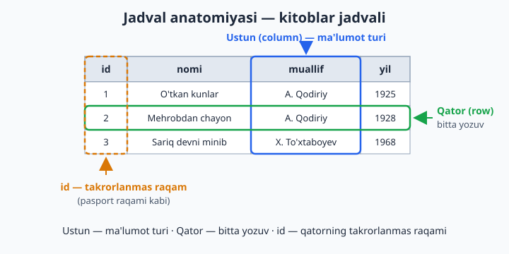
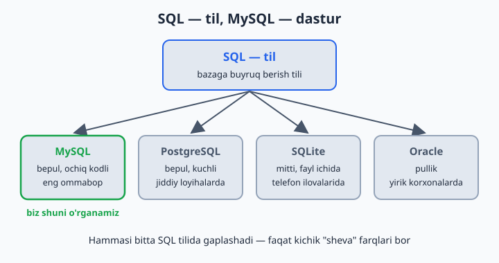
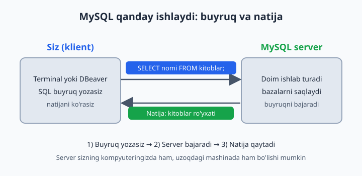

# 01 — Ma'lumotlar bazasi nima?

[🏠 README](./README.md) · [Keyingi: 02 — MySQL'ni o'rnatish va ishga tushirish ➡️](./02-mysql-ornatish.md)

> **Bu bobda:** ma'lumotlar bazasi nima va u oddiy daftar yoki Excel'dan nimasi bilan kuchli ekanini, jadval, qator, ustun va id tushunchalarini, SQL (til) bilan MySQL (dastur) o'rtasidagi farqni hamda klient-server modeli qanday ishlashini o'rganamiz.

---

## Hayotiy misol bilan boshlaymiz

Tasavvur qiling: siz mahalladagi kichik kutubxonada ishlaysiz. Sizda daftar bor, unga yozasiz:

```
Aziz Karimov — "O'tkan kunlar" kitobini oldi — 5-iyun
Malika Tosheva — "Mehrobdan chayon" oldi — 6-iyun
Aziz Karimov — kitobni qaytardi — 9-iyun
```

100 ta o'quvchi bo'lsa — daftar yetadi. 10 000 ta bo'lsa-chi? Savollar tug'iladi:

- "Aziz qaytarmagan kitoblari bormi?" — butun daftarni varaqlaysiz
- "Eng ko'p o'qilgan kitob qaysi?" — bir kunlik ish
- Ikki xodim bir vaqtda yozsa — daftar bitta, navbat kutadi

**Ma'lumotlar bazasi (database)** — mana shu daftarning kompyuterdagi aqlli versiyasi. U:

- Millionlab yozuv ichidan keraklisini **soniyaning ulushida** topadi
- Bir vaqtda minglab odamga xizmat qiladi — hech kim navbat kutmaydi
- Ma'lumotni yo'qotib qo'ymaslik uchun maxsus himoyaga ega: svet o'chib qolsa ham, saqlangan yozuv joyida qoladi

---

## Excel yetmaydimi?

"Jadval kerak bo'lsa, Excel bor-ku!" — to'g'ri savol. Kichik ro'yxatlar (50–100 qator) uchun Excel juda qulay. Lekin jiddiy ish boshlanishi bilan farq sezilib qoladi:

| Mezon | Excel | Ma'lumotlar bazasi |
|---|---|---|
| Hajm | million qator atrofida qiynala boshlaydi | yuz millionlab qator — muammosiz |
| Birga ishlash | fayl ochiq bo'lsa, boshqalar kutadi | minglab odam bir vaqtda yozadi va o'qiydi |
| Qidiruv | qator ko'paygani sari sekinlashadi | maxsus tuzilmalar tufayli soniyada topadi |
| Xatodan himoya | istalgan katakka istalgan narsa yoziladi | qoida o'rnatasiz: "yil ustuniga faqat son" |

Qisqasi: Excel — shaxsiy daftarcha, ma'lumotlar bazasi — butun kutubxonaning tartibli arxivi.

---

## Jadval, qator, ustun

Baza ichida ma'lumot **jadval** (table) ko'rinishida saqlanadi — Excel'dagi varaq kabi:

```
JADVAL: kitoblar
+----+------------------+----------------+------+
| id | nomi             | muallif        | yil  |   ← USTUNLAR (column)
+----+------------------+----------------+------+
| 1  | O'tkan kunlar    | A. Qodiriy     | 1925 |   ← QATOR (row)
| 2  | Mehrobdan chayon | A. Qodiriy     | 1928 |   ← QATOR
| 3  | Sariq devni minib| X. To'xtaboyev | 1968 |   ← QATOR
+----+------------------+----------------+------+
```

- **Ustun (column)** — ma'lumot turi: nomi, muallif, yil. Har bir ustunning o'z nomi va o'z "qoidasi" bo'ladi (masalan, yil ustuniga faqat son yoziladi)
- **Qator (row)** — bitta yozuv: bitta kitob haqidagi hamma ma'lumot
- **id** — har bir qatorning takrorlanmas raqami (pasport raqami kabi). Ismlar takrorlanishi mumkin (ikki xil Aziz Karimov bo'lishi mumkin), lekin id — hech qachon. Odatda uni baza 1 dan boshlab o'zi avtomatik beradi



Bitta bazada odatda bir nechta jadval bo'ladi: kutubxona bazasida `mualliflar`, `kitoblar`, `azolar`, `ijaralar` — har biri o'z mavzusidagi ma'lumotni saqlaydi. Aynan shu to'rt jadvalli kutubxona bazasini 3-bobda o'z qo'lingiz bilan qurasiz.

---

## SQL nima?

**SQL** (Structured Query Language — "tuzilgan so'rovlar tili"; "es-kyu-el" yoki "sikvel" deb o'qiladi) — bazaga buyruq berish **tili**. Inglizchaga juda o'xshaydi:

```sql
SELECT nomi FROM kitoblar WHERE yil > 1950;
```

So'zma-so'z: "TANLA nomi[ni] kitoblar[dan] QAYERDA yil > 1950". Tarjimasi: "1950-yildan keyin chiqqan kitoblar nomini ko'rsat".

SQL faqat o'qish uchun emas: ma'lumot **qo'shish** (`INSERT`), **o'zgartirish** (`UPDATE`) va **o'chirish** (`DELETE`) buyruqlari ham bor — hammasini keyingi boblarda birma-bir o'rganamiz.

---

## MySQL nima?

- **SQL** — til (o'zbek tili kabi)
- **MySQL** — shu tilni tushunadigan dastur (o'zbek tilida gaplashadigan odam kabi)

Bunday dasturlarning rasmiy nomi — **MBBT** (ma'lumotlar bazasini boshqarish tizimi, inglizcha DBMS). Boshqa "odamlar" ham bor: PostgreSQL, SQLite, Oracle. Hammasi SQL tilida gaplashadi — faqat kichik "sheva" farqlari bilan. MySQL — dunyodagi eng ommabop ochiq kodli (bepul) baza, biz shuni o'rganamiz.



---

## MySQL qanday ishlaydi: klient va server

MySQL kompyuterda **server** bo'lib ishlaydi — doim yoniq turadigan, buyruq kutadigan dastur. Siz esa **klient** orqali (qora oyna — terminal, yoki DBeaver kabi grafik dastur) unga SQL buyruq yuborasiz:

1. Siz buyruq yozasiz: `SELECT nomi FROM kitoblar;`
2. MySQL server buyruqni qabul qilib, bajaradi
3. Natijani jadval ko'rinishida sizga qaytaradi



"Server" so'zidan cho'chimang: u sizning oddiy noutbukingizda ham bemalol ishlaydi. Keyingi bobda aynan shuni qilamiz — MySQL'ni o'rnatib, birinchi buyruqlarimizni beramiz.

---

## 1-bob masalalari (kompyutersiz, qog'ozda)

1. O'z hayotingizdan 3 ta "jadval bo'lishi mumkin" narsani toping (masalan: telefon kontaktlari)
2. "Telefon kontaktlari" jadvalining ustunlarini yozing (kamida 4 ta)
3. O'sha jadvalga 3 ta qator (misol ma'lumot) yozing
4. Maktab uchun "o'quvchilar" jadvali ustunlarini o'ylab toping
5. "Dorixona" tizimida qanday jadvallar bo'ladi? (kamida 3 ta jadval nomi)
6. "Taksi ilovasi"da qanday jadvallar bo'ladi? (kamida 4 ta)
7. Nega har bir qatorga `id` kerak? O'z so'zingiz bilan tushuntiring
8. Ikki xil odamning ismi bir xil bo'lsa (2 ta Aziz Karimov), baza ularni qanday farqlaydi?
9. Excel va ma'lumotlar bazasining 3 ta farqini yozing
10. `SELECT nomi FROM kitoblar` — bu buyruq nima qiladi? Taxmin qiling
11. `SELECT * FROM kitoblar WHERE yil = 1925` — bu nima qiladi?
12. "Bemorlar" jadvali uchun 6 ta ustun o'ylab toping
13. Kutubxonada "kim qaysi kitobni olgan"ni saqlash uchun qanday jadval kerak? Ustunlarini yozing
14. Bitta muallifning 5 ta kitobi bo'lsa, muallif ismini har safar yozish yaxshimi? Nega?
15. "Online do'kon"da buyurtma jadvalining ustunlarini o'ylab toping
16. Qaysi ma'lumotni jadvalda saqlash NOTO'G'RI: a) mijoz telefoni b) mijozning bugungi kayfiyati c) buyurtma summasi — javobingizni asoslang
17. SQL va MySQL farqini bir gapda yozing
18. O'zingiz bilgan biror ilovani (Telegram, Click, Uzum) oling — unda qanday jadvallar bo'lishi mumkin? 5 ta yozing
19. "Davomat" (kim qaysi kuni kelgan) jadvalini chizing — ustunlar + 3 qator misol
20. Nega katta kompaniyalar Excel emas, baza ishlatadi? 2 ta sabab yozing
