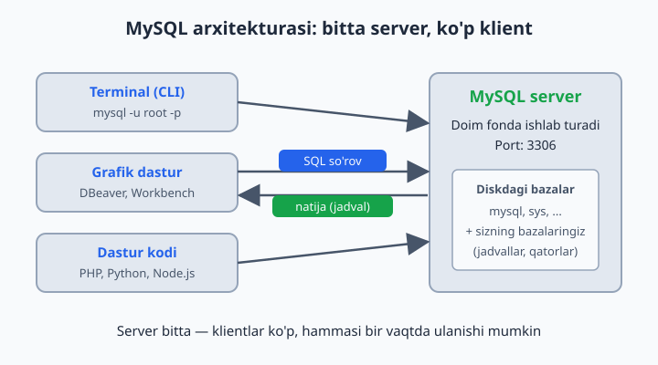
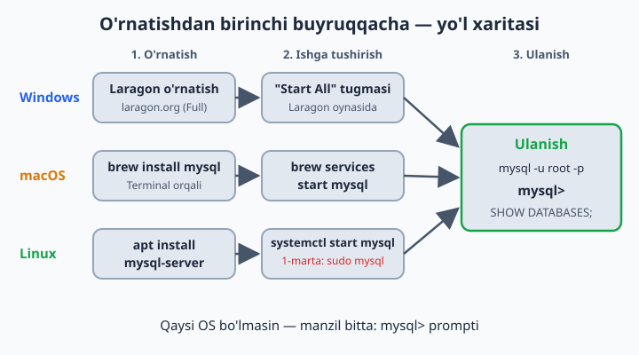

# 02 — MySQL'ni o'rnatish va ishga tushirish

[⬅️ Oldingi: 01 — Ma'lumotlar bazasi nima?](./01-malumotlar-bazasi-nima.md) · [🏠 README](./README.md) · [Keyingi: 03 — Amaliyot bazalarini tayyorlash (4 ta tizim) ➡️](./03-amaliyot-bazalari.md)

> **Bu bobda:** MySQL aslida qanday ishlashini (doim ishlab turadigan server va unga ulanadigan klientlar), uni Windows, macOS va Linux'ga o'rnatishni, terminal hamda DBeaver orqali ulanishni o'rganamiz va birinchi SQL buyruqlarimizni bajarib ko'ramiz.

---

## Avval tushunib olaylik: MySQL — bu server

MySQL'ni o'rnatganingizda kompyuteringizga oddiy dastur emas, **server** o'rnatiladi. Server — fonda jim ishlab turadigan dastur: siz uni Word'dek ochib o'tirmaysiz, u doim "navbatchilikda" turadi va kim ulansa, o'shaning so'roviga javob beradi.

Buni call-markazga o'xshatish mumkin: operator doim ish joyida o'tiradi, kim telefon qilsa — javob beradi. MySQL server ham xuddi shunday: u kompyuterda **3306-port**da (serverning "telefon raqami") kutib turadi.

**Klient** — server bilan gaplashadigan har qanday dastur. Terminal (`mysql` buyrug'i), DBeaver kabi grafik dastur yoki o'zingiz yozgan PHP/Python kod — hammasi klient. Server bitta, klientlar esa istalgancha — hatto bir vaqtning o'zida bir nechta klient ulanib ishlayverishi mumkin.



## Eng oson yo'l — har bir OS uchun

**Windows:** [Laragon](https://laragon.org) dasturini yuklab o'rnating (Full versiyasi). Ichida MySQL tayyor keladi. O'rnatib, "Start All" tugmasini bosing — MySQL server ishga tushadi. Bo'ldi.

📌 Rasmiy yo'l ham bor: mysql.com saytidan "MySQL Installer for Windows" yuklab o'rnatish. Lekin boshlovchiga Laragon ancha oson — keyinroq xohlasangiz rasmiy usulga o'tib olasiz.

**macOS:** Terminal'da:
```bash
brew install mysql
brew services start mysql
```
Birinchi qator MySQL'ni o'rnatadi, ikkinchisi serverni ishga tushiradi (va kompyuter qayta yonganda ham avtomatik ishga tushadigan qilib qo'yadi). Homebrew o'rnatgan MySQL'da `root` paroli boshida bo'sh bo'ladi.

**Linux (Ubuntu):**
```bash
sudo apt update
sudo apt install mysql-server
sudo systemctl start mysql
```
Server ishlayotganini tekshirish: `sudo systemctl status mysql` — yashil **active (running)** yozuvi chiqsa, hammasi joyida.

⚠️ Ubuntu'da bitta nozik joy bor: yangi o'rnatilgan MySQL'da `root` foydalanuvchisi parol bilan emas, tizim foydalanuvchisi orqali kiradi. Shuning uchun birinchi marta `mysql -u root -p` emas, **`sudo mysql`** deb ulaning. Keyinchalik xohlasangiz `root`'ga parol qo'yib olasiz (foydalanuvchilar va parollarni 24-bobda batafsil ko'ramiz).



## Bazaga ulanish — 2 usul

**1-usul: qora oyna (terminal/CMD):**
```bash
mysql -u root -p
```
`mysql` — klient dasturining nomi, `-u root` — "root nomli foydalanuvchi bilan kiraman", `-p` — "parolni so'ra" degani. Laragon'da parol bo'sh (shunchaki Enter bosing). Manzil ko'rsatmadik, chunki klient standart bo'yicha o'z kompyuteringizdagi (`localhost`) serverga, 3306-portga ulanadi.

Muvaffaqiyatli ulansangiz, shunday ko'rinadi:
```
mysql>
```
Bu — "men tayyorman, buyruq bering" degani. Endi siz to'g'ridan-to'g'ri MySQL server bilan gaplashyapsiz.

**2-usul: grafik dastur (tavsiya — boshlovchiga osonroq):**
- **DBeaver** (bepul, hamma OS) — dbeaver.io
- **HeidiSQL** (bepul, Windows)
- **TablePlus** (chiroyli, macOS/Windows)
- **MySQL Workbench** (rasmiy, bepul) — mysql.com

DBeaver'da: New Connection → MySQL → host: `localhost`, user: `root`, parol → Test Connection → Finish.

💡 DBeaver "Public Key Retrieval is not allowed" degan xato bersa, qo'rqmang — bu MySQL 8 bilan tez-tez uchraydi. Ulanish sozlamalarida **Driver properties** bo'limini ochib, `allowPublicKeyRetrieval` ni `TRUE` qiling — ishlab ketadi.

Esda tuting: grafik dastur ham, terminal ham — bitta serverga ulanadigan klientlar, xolos. Qaysi biri qulay bo'lsa, o'shanisini ishlating; kitobdagi misollarni ikkalasida ham bajarsa bo'ladi.

## Birinchi buyruqlar

```sql
SHOW DATABASES;
```
Natija — serverdagi mavjud bazalar ro'yxati:
```
+--------------------+
| Database           |
+--------------------+
| information_schema |
| mysql              |
| performance_schema |
| sys                |
+--------------------+
```
Bular MySQL'ning o'z xizmat bazalari — server o'zi haqidagi ma'lumotlarni shu yerda saqlaydi, tegmaymiz. O'z bazalarimizni keyingi bobdan boshlab yaratamiz.

```sql
SELECT NOW();          -- hozirgi sana va vaqt
SELECT 2 + 2;          -- ha, kalkulyator sifatida ham ishlaydi :)
SELECT VERSION();      -- MySQL versiyasi (8.0 yoki undan yangi bo'lishi kerak)
```

**Muhim qoidalar:**
- Har bir buyruq **nuqta-vergul** `;` bilan tugaydi. Unutsangiz, MySQL "buyruq hali davom etyapti" deb kutib turadi — `;` terib Enter bossangiz bajariladi
- SQL buyruqlari katta-kichik harfga **befarq**: `select` = `SELECT`. Lekin odat bo'yicha buyruqlar KATTA, jadval/ustun nomlari kichik yoziladi — kod o'qishga oson bo'ladi
- Izoh (komment) yozish mumkin: `-- bu izoh` (ikki defisdan keyin bo'sh joy bo'lishi shart!) yoki `# bu ham izoh`
- Xato yozsangiz — qo'rqmang, MySQL xato xabarini ko'rsatadi, hech narsa buzilmaydi

## Tez-tez uchraydigan muammolar

| Xato xabari | Sababi | Yechimi |
|---|---|---|
| `Access denied for user 'root'` | Parol noto'g'ri | Laragon'da parol bo'sh; Ubuntu'da `sudo mysql` deb kiring |
| `Can't connect to MySQL server (2003)` | Server ishga tushmagan | Laragon'da "Start All"; Linux'da `sudo systemctl start mysql` |
| `ERROR 1064 ... your SQL syntax` | Buyruqda imlo xatosi | Buyruqni diqqat bilan qayta tering (13-masaladagi kabi) |
| `Public Key Retrieval is not allowed` | DBeaver + MySQL 8 | Driver properties'da `allowPublicKeyRetrieval` = `TRUE` |

## 2-bob masalalari

1. MySQL'ni o'z kompyuteringizga o'rnating (Laragon yoki boshqa usul)
2. Terminal orqali ulanib, `mysql>` promptini ko'ring
3. DBeaver (yoki HeidiSQL) o'rnatib, ulanish yarating
4. `SHOW DATABASES;` buyrug'ini bajaring — nechta baza bor?
5. `SELECT VERSION();` — versiyangiz qaysi?
6. `SELECT NOW();` — natijani yozib oling
7. `SELECT 7 * 8;` bajaring
8. `SELECT 100 / 3;` — natija qanday chiqdi? Kasr qismiga e'tibor bering
9. `select now();` — kichik harflarda yozing. Ishladimi? Xulosa qiling
10. `SELECT NOW()` — nuqta-vergulsiz yozing. Nima bo'ldi? (terminal kutib turadi — `;` terib Enter bosing)
11. `SELECT 'Salom, SQL!';` bajaring — matn qanday chiqdi?
12. `SELECT 'Mening ismim', 'Aziz';` — ikki ustunli natija oling
13. Ataylab xato yozing: `SELEC NOW();` — xato xabarini o'qing va tushuning
14. `SELECT 10 % 3;` — `%` nima qilarkan? (qoldiq)
15. `SELECT (5 + 3) * 2;` — qavslar ishlaydimi?
16. `SHOW WARNINGS;` buyrug'ini sinab ko'ring
17. `SELECT DATABASE();` — natija nega NULL? O'ylang (hali hech qaysi bazani tanlamadik)
18. Terminal'dan chiqing: `exit` yoki `quit`. Qayta kiring
19. DBeaver'da SQL Editor oching (Ctrl+]) va `SELECT NOW();` ni shu yerdan bajaring
20. `SELECT USER();` — qaysi foydalanuvchi sifatida ulangansiz?
