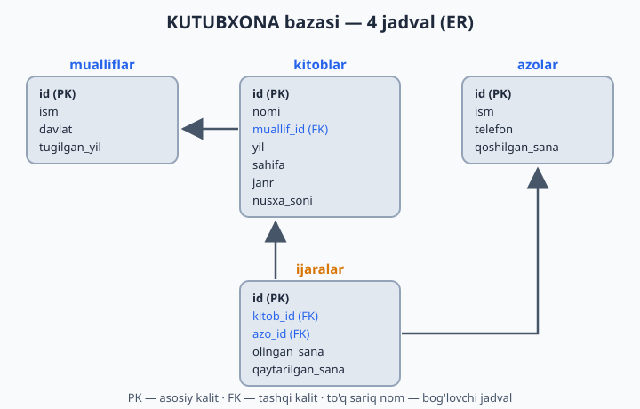
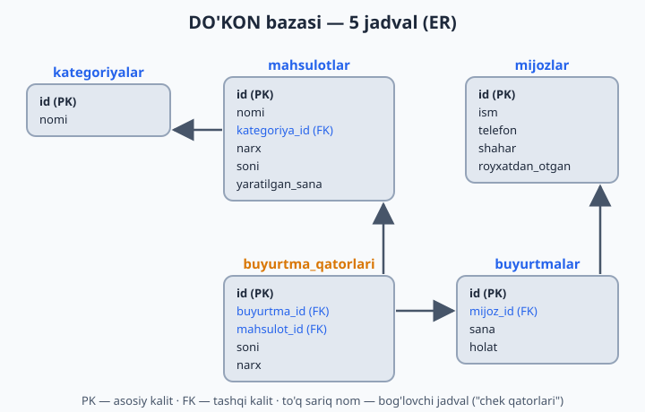
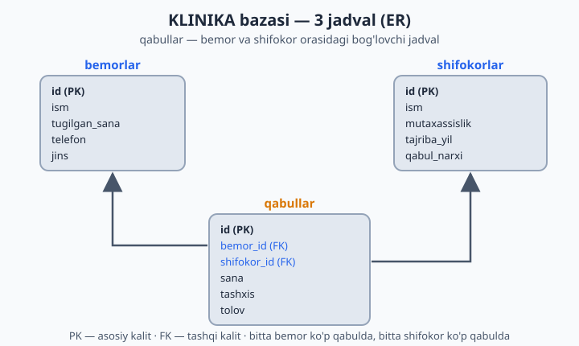
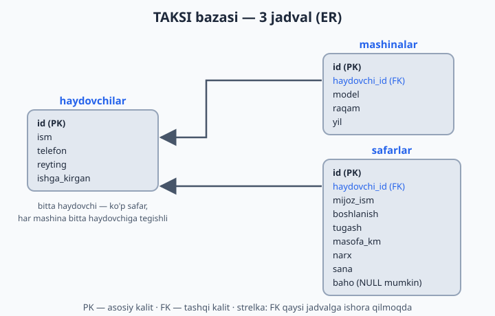

# 03 — Amaliyot bazalarini tayyorlash (4 ta tizim)

[⬅️ Oldingi: 02 — MySQL'ni o'rnatish va ishga tushirish](./02-mysql-ornatish.md) · [🏠 README](./README.md) · [Keyingi: 04 — CREATE — baza va jadval yaratish ➡️](./04-create.md)

> **Bu bobda:** butun kitob davomida ishlatiladigan 4 ta amaliyot bazasini (kutubxona, do'kon, klinika, taksi) yaratib olamiz, har birining jadvallarini va ular orasidagi bog'lanishlarni ER-diagrammalarda ko'rib chiqamiz, skriptlarni bajarib natijani tekshiramiz.

---

Butun kitob davomida 4 ta real tizim ustida mashq qilamiz. Nega aynan to'rtta? Chunki har xil soha — har xil savol: kutubxonada "kim kitobni qaytarmadi?", do'konda "qaysi mahsulot ko'p sotildi?", klinikada "qaysi shifokor ko'proq daromad keltirdi?", taksida "kimning reytingi yuqori?". Bitta baza bilan tez zerikasiz, to'rttasi bilan esa SQL hayotdagi haqiqiy savollarga javob berishini his qilasiz.

**Hozir shu 4 ta skriptni bajarib qo'ying** — keyingi boblardagi 400+ masala shularga asoslangan.

**Skriptni qanday bajaraman?**

- **DBeaver/HeidiSQL'da:** SQL Editor oching, skriptni to'liqligicha nusxalab qo'ying va butun skriptni bajaring (DBeaver'da **Alt+X** — "Execute script"; oddiy Ctrl+Enter faqat kursor turgan bitta buyruqni bajaradi).
- **Terminalda:** `mysql -u root -p` bilan ulaning, skriptni nusxalab qo'ying va Enter bosing — buyruqlar ketma-ket bajariladi.

Boshlashdan oldin ikkita kichik izoh:

1. Ma'lumotlar ichida atayin apostrof ishlatmadik (masalan, `'Ozbekiston'` deb yozdik): SQL matnni `'...'` orasiga oladi, matn ichidagi apostrof esa uni chalkashtirib yuboradi. Buni hal qilish usullarini keyinroq ko'ramiz, hozircha shunday qabul qiling.
2. Jadvallar orasidagi bog'lanishni hozircha `FOREIGN KEY` bilan **e'lon qilmadik** — bu mavzu 18-bobda. Hozir bog'lanish "kelishuv" darajasida ishlaydi: masalan, `kitoblar.muallif_id` ustunida `mualliflar` jadvalidagi `id` qiymati turadi. Diagrammalardagi strelkalar aynan shu bog'lanishlarni ko'rsatadi.

## Tizim 1: KUTUBXONA

Mahallangizdagi oddiy kutubxonani tasavvur qiling: kitoblar bor, har kitobning muallifi bor, a'zolar kitob olib ketib qaytaradi. Jami 4 jadval: `mualliflar`, `kitoblar`, `azolar` va bog'lovchi `ijaralar` — "kim qaysi kitobni qachon oldi" ro'yxati. `qaytarilgan_sana` ustuni `NULL` bo'lsa — kitob hali qaytarilmagan, kimdadir "yurgan" degani.



```sql
CREATE DATABASE kutubxona CHARACTER SET utf8mb4 COLLATE utf8mb4_unicode_ci;
USE kutubxona;

CREATE TABLE mualliflar (
    id INT AUTO_INCREMENT PRIMARY KEY,
    ism VARCHAR(100) NOT NULL,
    davlat VARCHAR(50),
    tugilgan_yil INT
);

CREATE TABLE kitoblar (
    id INT AUTO_INCREMENT PRIMARY KEY,
    nomi VARCHAR(200) NOT NULL,
    muallif_id INT,
    yil INT,
    sahifa INT,
    janr VARCHAR(50),
    nusxa_soni INT DEFAULT 1
);

CREATE TABLE azolar (
    id INT AUTO_INCREMENT PRIMARY KEY,
    ism VARCHAR(100) NOT NULL,
    telefon VARCHAR(20),
    qoshilgan_sana DATE
);

CREATE TABLE ijaralar (
    id INT AUTO_INCREMENT PRIMARY KEY,
    kitob_id INT NOT NULL,
    azo_id INT NOT NULL,
    olingan_sana DATE NOT NULL,
    qaytarilgan_sana DATE NULL
);

INSERT INTO mualliflar (ism, davlat, tugilgan_yil) VALUES
('Abdulla Qodiriy', 'Ozbekiston', 1894),
('Xudoyberdi Toxtaboyev', 'Ozbekiston', 1932),
('Erkin Vohidov', 'Ozbekiston', 1936),
('Lev Tolstoy', 'Rossiya', 1828),
('Jack London', 'AQSH', 1876),
('Antoine de Saint-Exupery', 'Fransiya', 1900);

INSERT INTO kitoblar (nomi, muallif_id, yil, sahifa, janr, nusxa_soni) VALUES
('Otkan kunlar', 1, 1925, 432, 'roman', 5),
('Mehrobdan chayon', 1, 1928, 380, 'roman', 3),
('Sariq devni minib', 2, 1968, 256, 'sarguzasht', 7),
('Sariq devning olimi', 2, 1973, 288, 'sarguzasht', 2),
('Ozbegim', 3, 1981, 120, 'sheriyat', 4),
('Urush va tinchlik', 4, 1869, 1225, 'roman', 2),
('Anna Karenina', 4, 1877, 864, 'roman', 3),
('Oq soyloq', 5, 1906, 320, 'sarguzasht', 6),
('Kichkina shahzoda', 6, 1943, 96, 'ertak', 10),
('Hayot chorrahalari', 3, 1975, 200, 'sheriyat', 1);

INSERT INTO azolar (ism, telefon, qoshilgan_sana) VALUES
('Aziz Karimov', '+998901112233', '2025-01-15'),
('Malika Tosheva', '+998902223344', '2025-02-20'),
('Jasur Aliyev', '+998903334455', '2025-03-10'),
('Nilufar Rahimova', NULL, '2025-05-05'),
('Bobur Saidov', '+998905556677', '2026-01-12'),
('Zilola Ergasheva', '+998906667788', '2026-02-28');

INSERT INTO ijaralar (kitob_id, azo_id, olingan_sana, qaytarilgan_sana) VALUES
(1, 1, '2026-05-01', '2026-05-15'),
(3, 1, '2026-05-20', NULL),
(9, 2, '2026-05-10', '2026-05-12'),
(6, 3, '2026-04-01', '2026-05-25'),
(3, 4, '2026-06-01', NULL),
(2, 2, '2026-06-03', NULL),
(8, 5, '2026-05-28', '2026-06-05'),
(1, 6, '2026-06-07', NULL);
```

Tekshirib ko'ring: `SELECT COUNT(*) FROM kitoblar;` — `10` chiqishi kerak (`COUNT` qatorlarni sanaydi, uni 11-bobda batafsil o'rganamiz).

## Tizim 2: ONLINE DO'KON

Eng katta tizimimiz — 5 jadval. Bu yerda muhim bir g'oya bor: bitta buyurtmada bir nechta mahsulot bo'lishi mumkin. Shuning uchun buyurtma ikkiga bo'lingan: `buyurtmalar` — "chek"ning o'zi (kim, qachon, qanday holatda), `buyurtma_qatorlari` — chekdagi har bir mahsulot qatori (nima, nechta, qancha narxda). Do'kondan chek olganingizda ham xuddi shunday: tepada sana va kassir, pastda mahsulotlar ro'yxati.



```sql
CREATE DATABASE dokon CHARACTER SET utf8mb4 COLLATE utf8mb4_unicode_ci;
USE dokon;

CREATE TABLE kategoriyalar (
    id INT AUTO_INCREMENT PRIMARY KEY,
    nomi VARCHAR(100) NOT NULL
);

CREATE TABLE mahsulotlar (
    id INT AUTO_INCREMENT PRIMARY KEY,
    nomi VARCHAR(200) NOT NULL,
    kategoriya_id INT,
    narx DECIMAL(12,2) NOT NULL,
    soni INT NOT NULL DEFAULT 0,
    yaratilgan_sana DATE
);

CREATE TABLE mijozlar (
    id INT AUTO_INCREMENT PRIMARY KEY,
    ism VARCHAR(100) NOT NULL,
    telefon VARCHAR(20) UNIQUE,
    shahar VARCHAR(50),
    royxatdan_otgan DATE
);

CREATE TABLE buyurtmalar (
    id INT AUTO_INCREMENT PRIMARY KEY,
    mijoz_id INT NOT NULL,
    sana DATETIME NOT NULL,
    holat ENUM('yangi','yolda','yetkazildi','bekor') DEFAULT 'yangi'
);

CREATE TABLE buyurtma_qatorlari (
    id INT AUTO_INCREMENT PRIMARY KEY,
    buyurtma_id INT NOT NULL,
    mahsulot_id INT NOT NULL,
    soni INT NOT NULL,
    narx DECIMAL(12,2) NOT NULL
);

INSERT INTO kategoriyalar (nomi) VALUES
('Telefonlar'), ('Noutbuklar'), ('Aksessuarlar'), ('Maishiy texnika');

INSERT INTO mahsulotlar (nomi, kategoriya_id, narx, soni, yaratilgan_sana) VALUES
('Samsung Galaxy A55', 1, 4200000, 15, '2026-01-10'),
('iPhone 15', 1, 11500000, 8, '2026-01-12'),
('Redmi Note 13', 1, 2800000, 25, '2026-02-01'),
('Lenovo IdeaPad 3', 2, 6500000, 10, '2026-01-20'),
('MacBook Air M2', 2, 16000000, 5, '2026-02-15'),
('Acer Aspire 5', 2, 7200000, 0, '2026-03-01'),
('Quloqchin AirPods', 3, 2300000, 30, '2026-01-05'),
('Telefon chexol', 3, 50000, 200, '2026-01-05'),
('Quvvatlagich 65W', 3, 180000, 45, '2026-02-10'),
('Artel muzlatgich', 4, 5400000, 7, '2026-03-15'),
('Samsung kir yuvish', 4, 4800000, 4, '2026-03-20'),
('Changyutgich Xiaomi', 4, 1900000, 12, '2026-04-01');

INSERT INTO mijozlar (ism, telefon, shahar, royxatdan_otgan) VALUES
('Davron Yusupov', '+998911234567', 'Toshkent', '2026-01-15'),
('Sevara Nazarova', '+998912345678', 'Samarqand', '2026-02-01'),
('Otabek Rashidov', '+998913456789', 'Toshkent', '2026-02-20'),
('Gulnoza Hamidova', '+998914567890', 'Buxoro', '2026-03-05'),
('Sherzod Tursunov', '+998915678901', 'Toshkent', '2026-04-10'),
('Dilnoza Karimova', '+998916789012', 'Namangan', '2026-05-01');

INSERT INTO buyurtmalar (mijoz_id, sana, holat) VALUES
(1, '2026-05-01 10:30:00', 'yetkazildi'),
(2, '2026-05-03 14:20:00', 'yetkazildi'),
(1, '2026-05-15 09:00:00', 'yetkazildi'),
(3, '2026-05-20 16:45:00', 'bekor'),
(4, '2026-06-01 11:10:00', 'yolda'),
(5, '2026-06-05 13:30:00', 'yangi'),
(1, '2026-06-07 18:00:00', 'yangi'),
(2, '2026-06-08 10:15:00', 'yolda');

INSERT INTO buyurtma_qatorlari (buyurtma_id, mahsulot_id, soni, narx) VALUES
(1, 3, 1, 2800000), (1, 8, 2, 50000),
(2, 7, 1, 2300000),
(3, 4, 1, 6500000), (3, 9, 1, 180000),
(4, 2, 1, 11500000),
(5, 10, 1, 5400000),
(6, 1, 1, 4200000), (6, 8, 1, 50000), (6, 9, 1, 180000),
(7, 12, 1, 1900000),
(8, 5, 1, 16000000);
```

Tekshirib ko'ring: `SELECT COUNT(*) FROM mahsulotlar;` — `12` chiqishi kerak.

## Tizim 3: KLINIKA

Klinikada 3 jadval: `shifokorlar`, `bemorlar` va ularni bog'lovchi `qabullar`. Bitta bemor turli shifokorlarga boradi, bitta shifokor ko'p bemorni qabul qiladi — bularning hammasi `qabullar`da yoziladi. E'tibor bering: `tolov` har doim ham shifokorning `qabul_narxi`ga teng emas — qo'shimcha muolaja bo'lsa, to'lov oshadi (masalan, karies davosi 350 000 turibdi).



```sql
CREATE DATABASE klinika CHARACTER SET utf8mb4 COLLATE utf8mb4_unicode_ci;
USE klinika;

CREATE TABLE shifokorlar (
    id INT AUTO_INCREMENT PRIMARY KEY,
    ism VARCHAR(100) NOT NULL,
    mutaxassislik VARCHAR(100) NOT NULL,
    tajriba_yil INT,
    qabul_narxi DECIMAL(10,2)
);

CREATE TABLE bemorlar (
    id INT AUTO_INCREMENT PRIMARY KEY,
    ism VARCHAR(100) NOT NULL,
    tugilgan_sana DATE,
    telefon VARCHAR(20),
    jins ENUM('erkak','ayol')
);

CREATE TABLE qabullar (
    id INT AUTO_INCREMENT PRIMARY KEY,
    bemor_id INT NOT NULL,
    shifokor_id INT NOT NULL,
    sana DATETIME NOT NULL,
    tashxis VARCHAR(255),
    tolov DECIMAL(10,2)
);

INSERT INTO shifokorlar (ism, mutaxassislik, tajriba_yil, qabul_narxi) VALUES
('Dr. Anvar Sodiqov', 'Terapevt', 15, 100000),
('Dr. Feruza Olimova', 'Kardiolog', 22, 200000),
('Dr. Rustam Nazarov', 'Stomatolog', 8, 150000),
('Dr. Madina Yoldasheva', 'Pediatr', 12, 120000),
('Dr. Botir Hakimov', 'Nevrolog', 5, 180000);

INSERT INTO bemorlar (ism, tugilgan_sana, telefon, jins) VALUES
('Karim Abdullayev', '1965-04-12', '+998931112233', 'erkak'),
('Lola Mirzayeva', '1990-08-25', '+998932223344', 'ayol'),
('Sardor Umarov', '2018-01-30', '+998933334455', 'erkak'),
('Hulkar Tosheva', '1978-11-05', '+998934445566', 'ayol'),
('Akmal Rahmonov', '2001-06-17', NULL, 'erkak'),
('Zarina Qosimova', '1955-03-22', '+998936667788', 'ayol');

INSERT INTO qabullar (bemor_id, shifokor_id, sana, tashxis, tolov) VALUES
(1, 2, '2026-05-10 09:00:00', 'Gipertoniya', 200000),
(2, 1, '2026-05-12 10:30:00', 'Gripp', 100000),
(3, 4, '2026-05-15 11:00:00', 'Angina', 120000),
(4, 3, '2026-05-20 14:00:00', 'Karies', 350000),
(1, 2, '2026-06-01 09:30:00', 'Nazorat korigi', 200000),
(5, 5, '2026-06-03 15:00:00', 'Migren', 180000),
(6, 2, '2026-06-05 10:00:00', 'Aritmiya', 250000),
(2, 3, '2026-06-08 16:30:00', 'Tish olish', 200000);
```

Tekshirib ko'ring: `SELECT COUNT(*) FROM qabullar;` — `8` chiqishi kerak.

## Tizim 4: TAKSI

Taksi xizmati ham 3 jadval: `haydovchilar`, `mashinalar` va `safarlar`. Ikkita qiziq detalga e'tibor bering. Birinchisi: mijoz alohida jadval emas, `safarlar`da shunchaki `mijoz_ism` ustuni bor — kichik tizimlarda shunday soddalashtirish uchraydi (bu dizaynning kamchiligini 20-bobdagi normalizatsiya ko'zoynagi bilan o'zingiz topasiz). Ikkinchisi: `baho` ustuni `NULL` bo'lishi mumkin — hamma mijoz ham safardan keyin baho qo'yavermaydi, xuddi real ilovalardagidek.



```sql
CREATE DATABASE taksi CHARACTER SET utf8mb4 COLLATE utf8mb4_unicode_ci;
USE taksi;

CREATE TABLE haydovchilar (
    id INT AUTO_INCREMENT PRIMARY KEY,
    ism VARCHAR(100) NOT NULL,
    telefon VARCHAR(20),
    reyting DECIMAL(3,2) DEFAULT 5.00,
    ishga_kirgan DATE
);

CREATE TABLE mashinalar (
    id INT AUTO_INCREMENT PRIMARY KEY,
    haydovchi_id INT,
    model VARCHAR(100),
    raqam VARCHAR(15) UNIQUE,
    yil INT
);

CREATE TABLE safarlar (
    id INT AUTO_INCREMENT PRIMARY KEY,
    haydovchi_id INT NOT NULL,
    mijoz_ism VARCHAR(100),
    boshlanish VARCHAR(100),
    tugash VARCHAR(100),
    masofa_km DECIMAL(6,2),
    narx DECIMAL(10,2),
    sana DATETIME,
    baho INT NULL
);

INSERT INTO haydovchilar (ism, telefon, reyting, ishga_kirgan) VALUES
('Olim Toshev', '+998941112233', 4.85, '2024-03-01'),
('Sanjar Qodirov', '+998942223344', 4.95, '2023-07-15'),
('Murod Aliyev', '+998943334455', 4.20, '2025-01-10'),
('Farhod Berdiyev', '+998944445566', 4.70, '2025-06-20'),
('Ulugbek Sattorov', '+998945556677', 5.00, '2026-01-05');

INSERT INTO mashinalar (haydovchi_id, model, raqam, yil) VALUES
(1, 'Chevrolet Cobalt', '01A123BC', 2022),
(2, 'Chevrolet Gentra', '01B456DE', 2023),
(3, 'Chevrolet Spark', '01C789FG', 2019),
(4, 'Chevrolet Malibu', '01D012HI', 2024),
(5, 'BYD Song', '01E345JK', 2025);

INSERT INTO safarlar (haydovchi_id, mijoz_ism, boshlanish, tugash, masofa_km, narx, sana, baho) VALUES
(1, 'Aziz', 'Chilonzor', 'Yunusobod', 14.5, 35000, '2026-06-01 08:30:00', 5),
(2, 'Malika', 'Sergeli', 'Markaz', 18.2, 42000, '2026-06-01 09:15:00', 5),
(1, 'Jasur', 'Yunusobod', 'Olmazor', 7.3, 20000, '2026-06-02 14:00:00', 4),
(3, 'Nodira', 'Markaz', 'Chilonzor', 9.8, 25000, '2026-06-03 18:45:00', 3),
(4, 'Bobur', 'Olmazor', 'Sergeli', 22.1, 50000, '2026-06-04 07:20:00', 5),
(2, 'Aziz', 'Markaz', 'Yashnobod', 11.0, 28000, '2026-06-05 12:30:00', NULL),
(5, 'Kamola', 'Yunusobod', 'Markaz', 8.5, 30000, '2026-06-06 16:00:00', 5),
(1, 'Sherzod', 'Chilonzor', 'Sergeli', 19.7, 45000, '2026-06-07 19:10:00', 4),
(3, 'Dilshod', 'Yashnobod', 'Olmazor', 13.4, 32000, '2026-06-08 10:05:00', 2),
(2, 'Malika', 'Markaz', 'Chilonzor', 10.1, 26000, '2026-06-08 20:30:00', 5);
```

Tekshirib ko'ring: `SELECT COUNT(*) FROM safarlar;` — `10` chiqishi kerak.

Hammasi tayyor bo'lsa, oxirgi tekshiruv:

```sql
SHOW DATABASES;
```

Ro'yxatda `kutubxona`, `dokon`, `klinika`, `taksi` — to'rttasi ham turishi kerak. Tabriklaymiz: endi sizda mashq qilish uchun to'laqonli "poligon" bor!

## 3-bob masalalari

1. 4 ta skriptning hammasini bajaring (`kutubxona`, `dokon`, `klinika`, `taksi`)
2. `SHOW DATABASES;` — 4 ta yangi baza ko'rinyaptimi?
3. `USE kutubxona;` keyin `SHOW TABLES;` — nechta jadval bor?
4. Har bir bazaga kirib jadvallar ro'yxatini yozib oling
5. `DESCRIBE kitoblar;` — bu buyruq nima ko'rsatdi? (jadval tuzilishi)
6. `DESCRIBE` ni `dokon.mahsulotlar` uchun bajaring
7. `SELECT * FROM mualliflar;` — nechta muallif bor?
8. `SELECT * FROM kitoblar;` — natijani ko'zdan kechiring, ustunlarni tushunib oling
9. `SELECT COUNT(*) FROM kitoblar;` — nechta kitob? (COUNT keyinroq o'rganamiz, hozir shunchaki sinang)
10. `dokon` bazasida nechta mahsulot bor? Sanab ko'ring
11. `klinika.shifokorlar` jadvalida qaysi mutaxassisliklar bor?
12. `taksi.safarlar`da baho NULL bo'lgan qator bormi? Toping (ko'z bilan)
13. `ijaralar` jadvalida `qaytarilgan_sana` ustuni `NULL` bo'lishi nimani anglatadi? O'ylang
14. `buyurtma_qatorlari`dagi `narx` ustuni nega kerak — mahsulotda narx bor-ku? O'ylang (javob: 20-bobda)
15. `SHOW CREATE TABLE kitoblar;` — jadval qanday yaratilganini ko'rsatadi. Sinang
16. Bitta jadvalni ataylab o'chiring: `DROP TABLE taksi.mashinalar;` — keyin skriptdan qayta yarating (qo'rqmang, o'rganish uchun! Avval `USE taksi;` deng, keyin faqat `CREATE TABLE mashinalar` va unga tegishli `INSERT` qismini ko'chirsangiz yetadi — `CREATE DATABASE`ni qayta bajarish shart emas)
17. `USE dokon;` holatida `SELECT * FROM kitoblar;` yozing — qanday xato chiqdi? Nega?
18. To'liq nom bilan murojaat qiling: `SELECT * FROM kutubxona.kitoblar;` — endi ishladimi? Xulosa: baza.jadval
19. Har bir tizimda qaysi jadval "bog'lovchi" vazifasini bajaradi? (masalan, ijaralar — kitob va a'zoni bog'laydi)
20. O'zingiz 5-tizim o'ylab toping (masalan: sportzal, mehmonxona) va jadvallarini qog'ozda chizing
