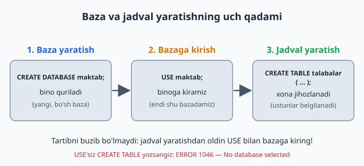
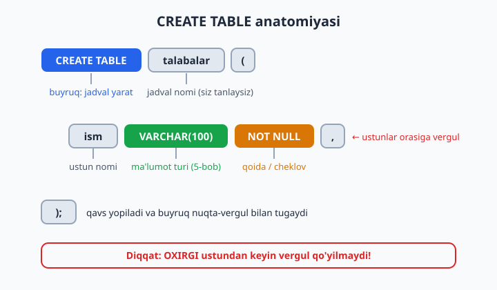
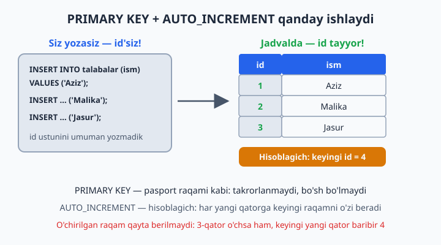

# 04 — CREATE — baza va jadval yaratish

[⬅️ Oldingi: 03 — Amaliyot bazalarini tayyorlash (4 ta tizim)](./03-amaliyot-bazalari.md) · [🏠 README](./README.md) · [Keyingi: 05 — Ma'lumot turlari ➡️](./05-malumot-turlari.md)

> **Bu bobda:** SQL'dagi birinchi "qurilish" buyruqlarini o'rganamiz: `CREATE DATABASE` bilan baza yaratamiz, `USE` bilan uning ichiga kiramiz, `CREATE TABLE` bilan jadval quramiz; `PRIMARY KEY`, `AUTO_INCREMENT`, `NOT NULL`, `UNIQUE`, `DEFAULT` qoidalari nimaligini tushunib olamiz va `SHOW`, `DESCRIBE`, `DROP` yordamchi buyruqlari bilan tanishamiz.

---

Ma'lumotlar bazasini binoga o'xshating: avval **binoning o'zini qurasiz** (`CREATE DATABASE`), keyin **ichiga kirasiz** (`USE`), so'ng **xonalarni jihozlaysiz** (`CREATE TABLE`). Tartib aynan shunday — xonani binosiz qurib bo'lmaydi.



## Baza yaratish — CREATE DATABASE

```sql
CREATE DATABASE baza_nomi CHARACTER SET utf8mb4 COLLATE utf8mb4_unicode_ci;
```

- `CHARACTER SET utf8mb4` — o'zbek, rus, emoji — hammasini saqlaydi. **Har doim shuni yozing.** MySQL 8.0 da bu allaqachon standart, lekin ochiq yozish — yaxshi odat: kodingiz eski sozlangan serverda ham to'g'ri ishlaydi
- `COLLATE utf8mb4_unicode_ci` — harflarni solishtirish qoidasi. Oxiridagi `ci` (case-insensitive) — qidiruvda katta-kichik harf farqlanmaydi: `Aziz` = `aziz`
- Baza nomida bo'shliq bo'lmasin: `mening bazam` ❌ → `mening_bazam` ✅
- Kichik harf va pastki chiziq ishlating, nom raqam bilan boshlanmasin: `1baza` ❌ → `baza1` ✅

Agar shu nomli baza allaqachon mavjud bo'lsa, `CREATE DATABASE` xato beradi. Skriptlarda buni `IF NOT EXISTS` bilan yumshatish mumkin — "bo'lmasa yarat, bo'lsa indama":

```sql
CREATE DATABASE IF NOT EXISTS maktab CHARACTER SET utf8mb4 COLLATE utf8mb4_unicode_ci;
```

## Bazaga kirish — USE

Bazani yaratish — bu hali uning ichiga kirish degani emas. Uyni qurib, hali kalitni qo'lga olmagandeksiz. Jadval yaratishdan **oldin** qaysi bazada ishlamoqchi ekaningizni aytib qo'yishingiz kerak:

```sql
SHOW DATABASES;     -- serverda qanday bazalar bor?
USE maktab;         -- endi "maktab" ichidamiz
SELECT DATABASE();  -- hozir qaysi bazadaman? (tekshirish)
```

💡 Boshlovchilarning klassik xatosi: `USE`'siz to'g'ridan-to'g'ri `CREATE TABLE` yozish. Natija — `ERROR 1046: No database selected`. Bu xato chiqsa, bilingki — siz hali hech qaysi bazaga "kirmagansiz".

## Jadval yaratish — CREATE TABLE

```sql
CREATE TABLE jadval_nomi (
    ustun_nomi TUR [qoidalar],
    ustun_nomi TUR [qoidalar],
    ...
);
```

Har bir ustun uch qismdan iborat: **nomi** (siz tanlaysiz), **turi** (qanday ma'lumot saqlanadi — 5-bobda batafsil) va ixtiyoriy **qoidalar** (cheklovlar). Ustunlar orasiga vergul qo'yiladi, lekin **oxirgi ustundan keyin vergul yo'q** — bu eng ko'p uchraydigan sintaksis xatosi!



## Misol — bosqichma-bosqich tahlil

```sql
CREATE TABLE talabalar (
    id INT AUTO_INCREMENT PRIMARY KEY,
    ism VARCHAR(100) NOT NULL,
    yosh INT,
    email VARCHAR(150) UNIQUE,
    kurs INT DEFAULT 1
);
```

Har bir qatorni o'qiymiz:

| Yozuv | Ma'nosi |
|-------|---------|
| `INT` | butun son saqlaydi |
| `AUTO_INCREMENT` | har yangi qatorga raqamni **o'zi** beradi: 1, 2, 3... |
| `PRIMARY KEY` | asosiy kalit — takrorlanmas, bo'sh bo'lmaydi |
| `VARCHAR(100)` | 100 belgigacha matn |
| `NOT NULL` | bo'sh qoldirib **bo'lmaydi** |
| `UNIQUE` | takrorlanishi **mumkin emas** (2 ta bir xil email yo'q) |
| `DEFAULT 1` | qiymat berilmasa, avtomatik 1 yoziladi |

E'tibor bering: `yosh` ustunida hech qanday qoida yo'q — demak u bo'sh (`NULL`) qolishi mumkin. `NOT NULL` — "majburiy maydon" degani: ismsiz talabani saqlab bo'lmaydi. `DEFAULT` esa "aytmasangiz ham o'zim bilaman" degani: yangi talaba odatda 1-kursda o'qiydi.

## PRIMARY KEY + AUTO_INCREMENT — ajralmas juftlik

`PRIMARY KEY` — jadvaldagi har bir qatorning **pasport raqami**: ikki qatorda bir xil bo'lmaydi va bo'sh qolmaydi. Nega bu kerak? Jadvalda ikkita "Aziz Karimov" o'qisa, ularni faqat id orqali farqlaysiz. Keyinroq jadvallarni bog'lashda (12-bob, JOIN) ham aynan shu id'lar ishlatiladi.

`AUTO_INCREMENT` esa shu raqamlarni qo'lda bermaslik uchun: MySQL ichida hisoblagich saqlaydi va har yangi qatorga keyingi raqamni o'zi yozib qo'yadi. Shuning uchun deyarli har bir jadvalda `id INT AUTO_INCREMENT PRIMARY KEY` qatorini ko'rasiz — bu eng keng tarqalgan andoza, yodlab oling.



💡 Qator o'chirilsa, uning raqami **qayta ishlatilmaydi**: 3-qatorni o'chirsangiz, keyingi yangi qator baribir 4 bo'ladi. Bu xato emas — pasport raqami ham boshqa odamga qaytadan berilmaydi.

## Yordamchi buyruqlar

```sql
SHOW TABLES;                    -- jadvallar ro'yxati
DESCRIBE talabalar;             -- jadval tuzilishi (qisqasi: DESC talabalar;)
SHOW CREATE TABLE talabalar;    -- to'liq CREATE kodi
DROP TABLE talabalar;           -- jadvalni O'CHIRISH (ehtiyot bo'ling!)
DROP TABLE IF EXISTS talabalar; -- bo'lsa o'chir, bo'lmasa xato berma
DROP DATABASE IF EXISTS sinov;  -- butun bazani o'chirish (sinov bazasini masalalarda yaratamiz)
```

`DESCRIBE` — eng yaqin do'stingiz: qaysi ustun majburiy-u (`Null` ustunida `NO`), qaysi biri kalit (`Key` ustunida `PRI`) ekanini bir qarashda ko'rsatadi. `DROP` esa qaytarib bo'lmas buyruq: jadval bilan birga **ichidagi barcha ma'lumot ham yo'qoladi** va MySQL "rostdan o'chirasizmi?" deb so'rab o'tirmaydi.

## Tez-tez uchraydigan xatolar

| Xato xabari | Sababi |
|-------------|--------|
| `ERROR 1046: No database selected` | `USE baza_nomi;` ni unutdingiz |
| `ERROR 1064: ...syntax error...` | ko'pincha vergul aybdor: yetishmaydi yoki oxirgi ustundan keyin ortiqcha turibdi |
| `ERROR 1050: Table ... already exists` | bunday jadval allaqachon bor — `DROP` qiling yoki `IF NOT EXISTS` yozing |
| `ERROR 1060: Duplicate column name` | ikkita ustunga bir xil nom berilgan |
| `ERROR 1068: Multiple primary key defined` | `PRIMARY KEY` jadvalda faqat **bitta** bo'ladi |

Xato xabaridan qo'rqmang — uni **o'qing**. MySQL ko'pincha muammo aynan qaysi qatorda ekanini ham aytib beradi.

## 4-bob masalalari

> Yangi `sinov` bazasi yarating va hammasini shu yerda qiling: `CREATE DATABASE sinov; USE sinov;`

1. `oquvchilar` jadvali yarating: id (PK, auto), ism (matn 100, majburiy), sinf (butun son)
2. `DESCRIBE oquvchilar;` bilan tekshiring — har bir ustunning turi va `Null` qiymatiga e'tibor bering
3. `fanlar` jadvali: id, nomi (majburiy, takrorlanmas)
4. `baholar` jadvali: id, oquvchi_id, fan_id, baho (butun son), sana (DATE)
5. `xodimlar` jadvali: id, ism, maosh (DECIMAL(10,2)), ishga_kirgan (DATE)
6. Jadval yaratishda NOT NULL'siz `telefon` ustuni qo'shing — farqini DESCRIBE'da ko'ring (`Null` ustunida `YES`)
7. `DEFAULT` sinovi: `mehmonlar` jadvali yarating, `davlat VARCHAR(50) DEFAULT 'Ozbekiston'` — apostrofni atayin tushirdik (3-bobdagi kelishuv): `'O'zbekiston'` deb yozsangiz, string ichidagi apostrof sintaksisni buzadi; yechimini keyinroq ko'ramiz
8. `UNIQUE` sinovi: `userlar` jadvali yarating, `login VARCHAR(50) UNIQUE`
9. Ataylab xato: ikkita ustunga bir xil nom bering — xato xabarini o'qing
10. Ataylab xato: `PRIMARY KEY`ni ikki ustunga alohida-alohida yozing — nima dedi?
11. Jadval nomini bo'shliq bilan yarating: `CREATE TABLE mening jadvalim (...)` — xato chiqdimi? Backtick bilan sinang: `` `mening jadvalim` `` (lekin bunday qilmang!)
12. `DROP TABLE mehmonlar;` — o'chiring, `SHOW TABLES` bilan tekshiring
13. `DROP TABLE mehmonlar;` ni QAYTA bajaring — qanday xato? Endi `DROP TABLE IF EXISTS mehmonlar;` — farqi?
14. Sportzal uchun `azolar` jadvalini O'ZINGIZ loyihalang (kamida 5 ustun) va yarating
15. Mehmonxona uchun `xonalar` jadvali: raqami, qavat, narx, band (BOOLEAN)
16. `BOOLEAN` ustunli jadvalni DESCRIBE qiling — MySQL uni qanday ko'rsatdi? (`tinyint(1)` — bu normal)
17. Restoran menyusi jadvalini yarating: taom nomi, kategoriya, narx, mavjudligi
18. Avtosalon: `mashinalar` jadvali — model, rang, yil, narx, sotilganmi
19. `sinov` bazasidagi barcha jadvallarni bitta-bitta DROP qiling
20. `DROP DATABASE sinov;` qilib, bazani qaytadan yarating — endi bu jarayon sizga tanish!
