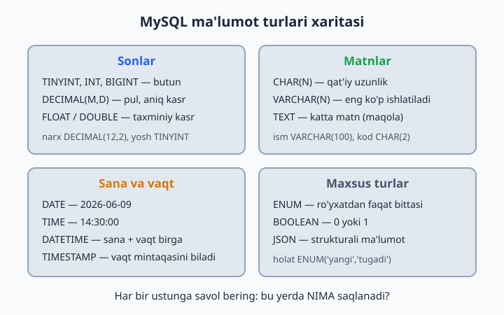
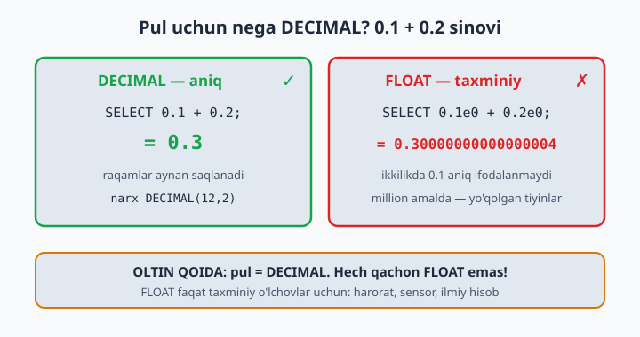
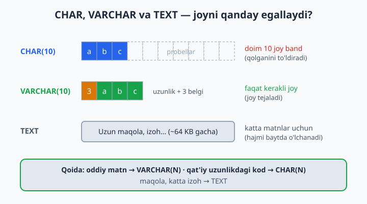

# 05 — Ma'lumot turlari

[⬅️ Oldingi: 04 — CREATE — baza va jadval yaratish](./04-create.md) · [🏠 README](./README.md) · [Keyingi: 06 — INSERT — ma'lumot kiritish ➡️](./06-insert.md)

> **Bu bobda:** MySQL'dagi asosiy ma'lumot turlarini — sonlar (INT, DECIMAL, FLOAT), matnlar (CHAR, VARCHAR, TEXT), sana-vaqt (DATE, DATETIME, TIMESTAMP) va maxsus turlarni (ENUM, BOOLEAN, JSON) o'rganamiz; har bir ustunga to'g'ri tur tanlashni va pul nima uchun har doim DECIMAL'da saqlanishini ko'rib chiqamiz.

---

To'g'ri tur — to'g'ri poydevor. Har bir ustunga "bu yerda NIMA saqlanadi?" deb savol bering.

Bu xuddi oshxonada mahsulotga idish tanlashga o'xshaydi: guruch — qopda, yog' — shishada, tuz — tuzdonda. Har bir mahsulotga o'z idishi bor. Bazada ham shunday: har bir ma'lumotga o'z turi bor. Noto'g'ri "idish" tanlasangiz — yo joy isrof bo'ladi, yo ma'lumotning o'zi buziladi.



## Sonlar

| Tur | Diapazon | Qachon | Misol |
|-----|----------|--------|-------|
| `TINYINT` | -128..127 (UNSIGNED: 0..255) | yosh, status | yosh TINYINT UNSIGNED |
| `SMALLINT` | ±32 767 | qavat, o'rinlar soni | qavat SMALLINT |
| `INT` | ±2.1 milliard | oddiy butun sonlar | sahifa INT |
| `BIGINT` | ±9.2 kvintillion | juda katta sonlar, ID'lar | id BIGINT |
| `DECIMAL(M,D)` | jami M raqam, D tasi kasrda | **PUL va aniq kasrlar** | narx DECIMAL(12,2) |
| `FLOAT/DOUBLE` | taxminiy kasrlar | ilmiy o'lchovlar | harorat FLOAT |

`UNSIGNED` — "ishorasiz" degani: manfiy qiymat taqiqlanadi, evaziga musbat chegara ikki baravar oshadi. Yosh, ombordagi miqdor kabi hech qachon manfiy bo'lmaydigan butun sonlarga juda mos.

`DECIMAL(12,2)` o'qilishi: jami 12 raqam, shundan 2 tasi kasrdan keyin → maksimum 9 999 999 999.99.

**OLTIN QOIDA: pul = DECIMAL. Hech qachon FLOAT emas!**

```sql
-- Nega? Sinab ko'ring:
SELECT 0.1 + 0.2;                 -- 0.3 (MySQL buni aniq DECIMAL sifatida hisoblaydi)
SELECT 0.1e0 + 0.2e0;             -- 0.30000000000000004 (e0 qo'shilsa son DOUBLE — taxminiy suzuvchi nuqtali songa aylanadi!)
```

FLOAT kompyuterda ikkilik (binar) kasr sifatida taxminan saqlanadi: 0.1 ni ikkilikda aniq yozib bo'lmaydi — xuddi 1/3 ni o'nlikda aniq yozib bo'lmagani kabi (0.3333...). Pulda "taxminan" degani — mijoz pulining yo'qolishi degani. Million tranzaksiyada shu mayda farqlar yig'ilib, hisobotdagi haqiqiy kamomadga aylanadi.



## Matnlar

| Tur | Hajm | Qachon |
|-----|------|--------|
| `CHAR(N)` | doim aniq N belgi | viloyat kodi CHAR(2), valyuta CHAR(3) |
| `VARCHAR(N)` | N gacha belgi | ism, telefon, email — **eng ko'p ishlatiladi** |
| `TEXT` | 65 535 baytgacha (~64 KB) | maqola, izoh |
| `LONGTEXT` | 4 GB gacha | juda katta matn (kamdan-kam kerak) |

Farqi nimada? `CHAR(10)` har doim 10 belgilik joy egallaydi: 'abc' yozsangiz, qolgan 7 joyni probel bilan to'ldiradi (o'qiyotganda esa bu probellarni o'zi olib tashlaydi). `VARCHAR(10)` esa faqat kerakli joyni oladi: 'abc' uchun 3 belgi + uzunlikni eslab qolish uchun 1 bayt. Shuning uchun uzunligi o'zgarib turadigan matnlarga `VARCHAR`, doim bir xil uzunlikdagi kodlarga `CHAR` mos.



Hajmni real ehtiyojga qarab tanlang: telefon uchun `VARCHAR(20)` yetadi, `VARCHAR(255)` shart emas.

📌 `TEXT` hajmi belgida emas, **baytda** o'lchanadi: `utf8mb4` kodlashda bitta belgi 4 baytgacha joy olishi mumkin, shuning uchun sig'adigan belgilar soni 65 535 dan kamroq bo'lishi mumkin.

## Sana va vaqt

| Tur | Format | Diapazon | Misol |
|-----|--------|----------|-------|
| `DATE` | YYYY-MM-DD | 1000..9999-yillar | tug'ilgan kun |
| `TIME` | HH:MM:SS | — | dars vaqti |
| `DATETIME` | YYYY-MM-DD HH:MM:SS | 1000..9999-yillar | buyurtma vaqti |
| `TIMESTAMP` | DATETIME kabi | 1970..2038-yillar | yaratilgan vaqt |

`DATETIME` siz yozgan vaqtni "qotirib" saqlaydi. `TIMESTAMP` esa vaqtni UTC'da saqlab, o'qiyotganda sessiyaning vaqt mintaqasiga moslab ko'rsatadi — server boshqa mamlakatga ko'chsa ham vaqt to'g'ri qoladi. Lekin chegarasi tor: faqat 1970–2038 yillar (mashhur "2038-yil muammosi"). Tug'ilgan kun kabi eski sanalarga `DATE`/`DATETIME` ishlating.

Yozuv qachon yaratilganini avtomatik saqlash — juda keng tarqalgan usul:

```sql
yaratilgan TIMESTAMP DEFAULT CURRENT_TIMESTAMP
```

Sana **har doim** `'2026-06-09'` ko'rinishda — YYYY-MM-DD tartibida, bitta tirnoq (apostrof) ichida yoziladi. MySQL `'2026/06/09'` kabi boshqa ajratgichlarni ham tushunadi, lekin tartib doim yil-oy-kun bo'lishi shart. Odat qiling: faqat YYYY-MM-DD.

Hozirgi sana-vaqtni so'rash uchun tayyor funksiyalar bor (10-bobda batafsil ko'ramiz):

```sql
SELECT NOW();      -- hozirgi sana va vaqt: 2026-06-09 14:30:00
SELECT CURDATE();  -- bugungi sana: 2026-06-09
SELECT CURTIME();  -- hozirgi vaqt: 14:30:00
```

## Maxsus turlar

```sql
holat ENUM('yangi', 'jarayonda', 'tugadi')  -- faqat shu 3 qiymatdan biri
faol BOOLEAN                                 -- 0 yoki 1 (TRUE/FALSE)
sozlamalar JSON                              -- JSON ma'lumot
```

- `ENUM` — ro'yxatdan tashqari qiymat kiritsangiz, MySQL 8 xato beradi. Ehtiyot bo'ling: keyinchalik yangi qiymat qo'shish uchun `ALTER TABLE` kerak bo'ladi, shuning uchun tez-tez o'zgaradigan ro'yxatlarga ENUM emas, alohida jadval yaxshiroq.
- `BOOLEAN` — aslida `TINYINT(1)` ning boshqa nomi: `TRUE` 1 bo'lib, `FALSE` 0 bo'lib saqlanadi. SELECT'da 1 yoki 0 ko'rinadi — bu normal.
- `JSON` — MySQL kiritilgan matn haqiqiy JSON ekanini tekshiradi: format noto'g'ri bo'lsa, xato olasiz.

## 5-bob masalalari

> `sinov` bazasida ishlang.

1. Quyidagilarga tur tanlang (yozing): odam yoshi, kitob narxi, telefon raqami, tug'ilgan sana, maqola matni
2. Quyidagilarga tur tanlang: mahsulot soni omborda, mashina raqami, e-mail, ro'yxatdan o'tgan vaqt (sana+soat), reyting (4.85 kabi)
3. `SELECT 0.1 + 0.2;` va `SELECT 0.1e0 + 0.2e0;` — ikkalasini bajarib, farqni o'z ko'zingiz bilan ko'ring
4. `tovarlar` jadvali yarating: narx DECIMAL(10,2) bilan. `INSERT` qilib 19999.99 kiriting, SELECT bilan ko'ring
5. O'sha jadvalga 999999999.99 kiritib ko'ring (sig'adimi? DECIMAL(10,2) = max 8 ta butun raqam!) — xatoni o'qing
6. `VARCHAR(5)` ustunli jadval yarating, 'Salomlar' (8 belgi) kiritib ko'ring — nima bo'ldi?
7. `CHAR(10)` va `VARCHAR(10)` ustunli jadval yarating, ikkalasiga 'abc' kiriting, `SELECT LENGTH(ustun)` bilan uzunliklarni solishtiring. Kutilmagan natija: ikkalasi ham 3! Sababi — MySQL CHAR'ni o'qiyotganda oxiriga qo'shilgan probellarni avtomatik olib tashlaydi
8. `DATE` ustunli jadvalga '2026-13-45' kiritib ko'ring — MySQL nima dedi?
9. '09.06.2026' (kun-oy-yil tartibi) kiritib ko'ring — qabul qildimi? Xulosa: tartib faqat YYYY-MM-DD
10. ENUM sinovi: `holat ENUM('yangi','eski')` ustuniga 'ortacha' kiritib ko'ring
11. BOOLEAN ustun yarating, TRUE kiriting, SELECT qiling — nima ko'rinadi? (1)
12. TINYINT ustunga 300 kiritib ko'ring — xato yoki ogohlantirishni o'qing
13. TINYINT UNSIGNED ga -5 kiritib ko'ring
14. Bankomat tizimi uchun `kartalar` jadvalini loyihalang: karta raqami, egasi, balans, amal qilish muddati — har turni asoslang
15. Ob-havo jadvali: shahar, sana, harorat (manfiy ham bo'ladi!), namlik foizi — turlarni tanlang
16. `SELECT NOW();` natijasi qaysi turga mos: DATE, TIME yoki DATETIME?
17. `SELECT CURDATE();` va `SELECT CURTIME();` — natijalarini solishtiring
18. JSON ustunli jadval yarating: `malumot JSON`. `INSERT ... VALUES ('{"rang": "qizil"}')` kiriting
19. Telefon raqamni INT'da saqlasa nima muammo? (boshidagi 0 va + yo'qoladi, 998... INT'ga sig'maydi) — VARCHAR'da saqlab tekshiring
20. O'zingiz ishlatadigan biror ilovaning bitta jadvalini tasavvur qilib, 8 ustunga tur tanlang va yarating
