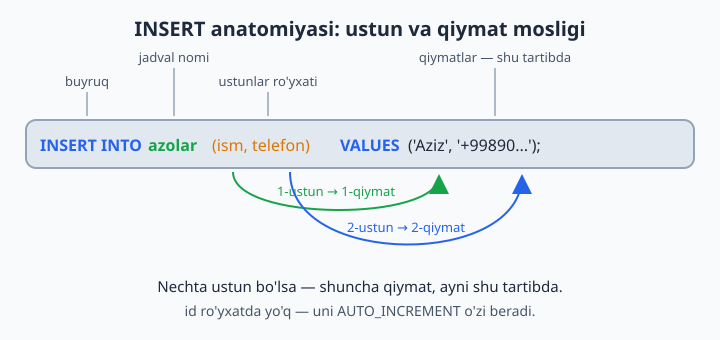
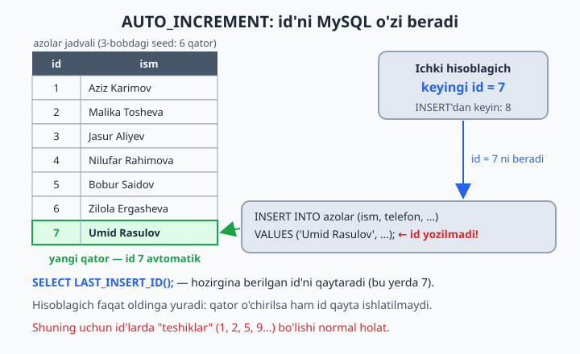
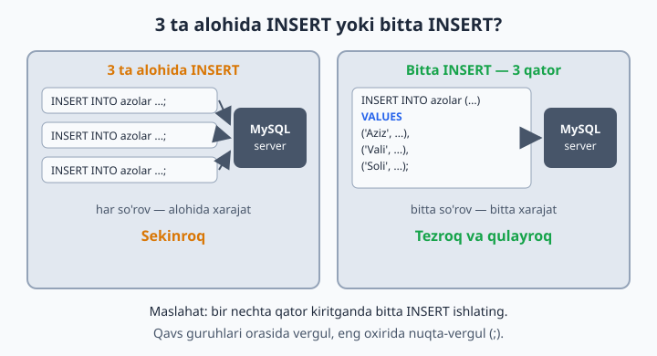

# 06 — INSERT — ma'lumot kiritish

[⬅️ Oldingi: 05 — Ma'lumot turlari](./05-malumot-turlari.md) · [🏠 README](./README.md) · [Keyingi: 07 — SELECT — ma'lumot o'qish ➡️](./07-select.md)

> **Bu bobda:** jadvalga yangi qator qo'shishni o'rganamiz: `INSERT INTO` sintaksisining anatomiyasi, bitta va bir nechta qatorni birdan kiritish, `AUTO_INCREMENT` va `DEFAULT` qanday ishlashi, `NOW()` va `LAST_INSERT_ID()` yordamchilari hamda eng ko'p uchraydigan INSERT xatolarini o'qib tushunish.

---

4-bobda jadval yaratdik — bu xuddi ustunlari chizilgan bo'sh daftar tayyorlash edi. Endi unga birinchi yozuvlarni kiritamiz. Kutubxonaga yangi a'zo keldi, do'konga yangi mahsulot keltirildi, klinikaga yangi bemor yozildi — bularning hammasi SQL tilida bitta buyruq: `INSERT`.

## Asosiy shakl

```sql
INSERT INTO jadval (ustun1, ustun2) VALUES (qiymat1, qiymat2);
```

O'qilishi: "*jadval*ga, *shu ustunlarga*, *shu qiymatlarni* kirit". Eng muhim qoida — **moslik**: birinchi ustun birinchi qiymatni oladi, ikkinchi ustun — ikkinchisini. Ustunlar nechta bo'lsa, qiymatlar ham shuncha bo'lishi shart.



Amalda ko'ramiz:

```sql
USE kutubxona;

-- Bitta qator:
INSERT INTO azolar (ism, telefon, qoshilgan_sana)
VALUES ('Umid Rasulov', '+998907778899', '2026-06-09');
```

E'tibor bering: `id` ustunini umuman yozmadik. Bu xato emas — aksincha, to'g'ri odat.

## AUTO_INCREMENT — id'ni MySQL o'zi beradi

`azolar` jadvalini yaratganda `id INT AUTO_INCREMENT PRIMARY KEY` deb yozgan edik. Bu MySQL'ga "har yangi qatorga navbatdagi raqamni o'zing ber" degani. MySQL har bir bunday jadval uchun ichki hisoblagich yuritadi: oxirgi id 3 bo'lsa, keyingi qator 4 ni oladi, hisoblagich esa 5 ga o'tadi. Siz hech qachon "bo'sh id qaysi ekan?" deb o'ylamaysiz.



Hozirgina berilgan id kerak bo'lsa (masalan, buyurtma yaratib, keyin uning qatorlarini shu id bilan qo'shish uchun):

```sql
SELECT LAST_INSERT_ID();   -- shu ulanishda oxirgi berilgan id
```

📌 Hisoblagich faqat oldinga yuradi: qatorni o'chirsangiz ham, uning id'si qayta ishlatilmaydi. Shuning uchun id'larda "teshiklar" (1, 2, 5, 9...) bo'lishi mutlaqo normal — id tartib raqami emas, shunchaki har bir qatorning takrorlanmas yorlig'i.

## Bir nechta qatorni birdan

Har bir qator uchun alohida INSERT yozish shart emas — qiymat guruhlarini vergul bilan ajratib, hammasini bittada kiritish mumkin:

```sql
INSERT INTO azolar (ism, telefon, qoshilgan_sana) VALUES
('Sitora Yusupova', '+998908889900', '2026-06-09'),
('Akbar Toirov', NULL, '2026-06-09');
```

Bu shunchaki qulay emas — **tezroq** ham: server bitta so'rovni qabul qilib, hammasini bir yo'la yozadi. 1000 ta qatorni 1000 ta alohida INSERT bilan kiritish — do'konga 1000 marta alohida borib, har safar bittadan non olib kelish bilan barobar.



Sintaksisga e'tibor: har bir qator o'z qavsida, qavs guruhlari **orasida vergul**, eng oxirida — nuqta-vergul.

## Qiymat yozish qoidalari

- Matn va sana — bitta tirnoq ichida: `'Aziz'`, `'2026-06-09'`
- Sonlar — tirnoqsiz: `25`, `4200000`
- Bo'sh qiymat — `NULL` (tirnoqsiz! `'NULL'` deb yozsangiz, u to'rt harfli oddiy matn bo'lib qoladi)
- Hozirgi sana-vaqt — `NOW()`, faqat bugungi sana — `CURDATE()` (bular ham tirnoqsiz)
- Ustunlar va qiymatlar **soni va tartibi mos** kelishi shart

📌 SQL standartida matn uchun **bitta tirnoq** (`'`) ishlatiladi. MySQL qo'shtirnoqni (`"`) ham qabul qiladi, lekin boshqa bazalarda (masalan, PostgreSQL'da) qo'shtirnoq butunlay boshqa ma'noni anglatadi — shuning uchun boshidanoq bitta tirnoqqa odatlaning.

## Ko'rsatilmagan ustunga nima yoziladi?

Ustunni ro'yxatda tashlab ketsangiz, MySQL shu tartibda qaror qiladi:

| Ustun ta'rifida nima bor | Natija |
|---|---|
| `AUTO_INCREMENT` | navbatdagi raqam beriladi |
| `DEFAULT qiymat` | o'sha standart qiymat yoziladi |
| `NULL`ga ruxsat (NOT NULL yo'q) | `NULL` qoladi |
| `NOT NULL` bor, DEFAULT yo'q | xato — qator kiritilmaydi |

```sql
USE dokon;

INSERT INTO mahsulotlar (nomi, kategoriya_id, narx)
VALUES ('Klaviatura Logitech', 3, 250000);
-- soni ko'rsatilmadi      → DEFAULT 0 yozildi
-- yaratilgan_sana ham yo'q → NULL qoldi (ruxsat bor)
```

## Ustunlarsiz shakl — qisqa, lekin xavfli

```sql
USE kutubxona;

INSERT INTO azolar VALUES (NULL, 'Test User', '+998900000000', '2026-06-09');
```

Ustunlar ro'yxatini yozmasangiz, **hamma** ustunga, jadvaldagi **ayni tartibda** qiymat berishingiz shart (`id` o'rnida `NULL` — AUTO_INCREMENT baribir o'zi raqam beradi). Nega bu xavfli? Ertaga jadvalga bitta yangi ustun qo'shilsa, bu kod darhol buziladi (`Column count doesn't match` xatosi); agar ustunlar qayta tartiblansa yoki bir xil turdagi ikki ustun o'rin almashtirilsa — undan ham yomoni — xato ham chiqmaydi, qiymatlar indamay noto'g'ri ustunlarga tushib qoladi. Real loyihalarda har doim ustunlar ro'yxatini yozing.

## Ko'p uchraydigan xatolar

```sql
USE kutubxona;

-- NOT NULL ustunni tashlab ketish:
INSERT INTO azolar (telefon) VALUES ('+99890...');
-- Xato: Field 'ism' doesn't have a default value

-- UNIQUE'ni buzish:
INSERT INTO dokon.mijozlar (ism, telefon) VALUES ('Test', '+998911234567');
-- Xato: Duplicate entry '+998911234567' for key ... — bu telefon allaqachon bor

-- Ustun soni mos emas:
INSERT INTO azolar (ism, telefon) VALUES ('Aziz');
-- Xato: Column count doesn't match value count at row 1
```

Eng tez-tez uchraydigan xabarlar va ma'nolari:

| Xato xabari | Sababi |
|---|---|
| `Field '...' doesn't have a default value` | NOT NULL ustun tashlab ketildi |
| `Duplicate entry '...' for key ...` | UNIQUE yoki PRIMARY KEY qiymati takrorlandi |
| `Column count doesn't match value count` | ustunlar va qiymatlar soni teng emas |
| `Incorrect integer value` / `Incorrect decimal value` | son kutilgan joyga matn kiritildi |
| `Data too long for column '...'` | matn `VARCHAR(N)` chegarasidan uzun |

Xato xabarlarini **o'qishni** o'rganing — MySQL aniq qaysi ustunda, qaysi qatorda muammo borligini aytadi. Xato — dushman emas, yo'l ko'rsatkich.

## 6-bob masalalari

> Mos bazada ishlang (har masala boshida ko'rsatilgan).

1. (kutubxona) Yangi muallif qo'shing: o'zingiz bilgan yozuvchi
2. (kutubxona) O'sha muallifga 2 ta kitob qo'shing (muallif_id ni to'g'ri ko'rsating — `SELECT * FROM mualliflar` bilan id'sini toping)
3. (kutubxona) Telefoni yo'q (NULL) a'zo qo'shing
4. (kutubxona) 3 ta a'zoni BITTA INSERT bilan qo'shing
5. (dokon) Yangi kategoriya qo'shing: 'Kitoblar'
6. (dokon) Shu kategoriyaga 3 ta mahsulot qo'shing
7. (dokon) `soni` ko'rsatmasdan mahsulot qo'shing — DEFAULT 0 ishladimi? SELECT bilan tekshiring
8. (dokon) Mavjud telefon raqami bilan mijoz qo'shib ko'ring — UNIQUE xatosini oling
9. (klinika) O'zingizni bemor sifatida qo'shing
10. (klinika) Yangi shifokor qo'shing va unga bugungi sanada bitta qabul yozing (NOW() dan foydalaning: `VALUES (..., NOW(), ...)`)
11. (taksi) Yangi haydovchi va uning mashinasini qo'shing (2 ta INSERT)
12. (taksi) Baho qo'yilmagan (NULL) safar qo'shing
13. (kutubxona) Ataylab xato: `ism`siz a'zo kiriting — xatoni o'qing
14. (kutubxona) Ataylab xato: 3 ustun ko'rsatib 2 qiymat bering
15. (dokon) Ataylab xato: narxga `'qimmat'` deb matn kiriting — nima bo'ldi?
16. (kutubxona) `INSERT INTO azolar VALUES (NULL, 'Test User', '+998900000000', '2026-06-09');` — ustunlarsiz shakl. NULL o'rnida id avtomatik berildi. Lekin nega bu usul xavfli? (jadvalga ustun qo'shilsa kod buziladi)
17. (klinika) Bitta INSERT bilan 4 ta bemor qo'shing
18. (taksi) Bugungi sana uchun 3 ta safar qo'shing, NOW() ishlating
19. (dokon) Buyurtma yarating: avval `buyurtmalar`ga, keyin uning id'si bilan `buyurtma_qatorlari`ga 2 ta mahsulot qo'shing. Oxirgi id'ni bilish: `SELECT LAST_INSERT_ID();`
20. (hammasi) Har bir bazaga kamida 2 tadan yangi qator qo'shib, jadvallaringizni "boyitib" oling — keyingi boblarda ko'proq data foydali
