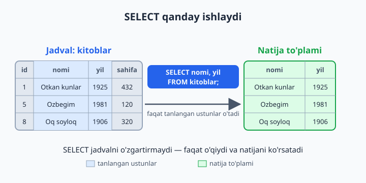
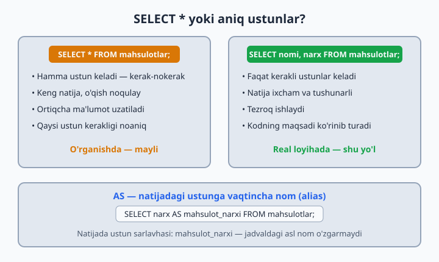

# 07 — SELECT — ma'lumot o'qish

[⬅️ Oldingi: 06 — INSERT — ma'lumot kiritish](./06-insert.md) · [🏠 README](./README.md) · [Keyingi: 08 — WHERE — filtrlash ➡️](./08-where.md)

> **Bu bobda:** SQL'ning yuragi — SELECT bilan jadvaldan ma'lumot o'qishni o'rganamiz: kerakli ustunlarni tanlash, ustunlarga vaqtincha nom berish (AS alias), SELECT ichida hisob-kitob qilish va DISTINCT bilan takror qiymatlarni olib tashlash.

---

O'tgan bobda jadvallarga ma'lumot kiritdik. Endi eng muhim savol: uni qanday o'qib olamiz? Javob — `SELECT`. Bu SQL'dagi eng ko'p ishlatiladigan buyruq: real tizimlarda so'rovlarning aksariyati aynan o'qish (saytni ochsangiz — SELECT, qidirsangiz — SELECT, profilingizni ko'rsangiz — yana SELECT). Va xotirjam bo'ling: `SELECT` jadvaldagi ma'lumotni **hech qachon o'zgartirmaydi** — faqat o'qiydi.



## Asosiy shakllar

```sql
USE kutubxona;

SELECT * FROM kitoblar;                  -- hamma ustun, hamma qator
SELECT nomi FROM kitoblar;               -- bitta ustun
SELECT nomi, yil FROM kitoblar;          -- bir nechta ustun
SELECT nomi AS kitob, yil AS chiqqan_yili FROM kitoblar;   -- alias (vaqtincha nom)
```

O'qilishi oddiy: `SELECT` — "tanla", `FROM` — "qayerdan". Ya'ni: "kitoblar jadvalidan nomi va yil ustunlarini tanla".

Yana ikkita foydali fakt:

- SELECT qaytargan narsa **natija to'plami** (result set) deyiladi — bu vaqtinchalik "jadvalcha": ekranga chiqadi, lekin bazada saqlanmaydi.
- Ustunlar **siz yozgan tartibda** chiqadi. `SELECT yil, nomi FROM kitoblar;` desangiz, natijada avval yil, keyin nom turadi — jadvaldagi tartib muhim emas.

## SELECT * yoki aniq ustunlar?

`*` — "hamma ustun" degani. O'rganishda va jadvalga tez ko'z tashlashda juda qulay. Lekin real dasturlarda kerakli ustunlarni sanab yozish yaxshi odat:

| | `SELECT *` | Aniq ustunlar |
|---|---|---|
| Nima keladi | hamma ustun, kerak-nokerak | faqat so'raganlaringiz |
| Tezlik | ortiqcha ma'lumot uzatiladi | yengilroq, tezroq |
| O'qish | keng va chalkash natija | ixcham, maqsadi aniq |
| Qachon ishlatamiz | o'rganish, tez tekshirish | real dastur kodi |



## AS — ustunga vaqtincha nom (alias)

Alias — natija to'plamidagi ustun sarlavhasiga beriladigan vaqtincha nom. Jadvaldagi asl ustun nomi joyida qoladi — alias faqat shu bitta so'rovning natijasida amal qiladi.

```sql
SELECT nomi AS kitob_nomi, sahifa AS betlar_soni FROM kitoblar;

-- AS so'zisiz ham ishlaydi, lekin AS bilan o'qish osonroq:
SELECT nomi kitob_nomi FROM kitoblar;

-- Bo'shliqli nom kerak bo'lsa — teskari tirnoq (`) ichiga oling:
SELECT nomi AS `kitob nomi` FROM kitoblar;
```

💡 Alias ayniqsa hisob-kitobli ustunlarda asqotadi — aks holda ustun sarlavhasi `narx * soni` kabi "xunuk" ifoda bo'lib chiqadi.

## Hisob-kitob SELECT ichida

SELECT ichida arifmetik amallar ishlatish mumkin: `+`, `-`, `*`, `/` va `%` (qoldiq).

```sql
SELECT nomi, narx, narx * soni AS jami_qiymat
FROM dokon.mahsulotlar;

SELECT nomi, sahifa, sahifa / 30 AS oqish_kunlari   -- kuniga 30 bet o'qisak
FROM kitoblar;
```

Bilib qo'ying:

- 📌 Hisob faqat **natija to'plamida** bajariladi — jadvaldagi `narx` ham, `soni` ham o'z joyida, o'zgarmagan holda qoladi.
- 💡 `/` doim kasr qaytaradi: `432 / 30` → `14.4000`. Faqat butun qismi kerak bo'lsa, `sahifa DIV 30` deb yozing.
- ⚠️ Agar hisobda qatnashayotgan ustunda `NULL` bo'lsa, natija ham `NULL` bo'ladi. Masalan, `taksi.safarlar`da `baho * 2` — baho qo'yilmagan safarlar uchun `NULL` chiqadi.

## FROM'siz SELECT — kalkulyator rejimi

MySQL'da jadvalsiz ham SELECT yozsa bo'ladi — kalkulyator kabi:

```sql
SELECT 2 + 3;             -- 5
SELECT 5 * 8 AS javob;    -- ustun nomi: javob
SELECT NOW();             -- hozirgi sana-vaqt
```

Bu rejim funksiyalarni tez sinab ko'rish uchun juda qulay — keyingi boblarda ko'p ishlatamiz.

## DISTINCT — takrorlarsiz

`DISTINCT` natijadagi takror qiymatlarni olib tashlaydi — har qiymat faqat bir marta chiqadi:

```sql
SELECT DISTINCT janr FROM kitoblar;        -- har janr bir marta
SELECT DISTINCT shahar FROM dokon.mijozlar;
```

Bir nechta ustun bilan yozsangiz, DISTINCT ustunlar **kombinatsiyasiga** qaraydi:

```sql
SELECT DISTINCT boshlanish, tugash FROM taksi.safarlar;
-- boshlanish + tugash JUFTLIGI takrorlanmaydi:
-- 'Markaz → Chilonzor' yo'nalishida ikkita safar bor, natijada bir marta chiqadi
```

📌 DISTINCT uchun `NULL` ham oddiy qiymat — takror NULL'lar bitta bo'lib chiqadi.

## 7-bob masalalari

> Har masala qaysi bazada ishlashi qavsda ko'rsatilgan.

1. (kutubxona) Barcha kitoblarni chiqaring
2. (kutubxona) Faqat kitob nomlarini chiqaring
3. (kutubxona) Kitob nomi va yilini chiqaring
4. (kutubxona) Ustunlarga o'zbekcha alias bering: `nomi AS kitob_nomi, sahifa AS betlar_soni`
5. (kutubxona) Barcha janrlarni takrorsiz chiqaring (DISTINCT)
6. (kutubxona) Mualliflarning davlatlarini takrorsiz chiqaring
7. (dokon) Mahsulot nomi va narxini chiqaring
8. (dokon) Har mahsulot uchun `narx * soni` ni `ombor_qiymati` aliasi bilan hisoblang
9. (dokon) Mijozlar yashaydigan shaharlarni takrorsiz chiqaring
10. (dokon) Narxni ming so'mda ko'rsating: `narx / 1000 AS ming_somda`
11. (klinika) Shifokorlar ismi va mutaxassisligini chiqaring
12. (klinika) Har shifokor uchun 10 ta qabuldan tushadigan summani hisoblang: `qabul_narxi * 10`
13. (klinika) Bemorlarning takrorsiz jinslarini chiqaring (natija nechta qator bo'ladi?)
14. (taksi) Safarlar: boshlanish, tugash, narx ustunlarini chiqaring
15. (taksi) Har safar uchun 1 km narxini hisoblang: `narx / masofa_km AS km_narxi`
16. (taksi) Haydovchilarga 20% komissiya: haydovchiga qoladigan ulushni hisoblang — `narx * 0.8 AS haydovchi_ulushi`
17. (taksi) Safar boshlanish nuqtalarini takrorsiz chiqaring
18. `SELECT 5;` `SELECT 'matn';` `SELECT 5, 'matn', NOW();` — FROM'siz SELECT ham ishlaydi, sinang
19. (dokon) `SELECT *` va kerakli 2 ustunli SELECT'ni bajarib, natija kengligini solishtiring — qaysi birini o'qish oson?
20. (hammasi) Har bazadan bittadan o'zingiz savol o'ylab, SELECT yozing
