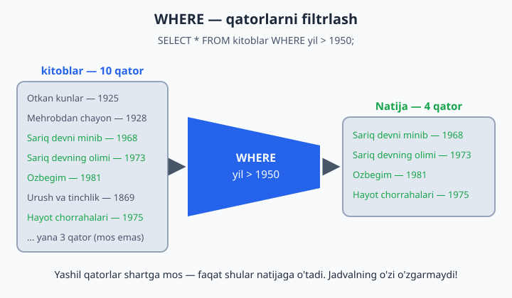
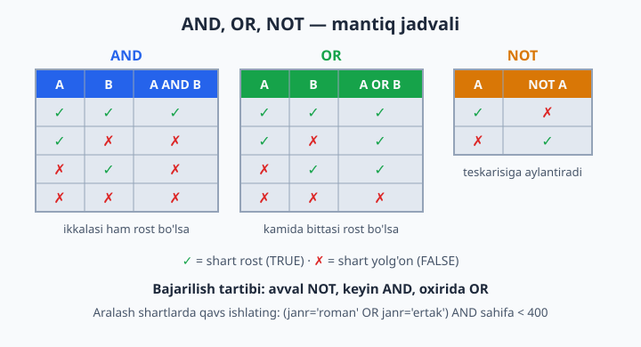
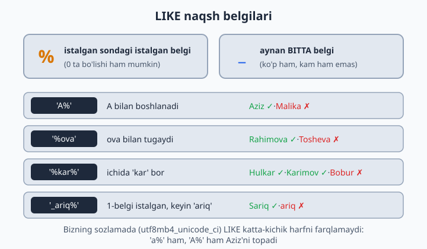

# 08 — WHERE — filtrlash

[⬅️ Oldingi: 07 — SELECT — ma'lumot o'qish](./07-select.md) · [🏠 README](./README.md) · [Keyingi: 09 — ORDER BY, LIMIT, DISTINCT ➡️](./09-order-limit-distinct.md)

> **Bu bobda:** WHERE yordamida jadvaldan faqat kerakli qatorlarni ajratib olishni o'rganamiz: taqqoslash operatorlari (`=`, `!=`, `>`, `<`), AND/OR/NOT mantiqiy bog'lovchilari va qavslar, BETWEEN va IN, LIKE bilan naqsh bo'yicha qidirish hamda NULL bilan to'g'ri ishlash (`IS NULL`).

---

WHERE — SQL'ning eng ko'p ishlatiladigan qismi. "Hammasi emas, faqat KERAKLILARI" degani. Buni g'alvirga o'xshating: jadvaldagi HAR BIR qator shartdan o'tkaziladi — shart rost bo'lsa, qator natijaga tushadi; yolg'on bo'lsa, elakda qolib ketadi. Muhim jihati: WHERE jadvaldagi ma'lumotni o'chirmaydi, faqat KO'RSATILADIGAN qatorlarni tanlaydi.

```sql
SELECT ustunlar FROM jadval WHERE shart;
```



## Taqqoslash operatorlari

| Operator | Ma'nosi | Misol |
|----------|---------|-------|
| `=` | teng | `janr = 'roman'` |
| `!=` yoki `<>` | teng emas | `janr != 'roman'` |
| `>` | katta | `yil > 1950` |
| `<` | kichik | `sahifa < 300` |
| `>=` | katta yoki teng | `yil >= 1950` |
| `<=` | kichik yoki teng | `yil <= 1928` |

```sql
SELECT * FROM kitoblar WHERE yil > 1950;        -- katta
SELECT * FROM kitoblar WHERE yil <= 1928;       -- kichik yoki teng
SELECT * FROM kitoblar WHERE janr = 'roman';    -- teng
SELECT * FROM kitoblar WHERE janr != 'roman';   -- teng emas (<> ham shu)
```

📌 Matn qiymatlari doim bitta tirnoq ichida yoziladi: `'roman'`. Sonlar tirnoqsiz: `1950`. Tirnoqni unutsangiz (`janr = roman`), MySQL `roman` degan USTUN qidiradi va "Unknown column" xatosini beradi.

## AND, OR, NOT — shartlarni birlashtirish

Bitta shart kamlik qilsa, ularni mantiqiy bog'lovchilar bilan ulaymiz:

```sql
-- IKKALA shart ham bajarilsin:
SELECT * FROM kitoblar WHERE janr = 'roman' AND yil > 1900;

-- KAMIDA BITTASI bajarilsin:
SELECT * FROM kitoblar WHERE janr = 'ertak' OR janr = 'sheriyat';

-- Shartning TESKARISI:
SELECT * FROM kitoblar WHERE NOT janr = 'roman';   -- roman bo'lmaganlar
```



**Qavslar — aralash shartlarda majburiy.** SQL avval `NOT`ni, keyin `AND`ni, oxirida `OR`ni bajaradi — xuddi matematikada ko'paytirish qo'shishdan oldin bajarilgani kabi:

```sql
-- Maqsad: 400 betdan kam roman YOKI sarguzashtlar
SELECT * FROM kitoblar
WHERE (janr = 'roman' OR janr = 'sarguzasht') AND sahifa < 400;

-- ❌ Qavssiz yozsak, ma'no o'zgaradi:
--   WHERE janr = 'roman' OR janr = 'sarguzasht' AND sahifa < 400
-- SQL buni shunday tushunadi:
--   WHERE janr = 'roman' OR (janr = 'sarguzasht' AND sahifa < 400)
-- Natija: HAMMA romanlar (hatto 1225 betlik "Urush va tinchlik" ham!)
--         + 400 betdan kam sarguzashtlar
```

💡 Oddiy qoida: `AND` va `OR` bitta so'rovda aralashgan zahoti qavs qo'ying. Hatto shart bo'lmasa ham — niyatingiz kodni o'qigan odamga (va bir oydan keyingi o'zingizga) darrov tushunarli bo'ladi.

## BETWEEN va IN — qisqa yozish usullari

```sql
SELECT * FROM kitoblar WHERE yil BETWEEN 1900 AND 1950;       -- ikkala chegara ham kiradi
SELECT * FROM kitoblar WHERE janr IN ('roman', 'ertak');      -- ro'yxatdan biri
SELECT * FROM kitoblar WHERE janr NOT IN ('roman', 'ertak');  -- ro'yxatda yo'qlar
```

Ikkalasi ham uzun shartning qisqa, o'qishga qulay shakli:

| Qisqa yozuv | Uzun ekvivalenti |
|-------------|------------------|
| `yil BETWEEN 1900 AND 1950` | `yil >= 1900 AND yil <= 1950` |
| `janr IN ('roman', 'ertak')` | `janr = 'roman' OR janr = 'ertak'` |

📌 `BETWEEN` ikkala chegarani ham O'Z ICHIGA oladi: 1900-yilgi kitob ham, 1950-yilgisi ham natijaga kiradi.

💡 `BETWEEN` sanalar bilan ham juda qulay: `WHERE olingan_sana BETWEEN '2026-05-01' AND '2026-05-31'` — may oyidagi ijaralar.

## LIKE — naqsh bo'yicha qidirish

Aniq qiymatni emas, "shunga O'XSHASH" matnni qidirish kerak bo'lsa — `LIKE`. Ikkita maxsus belgi bor:

- `%` — istalgan miqdordagi istalgan belgi (0 ta ham bo'lishi mumkin)
- `_` — aynan BITTA belgi

```sql
SELECT * FROM azolar WHERE ism LIKE 'A%';        -- A bilan boshlanadi
SELECT * FROM azolar WHERE ism LIKE '%ova';      -- ova bilan tugaydi
SELECT * FROM azolar WHERE ism LIKE '%kar%';     -- ichida kar bor
SELECT * FROM kitoblar WHERE nomi LIKE '_ariq%'; -- 1-belgi istalgan, keyin 'ariq' ("Sariq...")
```



📌 Bizning sozlamada (utf8mb4_unicode_ci) `LIKE` katta-kichik harfni farqlamaydi: `'a%'` ham, `'A%'` ham 'Aziz Karimov'ni topadi.

💡 `'%kar%'` kabi ikki tomoni `%` bilan qidirish katta jadvallarda sekin ishlaydi — sababini 21-bobda (indekslar) ko'ramiz. Hozircha bemalol ishlataverasiz.

## NULL — alohida dunyo!

**Eng muhim qoida:** NULL bilan `=` ishlamaydi!

```sql
SELECT * FROM azolar WHERE telefon = NULL;       -- ❌ HECH NARSA qaytarmaydi!
SELECT * FROM azolar WHERE telefon IS NULL;      -- ✅ telefoni yo'qlar
SELECT * FROM azolar WHERE telefon IS NOT NULL;  -- ✅ telefoni borlar
```

Nega? NULL — "noma'lum" degani. "Noma'lum noma'lumga tengmi?" — buni bilib bo'lmaydi, javob ham noma'lum :) WHERE esa faqat aniq ROST bo'lgan qatorlarni o'tkazadi — shuning uchun `= NULL` bo'sh natija qaytaradi (xato ham bermaydi, shunisi xavfli!). NULL uchun maxsus tekshiruv bor: `IS NULL` va `IS NOT NULL`. Esda tuting: `!= NULL` ham xuddi `= NULL` kabi ishlamaydi.

Amaliy foydasi: `ijaralar`da `qaytarilgan_sana IS NULL` = kitob hali qaytarilmagan!

```sql
-- Hozir kimning qo'lida kitob bor:
SELECT * FROM ijaralar WHERE qaytarilgan_sana IS NULL;
```

## Tez-tez uchraydigan xatolar

**1. Alias'ni WHERE'da ishlatish.** MySQL avval WHERE'ni tekshiradi, SELECT'dagi alias esa undan KEYIN "tug'iladi" — shuning uchun WHERE alias'ni tanimaydi:

```sql
-- ❌ Xato: Unknown column 'jami'
SELECT nomi, narx * soni AS jami
FROM dokon.mahsulotlar
WHERE jami > 50000000;

-- ✅ To'g'ri: ifodani WHERE'da qaytadan yozamiz
SELECT nomi, narx * soni AS jami
FROM dokon.mahsulotlar
WHERE narx * soni > 50000000;
```

**2. `= NULL` yozish** — yuqorida ko'rdik: `IS NULL` ishlating.

**3. Tirnoqni unutish** — `WHERE shahar = Toshkent` ❌ (MySQL "Toshkent" degan ustunni qidiradi), `WHERE shahar = 'Toshkent'` ✅.

## 8-bob masalalari

Har masalaga alohida SELECT yozing. Avval natijani xayolan taxmin qiling, keyin bajarib tekshiring — shunda WHERE miyaga yaxshi o'rnashadi.

1. (kutubxona) 1950-yildan keyin chiqqan kitoblar
2. (kutubxona) Janri 'roman' bo'lgan kitoblar
3. (kutubxona) 300 betdan kam kitoblar
4. (kutubxona) Roman janridagi VA 400 betdan ko'p kitoblar
5. (kutubxona) Ertak YOKI she'riyat janridagi kitoblar — ikki usulda: OR va IN (eslatma: bazada janr `'sheriyat'` deb yozilgan)
6. (kutubxona) 1900–1970 oralig'ida chiqqan kitoblar (BETWEEN)
7. (kutubxona) Nomi 'S' bilan boshlanadigan kitoblar
8. (kutubxona) Ismi 'ova' bilan tugaydigan a'zolar
9. (kutubxona) Telefoni YO'Q a'zolar (IS NULL)
10. (kutubxona) Hali qaytarilmagan ijaralar
11. (kutubxona) Nusxa soni 3 dan kam VA 1950-yilgacha chiqqan kitoblar
12. (dokon) Narxi 5 mln dan qimmat mahsulotlar
13. (dokon) Omborda tugagan (soni = 0) mahsulotlar
14. (dokon) Narxi 1–5 mln oralig'idagi mahsulotlar
15. (dokon) Toshkentlik mijozlar
16. (dokon) Toshkentlik BO'LMAGAN mijozlar (2 usul: != va NOT IN)
17. (dokon) 'yetkazildi' yoki 'yolda' holatidagi buyurtmalar
18. (dokon) Nomida 'Samsung' so'zi bor mahsulotlar
19. (klinika) 10 yildan ortiq tajribali shifokorlar; 2000-yildan keyin tug'ilgan bemorlar; tashxisida 'tish' so'zi bor qabullar — 3 ta alohida so'rov
20. (taksi) Bahosi 4 dan past safarlar; baho qo'yilmagan safarlar; 15 km dan uzun VA 40000 dan qimmat safarlar; Chilonzordan boshlangan YOKI Chilonzorda tugagan safarlar — 4 ta alohida so'rov
