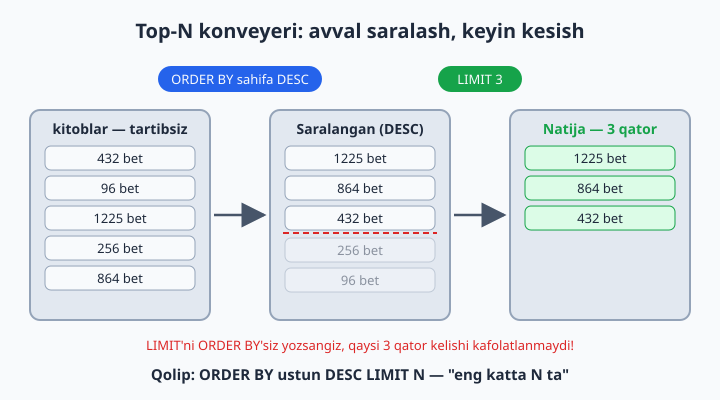
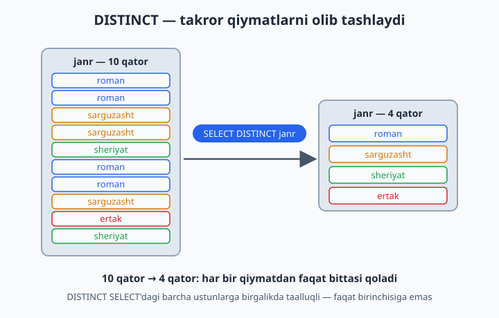

# 09 — ORDER BY, LIMIT, DISTINCT

[⬅️ Oldingi: 08 — WHERE — filtrlash](./08-where.md) · [🏠 README](./README.md) · [Keyingi: 10 — Built-in funksiyalar (matn, son, sana) ➡️](./10-builtin-funksiyalar.md)

> **Bu bobda:** natijani `ORDER BY` bilan saralashni (bir va bir necha ustun bo'yicha, ASC/DESC, NULL qayerga tushishini), `LIMIT` va `OFFSET` bilan natijani kesishni ("eng katta N ta" qolipi va sahifalash), `DISTINCT` bilan takror qiymatlarni olib tashlashni o'rganamiz — va oxirida bularning hammasini bitta query ichida to'g'ri tartibda yozishni mashq qilamiz.

---

## ORDER BY — saralash

Muhim haqiqat: `SELECT` qatorlarni **kafolatlangan tartibda qaytarmaydi**. Bugun bir tartibda chiqqani, ertaga ham shunday chiqadi degani emas. Tartib kerakmi — uni doim `ORDER BY` bilan ochiq-oydin aytamiz. Bu xuddi kutubxonachiga "kitoblarni yili bo'yicha terib ber" deb aniq topshiriq berishga o'xshaydi.

```sql
SELECT * FROM kitoblar ORDER BY yil;             -- o'sish tartibida (ASC — default)
SELECT * FROM kitoblar ORDER BY yil DESC;        -- kamayish tartibida
SELECT * FROM kitoblar ORDER BY janr, yil DESC;  -- avval janr A-Z, har janr ichida yil yangi→eski
```

Har xil turdagi ustunlar qanday saralanadi:

| Tur | ASC (default) | DESC |
|---|---|---|
| Son (INT, DECIMAL) | kichik → katta | katta → kichik |
| Matn (VARCHAR) | alifbo: A → Z | Z → A |
| Sana (DATE, DATETIME) | eski → yangi | yangi → eski |

📌 `ORDER BY janr, yil DESC` da `DESC` **faqat `yil`ga** taalluqli! Ikkalasini ham teskari qilmoqchi bo'lsangiz, har biriga alohida yozasiz: `ORDER BY janr DESC, yil DESC`.

💡 NULL ham saralanadi: MySQL'da ASC tartibda NULL'lar **eng boshida**, DESC'da **eng oxirida** chiqadi. Sinab ko'ring: `SELECT * FROM taksi.safarlar ORDER BY baho;` — baho qo'yilmagan safar birinchi chiqadi.

Alias va hisob-kitob natijasi bo'yicha ham saralash mumkin:

```sql
SELECT nomi, narx * soni AS ombor_qiymati
FROM dokon.mahsulotlar
ORDER BY ombor_qiymati DESC;     -- eng "qimmat zaxira" tepada
```

⚠️ Sonlarni VARCHAR ustunda saqlasangiz, ular **matn sifatida** saralanadi: `'10'` `'9'`dan oldin keladi (chunki alifboda `'1'` `'9'`dan kichik). Sonlar uchun doim son turlarini ishlating (5-bobni eslang).

## LIMIT — faqat N ta qator

`LIMIT` natijaning faqat boshidagi N ta qatorini qoldiradi. `OFFSET` esa "boshidan nechtasini tashlab ket" deydi:

```sql
SELECT * FROM kitoblar ORDER BY sahifa DESC LIMIT 3;    -- eng qalin 3 ta kitob
SELECT * FROM kitoblar ORDER BY yil LIMIT 5 OFFSET 5;   -- 6–10-qatorlar (2-"sahifa")
SELECT * FROM kitoblar ORDER BY yil LIMIT 5, 5;         -- xuddi shu: LIMIT offset, soni
```

📌 `LIMIT 5, 5` qisqa yozuvida **birinchi son — OFFSET**, ikkinchisi — qatorlar soni. Chalkashtirib yubormaslik uchun `LIMIT 5 OFFSET 5` shakli tushunarliroq — biz shuni ishlatamiz.

⚠️ `LIMIT`'ni `ORDER BY`'siz yozish — lotereya o'ynash: MySQL qaysi 3 qatorni berishi kafolatlanmagan. "Eng katta", "eng oxirgi", "birinchi" degan so'z bor joyda `ORDER BY` va `LIMIT` doim juft yuradi.

**TOP-N pattern (yodlab oling):** "eng katta/kichik N ta" = `ORDER BY ... DESC/ASC LIMIT N`.

```sql
-- Eng qimmat mahsulot:
SELECT * FROM dokon.mahsulotlar ORDER BY narx DESC LIMIT 1;
```



`LIMIT + OFFSET` — saytlardagi **sahifalash** (pagination) asosi. Har sahifada 5 ta mahsulot ko'rsatsak:

| Sahifa | Query oxiri |
|---|---|
| 1-sahifa | `LIMIT 5 OFFSET 0` |
| 2-sahifa | `LIMIT 5 OFFSET 5` |
| 3-sahifa | `LIMIT 5 OFFSET 10` |

Formula oddiy: `OFFSET = (sahifa - 1) × sahifa_hajmi`.

💡 Qiziq hiyla: `ORDER BY RAND() LIMIT 1` — jadvaldan **tasodifiy** bitta qator. Kichik jadvallarda viktorina savoli tanlash kabi ishlarga qulay (katta jadvallarda sekin ishlaydi).

## DISTINCT — takrorlarni olib tashlash

7-bobda `DISTINCT` bilan qisqacha tanishgan edik, endi chuqurroq ko'ramiz. `DISTINCT` natijadagi **takror qatorlarni** olib tashlaydi — "qanday qiymatlar bor o'zi?" degan savolga javob beradi:

```sql
SELECT janr FROM kitoblar;           -- 10 qator: roman, roman, sarguzasht, ...
SELECT DISTINCT janr FROM kitoblar;  -- 4 qator: roman, sarguzasht, sheriyat, ertak
```



Bir nechta ustun yozsangiz, **kombinatsiya** (juftlik) takrorsiz bo'ladi:

```sql
SELECT DISTINCT boshlanish, tugash FROM taksi.safarlar;
-- 10 safar bor, lekin 9 qator chiqadi: "Markaz → Chilonzor" yo'nalishi 2 marta uchragan
```

📌 `DISTINCT` `SELECT`'dagi **hamma ustunlarga birgalikda** taalluqli, faqat birinchisiga emas. `SELECT DISTINCT janr, yil` deganda "janri takrorlanmasin" emas, "janr+yil juftligi takrorlanmasin" deyilyapti.

`DISTINCT`'ni `ORDER BY` va `LIMIT` bilan birga ishlatish mumkin:

```sql
SELECT DISTINCT janr FROM kitoblar ORDER BY janr;     -- ✅ takrorsiz va alifbo tartibida
-- SELECT DISTINCT janr FROM kitoblar ORDER BY yil;   -- ❌ MySQL 8 xato beradi:
-- DISTINCT bilan faqat SELECT'da BOR ustunlar bo'yicha saralash mumkin
```

Nega xato? Bir janrga bir nechta yil to'g'ri keladi ("roman" 1869 hammi, 1928 hammi?) — MySQL qaysi yil bo'yicha saralashni bilmaydi.

💡 "Nechta **xil** janr bor?" deb sanash uchun `COUNT(DISTINCT janr)` ishlatiladi — bu bilan 11-bobda tanishamiz.

## Hammasi birga — yozish tartibi

Bu bobgacha o'rgangan qismlarimiz queryda **qat'iy tartibda** turadi:

```sql
SELECT DISTINCT ustunlar     -- 1) nimani olamiz (DISTINCT — ixtiyoriy)
FROM jadval                  -- 2) qayerdan
WHERE shart                  -- 3) qaysi qatorlar (filtrlash)
ORDER BY ustun DESC          -- 4) qanday tartibda
LIMIT 5 OFFSET 0;            -- 5) nechtasini (doim eng oxirida)
```

Tartibni buzib `LIMIT 3 ORDER BY yil` yozsangiz — sintaksis xatosi. Hammasi birga ishlagan real misol:

```sql
-- Roman janridagi eng yangi 2 ta kitob:
SELECT nomi, yil FROM kitoblar
WHERE janr = 'roman'
ORDER BY yil DESC
LIMIT 2;
-- Natija: Mehrobdan chayon (1928), Otkan kunlar (1925)
```

## 9-bob masalalari

1. (kutubxona) Kitoblarni yil bo'yicha eski→yangi tartibda chiqaring
2. (kutubxona) Kitoblarni qalinligi bo'yicha qalin→yupqa tartibda chiqaring
3. (kutubxona) Eng eski 3 ta kitob
4. (kutubxona) Eng qalin kitob (1 ta)
5. (kutubxona) Eng yupqa kitob (maslahat: 4-masalaning teskarisi)
6. (kutubxona) A'zolarni qo'shilgan sanasi bo'yicha yangi→eski tartibda chiqaring
7. (kutubxona) Eng oxirgi qo'shilgan 2 ta a'zo
8. (kutubxona) Avval janr bo'yicha alifbo, har janr ichida yil bo'yicha yangi→eski
9. (kutubxona) Mualliflarni tug'ilgan yili bo'yicha saralang va eng keksa 2 tasini chiqaring
10. (dokon) Eng qimmat 3 ta mahsulot
11. (dokon) Eng arzon mahsulot
12. (dokon) Omborda eng ko'p qolgan 3 ta mahsulot
13. (dokon) Mahsulotlar 2-sahifasi: 5 tadan bo'lganda 6–10-mahsulotlar (LIMIT + OFFSET; formulani eslang)
14. (dokon) Eng oxirgi 3 ta buyurtma (sana bo'yicha)
15. (klinika) Eng tajribali shifokor
16. (klinika) Qabul narxi bo'yicha arzon→qimmat shifokorlar; klinikada qanday mutaxassisliklar bor — takrorsiz ro'yxat (DISTINCT) — 2 ta query
17. (klinika) Eng katta yoshli bemor (tug'ilgan_sana bo'yicha o'ylang: eng katta yosh = eng KICHIK sana!)
18. (taksi) Eng uzun 3 ta safar
19. (taksi) Eng qimmat safar; eng yuqori reytingli haydovchi; safarlar qaysi manzillarda tugagan — takrorsiz ro'yxat (DISTINCT) — 3 ta query
20. (taksi) Safarlarni sana bo'yicha yangi→eski, bir xil sanada narx bo'yicha qimmat→arzon tartibda chiqaring (maslahat: ikkinchi kalit faqat birinchisi teng bo'lganda ishga tushadi)
