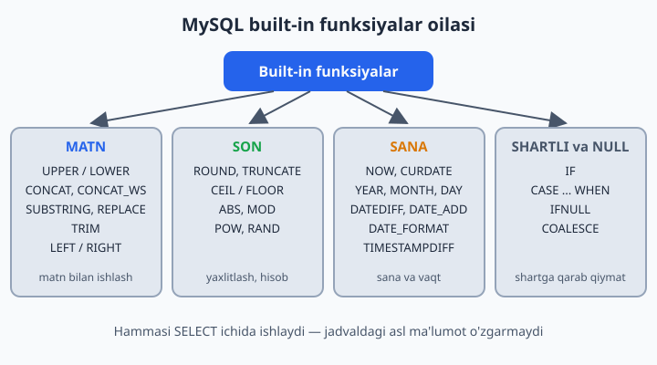
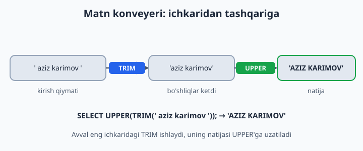
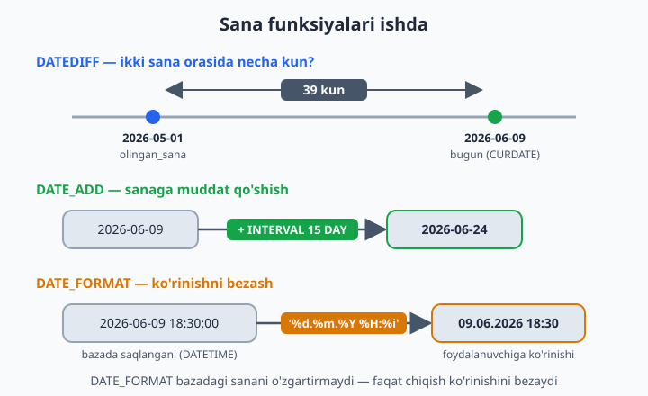

# 10 — Built-in funksiyalar (matn, son, sana)

[⬅️ Oldingi: 09 — ORDER BY, LIMIT, DISTINCT](./09-order-limit-distinct.md) · [🏠 README](./README.md) · [Keyingi: 11 — Aggregate funksiyalar va GROUP BY ➡️](./11-aggregate-group-by.md)

> **Bu bobda:** MySQL'ning tayyor (built-in) funksiyalari bilan tanishamiz: matnni o'zgartirish (UPPER, CONCAT, SUBSTRING, REPLACE), sonlarni yaxlitlash (ROUND, CEIL, FLOOR), sana hisob-kitoblari (NOW, DATEDIFF, DATE_FORMAT, TIMESTAMPDIFF), shartga qarab qiymat tanlash (IF, CASE) va NULL bilan ishlash (IFNULL, COALESCE)ni o'rganamiz.

---

MySQL'da yuzlab tayyor funksiya bor. Ularni kalkulyatordagi tugmalar deb tasavvur qiling: kvadrat ildizni qog'ozda hisoblab o'tirmaysiz — tayyor tugmani bosasiz. SQL funksiyasi ham xuddi shunday ishlaydi: unga qiymat berasiz, u amalni bajarib, natijani qaytaradi. Hammasini yodlash shart emas — bu bobda eng ko'p ishlatiladiganlarini ko'ramiz, qolganini kerak bo'lganda hujjatdan qarab olasiz.

📌 Eng muhim qoida: bu funksiyalar jadvaldagi asl ma'lumotni **o'zgartirmaydi**. Ular faqat SELECT natijasi qanday ko'rinishini belgilaydi: `SELECT UPPER(nomi) ...` deb yozsangiz ham, jadvalda `nomi` avvalgidek o'z holicha qolaveradi. (Ma'lumotni haqiqatan o'zgartirish — UPDATE, uni 17-bobda ko'ramiz.)



## Matn funksiyalari

```sql
SELECT UPPER('salom');                    -- SALOM (katta harfga)
SELECT LOWER('SALOM');                    -- salom (kichik harfga)
SELECT LENGTH('salom');                   -- 5 (BAYTlarda o'lchaydi)
SELECT CHAR_LENGTH('salom');              -- 5 (BELGIlarda o'lchaydi)
SELECT CONCAT('Aziz', ' ', 'Karimov');    -- Aziz Karimov (matnlarni ulaydi)
SELECT SUBSTRING('Salom dunyo', 1, 5);    -- Salom (1-belgidan boshlab 5 ta)
SELECT REPLACE('+998901112233', '+998', '');  -- 901112233 (almashtiradi)
SELECT TRIM('  salom  ');                 -- salom (chetdagi bo'shliqlar ketadi)
SELECT LEFT('Salom', 3);                  -- Sal (boshidan 3 ta)
SELECT RIGHT('Salom', 3);                 -- lom (oxiridan 3 ta)
```

**LENGTH va CHAR_LENGTH — qachon farq qiladi?** Lotin harflarida ikkalasi bir xil son beradi, chunki har lotin harfi 1 bayt joy oladi. Lekin kirill va boshqa "keng" belgilar bir necha bayt egallaydi:

```sql
SELECT LENGTH('Тошкент');       -- 14 (har kirill harfi 2 bayt)
SELECT CHAR_LENGTH('Тошкент');  -- 7  (harflar soni)
```

Xulosa oddiy: "necha ta harf?" degan savolga doim CHAR_LENGTH to'g'ri javob beradi.

**SUBSTRING 1 dan sanaydi.** Ko'p dasturlash tillarida sanash 0 dan boshlanadi, SQL'da esa 1 dan: birinchi belgi — 1-pozitsiya. Uchinchi argumentni yozmasangiz, oxirigacha olib beradi:

```sql
SELECT SUBSTRING('Salom dunyo', 7);  -- dunyo (7-belgidan oxirigacha)
```

**CONCAT'ning NULL tuzog'i.** Argumentlardan bittasi NULL bo'lsa, butun natija NULL bo'lib qoladi. Bunday holatda CONCAT_WS (WS — "with separator", ya'ni ajratuvchi bilan) qutqaradi: birinchi argument ajratuvchi bo'ladi, NULL'larni esa shunchaki tashlab ketadi:

```sql
SELECT CONCAT('Aziz', NULL, 'Karimov');          -- NULL!
SELECT CONCAT_WS(' ', 'Aziz', NULL, 'Karimov');  -- Aziz Karimov
```

Funksiyalarni ichma-ich yozish ham mumkin — MySQL ularni ichkaridan tashqariga qarab hisoblaydi:



## Son funksiyalari

```sql
SELECT ROUND(4.567, 2);     -- 4.57 (2 xonagacha yaxlitlaydi)
SELECT ROUND(4.567);        -- 5 (butun songa yaxlitlaydi)
SELECT TRUNCATE(4.567, 2);  -- 4.56 (yaxlitlamaydi, shunchaki kesadi)
SELECT CEIL(4.1);           -- 5 (doim yuqoriga)
SELECT FLOOR(4.9);          -- 4 (doim pastga)
SELECT ABS(-15);            -- 15 (modul — ishorani tashlaydi)
SELECT MOD(10, 3);          -- 1 (bo'lishdan qolgan qoldiq; 10 % 3 ham shu)
SELECT POW(2, 10);          -- 1024 (daraja: 2 ning 10-darajasi)
SELECT RAND();              -- 0 va 1 orasida tasodifiy son (har safar boshqa)
```

ROUND va TRUNCATE farqiga e'tibor bering: ROUND matematik qoida bo'yicha yaxlitlaydi (4.567 → 4.57), TRUNCATE esa ortiqcha xonalarni shunchaki uzib tashlaydi (4.567 → 4.56). Pul hisob-kitoblarida bu kichik farq katta ahamiyatga ega bo'lishi mumkin!

## Sana funksiyalari

Sanalar bilan ishlash — real loyihalardagi eng ko'p uchraydigan vazifalardan biri: "necha kun o'tdi?", "muddat qachon tugaydi?", "mijoz necha yoshda?". MySQL bunga boy asboblar to'plamini beradi:

```sql
SELECT NOW();                              -- hozirgi sana+vaqt (DATETIME)
SELECT CURDATE();                          -- bugungi sana (faqat DATE)
SELECT YEAR('2026-06-09');                 -- 2026
SELECT MONTH('2026-06-09');                -- 6
SELECT DAY('2026-06-09');                  -- 9
SELECT HOUR('2026-06-09 18:45:00');        -- 18 (MINUTE va SECOND ham bor)
SELECT DAYNAME('2026-06-09');              -- Tuesday (seshanba)
SELECT DATEDIFF('2026-06-09', '2026-05-01');  -- 39 (ikki sana orasidagi kunlar)
SELECT DATE_ADD('2026-06-09', INTERVAL 15 DAY);   -- 2026-06-24 (15 kun keyin)
SELECT DATE_SUB(NOW(), INTERVAL 1 MONTH);          -- 1 oy oldin
SELECT DATE_FORMAT(NOW(), '%d.%m.%Y');             -- masalan: 09.06.2026
SELECT TIMESTAMPDIFF(YEAR, '1990-08-25', CURDATE());  -- yosh hisoblash!
```

📌 DAYNAME (va MONTHNAME) natijani inglizcha qaytaradi. Tilni `lc_time_names` sozlamasi bilan o'zgartirsa bo'ladi (masalan, `SET lc_time_names = 'ru_RU';`), lekin o'zbekcha lokal MySQL'da yo'q — kerak bo'lsa CASE bilan o'zingiz tarjima qilasiz.



**DATE_FORMAT kodlari.** Eng ko'p ishlatiladiganlari:

| Kod | Ma'nosi | Misol |
|------|--------------------|---------|
| `%d` | kun (2 xonali) | 09 |
| `%m` | oy (2 xonali) | 06 |
| `%Y` | yil (4 xonali) | 2026 |
| `%H` | soat (24 soatlik) | 18 |
| `%i` | minut | 05 |
| `%s` | sekund | 30 |
| `%W` | hafta kuni nomi | Tuesday |
| `%M` | oy nomi | June |

⚠️ Klassik tuzoq: minut — `%i`, `%m` emas (`%m` — oy!). `%M` esa umuman boshqa narsa — oy nomi. Katta-kichik harf farqiga diqqat qiling.

**Yosh hisoblashda TIMESTAMPDIFF ishonchli.** "Yillarni bir-biridan ayirib qo'ya qolaman" desangiz, xato chiqishi mumkin:

```sql
-- Bugun 2026-06-10 deb olaylik. 1990-08-25 da tug'ilgan odam:
SELECT TIMESTAMPDIFF(YEAR, '1990-08-25', '2026-06-10');  -- 35 (to'g'ri: avgust hali kelmadi)
SELECT YEAR('2026-06-10') - YEAR('1990-08-25');          -- 36 (xato: 1 yosh oshirib yubordi)
```

TIMESTAMPDIFF faqat **to'liq** o'tgan yillarni sanaydi — xuddi hayotdagidek: odam tug'ilgan kunigacha hali 35 yoshda, 36 emas.

## IF va CASE — shartli qiymat

Ba'zan natija ustunini shartga qarab hosil qilish kerak: omborda mahsulot "bor"mi yoki "tugagan"mi? IF funksiyasi uch qism oladi — IF(shart, rost bo'lsa shu, yolg'on bo'lsa bu):

```sql
SELECT nomi, soni, IF(soni > 0, 'bor', 'tugagan') AS holati
FROM dokon.mahsulotlar;
```

Shartlar ikkitadan ko'p bo'lsa, CASE ishlatamiz. U shartlarni yuqoridan pastga tekshiradi va **birinchi** mos kelganida to'xtaydi — shuning uchun eng kichik chegara birinchi turibdi. ELSE esa "hech biri mos kelmasa" bo'limi:

```sql
SELECT nomi, narx,
    CASE
        WHEN narx < 1000000 THEN 'arzon'
        WHEN narx < 10000000 THEN 'ortacha'
        ELSE 'qimmat'
    END AS toifa
FROM dokon.mahsulotlar;
```

💡 IF() — MySQL'ga xos funksiya, CASE esa SQL standarti: PostgreSQL, SQLite va boshqa bazalarda ham aynan shunday ishlaydi. Shart ikkitadan ko'p bo'lsa yoki kod boshqa bazaga ko'chishi mumkin bo'lsa — CASE'ni tanlang.

## NULL bilan ishlash funksiyalari

8-bobdan eslang: NULL — "qiymat yo'q" degani va u bilan oddiy taqqoslash ishlamaydi. Natijada NULL o'rniga tushunarli matn ko'rsatish uchun ikkita funksiya bor:

```sql
SELECT ism, IFNULL(telefon, 'telefon yoq') FROM kutubxona.azolar;
SELECT COALESCE(NULL, NULL, 'birinchi NULL bolmagan', 'x');  -- 3-qiymat qaytadi
```

- **IFNULL(a, b)** — ikki argument: `a` NULL bo'lmasa `a`ni, NULL bo'lsa `b`ni qaytaradi.
- **COALESCE(...)** — istalgancha argument: chapdan boshlab **birinchi NULL bo'lmagan** qiymatni qaytaradi. "Ish telefoni bo'lsa — shuni, bo'lmasa uy telefonini, u ham bo'lmasa 'aloqa yoq' deb ko'rsat" kabi mantiq uchun juda qulay.

💡 Funksiyalarni WHERE ichida ham bemalol ishlatish mumkin:

```sql
-- 2026-yilda olingan ijaralar:
SELECT * FROM kutubxona.ijaralar WHERE YEAR(olingan_sana) = 2026;
```

Lekin bilib qo'ying: katta jadvalda ustunga funksiya qo'llab filtrlash qidiruvni sekinlashtirishi mumkin — bunga 21-bobda (indekslar) qaytamiz.

## 10-bob masalalari

1. (kutubxona) Kitob nomlarini KATTA harflarda chiqaring
2. (kutubxona) Har kitob nomining uzunligini chiqaring (CHAR_LENGTH)
3. (kutubxona) Muallif ismi va davlatini bitta ustunda: 'Abdulla Qodiriy (Ozbekiston)' — CONCAT
4. (kutubxona) A'zolar telefonidan '+998' ni olib tashlab ko'rsating (REPLACE)
5. (kutubxona) Har kitob necha yoshda: `2026 - yil` yoki YEAR(CURDATE()) - yil
6. (kutubxona) Ijara necha kun davom etgan: DATEDIFF(qaytarilgan_sana, olingan_sana) — qaytarilganlar uchun
7. (kutubxona) Qaytarilmagan kitoblar bugungacha necha kundan beri o'qilmoqda: DATEDIFF(CURDATE(), olingan_sana)
8. (kutubxona) Har ijara uchun "muddat": 15 kundan oshsa 'kechikkan', aks holda 'normal' (IF + DATEDIFF)
9. (dokon) Narxlarni yaxlitlab ming so'mda: ROUND(narx/1000) AS ming_som
10. (dokon) Mahsulot holati CASE bilan: soni=0 → 'tugagan', soni<10 → 'oz qoldi', aks holda 'yetarli'
11. (dokon) Mahsulot nomining birinchi 10 belgisi + '...' (LEFT va CONCAT)
12. (dokon) Buyurtma sanasini '09.06.2026 18:00' formatida (DATE_FORMAT: '%d.%m.%Y %H:%i')
13. (dokon) Har buyurtma qaysi hafta kuni qilinganini chiqaring (DAYNAME)
14. (klinika) Har bemorning yoshini hisoblang (TIMESTAMPDIFF)
15. (klinika) Bemor ismini 'LOLA MIRZAYEVA' ko'rinishida (UPPER)
16. (klinika) Telefoni NULL bo'lsa 'korsatilmagan' deb chiqaring (IFNULL)
17. (klinika) Yosh toifasi CASE bilan: <18 'bola', 18-60 'katta', >60 'keksa'
18. (taksi) Narxni 500 ga yaxlitlang: ROUND(narx/500)*500 — sinab ko'ring va nega aynan shunday yozilishini tushunib oling
19. (taksi) Har safarning km narxini 2 xona aniqlikda: ROUND(narx/masofa_km, 2)
20. (taksi) Safar sanasidan faqat soatni chiqaring (HOUR funksiyasi); 18:00 dan keyingilarga 'kechki', oldingilariga 'kunduzgi' deb belgi qo'ying
