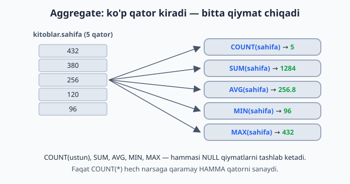
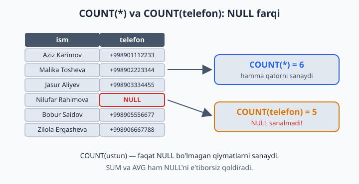
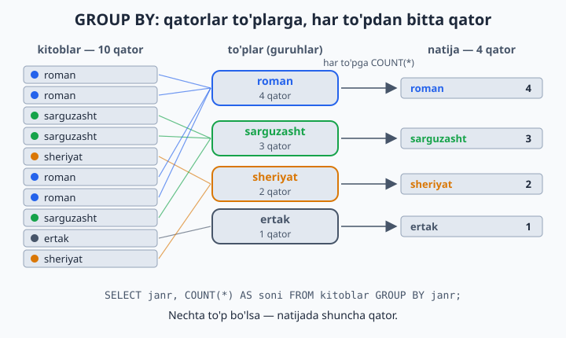
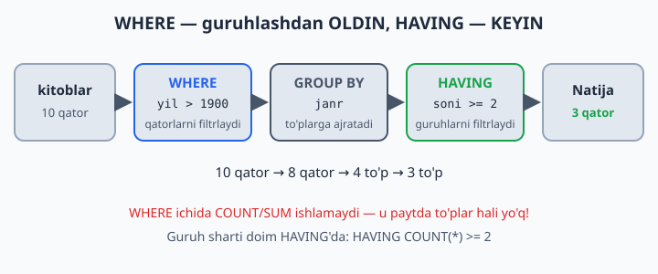

# 11 — Aggregate funksiyalar va GROUP BY

[⬅️ Oldingi: 10 — Built-in funksiyalar (matn, son, sana)](./10-builtin-funksiyalar.md) · [🏠 README](./README.md) · [Keyingi: 12 — JOIN — jadvallarni bog'lash ➡️](./12-join.md)

> **Bu bobda:** ko'p qatordan bitta xulosa chiqaradigan aggregate funksiyalarni (`COUNT`, `SUM`, `AVG`, `MIN`, `MAX`) va "har bir ... bo'yicha" savollariga javob beradigan `GROUP BY`'ni o'rganamiz. Yo'l-yo'lakay `COUNT(*)` va `COUNT(ustun)` orasidagi NULL farqini, tayyor guruhlarni filtrlaydigan `HAVING`'ni va query'ning bajarilish tartibini ko'rib chiqamiz.

---

## Aggregate — ko'p qatordan BITTA natija

Shu paytgacha yozgan query'larimiz qatorlarni **ro'yxat** qilib qaytarardi. Endi boshqa turdagi savollarga o'tamiz: "jami nechta?", "o'rtacha qancha?", "eng kattasi qaysi?". Bunday savollarga ro'yxat emas, **bitta qiymat** javob bo'ladi.

Aggregate funksiya — ko'p qatorni "presslab" bitta qiymat chiqaradigan mashina. Sinf jurnalini eslang: jurnalda 30 ta baho turibdi, lekin "sinfning o'rtacha bahosi" — bitta son. Beshta asosiy aggregate bor:

| Funksiya | Nima qiladi | Qanday savolga javob |
|---|---|---|
| `COUNT(*)` | qatorlarni sanaydi | "jami nechta?" |
| `SUM(ustun)` | yig'indini hisoblaydi | "hammasi qo'shilsa qancha?" |
| `AVG(ustun)` | o'rtachani topadi | "o'rtacha qancha?" |
| `MIN(ustun)` | eng kichigini topadi | "eng kichigi/arzoni/eskisi?" |
| `MAX(ustun)` | eng kattasini topadi | "eng kattasi/qimmati/yangisi?" |

```sql
USE dokon;

SELECT COUNT(*) FROM mahsulotlar;              -- nechta mahsulot bor: 12
SELECT SUM(soni) FROM mahsulotlar;             -- omborda jami nechta dona: 361
SELECT AVG(narx) FROM mahsulotlar;             -- o'rtacha narx: ~5 235 833
SELECT MIN(narx), MAX(narx) FROM mahsulotlar;  -- eng arzon (50 000) va eng qimmat (16 000 000)
```



Bir nechta aggregate'ni bitta query'da yozish mumkin — alias bilan natija chiroyli o'qiladi:

```sql
SELECT COUNT(*)  AS mahsulotlar_soni,
       MIN(narx) AS eng_arzon,
       MAX(narx) AS eng_qimmat
FROM mahsulotlar;
```

⚠️ Eng ko'p uchraydigan boshlovchi xatosi — aggregate yoniga oddiy ustun qo'shib yuborish:

```sql
SELECT nomi, MAX(narx) FROM mahsulotlar;  -- ❌ Error 1140
```

"Eng qimmat mahsulotning nomi chiqadi" deb o'ylash tabiiy, lekin MySQL uchun bu ikkita qarama-qarshi topshiriq: `MAX` 12 qatordan **bitta** son yasaydi, `nomi` esa **12 ta**. Qaysi nomni yozsin? MySQL 8 bunga to'g'ridan-to'g'ri xato beradi. "Eng qimmati qaysi?" degan savolga to'g'ri yo'l — 9-bobdagi tanish qolip:

```sql
SELECT nomi, narx FROM mahsulotlar ORDER BY narx DESC LIMIT 1;
```

## COUNT(*) vs COUNT(ustun) — NULL tuzog'i

Muhim nozik joy:

```sql
SELECT COUNT(*) FROM kutubxona.azolar;        -- 6 — HAMMA qator
SELECT COUNT(telefon) FROM kutubxona.azolar;  -- 5 — kamroq! NULL'lar SANALMAYDI
```

`COUNT(*)` qatorlarning o'zini sanaydi, `COUNT(ustun)` esa shu ustundagi **NULL bo'lmagan** qiymatlarni. Nilufarning telefoni yozilmagan (NULL) — shuning uchun u ikkinchi sanoqqa kirmadi. (6-bobdagi mashqlarda o'zingiz qator qo'shgan bo'lsangiz, sonlaringiz kattaroq chiqadi — farqning o'zi baribir ko'rinadi.)



Xuddi shu qoida `SUM` va `AVG`'ga ham tegishli: ular NULL'larni shunchaki **e'tiborsiz qoldiradi**. Masalan, `AVG(baho)` — baho qo'yilgan safarlarninggina o'rtachasi; NULL'lar yig'indiga ham, bo'luvchiga ham kirmaydi. Bu ko'pincha aynan biz xohlagan narsa, lekin bilib turish kerak.

💡 Yana bir foydali shakl — `COUNT(DISTINCT ustun)`: nechta **har xil** qiymat borligini sanaydi:

```sql
SELECT COUNT(DISTINCT janr) FROM kutubxona.kitoblar;  -- 4 xil janr
```

## GROUP BY — "har bir ... bo'yicha"

Aggregate butun jadvalga **bitta** natija beradi. Savol "har bir ... bo'yicha" bo'lsa-chi? Mana shu yerda `GROUP BY` sahnaga chiqadi. Savolda "**har bir**" so'zini eshitsangiz — bu GROUP BY:

- "**Har bir** janrda nechta kitob?" → `GROUP BY janr`
- "**Har bir** shahardan nechta mijoz?" → `GROUP BY shahar`
- "**Har bir** haydovchi qancha topdi?" → `GROUP BY haydovchi_id`

```sql
USE kutubxona;

SELECT janr, COUNT(*) AS soni
FROM kitoblar
GROUP BY janr;

-- janr       | soni
-- roman      | 4
-- sarguzasht | 3
-- sheriyat   | 2
-- ertak      | 1
```

Qanday ishlaydi: MySQL qatorlarni `janr` qiymati bo'yicha "to'plarga" ajratadi (roman to'pi, sarguzasht to'pi...), keyin **har to'pga alohida** COUNT/SUM/AVG qo'llaydi. Nechta to'p bo'lsa — natijada shuncha qator.



📌 MySQL 8'da GROUP BY natijani **saralamaydi** (eski versiyalarda saralanardi, 8.0 dan bu olib tashlangan) — guruhlar istalgan tartibda chiqishi mumkin. Tartib kerak bo'lsa, oxiriga `ORDER BY` qo'shing.

Har guruhga bir nechta aggregate'ni birdan qo'llash mumkin:

```sql
SELECT janr,
       COUNT(*) AS soni,
       ROUND(AVG(sahifa)) AS ortacha_sahifa
FROM kitoblar
GROUP BY janr;

-- janr       | soni | ortacha_sahifa
-- roman      | 4    | 725
-- sarguzasht | 3    | 288
-- sheriyat   | 2    | 160
-- ertak      | 1    | 96
```

Bir necha ustun bo'yicha guruhlash ham bo'ladi — bunda har bir **kombinatsiya** alohida to'p:

```sql
-- Har mijozning har holatdagi buyurtmalari soni:
SELECT mijoz_id, holat, COUNT(*) AS soni
FROM dokon.buyurtmalar
GROUP BY mijoz_id, holat;

-- mijoz_id | holat      | soni
-- 1        | yetkazildi | 2
-- 1        | yangi      | 1
-- 2        | yetkazildi | 1
-- ...
```

### Oltin qoida (ONLY_FULL_GROUP_BY)

**SELECT'da faqat ikki narsa turishi mumkin: GROUP BY'dagi ustun yoki aggregate funksiya.** Boshqa ustun yozsangiz:

```sql
SELECT janr, nomi, COUNT(*) FROM kitoblar GROUP BY janr;
-- ❌ Error 1055: ...'kutubxona.kitoblar.nomi' is not in GROUP BY clause...
```

Nega? `roman` to'pida 4 ta kitob bor — `nomi` ustuniga MySQL qaysi birini yozsin? To'g'ri javob yo'q. MySQL 8'da `ONLY_FULL_GROUP_BY` rejimi default yoqilgan va bunday query darhol xato bilan to'xtaydi. Eski versiyalarda bu rejim o'chiq edi: MySQL to'pdan **duch kelgan** bitta nomni qaytarardi va xato sezilmasdan noto'g'ri hisobotlar tarqalaverardi. Shuning uchun bu xato — dushman emas, qo'riqchi.

## HAVING — guruhlarni filtrlash

"2 tadan ko'p kitobi bor janrlar" — bu yerda alohida kitoblarni emas, tayyor **to'plarning o'zini** filtrlash kerak. Buning uchun `HAVING` bor:

```sql
SELECT janr, COUNT(*) AS soni
FROM kitoblar
GROUP BY janr
HAVING soni > 2;

-- roman      | 4
-- sarguzasht | 3
```

**WHERE vs HAVING:**

| | `WHERE` | `HAVING` |
|---|---|---|
| Nimani filtrlaydi | alohida **qatorlarni** | tayyor **guruhlarni** |
| Qachon ishlaydi | guruhlashdan **oldin** | guruhlashdan **keyin** |
| Aggregate (COUNT, SUM...) | ❌ ishlatib bo'lmaydi | ✅ bemalol |

Ikkalasi bitta query'da bemalol birga keladi — har biri o'z ishini qiladi:

```sql
-- 1950-yildan keyingi kitoblar ichida, 1 tadan ko'p kitobli janrlar:
SELECT janr, COUNT(*) AS soni
FROM kitoblar
WHERE yil > 1950        -- avval qatorlar filtrlanadi
GROUP BY janr           -- qolganlari to'plarga ajratiladi
HAVING soni > 1;        -- keyin to'plar filtrlanadi

-- sarguzasht | 2
-- sheriyat   | 2
```



💡 `HAVING soni > 2` dagi `soni` — SELECT'dagi alias. Alias'ni HAVING'da ishlatish — MySQL'ning qulayligi (standart SQL'da `HAVING COUNT(*) > 2` deb yoziladi; MySQL'da ikkalasi ham ishlaydi). `WHERE`'da esa alias ISHLAMAYDI — sababi quyida.

## Guruhlarni saralash — TOP-N to'plarga ham ishlaydi

GROUP BY natijasi ham oddiy natija — unga 9-bobdagi `ORDER BY` + `LIMIT` qolipini qo'llash mumkin:

```sql
-- Eng ko'p kitobli janr:
SELECT janr, COUNT(*) AS soni
FROM kitoblar
GROUP BY janr
ORDER BY soni DESC
LIMIT 1;                -- roman | 4
```

"Eng sersafar haydovchi", "eng sertushum kun", "eng ko'p buyurtma qilgan mijoz" — hammasi shu qolip: avval guruhlab sanaymiz, keyin saralab tepadagisini olamiz.

## Query bajarilish tartibi (devorga yopishtiring!)

```
FROM → WHERE → GROUP BY → HAVING → SELECT → ORDER BY → LIMIT
```

Siz query'ni SELECT'dan boshlab yozasiz, lekin MySQL uni FROM'dan boshlab bajaradi. Shu tartibdan ikkita amaliy xulosa kelib chiqadi:

- `WHERE COUNT(*) > 2` ❌ — WHERE ishlayotgan paytda hali to'plar YO'Q, demak aggregate ham yo'q. Guruh sharti — faqat HAVING'da.
- `WHERE soni > 2` ❌ — alias SELECT'da tug'iladi, SELECT esa WHERE'dan ancha keyin keladi. (HAVING'da alias ishlashi — MySQL'ning maxsus qulayligi. ORDER BY esa tartibda SELECT'dan keyin turadi, shuning uchun unda alias tabiiy ishlaydi.)

## 11-bob masalalari

1. (kutubxona) Jami nechta kitob bor?
2. (kutubxona) Barcha kitob nusxalarining yig'indisi (`SUM(nusxa_soni)`)
3. (kutubxona) O'rtacha sahifa soni (`ROUND` bilan yaxlitlang)
4. (kutubxona) Eng qadimgi va eng yangi kitob yili (`MIN`, `MAX` — bitta query'da)
5. (kutubxona) Telefoni bor a'zolar soni (`COUNT(telefon)` — NULL'lar sanalmasligini tekshiring!)
6. (kutubxona) Har janrda nechta kitob?
7. (kutubxona) Har janrning o'rtacha sahifa soni
8. (kutubxona) Har muallif (`muallif_id`) nechta kitob yozgan?
9. (kutubxona) 2 tadan ko'p kitob yozgan mualliflar (`HAVING`)
10. (kutubxona) Har a'zo nechta marta kitob olgan? (`ijaralar` jadvali, `GROUP BY azo_id`)
11. (dokon) Har kategoriyada nechta mahsulot bor va o'rtacha narxi qancha?
12. (dokon) Har kategoriyaning ombor qiymati: `SUM(narx * soni)`
13. (dokon) Har shahardan nechta mijoz?
14. (dokon) Har mijoz nechta buyurtma qilgan? (`GROUP BY mijoz_id`)
15. (dokon) Har buyurtmaning umumiy summasi: `buyurtma_qatorlari`da `GROUP BY buyurtma_id`, `SUM(narx * soni)`
16. (dokon) Holatlar bo'yicha buyurtmalar soni (`GROUP BY holat`)
17. (klinika) Har shifokor nechta qabul qilgan va jami qancha to'lov yig'gan? (`COUNT` + `SUM(tolov)`)
18. (klinika) Har bemor klinikaga jami qancha to'lagan? Faqat 300 000 dan ko'p to'laganlarni qoldiring (`HAVING`)
19. (taksi) Har haydovchi: safarlar soni, jami daromad, o'rtacha baho (`AVG(baho)` — NULL'lar avtomatik tashlanadi!)
20. (taksi) Har kun (`DATE(sana)`) bo'yicha jami tushum; eng sertushum kunni toping (`ORDER BY` + `LIMIT` qo'shing)
