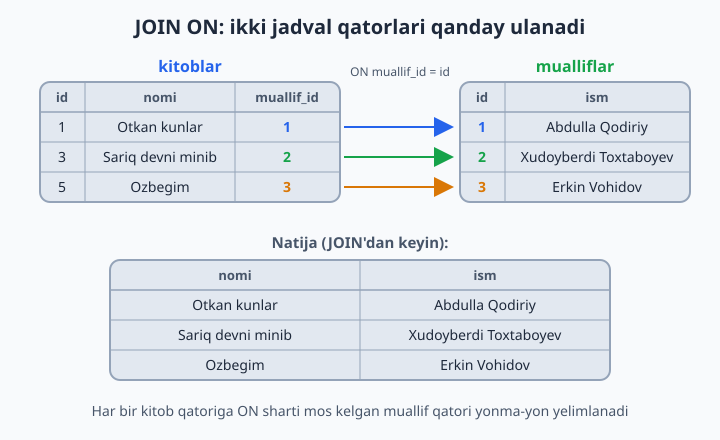
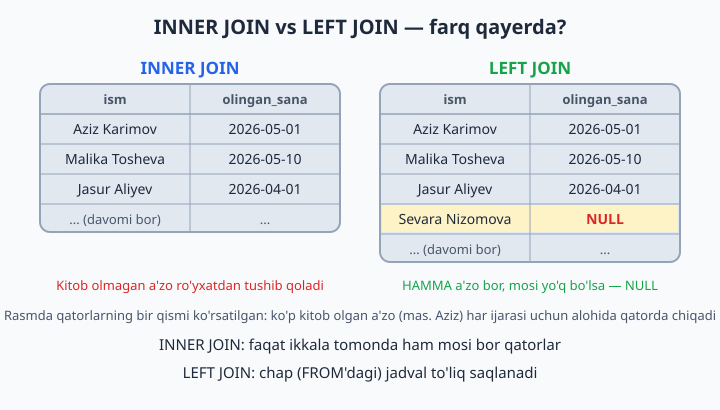
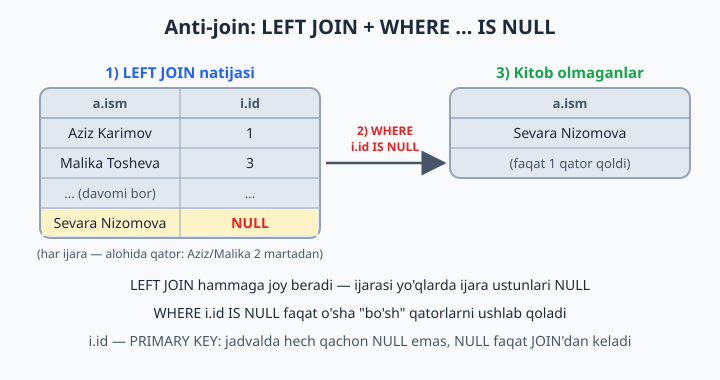
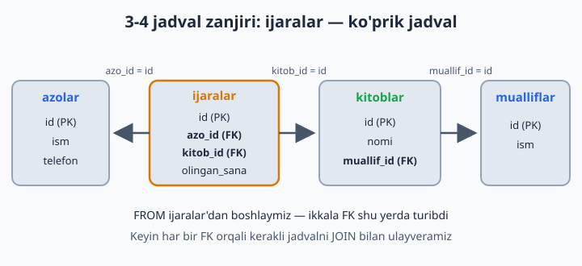

# 12 — JOIN — jadvallarni bog'lash

[⬅️ Oldingi: 11 — Aggregate funksiyalar va GROUP BY](./11-aggregate-group-by.md) · [🏠 README](./README.md) · [Keyingi: 13 — UNION — natijalarni birlashtirish ➡️](./13-union.md)

> **Bu bobda:** ma'lumotni bir necha jadvalga bo'lib saqlaganimizdan keyin ularni qaytadan "yig'ishni" — JOIN'ni o'rganamiz: `ON` sharti qatorlarni qanday ulashini, INNER va LEFT JOIN farqini, "hech narsa qilmaganlarni topish" (anti-join) qolipini, LEFT JOIN'ni buzib qo'yadigan WHERE tuzog'ini, 3-4 jadvalli zanjirlarni va JOIN + GROUP BY bilan real hisobotlar tuzishni ko'rib chiqamiz.

---

## Muammo

`kitoblar`da `muallif_id = 1` turibdi. "1" kim? Buni bilish uchun `mualliflar`ga qarash kerak. 3-bobda ma'lumotni ataylab shunday bo'lib saqlagan edik: muallif haqidagi hamma narsa bitta joyda turadi, kitob esa unga faqat raqam orqali "ishora qiladi". Endi teskari amalni o'rganamiz — bo'lingan ma'lumotni qaytadan yig'ish. JOIN — ikki jadvalni **yonma-yon qo'yish**:

```sql
USE kutubxona;

SELECT kitoblar.nomi, mualliflar.ism
FROM kitoblar
JOIN mualliflar ON kitoblar.muallif_id = mualliflar.id;
```

O'qilishi: "kitoblar jadvalini ol, unga mualliflar'ni ULA, ulash sharti: kitobdagi muallif_id = muallifdagi id".

| nomi | ism |
|---|---|
| Otkan kunlar | Abdulla Qodiriy |
| Mehrobdan chayon | Abdulla Qodiriy |
| Sariq devni minib | Xudoyberdi Toxtaboyev |
| ... (jami 10 qator) | ... |

MySQL buni qanday qiladi? `kitoblar`ning har bir qatorini oladi, `mualliflar`dan `ON` shartiga mos qatorni topadi va ikkalasini bitta uzun qatorga "yelimlaydi". Mos qator topilmasa, oddiy JOIN'da bu qator natijaga umuman tushmaydi — birozdan keyin bu juda muhim bo'ladi.



**Alias bilan qisqaroq (standart uslub):**

```sql
SELECT k.nomi, m.ism, k.yil
FROM kitoblar k
JOIN mualliflar m ON k.muallif_id = m.id;
```

📌 Ikkala jadvalda bir xil nomli ustun bo'lsa (bizda ikkalasida ham `id` bor), uni "yalang'och" yozib bo'lmaydi: `SELECT id, nomi ...` → `Error: Column 'id' in field list is ambiguous` — "qaysi id'ni nazarda tutdingiz?". Shuning uchun JOIN'da ustunlarni doim alias bilan aniq yozish odat tusiga kiradi: `k.id`, `m.id`.

## INNER JOIN vs LEFT JOIN — asosiy farq

Tasavvur: ikki ro'yxatni solishtirayapsiz.

**INNER JOIN** (yoki shunchaki JOIN — bu ikkisi bir xil narsa) — faqat **ikkala tomonda ham bor**lari:
```sql
-- Faqat kitob olgan a'zolar ko'rinadi:
SELECT a.ism, i.olingan_sana
FROM azolar a
INNER JOIN ijaralar i ON i.azo_id = a.id;
```

📌 JOIN qatorlar sonini o'zgartirishi mumkin: Aziz 2 ta kitob olgan, shuning uchun natijada Aziz 2 qatorda chiqadi. Bu xato emas — har bir ijara alohida voqea.

**LEFT JOIN** — **chap jadval to'liq**, o'ngdan mosi bo'lmasa NULL:
```sql
-- HAMMA a'zo ko'rinadi, kitob olmaganlarda sana NULL:
SELECT a.ism, i.olingan_sana
FROM azolar a
LEFT JOIN ijaralar i ON i.azo_id = a.id;
```

💡 Bizning ma'lumotlarda 6 a'zoning hammasi kamida bitta kitob olgan, shuning uchun hozircha ikkala query bir xil natija beradi. Farqni o'z ko'zingiz bilan ko'rish uchun kitob olmagan yangi a'zo qo'shing:

```sql
INSERT INTO azolar (ism, telefon, qoshilgan_sana)
VALUES ('Sevara Nizomova', NULL, '2026-06-08');
```

Endi ikkala queryni qayta ishlating: INNER JOIN'da Sevara umuman yo'q, LEFT JOIN'da esa bor — `olingan_sana` o'rnida `NULL`. Bu qatorni o'chirmang: bob davomida va masalalarda asqotadi.



📌 `RIGHT JOIN` ham bor — LEFT'ning aksi: o'ng jadval to'liq saqlanadi. Amalda juda kam ishlatiladi, chunki jadvallarning o'rnini almashtirib LEFT JOIN yozsangiz, xuddi shu natija chiqadi-yu, query "asosiy jadval — FROM'da turadi" qoidasi bilan osonroq o'qiladi.

## Oltin pattern: "hech narsa qilmaganlarni topish"

```sql
-- Hech qachon kitob olmagan a'zolar:
SELECT a.*
FROM azolar a
LEFT JOIN ijaralar i ON i.azo_id = a.id
WHERE i.id IS NULL;
```

Mantiq: LEFT JOIN hammaga joy beradi; ijarasi yo'qlarda ijara ustunlari NULL; biz NULL'larni ushlaymiz. Bu pattern intervyularda doim so'raladi!



📌 Nega aynan `i.id`? Chunki `id` — `ijaralar`ning PRIMARY KEY'i, jadvalning o'zida u hech qachon NULL bo'lmaydi. Demak, natijada `i.id` NULL bo'lsa, bu faqat bitta narsani anglatadi: LEFT JOIN bu a'zoga mos ijara topa olmagan. (`i.azo_id` ham bo'laverardi — muhimi, NOT NULL ustun tanlash.)

💡 Sevara'ni qo'shgan bo'lsangiz, bu query uni topib beradi. Qo'shmagan bo'lsangiz, natija bo'sh chiqadi — bu xato emas: "hech kim topilmadi" ham javob.

## Tuzoq: LEFT JOIN + WHERE = yashirin INNER JOIN

LEFT JOIN yozdingizmi — o'ng jadval ustuniga WHERE'da shart qo'yishdan ehtiyot bo'ling:

```sql
-- Maqsad: HAMMA a'zo + faqat iyun ijaralari. Lekin...
SELECT a.ism, i.olingan_sana
FROM azolar a
LEFT JOIN ijaralar i ON i.azo_id = a.id
WHERE i.olingan_sana >= '2026-06-01';      -- ❌ kitob olmaganlar yo'qolib qoldi!
```

Nega? 11-bobdagi bajarilish tartibini eslang: WHERE JOIN'dan **keyin** ishlaydi. Kitob olmaganlarda `i.olingan_sana` NULL, NULL bilan taqqoslash esa hech qachon ROST bo'lmaydi (8-bob) — shu qatorlar filtrdan o'tolmaydi va LEFT JOIN amalda INNER JOIN'ga aylanib qoladi. Yechim — shartni `ON` ichiga ko'chirish:

```sql
SELECT a.ism, i.olingan_sana
FROM azolar a
LEFT JOIN ijaralar i ON i.azo_id = a.id
                    AND i.olingan_sana >= '2026-06-01';   -- ✅ hamma a'zo joyida
```

Qoida: **o'ng** jadvalga oid shart — `ON` ichiga, **chap** jadvalga oid shart — `WHERE`ga. (Yagona istisno — yuqoridagi anti-join: u yerda `IS NULL` ataylab `WHERE`da turadi.)

## 3 va undan ko'p jadval

"Kim qaysi kitobni qachon olgan?" — bu savolga bitta jadval javob bera olmaydi: ismlar `azolar`da, nomlar `kitoblar`da, sanalar `ijaralar`da. E'tibor bering: `ijaralar` — "ko'prik" jadval, ikkala FK ham unda turibdi. Shuning uchun FROM'ni undan boshlash qulay:

```sql
-- Kim qaysi kitobni qachon olgan (3 jadval):
SELECT a.ism AS azo, k.nomi AS kitob, i.olingan_sana
FROM ijaralar i
JOIN azolar a ON a.id = i.azo_id
JOIN kitoblar k ON k.id = i.kitob_id;

-- 4 jadval — muallifgacha:
SELECT a.ism AS azo, k.nomi AS kitob, m.ism AS muallif
FROM ijaralar i
JOIN azolar a ON a.id = i.azo_id
JOIN kitoblar k ON k.id = i.kitob_id
JOIN mualliflar m ON m.id = k.muallif_id;
```



Qoida oddiy: har yangi jadval o'zining `JOIN ... ON ...` qatori bilan keladi va zanjirga bitta FK orqali ulanadi. 10 ta jadval bo'lsa ham mantiq o'zgarmaydi.

## JOIN + GROUP BY = real hisobotlar

11-bobdagi GROUP BY'ga JOIN'ni qo'shsak, ish suhbatlaridagi klassik savol chiqadi: "har bir muallif nechta kitob yozgan — id emas, **ismi** bilan":

```sql
-- Har muallifning kitoblari soni (ismi bilan!):
SELECT m.ism, COUNT(k.id) AS kitoblar_soni
FROM mualliflar m
LEFT JOIN kitoblar k ON k.muallif_id = m.id
GROUP BY m.id, m.ism;
```

Nega LEFT? Kitobi yo'q muallif ham ro'yxatda 0 bilan ko'rinsin. Hozirgi ma'lumotlarda hamma muallifning kitobi bor — 0 ni ko'rish uchun bitta kitobsiz muallif qo'shing (buni ham o'chirmang, masalalarda kerak bo'ladi):

```sql
INSERT INTO mualliflar (ism, davlat, tugilgan_yil)
VALUES ('Oybek', 'Ozbekiston', 1905);
```

| ism | kitoblar_soni |
|---|---|
| Abdulla Qodiriy | 2 |
| Xudoyberdi Toxtaboyev | 2 |
| ... | ... |
| Oybek | 0 |

`COUNT(k.id)` — NULL'larni sanamaydi, shuning uchun Oybek'da 0 chiqadi. `COUNT(*)` bo'lsa 1 chiqardi — tuzoq! Chunki LEFT JOIN Oybek uchun ham bitta qator yaratadi (kitob ustunlari NULL bo'lsa ham), `COUNT(*)` esa qatorning o'zini sanayveradi.

📌 Nega `GROUP BY m.id, m.ism` — ikkalasi ham? MySQL 8 da `ONLY_FULL_GROUP_BY` rejimi default yoqilgan: SELECT'dagi har bir "oddiy" ustun GROUP BY'da bo'lishi (yoki undagi ustunga funksional bog'liq bo'lishi) shart. `m.id` PRIMARY KEY bo'lgani uchun MySQL 8 `GROUP BY m.id`ning o'ziga ham ruxsat beradi, lekin ikkalasini yozish — boshqa SQL tizimlarida ham ishlaydigan eng xavfsiz uslub. Faqat `GROUP BY m.ism` deb yozish esa xavfli: ikki muallifning ismi bir xil bo'lsa, ular bitta qatorga qo'shilib ketadi — id bo'yicha guruhlash bundan saqlaydi.

## 12-bob masalalari

💡 5-, 7- va 8-masalalar uchun yuqorida qo'shgan Sevara va Oybek qatorlari asqotadi.

1. (kutubxona) Kitob nomi + muallif ismi
2. (kutubxona) Kitob nomi + muallif ismi + muallif davlati, faqat o'zbek mualliflar
3. (kutubxona) Kim qaysi kitobni olgan (a'zo ismi + kitob nomi)
4. (kutubxona) Hozir qaytarilmagan kitoblar: kitob nomi + kimda + qachondan beri
5. (kutubxona) Hech qachon kitob olmagan a'zolar (anti-join!)
6. (kutubxona) Hech kim olmagan kitoblar
7. (kutubxona) Har muallif nechta kitob yozgan (ismi bilan, kitobsizlar 0 bilan)
8. (kutubxona) Har a'zo nechta kitob olgan (ismi bilan, olmaganlar 0 bilan)
9. (kutubxona) Har kitob necha marta ijaraga berilgan, eng mashhuridan boshlab
10. (kutubxona) 4 jadvalli query: a'zo + kitob + muallif + olingan sana
11. (dokon) Mahsulot nomi + kategoriya nomi
12. (dokon) Buyurtmalar: mijoz ismi + sana + holat
13. (dokon) Buyurtma tarkibi: buyurtma id + mahsulot nomi + soni + narx (buyurtma_qatorlari JOIN mahsulotlar)
14. (dokon) Hech narsa buyurtma qilmagan mijozlar
15. (dokon) Hech qachon sotilmagan mahsulotlar (buyurtma_qatorlari'da yo'qlar)
16. (dokon) Har mijoz jami qancha pulga xarid qilgan (3 jadval + GROUP BY): mijozlar → buyurtmalar → buyurtma_qatorlari, SUM(narx*soni); 'bekor' buyurtmalarni chiqarib tashlang!
17. (klinika) Qabullar: bemor ismi + shifokor ismi + sana + tashxis
18. (klinika) Har shifokor (ismi bilan) nechta bemor ko'rgan va qancha yig'gan; birorta qabul qilmaganlar ham 0 bilan ko'rinsin
19. (taksi) Har haydovchi + mashinasi modeli + raqami; mashinasiz haydovchi bormi — LEFT JOIN bilan tekshiring
20. (taksi) Har haydovchi (ismi bilan): safarlar soni, jami daromad, o'rtacha baho — daromad bo'yicha kamayish tartibida
