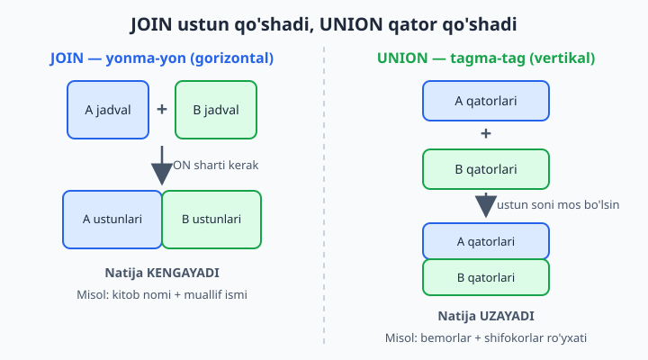
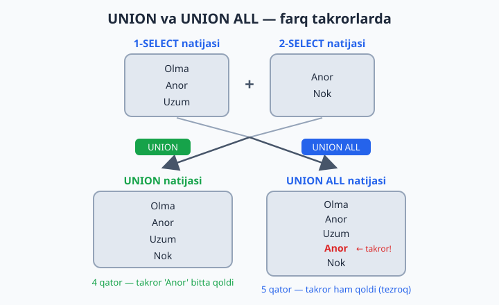

# 13 — UNION — natijalarni birlashtirish

[⬅️ Oldingi: 12 — JOIN — jadvallarni bog'lash](./12-join.md) · [🏠 README](./README.md) · [Keyingi: 14 — Subquery — query ichida query ➡️](./14-subquery.md)

> **Bu bobda:** bir nechta SELECT natijasini bitta ro'yxatga "tagma-tag" ulaydigan UNION va UNION ALL'ni o'rganamiz: ularning farqini (takrorlar taqdiri!), qoidalarini, ustun yetishmaganda NULL bilan to'ldirishni, UNION'da ORDER BY va LIMIT ishlatish sirlarini hamda JOIN bilan adashtirmaslik yo'llarini ko'rib chiqamiz.

---

## JOIN'dan nimasi farq qiladi?

JOIN ustunlarni "yonma-yon" qo'shsa, UNION qatorlarni "tagma-tag" qo'shadi. Tasavvur qiling: ikkita sinf jurnalidan bitta umumiy ro'yxat tuzyapsiz — ikkinchi ro'yxatni birinchisining **tagiga** ko'chirib yozasiz. Jadval kengaymaydi, **uzayadi**.



```sql
-- Klinikadagi hamma odamlar ro'yxati (bemor ham, shifokor ham):
SELECT ism, 'bemor' AS turi FROM klinika.bemorlar
UNION ALL
SELECT ism, 'shifokor' AS turi FROM klinika.shifokorlar;
```

Natijada 11 qator chiqadi (6 bemor + 5 shifokor):

| ism | turi |
|---|---|
| Karim Abdullayev | bemor |
| Lola Mirzayeva | bemor |
| … (jami 6 bemor) | bemor |
| Dr. Anvar Sodiqov | shifokor |
| … (jami 5 shifokor) | shifokor |

💡 `'bemor'` va `'shifokor'` — qo'lda yozilgan belgi ustuni. Bu juda foydali odat: bo'lmasa, natijadagi qator qaysi jadvaldan kelganini bilolmay qolasiz.

## Qoidalar

- Ustunlar **soni** har bir SELECT'da bir xil bo'lishi **shart** — bo'lmasa MySQL xato beradi
- Ustunlar **turi** mos kelgani ma'qul: turlicha bo'lsa MySQL o'zi moslashtirishga urinadi, lekin son ustiga matn ulasangiz g'alati natija chiqishi mumkin
- Natijadagi ustun **nomlari birinchi SELECT'dan** olinadi — keyingi SELECT'larda `AS` yozish shart emas
- SELECT'lar mustaqil: turli jadvaldan, hatto turli bazadan bo'lishi mumkin (`baza.jadval` sintaksisi), bitta jadvalning o'zidan ham bo'laveradi

## UNION vs UNION ALL — takrorlar taqdiri

- `UNION` — takror qatorlarni **olib tashlaydi** (xuddi DISTINCT kabi; buning uchun MySQL hamma qatorni o'zaro solishtirib chiqadi — **sekinroq**)
- `UNION ALL` — hammasini **qoldiradi** (hech narsa tekshirmaydi — **tezroq**)



Buni o'z ko'zingiz bilan ko'ring:

```sql
USE kutubxona;

SELECT janr FROM kitoblar
UNION
SELECT janr FROM kitoblar;
-- 4 qator: roman, sarguzasht, sheriyat, ertak

SELECT janr FROM kitoblar
UNION ALL
SELECT janr FROM kitoblar;
-- 20 qator: 10 kitobning janri ikki marta
```

📌 Diqqat: `UNION` takrorlarni faqat ikki SELECT **orasida** emas, **butun natija** bo'ylab o'chiradi — yuqoridagi misolda bitta SELECT ichidagi takror janrlar ham ketdi.

**Qaysi birini tanlash?** Oddiy qoida: takror bo'lishi mumkin emasligini bilsangiz (masalan, bemorlar va shifokorlar ro'yxati kesishmaydi) — doim `UNION ALL` ishlating, bekorga tekshiruvga vaqt sarflamang. Takror chiqishi mumkin va u sizga kerak bo'lmasa — `UNION`.

## Ustun yetishmasa — NULL bilan to'ldiring

Ustunlar soni teng bo'lishi shartligini aytdik. Lekin bir jadvalda bor ustun ikkinchisida bo'lmasa-chi? O'rnini `NULL` (yoki biror standart qiymat) bilan to'ldirib qo'ying:

```sql
-- Bemorlarda telefon bor, shifokorlarda bunday ustun yo'q:
SELECT ism, telefon FROM klinika.bemorlar
UNION ALL
SELECT ism, NULL FROM klinika.shifokorlar;
```

## ORDER BY va LIMIT — UNION bilan

`ORDER BY`ni **eng oxiriga** yozsangiz, u **butun birlashgan natijaga** qo'llanadi:

```sql
-- Arzon va qimmat mahsulotlar bitta ro'yxatda, belgisi bilan, narx tartibida:
SELECT nomi, narx, 'arzon' AS toifa FROM dokon.mahsulotlar WHERE narx < 200000
UNION ALL
SELECT nomi, narx, 'qimmat' FROM dokon.mahsulotlar WHERE narx > 10000000
ORDER BY narx;
```

Agar har bir SELECT'ga **alohida** `ORDER BY ... LIMIT` kerak bo'lsa, uni **qavsga** oling:

```sql
-- Eng qimmat 3 ta + eng arzon 3 ta mahsulot bitta natijada:
(SELECT nomi, narx FROM dokon.mahsulotlar ORDER BY narx DESC LIMIT 3)
UNION ALL
(SELECT nomi, narx FROM dokon.mahsulotlar ORDER BY narx ASC LIMIT 3);
```

📌 Qavs ichidagi `ORDER BY` faqat `LIMIT` bilan birga ma'noga ega — u "qaysi 3 tani olishni" hal qiladi, xolos. Yakuniy natijaning tartibi kafolatlanmaydi; tartib kerak bo'lsa, eng oxiriga yana bitta `ORDER BY` qo'shing.

## JOIN va UNION — adashtirmang

|  | JOIN | UNION |
|---|---|---|
| Yo'nalishi | gorizontal — **ustun** qo'shadi | vertikal — **qator** qo'shadi |
| Sharti | `ON` bog'lash sharti kerak | shart yo'q, faqat ustun soni mos bo'lsin |
| Qachon kerak | bir qatorga **qo'shimcha ma'lumot** ulash (kitob + muallif ismi) | ikki o'xshash ro'yxatni **bitta qilish** (bemorlar + shifokorlar) |

💡 Bitta jadvalning o'zidan ikki xil shart bilan tanlayotgan bo'lsangiz, ko'pincha UNION shart ham emas — oddiy `WHERE ... OR ...` yetadi (buni 20-masalada sinaysiz).

## 13-bob masalalari

1. (klinika) Bemorlar va shifokorlar ismlarini bitta ro'yxatda chiqaring
2. (klinika) O'sha ro'yxatga 'turi' ustuni qo'shing ('bemor'/'shifokor')
3. (klinika) Hamma telefon raqamlar: bemorlardan ham, shifokorlardan ham... shifokorlarda telefon yo'q-ku! O'rniga NULL chiqaring: `SELECT ism, telefon FROM bemorlar UNION ALL SELECT ism, NULL FROM shifokorlar`
4. (kutubxona) 1900-yilgacha va 1970-yildan keyingi kitoblar bitta ro'yxatda, 'davr' belgisi bilan ('eski'/'yangi')
5. (dokon) Tugagan mahsulotlar ('tugagan' belgisi) + 5 tadan kam qolganlar ('oz') — UNION ALL
6. (taksi) 5 baho olgan safarlar ('alo') + 3 va undan past baholilar ('yomon')
7. (kutubxona) UNION va UNION ALL farqini sinash: `SELECT janr FROM kitoblar UNION SELECT janr FROM kitoblar;` va ALL versiyasi — qator sonlarini solishtiring
8. (kutubxona+dokon) Ikki BAZAdan: kutubxona a'zolari va do'kon mijozlari ismlari bitta ro'yxatda (baza.jadval sintaksisi)
9. Ataylab xato: 2 ustunli SELECT'ni 3 ustunli bilan UNION qiling — xatoni o'qing
10. (dokon) Eng qimmat 3 ta va eng arzon 3 ta mahsulot bitta natijada (har SELECT'ni qavsga oling: `(SELECT ... LIMIT 3) UNION ALL (SELECT ... LIMIT 3)`)
11. (klinika) May oyidagi va iyun oyidagi qabullar, 'oy' belgisi bilan
12. (taksi) Eng uzun safar + eng qisqa safar (qavsli LIMIT usuli)
13. (kutubxona) Roman janri kitoblari nomi + mualliflar ismi — bitta "qidiruv natijasi" ro'yxatida ('kitob'/'muallif' belgisi bilan)
14. (dokon) Toshkentlik mijozlar + 10 mln dan qimmat mahsulot sotib olganlar (hozircha takror bo'lsa bo'ladi — UNION bilan takrorni oling)
15. ORDER BY UNION'da: 10-masala natijasini narx bo'yicha saralang (ORDER BY eng oxirida, butun natijaga qo'llanadi)
16. (hammasi) 4 bazadan 'odamlar' ro'yxati: a'zolar, mijozlar, bemorlar, haydovchilar — turi belgisi bilan, ism bo'yicha alifbo tartibida
17. (dokon) Har oy buyurtmalari sonini alohida SELECT'larda hisoblab (`WHERE MONTH(sana)=5`, `=6`), UNION ALL bilan birlashting — keyin 11-bobdagi GROUP BY usuli bilan solishtiring: qaysi yaxshi?
18. (taksi) 'Chilonzor'dan boshlangan va 'Chilonzor'da tugagan safarlar — UNION (takrorsiz) va UNION ALL (takror bilan) — farq bormi?
19. (kutubxona) Telefoni bor a'zolar + telefoni yo'q a'zolar UNION ALL — jami a'zolar soniga tengmi? Tekshiring
20. O'ylang: qaysi holatda UNION o'rniga oddiy `WHERE ... OR ...` yetarli? (bitta jadvaldan bo'lsa!) 18-masalani OR bilan qayta yozing
