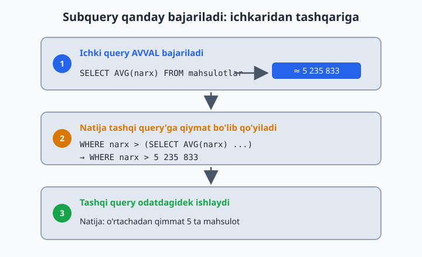
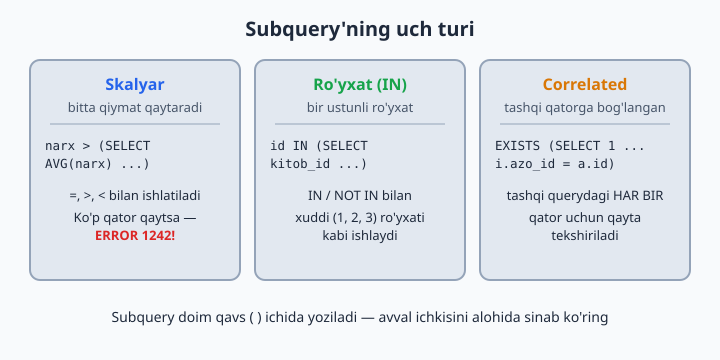
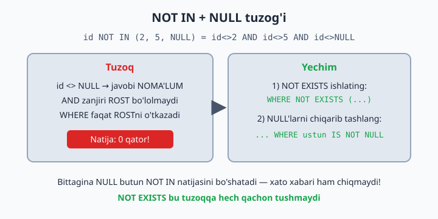

# 14 — Subquery — query ichida query

[⬅️ Oldingi: 13 — UNION — natijalarni birlashtirish](./13-union.md) · [🏠 README](./README.md) · [Keyingi: 15 — CTE — WITH bilan ishlash ➡️](./15-cte.md)

> **Bu bobda:** query ichiga yana bitta query joylashni — subquery'ni o'rganamiz: bitta qiymat qaytaradigan (skalyar), ro'yxat qaytaradigan (IN bilan) va tashqi qatorga "qarab turadigan" (correlated, EXISTS) turlarini ko'ramiz, mashhur NOT IN + NULL tuzog'idan qanday qochishni va FROM ichidagi subquery (hosila jadval) bilan ikki bosqichli hisob-kitob qilishni mashq qilamiz.

---

## G'oya — savol ichidagi savol

"O'rtachadan qimmat mahsulotlar qaysilar?" — bu savolga bitta oddiy `WHERE` bilan javob berib bo'lmaydi, chunki savol aslida **ikki bosqichli**: avval o'rtacha narxning o'zini bilish kerak, keyin esa har bir mahsulotni shu son bilan solishtirish kerak.

Qo'lda yechsak bo'lardi: avval `SELECT AVG(narx) ...` bajarib natijani qog'ozga yozib olamiz, keyin uni qo'lda `WHERE`ga ko'chiramiz. Ishlaydi, lekin nochor usul — ma'lumot o'zgarishi bilan qog'ozdagi son eskiradi. SQL buni bitta queryda hal qiladi: **subquery** — query ichidagi query. Ichki query avval bajariladi, natijasi tashqisiga uzatiladi:

```sql
SELECT nomi, narx
FROM dokon.mahsulotlar
WHERE narx > (SELECT AVG(narx) FROM dokon.mahsulotlar);
-- Natija: 5 ta mahsulot (iPhone 15, MacBook Air M2, Acer Aspire 5, ...)
```

MySQL avval qavs ichidagi `SELECT AVG(narx)`ni bajaradi — bizning bazada bu ≈ 5 235 833. Keyin tashqi query xuddi `WHERE narx > 5235833.33` deb yozilganday ishlayveradi. Qoida sodda: **ichkaridan tashqariga**.



📌 Subquery **doim qavs `( )` ichida** yoziladi. Qavsni unutsangiz — sintaksis xatosi.

💡 O'qish va yozishni osonlashtiradigan hiyla: avval ichki query'ni **alohida bajarib ko'ring** — nima qaytarayotganini o'z ko'zingiz bilan ko'rasiz, keyin tashqi query'ga "joylaysiz". Murakkab querylar shunday ichkaridan quriladi.

## Skalyar subquery — bitta qiymat

Bitta qator, bitta ustun — ya'ni **bitta qiymat** qaytaradigan subquery skalyar deyiladi. Uni oddiy son turgan istalgan joyda (`=`, `>`, `<` yonida) ishlatish mumkin:

```sql
-- Eng qalin kitob:
SELECT nomi, sahifa FROM kitoblar
WHERE sahifa = (SELECT MAX(sahifa) FROM kitoblar);
-- Natija: Urush va tinchlik (1225 sahifa)
```

9-bobda buni `ORDER BY sahifa DESC LIMIT 1` bilan yechgan edik. Ikkalasi ham to'g'ri, lekin nozik farq bor: agar ikki kitob bir xil 1225 sahifa bo'lsa, `LIMIT 1` faqat **bittasini** ko'rsatadi, subquery esa **hammasini** chiqaradi. "Eng katta qiymatga ega HAMMA qatorlar" kerak bo'lganda subquery — ishonchli yo'l.

⚠️ Skalyar kutilgan joyda subquery **bir nechta qator** qaytarsa, MySQL xato beradi: `ERROR 1242: Subquery returns more than 1 row`. Masalan, `WHERE sahifa = (SELECT sahifa FROM kitoblar)` — 10 ta qiymatning qaysi biri bilan solishtirsin? Bunday holda `=` o'rniga `IN` ishlating yoki ichki query'ni `MAX`/`AVG` kabi aggregate bilan bitta qiymatga keltiring.

💡 Subquery hech narsa qaytarmasa — bu xato emas: natija `NULL` deb olinadi va tashqi `WHERE` hech narsani o'tkazmaydi (8-bobdagi NULL qoidalarini eslang).

Skalyar subquery `SELECT` ro'yxatida ham tura oladi — har qator yoniga umumiy ko'rsatkichni qo'yish uchun qulay:

```sql
-- Har mahsulot narxi va umumiy o'rtacha yonma-yon:
SELECT nomi, narx,
       (SELECT AVG(narx) FROM dokon.mahsulotlar) AS ortacha
FROM dokon.mahsulotlar;
```

## Ro'yxat qaytaradigan subquery — IN bilan

Subquery bir ustunli **ro'yxat** qaytarsa, uni 8-bobdan tanish `IN` bilan ishlatamiz:

```sql
-- O'zbek mualliflarning kitoblari:
SELECT nomi, yil FROM kitoblar
WHERE muallif_id IN (SELECT id FROM mualliflar WHERE davlat = 'Ozbekiston');
-- Ichki query (1, 2, 3) ro'yxatini beradi → 6 ta kitob chiqadi
```

Farqi shundaki, `IN (1, 2, 3)` ro'yxatini endi qo'lda yozmaymiz — baza o'zi topib beradi. Mualliflar jadvaliga yangi o'zbek muallif qo'shilsa, query o'zgarmasdan to'g'ri ishlayveradi.

📌 `IN`ga beriladigan subquery **bitta ustun** tanlashi kerak. `SELECT id, ism FROM ...` yozsangiz: `ERROR 1241: Operand should contain 1 column(s)`.

Teskari savol uchun `NOT IN`:

```sql
-- Hech kim olmagan kitoblar:
SELECT nomi FROM kitoblar
WHERE id NOT IN (SELECT kitob_id FROM ijaralar);
-- Natija: 4 ta kitob (Ozbegim, Anna Karenina, ...)
```

Lekin `NOT IN`da yashirin tuzoq bor — quyida alohida bo'limda ko'ramiz.

## EXISTS va correlated subquery

`EXISTS` boshqacha savol beradi: "shunday qator **bormi**?" — qiymatning o'zi emas, bor-yo'qligi muhim:

```sql
-- Kamida bir marta kitob olgan a'zolar:
SELECT * FROM azolar a
WHERE EXISTS (SELECT 1 FROM ijaralar i WHERE i.azo_id = a.id);
```

Ichki querydagi `SELECT 1` — odat bo'lib qolgan yozuv: nima tanlangani ahamiyatsiz, MySQL faqat qator topildimi-yo'qmi deb qaraydi.

E'tibor bering: ichki query `a.id`ni — **tashqi** querydagi qatorni ishlatyapti. Bunday subquery **correlated (bog'langan)** deyiladi: u bir marta emas, tashqi querydagi **har bir qator uchun** qayta tekshiriladi — Aziz uchun bir marta, Malika uchun bir marta va hokazo. Bizning bazada hamma a'zo kamida bir marta kitob olgan, shuning uchun 6 qator chiqadi. Teskari savol uchun — `NOT EXISTS`.

Correlated subquery skalyar joyda ham juda chiroyli ishlaydi — har qatorni "o'z guruhi" bilan solishtirish mumkin:

```sql
-- O'z janrining o'rtachasidan qalin kitoblar:
SELECT nomi, janr, sahifa
FROM kitoblar k
WHERE sahifa > (SELECT AVG(sahifa) FROM kitoblar WHERE janr = k.janr);
-- Natija: 4 ta kitob — har janrning o'z "qalinlari"
```

Bu yerda har kitob umumiy o'rtacha bilan emas, **janrdoshlari** o'rtachasi bilan solishtiriladi: roman — romanlar bilan, ertak — ertaklar bilan.

⚠️ Correlated subquery har qator uchun bajarilgani sababli juda katta jadvallarda sekinlashishi mumkin. MySQL 8 optimizatori ko'p hollarda buni o'zi samaraliroq rejaga aylantiradi, lekin shubha tug'ilsa — 23-bobdagi `EXPLAIN` bilan tekshiramiz.



## NOT IN va NULL tuzog'i

**Ogohlantirish — bu xato real loyihalarda juda ko'p uchraydi.** Subquery natijasida **birorta NULL** bo'lsa, `NOT IN` **hech narsa** qaytarmaydi!

Nega? `NOT IN` aslida ketma-ket tengsizliklar zanjiri:

```sql
id NOT IN (2, 5, NULL)
-- ma'nosi: id <> 2 AND id <> 5 AND id <> NULL
```

8-bobdan eslang: `id <> NULL` — na rost, na yolg'on, javobi NOMA'LUM. `AND` zanjirida bitta NOMA'LUM bo'lsa, butun ifoda hech qachon aniq ROST bo'lolmaydi — `WHERE` esa faqat aniq ROST qatorlarni o'tkazadi. Natija: 0 qator, va eng xavflisi — **xato xabari ham chiqmaydi**, query "jimgina" bo'sh natija beradi.



Bizning `ijaralar.kitob_id` ustuni `NOT NULL` deb e'lon qilingan, shuning uchun yuqoridagi misol bexavotir ishladi. Lekin bunga tayanib o'tirmang — ikkita xavfsiz yo'l bor:

```sql
-- 1-yo'l: NOT EXISTS (eng ishonchlisi — NULL'ga umuman parvo qilmaydi):
SELECT nomi FROM kitoblar k
WHERE NOT EXISTS (SELECT 1 FROM ijaralar i WHERE i.kitob_id = k.id);

-- 2-yo'l: NULL'larni ichki query'ning o'zida chiqarib tashlash:
SELECT nomi FROM kitoblar
WHERE id NOT IN (SELECT kitob_id FROM ijaralar WHERE kitob_id IS NOT NULL);
```

📌 Qoida qilib oling: `NOT IN` + subquery yozayotganda doim "ichkarida NULL bo'lishi mumkinmi?" deb so'rang. Ikkilansangiz — `NOT EXISTS` yozing, u bu tuzoqqa hech qachon tushmaydi.

## FROM ichida subquery — hosila jadval

Subquery `WHERE`dan tashqari `FROM`da ham tura oladi — u holda natijasi **vaqtinchalik jadvaldek** ishlatiladi (rasmiy nomi: hosila jadval, derived table):

```sql
-- Har buyurtma summasi ichidan eng kattasini topish:
SELECT MAX(jami) AS eng_katta
FROM (
    SELECT buyurtma_id, SUM(narx * soni) AS jami
    FROM dokon.buyurtma_qatorlari
    GROUP BY buyurtma_id
) AS summalar;
-- Natija: 16 000 000
```

O'qilishi — ikki bosqich: 1) ichki query har buyurtmaning jami summasini hisoblaydi, kichik "jadvalcha" hosil bo'ladi; 2) tashqi query shu jadvalchadan `MAX` oladi. To'g'ridan-to'g'ri `MAX(SUM(...))` deb yozib bo'lmaydi — MySQL aggregate ichida aggregate'ga ruxsat bermaydi (`ERROR 1111: Invalid use of group function`). `FROM` subquery aynan shu muammoni yechadi.

📌 `FROM`dagi subquery'ga **alias majburiy** (`AS summalar`). Unutsangiz: `ERROR 1248: Every derived table must have its own alias` — bu yerdagi eng ko'p uchraydigan xato.

💡 `FROM` subquery o'sgan sari o'qish qiyinlashadi. Keyingi bobda xuddi shu ishni ancha ozoda yozadigan vosita — CTE (`WITH`) bilan tanishamiz.

## Subquery yoki JOIN?

Ko'p masalani ikkala yo'l bilan ham yechish mumkin — masalan, "o'zbek mualliflarning kitoblari"ni `IN` subquery ham, 12-bobdagi JOIN ham topadi. Qaysi birini tanlash kerak?

| Holat | Qulayroq vosita |
|---|---|
| Ikkinchi jadval faqat **filtr** uchun kerak, ustunlari natijaga chiqmaydi | subquery (IN / EXISTS) |
| **Ikkala** jadval ustunlari ham natijada kerak | JOIN |
| "Hech narsa qilmaganlar"ni topish | NOT EXISTS yoki LEFT JOIN + IS NULL — ikkalasi ham to'g'ri |
| Aggregate natijasini yana aggregatlash | FROM subquery (yoki 15-bobdagi CTE) |

💡 Tezlik haqida ortiqcha tashvishlanmang: MySQL 8 optimizatori `IN` subquery'larni ichkarida baribir JOIN'ga o'xshash rejaga (semi-join) aylantiradi — ko'p hollarda tezlik bir xil. Asosiy mezon: **qaysi yozuv sizga tushunarli bo'lsa, o'shani yozing**.

## 14-bob masalalari

1. (kutubxona) O'rtacha sahifadan qalin kitoblar
2. (kutubxona) Eng eski kitob (MIN subquery bilan — LIMIT'siz usul!)
3. (kutubxona) Eng ko'p nusxali kitob
4. (kutubxona) O'zbek mualliflarning kitoblari (IN + subquery; keyin JOIN bilan ham yozing — solishtiring)
5. (kutubxona) 1900-yilgacha tug'ilgan mualliflarning kitoblari
6. (kutubxona) Kamida bir marta ijaraga berilgan kitoblar (IN yoki EXISTS)
7. (kutubxona) Hech qachon ijaraga berilmagan kitoblar (NOT EXISTS)
8. (kutubxona) Hech qachon kitob olmagan a'zolar — subquery usulida (12-bobdagi LEFT JOIN bilan solishtiring: ikkalasi ham to'g'ri! Bo'sh natija chiqsa xafa bo'lmang — bizning bazada hamma a'zo kitob olgan)
9. (kutubxona) 'Sariq devni minib' kitobini olgan a'zolar ismi (2 qavat subquery: kitob nomi → kitob_id → azo_id → ism)
10. (dokon) O'rtacha narxdan arzon mahsulotlar
11. (dokon) Eng qimmat mahsulot (subquery usuli)
12. (dokon) Buyurtma qilingan mahsulotlar (IN)
13. (dokon) Hech qachon buyurtma qilinmagan mahsulotlar (NOT IN — ehtiyot: mahsulot_id NULL emasligini tekshiring!)
14. (dokon) Toshkentlik mijozlarning buyurtmalari (mijoz_id IN subquery)
15. (dokon) O'rtacha buyurtma summasidan katta buyurtmalar (FROM subquery + HAVING yoki 2 bosqich)
16. (klinika) Eng qimmat qabul narxli shifokor
17. (klinika) O'rtacha tajribadan tajribali shifokorlar
18. (klinika) Kardiologga tushgan bemorlar ismi (2 qavat: mutaxassislik → shifokor_id → bemor_id → ism)
19. (taksi) O'rtacha masofadan uzun safarlar; reytingi eng baland haydovchining safarlari — 2 ta query
20. (taksi) Har haydovchining daromadi o'rtacha haydovchi daromadidan ko'p bo'lganlari (FROM subquery: avval GROUP BY bilan daromadlar jadvalini yasang, undan AVG oling)
