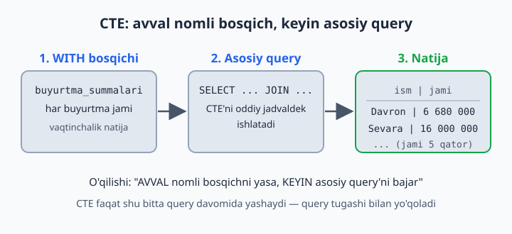
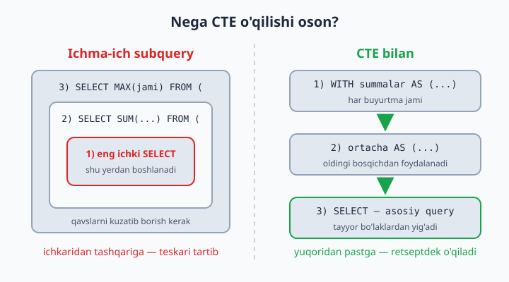
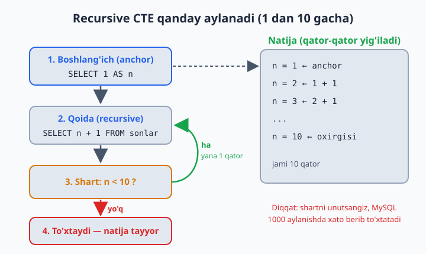

# 15 — CTE — WITH bilan ishlash

[⬅️ Oldingi: 14 — Subquery — query ichida query](./14-subquery.md) · [🏠 README](./README.md) · [Keyingi: 16 — Window funksiyalar ➡️](./16-window-funksiyalar.md)

> **Bu bobda:** murakkab query'ni `WITH` yordamida nomli, yuqoridan pastga o'qiladigan bosqichlarga bo'lishni, bir nechta CTE'ni zanjir qilib ulashni va recursive CTE bilan jadvalsiz sonlar ketma-ketligi, kalendar va daraxt strukturalar hosil qilishni o'rganamiz.

---

## G'oya: query bo'lagiga nom qo'yamiz

14-bobda subquery'ni ko'rdik — query ichida query. Ishlaydi, lekin subquery ichida yana subquery paydo bo'lsa, o'qish azobga aylanadi. CTE (Common Table Expression) — subquery'ning **chiroyli** versiyasi: murakkab query'ni nomli bo'laklarga ajratadi. Xuddi oshxona retseptidek: "avval qiymani tayyorlang, keyin xamirni yoying, oxirida ikkalasini qo'shing" — har bosqichning o'z nomi bor, tartibi aniq:

```sql
WITH buyurtma_summalari AS (
    SELECT buyurtma_id, SUM(narx * soni) AS jami
    FROM dokon.buyurtma_qatorlari
    GROUP BY buyurtma_id
)
SELECT b.id, m.ism, bs.jami
FROM buyurtma_summalari bs
JOIN dokon.buyurtmalar b ON b.id = bs.buyurtma_id
JOIN dokon.mijozlar m ON m.id = b.mijoz_id
WHERE bs.jami > 3000000;
```

O'qilishi: "AVVAL buyurtma_summalari degan vaqtinchalik jadval yasa, KEYIN undan foydalanib asosiy query'ni bajar". Asosiy SELECT uchun `buyurtma_summalari` xuddi oddiy jadvaldek: FROM'da yozasiz, JOIN qilasiz, WHERE'da filtrlaysiz.



📌 CTE **faqat shu bitta query davomida** yashaydi: query tugadi — `buyurtma_summalari` ham yo'qoladi. Bazaga hech narsa yozilmaydi, hech nima o'zgarmaydi.

📌 CTE MySQL'ga **8.0 versiyada** kelgan. Eski MySQL 5.7 da `WITH` ishlamaydi — shu sababli internetdagi ba'zi eski darslarda hamma narsa subquery bilan yozilganini ko'rasiz.

## Nega bu subquery'dan qulay?

Xuddi shu masalani FROM ichidagi subquery bilan ham yozsa bo'lardi (14-bobda shunday qildik). Farq — **o'qish tartibida**. Ichma-ich subquery'ni tushunish uchun eng ichkarisidan boshlab tashqariga qarab o'qiysiz — teskari tartib. CTE esa retseptdek yuqoridan pastga o'qiladi: 1-bosqich, 2-bosqich, natija.



**Qachon CTE, qachon subquery?** Ma'no bir xil — MySQL ko'pincha ikkalasini bir xil rejada bajaradi. Oddiy qoida: query 5 qatordan oshsa yoki bitta oraliq natija 2 joyda kerak bo'lsa — CTE o'qilishi ancha oson. Qisqa `WHERE narx > (SELECT AVG(narx) ...)` uchun esa subquery bemalol yetadi.

## Bir nechta CTE — vergul bilan

`WITH` so'zi **bir marta** yoziladi, keyingi CTE'lar vergul bilan qo'shiladi. Eng zo'r joyi: har keyingi CTE o'zidan **oldingi** CTE'lardan foydalana oladi — bosqichlar zanjiri hosil bo'ladi:

```sql
WITH
oylik AS (
    SELECT DATE_FORMAT(b.sana, '%Y-%m') AS oy, SUM(q.narx * q.soni) AS tushum
    FROM dokon.buyurtmalar b
    JOIN dokon.buyurtma_qatorlari q ON q.buyurtma_id = b.id
    GROUP BY oy
),
ortacha AS (
    SELECT AVG(tushum) AS avg_tushum FROM oylik   -- oldingi CTE'dan foydalanyapti!
)
SELECT o.oy, o.tushum
FROM oylik o
CROSS JOIN ortacha a
WHERE o.tushum > a.avg_tushum;
```

Bizning ma'lumotlarda natija bitta qator bo'ladi:

| oy | tushum |
|---|---|
| 2026-06 | 27730000.00 |

Chunki may tushumi 23 380 000, iyun tushumi 27 730 000, o'rtacha esa taxminan 25,5 mln — faqat iyun undan oshgan.

📌 Halol izoh: soddalik uchun bu misolda `holat = 'bekor'` bo'lgan 4-buyurtmani (11 500 000, may oyi) ham "tushum"ga qo'shib yubordik — diqqatimiz CTE zanjirining o'zida. Real hisobotda esa, 12-bobning 16-masalasida o'rgatilganidek, bekor buyurtmalarni `WHERE b.holat <> 'bekor'` bilan chiqarib tashlash to'g'ri bo'ladi.

📌 `ortacha` bitta qator qaytaradi, shuning uchun uni `CROSS JOIN` bilan ulaymiz — har qatorga o'sha yagona o'rtacha qiymat "yopishtiriladi" (ON sharti kerak emas). Eski kitoblarda buni `FROM oylik o, ortacha a` deb vergul bilan yozishadi — ishlaydi, lekin JOIN turini aniq yozgan tushunarliroq.

## Recursive CTE — o'z-o'zini chaqiruvchi (qiziq mavzu!)

Oddiy CTE tayyor jadvallardan o'qiydi. Recursive CTE esa qatorlarni **o'zi yaratadi** — hech qanday jadvalsiz! U doim uch qismdan iborat: boshlang'ich qator (anchor), `UNION ALL`, va o'z-o'zini chaqiruvchi qoida:

```sql
-- 1 dan 10 gacha sonlar (jadvalsiz!):
WITH RECURSIVE sonlar AS (
    SELECT 1 AS n                            -- 1) boshlanish (anchor)
    UNION ALL
    SELECT n + 1 FROM sonlar WHERE n < 10    -- 2) qoida + to'xtash sharti
)
SELECT * FROM sonlar;
```

Qanday ishlaydi: avval `n = 1` qatori yaratiladi. Keyin qoida aylana boshlaydi: "oxirgi qatorga 1 qo'sh" — 2, 3, 4... Har aylanishda `WHERE n < 10` sharti tekshiriladi: shart bajarilmagan zahoti aylanish to'xtaydi. Natija — 1 dan 10 gacha 10 ta qator.



⚠️ **To'xtash shartini unutmang!** `WHERE n < 10` bo'lmasa, qoida cheksiz aylanardi. Yaxshiyamki MySQL himoyalangan: standart sozlamada 1000 aylanishdan keyin `Recursive query aborted` xatosi bilan to'xtatadi (bu chegara `cte_max_recursion_depth` o'zgaruvchisida turadi). Demak, 11-masaladagi "1 dan 100 gacha" bemalol ishlaydi, "1 dan 5000 gacha" esa chegarani oshirishni talab qiladi.

Eng foydali amaliy misol — **kalendar yasash**:

```sql
-- 2026-yil iyun kalendari:
WITH RECURSIVE kunlar AS (
    SELECT DATE('2026-06-01') AS kun
    UNION ALL
    SELECT kun + INTERVAL 1 DAY FROM kunlar WHERE kun < '2026-06-30'
)
SELECT kun, DAYNAME(kun) FROM kunlar;
```

📌 `DAYNAME` standart sozlamada kun nomini inglizcha qaytaradi (`Monday`, `Tuesday`...) — bu normal holat.

Nega kalendar shunchalik kerak? `safarlar` jadvalida safar bo'lmagan kun umuman **yo'q** — oddiy GROUP BY bunday kunni hech qachon ko'rsata olmaydi. Recursive kalendar + LEFT JOIN esa "oyning HAR kuni, jumladan tushumsiz kunlar 0 bilan" hisobotini beradi — real loyihalardagi eng ko'p uchraydigan patternlardan biri (16-masala — albatta ishlang!).

Recursive CTE daraxt strukturalar uchun ham asosiy qurol: kategoriya ichida kategoriya, boshliq–xodim–xodimning xodimi... G'oya o'sha-o'sha: anchor — daraxtning ildizi (masalan, bosh direktor), qoida — "har topilgan xodimning qo'l ostidagilarini qo'sh". Ishda bunga duch kelsangiz, qidiruv so'zingiz tayyor: "recursive CTE hierarchy".

## 15-bob masalalari

1. 14-bobdagi 15-masalani CTE bilan qayta yozing — qaysi biri o'qilishi oson?
2. (dokon) CTE: har buyurtma summasi → undan eng katta 3 tasini mijoz ismi bilan chiqaring
3. (dokon) CTE: har mijozning jami xaridi → o'rtacha xariddan ko'p xarid qilganlar
4. (kutubxona) CTE: har kitobning ijara soni → "mashhur" (2+ marta olingan) kitoblar muallifi bilan
5. (kutubxona) CTE: har muallifning kitoblari soni → eng sermahsul muallif(lar) — eng katta son bilan teng kelganlarning HAMMASINI chiqaring (bizning bazada bir nechta muallif teng)
6. (kutubxona) 2 ta CTE: o'zbek mualliflar + ularning kitoblari statistikasi
7. (klinika) CTE: har shifokorning daromadi → klinika jami daromadidagi ULUSHI foizda (2-CTE'da jami)
8. (klinika) CTE: har bemorning qatnovlari soni → 1 martadan ko'p kelganlar 'doimiy', qolganlar 'yangi'
9. (taksi) CTE: har haydovchi daromadi → eng yuqori va eng past daromadli haydovchilar farqi
10. (taksi) CTE: kunlik tushum → o'rtacha kunlik tushumdan past kunlar
11. RECURSIVE: 1 dan 100 gacha sonlar
12. RECURSIVE: 5 ning karralari: 5, 10, 15... 50
13. RECURSIVE: 2 ning darajalari: 2, 4, 8, 16... 1024
14. RECURSIVE: 2026-yil dekabr oyining hamma kunlari + hafta kunlari nomi
15. RECURSIVE: bugundan 10 kun oldingacha sanalar ro'yxati (kun - INTERVAL 1 DAY)
16. RECURSIVE kalendar + LEFT JOIN: iyun oyining HAR KUNI uchun taksi tushumi (safarsiz kunlar 0 bilan!) — bu juda kuchli real pattern
17. (dokon) CTE zanjiri (3 ta): buyurtma summalari → mijoz jami xaridlari → shahar bo'yicha jami
18. (kutubxona) CTE: hozir o'qilayotgan (qaytarilmagan) kitoblar → ularning janr statistikasi
19. (taksi) CTE: har haydovchining o'rtacha bahosi → reytingi (jadvaldagi `reyting` ustuni) bilan solishtiring — farq bormi?
20. O'zingiz: istalgan bazada 2+ CTE'li "hisobot" yozing va har CTE nimani hisoblashini izohda (`-- izoh`) yozing
