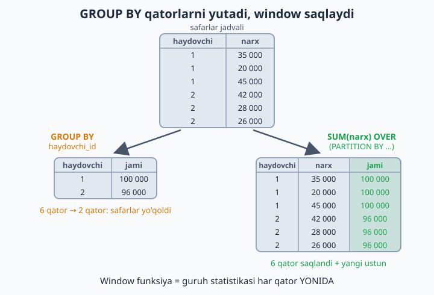
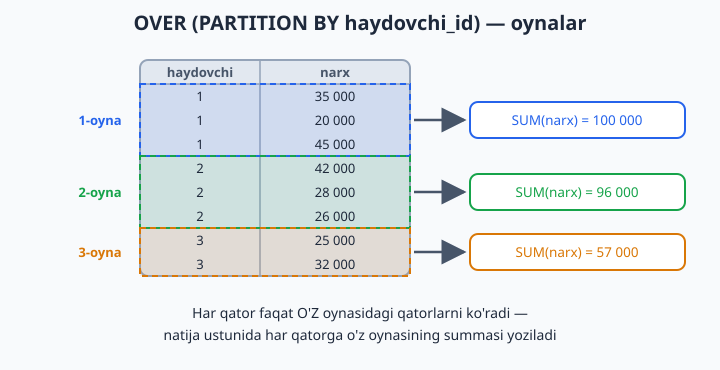
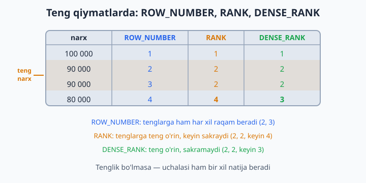
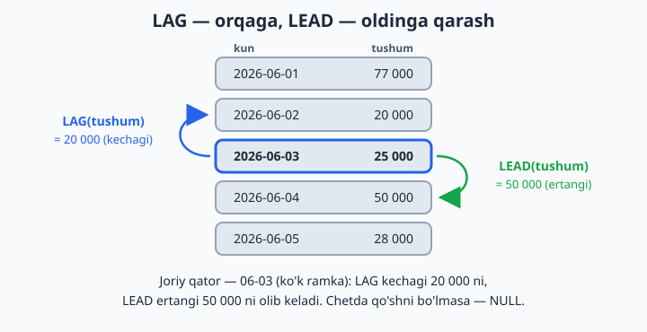

# 16 — Window funksiyalar

[⬅️ Oldingi: 15 — CTE — WITH bilan ishlash](./15-cte.md) · [🏠 README](./README.md) · [Keyingi: 17 — UPDATE va DELETE — chuqur ➡️](./17-update-delete.md)

> **Bu bobda:** window (oyna) funksiyalarini o'rganamiz: OVER va PARTITION BY bilan qatorlarni yo'qotmasdan guruh hisob-kitobini qilish, ROW_NUMBER/RANK/DENSE_RANK bilan raqamlash, "har guruhda eng kattasi" klassik masalasi, LAG/LEAD bilan oldingi-keyingi qatorga qarash, yig'ilib boruvchi summa (running total) va LAST_VALUE'dagi mashhur tuzoq.

---

11-bobda GROUP BY bilan tanishganimizda bir narsaga ko'nikkan edik: guruhlash — bu qatorlarni "yig'ishtirib", har guruhdan bitta qator qoldirish. Lekin amaliyotda tez-tez boshqacha savol tug'iladi: "menga HAMMA qatorlar kerak, lekin har qatorning YONIDA guruh statistikasi ham tursin". Mana shu yerda **window funksiyalar** (oyna funksiyalari) sahnaga chiqadi — zamonaviy SQL'ning eng kuchli qurollaridan biri.

📌 Window funksiyalar MySQL'da **8.0 versiyadan** beri bor. Eski 5.7 da bu sintaksis xato beradi — yana bir sabab yangi versiyada ishlashga.

## G'oya: GROUP BY qatorlarni yutadi, WINDOW yutmaydi

Taksi bazasini eslang: 10 ta safar, 5 ta haydovchi. `GROUP BY haydovchi_id` qilsak, 10 qator 5 qatorga "yiqilib" tushadi — har haydovchidan bittadan, safarlarning o'zi (sana, narx, mijoz) esa natijadan yo'qoladi. Lekin "har safar YONIDA shu haydovchining jami daromadi ham ko'rinsin" desak-chi? Window funksiya aynan shuni qiladi:

```sql
SELECT
    haydovchi_id, narx, sana,
    SUM(narx) OVER (PARTITION BY haydovchi_id) AS haydovchi_jami
FROM taksi.safarlar;
```

`OVER (PARTITION BY haydovchi_id)` so'zma-so'z: "haydovchi bo'yicha guruhlab hisobla, lekin qatorlarni saqlab qol". Qatorlar soni o'zgarmaydi — shunchaki yangi ustun qo'shiladi (natijaning bir qismi):

| haydovchi_id | narx | haydovchi_jami |
|---|---|---|
| 1 | 35000 | 100000 |
| 1 | 20000 | 100000 |
| 1 | 45000 | 100000 |
| 2 | 42000 | 96000 |
| 2 | 28000 | 96000 |



Taqqoslab qo'yaylik:

| | GROUP BY | Window (OVER) |
|---|---|---|
| Qatorlar soni | kamayadi (har guruhdan 1 ta) | o'zgarmaydi |
| Asl ustunlar | faqat guruhlanganlari qoladi | hammasi joyida turadi |
| Natija | guruh hisoboti | har qator + guruh statistikasi |

"Window" (oyna) nomi ham shundan: funksiya har bir qator uchun jadvalga go'yo oynadan qaraydi — o'sha qatorga tegishli qatorlar to'plamini (oynasini) ko'radi va hisobni shu to'plam ustida bajaradi. `OVER` qavsi ichidagi ikki kalit so'zni eslab qoling:

- `PARTITION BY` — jadval qanday oynalarga bo'linishini aytadi (yozmasangiz — butun jadval bitta oyna);
- `ORDER BY` — oyna ichidagi tartibni belgilaydi (raqamlash, LAG/LEAD va running total uchun kerak bo'ladi).



📌 Bo'sh `OVER ()` ham mutlaqo qonuniy — u holda oyna butun jadval bo'ladi. "Har mahsulot yonida UMUMIY o'rtacha narx tursin" kabi masalalarda juda qulay:

```sql
SELECT nomi, narx,
    AVG(narx) OVER () AS umumiy_ortacha,
    narx - AVG(narx) OVER () AS farq
FROM dokon.mahsulotlar;
```

## Raqamlash: ROW_NUMBER, RANK, DENSE_RANK

Window funksiyalarning ikkinchi katta oilasi — raqamlovchilar. Eng oddiysi `ROW_NUMBER()` — qatorlarni ko'rsatilgan tartibda 1 dan boshlab raqamlab chiqadi:

```sql
SELECT nomi, narx,
    ROW_NUMBER() OVER (ORDER BY narx DESC) AS orin
FROM dokon.mahsulotlar;
-- Eng qimmat = 1, keyingisi = 2...
```

E'tibor bering: bu yerdagi `ORDER BY` oynaning **ichida** — u raqamlash tartibini belgilaydi, natija qatorlarining ekrandagi tartibini emas (buning uchun so'rov oxiridagi odatdagi `ORDER BY` xizmat qiladi).

Endi qiziq savol: ikkita qiymat TENG bo'lsa-chi? Aynan shu yerda uchala funksiya farq qiladi. Aytaylik, narxlar 100 000, 90 000, 90 000, 80 000:

| narx | ROW_NUMBER | RANK | DENSE_RANK |
|---|---|---|---|
| 100000 | 1 | 1 | 1 |
| 90000 | 2 | 2 | 2 |
| 90000 | 3 | 2 | 2 |
| 80000 | 4 | 4 | 3 |

- `ROW_NUMBER` — 1,2,3,4: har doim ketma-ket. Tenglarga ham har xil raqam beradi (qaysi biri 2, qaysi biri 3 bo'lishi — tasodif, chunki tartib noaniq);
- `RANK` — 1,2,2,4: tenglarga teng o'rin, keyin SAKRAYDI. Xuddi sportdagidek: ikki kishi 2-o'rinni bo'lishsa, keyingisi 4-o'rin oladi;
- `DENSE_RANK` — 1,2,2,3: tenglarga teng o'rin, lekin sakramaydi ("zich" rank).



💡 Yana bir raqamlovchi — `NTILE(n)`: qatorlarni n ta teng guruhga bo'lib, har qatorga guruh raqamini (1 dan n gacha) yozadi. Masalan, `NTILE(4) OVER (ORDER BY narx)` mahsulotlarni narx bo'yicha 4 ta "chorak"ka ajratadi — masalalarda sinab ko'rasiz.

## Klassik masala: har guruhda eng kattasi

"Har kategoriyada eng qimmat mahsulot" — intervyularda ham, real ishda ham eng ko'p uchraydigan savollardan. Bu window'ning yulduzli oni:

```sql
WITH raqamlangan AS (
    SELECT *,
        ROW_NUMBER() OVER (PARTITION BY kategoriya_id ORDER BY narx DESC) AS rn
    FROM dokon.mahsulotlar
)
SELECT * FROM raqamlangan WHERE rn = 1;
```

Mantiq ikki qadam: har kategoriya ICHIDA mahsulotlarni narx bo'yicha (qimmatdan arzonga) raqamlaymiz, keyin har guruhning 1-raqamlisini olamiz. Bu `rn = 1` patternini yodlab oling — juda ko'p ishlatasiz.

📌 "Nega CTE kerak, to'g'ridan-to'g'ri `WHERE rn = 1` deb yozsak bo'lmaydimi?" — Yo'q. Window funksiyalar `WHERE` bosqichidan KEYIN hisoblanadi, shuning uchun `WHERE` ichida ularga murojaat qilib bo'lmaydi (MySQL "Unknown column 'rn'" deb xato beradi). Avval CTE (yoki subquery) ichida hisoblab olamiz, keyin tashqarida filtrlaymiz.

💡 Eng qimmat mahsulot ikkita bo'lsa-yu, IKKALASI ham kerak bo'lsa — `ROW_NUMBER` o'rniga `RANK` ishlating: tenglarning hammasi `rn = 1` bo'lib chiqadi.

## LAG va LEAD — oldingi/keyingi qatorga qarash

Ba'zan har qator o'z "qo'shnisi" bilan solishtirilishi kerak: bugungi tushum kechagidan qancha farq qiladi? `LAG` — oldingi qatordagi, `LEAD` — keyingi qatordagi qiymatni olib keladi:

```sql
-- Har kun tushumi + kechagi bilan farqi:
WITH kunlik AS (
    SELECT DATE(sana) AS kun, SUM(narx) AS tushum
    FROM taksi.safarlar
    GROUP BY kun
)
SELECT kun, tushum,
    LAG(tushum) OVER (ORDER BY kun) AS kechagi,
    tushum - LAG(tushum) OVER (ORDER BY kun) AS farq
FROM kunlik;
```

| kun | tushum | kechagi | farq |
|---|---|---|---|
| 2026-06-01 | 77000 | NULL | NULL |
| 2026-06-02 | 20000 | 77000 | -57000 |
| 2026-06-03 | 25000 | 20000 | 5000 |
| 2026-06-04 | 50000 | 25000 | 25000 |



📌 Birinchi qatorning "kechasi" yo'q — shuning uchun LAG u yerda `NULL` qaytaradi (oxirgi qatorda LEAD ham xuddi shunday). To'liq shakli `LAG(ustun, qadam, standart)`: `LAG(tushum, 1, 0)` — "1 qadam orqaga qara, topolmasang 0 de". `LAG(tushum, 7)` desangiz — bir hafta oldingi kun bilan solishtirasiz.

💡 Bitta oynani ikki marta yozish zerikarli bo'lsa, unga nom bering — `WINDOW` bandi (MySQL 8 da bor). Yuqoridagi misolning SELECT qismi shunday qisqaradi (boshidagi `WITH kunlik AS (...)` qismi o'z joyida qoladi — usiz `kunlik` jadvali topilmaydi): `SELECT kun, tushum, LAG(tushum) OVER w AS kechagi, tushum - LAG(tushum) OVER w AS farq FROM kunlik WINDOW w AS (ORDER BY kun);`

## Yig'ilib boruvchi summa (running total)

Agregat oynasiga `ORDER BY` qo'shsangiz, hisob "yig'ilib boruvchi" rejimga o'tadi — har qatorda boshidan shu qatorgacha bo'lgan jami chiqadi:

```sql
SELECT id, sana, narx,
    SUM(narx) OVER (ORDER BY sana, id) AS yigilgan
FROM taksi.safarlar;
-- Har qatorda: shu paytgacha jami qancha tushum bo'lgan
```

| sana | narx | yigilgan |
|---|---|---|
| 2026-06-01 08:30 | 35000 | 35000 |
| 2026-06-01 09:15 | 42000 | 77000 |
| 2026-06-02 14:00 | 20000 | 97000 |
| 2026-06-03 18:45 | 25000 | 122000 |

Bu — bank ilovangizdagi "balans tarixi"ning aynan o'zi: har amaliyot yonida shu paytgacha yig'ilgan summa. `PARTITION BY` bilan birlashtirsangiz, har guruh o'z ichida noldan boshlab yig'iladi: `SUM(narx) OVER (PARTITION BY haydovchi_id ORDER BY sana)` — har haydovchi daromadi qanday o'sib borgani.

💡 `ORDER BY`da `sana`dan keyin `id` ham turibdi — ikki safar aynan bir vaqtda bo'lsa ham tartib bir ma'noli bo'lishi uchun. Tartib noaniq qolsa, teng qiymatli qatorlarda yig'ilgan summa "g'alati" ko'rinishi mumkin.

## FIRST_VALUE, LAST_VALUE va bitta tuzoq

Oynadagi birinchi va oxirgi qiymatni olish uchun `FIRST_VALUE` va `LAST_VALUE` funksiyalari bor. Lekin `LAST_VALUE`da deyarli har bir boshlovchi yiqiladigan tuzoq yashiringan:

```sql
SELECT mijoz_id, sana,
    FIRST_VALUE(sana) OVER (PARTITION BY mijoz_id ORDER BY sana) AS birinchi,
    -- Kutilmagan natija: bu "oxirgi" emas, JORIY qatorning o'zini qaytaradi!
    LAST_VALUE(sana) OVER (PARTITION BY mijoz_id ORDER BY sana) AS oxirgi_emas
FROM dokon.buyurtmalar;
```

Sababi: `OVER` ichida `ORDER BY` bo'lsa, oyna sukut bo'yicha "boshidan JORIY qatorgacha" deb qisqartiriladi (bu chegara **frame** deyiladi). `FIRST_VALUE`ga bu farq qilmaydi — boshi baribir boshida. `LAST_VALUE` uchun esa "oynaning oxiri" — joriy qatorning o'zi bo'lib qoladi. (Aniqroq aytsak: `ORDER BY` ustunida joriy qatorga TENG qiymatli qatorlar bo'lsa, frame ularni ham qamrab oladi va `LAST_VALUE` o'sha tengdoshlarning oxirgisini qaytaradi; bizning misolda sanalar takrorlanmagani uchun bu — joriy qatorning o'zi.) Davosi — frame'ni oxirigacha ochib qo'yish:

```sql
LAST_VALUE(sana) OVER (
    PARTITION BY mijoz_id ORDER BY sana
    ROWS BETWEEN UNBOUNDED PRECEDING AND UNBOUNDED FOLLOWING
) AS oxirgi
```

💡 Amalda ko'pchilik soddaroq yo'lni tanlaydi: `MIN(sana) OVER (PARTITION BY mijoz_id)` va `MAX(sana) OVER (PARTITION BY mijoz_id)` — frame'siz, tuzoqsiz, o'sha natija. 20-masalada ikkala usulni ham sinaysiz.

## 16-bob masalalari

1. (dokon) Mahsulotlarni narx bo'yicha raqamlang (ROW_NUMBER)
2. (dokon) RANK va DENSE_RANK bilan ham qiling — bir xil narxli mahsulot qo'shib, farqni ko'ring
3. (dokon) Har kategoriya ichida mahsulotlarni narx bo'yicha raqamlang (PARTITION BY)
4. (dokon) Har kategoriyaning eng qimmat mahsuloti (rn = 1 patterni)
5. (dokon) Har kategoriyaning eng ARZON mahsuloti
6. (dokon) Har mahsulot yonida o'z kategoriyasining o'rtacha narxi (AVG OVER PARTITION)
7. (dokon) Har mahsulot o'z kategoriyasi o'rtachasidan necha foiz qimmat/arzon
8. (kutubxona) Har janr ichida kitoblarni yil bo'yicha raqamlang
9. (kutubxona) Har janrning eng eski kitobi (rn = 1)
10. (kutubxona) Har kitob yonida o'sha muallifning jami kitoblari soni (COUNT OVER)
11. (kutubxona) Kitoblarni sahifa bo'yicha 3 guruhga bo'ling: NTILE(3) OVER (ORDER BY sahifa) — natijaga qarab qaysi kitob qaysi guruhga tushganini tushuntiring
12. (klinika) Har shifokor ichida qabullarni sana bo'yicha raqamlang — har shifokorning BIRINCHI qabuli qachon?
13. (klinika) Har bemorning OXIRGI tashrifi (PARTITION BY bemor_id ORDER BY sana DESC, rn = 1)
14. (klinika) Har qabul yonida: shu bemorning shu paytgacha jami to'lovi (PARTITION bilan running total)
15. (taksi) Har haydovchining eng qimmat safari
16. (taksi) Kunlik tushum + kechagi kun + farq (LAG misoli asosida)
17. (taksi) Kunlik tushumning yig'ilib boruvchi summasi (running total)
18. (taksi) Har safar yonida o'sha haydovchining o'rtacha safar narxi va shu safar undan qancha farq qilishi
19. (taksi) LEAD bilan: har safar yonida o'sha haydovchining KEYINGI safari sanasi — safarlar orasidagi tanaffusni hisoblang (TIMESTAMPDIFF(HOUR, ...))
20. (dokon) Murakkab: har mijozning birinchi va oxirgi buyurtmasi sanasi bitta qatorda (FIRST_VALUE va LAST_VALUE yoki MIN/MAX OVER — ikkala usulni sinang, LAST_VALUE'da frame tuzog'ini unutmang!)
