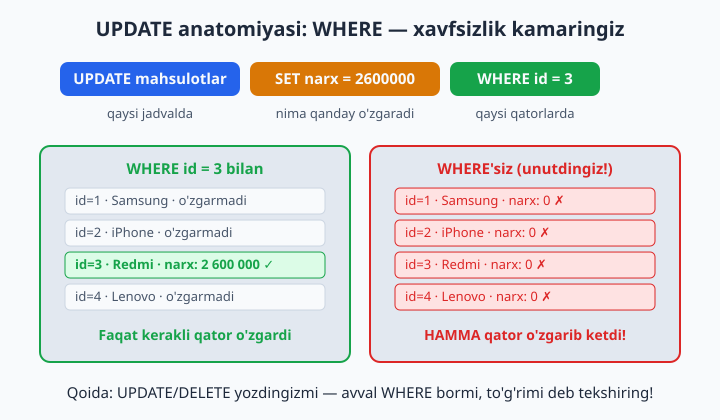
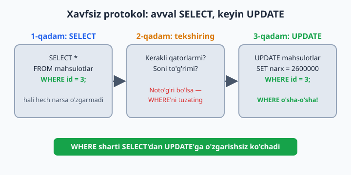
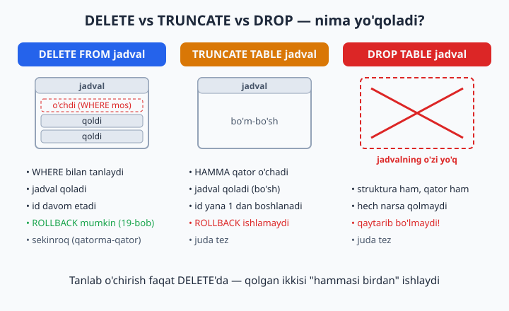

# 17 — UPDATE va DELETE — chuqur

[⬅️ Oldingi: 16 — Window funksiyalar](./16-window-funksiyalar.md) · [🏠 README](./README.md) · [Keyingi: 18 — ALTER, Constraint, Foreign Key ➡️](./18-alter-constraint-fk.md)

> **Bu bobda:** mavjud ma'lumotni o'zgartirish (UPDATE) va o'chirish (DELETE)ni chuqur o'rganamiz: WHERE unutilsa qanday falokat bo'lishini, "avval SELECT" xavfsiz protokolini, SQL_SAFE_UPDATES kamarini, NULL bilan bog'liq tuzoqni, soft delete (yumshoq o'chirish) degan professional yondashuvni va DELETE/TRUNCATE/DROP uchligining farqini ko'rib chiqamiz.

---

Shu paytgacha biz ma'lumotni asosan **o'qidik** (SELECT) va **qo'shdik** (INSERT). Endi qo'limizga "tuzatish qalami va o'chirg'ich" beriladi. Bu — kitobdagi eng ehtiyotkorlik talab qiladigan bob: SELECT'da xato qilsangiz, eng yomoni — noto'g'ri natija ko'rasiz, so'rovni qayta yozasiz, vassalom. UPDATE yoki DELETE'da xato qilsangiz — **ma'lumotning o'zi buziladi**, va oddiy "Ctrl+Z" yo'q (yagona qutqaruvchi — tranzaksiyalar, ularni 19-bobda o'rganamiz). Shuning uchun bu bobda buyruqlarning sintaksisidan ham ko'proq **xavfsiz ishlash odatiga** urg'u beramiz.

## UPDATE — o'zgartirish

```sql
UPDATE jadval SET ustun = qiymat WHERE shart;
```

Uch qism — uch savol:

- `UPDATE jadval` — **qaysi jadvalda** ishlaymiz;
- `SET ustun = qiymat` — **nimani qanday** o'zgartiramiz (vergul bilan bir nechta ustunni birdan);
- `WHERE shart` — **qaysi qatorlarda**. Eng muhim qism — shu!



```sql
USE dokon;

-- Bitta mahsulot narxini o'zgartirish:
UPDATE mahsulotlar SET narx = 2600000 WHERE id = 3;

-- Bir nechta ustun birdan (vergul bilan):
UPDATE mahsulotlar SET narx = 2500000, soni = 30 WHERE id = 3;

-- Hisob bilan (yangi qiymat eski qiymatga asoslanadi):
UPDATE mahsulotlar SET narx = narx * 1.10 WHERE kategoriya_id = 1;  -- telefonlar 10% qimmatladi

-- Shartli guruh: 5-iyungacha 'yolda' bo'lganlar yetib bordi deylik
UPDATE buyurtmalar SET holat = 'yetkazildi' WHERE holat = 'yolda' AND sana < '2026-06-05';
```

`narx = narx * 1.10` qatoriga e'tibor bering: tenglikning o'ng tomonida ustunning **eski** qiymati turibdi. MySQL har bir mos qator uchun eski narxni oladi, 1.10 ga ko'paytiradi va natijani o'sha qatorga qaytarib yozadi. Shu usul bilan "hammaga 5% chegirma", "ombordagi sonni 1 taga kamaytir" kabi amallar bitta buyruqda bajariladi.

📌 MySQL'ning javobini o'qishni odat qiling:

```
Query OK, 3 rows affected
Rows matched: 3  Changed: 3  Warnings: 0
```

`Rows matched` — WHERE nechta qatorni topdi, `Changed` — nechtasi haqiqatan o'zgardi (yangi qiymat eskisiga teng bo'lsa, qator "matched" hisoblanadi, lekin "changed" emas). Bu sonlar — bepul nazoratchi: 3 qator kutgan edingiz, 300 chiqdi? Demak, WHERE'da nimadir noto'g'ri — to'xtab tekshiring.

## ⚠️ HAYOTIY QOIDA №1: UPDATE/DELETE'da WHERE'ni UNUTMANG!

```sql
UPDATE mahsulotlar SET narx = 0;   -- ❌❌❌ HAMMA mahsulot 0 so'm bo'ldi!
```

WHERE'siz UPDATE — jadvaldagi **har bir** qatorga tegishli buyruq. MySQL e'tiroz bildirmaydi, "ishonchingiz komilmi?" deb so'ramaydi — jimgina hammasini o'zgartiradi. Bu xatoni har dasturchi hayotida bir marta qiladi (ko'pchilik — ish serverida). Sizning himoyangiz — **odat**:

1. Avval SELECT yozing: `SELECT * FROM mahsulotlar WHERE id = 3;`
2. Natija aynan siz kutgan qatorlar ekanini ko'ring
3. `SELECT *` qismini `UPDATE ... SET ...` ga almashtiring — **WHERE o'sha-o'sha qoladi**



Odatga qo'shimcha ikkita "xavfsizlik kamari" ham bor:

```sql
SET SQL_SAFE_UPDATES = 1;
```

Bu rejim yoqilganda MySQL kalit ustun (masalan, `id`) ishtirok etmagan WHERE'li yoki umuman WHERE'siz UPDATE/DELETE'ni xato bilan to'xtatadi (Error 1175) — ikkala holatda ham faqat buyruqda LIMIT bo'lmasa: LIMIT'li buyruq (masalan, `DELETE FROM loglar LIMIT 5;`) bu rejimda ham o'taveradi, chunki LIMIT'ning o'zi cheklov hisoblanadi. MySQL Workbench'da bu rejim standart yoqilgan — endi nima uchunligini bilasiz. Ba'zan u halol so'rovingizni ham to'xtatadi (WHERE'da kalit ustun bo'lmasa), lekin o'rganish davrida yoqib qo'ygan ma'qul. O'chirish: `SET SQL_SAFE_UPDATES = 0;`.

Ikkinchi kamar — **tranzaksiyalar**: `START TRANSACTION` bilan boshlasangiz, xato UPDATE'dan keyin `ROLLBACK` bilan hammasini orqaga qaytara olasiz. Bu alohida katta mavzu — 19-bobda batafsil.

## NULL tuzog'i: `= NULL` ishlamaydi

8-bobdan eslang: NULL bilan oddiy `=` taqqoslab bo'lmaydi. Bu qoida UPDATE/DELETE'ning WHERE'ida ham xuddi shunday ishlaydi:

```sql
USE klinika;  -- bemorlar jadvali klinika bazasida

UPDATE bemorlar SET telefon = '+998900000000' WHERE telefon = NULL;   -- ❌ 0 qator!
UPDATE bemorlar SET telefon = '+998900000000' WHERE telefon IS NULL;  -- ✅ to'g'ri
```

Eng yomoni — birinchi variant **xato bermaydi**: shunchaki `Rows matched: 0` deb jim qo'ya qoladi, siz esa "yangiladim" deb yuraverasiz. SET qismida esa NULL'ni bemalol yozish mumkin: `SET baho = NULL` qiymatni "bo'shatib" qo'yadi.

## DELETE — o'chirish

```sql
DELETE FROM jadval WHERE shart;
```

DELETE'da SET yo'q — qator butunlay yo'qoladi, shuning uchun "nimani?" deb so'ralmaydi, faqat "qaysi qatorlarni?" (WHERE). Xavfsiz protokol esa aynan o'sha: avval SELECT, keyin DELETE.

```sql
-- Avval ko'ramiz, nima o'chadi:
SELECT * FROM buyurtmalar WHERE holat = 'bekor' AND sana < '2026-01-01';

-- Keyin o'chiramiz:
DELETE FROM buyurtmalar WHERE holat = 'bekor' AND sana < '2026-01-01';
```

Bizning bazada 2026 yilgacha bekor qilingan buyurtma yo'q, shuning uchun bu buyruq `0 rows affected` qaytaradi — va bu normal holat: DELETE qator topolmasa, xato bermaydi, shunchaki hech narsani o'chirmaydi.

📌 Bog'langan jadvallarda **tartib** muhim: buyurtmani o'chirsangiz, uning `buyurtma_qatorlari` "egasiz" qolib ketadi. To'g'ri tartib — avval bola qatorlarni (`buyurtma_qatorlari`), keyin otasini (`buyurtmalar`) o'chirish. 18-bobda FOREIGN KEY bilan bazaning o'zi shu tartibni qattiq nazorat qilishini ko'ramiz.

## ORDER BY va LIMIT — MySQL'ning qo'shimcha imkoniyati

MySQL'da UPDATE/DELETE'ga ORDER BY va LIMIT qo'shish mumkin (bu standart SQL emas, MySQL'ning o'z qo'shimchasi):

```sql
-- Eng eski 100 ta yozuvni o'chirish (masalan, log tozalash):
DELETE FROM loglar ORDER BY sana ASC LIMIT 100;

-- Deylik, sinov jadvalida bitta yozuv adashib IKKI marta kiritilgan —
-- LIMIT 1 bilan dublikatning faqat bittasini o'chiramiz:
DELETE FROM sinov_mahsulotlar WHERE nomi = 'Telefon chexol' LIMIT 1;
```

LIMIT bu yerda ham kamar vazifasini bajaradi: WHERE kutilmaganda ko'p qatorni topib qolsa ham, buyruq ko'pi bilan LIMIT'da ko'rsatilgan sondagi qatorga ta'sir qiladi.

## Soft delete — professional yondashuv

Real tizimlarda ma'lumot kamdan-kam **chindan** o'chiriladi. O'rniga "o'chirilgan" deb belgilanadi:

```sql
-- ALTER TABLE (jadvalga yangi ustun qo'shish) bilan 18-bobda batafsil tanishamiz —
-- hozircha shunchaki nusxalab bajaring:
ALTER TABLE mijozlar ADD COLUMN ochirilgan_sana DATETIME NULL;

-- "O'chirish":
UPDATE mijozlar SET ochirilgan_sana = NOW() WHERE id = 6;

-- Faqat "tirik"larni ko'rsatish:
SELECT * FROM mijozlar WHERE ochirilgan_sana IS NULL;

-- "Tiklash":
UPDATE mijozlar SET ochirilgan_sana = NULL WHERE id = 6;
```

Nega? Mijoz "akkauntimni o'chirdim" deydi, bir hafta keyin "tiklang!" deydi. Buyurtma tarixi, hisobotlar — hammasi o'sha mijozga bog'liq edi. Hard delete = tarixni yo'qotish. Telegram'ning "akkauntga bir necha oy (standart sozlamada — 6 oy) kirmasangiz u o'chadi" siyosatini eslang — bu ham soft delete: avval belgi qo'yiladi, chindan o'chirish keyinroq (yoki umuman bo'lmaydi).

Yana bir nozik joy: nega ustun `ochirilgan TINYINT(0/1)` bayroq emas, `ochirilgan_sana DATETIME`? Chunki bitta ustun ikki savolga javob beradi: o'chirilganmi (`IS NULL` / `IS NOT NULL`) va **qachon** o'chirilgan. Keyinchalik hisobotda asqotadi: "o'tgan oyda nechta mijoz ketdi?"

## DELETE vs TRUNCATE vs DROP

```sql
DELETE FROM jadval;       -- qatorlarni o'chiradi (sekinroq), jadval qoladi, id davom etadi
TRUNCATE TABLE jadval;    -- hammasini tez tozalaydi, id yana 1 dan boshlanadi
DROP TABLE jadval;        -- jadvalning O'ZI yo'qoladi
```



| Savol | DELETE | TRUNCATE | DROP |
|---|---|---|---|
| Nima o'chadi? | qatorlar | HAMMA qator | jadvalning o'zi |
| WHERE bilan tanlash | ✅ bor | ❌ yo'q | ❌ yo'q |
| Jadval qoladimi? | ✅ qoladi | ✅ qoladi (bo'sh) | ❌ yo'qoladi |
| AUTO_INCREMENT | davom etadi | 1 dan boshlanadi | — |
| Tezligi | sekinroq (qatorma-qator) | juda tez | juda tez |
| ROLLBACK bo'ladimi? (19-bob) | ✅ ha | ❌ yo'q | ❌ yo'q |

Nega TRUNCATE bunchalik tez? Chunki u qatorlarni bitta-bitta o'chirib o'tirmaydi — jadvalni butunlay buzib, bo'sh holda qayta quradi. Aynan shu sababdan uni tranzaksiya ichida orqaga qaytarib bo'lmaydi, FOREIGN KEY bilan boshqa jadvaldan bog'lanib turgan jadvalga esa TRUNCATE umuman ishlamaydi (18-bobda ko'rasiz). Qoida sodda: kundalik ishda tanlab o'chirish — DELETE, sinov jadvalini "nol"dan boshlash — TRUNCATE, jadval umuman kerak bo'lmay qolsa — DROP.

## 17-bob masalalari

> Har UPDATE/DELETE oldidan SELECT bilan tekshirish odatini shu yerda shakllantiring!

1. (dokon) iPhone 15 narxini 11 000 000 ga tushiring (avval SELECT!)
2. (dokon) Telefonlar kategoriyasidagi hamma narxni 5% oshiring (avval kategoriya_id'ni aniqlab oling)
3. (dokon) id=6 mahsulot (Acer) omborga keldi: soni'ni 10 ga o'rnating
4. (dokon) 'yolda'dagi hamma buyurtmani 'yetkazildi'ga o'tkazing
5. (dokon) Buyurtma #7 sotib olindi deylik: undagi mahsulotlar sonini ombordan ayiring (qo'lda, mahsulot id'sini topib: `soni = soni - 1`)
6. (kutubxona) Aziz Karimov 'Sariq devni minib'ni qaytardi: tegishli ijaraga bugungi sanani yozing (qaysi qator ekanini SELECT bilan toping!)
7. (kutubxona) 'Kichkina shahzoda'dan 2 nusxa yangi keldi: nusxa_soni'ni 2 taga oshiring (`nusxa_soni = nusxa_soni + 2`)
8. (kutubxona) Nilufar Rahimova telefon qo'ydi: '+998904445577' yozing
9. (kutubxona) Hamma she'riyat kitoblarining nusxa_soni'ni 1 taga oshiring (bazada janr `'sheriyat'` deb yozilgan)
10. (klinika) Dr. Hakimov tajribasi 6 yil bo'ldi: yangilang
11. (klinika) Hamma shifokor qabul narxini 10 000 ga oshiring
12. (klinika) Telefoni NULL bemorlarga '+998900000000' vaqtinchalik raqam yozing (esingizdami: `IS NULL`!)
13. (taksi) Murod Aliyev reytingini qayta hisoblang: safarlardagi o'rtacha bahosini qo'lda hisoblab (AVG bilan SELECT), reyting ustuniga yozing
14. (taksi) Baho NULL safarlarga 5 qo'ying ("indamagan — rozi" siyosati :)
15. (dokon) Soft delete: mijozlarga `ochirilgan_sana` ustuni qo'shing (yuqoridagi `ALTER TABLE` misolidan nusxa oling — bu buyruq 18-bobda batafsil o'rgatiladi), bitta mijozni soft-delete qiling, "tiriklar" ro'yxatini chiqaring, keyin tiklang
16. (sinov bazasida!) Jadval yarating, 5 qator kiriting, WHERE'siz UPDATE qiling — oqibatni o'z ko'zingiz bilan ko'ring. Keyin TRUNCATE qilib tozalang
17. (sinov) DELETE bilan hammasini o'chiring, yangi qator kiriting — id nechadan boshlandi? TRUNCATE'dan keyin-chi? Solishtiring
18. (dokon) 'bekor' holatidagi buyurtmalarning qatorlarini (buyurtma_qatorlari) o'chiring — subquery bilan: `WHERE buyurtma_id IN (SELECT id FROM buyurtmalar WHERE holat='bekor')`
19. (taksi) 3 dan past baholi safarlarni o'chirishdan OLDIN ularni alohida jadvalga ko'chiring: `CREATE TABLE safarlar_arxiv AS SELECT * FROM safarlar WHERE baho < 3;` keyin DELETE — "arxivlash" patterni!
20. O'ylang va yozing: qaysi jadvallarda soft delete SHART (mijozlar? to'lovlar?), qaysilarida hard delete normal (loglar?)
