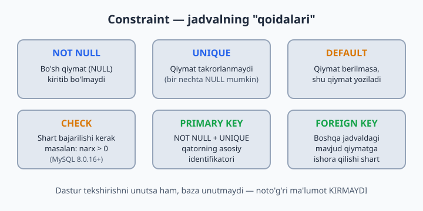
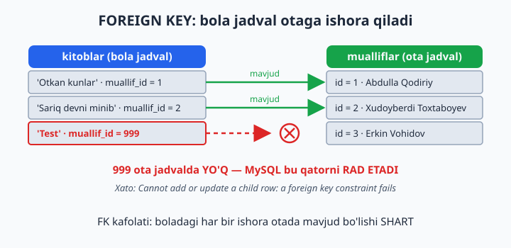
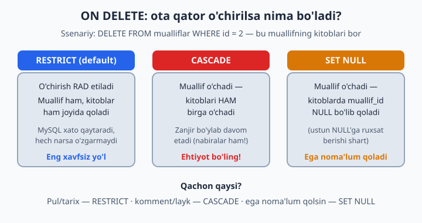

# 18 — ALTER, Constraint, Foreign Key

[⬅️ Oldingi: 17 — UPDATE va DELETE — chuqur](./17-update-delete.md) · [🏠 README](./README.md) · [Keyingi: 19 — Tranzaksiyalar ➡️](./19-tranzaksiyalar.md)

> **Bu bobda:** tayyor jadvalni buzmasdan o'zgartirishni (ALTER TABLE: ustun qo'shish, ta'rifini o'zgartirish, o'chirish), bazaning o'zi qo'riqlaydigan "qoidalar" — constraint'larni (NOT NULL, UNIQUE, DEFAULT, CHECK) va jadvallar orasidagi bog'lanish kafolati bo'lgan FOREIGN KEY'ni o'rganamiz; ota qator o'chirilganda nima bo'lishini ON DELETE (RESTRICT, CASCADE, SET NULL) bilan boshqarishni ham ko'ramiz.

---

Real loyihada jadval bir marta yaratilib, abadiy shu holicha qolmaydi: bugun mijozga email ustuni kerak bo'lib qoladi, ertaga telefon majburiy bo'lishi kerak, indinga bir ustun umuman ortiqcha chiqadi. Yaxshi yangilik — buning uchun jadvalni DROP qilib, ichidagi ma'lumot bilan birga yo'qotib, qaytadan qurish shart emas. Uyni buzib tashlamasdan ta'mirlaganday, jadvalni ham ishlab turgan holida o'zgartirish mumkin. Buning asbobi — **ALTER TABLE**.

## ALTER — tayyor jadvalni o'zgartirish

```sql
ALTER TABLE mijozlar ADD COLUMN email VARCHAR(150) NULL;            -- ustun qo'shish
ALTER TABLE mijozlar ADD COLUMN yosh INT AFTER ism;                 -- ma'lum joyga qo'shish
ALTER TABLE mijozlar MODIFY COLUMN telefon VARCHAR(25) NOT NULL;    -- ta'rifini o'zgartirish
ALTER TABLE mijozlar RENAME COLUMN yosh TO yoshi;                   -- ustun nomini o'zgartirish
ALTER TABLE mijozlar DROP COLUMN yoshi;                             -- ustunni o'chirish
ALTER TABLE mijozlar RENAME TO xaridorlar;                          -- jadval nomini o'zgartirish
```

⚠️ **Bu misollar `dokon.mijozlar` jadvalini haqiqatan o'zgartiradi** — ayniqsa oxirgi `RENAME TO xaridorlar` jadval nomini o'zgartirib yuboradi, shundan keyin `mijozlar`ga tayanadigan masalalar (shu bobdagi 11-masala ham!) va keyingi boblar ishlamay qoladi. Eng yaxshisi — bularni `sinov` bazasidagi alohida jadvalda mashq qiling. `dokon`da sinab ko'rgan bo'lsangiz, oxirida hammasini asl holiga qaytarib qo'ying:

```sql
ALTER TABLE xaridorlar RENAME TO mijozlar;               -- nomni qaytarish
ALTER TABLE mijozlar DROP COLUMN email;                  -- qo'shilgan ustunni olib tashlash
ALTER TABLE mijozlar MODIFY COLUMN telefon VARCHAR(20);  -- asl ta'rifiga qaytarish
```

📌 **MODIFY ustunning butun ta'rifini qaytadan yozadi.** Bu eng ko'p qoqiladigan joy: `telefon` avval `VARCHAR(20) NOT NULL` bo'lsa-yu, siz `MODIFY COLUMN telefon VARCHAR(25)` deb yozsangiz (NOT NULL'ni unutib), ustun endi NULL'ga ruxsat beradigan bo'lib qoladi. Shuning uchun MODIFY ishlatganda saqlab qolmoqchi bo'lgan hamma xususiyatni qayta sanab o'ting.

⚠️ Ehtiyot bo'ladigan ikki holat: `DROP COLUMN` ustun bilan birga undagi **barcha ma'lumotni** qaytarib bo'lmas tarzda o'chiradi; turini "toraytirish" esa (masalan, `VARCHAR(150)` → `VARCHAR(20)`) ichida uzunroq qiymat bor bo'lsa xato beradi. Va yana: millionlab qatorli jadvalda ALTER bir necha soniya, hatto daqiqa olishi mumkin — bu normal, MySQL ba'zi o'zgarishlarda jadvalni qayta quradi.

O'zgartirgandan keyin natijani tekshirib qo'yish odat bo'lsin:

```sql
DESCRIBE mijozlar;            -- ustunlar ro'yxati: turi, NULL/NOT NULL, default
SHOW CREATE TABLE mijozlar;   -- jadvalning to'liq ta'rifi (constraint'lar bilan)
```

## Constraint — bazaning "qoidalari"

Constraint (cheklov) = "bu jadvalga noto'g'ri ma'lumot KIRMAYDI" kafolati. Buni binoning kirishidagi qo'riqchi deb tasavvur qiling: ruxsatnomasi yo'q odamni ichkariga qo'ymaydi. Tekshiruvni dasturga emas, bazaning o'ziga topshirishning katta afzalligi bor: dastur kodida tekshirishni unutib qo'yish mumkin (yoki bazaga uchta turli dastur ulanadi-yu, bittasida tekshiruv yo'q), baza esa hech qachon "unutmaydi" — qoida hamma uchun, doim ishlaydi:

| Constraint | Vazifasi |
|-----------|----------|
| `NOT NULL` | bo'sh bo'lmasin |
| `UNIQUE` | takrorlanmasin |
| `PRIMARY KEY` | NOT NULL + UNIQUE + asosiy identifikator |
| `DEFAULT` | berilmasa, shu qiymat |
| `CHECK` | shart bajarilsin (MySQL 8.0.16+) |
| `FOREIGN KEY` | boshqa jadvaldagi mavjud qiymatga ishora qilsin |



```sql
ALTER TABLE klinika.shifokorlar ADD CONSTRAINT chk_tajriba CHECK (tajriba_yil >= 0);
-- Endi tajriba_yil = -5 kiritib BO'LMAYDI

ALTER TABLE klinika.bemorlar ADD CONSTRAINT uq_telefon UNIQUE (telefon);
-- Endi bitta telefon raqami ikki marta kirmaydi
```

📌 **Constraint'ga nom berish odati:** `chk_` (CHECK), `uq_` (UNIQUE), `fk_` (FOREIGN KEY) prefikslari bilan. Nom bersangiz, qoida buzilganda xato xabarida aynan qaysi constraint "ushlab qolgani" ko'rinadi, keyinchalik o'chirish ham oson bo'ladi:

```sql
ALTER TABLE klinika.shifokorlar DROP CHECK chk_tajriba;   -- CHECK'ni o'chirish
ALTER TABLE klinika.bemorlar DROP INDEX uq_telefon;       -- UNIQUE aslida indeks, shunday o'chiriladi
```

⚠️ Tarixiy tuzoq: MySQL 8.0.16 dan oldingi versiyalar (jumladan, eski 5.7) CHECK'ni xatosiz **qabul qilardi, lekin tekshirmasdi** — qoida bordek ko'rinib, aslida ishlamasdi. MySQL 8 ning yangi versiyalarida bu tuzatilgan: CHECK haqiqatan qo'riqlaydi. Versiyangizni `SELECT VERSION();` bilan tekshirib oling.

Yana bir muhim nuans: **CHECK NULL'ni tekshirmaydi.** `CHECK (baho BETWEEN 1 AND 5)` qoidasi bor jadvalga `baho = NULL` bemalol kiradi, chunki NULL bilan solishtirish natijasi "noma'lum" — rad etish uchun yetarli emas. NULL ham kirmasin desangiz, ustunga alohida NOT NULL qo'ying.

## FOREIGN KEY — bog'lanish kafolati

Hozir `kitoblar.muallif_id`ga 999 yozsangiz — MySQL indamaydi, garchi 999-muallif yo'q bo'lsa ham. Bu "yetim qator" (orphan row) — hisobotlarda yo'qolib qoladigan, JOIN'da chiqmay qoladigan, xatolar manbai bo'lgan ma'lumot. FOREIGN KEY shundan himoya qiladi: "bola" jadvaldagi ishora "ota" jadvalda haqiqatan mavjudligini har safar tekshiradi:



```sql
USE kutubxona;

ALTER TABLE kitoblar
ADD CONSTRAINT fk_kitob_muallif
FOREIGN KEY (muallif_id) REFERENCES mualliflar(id);

-- Endi:
INSERT INTO kitoblar (nomi, muallif_id) VALUES ('Test', 999);
-- ❌ Xato: Cannot add or update a child row — 999-muallif yo'q!

DELETE FROM mualliflar WHERE id = 1;
-- ❌ Xato: kitoblari bor muallifni o'chirib bo'lmaydi!
```

E'tibor bering: FK himoyasi **ikki tomonlama** ishlaydi. Bola jadvalga mavjud bo'lmagan ishorani kiritib bo'lmaydi, ota jadvaldan esa "bolalari" bor qatorni (default holatda) o'chirib bo'lmaydi.

FK qo'shishda ikkita texnik talab bor:

- **Turlar mos bo'lsin:** `muallif_id INT` bo'lsa, `mualliflar.id` ham INT bo'lishi kerak (ikkalasi ham signed yoki ikkalasi ham UNSIGNED).
- **Mavjud ma'lumot toza bo'lsin:** jadvalda allaqachon yetim qatorlar bo'lsa (masalan, `muallif_id = 999`), MySQL FK qo'shishga ruxsat bermaydi — avval ularni tuzating (UPDATE bilan to'g'rilang yoki NULL qiling).

📌 MySQL FK ustuniga avtomatik indeks ham qurib qo'yadi — bu tekshiruv tez ishlashi uchun kerak (indekslarni 21-bobda chuqur ko'ramiz). FK'ni o'chirish: `ALTER TABLE kitoblar DROP FOREIGN KEY fk_kitob_muallif;`.

## ON DELETE — parent o'chsa nima bo'lsin?

FK qo'shayotganda "ota qator o'chirilsa, bolalari bilan nima qilamiz?" degan savolga oldindan javob berib qo'yish mumkin. Uchta variantdan **bittasini** tanlaysiz. Diqqat: `fk_kitob_muallif` nomli FK'ni yuqoridagi bo'limda allaqachon yaratgan edik — xuddi shu nom bilan ikkinchisini qo'shib bo'lmaydi (MySQL `Duplicate foreign key constraint name` xatosini beradi). Shuning uchun qaysi variantni sinamang, avval eskisini o'chiring:

```sql
-- Avval oldingi bo'limda yaratilgan FK'ni o'chiramiz (aks holda
-- "Duplicate foreign key constraint name" xatosi chiqadi):
ALTER TABLE kitoblar DROP FOREIGN KEY fk_kitob_muallif;

-- Variant 1: o'chirishga ruxsat YO'Q (default, eng xavfsiz)
ALTER TABLE kitoblar ADD CONSTRAINT fk_kitob_muallif
FOREIGN KEY (muallif_id) REFERENCES mualliflar(id) ON DELETE RESTRICT;

-- Variant 2: muallif o'chsa, kitoblari HAM o'chadi
ALTER TABLE kitoblar ADD CONSTRAINT fk_kitob_muallif
FOREIGN KEY (muallif_id) REFERENCES mualliflar(id) ON DELETE CASCADE;

-- Variant 3: muallif o'chsa, kitobda muallif_id = NULL bo'lib qoladi
ALTER TABLE kitoblar ADD CONSTRAINT fk_kitob_muallif
FOREIGN KEY (muallif_id) REFERENCES mualliflar(id) ON DELETE SET NULL;
```



Qachon qaysi? **Pul/tarix bor joyda — RESTRICT.** Komment/layk kabi "arzon" bog'liqlarda — CASCADE. "Bola qator qolsin, lekin egasi noma'lum bo'lsin" — SET NULL.

⚠️ CASCADE bilan ehtiyot bo'ling: u zanjir bo'ylab ishlaydi. Muallifni o'chirsangiz kitoblari o'chadi, kitoblarga CASCADE bilan bog'langan ijaralar bo'lsa — ular ham o'chadi. Bitta DELETE ko'zda tutilmagan minglab qatorni olib ketishi mumkin. SET NULL esa faqat ustun NULL'ga ruxsat bersagina ishlaydi — `NOT NULL` ustunga SET NULL qo'yib bo'lmaydi.

📌 ON DELETE'ning egizagi ham bor: **ON UPDATE** — ota qatorning id'si o'zgarsa nima bo'lishini belgilaydi. Amalda PK qiymatlari deyarli hech qachon o'zgartirilmaydi, shuning uchun ko'pincha yozilmaydi (default — RESTRICT).

## 18-bob masalalari

1. (kutubxona) `kitoblar`ga `til VARCHAR(30) DEFAULT 'ozbek'` ustuni qo'shing
2. (kutubxona) Yangi kitob kiriting (tilsiz) — DEFAULT ishladimi?
3. (kutubxona) `azolar.telefon`ga UNIQUE qo'shing: `ALTER TABLE azolar ADD CONSTRAINT uq_telefon UNIQUE (telefon);` — NULL'lar bor-ku, ishladimi? (UNIQUE bir nechta NULL'ga ruxsat beradi!)
4. (kutubxona) Mavjud telefon bilan a'zo kiritib ko'ring — endi xato chiqishi kerak
5. (kutubxona) `kitoblar`ga FK qo'shing (yuqoridagi misol), 999-muallif bilan kitob kiritib ko'ring
6. (kutubxona) `ijaralar`ga 2 ta FK qo'shing: kitob_id → kitoblar, azo_id → azolar
7. (kutubxona) Kitobi bor muallifni DELETE qilib ko'ring — RESTRICT xatosini oling
8. (kutubxona) CHECK qo'shing: `nusxa_soni >= 0`. Keyin -3 kiritib ko'ring
9. (kutubxona) CHECK qo'shing: `yil BETWEEN 800 AND 2100`. 2500-yil bilan sinab ko'ring
10. (dokon) `mahsulotlar.kategoriya_id`ga FK qo'shing (kategoriyalar'ga)
11. (dokon) `buyurtmalar.mijoz_id` va `buyurtma_qatorlari`ning 2 ustuniga FK qo'shing
12. (dokon) CHECK: `narx > 0` va `soni >= 0` — ikkalasini qo'shib, buzib ko'ring
13. (dokon) Yangi jadval `izohlar` yarating: id, mahsulot_id FK **ON DELETE CASCADE** bilan, matn. Buyurtmalarda mavjud mahsulotni tanlang (masalan, id = 1), unga izoh kiriting, keyin mahsulotni o'chirib ko'ring — o'chira olmaysiz (buyurtma_qatorlari RESTRICT ushlab turadi) — ana shu zanjirli himoyani his qiling. (Diqqat: 6- va 11-mahsulotlar hech bir buyurtmada yo'q — ulardan birini tanlasangiz, RESTRICT aralashmaydi, mahsulot izohi bilan birga o'chib ketadi)
14. (klinika) `qabullar`ga 2 ta FK (bemor, shifokor) RESTRICT bilan
15. (klinika) CHECK: `tolov >= 0`; `tajriba_yil <= 70`
16. (taksi) `mashinalar.haydovchi_id`ga FK **ON DELETE SET NULL** bilan (ustun NULL'ga ruxsat berishini tekshiring — kerak bo'lsa MODIFY qiling). Test haydovchi yarating, mashina bering, haydovchini o'chiring — mashinada nima qoldi?
17. (taksi) CHECK: `baho BETWEEN 1 AND 5` (NULL ruxsat etiladi — CHECK NULL'ni tekshirmaydi, bu normal)
18. (sinov) Ataylab: bir-biriga FK bilan bog'langan 2 jadval yaratib, parent'ni DROP qilib ko'ring — nima dedi? (avval FK yoki child o'chiriladi)
19. (kutubxona) `azolar.telefon`ni NOT NULL qiling (MODIFY) — NULL qiymat bor-ku (Nilufar Rahimovaning telefoni NULL), nima bo'ladi? Xatoni o'z ko'zingiz bilan ko'ring, keyin UPDATE bilan to'ldirib, qayta urinib ko'ring
20. Hammasiga FK qo'yib chiqqaningizdan keyin: `SELECT * FROM information_schema.KEY_COLUMN_USAGE WHERE TABLE_SCHEMA='dokon' AND REFERENCED_TABLE_NAME IS NOT NULL;` — bazadagi barcha FK'larni ko'ring
