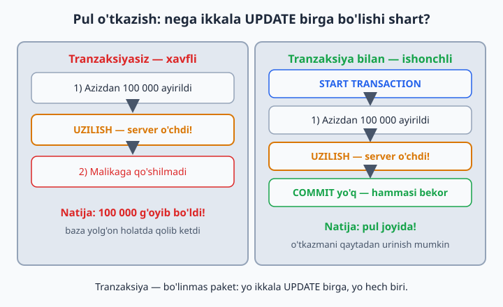
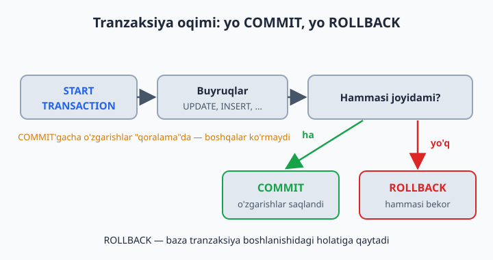
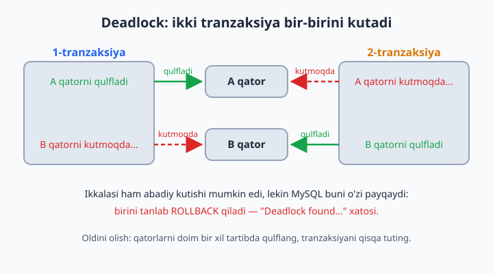
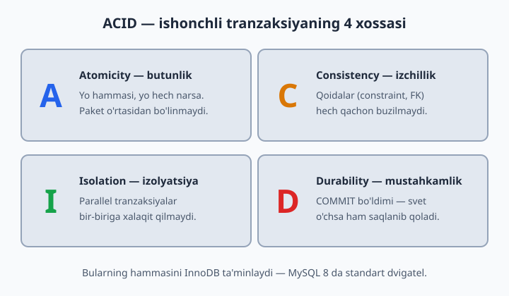

# 19 — Tranzaksiyalar

[⬅️ Oldingi: 18 — ALTER, Constraint, Foreign Key](./18-alter-constraint-fk.md) · [🏠 README](./README.md) · [Keyingi: 20 — Normalizatsiya — to'g'ri schema ➡️](./20-normalizatsiya.md)

> **Bu bobda:** tranzaksiya nima va u bizni qanday falokatdan asrashini ("yo hammasi, yo hech narsa" tamoyili), `START TRANSACTION`, `COMMIT` va `ROLLBACK` buyruqlarini, autocommit rejimini, parallel ishlaganda `FOR UPDATE` qulfi qanday qutqarishini, deadlock degan "tiqilinch" nima ekanini va intervyularning sevimli savoli — ACID xossalarini o'rganamiz.

---

## Muammo: yarim bajarilgan ish

Do'konda buyurtma ikki qadamdan iborat: (1) buyurtma yoziladi, (2) ombordan kamayadi. 1-qadam bo'ldi, 2-qadamda svet o'chdi. Natija: buyurtma bor, ombor kamaymagan — **ma'lumot yolg'on**.

Bank misoli battarroq: Aziz Malikaga 100 000 o'tkazdi. (1) Azizdan ayirildi, (2) Malikaga... server qulab tushdi. 100 000 **g'oyib bo'ldi**.

Bunday "yarim ish"ning eng xavfli tomoni — hech qanday xato xabari chiqmaydi. Baza ishlayveradi, dastur ishlayveradi, faqat raqamlar yolg'on gapiradi. Bunday nosozlikni oradan hafta o'tib topish — pichan g'aramidan igna izlash bilan barobar.



## Yechim: tranzaksiya — "yo hammasi, yo hech narsa"

Tranzaksiya — bir nechta buyruqni bitta **bo'linmas paket**ga bog'lash. Paket yoki to'liq bajariladi, yoki umuman bajarilmaydi — o'rtasi yo'q. (`hisoblar` jadvalini hali yaratmadik — bob oxiridagi 4-masalada `sinov` bazasida o'zingiz qurasiz, hozir g'oyaga e'tibor bering.)

```sql
START TRANSACTION;

UPDATE hisoblar SET balans = balans - 100000 WHERE egasi = 'Aziz';
UPDATE hisoblar SET balans = balans + 100000 WHERE egasi = 'Malika';

COMMIT;      -- ikkalasi ham muvaffaqiyatli — endi saqlansin
```

Agar orada xato bo'lsa:

```sql
ROLLBACK;    -- hammasi BEKOR, boshlang'ich holatga qaytadi
```

COMMIT'gacha o'zgarishlar "qoralama"da — boshqa foydalanuvchilar ko'rmaydi. Buni xat yozishga o'xshating: "yuborish" tugmasini bosmaguningizcha xatni xohlagancha tahrirlaysiz yoki butunlay o'chirib tashlaysiz. COMMIT — "yuborish", ROLLBACK — "o'chirib tashlash".



📌 Tranzaksiyalar jadvalning InnoDB "dvigateli"da ishlaydi. MySQL 8 da har bir yangi jadval standart holatda InnoDB bo'lib yaratiladi, shuning uchun qo'shimcha hech narsa sozlash shart emas — jadvallaringiz allaqachon tayyor.

## Qo'lda sinab ko'rish

```sql
USE dokon;

START TRANSACTION;
UPDATE mahsulotlar SET soni = 0 WHERE id = 1;
SELECT soni FROM mahsulotlar WHERE id = 1;   -- 0 ko'rinadi (sizga)
ROLLBACK;
SELECT soni FROM mahsulotlar WHERE id = 1;   -- eski qiymat qaytdi!
```

**Eslatma:** MySQL'da har bir alohida buyruq o'z-o'zidan kichik tranzaksiya — yozdingizmi, darhol saqlanadi. Bu rejim **autocommit** deyiladi. `START TRANSACTION` esa "to'xta, men o'zim COMMIT demagunimcha saqlama" degani: bir nechta buyruqni bitta paketga bog'laydi.

Yana ikkita muhim qoidani bilib qo'ying:

- **Xato avtomatik ROLLBACK qilmaydi.** Tranzaksiya ichida bitta buyruq xato bersa (masalan, yo'q jadvalga INSERT), MySQL odatda faqat o'sha buyruqni rad etadi — tranzaksiya ochiq qolaveradi. COMMIT yoki ROLLBACK qarori sizda (buni 7-masalada o'zingiz sinaysiz).
- **DDL buyruqlar tranzaksiyani yopib yuboradi.** `CREATE TABLE`, `ALTER`, `DROP` kabi buyruqlar tranzaksiya o'rtasida kelsa, MySQL avval ungacha qilingan ishlarni **jimgina COMMIT qilib yuboradi** — ROLLBACK'ka qaytib bo'lmaydi. Shuning uchun tranzaksiya ichida faqat ma'lumot bilan ishlang: INSERT, UPDATE, DELETE, SELECT.

## Real misol: buyurtma rasmiylashtirish

```sql
START TRANSACTION;

INSERT INTO buyurtmalar (mijoz_id, sana, holat) VALUES (2, NOW(), 'yangi');
SET @buyurtma = LAST_INSERT_ID();

INSERT INTO buyurtma_qatorlari (buyurtma_id, mahsulot_id, soni, narx)
VALUES (@buyurtma, 3, 1, 2800000);

UPDATE mahsulotlar SET soni = soni - 1 WHERE id = 3 AND soni >= 1;

COMMIT;
```

`@buyurtma` — sessiya o'zgaruvchisi (ulanish ochiq turguncha yashaydi): birinchi INSERT bergan id'ni eslab qolib, ikkinchisida ishlatdik. `AND soni >= 1` — omborda yo'q narsani sotib yubormaslik himoyasi.

Real dasturda COMMIT'dan oldin yana bir tekshiruv qilinadi: `SELECT ROW_COUNT();` — oxirgi UPDATE nechta qatorni o'zgartirganini aytadi. `0` chiqdimi — demak shart bajarilmagan (ombor bo'sh ekan), butun buyurtmani ROLLBACK qilamiz; `1` bo'lsa — bemalol COMMIT.

## Parallellik: FOR UPDATE qulfi

Omborda oxirgi bitta iPhone qoldi deylik (`soni = 1`). Ikki kassir BIR VAQTDA sotmoqchi: ikkalasi ham SELECT bilan qaraydi, ikkalasi ham `soni = 1` ni ko'radi, "bor ekan!" deb ikkalasi ham sotadi → `soni = -1`. Mijozlardan biriga yo'q telefonni sotib qo'ydik.

Muammo — SELECT bilan UPDATE orasidagi vaqtda: siz "qancha bor?" deb qaragan paytdan "kamaytir" degan paytgacha boshqa odam ham ulgurib qolishi mumkin. Yechim — qatorni o'qiyotgandayoq qulflab qo'yish:

```sql
START TRANSACTION;
SELECT soni FROM mahsulotlar WHERE id = 2 FOR UPDATE;
-- FOR UPDATE = bu qator QULFLANDI. 2-kassir xuddi shu joyda KUTIB TURADI,
-- toki biz COMMIT qilmagunimizcha. Keyin u yangi (kamaygan) sonni ko'radi.
UPDATE mahsulotlar SET soni = soni - 1 WHERE id = 2;
COMMIT;
```

📌 FOR UPDATE faqat tranzaksiya ichida ma'noga ega: qulf COMMIT yoki ROLLBACK bo'lganda bo'shaydi. Shuning uchun tranzaksiyani iloji boricha qisqa tuting — qulf turgan paytda boshqalar navbatda kutib turadi.

## Deadlock: ikki tranzaksiya bir-birini kutib qoladi

Qulf — kuchli qurol, lekin uning "yon ta'siri" bor. Tasavvur qiling: 1-tranzaksiya A qatorni qulflab olib, endi B qatorni so'rayapti. Xuddi shu payt 2-tranzaksiya B ni qulflab olib, A ni so'rayapti. Ikkalasi ham bir-birini kutadi — tor ko'chada ikki mashina yuzma-yuz kelib qolganday: hech biri orqaga yurmasa, ikkalasi ham abadiy qotib qoladi. Bu holat **deadlock** (o'zaro qulf) deyiladi.



Yaxshi yangilik: MySQL buni o'zi payqaydi va "qurbon" sifatida bittasini tanlab ROLLBACK qilib yuboradi — o'sha tranzaksiya `Deadlock found when trying to get lock` xatosini oladi. Dastur bu xatoni ushlab, tranzaksiyani qaytadan urinishi kerak. Oldini olish retsepti esa oddiy: qatorlarni hamma joyda **bir xil tartibda** qulflang (masalan, doim kichik id'dan kattasiga qarab) va tranzaksiyani qisqa tuting.

## ACID — bilib qo'ying (intervyu savoli)

Tranzaksiya haqida gap ochilsa, intervyuda albatta ACID so'raladi. Bu — ishonchli tranzaksiyaning 4 xossasi:



- **A**tomicity (butunlik): yo hammasi, yo hech narsa — paket o'rtasidan bo'linmaydi. Pul o'tkazmaning "yarmi" bajarilib qolishi mumkin emas.
- **C**onsistency (izchillik): tranzaksiya bazani bir to'g'ri holatdan boshqa to'g'ri holatga o'tkazadi — qoidalar (constraint, FOREIGN KEY) hech qachon buzilmaydi.
- **I**solation (izolyatsiya): parallel tranzaksiyalar bir-biriga xalaqit qilmaydi — har biri o'zini "bazada yolg'iz ishlayapman" deb his qiladi.
- **D**urability (mustahkamlik): COMMIT bo'ldimi — svet o'chsa ham, server qulab tushsa ham ma'lumot diskda saqlanib qolgan.

## 19-bob masalalari

1. (dokon) Yuqoridagi "qo'lda sinash"ni bajaring: TRANSACTION → UPDATE → ROLLBACK → tekshiring
2. (dokon) Xuddi shuni COMMIT bilan: o'zgarish saqlanib qoldimi?
3. (dokon) ROLLBACK'dan keyin ROLLBACK qilib ko'ring — nima bo'ladi? (hech nima, tranzaksiya allaqachon tugagan)
4. (sinov) `hisoblar` jadvali yarating (egasi VARCHAR(100), balans DECIMAL), Aziz=500000, Malika=200000 kiriting
5. (sinov) Azizdan Malikaga 100 000 o'tkazing — to'liq tranzaksiya bilan. Oxirida ikkala balansni tekshiring (jami 700 000 bo'lishi kerak!)
6. (sinov) O'tkazma qiling, lekin COMMIT o'rniga ROLLBACK — balanslar joyidami?
7. (sinov) Tranzaksiya oching, avval bitta UPDATE bajaring (masalan, Aziz balansiga 1 qo'shing), keyin ataylab xato buyruq yozing (mavjud bo'lmagan jadvalga INSERT) — xato chiqadi, lekin tranzaksiya ochiq qoladi. Endi ROLLBACK qiling. Birinchi UPDATE ham bekor bo'ldimi, tekshiring
8. (dokon) "Buyurtma rasmiylashtirish" misolini o'zingiz uchun takrorlang: yangi buyurtma + 2 ta qator + ombor kamaytirish, hammasi bitta tranzaksiyada
9. (dokon) `UPDATE ... SET soni = soni - 1 WHERE id = 6 AND soni >= 1` — Acer (soni=0 yoki siz qilgan qiymat) uchun bajaring. `ROW_COUNT()` funksiyasi bilan nechta qator o'zgarganini tekshiring: `SELECT ROW_COUNT();` — 0 chiqsa "sotib bo'lmadi" degani
10. (kutubxona) Kitob berish tranzaksiyasi: `ijaralar`ga INSERT + `kitoblar`da `nusxa_soni - 1` (faqat nusxa bor bo'lsa!)
11. (kutubxona) Kitob qaytarish tranzaksiyasi: `ijaralar`da `qaytarilgan_sana`ni to'ldirish + `kitoblar`da `nusxa_soni + 1`
12. (klinika) Qabul yozish tranzaksiyasi: `qabullar`ga INSERT (sana NOW(), tolov shifokorning `qabul_narxi`ga teng — avval SELECT bilan oling yoki subquery ishlating)
13. FOR UPDATE'ni HIS QILISH (2 ta oyna kerak!): 2 ta terminal oching. 1-oynada: START TRANSACTION; SELECT ... FOR UPDATE. 2-oynada xuddi shu SELECT ... FOR UPDATE — u KUTIB qoladi! 1-oynada COMMIT qiling — 2-oyna davom etadi. Buni ko'rgan odam qulflarni unutmaydi
14. 13-mashqni FOR UPDATE'siz takrorlang — 2-oyna kutmaydi, darrov o'qiydi. Farqni yozib oling
15. (taksi) Safar yakunlash tranzaksiyasi: `safarlar`ga INSERT + haydovchi reytingini yangilash (o'rtacha baho asosida)
16. Savol-javob: nega SELECT'larga odatda tranzaksiya kerak emas? (o'zgartirmaydi). Qachon kerak? (izchil "surat" kerak bo'lganda)
17. (sinov) Autocommit'ni his qiling: `SET autocommit = 0;` qiling, UPDATE bajaring, boshqa oynadan qarang (ko'rinmaydi), COMMIT qiling (ko'rinadi). Oxirida `SET autocommit = 1;` ga qaytaring
18. (dokon) Tranzaksiya ichida 3 ta UPDATE, 2-sidan keyin `SAVEPOINT nuqta1;` qo'ying, 3-UPDATE'dan keyin `ROLLBACK TO nuqta1;` — faqat 3-si bekor bo'ladi. Sinang!
19. O'ylang: ombor kamaytirishda nega `WHERE soni >= 1` sharti qulfdan tashqari YANA kerak? (himoya qatlamlari)
20. Yozing: o'z hayotingizdan 3 ta "tranzaksiya bo'lishi SHART" ssenariy (masalan: Click to'lov, aviabilet bron...)
