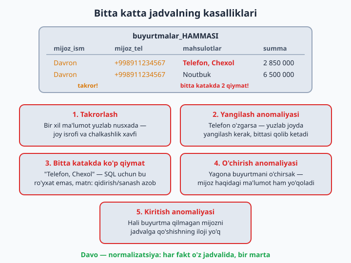
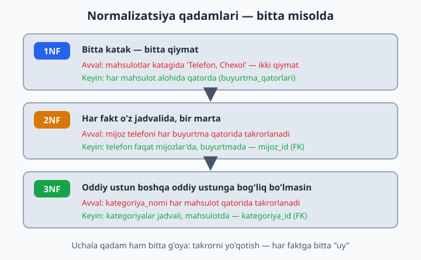
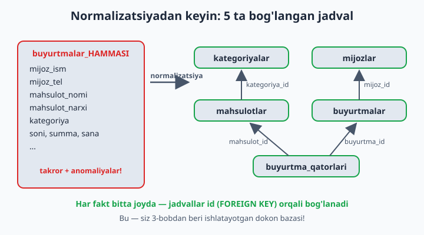
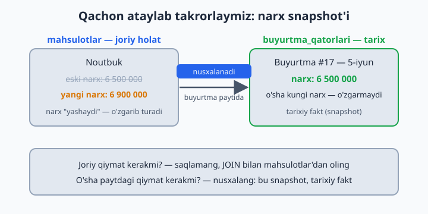

# 20 — Normalizatsiya — to'g'ri schema

[⬅️ Oldingi: 19 — Tranzaksiyalar](./19-tranzaksiyalar.md) · [🏠 README](./README.md) · [Keyingi: 21 — Indekslar ➡️](./21-indekslar.md)

> **Bu bobda:** "hammasi bitta jadvalda" dizayni qanday kasalliklarga olib kelishini (takrorlash, yangilash, o'chirish va kiritish anomaliyalari), normalizatsiyaning 3 ta sodda qoidasini (1NF, 2NF, 3NF — oddiy tilda), jadvallar orasidagi bog'lanish turlarini (1:1, 1:N, N:M) va qachon ataylab takrorlash to'g'ri ekanini (snapshot, denormalizatsiya) o'rganamiz.

---

## Yomon jadval qanday ko'rinadi

Shu paytgacha tayyor, to'g'ri loyihalangan bazalar bilan ishladik. Endi eng muhim savolga keldik: **nega** do'kon bazasi 5 ta jadval? Bitta katta jadval qulayroq emasmi — hammasi bir joyda-ku? Javobni his qilish uchun avval o'sha "qulay" variantni ko'raylik. Tasavvur qiling, do'kon hamma narsani BITTA jadvalga yozadi:

```
buyurtmalar_HAMMASI:
| mijoz_ism | mijoz_tel    | mahsulotlar           | summa  |
| Davron    | +99891123... | Telefon, Chexol       | 2850000|
| Davron    | +99891123... | Noutbuk               | 6500000|
```

Birinchi qarashda sodda ko'rinadi. Lekin bu jadval kamida 5 ta kasallik bilan og'rigan:

1. **Takrorlash:** Davronning telefoni har qatorda qayta yoziladi. 100 buyurtma — 100 nusxa. Joy isrofi-ku mayli, asl xavf keyingi bandda
2. **Yangilash anomaliyasi:** Davron raqamini o'zgartirsa — 100 joyda yangilash kerak. Bittasi qolib ketsa, bazada ikki xil "haqiqat" paydo bo'ladi: qaysi raqam to'g'ri? Endi hech kim bilmaydi
3. **Bitta katakda ko'p qiymat:** "Telefon, Chexol" — bu SQL uchun shunchaki matn, ro'yxat emas. "Chexol jami nechta sotilgan?" deb so'rab bo'lmaydi — alohida mahsulotni qidirish/sanash azobga aylanadi
4. **O'chirish anomaliyasi:** Davronning yagona buyurtmasini o'chirsak — Davron haqidagi ma'lumot (ismi, telefoni) ham birga yo'qoladi
5. **Kiritish anomaliyasi:** hali buyurtma qilmagan mijozni qo'shib bo'lmaydi — mahsulot va summa kataklariga nima yozasiz?



Bunday muammolarning rasmiy nomi bor: **anomaliya** — jadval tuzilishi noto'g'ri bo'lgani uchun kelib chiqadigan "g'alati" holatlar. Davo esa bitta: **normalizatsiya** — ma'lumotni takrorsiz, tartibli jadvallarga ajratish.

## Davo: 3 ta sodda qoida

Normalizatsiya — qo'rqinchli akademik so'z, lekin mag'zi uchta oddiy qoidaga sig'adi:

**1-qoida (1NF): bitta katak — bitta qiymat.**
"Telefon, Chexol" ❌ → har mahsulot alohida qatorda (buyurtma_qatorlari jadvali!). Bitta buyurtma — bir nechta qator, har qatorda bitta mahsulot.

**2-qoida (2NF/3NF soddalashtirilgan): har fakt — O'Z jadvalida, BIR marta.**
Mijoz telefoni — `mijozlar`da. Mahsulot narxi — `mahsulotlar`da. Buyurtma sanasi — `buyurtmalar`da. Telefon o'zgarsa — BIR joyda yangilanadi, vassalom: yangilash anomaliyasi yo'qoldi.

**3-qoida: jadvallar id orqali bog'lanadi (FK).**
Buyurtma mijozning ismini emas, `mijoz_id`sini saqlaydi. Ism kerak bo'lsa — JOIN qilamiz (12-bob), bog'lanish buzilmasligini esa FOREIGN KEY qo'riqlaydi (18-bob).



📌 Rasmiy atamalar: bu qoidalar **normal formalar** (1NF, 2NF, 3NF) deb ataladi. Akademik kitoblarda ularning qat'iy ta'riflari (va davomi: BCNF, 4NF, 5NF...) bor, lekin amaliyotda yuqoridagi uch qoidaga amal qilsangiz, bazangiz taxminan 3NF darajasida bo'ladi — bu mutlaq ko'pchilik loyihaga yetib ortadi.

Endi `buyurtmalar_HAMMASI`ni shu qoidalar bilan "davolaylik". Natijada nima chiqadi?

```
mijozlar:           id, ism, telefon
kategoriyalar:      id, nomi
mahsulotlar:        id, nomi, kategoriya_id, narx, ...
buyurtmalar:        id, mijoz_id, sana, holat
buyurtma_qatorlari: id, buyurtma_id, mahsulot_id, soni, narx
```

Tanish-a? Natija — bizning `dokon` bazasi! 5 jadval: kategoriyalar, mahsulotlar, mijozlar, buyurtmalar, buyurtma_qatorlari. Siz 3-bobdan beri NORMALLASHGAN baza bilan ishlayapsiz :) Endi nega aynan shunday loyihalanganini ham bilasiz.



## Bog'lanish turlari

Jadvallarni ajratdik — endi ular orasidagi bog'lanishlar qanday turga bo'linishini ko'raylik. Hammasi bo'lib 3 xil:

| Tur | Misol | Qanday quriladi |
|-----|-------|-----------------|
| 1:1 | odam — pasport | FK + UNIQUE |
| 1:N | muallif — kitoblar | child'da FK (kitoblar.muallif_id) |
| N:M | kitob — a'zo (ijara) | **oraliq jadval** (ijaralar) |

**1:N — eng keng tarqalgani.** Bitta muallifning ko'p kitobi bor, lekin har kitobning bitta muallifi. FK doim "ko'p" tomonda turadi: `kitoblar.muallif_id`. Eslab qolish oson: "bola ota-onasining id'sini saqlaydi".

**1:1 kamroq uchraydi.** Uni odatda katta jadvalning kam ishlatiladigan yoki maxfiy qismini alohida saqlash uchun qilamiz. FK ustuniga `UNIQUE` qo'yilmasa, bog'lanish bilinmay 1:N bo'lib qoladi — bitta haydovchiga ikkita hujjat qatori kirib ketishi mumkin:

```sql
-- taksi bazasida (10-masala uchun namuna)
CREATE TABLE haydovchi_hujjatlari (
    id INT AUTO_INCREMENT PRIMARY KEY,
    haydovchi_id INT NOT NULL UNIQUE,   -- UNIQUE: har haydovchiga ko'pi bilan bitta qator
    litsenziya_raqami VARCHAR(30),
    tibbiy_korik_sanasi DATE,
    FOREIGN KEY (haydovchi_id) REFERENCES haydovchilar(id)
);
```

**N:M** — bitta kitobni ko'p a'zo olgan, bitta a'zo ko'p kitob olgan. N:M ni hech qachon to'g'ridan-to'g'ri qilib bo'lmaydi — doim o'rtada jadval: ijaralar, buyurtma_qatorlari, qabullar... Oraliq jadvalning har bir qatori — bitta "uchrashuv" fakti: "kim qaysi kitobni qachon oldi". E'tibor bering: bizning hamma "bog'lovchi" jadvallar aynan shu!

## Qachon ataylab takrorlaymiz (snapshot)

3-bobda savol bergandik: `buyurtma_qatorlari.narx` nega bor — mahsulotda narx bor-ku? Bir qarashda bu normalizatsiyaga zid: bitta fakt ikki joyda turibdi!

Javob: mahsulot narxi **ertaga o'zgaradi**. Lekin mijoz **o'sha kungi** narxda olgan! Buyurtmaga narx **nusxalanadi** — bu tarixiy haqiqat (snapshot). Bu normalizatsiya buzilishi emas: `mahsulotlar.narx` — "hozir qancha turadi" degan fakt, `buyurtma_qatorlari.narx` — "o'sha kuni qancha to'langan" degan ALOHIDA fakt. Ikki xil fakt — ikki joy. Hayotiy misol — do'kon cheki: ertaga narx oshsa ham, qo'lingizdagi chekda eski narx turaveradi.



Oddiy qoida:

| Savol | Yechim |
|---|---|
| Hozirgi qiymat kerakmi? | saqlamang — JOIN bilan asl jadvaldan oling |
| O'sha paytdagi qiymat kerakmi? | nusxalang — bu snapshot, tarixiy fakt |

💡 Ba'zan tezlik uchun ham ataylab takrorlanadi — bu **denormalizatsiya** deyiladi. Masalan, har safar layklarni `COUNT` bilan sanamaslik uchun postga tayyor `layklar_soni` ustunini qo'shish. Lekin bu — "keyin o'ylanadigan" optimizatsiya: endi kesh ustunini asl ma'lumot bilan sinxron ushlash sizning zimmangizda. Qoida shunday: **avval normallang, keyin zarurat tug'ilsagina ongli ravishda buzing.**

## 20-bob masalalari

1. Yuqoridagi `buyurtmalar_HAMMASI` jadvalini qog'ozda normallang: qanday jadvallar chiqadi?
2. Quyidagi jadvalni normallang (qog'ozda): `talaba(ism, guruh_nomi, guruh_xonasi, fan1, fan2, fan3, oqituvchi1, oqituvchi2)` — qaysi qoidalar buzilganini ham ayting
3. Sportzal tizimini loyihalang: a'zolar, trenerlar, mashg'ulotlar, qatnashuvlar — jadvallar + ustunlar + FK'lar (qog'ozda chizing, keyin SQL'da yarating)
4. Mehmonxona: xonalar, mehmonlar, bronlar. Bron — qaysi bog'lanish turi? (N:M, vaqt bilan)
5. Instagram'ning soddalashtirilgan modeli: userlar, postlar, layklar, kommentlar, obunalar (kim kimga) — chizing va yarating. Obunalar jadvalida 2 ta FK BITTA jadvalga (userlar) ishora qiladi!
6. 5-masala bazasiga test data kiriting (har jadvalga 5+ qator)
7. 5-masala: "har postning layklari soni" query'sini yozing — normallangan schema buni osonlashtirdimi?
8. Taksi tizimimizda kamchilik bor: `safarlar.mijoz_ism` — oddiy matn! Mijoz alohida jadval bo'lishi kerakmidi? Qachon shart, qachon shart emas? (mijoz tarixi/akkaunti keraklimi?) Fikringizni yozing
9. Kamchilikni tuzating: `mijozlar` jadvalini yarating, `safarlar`ga `mijoz_id` qo'shing, ismlardan mijozlar yasab ko'chiring (`INSERT INTO mijozlar (ism) SELECT DISTINCT mijoz_ism FROM safarlar;`)
10. 1:1 misolini quring: `haydovchilar` + `haydovchi_hujjatlari` (litsenziya raqami, tibbiy ko'rik sanasi) — FK UNIQUE bilan
11. Nega telefon raqamlarini `azolar` ichida vergul bilan emas (`'+9989..., +9989...'`), alohida `azo_telefonlari` jadvalida saqlash kerak? Yarating va 2 raqamli a'zo qo'shing
12. "Yetim qator" yasang. Diqqat: 18-bob 10-masalasida `mahsulotlar.kategoriya_id`ga FK qo'shgansiz — u bunday kiritishni darhol rad etadi (1452-xato). Shuning uchun FK'SIZ test-jadval yarating: `CREATE TABLE test_mahsulotlar (id INT AUTO_INCREMENT PRIMARY KEY, nomi VARCHAR(100), kategoriya_id INT);` — va unga mavjud bo'lmagan `kategoriya_id` bilan mahsulot kiriting (xohlasangiz, buning o'rniga `mahsulotlar`dagi FK'ni vaqtincha `DROP FOREIGN KEY` qilib, tajribadan keyin qaytarib qo'yishingiz ham mumkin). Endi `kategoriyalar` bilan JOIN qiling — mahsulot natijadan yo'qoldi (INNER) yoki kategoriyasi NULL (LEFT). FK shuning oldini olardi!
13. Kutubxonada kitobning 2 muallifi bo'lsa-chi (hammualliflik)? Hozirgi schema buni qo'llab-quvvatlaydimi? Qanday o'zgartirish kerak? (`kitob_muallif` oraliq jadvali!) Yarating
14. Maktab davomat tizimi: o'quvchilar, sinflar, darslar, davomat — loyihalang. Davomatda sana + holat (keldi/kelmadi/kechikdi)
15. Snapshot kerak joylarni toping: klinika qabulida shifokor narxi o'zgarsa, eski qabullardagi `tolov` o'zgaradimi? (yo'q — `tolov` allaqachon snapshot!) Yana 2 ta snapshot misolini o'ylab toping
16. Anti-misol quring: hamma narsani BITTA jadvalga yozadigan `kutubxona_hammasi` yarating, 5 qator kiriting, keyin "muallif davlatini o'zgartirish" qancha mashaqqat ekanini his qiling
17. Dorixona tizimi: dorilar, yetkazib beruvchilar, kirimlar, sotuvlar — loyihalang (narx snapshot'larini unutmang!)
18. O'zingiz ishlatadigan biror ilovani (Click/Payme) oling: 6–8 jadvalini taxmin qilib chizing
19. ER-diagramma: DBeaver'da bazangizni oching → ER Diagram ko'ring (jadvallar va bog'lanishlar rasmi) — o'z ishingizni vizual ko'rish juda foydali
20. Yakuniy test: do'stingizga (yoki o'zingizga) tushuntiring: "nega 5 ta jadval, bitta katta jadval emas?" — 3 ta sabab ayta olsangiz, bob o'zlashtirilgan!
