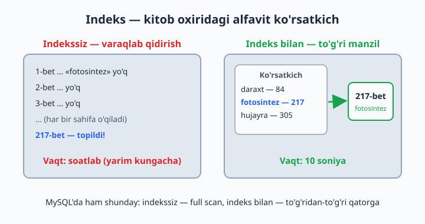
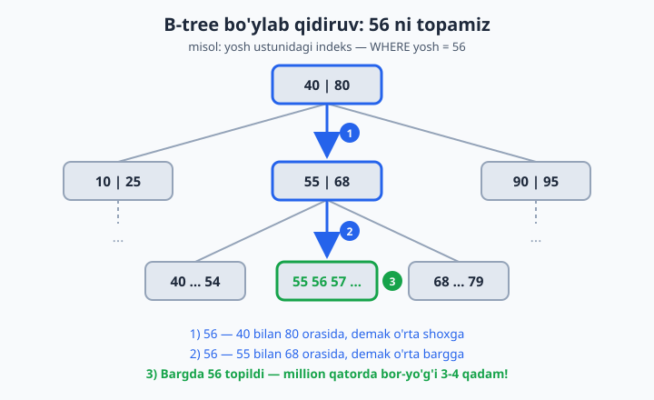
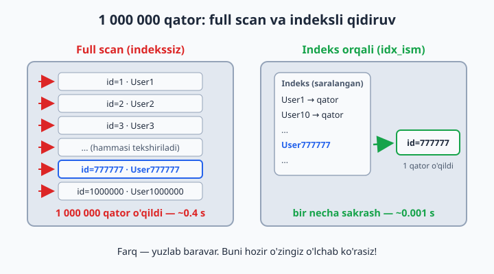
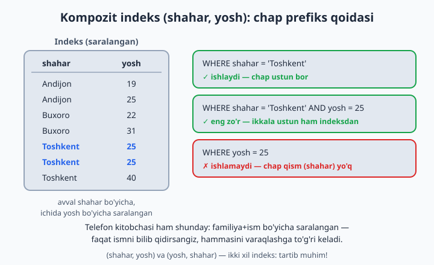

# 21 — Indekslar

[⬅️ Oldingi: 20 — Normalizatsiya — to'g'ri schema](./20-normalizatsiya.md) · [🏠 README](./README.md) · [Keyingi: 22 — VIEW, Stored Procedure, Trigger, Event ➡️](./22-view-procedure-trigger.md)

> **Bu bobda:** indeks nima ekanini kitob oxiridagi alfavit ko'rsatkich o'xshatishi bilan tushunamiz, 1 million qatorli jadval yasab full scan va indeksli qidiruv farqini o'z qo'limiz bilan o'lchaymiz, indeks ichidagi B-tree daraxtini, indeks ishlamay qoladigan tuzoqlarni, kompozit indeks va chap prefiks qoidasini hamda indeksning narxini o'rganamiz.

---

## Indeks nima?

500 betlik kitobdan "fotosintez" so'zini qidiryapsiz. 2 yo'l:
1. Har sahifani o'qib chiqish — yarim kun
2. Kitob oxiridagi **alfavit ko'rsatkich**ga qarash: "fotosintez — 217-bet" — 10 soniya

Indeks — jadval ustuni uchun ana shunday "ko'rsatkich". Usiz MySQL `WHERE` shartiga mos qatorni topish uchun **har bir qatorni** birma-bir tekshiradi (bu **full table scan** deyiladi), indeks bilan esa — to'g'ridan-to'g'ri kerakli qatorga boradi.



Yupqa broshyurada ko'rsatkichning keragi yo'q — varaqlash ham tez. Xuddi shunday, kichik jadvalda indeks farqi sezilmaydi: indeksning kuchi **yuz minglab va millionlab** qatorda ko'rinadi. Shu bobda buni o'zimiz o'lchab ko'ramiz.

## Yaratish va ko'rish

```sql
CREATE INDEX idx_kitoblar_janr ON kutubxona.kitoblar(janr);
SHOW INDEX FROM kutubxona.kitoblar;
DROP INDEX idx_kitoblar_janr ON kutubxona.kitoblar;
```

Nomlashda keng tarqalgan odat — `idx_jadval_ustun` ko'rinishi: keyin `SHOW INDEX` ro'yxatida qaysi indeks nima uchunligini darrov tushunasiz.

📌 Ba'zi indekslar **avtomatik** paydo bo'ladi: PRIMARY KEY va UNIQUE — har doim indeks. FOREIGN KEY ustuniga ham MySQL (InnoDB) o'zi indeks qo'yib qo'yadi. Shuning uchun yangi indeks qo'shishdan oldin `SHOW INDEX` bilan tekshiring — balki allaqachon bordir.

## Indeks ichida nima bor? — B-tree

MySQL indeksni **B-tree** (balanced tree — muvozanatli daraxt) ko'rinishida saqlaydi: qiymatlar saralangan holda daraxt shoxlariga joylanadi. Qidiruvda MySQL ildizdan boshlaydi va har qadamda "kichikmi-kattami?" deb solishtirib, kerakli shoxga buriladi:



Eng qizig'i — bu daraxt juda "yassi": million qatorli jadvalda ham ildizdan barggacha bor-yo'g'i 3-4 qadam yetadi. Har qadamda ma'lumotning katta qismi chetda qolib ketadi — shuning uchun indeks shunchalik tez.

## Farqni O'LCHAB ko'ramiz (eng muhim mashq!)

Kichik jadvalda farq sezilmaydi. Katta jadval yasaymiz:

```sql
CREATE DATABASE katta;
USE katta;

CREATE TABLE foydalanuvchilar (
    id INT AUTO_INCREMENT PRIMARY KEY,
    ism VARCHAR(50),
    yosh INT,
    shahar VARCHAR(50)
);

-- 1 million qator generatsiya (recursive CTE — 15-bobdan tanish!):
SET cte_max_recursion_depth = 1000000;   -- standart chegara 1000 edi, ko'taramiz

INSERT INTO foydalanuvchilar (ism, yosh, shahar)
WITH RECURSIVE seq AS (
    SELECT 1 AS n
    UNION ALL
    SELECT n + 1 FROM seq WHERE n < 1000000
)
SELECT
    CONCAT('User', n),
    FLOOR(18 + RAND() * 50),
    ELT(1 + FLOOR(RAND() * 5), 'Toshkent', 'Samarqand', 'Buxoro', 'Andijon', 'Nukus')
FROM seq;
-- 10-30 soniya kutib turing
```

Endi solishtiramiz:

```sql
SELECT * FROM foydalanuvchilar WHERE ism = 'User777777';
-- vaqtga qarang: ~0.3-0.5 sekund (full scan, million qator tekshirildi)

CREATE INDEX idx_ism ON foydalanuvchilar(ism);   -- bir necha soniya

SELECT * FROM foydalanuvchilar WHERE ism = 'User777777';
-- ~0.001 sekund. YUZLAB BARAVAR TEZ!
```



💡 MySQL indeksdan foydalandimi-yo'qmi — taxmin qilib o'tirmang, query oldiga `EXPLAIN` so'zini qo'shing:

```sql
EXPLAIN SELECT * FROM foydalanuvchilar WHERE ism = 'User777777';
-- type: ALL  → full scan (katta jadvalda yomon belgi)
-- type: ref  → indeks orqali (idx_ism ishladi)
```

`EXPLAIN`ni 23-bobda chuqur o'rganamiz, hozircha `type` va `rows` ustunlariga qarash yetarli.

## Indeks ISHLAMAYDIGAN holatlar

Indeks bor-u, lekin MySQL undan foydalana olmaydigan vaziyatlar ham bor — eng ko'p uchraydigan tuzoqlar:

```sql
WHERE ism LIKE 'User77%'     -- ✅ ishlaydi (boshi aniq)
WHERE ism LIKE '%7777'       -- ❌ ishlamaydi (boshi noma'lum — lug'atda "oxiri ...ov so'zlar"ni qidirish kabi)
WHERE YEAR(sana) = 2026      -- ❌ ustunga funksiya — indeks o'chadi
WHERE sana >= '2026-01-01' AND sana < '2027-01-01'   -- ✅ to'g'ri yo'l
```

Nega funksiya indeksni "o'chiradi"? Indeks `sana` qiymatlari bo'yicha saralangan, `YEAR(sana)` natijalari bo'yicha emas. Shartni tekshirish uchun MySQL har bir qatorda funksiyani hisoblashga majbur — bu yana full scan. Qoida oddiy: **shart ichida ustunni "toza" qoldiring**, hisob-kitobni taqqoslashning narigi tomoniga o'tkazing.

📌 MySQL 8.0.13+ da **funksional indeks** ham bor: `CREATE INDEX idx_yil ON jadval ((YEAR(sana)));` — qo'sh qavsga e'tibor bering. Lekin ko'p hollarda shartni to'g'ri yozishning o'zi (yuqoridagi ✅ varianti) yetarli va soddaroq.

## Kompozit indeks

Bitta indeks bir nechta ustunni qamrashi mumkin:

```sql
CREATE INDEX idx_shahar_yosh ON foydalanuvchilar(shahar, yosh);
```

Bu "shahar, ichida yosh bo'yicha saralangan" ko'rsatkich. Qoida — **chapdan boshlab ishlaydi** (chap prefiks qoidasi):

```sql
WHERE shahar = 'Toshkent'                -- ✅
WHERE shahar = 'Toshkent' AND yosh = 25  -- ✅ (eng zo'r)
WHERE yosh = 25                          -- ❌ (faqat yosh — chap qism yo'q)
```



Telefon kitobi analogiyasi: familiya+ism bo'yicha saralangan. Familiyani bilsangiz topasiz; faqat ismni bilsangiz — hammasini varaqlaysiz.

💡 Shu sababli ustunlar **tartibi** muhim: `(shahar, yosh)` va `(yosh, shahar)` — ikki xil indeks. Qaysi ustun shartlarda yolg'iz ham tez-tez kelsa, o'shani chap tomonga qo'ying.

## Indeksning narxi

Indeks **tekinga kelmaydi**:

| Narxi | Sababi |
|---|---|
| Yozish sekinlashadi | har INSERT/UPDATE/DELETE'da indeks(lar) ham yangilanadi |
| Disk joy oladi | indeks — alohida saqlanadigan tuzilma (ba'zan jadvalning o'zidan ham katta) |
| Foyda har doim ham yo'q | kam xil qiymatli ustunda indeks deyarli yordam bermaydi |

Oxirgi qator **selektivlik** tushunchasi: ustunda qancha ko'p xil qiymat bo'lsa, indeks shuncha foydali. `ism` (million xil qiymat) — zo'r nomzod; `jins` (2 xil qiymat) — indeks bo'lsa ham million qatorning yarmi baribir o'qiladi, foydasi kam.

Shuning uchun: **WHERE/JOIN/ORDER BY'da tez-tez ishlatiladigan ustunlarga** qo'ying, "har ehtimolga" emas.

## 21-bob masalalari

1. `katta` bazasini yarating va 1 mln qator generatsiya qiling (yuqoridagi skript)
2. Indekssiz qidiruv: `WHERE ism = 'User500000'` — vaqtini yozib oling
3. `idx_ism` yarating, qidiruvni takrorlang — necha baravar tezlashdi?
4. `WHERE yosh = 30` — indekssiz vaqti? `idx_yosh` yarating, takrorlang
5. `WHERE shahar = 'Buxoro' AND yosh = 25` — indekssiz (yosh indeksini DROP qilib), keyin kompozit `(shahar, yosh)` bilan solishtiring
6. Kompozit indeks bilan `WHERE yosh = 25` (shaharsiz) — tezmi? Nega sekin? (chap qism yo'q!)
7. `WHERE ism LIKE 'User9999%'` va `WHERE ism LIKE '%9999'` — vaqtlarini solishtiring, sababini yozing
8. `SHOW INDEX FROM foydalanuvchilar;` — nechta indeks bor? PRIMARY ham ko'rinyaptimi?
9. Indeks hajmi: `SELECT table_name, ROUND(data_length/1024/1024) AS data_mb, ROUND(index_length/1024/1024) AS index_mb FROM information_schema.tables WHERE table_schema='katta';` — indekslar necha MB?
10. Yozish narxi: hamma qo'shimcha indeksni DROP qiling, 100 000 qator INSERT vaqtini o'lchang; 3 ta indeks yaratib yana 100 000 INSERT qiling — farq sezildimi? (eslatma: yangi sessiyada `cte_max_recursion_depth` standart 1000 ga qaytadi — INSERT'dan oldin uni qayta `SET` qiling; ismlar mavjud User1..User1000000 bilan takrorlanib qolmasligi uchun `n`ni 1000001 dan boshlang: `SELECT 1000001 AS n` va `WHERE n < 1100000` — shunda 14-masaladagi UNIQUE tajribasi ham toza qoladi)
11. (kutubxona) `ijaralar(azo_id)` va `ijaralar(kitob_id)`ga indeks qo'ying (FK qo'ygan bo'lsangiz allaqachon bor — SHOW INDEX bilan tekshiring)
12. (dokon) Qaysi ustunlarga indeks kerak? O'ylab ro'yxat yozing (maslahat: buyurtmalar.mijoz_id, buyurtmalar.sana, mahsulotlar.kategoriya_id...) va qo'ying
13. (taksi) `safarlar(haydovchi_id, sana)` kompozit indeks qo'ying — "falon haydovchining falon kungi safarlari" query'si uchun ideal
14. UNIQUE indeks: `foydalanuvchilar`da `ism`ni UNIQUE qilib bo'ladimi? Sinab ko'ring (duplikatlar bormi — `SELECT ism, COUNT(*) ... HAVING COUNT(*)>1`)
15. `WHERE FLOOR(yosh/10) = 2` (20-29 yosh) — indeks ishlamaydi! Xuddi shu mantiqni `WHERE yosh BETWEEN 20 AND 29` deb yozing — endi tez. Ikkala vaqtni o'lchang
16. ORDER BY ham indeksdan foydalanadi: `ORDER BY ism LIMIT 10` — indeksli va indekssiz vaqtini solishtiring (idx_ism'ni DROP/CREATE qilib)
17. `COUNT(*)` katta jadvalda: `SELECT COUNT(*) FROM foydalanuvchilar WHERE shahar='Toshkent';` — indeksli va indekssiz farqi?
18. O'ylang: `jins ENUM('erkak','ayol')` ustuniga indeks foyda beradimi? (kam — million qatorning yarmi baribir o'qiladi; bu "selektivlik" tushunchasi)
19. (dokon) Telefon bo'yicha mijoz qidirish real ssenariy: `mijozlar.telefon`da UNIQUE indeks borligini tekshiring — login/qidiruv ustunlari doim indeksli bo'lsin
20. Xulosa yozing: qaysi 3 turdagi ustunga DOIM indeks kerak? (FK ustunlari; WHERE'da tez-tez ishlatiladiganlar; UNIQUE bo'lishi shart bo'lganlar)
