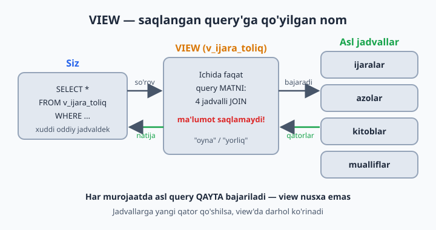
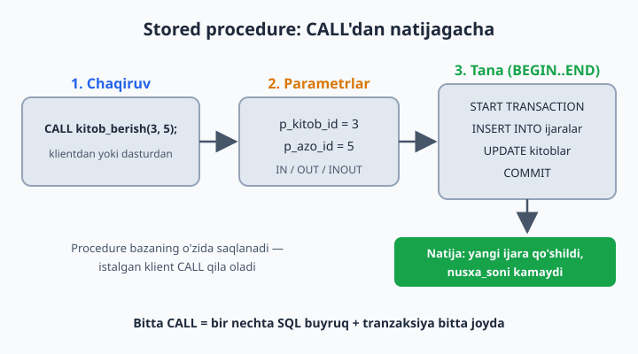
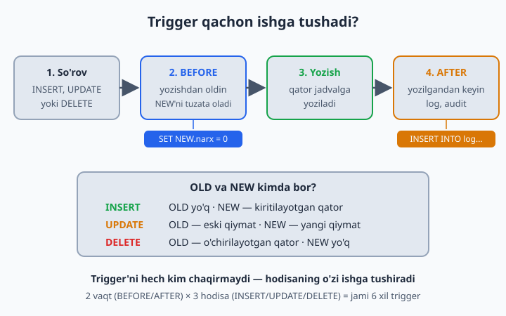

# 22 — VIEW, Stored Procedure, Trigger, Event

[⬅️ Oldingi: 21 — Indekslar](./21-indekslar.md) · [🏠 README](./README.md) · [Keyingi: 23 — EXPLAIN va optimizatsiya ➡️](./23-explain-optimizatsiya.md)

> **Bu bobda:** bazaning "avtomatika qurollari"ni o'rganamiz: VIEW bilan uzun query'ga nom qo'yib, uni oddiy jadvaldek so'rashni; Stored Procedure bilan bir necha buyruqni bitta `CALL`ga jamlashni; Trigger bilan jadvaldagi har bir o'zgarishga bazaning o'zi avtomatik javob berishini va Event — bazaning ichki "budilniki" bilan vazifalarni belgilangan vaqtda o'zi bajarishini ko'rib chiqamiz.

---

## VIEW — saqlangan query

Har safar 4 jadvalli JOIN yozish charchatadi. Bir marta yozib, NOM bering:

```sql
USE kutubxona;

CREATE VIEW v_ijara_toliq AS
SELECT i.id, a.ism AS azo, k.nomi AS kitob, m.ism AS muallif,
       i.olingan_sana, i.qaytarilgan_sana
FROM ijaralar i
JOIN azolar a ON a.id = i.azo_id
JOIN kitoblar k ON k.id = i.kitob_id
JOIN mualliflar m ON m.id = k.muallif_id;

-- Endi oddiy jadvaldek:
SELECT * FROM v_ijara_toliq WHERE qaytarilgan_sana IS NULL;
```

View ma'lumot SAQLAMAYDI — har murojaatda asl query qayta bajariladi. Bu "yorliq/shortcut": asl jadvallarga yangi qator qo'shilsa, view'da ham darhol ko'rinadi, alohida "yangilash" kerak emas. Shu sababli view tezlik QO'SHMAYDI — qulaylik beradi, xolos: sekin JOIN'ni view qilib qo'ysangiz, u view ichida ham sekinligicha qoladi (davosi — 21-bobdagi indekslar).

📌 Ba'zi bazalarda (PostgreSQL, Oracle) natijani diskka saqlab qo'yadigan **materialized view** ham bor — MySQL'da bunday tur yo'q, view har doim "jonli".



💡 View'ning yana bir foydasi — **xavfsizlik**: hamkasbingizga jadvalning o'zini emas, faqat kerakli ustunlarni ko'rsatadigan view'ni ochib berasiz (masalan, xodimlar jadvalini maosh ustunisiz). Ruxsatlarni 24-bobda GRANT bilan amalda ko'ramiz.

View bilan ishlashning qolgan buyruqlari (masalalarda kerak bo'ladi):

```sql
CREATE OR REPLACE VIEW v_ijara_toliq AS ...;   -- bor bo'lsa, yangisi bilan almashtiradi
SHOW FULL TABLES WHERE Table_type = 'VIEW';    -- bazadagi view'lar ro'yxati
DROP VIEW v_ijara_toliq;                       -- view o'chadi, asl jadvallarga tegmaydi!
```

📌 View'ning bitta cheklovi bor: u parametr qabul qilmaydi — `v_ijara_toliq(5)` deb chaqirib bo'lmaydi. "Parametrli saqlangan kod" kerak bo'lsa, navbatdagi mavzu aynan shu.

## Stored Procedure — bazada saqlangan "funksiya"

Dasturlash tillaridagi funksiyani eslang: bir necha amalni bitta nomga jamlab, kerak bo'lganda chaqirasiz. Stored procedure — xuddi shu, faqat bazaning o'zida yashaydi:

```sql
DELIMITER //
CREATE PROCEDURE kitob_berish(IN p_kitob_id INT, IN p_azo_id INT)
BEGIN
    START TRANSACTION;
    INSERT INTO ijaralar (kitob_id, azo_id, olingan_sana)
    VALUES (p_kitob_id, p_azo_id, CURDATE());
    UPDATE kitoblar SET nusxa_soni = nusxa_soni - 1
    WHERE id = p_kitob_id AND nusxa_soni > 0;
    COMMIT;
END //
DELIMITER ;

CALL kitob_berish(3, 5);
```

`DELIMITER //` — vaqtincha "buyruq tugashi" belgisini o'zgartiramiz, chunki procedure ichida `;` ko'p: usiz klient birinchi `;`ni ko'riboq "buyruq tugadi" deb o'ylaydi. Aytgancha, `DELIMITER` — SQL buyrug'i emas, `mysql` klienti va Workbench'ning o'z buyrug'i; ba'zi GUI vositalarida u shart ham emas.



Parametrlar 3 xil bo'ladi:

| Turi | Ma'nosi | Misol |
|------|---------|-------|
| `IN` | qiymat ichkariga **kiradi** (eng ko'p ishlatiladi) | `CALL kitob_berish(3, 5);` |
| `OUT` | procedure natijani shu o'zgaruvchiga **yozib qaytaradi** | `CALL kitob_soni('roman', @soni);` |
| `INOUT` | ham kiradi, ham qaytadi | kamdan-kam kerak bo'ladi |

`OUT`ga kichik misol:

```sql
DELIMITER //
CREATE PROCEDURE kitob_soni(IN p_janr VARCHAR(50), OUT p_soni INT)
BEGIN
    SELECT COUNT(*) INTO p_soni FROM kitoblar WHERE janr = p_janr;
END //
DELIMITER ;

CALL kitob_soni('roman', @soni);
SELECT @soni;   -- 4 — bazamizda janri 'roman' bo'lgan kitoblar soni
```

`@soni` — sessiya o'zgaruvchisi (19-bobdagi `@buyurtma`ni eslang): procedure tugagach ham qiymat unda saqlanib turadi, keyingi query'da bemalol ishlataverasiz.

⚠️ Yuqoridagi `kitob_berish`da bitta nuqson bor: nusxa qolmagan bo'lsa (`nusxa_soni = 0`), UPDATE hech narsani o'zgartirmaydi, lekin INSERT baribir o'tib ketadi — "yo'q kitob" berilgan bo'lib qoladi. To'g'ri yo'l — avval tekshirish:

```sql
DELIMITER //
CREATE PROCEDURE kitob_berish_xavfsiz(IN p_kitob_id INT, IN p_azo_id INT)
BEGIN
    DECLARE v_soni INT;

    START TRANSACTION;
    SELECT nusxa_soni INTO v_soni
    FROM kitoblar WHERE id = p_kitob_id FOR UPDATE;   -- 19-bobdagi qulf!

    IF v_soni > 0 THEN
        INSERT INTO ijaralar (kitob_id, azo_id, olingan_sana)
        VALUES (p_kitob_id, p_azo_id, CURDATE());
        UPDATE kitoblar SET nusxa_soni = nusxa_soni - 1 WHERE id = p_kitob_id;
        COMMIT;
    ELSE
        ROLLBACK;
        SIGNAL SQLSTATE '45000' SET MESSAGE_TEXT = 'Kitob nusxasi qolmagan!';
    END IF;
END //
DELIMITER ;
```

`DECLARE` — procedure ichida lokal o'zgaruvchi e'lon qiladi (faqat `BEGIN`dan keyin, eng boshida turishi shart), `SELECT ... INTO` unga qiymat yozadi. `SIGNAL` esa o'zimizning xato xabarimizni "otadi" — CALL qilgan tomon uni oddiy MySQL xatosi kabi ko'radi va tranzaksiya bekor bo'lganini darrov biladi. Yana bir nozik joy: `p_kitob_id` bazada umuman yo'q bo'lsa, `SELECT ... INTO` hech narsa topmaydi va `v_soni` `NULL` bo'lib qoladi — `NULL > 0` rost emas, shuning uchun bu holat ham xavfsiz tarzda `ELSE` tarmog'iga tushadi.

Aytgancha, MySQL'da `CREATE FUNCTION` ham bor: u bitta qiymat **qaytaradi** va `SELECT` ichida xuddi `NOW()` kabi ishlatiladi; procedure esa `CALL` bilan chaqiriladi va bir nechta amalni ketma-ket bajarishga mo'ljallangan. Procedure'larni boshqarish buyruqlari:

```sql
SHOW PROCEDURE STATUS WHERE Db = 'kutubxona';   -- bazadagi procedure'lar ro'yxati
DROP PROCEDURE kitob_berish;                    -- o'chirish
```

## Trigger — avtomatik reaksiya

Trigger — jadvalga "soqchi" qo'yish: kimdir qator qo'shsa, o'zgartirsa yoki o'chirsa, siz oldindan yozib qo'ygan kod O'ZI ishga tushadi. Masalan, kitob nusxalari sonini kuzatib boramiz:

```sql
CREATE TABLE kitob_tarixi (
    id INT AUTO_INCREMENT PRIMARY KEY,
    kitob_id INT, eski_soni INT, yangi_soni INT, vaqt DATETIME
);

DELIMITER //
CREATE TRIGGER trg_nusxa_kuzatuv
AFTER UPDATE ON kitoblar
FOR EACH ROW
BEGIN
    IF OLD.nusxa_soni != NEW.nusxa_soni THEN
        INSERT INTO kitob_tarixi (kitob_id, eski_soni, yangi_soni, vaqt)
        VALUES (NEW.id, OLD.nusxa_soni, NEW.nusxa_soni, NOW());
    END IF;
END //
DELIMITER ;
```

Endi nusxa_soni har o'zgarganda tarix O'ZI yoziladi — hech kim "log yozishni unutib" qo'ymaydi. `OLD` — eski qiymat, `NEW` — yangi.



Trigger jami 6 xil bo'ladi: 2 vaqt (`BEFORE`/`AFTER`) × 3 hodisa (`INSERT`/`UPDATE`/`DELETE`). `BEFORE` — qator yozilishidan OLDIN ishga tushadi va `NEW`ni o'zgartira oladi (17-masala shunga asoslangan: `SET NEW.narx = 0`). `AFTER` — qator yozilgandan KEYIN, log/audit uchun qulay. `OLD` va `NEW` esa hodisaga qarab bor yoki yo'q:

| Hodisa | `OLD` | `NEW` |
|--------|-------|-------|
| `INSERT` | yo'q | kiritilayotgan qator |
| `UPDATE` | eski qiymat | yangi qiymat |
| `DELETE` | o'chirilayotgan qator | yo'q |

Trigger'larni ko'rish va o'chirish:

```sql
SHOW TRIGGERS;                    -- bazadagi trigger'lar ro'yxati
DROP TRIGGER trg_nusxa_kuzatuv;   -- o'chirish
```

⚠️ Bitta muhim cheklov: trigger O'ZI osilgan jadvalni `UPDATE`/`INSERT`/`DELETE` qila olmaydi — `kitoblar`dagi trigger ichida `UPDATE kitoblar ...` yozsangiz, MySQL 1442-xato beradi (bu cheksiz aylanishning oldini oladi). O'z qatorini tuzatish kerak bo'lsa, BEFORE trigger'da `SET NEW.ustun = ...` ishlatiladi; BOSHQA jadvalga yozish esa bemalol — yuqoridagi misolda `kitob_tarixi`ga yozdik.

**Ogohlantirish:** trigger — "ko'rinmas sehr". Ko'payib ketsa, "bu qiymat qayerdan o'zgardi?!" deb soatlab qidirasiz. Audit/log uchun yaxshi, biznes mantiq uchun ehtiyot bo'ling.

## Event — bazaning ichki budilniki

Event — MySQL'ning o'z "rejalashtiruvchisi": belgilangan vaqtda yoki har N daqiqa/soat/kunda query'ni o'zi bajaradi. Avval rejalashtiruvchi yoqilganini tekshirib olamiz:

```sql
SHOW VARIABLES LIKE 'event_scheduler';   -- MySQL 8 da odatda ON
SET GLOBAL event_scheduler = ON;         -- OFF bo'lsa yoqamiz (admin huquq kerak)
```

```sql
CREATE EVENT ev_eski_tarix_tozalash
ON SCHEDULE EVERY 1 DAY
DO DELETE FROM kitob_tarixi WHERE vaqt < NOW() - INTERVAL 90 DAY;
```

Har kuni bir marta 90 kundan eski tarix yozuvlari o'chiriladi — qo'lingiz tegmasdan. Bir martalik ish uchun `EVERY` o'rniga `AT` yoziladi: `ON SCHEDULE AT NOW() + INTERVAL 1 HOUR` — bir soatdan keyin bir marta bajaradi-da, event o'z-o'zidan o'chib ketadi. Eventlarni ko'rish va o'chirish:

```sql
SHOW EVENTS;
DROP EVENT ev_eski_tarix_tozalash;
```

## 22-bob masalalari

1. (kutubxona) `v_ijara_toliq` view'ini yarating va ishlating
2. (kutubxona) `v_qarzdorlar` view: qaytarilmagan + 15 kundan oshgan ijaralar (a'zo ismi, kitob, necha kun)
3. (kutubxona) `v_kitob_statistika`: har kitob — nomi, muallifi, necha marta ijara qilingan
4. (dokon) `v_buyurtma_summalari`: buyurtma id, mijoz ismi, sana, jami summa
5. (dokon) `v_ombor_holati`: mahsulot, kategoriya, soni, holati (CASE: tugagan/oz/yetarli)
6. (klinika) `v_qabullar_toliq`: bemor + shifokor + sana + tashxis + tolov
7. (taksi) `v_haydovchi_statistika`: ism, safarlar soni, jami daromad, o'rtacha baho
8. View ustida view: `v_qarzdorlar`dan faqat 30+ kunliklarni oladigan `v_jiddiy_qarzdorlar` yarating
9. View'ni o'zgartirish: `CREATE OR REPLACE VIEW ...` bilan 5-masala view'iga narx ustunini qo'shing
10. `SHOW FULL TABLES WHERE Table_type = 'VIEW';` — bazadagi view'larni ko'ring; `DROP VIEW` bilan bittasini o'chiring
11. (kutubxona) `kitob_berish` procedure'ini yarating va 2 marta CALL qiling
12. (kutubxona) `kitob_qaytarish(p_ijara_id)` procedure yozing: sana qo'yadi + nusxa qaytaradi
13. (dokon) `mahsulot_sotish(p_mahsulot_id, p_soni)` procedure: ombordan ayiradi (yetarli bo'lsa! — bobdagi `kitob_berish_xavfsiz` namunasiga qarang)
14. (klinika) `qabul_yozish(p_bemor, p_shifokor)` procedure: NOW() sana, tolov = shifokor qabul_narxi (SELECT INTO o'zgaruvchi bilan: `SELECT qabul_narxi INTO @narx FROM ...`)
15. `SHOW PROCEDURE STATUS WHERE Db = 'kutubxona';` — procedure'laringizni ko'ring; `DROP PROCEDURE` sinang
16. (kutubxona) Yuqoridagi trigger'ni yarating, nusxa_soni'ni o'zgartiring, `kitob_tarixi`ni tekshiring — yozildimi?
17. (dokon) BEFORE INSERT trigger: mahsulot narxi 0 dan kichik kiritilsa, 0 ga to'g'rilasin (`SET NEW.narx = 0`)
18. (taksi) AFTER INSERT trigger safarlar'ga: yangi safar qo'shilganda haydovchining reytingini avtomatik qayta hisoblasin (`UPDATE haydovchilar SET reyting = (SELECT AVG(baho) FROM safarlar WHERE ...) WHERE id = NEW.haydovchi_id;` — `AVG` NULL baholarni o'zi tashlab ketadi)
19. Event yarating: har 1 MINUTE'da test jadvalga NOW() yozsin. 3 daqiqa kutib tekshiring, keyin DROP EVENT qiling
20. Fikrlang va yozing: katta loyihada biznes-mantiq qayerda turgani ma'qul — bazadami (procedure/trigger) yoki dastur kodidami? Har tarafga 2 tadan argument toping (javob: ko'pincha kodda — versiyalash, test, debug oson; baza darajasida — audit, ma'lumot butunligi)
