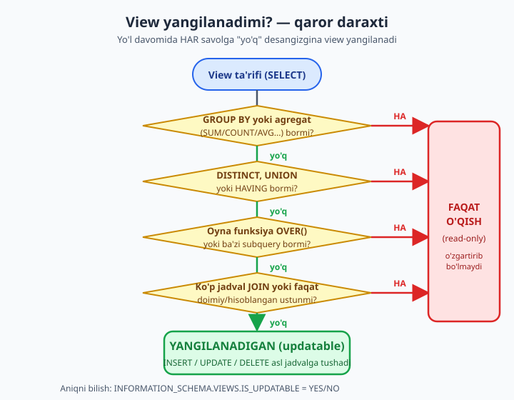

# 22 — VIEW (chuqur)

[⬅️ Oldingi: 21 — Indekslar](./21-indekslar.md) · [🏠 README](./README.md) · [Keyingi: 23 — Stored Procedure va Function ➡️](./23-procedure-function.md)

> **Bu bobda:** VIEW — bazada saqlanadigan, nom berilgan SELECT — ni chuqur o'rganamiz. `CREATE VIEW` va `CREATE OR REPLACE VIEW`, ustunlarni qayta nomlash, view'ning ichki mexanikasi (ma'lumot saqlamasligi, har murojaatda qayta bajarilishi va nega tezlik qo'shmasligi), yangilanadigan (updatable) va faqat-o'qish view'lar farqi, `WITH CHECK OPTION` (LOCAL/CASCADED), `ALGORITHM` turlari, view'ni xavfsizlik qatlami sifatida ishlatish, ichma-ich view'lar, MySQL'da materialized view yo'qligi va uni jadval + EVENT bilan simulyatsiya qilish, hamda `INFORMATION_SCHEMA.VIEWS` orqali view'larni boshqarishni ko'rib chiqamiz.

---

## VIEW nima va nega kerak?

Tasavvur qiling: har kuni "qaysi a'zo qaysi kitobni, qaysi muallifnikini olib qaytarmadi?" degan savolga javob beryapsiz. Buning uchun har safar 4 jadvalli JOIN yozasiz:

```sql
USE kutubxona;

SELECT i.id, a.ism AS azo, k.nomi AS kitob, m.ism AS muallif,
       i.olingan_sana, i.qaytarilgan_sana
FROM ijaralar i
JOIN azolar a     ON a.id = i.azo_id
JOIN kitoblar k   ON k.id = i.kitob_id
JOIN mualliflar m ON m.id = k.muallif_id;
```

Bu query to'g'ri, lekin uzun. Ertaga uni yana yozasiz, indinga hamkasbingiz boshqacha yozadi va xato qiladi. Yechim — bir marta yozib, unga **nom** berish. Ana shu "nomlangan, saqlangan SELECT" — **VIEW** (ko'rinish):

```sql
CREATE VIEW v_ijara_toliq AS
SELECT i.id, a.ism AS azo, k.nomi AS kitob, m.ism AS muallif,
       i.olingan_sana, i.qaytarilgan_sana
FROM ijaralar i
JOIN azolar a     ON a.id = i.azo_id
JOIN kitoblar k   ON k.id = i.kitob_id
JOIN mualliflar m ON m.id = k.muallif_id;
```

Endi bu uzun query oddiy jadvalga aylandi — uni xuddi jadvaldek so'raysiz:

```sql
SELECT * FROM v_ijara_toliq WHERE qaytarilgan_sana IS NULL;
SELECT azo, kitob FROM v_ijara_toliq ORDER BY olingan_sana DESC;
```

📌 Nom oldiga `v_` qo'yish keng tarqalgan odat (`v` — view): `SHOW TABLES` ro'yxatida qaysi nom jadval, qaysisi view ekanini darrov ajratasiz. Bu majburiy emas, lekin loyiha kattalashganda juda asqotadi.

VIEW asosan uch maqsadda ishlatiladi, butun bob shu uchtasini chuqurlashtiradi:

1. **Soddalashtirish** — murakkab JOIN/subquery'ga oddiy nom berish (yuqoridagi misol).
2. **Xavfsizlik** — jadvalning faqat bir qismini (ayrim ustun yoki qatorlarni) ko'rsatish, qolganini yashirish.
3. **Barqaror interfeys** — jadval tuzilishi o'zgarsa ham, view bir xil "ko'rinish"ni saqlab turishi mumkin.

## CREATE VIEW va CREATE OR REPLACE VIEW

Oddiy `CREATE VIEW` bilan **mavjud** nomdagi view'ni qayta yaratsangiz, xato olasiz:

```sql
CREATE VIEW v_ijara_toliq AS SELECT 1;   -- ERROR 1050: Table 'v_ijara_toliq' already exists
```

View'ni o'zgartirmoqchi bo'lsangiz — masalan, yangi ustun qo'shmoqchisiz — `CREATE OR REPLACE VIEW` ishlatasiz. U bor bo'lsa almashtiradi, yo'q bo'lsa yangisini yaratadi:

```sql
CREATE OR REPLACE VIEW v_ijara_toliq AS
SELECT i.id, a.ism AS azo, k.nomi AS kitob, m.ism AS muallif,
       i.olingan_sana, i.qaytarilgan_sana,
       DATEDIFF(IFNULL(i.qaytarilgan_sana, CURDATE()), i.olingan_sana) AS kunlar
FROM ijaralar i
JOIN azolar a     ON a.id = i.azo_id
JOIN kitoblar k   ON k.id = i.kitob_id
JOIN mualliflar m ON m.id = k.muallif_id;
```

💡 `CREATE OR REPLACE VIEW` — view'ni "tahrirlash"ning eng qulay yo'li: query'ni o'zgartirib, butun blokni qayta bajarasiz. `ALTER VIEW` ham bor (sintaksisi `CREATE`ga o'xshash), lekin amalda ko'pchilik `CREATE OR REPLACE`ni afzal ko'radi — chunki u view yo'q bo'lsa ham ishlayveradi.

⚠️ Bir nozik joy: `CREATE OR REPLACE` view'ni butunlay qayta yozadi. Agar shu view'ga boshqa view yoki ruxsat (GRANT) bog'langan bo'lsa, almashtirishdan oldin yangi query eski ustun nomlarini saqlab qolishiga ishonch hosil qiling — aks holda bog'liq narsalar buziladi.

### Ustun nomlarini qayta nomlash

View ustunlari nomi ikki yo'l bilan beriladi. Birinchisi — SELECT ichida `AS` bilan (yuqorida `a.ism AS azo` shunday qildik). Ikkinchisi — view nomidan keyin qavs ichida ustun ro'yxatini berish:

```sql
CREATE OR REPLACE VIEW v_kitob_qisqa (kitob_nomi, chiqqan_yili, betlar) AS
SELECT nomi, yil, sahifa
FROM kitoblar;

SELECT kitob_nomi, betlar FROM v_kitob_qisqa WHERE chiqqan_yili > 1950;
```

Qavsdagi nomlar SELECT ustunlariga **tartib bo'yicha** mos qo'yiladi: birinchisi `nomi`ni `kitob_nomi`ga, ikkinchisi `yil`ni `chiqqan_yili`ga aylantiradi. Qavsdagi nomlar soni SELECT ustunlari soniga aniq teng bo'lishi shart.

📌 Qachon qavsli ro'yxat kerak? Hisoblangan ustunlar uchun. Masalan, `SELECT narx * soni FROM ...` — bu ustunning nomi "narx * soni" bo'lib qoladi, bu chirkin. `AS jami` yozish yoki view nomidan keyin qavsda nom berish — har ikkalasi ham buni tuzatadi.

## View ichida nima sodir bo'ladi? — mexanika

Eng muhim tushuncha: **view ma'lumot saqlamaydi**. View — bu jadval emas, u — saqlangan SELECT matni, xolos. Siz `SELECT * FROM v_ijara_toliq` deganingizda MySQL ichkarida view'ning query'sini asl `SELECT`ingizga "ulab", **har safar qaytadan** bajaradi.


Bundan uchta amaliy xulosa chiqadi:

1. **View har doim "jonli".** Asl jadvalga yangi qator qo'shsangiz, view'da darhol ko'rinadi — alohida "yangilash" kerak emas. View hech qachon eskirib qolmaydi.
2. **View tezlik QO'SHMAYDI.** Bu eng ko'p adashiladigan joy. Sekin JOIN'ni view qilib qo'ysangiz, u view ichida ham xuddi shunday sekinligicha qoladi — chunki har murojaatda o'sha JOIN qaytadan bajariladi. View — bu "yorliq", nusxa emas. Tezlik kerak bo'lsa, davo — view emas, balki **indeks** (21-bob).
3. **View hisob-kitobni takrorlaydi.** Agar view ichida og'ir `GROUP BY` yoki sortlash bo'lsa, har `SELECT`da o'sha og'ir ish qaytadan bajariladi.

Buni o'z ko'zingiz bilan ko'rish uchun:

```sql
-- View yarating
CREATE OR REPLACE VIEW v_test AS SELECT * FROM kitoblar WHERE janr = 'roman';
SELECT COUNT(*) FROM v_test;   -- masalan, 4

-- Asl jadvalga yangi roman qo'shing
INSERT INTO kitoblar (nomi, muallif_id, yil, janr, nusxa_soni)
VALUES ('Sinov romani', 1, 2020, 'roman', 1);

SELECT COUNT(*) FROM v_test;   -- endi 5 — view'ni qayta yaratmadik, lekin yangilandi
```

View'ni qo'l bilan "yangilamadik", lekin natija o'zgardi — chunki view har `SELECT`da asl `kitoblar`dan qayta o'qiydi.

📌 Bu xulosalar **oddiy** (non-materialized) view uchun. Ba'zi bazalarda natijani diskka saqlab qo'yadigan **materialized view** bor — u tezlik qo'shadi, lekin eskirishi mumkin. MySQL'da bunday tur **yo'q** (buni bobning oxirida muhokama qilamiz).

## Yangilanadigan (updatable) va faqat-o'qish view

View'ni faqat `SELECT` qilibgina qolmaysiz — ba'zan view orqali `INSERT`, `UPDATE`, `DELETE` ham mumkin. Bunday view **yangilanadigan** (updatable) deyiladi. View aslida jadval emasligi sababli, MySQL bu o'zgartirishlarni view ortidagi **asl jadvalga** o'tkazadi.

Misol — faqat romanlarni ko'rsatadigan view orqali nusxa sonini yangilaymiz:

```sql
CREATE OR REPLACE VIEW v_romanlar AS
SELECT id, nomi, yil, nusxa_soni
FROM kitoblar
WHERE janr = 'roman';

-- View orqali UPDATE — asl jadvalga tushadi:
UPDATE v_romanlar SET nusxa_soni = nusxa_soni + 2 WHERE id = 1;
-- Tekshiring: kitoblar jadvalida ham nusxa_soni o'zgardi
SELECT nomi, nusxa_soni FROM kitoblar WHERE id = 1;
```

Lekin har view ham yangilanadigan emas. MySQL view'ni faqat asl jadval qatori bilan **bir-bir** (aniq) bog'lay olsa, uni yangilana oladi. Quyidagilardan biri bo'lsa, view **faqat-o'qish** bo'lib qoladi — undan INSERT/UPDATE/DELETE ishlamaydi:

| Sabab | Nega yangilab bo'lmaydi |
|-------|------------------------|
| `GROUP BY` yoki agregat (`SUM`, `COUNT`, `AVG`...) | Bir view qatori — ko'p asl qatorning yig'indisi; qaysi biriga yozish noma'lum |
| `DISTINCT` | Takror qatorlar olib tashlangan — bog'lanish noaniq |
| `UNION` / `UNION ALL` | Qator qaysi jadvaldan kelganini ajratib bo'lmaydi |
| `HAVING` | `GROUP BY` bilan birga keladi, yuqoridagi sabab |
| Oyna funksiya (`OVER(...)`) yoki ba'zi subquery'lar | Natija asl qatorga to'g'ridan-to'g'ri tegishli emas |
| Bir nechta jadval JOIN (cheklovlar bilan) | Faqat bitta jadvalga yoza oladi, hammasiga emas |
| `SELECT` da faqat doimiy/hisoblangan ustun | Yoziladigan haqiqiy ustun yo'q |

Eng oddiy qoida shunday: **bitta jadvaldan, agregsiz, DISTINCT'siz, UNION'siz, GROUP BY'siz view — yangilanadi**. Aks holda — faqat-o'qish.



Quyidagi view — agregat tufayli **faqat-o'qish**:

```sql
CREATE OR REPLACE VIEW v_janr_statistika AS
SELECT janr, COUNT(*) AS kitob_soni, AVG(sahifa) AS ortacha_sahifa
FROM kitoblar
GROUP BY janr;

-- Buni o'zgartirib bo'lmaydi:
UPDATE v_janr_statistika SET kitob_soni = 100 WHERE janr = 'roman';
-- ERROR 1288: The target table v_janr_statistika of the UPDATE is not updatable
```

📌 View yangilanadiganmi yoki yo'qmi — buni `INFORMATION_SCHEMA.VIEWS`dagi `IS_UPDATABLE` ustunidan bilib olasiz (pastda ko'ramiz). Tahmin qilib o'tirmang — so'rab tekshiring.

### INSERT va yangilanadigan view

Yangilanadigan view orqali INSERT ham mumkin, lekin ehtiyot bo'ling: view `WHERE janr = 'roman'` shartini ko'rsatsa ham, INSERT bu shartni **majburlamaydi**. Quyidagi INSERT muvaffaqiyatli o'tadi, lekin kiritilgan qator view shartiga mos kelmasligi mumkin:

```sql
-- v_romanlar WHERE janr = 'roman' edi, lekin:
INSERT INTO v_romanlar (nomi, yil, nusxa_soni) VALUES ('Yangi kitob', 2024, 1);
-- Qator kitoblar'ga qo'shildi, lekin janr berilmagani uchun NULL —
-- ya'ni view'ning o'zida (janr='roman') bu qator ko'rinmaydi ham!
```

Mana shu "view orqali kiritdim, lekin view'da ko'rinmaydi" muammosini hal qiluvchi vosita — keyingi bo'lim.

## WITH CHECK OPTION — view shartini majburlash

`WITH CHECK OPTION` view'ga shunday qoida qo'yadi: **view orqali kiritilgan yoki o'zgartirilgan har bir qator view'ning `WHERE` shartiga mos kelishi shart**. Mos kelmasa — MySQL operatsiyani rad etadi.

```sql
USE dokon;

CREATE OR REPLACE VIEW v_arzon_mahsulot AS
SELECT id, nomi, narx, soni
FROM dokon.mahsulotlar
WHERE narx < 1000000
WITH CHECK OPTION;
```

Endi bu view orqali narxi 1 000 000 dan **qimmat** mahsulot kiritib yoki o'zgartirib bo'lmaydi:

```sql
USE dokon;
-- Bu o'tadi (narx < 1000000):
INSERT INTO v_arzon_mahsulot (nomi, narx, soni) VALUES ('Sichqoncha', 90000, 50);

-- Bu RAD ETILADI (narx shartni buzadi):
UPDATE v_arzon_mahsulot SET narx = 1500000 WHERE nomi = 'Sichqoncha';
-- ERROR 1369: CHECK OPTION failed 'dokon.v_arzon_mahsulot'
```

💡 `WITH CHECK OPTION` view'ni "darcha"ga aylantiradi: bu darcha orqali faqat o'z shartiga mos ma'lumot kiradi va chiqadi. Bu, ayniqsa, ko'p foydalanuvchili tizimda muhim — masalan, Toshkent filiali xodimi faqat `shahar = 'Toshkent'` view orqali ishlasa, u boshqa shaharga qator qo'shib yubora olmaydi.

### LOCAL va CASCADED

View ustida view qurganingizda (pastda batafsil) `CHECK OPTION` ikki xil ishlashi mumkin:

- **`CASCADED`** (standart) — kiritilayotgan qator **shu view va ostidagi barcha view'larning** shartlariga mos kelishi shart.
- **`LOCAL`** — faqat **shu view'ning o'z** sharti tekshiriladi, ostidagilarniki tekshirilmaydi.

```sql
-- Asosiy view: narx < 2000000
CREATE OR REPLACE VIEW v_orta_narx AS
SELECT id, nomi, narx, soni FROM dokon.mahsulotlar
WHERE narx < 2000000;

-- Uning ustidagi view: soni > 0, LOCAL check bilan
CREATE OR REPLACE VIEW v_orta_mavjud AS
SELECT id, nomi, narx, soni FROM v_orta_narx
WHERE soni > 0
WITH LOCAL CHECK OPTION;
```

`LOCAL` bo'lgani uchun `v_orta_mavjud` orqali INSERT qilganda faqat `soni > 0` tekshiriladi — `narx < 2000000` (ostki view sharti) **tekshirilmaydi**. Agar `CASCADED` (yoki shunchaki `WITH CHECK OPTION`) yozsangiz, ikkala shart ham majburlanadi.

📌 Amalda `CASCADED` (standart) — eng xavfsiz tanlov, chunki u "darcha"ning butun zanjirini hurmat qiladi. `LOCAL`ni ataylab, faqat shu qatlam shartini tekshirish kerak bo'lgandagina ishlating.

## ALGORITHM — view qanday bajariladi

`CREATE VIEW`da view'ning ichki bajarilish usulini tanlash mumkin: `ALGORITHM = {MERGE | TEMPTABLE | UNDEFINED}`.

```sql
USE kutubxona;

CREATE ALGORITHM = MERGE VIEW v_yangi_kitoblar AS
SELECT id, nomi, yil FROM kitoblar WHERE yil > 2000;
```

Uchta qiymat ma'nosi:

| ALGORITHM | Qanday ishlaydi | Qachon |
|-----------|-----------------|--------|
| `MERGE` | View query'si tashqi query'ga **qo'shib yuboriladi** (inline). Tez, indekslardan foydalanadi | Oddiy view'lar uchun eng yaxshi |
| `TEMPTABLE` | View avval vaqtinchalik jadvalga bajariladi, keyin tashqi shart unga qo'llanadi | Murakkab view'lar; updatable bo'la olmaydi |
| `UNDEFINED` (standart) | MySQL o'zi qaysi biri yaxshiroqligini tanlaydi | Aralashmang — ko'pincha to'g'ri tanlaydi |

💡 Amalda buni qo'lda belgilash kamdan-kam kerak — `UNDEFINED` (standart) qoldiring va MySQL'ga ishoning. Bilib qo'yish kerak bo'lgan asosiy fakt: `MERGE` algoritmi tezroq va `WHERE`/indekslarni samarali ishlatadi, `TEMPTABLE` esa view'ni yangilanmaydigan qilib qo'yadi (chunki vaqtinchalik jadvalga yozib bo'lmaydi). `GROUP BY`, `DISTINCT`, `UNION` kabilar view'ni avtomatik `TEMPTABLE`ga majburlaydi.

## View — xavfsizlik qatlami sifatida

Bu — view'ning eng kuchli, lekin kam baholanadigan foydasi. View orqali jadvalning **faqat bir qismini** ochib berasiz: ayrim ustunlarni yashirasiz, ayrim qatorlarni filtrlaysiz. Foydalanuvchiga asl jadvalga emas, **faqat view'ga** ruxsat berasiz — natijada u yashirilgan ma'lumotni umuman ko'ra olmaydi.

### Ustun yashirish — "maoshsiz" ko'rinish

Klinikada shifokorlar jadvalida `qabul_narxi` bor — bu nozik ma'lumot. Registratura xodimiga shifokorning narxini ko'rsatmaslik uchun, narxsiz view yasaymiz:

```sql
USE klinika;

CREATE OR REPLACE VIEW v_shifokor_ommaviy AS
SELECT id, ism, mutaxassislik, tajriba_yil
FROM shifokorlar;
-- Diqqat: qabul_narxi ataylab tashlab ketildi
```

Registratura xodimi `v_shifokor_ommaviy`ga so'rov yuboradi va narxni hech qachon ko'rmaydi. Xodim `SELECT qabul_narxi FROM v_shifokor_ommaviy` desa — `Unknown column` xatosi, chunki view'da bunday ustun yo'q.

Bu xodimlar (kadrlar) jadvali bilan ham bir xil ishlaydi: maosh ustunini tashlab ketib, "maoshsiz xodimlar" view'i hosil qilasiz — barcha ko'rishi mumkin bo'lgan ma'lumot ochiq, maxfiy ustun esa view ortida qoladi.

### Qator yashirish — faqat o'z ma'lumoting

Do'konda har sotuvchi faqat o'z shahridagi mijozlarni ko'rishi kerak deylik. Toshkent uchun view:

```sql
USE dokon;

CREATE OR REPLACE VIEW v_toshkent_mijozlar AS
SELECT id, ism, telefon, royxatdan_otgan
FROM mijozlar
WHERE shahar = 'Toshkent'
WITH CHECK OPTION;
```

Bu view orqali faqat Toshkent mijozlari ko'rinadi va (`CHECK OPTION` tufayli) faqat Toshkent mijozi kiritiladi. Boshqa shahar ma'lumoti bu "darcha"dan o'tmaydi.

⚠️ Faqat view yaratishning o'zi yetarli emas! Foydalanuvchi asl `mijozlar` jadvalini ham ko'ra olsa, view'ning ma'nosi qolmaydi. To'liq himoya uchun foydalanuvchiga jadvalga emas, **faqat view'ga** ruxsat berasiz:

```sql
-- Bu — xavfsizlik mexanizmining ikkinchi yarmi:
CREATE USER IF NOT EXISTS 'sotuvchi'@'localhost' IDENTIFIED BY 'parol';
GRANT SELECT ON dokon.v_toshkent_mijozlar TO 'sotuvchi'@'localhost';
-- Asl jadvalga (dokon.mijozlar) ruxsat BERILMAYDI (foydalanuvchi va huquqlar — 27-bob)
```

📌 `GRANT`/ruxsatlar to'liq mavzusi — **27-bob (Xavfsizlik va administratsiya)**. Hozircha shu g'oyani yodda tuting: view + GRANT birgalikda ishlaganda haqiqiy xavfsizlik qatlamiga aylanadi. View — "nimani ko'rsatish", GRANT — "kimga ko'rsatish".

💡 Yana bir nozik foyda: view orqali ruxsat berganingizda foydalanuvchi jadval **tuzilishini** ham bilmaydi. Ertaga `mijozlar` jadvaliga maxfiy ustun qo'shsangiz, view o'zgarmagani uchun u ko'rinmaydi — interfeys barqaror qoladi.

## Ichma-ich view — view ustida view

View ham oddiy jadvaldek so'raladi, demak uning ustiga **yana bir view** qurish mumkin. Bu murakkab mantiqni qatlamlarga bo'lish imkonini beradi.

Kutubxonada avval "qaytarilmagan ijaralar" view'ini yasaymiz, keyin uning ustiga "15 kundan oshib ketgan qarzdorlar" view'ini quramiz:

```sql
USE kutubxona;

-- 1-qatlam: hali qaytarilmagan ijaralar
CREATE OR REPLACE VIEW v_qaytarilmagan AS
SELECT i.id, a.ism AS azo, k.nomi AS kitob, i.olingan_sana,
       DATEDIFF(CURDATE(), i.olingan_sana) AS kunlar
FROM ijaralar i
JOIN azolar a   ON a.id = i.azo_id
JOIN kitoblar k ON k.id = i.kitob_id
WHERE i.qaytarilgan_sana IS NULL;

-- 2-qatlam: birinchi view ustiga quramiz
CREATE OR REPLACE VIEW v_qarzdorlar AS
SELECT azo, kitob, kunlar
FROM v_qaytarilmagan
WHERE kunlar > 15;

SELECT * FROM v_qarzdorlar ORDER BY kunlar DESC;
```

`v_qarzdorlar` `v_qaytarilmagan`ga, u esa asl jadvallarga tayanadi. Siz `v_qarzdorlar`ni so'rasangiz, MySQL ichkarida butun zanjirni asl jadvallargacha "ochib" bajaradi.

💡 Bu yondashuvning foydasi — **bir marta yozilgan mantiq qayta ishlatiladi**: "qaytarilmagan" ta'rifi faqat `v_qaytarilmagan`da turadi. Ertaga ta'rif o'zgarsa (masalan, faqat aktiv a'zolar), bitta joyni tuzatasiz — ustidagi barcha view'lar avtomatik to'g'rilanadi.

⚠️ Lekin me'yorni biling: 4-5 qatlamli view "minorasi" qurmang. Har qatlam debug qilishni qiyinlashtiradi va ba'zan MySQL'ni `TEMPTABLE` algoritmiga majburlab, tezlikni pasaytiradi. 2-3 qatlam — yetarli; chuqurroq mantiq kerak bo'lsa, keyingi bobdagi stored procedure'ni o'ylab ko'ring.

## Materialized view — MySQL'da YO'Q, lekin simulyatsiya bor

PostgreSQL va Oracle'da **materialized view** bor: u — natijani **diskka saqlab qo'yadigan** view. Har murojaatda qaytadan hisoblanmaydi, tayyor natijani o'qiydi — shuning uchun tez, lekin ma'lumot "eskirishi" mumkin (`REFRESH` qilmaguningizcha).

**MySQL 8.0'da materialized view yo'q.** Lekin uni jadval + EVENT bilan **simulyatsiya** qilish mumkin. G'oya oddiy: og'ir hisob natijasini oddiy jadvalga saqlaymiz, EVENT esa uni vaqti-vaqti bilan yangilab turadi.

```sql
USE taksi;

-- 1) "Materialized" natija uchun oddiy jadval
CREATE TABLE m_haydovchi_statistika (
    haydovchi_id INT PRIMARY KEY,
    ism          VARCHAR(100),
    safarlar     INT,
    daromad      DECIMAL(12,2),
    yangilangan  DATETIME
);

-- 2) Uni to'ldirish/yangilash mantig'i
INSERT INTO m_haydovchi_statistika (haydovchi_id, ism, safarlar, daromad, yangilangan)
SELECT h.id, h.ism, COUNT(s.id), IFNULL(SUM(s.narx), 0), NOW()
FROM haydovchilar h
LEFT JOIN safarlar s ON s.haydovchi_id = h.id
GROUP BY h.id, h.ism
ON DUPLICATE KEY UPDATE
    safarlar    = VALUES(safarlar),
    daromad     = VALUES(daromad),
    yangilangan = VALUES(yangilangan);
```

Endi `m_haydovchi_statistika` — tezda o'qiladigan, oldindan hisoblangan jadval (oddiy view'dan farqli o'laroq, har so'rovda `GROUP BY` qayta bajarilmaydi). Uni avtomatik yangilab turish uchun EVENT qo'yamiz (EVENT — 24-bobda (Trigger va Event) batafsil):

```sql
SET GLOBAL event_scheduler = ON;   -- rejalashtiruvchini yoqamiz (admin huquq kerak)

DELIMITER //
CREATE EVENT ev_haydovchi_statistika_yangilash
ON SCHEDULE EVERY 1 HOUR
DO
BEGIN
    INSERT INTO m_haydovchi_statistika (haydovchi_id, ism, safarlar, daromad, yangilangan)
    SELECT h.id, h.ism, COUNT(s.id), IFNULL(SUM(s.narx), 0), NOW()
    FROM haydovchilar h
    LEFT JOIN safarlar s ON s.haydovchi_id = h.id
    GROUP BY h.id, h.ism
    ON DUPLICATE KEY UPDATE
        safarlar    = VALUES(safarlar),
        daromad     = VALUES(daromad),
        yangilangan = VALUES(yangilangan);
END //
DELIMITER ;
```

Har soatda statistika qaytadan hisoblanib, jadvalga yoziladi. Foydalanuvchi `SELECT * FROM m_haydovchi_statistika` deganda tayyor natijani — bir soatgacha "eski" bo'lsa ham — bir zumda oladi.

📌 Bu — kelishuv (trade-off): oddiy view **har doim aniq**, lekin og'ir; "materialized" jadval **tez**, lekin yangilanishlar orasida bir oz eskiradi. Real vaqtli aniqlik kerak bo'lsa — oddiy view; katta hisobni tez-tez o'qish kerak bo'lib, bir oz eskirish chidasa bo'ladigan bo'lsa — bu simulyatsiya.

## View'larni boshqarish

### Ro'yxatni ko'rish

View'lar `SHOW TABLES`da jadvallar bilan aralash ko'rinadi. Faqat view'larni ajratib olish uchun:

```sql
USE kutubxona;

SHOW FULL TABLES WHERE Table_type = 'VIEW';
```

`SHOW FULL TABLES`da `Table_type` ustuni har bir nom uchun `BASE TABLE` yoki `VIEW` ekanini ko'rsatadi — `WHERE` bilan faqat view'larni filtrlaymiz.

### INFORMATION_SCHEMA.VIEWS — to'liq ma'lumot

View haqida hamma narsa — uning ta'rifi, yangilanadiganmi, ALGORITHM nima — `INFORMATION_SCHEMA.VIEWS` jadvalida turadi:

```sql
SELECT TABLE_NAME, IS_UPDATABLE, CHECK_OPTION, DEFINER
FROM INFORMATION_SCHEMA.VIEWS
WHERE TABLE_SCHEMA = 'kutubxona';
```

Muhim ustunlar:

| Ustun | Ma'nosi |
|-------|---------|
| `TABLE_NAME` | View nomi |
| `VIEW_DEFINITION` | View ortidagi to'liq SELECT matni |
| `IS_UPDATABLE` | `YES` — yangilanadigan, `NO` — faqat-o'qish |
| `CHECK_OPTION` | `NONE` / `LOCAL` / `CASCADED` |
| `DEFINER` | View'ni yaratgan foydalanuvchi (xavfsizlik uchun muhim) |

💡 View ta'rifini ko'rishning yana bir yo'li — `SHOW CREATE VIEW v_qarzdorlar;`. Bu butun `CREATE VIEW ...` buyrug'ini, ALGORITHM va DEFINER bilan birga qaytaradi — view'ni boshqa bazaga ko'chirishda qulay.

### O'chirish

```sql
DROP VIEW v_qarzdorlar;
DROP VIEW IF EXISTS v_qarzdorlar, v_qaytarilmagan;   -- bir nechtasini birdan
```

⚠️ `DROP VIEW` faqat view'ni o'chiradi — **asl jadvallarga umuman tegmaydi**. Bu xavfsiz operatsiya: view shunchaki saqlangan query bo'lgani uchun, uni o'chirsangiz ma'lumotlar joyida qoladi. `IF EXISTS` qo'shsangiz, view yo'q bo'lsa ham xato bermaydi (skriptlarda qulay).

⚠️ Diqqat: view ustiga qurilgan boshqa view'lar bo'lsa, pastdagini o'chirish ustidagilarni **buzadi**. `DROP VIEW v_qaytarilmagan` qilsangiz, unga tayanadigan `v_qarzdorlar` ishlamay qoladi (so'ralganda xato beradi). Shuning uchun o'chirishdan oldin bog'liqlikni tekshiring.

## Xulosa

VIEW — bu bazada saqlanadigan, nom berilgan SELECT. U ma'lumot saqlamaydi (har murojaatda asl jadvallar ustida qayta bajariladi), shuning uchun har doim "jonli", lekin tezlik qo'shmaydi. Bitta jadvaldan, agregat/DISTINCT/UNION/GROUP BY'siz tuzilgan view yangilanadi — undan INSERT/UPDATE/DELETE asl jadvalga tushadi; aks holda faqat-o'qish bo'ladi. `WITH CHECK OPTION` view shartini buzadigan yozuvni rad etadi (LOCAL — faqat shu qatlam, CASCADED — butun zanjir). View'ning eng kuchli amaliy foydasi — xavfsizlik: ustun/qator yashirib, GRANT bilan birga to'liq himoya qatlamini hosil qiladi. MySQL'da materialized view yo'q, lekin jadval + EVENT bilan simulyatsiya qilinadi. Keyingi bobda view'dan bir qadam oldinga — parametr qabul qiladigan, mantiqni bazada saqlaydigan stored procedure va function'ni o'rganamiz.

## 22-bob masalalari

1. (kutubxona) `v_ijara_toliq` view'ini yarating (ijara + a'zo + kitob + muallif) va undan `qaytarilgan_sana IS NULL` bo'lganlarni tanlang
2. (kutubxona) `v_kitob_qisqa` nomli view yarating, ustunlarini view nomidan keyin qavsda qayta nomlang: `nomi` → `kitob_nomi`, `yil` → `chiqqan_yili`, `sahifa` → `betlar`
3. (dokon) `v_buyurtma_summalari` view: buyurtma id, mijoz ismi, sana va jami summa (`buyurtma_qatorlari`dan `SUM(soni * narx)`)
4. (klinika) `v_shifokor_ommaviy` view yarating — `qabul_narxi`ni yashirib, faqat id, ism, mutaxassislik, tajriba ko'rsating. Keyin view'dan `qabul_narxi`ni tanlashga urinib ko'ring — qanday xato chiqdi?
5. (taksi) `v_haydovchi_statistika` view: ism, safarlar soni, jami daromad, o'rtacha baho (`LEFT JOIN` bilan, safari yo'qni ham qo'shing)
6. (kutubxona) `CREATE OR REPLACE VIEW` bilan 1-masaladagi view'ga `kunlar` (`DATEDIFF`) ustunini qo'shing
7. (kutubxona) `v_romanlar` view yarating (`WHERE janr = 'roman'`), undan `UPDATE` bilan bitta kitobning `nusxa_soni`ni oshiring va asl `kitoblar` jadvalida o'zgarganini tekshiring
8. (dokon) `v_arzon_mahsulot` view yarating (`narx < 1000000`) `WITH CHECK OPTION` bilan; undan narxni 1 500 000 ga `UPDATE` qilishga urining — qanday xato chiqadi?
9. (kutubxona) Ichma-ich view: `v_qaytarilmagan` (qaytarilmagan ijaralar) ustiga `v_qarzdorlar` (`kunlar > 15`) view'ini quring
10. (kutubxona) `INFORMATION_SCHEMA.VIEWS`dan `TABLE_SCHEMA = 'kutubxona'` view'larining `IS_UPDATABLE` ustunini tekshiring: qaysi biri `YES`, qaysi biri `NO`?
11. (dokon) Agregatli view (`v_kategoriya_statistika`: kategoriya bo'yicha mahsulotlar soni va o'rtacha narx) yarating, keyin undan `UPDATE` qilishga urining — nima uchun ishlamaydi?
12. (kutubxona) `SHOW FULL TABLES WHERE Table_type = 'VIEW';` ni bajaring — siz yaratgan view'lar ro'yxatda ko'rinyaptimi?
13. (klinika) `v_qabullar_toliq` view: bemor ismi + shifokor ismi + sana + tashxis + tolov (ikkita `JOIN` bilan)
14. (dokon) `v_toshkent_mijozlar` view yarating (`WHERE shahar = 'Toshkent'`) `WITH CHECK OPTION` bilan; undan boshqa shahar mijozini `INSERT` qilishga urining — rad etiladimi?
15. (taksi) `SHOW CREATE VIEW` bilan 5-masaladagi view'ning to'liq ta'rifini ko'ring — `ALGORITHM` qaysi (`UNDEFINED`/`MERGE`/`TEMPTABLE`)?
16. (kutubxona) `v_qarzdorlar` view'ini `DROP VIEW` bilan o'chiring; keyin `v_qaytarilmagan`ga `SELECT` yuboring — u hali ishlaydimi? (ha, chunki u mustaqil)
17. (dokon) Ikki qatlamli `WITH LOCAL CHECK OPTION` misoli yarating: `v_orta_narx` (`narx < 2000000`) ustiga `v_orta_mavjud` (`soni > 0`, `LOCAL`); `LOCAL` va `CASCADED` farqini o'z misolingizda ko'rsating
18. (taksi) "Materialized view" simulyatsiyasini quring: `m_haydovchi_statistika` jadvali + uni `ON DUPLICATE KEY UPDATE` bilan to'ldiradigan `INSERT ... SELECT`; jadvalni `SELECT` qiling
19. (taksi) 18-masaladagi statistikani har 1 soatda yangilaydigan `EVENT` yozing (`event_scheduler` yoqilganini `SHOW VARIABLES`dan tekshiring)
20. Fikrlang va yozing: bir murakkab hisob-kitob (masalan, har kungi sotuv hisoboti) — uni oddiy `VIEW` qilgan ma'qulmi yoki "materialized" jadval + `EVENT` qilgan ma'qulmi? Har tarafga 2 tadan argument toping (maslahat: query qanchalik tez-tez so'raladi, natija qanchalik yangilanishi kerak — shu ikki savolga tayaning)
