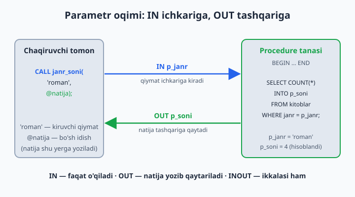
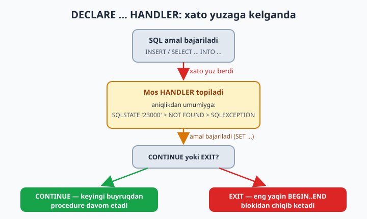

# 23 — Stored Procedure va Function (chuqur)

[⬅️ Oldingi: 22 — VIEW](./22-view.md) · [🏠 README](./README.md) · [Keyingi: 24 — Trigger va Event ➡️](./24-trigger-event.md)

> **Bu bobda:** bazaning ichida yashaydigan "dasturlarni" — stored PROCEDURE va FUNCTION — ni chuqur o'rganamiz. `DELIMITER` nega kerakligini, `CREATE PROCEDURE` va parametr turlari (`IN`/`OUT`/`INOUT`) ni, `DECLARE` bilan lokal o'zgaruvchi e'lon qilishni, boshqaruv oqimini (`IF`/`CASE`/`WHILE`/`REPEAT`/`LOOP`), xatolarni `DECLARE ... HANDLER` bilan ushlash va `SIGNAL`/`RESIGNAL` bilan o'z xatomizni "otish"ni, `CREATE FUNCTION` ni to'liq (`RETURNS`, `DETERMINISTIC`, `READS SQL DATA` kabi xarakteristikalar bilan), procedure ichidagi tranzaksiya va qulflarni, procedure'larni ko'rish/o'chirish buyruqlarini, hamda "biznes-mantiq bazadami yoki ilovadami?" degan klassik munozarani ko'rib chiqamiz.

---

## Nega "bazada yashaydigan kod" kerak?

Shu paytgacha har bir SQL buyrug'ini qo'lda yozib keldik: `INSERT`, `UPDATE`, `SELECT`. Lekin amaliyotda ko'p amallar **bir necha buyruqdan** iborat va doim birga bajariladi. Misol: kutubxonada kitob berish — bu (1) ijara yozuvi qo'shish, (2) nusxa sonini kamaytirish, (3) nusxa qolmagan bo'lsa xato berish. Bu uchtasini har safar qo'lda yozish — xato manbai: kimdir bir qadamni unutadi, kimdir tartibni o'zgartiradi.

Stored procedure — ana shu bir necha buyruqni **bitta nomga** jamlab, bazaning ichida saqlash. Dasturlash tilidagi funksiyani eslang: bir marta yozasiz, keyin nom bilan chaqirasiz. Stored program ikki turli bo'ladi:

- **PROCEDURE** (protsedura) — `CALL nom(...)` bilan chaqiriladi, hech narsa qaytarmasligi yoki `OUT` parametr orqali natija berishi mumkin, ichida `INSERT`/`UPDATE`/`COMMIT` kabi har qanday amal bo'la oladi.
- **FUNCTION** (funksiya) — bitta qiymat **qaytaradi** (`RETURN`) va `SELECT` ichida xuddi `NOW()` yoki `UPPER()` kabi ishlatiladi.

📌 Stored procedure va function birgalikda **"stored programs"** (saqlangan dasturlar) deb ataladi. Ularning sintaksisi ko'p jihatdan bir xil — shuning uchun ularni bir bobda, yonma-yon o'rganamiz.

## DELIMITER — nega kerak?

MySQL klienti har bir buyruqning oxirini nuqtali-vergul (`;`) bilan biladi. Siz `SELECT * FROM kitoblar;` yozib Enter bossangiz, klient "buyruq tugadi" deb uni serverga yuboradi. Muammo shundaki, procedure **tanasi** ichida `;` lar ko'p:

```sql
CREATE PROCEDURE test()
BEGIN
    SELECT 1;          -- bu yerdagi ; klientni chalkashtiradi
    SELECT 2;
END;
```

Klient birinchi `SELECT 1;` dagi `;` ni ko'riboq "buyruq tugadi" deb yarim procedure'ni serverga yuboradi — bu albatta xato. Yechim: procedure yozish davrida buyruq tugashi belgisini vaqtincha boshqa narsaga, masalan `//` ga o'zgartiramiz:

```sql
DELIMITER //

CREATE PROCEDURE test()
BEGIN
    SELECT 1;
    SELECT 2;
END //

DELIMITER ;
```

Endi klient `//` ni ko'rgunicha hech narsa yubormaydi — butun `CREATE PROCEDURE ... END` blokini bir butun sifatida serverga uzatadi. Oxirida `DELIMITER ;` bilan belgini yana odatdagi `;` ga qaytaramiz.

📌 `DELIMITER` — bu SQL buyrug'i **emas**, balki `mysql` klienti va Workbench/DBeaver kabi vositalarning o'z buyrug'i. Server uni ko'rmaydi ham. Shuning uchun uni biror dastur ichidan (PHP, Python) yuborishning hojati yo'q — u yerda boshqa mexanizm bor. Belgi sifatida `//` keng tarqalgan, lekin `$$` ham xuddi shunday ishlaydi; `;` ni o'z ichiga olmaydigan istalgan ketma-ketlik bo'laveradi.

⚠️ Eng ko'p uchraydigan xato — `DELIMITER ;` ni qaytarib qo'yishni unutish. Keyin oddiy `SELECT 1;` yozsangiz, klient `//` kutib turib hech narsa bajarmaydi. "Nega buyruqlarim ishlamayapti?" degan vahimaning yarmi shu.

## CREATE PROCEDURE va parametr turlari

Eng oddiy procedure'dan boshlaymiz — parametrsiz:

```sql
USE kutubxona;

DELIMITER //
CREATE PROCEDURE barcha_kitoblar()
BEGIN
    SELECT id, nomi, janr FROM kitoblar ORDER BY nomi;
END //
DELIMITER ;

CALL barcha_kitoblar();
```

`CALL barcha_kitoblar();` — procedure ishga tushadi va `SELECT` natijasini qaytaradi. Endi parametrlarni qo'shamiz. MySQL'da uch xil parametr bor:

| Turi | Yo'nalishi | Ma'nosi |
|------|-----------|---------|
| `IN` | ichkariga | qiymat procedure'ga **kiradi** (default, eng ko'p ishlatiladi) |
| `OUT` | tashqariga | procedure natijani shu o'zgaruvchiga **yozib qaytaradi** |
| `INOUT` | ikki tomonga | ham kiradi, ham o'zgargan qiymat qaytadi |



### IN — qiymat ichkariga kiradi

`IN` — eng keng tarqalgan tur. Qiymat chaqiruvchidan procedure ichiga uzatiladi:

```sql
DELIMITER //
CREATE PROCEDURE janr_kitoblari(IN p_janr VARCHAR(50))
BEGIN
    SELECT nomi, yil FROM kitoblar
    WHERE janr = p_janr
    ORDER BY yil;
END //
DELIMITER ;

CALL janr_kitoblari('roman');
```

📌 Parametr nomi oldiga `p_` (parameter) qo'yish — keng tarqalgan odat. Sababi: agar parametringiz nomi jadvaldagi ustun nomi bilan **bir xil** bo'lsa (masalan `janr`), MySQL `WHERE janr = janr` ni "ustun ustunga teng" deb tushunadi — bu hamma qatorga rost bo'ladi va filtr ishlamaydi! `p_janr` deb nomlash bu tuzoqdan butunlay xalos qiladi.

### OUT — natijani o'zgaruvchiga yozib qaytaradi

`OUT` parametr orqali procedure bitta (yoki bir nechta) qiymatni chaqiruvchiga "yozib qaytaradi":

```sql
DELIMITER //
CREATE PROCEDURE janr_soni(IN p_janr VARCHAR(50), OUT p_soni INT)
BEGIN
    SELECT COUNT(*) INTO p_soni
    FROM kitoblar
    WHERE janr = p_janr;
END //
DELIMITER ;

CALL janr_soni('roman', @natija);
SELECT @natija;   -- 4 — janri 'roman' bo'lgan kitoblar soni
```

`@natija` — bu **sessiya o'zgaruvchisi**: procedure tugagach ham qiymat unda saqlanib turadi, keyingi query'larda bemalol ishlatasiz. `SELECT ... INTO p_soni` esa hisoblangan qiymatni `OUT` parametrga yozadi.

⚠️ `OUT` parametr procedure boshida har doim `NULL` ga tushiriladi — chaqirishdan oldin unda nima bo'lgani ahamiyatsiz. Agar procedure unga hech narsa yozmasa, natija `NULL` bo'lib qoladi.

### INOUT — ham kiradi, ham qaytadi

`INOUT` — kamdan-kam kerak bo'ladi, lekin "joyida o'zgartirish" uchun qulay. Masalan, kirgan qiymatni ikkilantirib qaytarish:

```sql
DELIMITER //
CREATE PROCEDURE narxni_chegirma(INOUT p_narx DECIMAL(12,2), IN p_foiz INT)
BEGIN
    SET p_narx = p_narx - (p_narx * p_foiz / 100);
END //
DELIMITER ;

SET @narx = 1000000;
CALL narxni_chegirma(@narx, 20);   -- 20% chegirma
SELECT @narx;                      -- 800000.00
```

Bu yerda `@narx` ichkariga **kiritilgan qiymat bilan** kiradi (1 000 000) va o'zgargan holatda (800 000) qaytadi. `IN` bilan farqi: `IN` parametr faqat o'qiladi, `INOUT` esa o'qiladi ham, yangi qiymati tashqariga ham chiqadi.

📌 `INOUT` va `OUT` parametrga faqat o'zgaruvchi (`@narx`) uzatiladi — to'g'ridan-to'g'ri qiymat (`20`) emas. Chunki procedure unga natija "yozib qo'yishi" kerak, qiymatga esa yozib bo'lmaydi.

## DECLARE — lokal o'zgaruvchi

Procedure ichida vaqtinchalik qiymatlarni saqlash uchun **lokal o'zgaruvchi** kerak bo'ladi. Uni `DECLARE` bilan e'lon qilamiz:

```sql
DELIMITER //
CREATE PROCEDURE kitob_hisoboti(IN p_kitob_id INT)
BEGIN
    DECLARE v_nomi VARCHAR(200);
    DECLARE v_nusxa INT DEFAULT 0;

    SELECT nomi, nusxa_soni INTO v_nomi, v_nusxa
    FROM kitoblar WHERE id = p_kitob_id;

    SELECT v_nomi AS kitob, v_nusxa AS qolgan_nusxa;
END //
DELIMITER ;

CALL kitob_hisoboti(1);
```

Bu yerda uch muhim qoida bor:

1. **`DECLARE` faqat `BEGIN` dan keyin, eng boshida** turishi shart. Agar `SELECT` yoki `SET` dan keyin `DECLARE` yozsangiz, MySQL xato beradi. Bu — qat'iy tartib qoidasi.
2. **`DEFAULT`** bilan boshlang'ich qiymat berish mumkin: `DECLARE v_nusxa INT DEFAULT 0;`. `DEFAULT` bo'lmasa, o'zgaruvchi `NULL` dan boshlanadi.
3. Lokal o'zgaruvchi oldiga `@` **qo'yilmaydi** — `@nusxa` (sessiya o'zgaruvchisi) bilan `v_nusxa` (lokal o'zgaruvchi) butunlay boshqa narsalar. Lokal o'zgaruvchi faqat shu procedure ichida yashaydi, tashqarida ko'rinmaydi.

### SET va SELECT ... INTO

Lokal o'zgaruvchiga qiymat berishning ikki yo'li bor:

```sql
SET v_nusxa = 5;                                  -- to'g'ridan-to'g'ri qiymat
SET v_nusxa = (SELECT nusxa_soni FROM kitoblar WHERE id = 1);  -- subquery bilan

SELECT nusxa_soni INTO v_nusxa FROM kitoblar WHERE id = 1;     -- INTO bilan
```

`SET` — oddiy qiymat yoki ifoda uchun; `SELECT ... INTO` — query natijasini bitta (yoki bir nechta) o'zgaruvchiga yozish uchun. `SELECT a, b INTO v_a, v_b FROM ...` — bir vaqtda bir nechta ustunni bir nechta o'zgaruvchiga o'qiydi.

⚠️ `SELECT ... INTO` aynan **bitta qator** qaytarishi kerak. Agar query hech narsa topmasa — o'zgaruvchilar o'zgarmaydi (yoki `NULL` bo'lib qoladi) va "NOT FOUND" holati yuzaga keladi (buni HANDLER bilan ushlash mumkin — pastda ko'ramiz). Agar query **bir nechta qator** qaytarsa — xato (`ERROR 1172`). Bunda `LIMIT 1` yoki agregat (`MAX`, `COUNT`) ishlatib bitta qatorga keltiring.

## Boshqaruv oqimi (control flow)

Stored program ichida oddiy SQL'dan tashqari **shartlar va sikllar** ishlatish mumkin — xuddi dasturlash tilidagidek. Bu stored procedure'ni shunchaki "buyruqlar ro'yxati"dan to'laqonli mantiqqa aylantiradi.

### IF / ELSEIF / ELSE

```sql
DELIMITER //
CREATE PROCEDURE nusxa_holati(IN p_kitob_id INT)
BEGIN
    DECLARE v_soni INT;
    SELECT nusxa_soni INTO v_soni FROM kitoblar WHERE id = p_kitob_id;

    IF v_soni IS NULL THEN
        SELECT 'Bunday kitob yoq' AS holat;
    ELSEIF v_soni = 0 THEN
        SELECT 'Tugagan' AS holat;
    ELSEIF v_soni < 3 THEN
        SELECT 'Kam qoldi' AS holat;
    ELSE
        SELECT 'Yetarli' AS holat;
    END IF;
END //
DELIMITER ;

CALL nusxa_holati(10);   -- 'Hayot chorrahalari' — 1 nusxa — 'Kam qoldi'
```

`IF` — `END IF` bilan yopiladi; `ELSEIF` (bir so'z, `ELSE IF` emas!) bir necha shartni ketma-ket tekshiradi; `ELSE` — hech qaysi shart bajarilmasa.

### CASE

`CASE` — ko'p shartli tanlovni o'qish osonroq qiladi. Ikki ko'rinishi bor:

```sql
DELIMITER //
CREATE PROCEDURE narx_darajasi(IN p_kitob_id INT)
BEGIN
    DECLARE v_sahifa INT;
    DECLARE v_daraja VARCHAR(20);
    SELECT sahifa INTO v_sahifa FROM kitoblar WHERE id = p_kitob_id;

    CASE
        WHEN v_sahifa < 150 THEN SET v_daraja = 'Qisqa';
        WHEN v_sahifa < 500 THEN SET v_daraja = 'Ortacha';
        ELSE SET v_daraja = 'Yirik';
    END CASE;

    SELECT v_daraja AS hajmi;
END //
DELIMITER ;

CALL narx_darajasi(6);   -- 'Urush va tinchlik' — 1225 sahifa — 'Yirik'
```

📌 `CASE`ning ikki shakli: yuqoridagi **qidiruv shakli** (`CASE WHEN shart THEN ...`) ixtiyoriy shartlarni tekshiradi; **oddiy shakl** (`CASE p_qiymat WHEN 1 THEN ... WHEN 2 THEN ...`) bitta qiymatni aniq variantlarga solishtiradi. Boshqaruv oqimidagi `CASE` `SELECT` ichidagi `CASE` ifodasidan farqli — bu yerda u to'liq buyruq, `END CASE` bilan yopiladi.

### WHILE ... DO ... END WHILE

Sikllar — bir amalni takror bajarish uchun. `WHILE` shart rost bo'lguncha aylanadi:

```sql
DELIMITER //
CREATE PROCEDURE raqamlar_jadvali(IN p_n INT)
BEGIN
    DECLARE v_i INT DEFAULT 1;

    DROP TEMPORARY TABLE IF EXISTS temp_raqamlar;
    CREATE TEMPORARY TABLE temp_raqamlar (son INT, kvadrati INT);

    WHILE v_i <= p_n DO
        INSERT INTO temp_raqamlar VALUES (v_i, v_i * v_i);
        SET v_i = v_i + 1;
    END WHILE;

    SELECT * FROM temp_raqamlar;
END //
DELIMITER ;

CALL raqamlar_jadvali(5);   -- 1..5 va ularning kvadratlari
```

⚠️ Siklning ichida o'zgaruvchini **o'zgartirishni unutmang** (`SET v_i = v_i + 1`). Agar unutilsa, shart hech qachon yolg'on bo'lmaydi va cheksiz sikl yuzaga keladi — procedure osilib qoladi.

### REPEAT ... UNTIL ... END REPEAT

`REPEAT` — `WHILE`ga teskari mantiq: tanani **avval bajaradi**, keyin shartni tekshiradi. Ya'ni tana **kamida bir marta** bajariladi:

```sql
DELIMITER //
CREATE PROCEDURE teskari_sanoq(IN p_boshlanish INT)
BEGIN
    DECLARE v_i INT;
    SET v_i = p_boshlanish;

    DROP TEMPORARY TABLE IF EXISTS temp_sanoq;
    CREATE TEMPORARY TABLE temp_sanoq (qiymat INT);

    REPEAT
        INSERT INTO temp_sanoq VALUES (v_i);
        SET v_i = v_i - 1;
    UNTIL v_i < 1
    END REPEAT;

    SELECT * FROM temp_sanoq;
END //
DELIMITER ;

CALL teskari_sanoq(5);   -- 5, 4, 3, 2, 1
```

📌 Farqni eslab qoling: `WHILE shart DO` — shart rost bo'lsa davom etadi, tana 0 marta bajarilishi mumkin; `REPEAT ... UNTIL shart` — shart rost bo'lsa **to'xtaydi**, tana kamida 1 marta bajariladi.

### LOOP / LEAVE / ITERATE (label bilan)

`LOOP` — eng "xom" sikl: o'zi hech qanday shart tekshirmaydi, cheksiz aylanadi. Undan chiqish uchun `LEAVE`, qolgan qatorlarni o'tkazib yangi aylanaga sakrash uchun `ITERATE` ishlatiladi. Ikkalasi ham siklga qo'yilgan **label** (yorliq) ni talab qiladi:

```sql
DELIMITER //
CREATE PROCEDURE juft_raqamlar(IN p_n INT)
BEGIN
    DECLARE v_i INT DEFAULT 0;

    DROP TEMPORARY TABLE IF EXISTS temp_juft;
    CREATE TEMPORARY TABLE temp_juft (son INT);

    asosiy_sikl: LOOP
        SET v_i = v_i + 1;

        IF v_i > p_n THEN
            LEAVE asosiy_sikl;          -- siklni butunlay tark etamiz
        END IF;

        IF v_i % 2 != 0 THEN
            ITERATE asosiy_sikl;        -- toq son — qoldirib, keyingi aylanaga
        END IF;

        INSERT INTO temp_juft VALUES (v_i);
    END LOOP asosiy_sikl;

    SELECT * FROM temp_juft;   -- 2, 4, 6, ... p_n gacha
END //
DELIMITER ;

CALL juft_raqamlar(10);   -- 2, 4, 6, 8, 10
```

`asosiy_sikl:` — bu label. `LEAVE asosiy_sikl` — `break` ga o'xshaydi (sikldan chiqadi), `ITERATE asosiy_sikl` — `continue` ga o'xshaydi (qolgan kodni o'tkazib, yangi aylanani boshlaydi). Label `WHILE` va `REPEAT` ga ham qo'yilishi mumkin.

⚠️ `LOOP`da `LEAVE` ni qo'yishni unutsangiz — cheksiz sikl. Shuning uchun `LOOP`ni faqat chiqish sharti murakkab bo'lganda ishlating; oddiy hollarda `WHILE`/`REPEAT` xavfsizroq va o'qish osonroq.

## Shartlarni boshqarish: DECLARE ... HANDLER

Stored program ichida xato yuzaga kelsa, odatda butun procedure to'xtaydi va xato chaqiruvchiga uzatiladi. Lekin ba'zan xatoni **ushlab**, o'zimiz hal qilmoqchimiz — masalan, "qator topilmasa, sikldan chiq" yoki "dublikat kalit bo'lsa, indamay o'tkazib yubor". Buning uchun **HANDLER** (ishlovchi) bor.

HANDLER `DECLARE` blokida, lokal o'zgaruvchilardan **keyin** e'lon qilinadi:

```sql
DECLARE { CONTINUE | EXIT } HANDLER FOR shart
    amal;
```

Ikki xatti-harakat bor:

- **`CONTINUE`** — xatoni ushlaydi, `amal`ni bajaradi va procedure'ni **davom ettiradi**.
- **`EXIT`** — xatoni ushlaydi, `amal`ni bajaradi va eng yaqin `BEGIN ... END` blokidan **chiqib ketadi**.



Qaysi xatoni ushlash kerakligini uch xil ko'rsatish mumkin:

| Shart | Nimani ushlaydi |
|-------|-----------------|
| `NOT FOUND` | `SELECT ... INTO` qator topmasa yoki kursor tugasa |
| `SQLEXCEPTION` | har qanday jiddiy xato (umumiy "tarmoq") |
| `SQLWARNING` | ogohlantirishlar |
| `SQLSTATE '23000'` | aniq SQLSTATE kodi (masalan, dublikat kalit) |

### NOT FOUND — qator topilmaganda

`SELECT ... INTO` hech narsa topmasa, `NOT FOUND` holati yuzaga keladi. Buni ushlab, "topilmadi" bayrog'ini ko'tarish mumkin:

```sql
DELIMITER //
CREATE PROCEDURE azo_telefoni(IN p_azo_id INT, OUT p_natija VARCHAR(100))
BEGIN
    DECLARE v_topildi BOOLEAN DEFAULT TRUE;
    DECLARE CONTINUE HANDLER FOR NOT FOUND SET v_topildi = FALSE;

    SELECT telefon INTO p_natija FROM azolar WHERE id = p_azo_id;

    IF NOT v_topildi THEN
        SET p_natija = 'Azo topilmadi';
    END IF;
END //
DELIMITER ;

CALL azo_telefoni(99, @r);   -- bunday a'zo yo'q
SELECT @r;                    -- 'Azo topilmadi'
```

### SQLEXCEPTION va aniq SQLSTATE

`SQLEXCEPTION` — eng keng "to'r": har qanday jiddiy xatoni ushlaydi. Aniq SQLSTATE esa muayyan bir xatoni — masalan, dublikat unikal kalit (`'23000'`):

```sql
DELIMITER //
CREATE PROCEDURE xavfsiz_mijoz(IN p_ism VARCHAR(100), IN p_tel VARCHAR(20), OUT p_holat VARCHAR(100))
BEGIN
    -- dublikat telefon (mijozlar.telefon UNIQUE) ni ushlaymiz
    DECLARE EXIT HANDLER FOR SQLSTATE '23000'
        SET p_holat = 'Bu telefon allaqachon royxatda';

    DECLARE EXIT HANDLER FOR SQLEXCEPTION
        SET p_holat = 'Nomalum xato yuz berdi';

    INSERT INTO dokon.mijozlar (ism, telefon, shahar, royxatdan_otgan)
    VALUES (p_ism, p_tel, 'Toshkent', CURDATE());

    SET p_holat = 'Muvaffaqiyatli qoshildi';
END //
DELIMITER ;

CALL xavfsiz_mijoz('Yangi Mijoz', '+998911234567', @h);  -- mavjud telefon
SELECT @h;   -- 'Bu telefon allaqachon royxatda'
```

📌 HANDLER tanlovi **aniqlikdan umumiyga** qarab ishlaydi: agar SQLSTATE `'23000'` xatosi yuzaga kelsa, MySQL avval aniq `SQLSTATE '23000'` handler'ini ishlatadi, umumiy `SQLEXCEPTION` esa qolgan barcha xatolar uchun "zaxira" bo'lib qoladi.

### SIGNAL — o'z xatongni "otish"

Ba'zan biznes-qoidaga ko'ra biz **o'zimiz** xato yuzaga keltirishni xohlaymiz. Masalan, "nusxa qolmagan kitobni berib bo'lmaydi". Bu texnik xato emas — mantiqiy qoidamizning buzilishi. `SIGNAL` aynan shu uchun:

```sql
DELIMITER //
CREATE PROCEDURE yosh_tekshir(IN p_yosh INT)
BEGIN
    IF p_yosh < 0 THEN
        SIGNAL SQLSTATE '45000'
            SET MESSAGE_TEXT = 'Yosh manfiy bola olmaydi!';
    END IF;
    SELECT CONCAT('Yosh: ', p_yosh) AS natija;
END //
DELIMITER ;

CALL yosh_tekshir(-5);   -- ERROR 1644 (45000): Yosh manfiy bola olmaydi!
```

`SQLSTATE '45000'` — bu "foydalanuvchi belgilagan ishlanmagan istisno" uchun maxsus ajratilgan umumiy kod. Deyarli har doim o'z xatolaringiz uchun shuni ishlatasiz. `MESSAGE_TEXT` — chaqiruvchi ko'radigan xabar. Chaqiruvchi tomon buni xuddi haqiqiy MySQL xatosi kabi qabul qiladi — tranzaksiya bekor bo'ladi, dastur `try/catch` ga tushadi.

### RESIGNAL — ushlangan xatoni qayta otish

`RESIGNAL` — HANDLER ichida ushlangan xatoni (qisman o'zgartirib yoki shundayligicha) **qayta otish** uchun. Masalan, xatoni log qilib, keyin baribir tashqariga uzatish:

```sql
DELIMITER //
CREATE PROCEDURE qatiy_qoshish(IN p_ism VARCHAR(100), IN p_tel VARCHAR(20))
BEGIN
    DECLARE EXIT HANDLER FOR SQLEXCEPTION
    BEGIN
        -- bu yerda log yozishimiz mumkin edi, keyin xatoni qayta otamiz
        RESIGNAL SET MESSAGE_TEXT = 'Mijoz qoshilmadi (asl xato saqlandi)';
    END;

    INSERT INTO dokon.mijozlar (ism, telefon, shahar, royxatdan_otgan)
    VALUES (p_ism, p_tel, 'Toshkent', CURDATE());
END //
DELIMITER ;
```

`SIGNAL` bilan `RESIGNAL` farqi: `SIGNAL` — **yangi** xato yaratadi; `RESIGNAL` — **mavjud** (ushlangan) xatoni qayta otadi va asl xato ma'lumotini saqlab qolishi mumkin. `RESIGNAL` faqat HANDLER ichida ishlatiladi.

## CREATE FUNCTION — to'liq

Function — procedure'dan asosiy farqi: u **bitta qiymat qaytaradi** va `SELECT` ichida xuddi `NOW()`, `UPPER()` kabi ishlatiladi. Eng oddiy misol:

```sql
USE kutubxona;

DELIMITER //
CREATE FUNCTION kitob_yoshi(p_yil INT)
RETURNS INT
DETERMINISTIC
BEGIN
    RETURN YEAR(CURDATE()) - p_yil;
END //
DELIMITER ;

SELECT nomi, kitob_yoshi(yil) AS yoshi FROM kitoblar;
```

E'tibor bering: function'da parametrlar oldiga `IN`/`OUT` **yozilmaydi** — function parametrlari har doim faqat kiruvchi (`IN`). `RETURNS INT` — qaytariladigan qiymat turini e'lon qiladi, `RETURN` esa — aniq qiymatni qaytaradi va function'ni tugatadi.

### RETURNS turi

`RETURNS` dan keyin istalgan MySQL ma'lumot turi keladi: `INT`, `DECIMAL(12,2)`, `VARCHAR(100)`, `DATE`, `BOOLEAN` va h.k. Function aynan shu turdagi **bitta** qiymat qaytarishi shart.

### DETERMINISTIC vs NOT DETERMINISTIC

Bu — function yaratishda **majburiy** e'lon qiladigan xarakteristika. Ma'nosi:

- **`DETERMINISTIC`** — bir xil kiruvchi qiymatlar uchun har doim **bir xil** natija qaytaradi. Masalan, `kitob_narxi(narx) = narx * 1.12` — bir xil narxga har doim bir xil javob.
- **`NOT DETERMINISTIC`** — natija o'zgarishi mumkin, hatto bir xil kiruvchi bilan ham. Masalan, ichida `NOW()`, `RAND()` yoki jadval o'qishi bor function.

```sql
DELIMITER //
CREATE FUNCTION qarz_kunlari(p_olingan DATE, p_qaytarilgan DATE)
RETURNS INT
DETERMINISTIC
BEGIN
    IF p_qaytarilgan IS NULL THEN
        RETURN DATEDIFF(CURDATE(), p_olingan);   -- hali qaytmagan
    END IF;
    RETURN DATEDIFF(p_qaytarilgan, p_olingan);
END //
DELIMITER ;
```

⚠️ Bu yerda nozik joy bor: yuqoridagi function `CURDATE()` ishlatgani uchun aslida **NOT DETERMINISTIC**. To'g'ri e'lon — natijaning to'g'riligiga emas, MySQL'ning optimallashtirishi va replikatsiyasiga ta'sir qiladi. Noto'g'ri `DETERMINISTIC` deb e'lon qilsangiz, MySQL natijani keshlashga urinib xato qiymat berishi mumkin. Shubha bo'lsa — `NOT DETERMINISTIC` deng (xavfsizroq tomon).

### READS SQL DATA / MODIFIES SQL DATA / NO SQL

Bu xarakteristikalar function jadvallar bilan qanday ishlashini bildiradi:

| Xarakteristika | Ma'nosi |
|---------------|---------|
| `NO SQL` | function ichida umuman SQL yo'q (faqat hisob-kitob) |
| `READS SQL DATA` | jadvaldan **o'qiydi**, lekin o'zgartirmaydi |
| `MODIFIES SQL DATA` | jadvalni o'zgartiradi (`INSERT`/`UPDATE`/`DELETE`) |
| `CONTAINS SQL` | SQL bor, lekin ma'lumot o'qimaydi/o'zgartirmaydi (default) |

```sql
DELIMITER //
CREATE FUNCTION azo_ijaralari_soni(p_azo_id INT)
RETURNS INT
READS SQL DATA
BEGIN
    DECLARE v_soni INT;
    SELECT COUNT(*) INTO v_soni FROM ijaralar WHERE azo_id = p_azo_id;
    RETURN v_soni;
END //
DELIMITER ;

SELECT ism, azo_ijaralari_soni(id) AS ijaralar FROM azolar;
```

📌 **Nega bu kerak?** Ikki sabab. Birinchi — **hujjatlashtirish**: kimdir function'ni o'qiganda, u jadvalga tegadimi yoki yo'qmi darrov ko'radi. Ikkinchi va muhimrog'i — **binlog/replikatsiya**: MySQL `log_bin_trust_function_creators` o'chiq bo'lsa (default xavfsiz holat), function yaratish uchun uning ma'lumotga ta'siri aniq belgilangani talab qilinadi. Bu replikatsiyada (master-replica) function'lar bir xil natija berishini kafolatlash uchun. `NOT DETERMINISTIC` + `MODIFIES SQL DATA` function'lar replikatsiyani buzishi mumkinligi sababli, MySQL ulardan ehtiyot bo'ladi.

⚠️ Agar function yaratishda `ERROR 1418` ("you might want to use the less safe log_bin_trust_function_creators variable") chiqsa — bu aynan shu mexanizm. Yechim: function'ga to'g'ri xarakteristika (`DETERMINISTIC` yoki `READS SQL DATA`) qo'shing yoki (admin huquqi bilan) `SET GLOBAL log_bin_trust_function_creators = 1;`.

### Function'ni SELECT ichida ishlatish

Function'ning eng kuchli tomoni — uni har qanday SQL ifodada xuddi o'rnatilgan funksiya kabi ishlatish:

```sql
-- WHERE ichida
SELECT nomi FROM kitoblar WHERE kitob_yoshi(yil) > 100;

-- ORDER BY ichida
SELECT nomi, kitob_yoshi(yil) AS yoshi FROM kitoblar ORDER BY kitob_yoshi(yil) DESC;

-- boshqa ifoda ichida
SELECT a.ism, qarz_kunlari(i.olingan_sana, i.qaytarilgan_sana) AS kunlar
FROM ijaralar i JOIN azolar a ON a.id = i.azo_id;
```

⚠️ **Ehtiyot bo'ling:** `READS SQL DATA` function'ni `WHERE` yoki `SELECT` ichida har qatorga chaqirsangiz, u **har qator uchun alohida query** bajaradi (N+1 muammosi). Million qatorli jadvalda bu juda sekin. Bunday holda function o'rniga `JOIN` yozish ko'pincha tezroq. Function — qulaylik beradi, lekin tezlikni "yashirin" yo'qotishi mumkin.

## PROCEDURE vs FUNCTION — qachon qaysi?

| Jihat | PROCEDURE | FUNCTION |
|-------|-----------|----------|
| Chaqirilishi | `CALL nom(...)` | `SELECT nom(...)` — ifoda ichida |
| Qaytaradi | hech narsa yoki `OUT` orqali | har doim **bitta** qiymat (`RETURN`) |
| `SELECT` ichida ishlatish | yo'q | ha |
| Bir nechta natija qatori | ha (`SELECT` bilan) | yo'q |
| `INSERT`/`UPDATE`/`DELETE` | ha, erkin | mumkin, lekin tavsiya etilmaydi (replikatsiya) |
| Tranzaksiya (`COMMIT`/`ROLLBACK`) | ha | yo'q (function ichida mumkin emas) |
| Parametrlar | `IN`/`OUT`/`INOUT` | faqat kiruvchi |

**Amaliy qoida:** agar sizga **qiymat** kerak bo'lsa va uni `SELECT`/`WHERE` ichida ishlatmoqchi bo'lsangiz — **function**. Agar bir necha amalni bajarish, tranzaksiya boshqarish yoki ma'lumotni o'zgartirish kerak bo'lsa — **procedure**.

## Tranzaksiya procedure ichida

Procedure'ning eng kuchli qo'llanilishlaridan biri — bir nechta o'zgartirishni **bitta tranzaksiyaga** o'rab, "yo hammasi, yo hech narsa" kafolatini berish (19-bobni eslang). Pul/ombor misoli — kitob berishning to'liq, xavfsiz varianti:

```sql
USE kutubxona;

DELIMITER //
CREATE PROCEDURE kitob_berish(IN p_kitob_id INT, IN p_azo_id INT)
BEGIN
    DECLARE v_soni INT;

    -- har qanday SQL xatosida tranzaksiyani bekor qilamiz
    DECLARE EXIT HANDLER FOR SQLEXCEPTION
    BEGIN
        ROLLBACK;
        RESIGNAL;
    END;

    START TRANSACTION;

    -- qatorni qulflab o'qiymiz: boshqa tranzaksiya bu kitobni
    -- biz tugatmagunimizcha o'zgartira olmaydi (19-bobdagi FOR UPDATE)
    SELECT nusxa_soni INTO v_soni
    FROM kitoblar WHERE id = p_kitob_id FOR UPDATE;

    IF v_soni IS NULL THEN
        SIGNAL SQLSTATE '45000' SET MESSAGE_TEXT = 'Bunday kitob yoq!';
    ELSEIF v_soni <= 0 THEN
        SIGNAL SQLSTATE '45000' SET MESSAGE_TEXT = 'Kitob nusxasi qolmagan!';
    END IF;

    INSERT INTO ijaralar (kitob_id, azo_id, olingan_sana)
    VALUES (p_kitob_id, p_azo_id, CURDATE());

    UPDATE kitoblar SET nusxa_soni = nusxa_soni - 1
    WHERE id = p_kitob_id;

    COMMIT;
END //
DELIMITER ;

CALL kitob_berish(1, 3);   -- 'Otkan kunlar' a'zo 3 ga beriladi
```

Bu yerda hamma narsa birlashadi:

1. **`FOR UPDATE`** — qatorni qulflaydi. Ikki kishi bir vaqtda oxirgi nusxani olishga urinsa, biri kutib turadi — ortiqcha berib qo'yilmaydi (19-bobdagi "race condition" yechimi).
2. **`SIGNAL`** — biznes-qoidamizni buzgan holatlarda (kitob yo'q/tugagan) o'z xatomizni otamiz.
3. **`EXIT HANDLER FOR SQLEXCEPTION`** — `SIGNAL` ham, kutilmagan xato ham handler'ga tushadi; u `ROLLBACK` qilib, tranzaksiyani toza qaytaradi va `RESIGNAL` bilan xatoni chaqiruvchiga uzatadi.

📌 Nega `ROLLBACK` ni handler'da qildik? Chunki `SIGNAL` xato otganda procedure to'xtaydi, lekin `START TRANSACTION` ochiq qoladi. Handler bo'lmasa, yarim bajarilgan tranzaksiya "osilib" qolardi. Handler — "tozalovchi": qanday xato bo'lsa ham, ochiq tranzaksiyani bekor qiladi.

## SHOW va DROP — boshqarish buyruqlari

Yaratgan procedure va function'laringizni ko'rish, tekshirish va o'chirish:

```sql
-- bazadagi procedure'lar ro'yxati
SHOW PROCEDURE STATUS WHERE Db = 'kutubxona';

-- bazadagi function'lar ro'yxati
SHOW FUNCTION STATUS WHERE Db = 'kutubxona';

-- aniq procedure/function ta'rifini (kodini) ko'rish
SHOW CREATE PROCEDURE kitob_berish;
SHOW CREATE FUNCTION kitob_yoshi;

-- o'chirish (IF EXISTS — yo'q bo'lsa ham xato bermaydi)
DROP PROCEDURE IF EXISTS kitob_berish;
DROP FUNCTION IF EXISTS kitob_yoshi;
```

📌 `INFORMATION_SCHEMA.ROUTINES` jadvali ham bor — u procedure va function'lar haqida batafsil ma'lumot beradi: `SELECT routine_name, routine_type FROM information_schema.routines WHERE routine_schema = 'kutubxona';`. Bu `SHOW` buyruqlaridan ko'ra moslashuvchanroq — uni `WHERE`, `JOIN` bilan filtrlash mumkin.

💡 Procedure'ni "o'zgartirish" uchun MySQL'da `CREATE OR REPLACE PROCEDURE` (8.0.29 dan boshlab) yoki klassik usul — avval `DROP`, keyin `CREATE`. `ALTER PROCEDURE` esa faqat xarakteristikalarni (masalan, izoh yoki xavfsizlik rejimini) o'zgartiradi, tanasini emas.

## Muhokama: biznes-mantiq bazadami yoki ilovadami?

Bu — dasturchilar o'rtasidagi eng eski va eng qizg'in bahslardan biri. "Kitob berish" mantig'ini stored procedure sifatida bazada saqlash kerakmi, yoki uni dastur kodi (PHP, Python, Java) ichida yozish kerakmi? Ikkala tomonning ham jiddiy argumentlari bor.

**Bazada (procedure/function) saqlash foydasi:**

1. **Ma'lumot butunligi** — qaysi dastur murojaat qilmasin (veb-ilova, mobil ilova, qo'lda yozilgan skript), qoida bir xil ishlaydi. Hech kim "tekshiruvni o'tkazib yuborolmaydi".
2. **Tezlik** — mantiq ma'lumotga yaqin turadi. Ko'p marta tarmoq orqali query yuborish o'rniga, bir marta `CALL` qilasiz; tranzaksiya bazada to'liq bajariladi.
3. **Audit va xavfsizlik** — dasturga to'g'ridan-to'g'ri jadvalga yozish huquqini bermay, faqat procedure chaqirish huquqini berasiz. Bu — boshqariladigan "darvoza".

**Ilova kodida saqlash foydasi:**

1. **Versiyalash va test** — kod Git'da yotadi, har o'zgarish tarixi ko'rinadi, unit-test yozish oson. Stored procedure'ni versiyalash va testlash ancha noqulay.
2. **Debug va vositalar** — zamonaviy IDE, debugger, profiler dastur kodi uchun mo'l-ko'l; SQL procedure'ni debug qilish — qiyin va kambag'al.
3. **Ko'chiriluvchanlik va miqyoslash** — biznes-mantiq kodda bo'lsa, bazani almashtirish (MySQL'dan PostgreSQL'ga) osonroq; ilova serverlarini ko'paytirib yuk taqsimlash ham qulayroq, baza esa odatda bitta "tor joy" bo'lib qoladi.

💡 **Amaliy xulosa:** ko'pchilik zamonaviy loyihalar **murakkab biznes-mantiqni ilova kodida** saqlaydi (versiyalash, test, debug yengilligi uchun), bazaga esa faqat **ma'lumot butunligini kafolatlovchi** mexanizmlarni (constraint'lar, ba'zan trigger va kichik procedure'lar) qoldiradi. Ya'ni "qaysi biri" emas, "qaysi qism qayerda" — to'lov hisobi kodda, lekin "balans manfiy bo'lmasin" qoidasi `CHECK` constraint yoki trigger sifatida bazada. Muvozanat — kalit.

## 23-bob masalalari

1. (kutubxona) `barcha_kitoblar()` — parametrsiz procedure yarating: barcha kitoblarni nomi bo'yicha tartiblab chiqarsin. `CALL` qiling.
2. (kutubxona) `janr_kitoblari(IN p_janr)` procedure: berilgan janrdagi kitoblarni chiqarsin. `'sarguzasht'` bilan sinab ko'ring.
3. (dokon) `kategoriya_mahsulotlari(IN p_kategoriya_id)` procedure: shu kategoriyadagi mahsulotlarni narxi bo'yicha kamayish tartibida chiqarsin.
4. (kutubxona) `janr_soni(IN p_janr, OUT p_soni)` procedure: janrdagi kitoblar sonini `OUT` parametrga yozsin. `'roman'` bilan chaqirib, `@soni` ni ko'ring.
5. (klinika) `shifokor_daromadi(IN p_shifokor_id, OUT p_jami)` procedure: shu shifokorning barcha qabullaridan jami to'lovni `OUT` ga yozsin.
6. (taksi) `narx_chegirma(INOUT p_narx, IN p_foiz)` procedure: berilgan narxdan foizli chegirma ayirib, o'zgargan narxni qaytarsin. `@n = 50000` bilan 10% sinab ko'ring.
7. (dokon) `nusxa_holati` uslubida `ombor_holati(IN p_mahsulot_id)` procedure yozing: `IF/ELSEIF/ELSE` bilan "tugagan/oz/yetarli" holatini chiqarsin (`soni` ga qarab).
8. (klinika) `CASE` ishlatib `bemor_yosh_guruhi(IN p_bemor_id)` procedure: bemorning yoshiga qarab "bola/kattalar/keksa" guruhini chiqarsin (`tugilgan_sana` dan yoshni hisoblang).
9. (kutubxona) `WHILE` bilan `kvadratlar_jadvali(IN p_n)` procedure: 1 dan `p_n` gacha sonlar va ularning kvadratini vaqtinchalik jadvalga yozib chiqarsin.
10. (kutubxona) `REPEAT ... UNTIL` bilan `teskari_sanoq(IN p_boshlanish)` procedure yozing: `p_boshlanish` dan 1 gacha kamayuvchi sonlarni chiqarsin.
11. (kutubxona) `LOOP`/`LEAVE`/`ITERATE` (label bilan) ishlatib `juft_raqamlar(IN p_n)` procedure: 1 dan `p_n` gacha bo'lgan faqat juft sonlarni chiqarsin.
12. (kutubxona) `azo_telefoni(IN p_azo_id, OUT p_natija)` procedure: `DECLARE CONTINUE HANDLER FOR NOT FOUND` bilan, a'zo topilmasa `OUT` ga `'Azo topilmadi'` yozsin.
13. (dokon) `xavfsiz_mijoz(IN p_ism, IN p_tel, OUT p_holat)` procedure: `mijozlar.telefon` UNIQUE bo'lgani uchun dublikat telefonda `SQLSTATE '23000'` handler bilan tushunarli xabar bersin.
14. (kutubxona) `yosh_tekshir(IN p_yosh)` procedure: `p_yosh` manfiy bo'lsa `SIGNAL SQLSTATE '45000'` bilan o'z xatongizni oting.
15. (kutubxona) `kitob_yoshi(p_yil)` FUNCTION yarating (`RETURNS INT`, `DETERMINISTIC`): kitobning yoshini (hozirgi yil − chiqqan yili) qaytarsin. `SELECT nomi, kitob_yoshi(yil) FROM kitoblar;` bilan sinang.
16. (kutubxona) `qarz_kunlari(p_olingan, p_qaytarilgan)` FUNCTION: ijara necha kun davom etganini qaytarsin (`p_qaytarilgan` `NULL` bo'lsa, bugungacha). `DATEDIFF` ishlating.
17. (kutubxona) `READS SQL DATA` xarakteristikali `azo_ijaralari_soni(p_azo_id)` FUNCTION: shu a'zoning jami ijaralari sonini qaytarsin. `SELECT ism, azo_ijaralari_soni(id) FROM azolar;` bilan ishlating.
18. (taksi) `haydovchi_reytingi(p_haydovchi_id)` FUNCTION (`READS SQL DATA`): shu haydovchining `safarlar` jadvalidagi o'rtacha bahosini qaytarsin (`NULL` baholar `AVG` tomonidan o'zi tashlab ketiladi).
19. (kutubxona) `kitob_berish(IN p_kitob_id, IN p_azo_id)` procedure: bobda ko'rsatilgandek to'liq yozing — `START TRANSACTION` + `FOR UPDATE` qulf + nusxa tekshiruvi + `SIGNAL` + `EXIT HANDLER` bilan `ROLLBACK`. Nusxa qolmagan kitobni berishga urinib, xato chiqishini ko'ring.
20. `SHOW PROCEDURE STATUS WHERE Db = 'kutubxona';` va `SHOW FUNCTION STATUS WHERE Db = 'kutubxona';` bilan yaratganlaringizni ko'ring; `SHOW CREATE PROCEDURE` bilan bittasining kodini chiqaring; oxirida `DROP PROCEDURE IF EXISTS` va `DROP FUNCTION IF EXISTS` bilan ikkitasini o'chiring. Keyin yozma savol: o'z loyihangizda "kitob berish" mantig'ini bazada (procedure) yoki ilova kodida saqlagan bo'lardingizmi? Har tarafga 2 tadan argument yozing.
