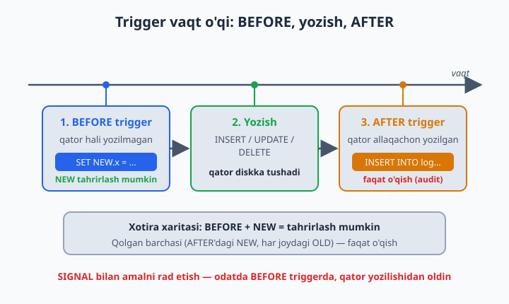
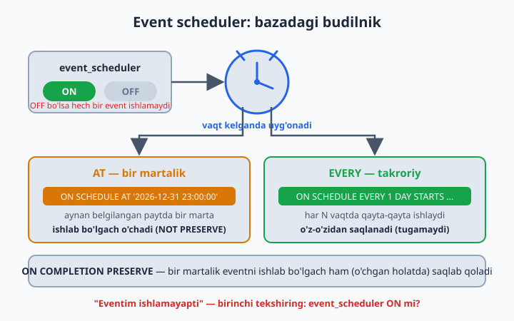

# 24 — Trigger va Event (chuqur)

[⬅️ Oldingi: 23 — Stored Procedure va Function](./23-procedure-function.md) · [🏠 README](./README.md) · [Keyingi: 25 — Cursor ➡️](./25-cursor.md)

> **Bu bobda:** ma'lumotlar bazasining ikkita "avtomat" mexanizmini chuqur o'rganamiz. **Trigger** — jadvalga qo'yilgan soqchi: har `INSERT`/`UPDATE`/`DELETE`da o'zi ishga tushib, ma'lumotni tekshiradi, to'g'rilaydi yoki log yozadi. **Event** — bazadagi budilnik: belgilangan vaqtda yoki har N daqiqada o'zi uyg'onib SQL bajaradi (eski log tozalash, kunlik hisobot yig'ish, arxivlash). Triggerning 6 turi (BEFORE/AFTER × INSERT/UPDATE/DELETE), `OLD` va `NEW` psevdo-jadvallari, bir hodisaga bir nechta trigger va ularning tartibi (`FOLLOWS`/`PRECEDES`), triggerning og'ir cheklovlari (o'z jadvalini o'zgartira olmasligi — 1442-xato, `COMMIT`/`ROLLBACK` taqiqi), audit/tarix naqshi, hamda `event_scheduler`ni yoqish, `CREATE EVENT`, `ON SCHEDULE`, `ON COMPLETION PRESERVE` va `ALTER EVENT` — barchasini real misollar va tuzoqlar bilan ko'rib chiqamiz.

---

## Trigger nima: jadvalga qo'yilgan soqchi

Tasavvur qiling, kutubxonada qoida bor: **har bir kitob ijaraga berilganda, o'sha kitobning bo'sh nusxalar soni avtomatik bittaga kamayishi kerak.** Buni ilovangizning har bir joyida qo'lda yozsangiz — bitta `INSERT INTO ijaralar`, keyin alohida `UPDATE kitoblar SET nusxa_soni = nusxa_soni - 1` — ertaga kimdir `UPDATE`ni unutib, bazada nomuvofiqlik paydo bo'ladi. Yechim: bu qoidani **jadvalning o'ziga** biriktirish. Shunda kim qaerdan `INSERT` qilmasin — ilovadanmi, `mysql` klientidanmi, boshqa procedure'danmi — qoida hamisha ishlaydi.

Ana shu "jadval ustiga osilgan, hodisaga avtomatik javob beradigan kod" — **trigger** (qo'zg'atuvchi). Trigger — bu siz chaqirmaydigan stored program. Uni hech kim `CALL` qilmaydi; u **hodisa** (`INSERT`, `UPDATE`, `DELETE`) ro'y berganda **MySQL'ning o'zi** ishga tushiradi.

📌 Triggerni eshik oldidagi soqchiga o'xshating: har kim kirsa-chiqsa, soqchi avtomatik tekshiradi — siz uni "chaqirmaysiz", u shunchaki o'sha eshikka biriktirilgan. Trigger ham aniq bir jadvalning aniq bir hodisasiga biriktiriladi.

Trigger ikki narsaga bog'langan bo'ladi:

1. **Qaysi jadval** — trigger faqat bitta jadvalga tegishli.
2. **Qaysi hodisa va qachon** — `INSERT`/`UPDATE`/`DELETE` dan biri, va u **oldin** (`BEFORE`) yoki **keyin** (`AFTER`) ishga tushadi.

Eng sodda trigger sintaksisi:

```sql
USE kutubxona;

DELIMITER //

CREATE TRIGGER trg_misol
BEFORE INSERT ON ijaralar
FOR EACH ROW
BEGIN
    -- har bir qo'shilayotgan qator uchun bajariladigan kod
    SET NEW.olingan_sana = COALESCE(NEW.olingan_sana, CURDATE());
END //

DELIMITER ;
```

`FOR EACH ROW` — MySQL'da triggerlar **har bir qator uchun** ishlaydi (qator darajasidagi trigger). Agar bitta `UPDATE` 50 qatorni o'zgartirsa, trigger 50 marta ishga tushadi. MySQL'da boshqa variant yo'q — `FOR EACH ROW` doim yoziladi.

💡 `DELIMITER //` nega kerak? Trigger tanasi (`BEGIN ... END`) ichida ko'p `;` bor. Agar ajratuvchi `;` bo'lib qolsa, MySQL birinchi `;` da buyruq tugadi deb o'ylaydi. Shuning uchun vaqtincha ajratuvchini `//` ga o'zgartirib, butun `CREATE TRIGGER`ni bitta birlik sifatida yuboramiz, so'ng `DELIMITER ;` bilan oddiy `;` ga qaytamiz. Bu odat barcha stored program'larda (procedure, function, trigger, event) bir xil.

## 6 xil trigger: BEFORE/AFTER × INSERT/UPDATE/DELETE

Vaqt (`BEFORE`/`AFTER`) va hodisa (`INSERT`/`UPDATE`/`DELETE`) kombinatsiyasi 6 ta triggerni beradi. Bitta jadvalda har biridan kamida bittadan bo'lishi mumkin (MySQL 8'da bir xil turdan bir nechta ham mumkin — quyida ko'ramiz).

| Tur | Qachon ishlaydi | Asosiy vazifasi |
|-----|-----------------|-----------------|
| `BEFORE INSERT` | Yangi qator yozilishidan **oldin** | Validatsiya, standart/hisoblangan qiymat berish (`SET NEW.x = ...`) |
| `AFTER INSERT` | Yangi qator yozilgandan **keyin** | Audit log, boshqa jadvalni yangilash (kaskad) |
| `BEFORE UPDATE` | Qator o'zgartirilishidan **oldin** | Yangi qiymatni tekshirish/tuzatish, o'zgarishni taqiqlash |
| `AFTER UPDATE` | Qator o'zgartirilgandan **keyin** | Eski→yangi tarixni log jadvaliga yozish |
| `BEFORE DELETE` | Qator o'chirilishidan **oldin** | O'chirishni taqiqlash, bog'liq tekshiruv |
| `AFTER DELETE` | Qator o'chirilgandan **keyin** | Arxivga ko'chirish, audit log |

Qoida soddagina: **BEFORE — qiymatni o'zgartirish yoki rad etish uchun** (chunki qator hali yozilmagan, `NEW`ni tahrirlash mumkin); **AFTER — fakt ro'y bergach, izini boshqa joyga yozish uchun** (audit, kaskad).

⚠️ Bu kitobda biz `AFTER INSERT` ichida "boshqa jadvalni yangilash" misollarini ko'rsatamiz, lekin yodda tuting: triggerlar yashirin ishlaydi va zanjir hosil qilishi mumkin (A jadval triggeri B'ni o'zgartiradi, B'ning triggeri C'ni...). Bu "ko'rinmas sehr" haqida bob oxirida alohida ogohlantiramiz.

## OLD va NEW: triggerning ikki ko'zgusi

Trigger ichida ikkita maxsus psevdo-jadval bor: `OLD` va `NEW`. Ular orqali qatorning eski va yangi holatiga murojaat qilasiz.

- `NEW.ustun` — qatorning **yangi** qiymati (`INSERT`/`UPDATE` da kelayotgan ma'lumot).
- `OLD.ustun` — qatorning **eski** qiymati (`UPDATE`/`DELETE` dan oldingi ma'lumot).

Qaysi hodisada qaysi biri mavjudligini quyidagi jadval aniq ko'rsatadi — buni yodlab oling, chunki yo'q narsaga murojaat qilsangiz xato olasiz:

| Hodisa | `OLD` bormi? | `NEW` bormi? | Izoh |
|--------|:---:|:---:|------|
| `INSERT` | ❌ yo'q | ✅ bor | Eski qator yo'q — faqat yangisi keladi |
| `UPDATE` | ✅ bor | ✅ bor | Ikkalasi ham — eski va yangi holat |
| `DELETE` | ✅ bor | ❌ yo'q | Yangi qator yo'q — faqat o'chayotgani bor |

Yana bitta muhim qoida: `NEW`ni **faqat `BEFORE` triggerda o'zgartirish mumkin** (`SET NEW.ustun = ...`). `AFTER` triggerda qator allaqachon yozib bo'lingan, shuning uchun u yerda `NEW`ni o'zgartirsangiz hech narsa o'zgarmaydi (faqat o'qish mumkin). `OLD` esa hamisha faqat o'qish uchun — uni hech qachon o'zgartira olmaysiz.

📌 Qisqa xotira xaritasi: **`BEFORE` + `NEW` = tahrirlash mumkin.** Qolgan barcha kombinatsiyalarda (`AFTER`dagi `NEW`, har joydagi `OLD`) faqat o'qiysiz.



## BEFORE: validatsiya va standart qiymat

`BEFORE` triggerning eng kuchli tomoni — qator diskka tushishidan oldin `NEW`ni tuzatish yoki butun amalni rad etish. Ikkita asosiy vazifasini ko'ramiz.

### 1) Standart/hisoblangan qiymat berish

Kutubxonada: ijara qo'shilganda `olingan_sana` ko'rsatilmagan bo'lsa, bugungi sana avtomatik qo'yilsin.

```sql
USE kutubxona;
DELIMITER //

CREATE TRIGGER trg_ijara_bi_sana
BEFORE INSERT ON ijaralar
FOR EACH ROW
BEGIN
    IF NEW.olingan_sana IS NULL THEN
        SET NEW.olingan_sana = CURDATE();
    END IF;
END //

DELIMITER ;
```

Endi `INSERT INTO ijaralar (kitob_id, azo_id) VALUES (1, 5);` desangiz, `olingan_sana` o'z-o'zidan bugungi sana bo'ladi.

### 2) Validatsiya: noto'g'ri ma'lumotni rad etish — SIGNAL

`BEFORE` trigger ichida `SIGNAL` bilan xato "otib", butun `INSERT`/`UPDATE`ni bekor qilish mumkin. Dokon bazasida: mahsulot narxi manfiy bo'lib qolmasin.

```sql
USE dokon;
DELIMITER //

CREATE TRIGGER trg_mahsulot_bi_narx
BEFORE INSERT ON mahsulotlar
FOR EACH ROW
BEGIN
    IF NEW.narx < 0 THEN
        SIGNAL SQLSTATE '45000'
            SET MESSAGE_TEXT = 'Narx manfiy bo''lishi mumkin emas';
    END IF;
END //

DELIMITER ;
```

`SQLSTATE '45000'` — "foydalanuvchi aniqlagan istisno" uchun standart kod. `SIGNAL` ishlaganda trigger to'xtaydi va butun amal bekor bo'ladi (qator yozilmaydi). `INSERT INTO mahsulotlar (nomi, narx) VALUES ('Test', -50);` urinilsa, MySQL `Narx manfiy bo'lishi mumkin emas` xatosini qaytaradi.

💡 Bir triggerda ham standartlash, ham validatsiya birga bo'lishi mumkin — masalan `BEFORE INSERT`da avval `SET NEW.x = TRIM(NEW.x)`, keyin `IF NEW.x = '' THEN SIGNAL ...`. Trigger tartibi muhim: avval tozalab, keyin tekshirasiz.

⚠️ Triggerdagi validatsiya `CHECK` cheklovining o'rnini bosadimi? Yo'q — ular bir-birini to'ldiradi. Oddiy "narx >= 0" kabi shartlar uchun `CHECK` constraint sodda va tezroq. Trigger esa **boshqa jadvalga qarab** tekshirish kerak bo'lganda (`CHECK` boshqa jadvalga murojaat qila olmaydi) yoki qiymatni o'zgartirish kerak bo'lganda kerak.

## AFTER: audit, log va kaskad

`AFTER` triggerda fakt allaqachon ro'y bergan. Endi vazifa — uning **izini boshqa jadvalga** yozish yoki bog'liq ma'lumotni yangilash.

### Kaskad: kitob ijaraga berilsa, nusxa sonini kamaytirish

Bobning boshidagi qoidani endi triggerga aylantiramiz:

```sql
USE kutubxona;
DELIMITER //

CREATE TRIGGER trg_ijara_ai_nusxa
AFTER INSERT ON ijaralar
FOR EACH ROW
BEGIN
    UPDATE kitoblar
    SET nusxa_soni = nusxa_soni - 1
    WHERE id = NEW.kitob_id;
END //

DELIMITER ;
```

Endi har qanday `INSERT INTO ijaralar` — qaerdan kelmasin — `kitoblar.nusxa_soni`ni avtomatik kamaytiradi. Mantiqiy juftligi: kitob qaytarilganda (`qaytarilgan_sana` to'lganda) nusxani qaytarish kerak — buni `AFTER UPDATE`da qilamiz:

```sql
USE kutubxona;
DELIMITER //

CREATE TRIGGER trg_ijara_au_qaytarish
AFTER UPDATE ON ijaralar
FOR EACH ROW
BEGIN
    -- faqat endi qaytarilgan bo'lsa (eski NULL, yangi to'lgan)
    IF OLD.qaytarilgan_sana IS NULL AND NEW.qaytarilgan_sana IS NOT NULL THEN
        UPDATE kitoblar
        SET nusxa_soni = nusxa_soni + 1
        WHERE id = NEW.kitob_id;
    END IF;
END //

DELIMITER ;
```

E'tibor bering — bu yerda `OLD` va `NEW`ni **solishtirib**, faqat "haqiqatan qaytarildi" holatini ushladik. Aks holda har qanday `UPDATE` (masalan, faqat izoh o'zgartirilsa ham) nusxani noto'g'ri oshirib yuborardi.

📌 Bu "o'zgardimi yoki yo'qmi" tekshiruvi `UPDATE` triggerlarida juda muhim. `UPDATE` triggeri **har** `UPDATE`da ishlaydi, hatto qiymat aslida o'zgarmasa ham (`UPDATE ... SET x = x`). Shuning uchun `IF OLD.ustun <> NEW.ustun` (yoki `NULL`-xavfsiz `IF NOT (OLD.ustun <=> NEW.ustun)`) bilan haqiqiy o'zgarishni ajrating.

### Audit log: kim, qachon, nimani o'chirdi

Klinika bazasida: bemor yozuvi o'chirilsa, izi `bemorlar_arxiv` jadvaliga tushsin (hech narsa izsiz yo'qolmasin).

```sql
USE klinika;

CREATE TABLE IF NOT EXISTS bemorlar_arxiv (
    arxiv_id    INT AUTO_INCREMENT PRIMARY KEY,
    bemor_id    INT,
    ism         VARCHAR(100),
    tugilgan_sana DATE,
    ochirgan    VARCHAR(100),
    ochirilgan_vaqt DATETIME
);

DELIMITER //

CREATE TRIGGER trg_bemor_ad_arxiv
AFTER DELETE ON bemorlar
FOR EACH ROW
BEGIN
    INSERT INTO bemorlar_arxiv (bemor_id, ism, tugilgan_sana, ochirgan, ochirilgan_vaqt)
    VALUES (OLD.id, OLD.ism, OLD.tugilgan_sana, CURRENT_USER(), NOW());
END //

DELIMITER ;
```

`DELETE` triggerda faqat `OLD` bor (yangi qator yo'q) — shuning uchun o'chayotgan qiymatlarni `OLD`dan olamiz. `CURRENT_USER()` kim o'chirayotganini, `NOW()` qachonligini yozadi. Endi `DELETE FROM bemorlar WHERE id = 3;` qilsangiz, yozuv yo'qolmaydi — arxivda qoladi.

## Eski→yangi tarix (audit/history) naqshi

Eng ko'p uchraydigan trigger vazifasi — **har bir o'zgarishning tarixini saqlash**. Masalan, dokondagi mahsulot narxi vaqt o'tib qanday o'zgargani kerak bo'ladi. Buning uchun alohida tarix jadvali tuzib, `AFTER UPDATE`da eski va yangi qiymatni yozamiz.

```sql
USE dokon;

CREATE TABLE IF NOT EXISTS narx_tarixi (
    tarix_id    INT AUTO_INCREMENT PRIMARY KEY,
    mahsulot_id INT,
    eski_narx   DECIMAL(12,2),
    yangi_narx  DECIMAL(12,2),
    ozgartirgan VARCHAR(100),
    ozgargan_vaqt DATETIME
);

DELIMITER //

CREATE TRIGGER trg_mahsulot_au_narx_tarix
AFTER UPDATE ON mahsulotlar
FOR EACH ROW
BEGIN
    IF NOT (OLD.narx <=> NEW.narx) THEN     -- narx haqiqatan o'zgarsa
        INSERT INTO narx_tarixi
            (mahsulot_id, eski_narx, yangi_narx, ozgartirgan, ozgargan_vaqt)
        VALUES
            (NEW.id, OLD.narx, NEW.narx, CURRENT_USER(), NOW());
    END IF;
END //

DELIMITER ;
```

`<=>` — `NULL`-xavfsiz tenglik operatori (ikkala tomon `NULL` bo'lsa ham to'g'ri ishlaydi). `NOT (OLD.narx <=> NEW.narx)` — "narx o'zgardi" degani. Endi har bir narx o'zgarishi `narx_tarixi`da ketma-ket yozib boriladi:

```sql
UPDATE mahsulotlar SET narx = 12000 WHERE id = 1;
UPDATE mahsulotlar SET narx = 13500 WHERE id = 1;

SELECT * FROM narx_tarixi WHERE mahsulot_id = 1 ORDER BY ozgargan_vaqt;
-- ikki qator: 10000->12000, keyin 12000->13500
```

💡 Bu naqsh "audit trail" (audit izi) deb ataladi va moliyaviy/tibbiy tizimlarda majburiy bo'ladi: "bu yozuv qachon, kim tomonidan, qanday o'zgargan?" degan savolga javob beradi. Tarix jadvalini hech qachon `UPDATE`/`DELETE` qilmang — u faqat o'sib boradigan jurnal bo'lsin.

## Bir hodisaga bir nechta trigger: FOLLOWS va PRECEDES

MySQL 5.7 gacha bitta jadval+hodisa+vaqt kombinatsiyasiga **faqat bitta** trigger qo'yish mumkin edi. MySQL 8'da esa bir xil turdan **bir nechta** trigger bo'lishi mumkin — masalan, ikkita `BEFORE INSERT`. Bunday holda ularning ishlash **tartibini** boshqarish kerak: `FOLLOWS` (keyin) yoki `PRECEDES` (oldin).

```sql
USE dokon;
DELIMITER //

-- 1-trigger: nomni tozalash
CREATE TRIGGER trg_mahsulot_bi_tozalash
BEFORE INSERT ON mahsulotlar
FOR EACH ROW
BEGIN
    SET NEW.nomi = TRIM(NEW.nomi);
END //

-- 2-trigger: tozalashdan KEYIN tekshirish
CREATE TRIGGER trg_mahsulot_bi_tekshir
BEFORE INSERT ON mahsulotlar
FOR EACH ROW
FOLLOWS trg_mahsulot_bi_tozalash      -- avvalgisidan keyin ishlaydi
BEGIN
    IF NEW.nomi = '' THEN
        SIGNAL SQLSTATE '45000'
            SET MESSAGE_TEXT = 'Mahsulot nomi bo''sh bo''lishi mumkin emas';
    END IF;
END //

DELIMITER ;
```

`FOLLOWS trg_mahsulot_bi_tozalash` — bu trigger nomi keltirilgan triggerdan **keyin** ishlasin. Demak avval nom tozalanadi (`TRIM`), keyin "bo'shmi?" deb tekshiriladi — to'g'ri tartib. Agar teskari kerak bo'lsa `PRECEDES` ishlatiladi.

📌 Tartibni ko'rish uchun `SHOW TRIGGERS`dagi `ACTION_ORDER` ustuniga qarang (`INFORMATION_SCHEMA.TRIGGERS.ACTION_ORDER`): 1, 2, 3... — bir guruh ichidagi navbat raqami.

⚠️ Bir hodisaga ko'p trigger qo'yish — kuchli, lekin xavfli. Ularning birgalikdagi natijasini kuzatish qiyinlashadi. Imkon bo'lsa, mantiqni bitta triggerda ketma-ket yozgan ma'qul; ko'p triggerni faqat mustaqil, bir-biriga bog'liq bo'lmagan vazifalar uchun ishlating.

## Trigger cheklovlari: nimani QILA OLMAYDI

Trigger kuchli, lekin uning chegaralari bor. Bularni bilmasangiz, kutilmagan xatolarga duch kelasiz.

### 1) O'z jadvalini DML qila olmaydi (1442-xato)

Trigger **o'zi biriktirilgan jadval**ni `INSERT`/`UPDATE`/`DELETE` qila olmaydi. Aks holda cheksiz rekursiya bo'lardi (trigger o'zini qayta chaqiradi). Quyidagi kod **xato** beradi:

```sql
USE dokon;
DELIMITER //

CREATE TRIGGER trg_xato
AFTER UPDATE ON mahsulotlar
FOR EACH ROW
BEGIN
    -- XATO 1442: o'z jadvalini UPDATE qilolmaydi
    UPDATE mahsulotlar SET narx = narx * 1.1 WHERE id = NEW.id;
END //

DELIMITER ;
```

`ERROR 1442: Can't update table 'mahsulotlar' in stored function/trigger because it is already used by statement which invoked this stored function/trigger.`

**Yechim:** o'z qatorini o'zgartirish kerak bo'lsa, `UPDATE` emas, `BEFORE` triggerda `SET NEW.ustun = ...` ishlating. Yuqoridagi misolni to'g'ri qilib:

```sql
USE dokon;
DELIMITER //

CREATE TRIGGER trg_togri
BEFORE UPDATE ON mahsulotlar
FOR EACH ROW
BEGIN
    SET NEW.narx = NEW.narx * 1.1;   -- to'g'ri: NEW orqali, qator yozilishidan oldin
END //

DELIMITER ;
```

📌 Demak "qatorning o'zini o'zgartirish" = `BEFORE` + `SET NEW`. "Boshqa jadvalni o'zgartirish" = `AFTER` + `UPDATE`/`INSERT`. Bu ikkisini aralashtirmang.

### 2) COMMIT/ROLLBACK ishlatib bo'lmaydi

Trigger har doim **uni chaqirgan amal tranzaksiyasi ichida** ishlaydi. Shuning uchun trigger ichida `COMMIT`, `ROLLBACK` yoki `START TRANSACTION` yozsangiz — xato olasiz. Trigger tranzaksiyani o'zi yakunlay olmaydi: agar asosiy amal bekor qilinsa (`ROLLBACK`), trigger qilgan o'zgarishlar ham birga bekor bo'ladi (atomarlik). Trigger ichida amalni "to'xtatish" uchun yagona yo'l — `SIGNAL` bilan xato otish; u butun amalni (trigger o'zgarishlari bilan birga) bekor qiladi.

### 3) Ko'rinmaslik va kaskad zanjir xavfi

Trigger boshqa jadvalni o'zgartirsa, o'sha jadvalning triggeri ham ishga tushadi — shunday qilib **trigger zanjiri** hosil bo'ladi. MySQL'da maksimal trigger ichma-ichligi cheklangan, lekin baribir bu zanjirni boshqarish qiyin. A→B→C ketma-ketlikni kod o'qib bilib bo'lmaydi (hech qaysi `INSERT`da yozilmagan).

⚠️ MySQL'da bir trigger ichidan **`CALL` orqali stored procedure**ni chaqirish mumkin, lekin u procedure'da `COMMIT`/`ROLLBACK` bo'lmasligi shart. Triggerlar `LOCK TABLES`, `ALTER TABLE`, `DROP TABLE` kabi tranzaksiyani buzadigan buyruqlarni ham bajara olmaydi.

## "Ko'rinmas sehr" ogohlantirishi: qachon foydali, qachon zararli

Trigger — bu **yashirin** kod. `INSERT INTO ijaralar ...` yozgan dasturchi `kitoblar.nusxa_soni` o'zgarganini ko'rmaydi — bu "sehr" parda ortida sodir bo'ladi. Ana shu yashirinlik triggerning ham eng katta foydasi, ham eng katta xavfi.

**Trigger foydali bo'lgan holatlar:**

- **Audit/tarix** — har o'zgarishni jurnalga yozish. Bu mantiqni ilovaga tarqatish xato qilishga olib keladi; triggerda bitta joyda, ishonchli.
- **Qat'iy invariant** — "ijara qo'shilsa, nusxa kamaysin" kabi qoida hech qachon buzilmasligi shart va u **qaerdan** kelishidan qat'i nazar amal qilishi kerak.
- **Hosila qiymat** — `BEFORE`da hisoblangan ustun (masalan, to'liq ism = ism + familiya) ni avtomatik to'ldirish.

**Trigger zararli bo'lgan holatlar:**

- **Murakkab biznes-mantiq** — ko'p shartli, ko'p jadvalli logikani triggerga tiqish. Buni ilovada yoki stored procedure'da ko'rish va sinash osonroq.
- **Nojo'ya effektlar** — bitta `UPDATE` ko'zga ko'rinmas ravishda 5 ta jadvalni o'zgartirsa, hatto tajribali dasturchi ham nima sodir bo'layotganini tushunmay qoladi (debug qilish azob).
- **Tezlik** — har qatorga og'ir trigger ulkan `INSERT`ni sekinlashtiradi (1 mln qator = 1 mln trigger ishlashi).

📌 Oltin qoida: **trigger — qoida (invariant) va audit uchun, biznes-jarayon uchun emas.** "Bu narsa hamisha, istisnosiz to'g'ri bo'lishi kerakmi?" — ha bo'lsa, trigger. "Bu — bir necha bosqichli ish jarayonimi?" — unda procedure yoki ilova kodi.

💡 Triggerlaringizni hujjatlashtiring: jadval nomidan keyin `_bi_`/`_ai_`/`_bu_`/`_au_`/`_bd_`/`_ad_` kabi prefiks (before/after × insert/update/delete) qo'ying. Shunda `SHOW TRIGGERS` natijasidan har birining nima qilishi nomidan ko'rinib turadi.

## Triggerlarni ko'rish va o'chirish

Mavjud triggerlarni ko'rishning bir necha yo'li bor:

```sql
USE kutubxona;

-- Joriy bazadagi barcha triggerlar
SHOW TRIGGERS;

-- Faqat ma'lum jadvalga tegishlilari
SHOW TRIGGERS WHERE `Table` = 'ijaralar';

-- Bitta triggerning to'liq ta'rifi
SHOW CREATE TRIGGER trg_ijara_ai_nusxa;
```

`INFORMATION_SCHEMA` orqali kengroq so'rov:

```sql
SELECT TRIGGER_NAME, EVENT_MANIPULATION, EVENT_OBJECT_TABLE,
       ACTION_TIMING, ACTION_ORDER
FROM INFORMATION_SCHEMA.TRIGGERS
WHERE TRIGGER_SCHEMA = 'kutubxona'
ORDER BY EVENT_OBJECT_TABLE, ACTION_TIMING, ACTION_ORDER;
```

| Ustun | Ma'nosi |
|-------|---------|
| `EVENT_MANIPULATION` | `INSERT` / `UPDATE` / `DELETE` |
| `ACTION_TIMING` | `BEFORE` / `AFTER` |
| `EVENT_OBJECT_TABLE` | Trigger biriktirilgan jadval |
| `ACTION_ORDER` | Bir guruhdagi ishlash tartibi (1, 2, ...) |

Triggerni o'chirish:

```sql
DROP TRIGGER trg_ijara_ai_nusxa;
DROP TRIGGER IF EXISTS trg_ijara_ai_nusxa;   -- yo'q bo'lsa ham xato bermaydi
```

⚠️ MySQL'da triggerni `ALTER` qilib bo'lmaydi — o'zgartirmoqchi bo'lsangiz `DROP` qilib, qaytadan `CREATE` qilasiz. Jadval `DROP TABLE` qilinsa, unga osilgan barcha triggerlar ham avtomatik o'chadi.

## EVENT: bazadagi budilnik

Trigger — hodisaga javob beradi (kimdir `INSERT` qilsa). **Event** esa **vaqtga** javob beradi: belgilangan paytda yoki har N daqiqada o'zi uyg'onib SQL bajaradi. Bu — bazaning ichidagi vazifa rejalashtiruvchisi (operatsion tizimning `cron`/`Task Scheduler`iga o'xshash, lekin baza ichida).



### event_scheduler: ON/OFF

Eventlar faqat **event scheduler** (rejalashtiruvchi jarayon) yoqilgan bo'lsa ishlaydi. U sukut bo'yicha o'chiq bo'lishi mumkin — avval holatini tekshiring:

```sql
SHOW VARIABLES LIKE 'event_scheduler';
-- Value: ON yoki OFF
```

Yoqish (joriy sessiya emas, butun server uchun):

```sql
SET GLOBAL event_scheduler = ON;
```

⚠️ `SET GLOBAL` faqat server qayta ishga tushgunicha amal qiladi. Doimiy yoqish uchun `my.cnf` (yoki `my.ini`) faylida `[mysqld]` bo'limiga `event_scheduler=ON` yozing. Aks holda server restart bo'lganda eventlar yana to'xtaydi. Bu eng ko'p uchraydigan tuzoq: "eventim ishlamayapti" — odatda scheduler o'chiq bo'ladi.

### CREATE EVENT: takroriy va bir martalik

Event ikki xil rejada bo'ladi: ma'lum **vaqtda bir marta** (`AT`) yoki **har N vaqtda takroran** (`EVERY`).

**Har N vaqtda (takroriy):** kutubxonada har kuni 3 oydan oshgan, hali qaytarilmagan ijaralar bo'yicha tekshiruv jadvaliga yozuv tashlash.

```sql
USE kutubxona;

CREATE TABLE IF NOT EXISTS qarzdor_hisobot (
    id              INT AUTO_INCREMENT PRIMARY KEY,
    sana            DATE,
    qarzdorlar_soni INT
);

DELIMITER //

CREATE EVENT ev_kunlik_qarzdor
ON SCHEDULE EVERY 1 DAY
STARTS '2026-06-12 02:00:00'
DO
BEGIN
    INSERT INTO qarzdor_hisobot (sana, qarzdorlar_soni)
    SELECT CURDATE(), COUNT(*)
    FROM ijaralar
    WHERE qaytarilgan_sana IS NULL
      AND olingan_sana < CURDATE() - INTERVAL 90 DAY;
END //

DELIMITER ;
```

`ON SCHEDULE EVERY 1 DAY` — har kuni; `STARTS` — birinchi marta qachondan boshlash. `EVERY` qiymatlari: `EVERY 10 MINUTE`, `EVERY 1 HOUR`, `EVERY 1 WEEK` va h.k.

**Bir martalik (`AT`):** ma'lum sanada bir marta arxivlash.

```sql
USE dokon;

CREATE EVENT ev_bir_martalik_arxiv
ON SCHEDULE AT '2026-12-31 23:00:00'
DO
    INSERT INTO buyurtmalar_arxiv
    SELECT * FROM buyurtmalar WHERE YEAR(sana) = 2026;
```

`AT '2026-12-31 23:00:00'` — aynan shu paytda bir marta ishlaydi. Tana bitta buyruqdan iborat bo'lsa `BEGIN ... END` shart emas (yuqoridagidek) — shuning uchun bu yerda `DELIMITER` ham kerak emas.

### ON COMPLETION PRESERVE: eventni saqlab qolish

Sukut bo'yicha **bir martalik** (`AT`) event ishlab bo'lgach, MySQL uni avtomatik **o'chirib tashlaydi** (`ON COMPLETION NOT PRESERVE`). Agar eventni ishlab bo'lgach ham bazada (o'chgan holatda) qoldirmoqchi bo'lsangiz — `ON COMPLETION PRESERVE` qo'shing:

```sql
USE dokon;

CREATE EVENT ev_yil_yakuni_hisobot
ON SCHEDULE AT '2026-12-31 23:30:00'
ON COMPLETION PRESERVE        -- ishlab bo'lgach ham o'chmaydi
DO
    INSERT INTO yillik_hisobot (yil, jami_savdo)
    SELECT 2026, SUM(summa) FROM buyurtmalar WHERE YEAR(sana) = 2026;
```

📌 `PRESERVE` — eventning ta'rifi (tarixi) kerak bo'lganda yoki keyinroq `ALTER EVENT`bilan qayta yoqmoqchi bo'lganda foydali. Takroriy (`EVERY`) eventlar esa o'z-o'zidan saqlanadi — ular hech qachon "tugamaydi" (agar `ENDS` ko'rsatilmagan bo'lsa).

### ENABLE / DISABLE va ALTER EVENT

Eventni o'chirmasdan vaqtincha **to'xtatib** turish mumkin:

```sql
USE kutubxona;

ALTER EVENT ev_kunlik_qarzdor DISABLE;   -- vaqtincha o'chirish
ALTER EVENT ev_kunlik_qarzdor ENABLE;    -- qayta yoqish
```

`ALTER EVENT` bilan jadvalni o'zgartirmasdan jadvani (jadvalni emas — jadval-rejani, ya'ni schedule'ni), tanani yoki nomini ham o'zgartirish mumkin:

```sql
-- Jadvalni (vaqt rejasini) o'zgartirish
ALTER EVENT ev_kunlik_qarzdor
ON SCHEDULE EVERY 12 HOUR;

-- Tanani (DO qismini) o'zgartirish
DELIMITER //
ALTER EVENT ev_kunlik_qarzdor
DO
BEGIN
    -- yangilangan mantiq
    DELETE FROM qarzdor_hisobot WHERE sana < CURDATE() - INTERVAL 1 YEAR;
END //
DELIMITER ;

-- Nomini o'zgartirish
ALTER EVENT ev_kunlik_qarzdor RENAME TO ev_qarzdor_kunlik;
```

💡 Triggerni `ALTER` qilib bo'lmaydi, lekin eventni — bo'ladi. Bu ikkisining muhim farqi. Eventni sinash uchun esa odatda uni qo'lda bir marta ishlatib ko'rish kerak — buning uchun event tanasini alohida procedure'ga ajratib, o'sha procedure'ni `CALL` qilib tekshirish qulay (event ichidan procedure'ni `CALL` qilish mumkin).

## Eventning amaliy holatlari

Event qaerda real foyda beradi? Uchta klassik naqsh.

### 1) Eski log/ma'lumotni tozalash

Audit jadvallari cheksiz o'sadi. Eski yozuvlarni davriy o'chirib turish kerak. Klinika bazasida: 1 yildan eski audit yozuvlarini har kecha o'chirish.

```sql
USE klinika;

CREATE EVENT ev_eski_arxiv_tozalash
ON SCHEDULE EVERY 1 DAY
STARTS CURRENT_TIMESTAMP + INTERVAL 1 DAY
DO
    DELETE FROM bemorlar_arxiv
    WHERE ochirilgan_vaqt < NOW() - INTERVAL 1 YEAR;
```

### 2) Kunlik rollup/hisobot jadvali (materialized view simulyatsiyasi)

Og'ir agregat har safar so'ralganda hisoblanmasligi uchun, natijani kechasi bir marta hisoblab, tayyor jadvalga yozib qo'yamiz. Taksi bazasida: har haydovchining kunlik daromadi.

```sql
USE taksi;

CREATE TABLE IF NOT EXISTS haydovchi_kunlik (
    sana        DATE,
    haydovchi_id INT,
    safarlar    INT,
    daromad     DECIMAL(12,2),
    PRIMARY KEY (sana, haydovchi_id)
);

DELIMITER //

CREATE EVENT ev_kunlik_rollup
ON SCHEDULE EVERY 1 DAY
STARTS '2026-06-12 01:00:00'
DO
BEGIN
    INSERT INTO haydovchi_kunlik (sana, haydovchi_id, safarlar, daromad)
    SELECT CURDATE() - INTERVAL 1 DAY,
           haydovchi_id,
           COUNT(*),
           SUM(narx)
    FROM safarlar
    WHERE DATE(boshlanish) = CURDATE() - INTERVAL 1 DAY
    GROUP BY haydovchi_id
    ON DUPLICATE KEY UPDATE
        safarlar = VALUES(safarlar),
        daromad  = VALUES(daromad);
END //

DELIMITER ;
```

Endi kunlik daromad hisoboti `haydovchi_kunlik` jadvalidan bir lahzada o'qiladi — har safar millionlab `safarlar` qatorini qayta agregat qilmaydi. `ON DUPLICATE KEY UPDATE` — event ikki marta ishlasa ham takror yozuv qo'shmaydi (idempotent).

### 3) Arxivlash: eski ma'lumotni boshqa jadvalga ko'chirish

Dokonda: o'tgan yildan eski buyurtmalarni arxiv jadvaliga ko'chirib, asosiy jadvalni yengillashtirish.

```sql
USE dokon;

DELIMITER //

CREATE EVENT ev_oylik_arxiv
ON SCHEDULE EVERY 1 MONTH
DO
BEGIN
    INSERT INTO buyurtmalar_arxiv
    SELECT * FROM buyurtmalar
    WHERE sana < CURDATE() - INTERVAL 1 YEAR;

    DELETE FROM buyurtmalar
    WHERE sana < CURDATE() - INTERVAL 1 YEAR;
END //

DELIMITER ;
```

⚠️ Bu yerda avval `INSERT`, keyin `DELETE` — agar `INSERT` xato bersa, `DELETE` ham bajarilmasligi uchun ularni tranzaksiya ichida bajargan ma'qul. Event tanasida `START TRANSACTION ... COMMIT` ishlatish **mumkin** (triggerdan farqli — event mustaqil tranzaksiyada ishlaydi). Real loyihada ko'chirib bo'lganini tasdiqlamasdan o'chirmang.

## Eventlarni ko'rish va o'chirish

```sql
USE taksi;

-- Joriy bazadagi eventlar
SHOW EVENTS;

-- Bitta eventning to'liq ta'rifi
SHOW CREATE EVENT ev_kunlik_rollup;

-- INFORMATION_SCHEMA orqali kengroq
SELECT EVENT_NAME, STATUS, EVENT_TYPE, INTERVAL_VALUE, INTERVAL_FIELD,
       LAST_EXECUTED, STARTS, ENDS, ON_COMPLETION
FROM INFORMATION_SCHEMA.EVENTS
WHERE EVENT_SCHEMA = 'taksi';
```

| Ustun | Ma'nosi |
|-------|---------|
| `STATUS` | `ENABLED` / `DISABLED` / `SLAVESIDE_DISABLED` |
| `EVENT_TYPE` | `ONE TIME` (`AT`) yoki `RECURRING` (`EVERY`) |
| `LAST_EXECUTED` | Oxirgi marta qachon ishlagani (sinash uchun muhim) |
| `ON_COMPLETION` | `PRESERVE` yoki `NOT PRESERVE` |

Eventni o'chirish:

```sql
DROP EVENT ev_kunlik_rollup;
DROP EVENT IF EXISTS ev_kunlik_rollup;
```

📌 `LAST_EXECUTED` `NULL` bo'lsa — event hali bironta ham ishlamagan. Bu odatda `event_scheduler = OFF` ekanini yoki `STARTS` vaqti hali kelmaganini bildiradi. Eventni debug qilishni shu ustundan boshlang.

## Trigger va Event: qisqa qiyos

| Xususiyat | Trigger | Event |
|-----------|---------|-------|
| Nima qo'zg'atadi | Hodisa (`INSERT`/`UPDATE`/`DELETE`) | Vaqt (`AT` / `EVERY`) |
| Bog'langan | Bitta jadvalga | Butun bazaga (jadvalga emas) |
| `OLD`/`NEW` bormi | Ha | Yo'q |
| `COMMIT`/`ROLLBACK` | Mumkin emas | Mumkin (mustaqil tranzaksiya) |
| `ALTER` qilinadimi | Yo'q (drop+create) | Ha (`ALTER EVENT`) |
| Yoqish sharti | Doim faol | `event_scheduler = ON` kerak |

## Xulosa

Trigger — jadvalga biriktirilgan, hodisaga avtomatik javob beradigan soqchi. 6 turi bor (`BEFORE`/`AFTER` × `INSERT`/`UPDATE`/`DELETE`). `BEFORE` triggerda `SET NEW.ustun`bilan qiymatni tuzatish yoki `SIGNAL` bilan amalni rad etish mumkin; `AFTER`da esa fakt ro'y bergach audit/tarix/kaskad uchun ishlatasiz. `OLD` va `NEW` psevdo-jadvallari qatorning eski va yangi holatiga murojaat beradi (`INSERT`da faqat `NEW`, `DELETE`da faqat `OLD`, `UPDATE`da ikkalasi). Trigger o'z jadvalini `INSERT`/`UPDATE`/`DELETE` qila olmaydi (1442-xato — buning o'rniga `BEFORE`+`SET NEW`) va `COMMIT`/`ROLLBACK` ishlata olmaydi. Eng muhim qoida: trigger — qoida (invariant) va audit uchun, murakkab biznes-mantiq uchun emas, chunki uning yashirinligi katta xavf. Event — bazadagi budilnik: `event_scheduler = ON` bo'lsa, `AT` (bir marta) yoki `EVERY` (takroriy) rejada SQL bajaradi; `ON COMPLETION PRESERVE` bir martalik eventni saqlab qoladi, `ALTER EVENT` bilan uni o'zgartirish, `ENABLE`/`DISABLE` bilan to'xtatib turish mumkin. Eventning klassik vazifalari — eski log tozalash, kunlik rollup/hisobot va arxivlash. Keyingi bobda stored program ichidagi eng nozik vositaga — natijani qatorma-qator aylanadigan **cursor**ga o'tamiz.

## 24-bob masalalari

1. (kutubxona) `ijaralar` jadvaliga `BEFORE INSERT` trigger yozing: `olingan_sana` `NULL` bo'lsa, avtomatik `CURDATE()` qo'ysin
2. (dokon) `mahsulotlar` jadvaliga `BEFORE INSERT` trigger: `narx < 0` bo'lsa `SIGNAL SQLSTATE '45000'` bilan rad etsin
3. (kutubxona) `AFTER INSERT ON ijaralar` trigger yozing: tegishli kitobning `nusxa_soni`ni bittaga kamaytirsin
4. (kutubxona) `AFTER UPDATE ON ijaralar` trigger: `qaytarilgan_sana` `NULL`dan to'lganga o'zgarsagina, kitob `nusxa_soni`ni bittaga oshirsin (`OLD`/`NEW` solishtiring)
5. (klinika) `bemorlar_arxiv` jadvalini yarating va `AFTER DELETE ON bemorlar` trigger yozing: o'chirilgan bemor ma'lumotini, `CURRENT_USER()` va `NOW()` bilan birga arxivga yozsin
6. (dokon) `narx_tarixi` jadvalini yarating va `AFTER UPDATE ON mahsulotlar` trigger yozing: narx haqiqatan o'zgarganda (`<=>` ishlatib) eski va yangi narxni tarixga yozsin
7. (taksi) `BEFORE INSERT ON safarlar` trigger: `narx` kiritilmagan (`NULL`) bo'lsa, masofaga qarab hisoblab qo'ysin (`SET NEW.narx = NEW.masofa * 2500` kabi)
8. (dokon) `mahsulotlar`ga ikkita `BEFORE INSERT` trigger yozing: birinchi `nomi`ni `TRIM` qilsin, ikkinchisi (`FOLLOWS` bilan birinchidan keyin) bo'sh nomni `SIGNAL` bilan rad etsin
9. (kutubxona) `SHOW TRIGGERS WHERE \`Table\` = 'ijaralar';` bajaring — `ijaralar`ga osilgan barcha triggerlar ro'yxatini va ularning `Timing`/`Event` ustunlarini ko'ring
10. (dokon) `INFORMATION_SCHEMA.TRIGGERS`dan `dokon` bazasidagi triggerlarni `EVENT_OBJECT_TABLE`, `ACTION_TIMING`, `ACTION_ORDER` bo'yicha tartiblab chiqaring
11. (kutubxona) Atayin xato qiling: `AFTER UPDATE ON kitoblar` triggerda o'sha `kitoblar`ni `UPDATE` qilishga urinib ko'ring — qaysi xato (1442) chiqadi? Keyin uni `BEFORE`+`SET NEW` bilan to'g'rilang
12. (klinika) `qabullar` jadvaliga `BEFORE INSERT` trigger: `qabul_narxi` 0 yoki manfiy bo'lsa rad etsin, `NULL` bo'lsa standart `50000` qo'ysin (bir triggerda ikki shart)
13. (taksi) `haydovchilar`ga `AFTER UPDATE` trigger: agar `reyting` 4.0 dan pastga tushsa, `ogohlantirish_log` jadvaliga yozuv tashlasin
14. (umumiy) `SHOW VARIABLES LIKE 'event_scheduler';` bilan holatni tekshiring; `OFF` bo'lsa `SET GLOBAL event_scheduler = ON;` bilan yoqing va qayta tekshiring
15. (kutubxona) `EVERY 1 DAY` takroriy event yozing: har kuni 90 kundan oshgan, qaytarilmagan ijaralar sonini `qarzdor_hisobot` jadvaliga yozsin (`STARTS` bilan boshlanish vaqtini bering)
16. (dokon) `ON SCHEDULE AT` bilan bir martalik event yozing va `ON COMPLETION PRESERVE` qo'shing; `SHOW EVENTS`da uning `STATUS` va turini tekshiring
17. (taksi) `haydovchi_kunlik` rollup jadvalini yarating va har kuni kechasi avvalgi kun daromadini `ON DUPLICATE KEY UPDATE` bilan yozadigan event yozing
18. (klinika) 1 yildan eski `bemorlar_arxiv` yozuvlarini har kuni o'chiradigan tozalash eventi yozing; keyin `ALTER EVENT ... DISABLE` bilan vaqtincha to'xtating va `SHOW EVENTS`da `STATUS`ni ko'ring
19. (dokon) `ALTER EVENT` bilan 15-yoki-17-masaladagi eventning jadvalini (`ON SCHEDULE`) `EVERY 12 HOUR` ga o'zgartiring, so'ng nomini `RENAME TO` bilan o'zgartiring; `INFORMATION_SCHEMA.EVENTS`dan `LAST_EXECUTED`ni tekshiring
20. Fikrlang va yozing: "har bir buyurtma qo'shilganda mijozning umumiy xarid summasini yangilash" qoidasini — `AFTER INSERT` trigger bilan qilgan ma'qulmi yoki har kuni `EVENT` bilan qayta hisoblagan ma'qulmi? Har tarafga 2 tadan argument toping (maslahat: ma'lumot qanchalik tez yangilanishi kerak, va trigger zanjiri/tezlik xavfi qanchalik muhim — shu ikki savolga tayaning)
