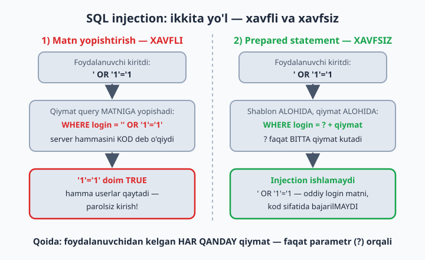
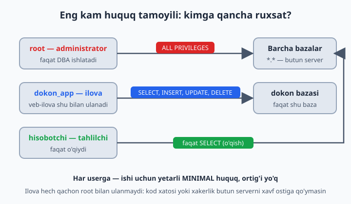
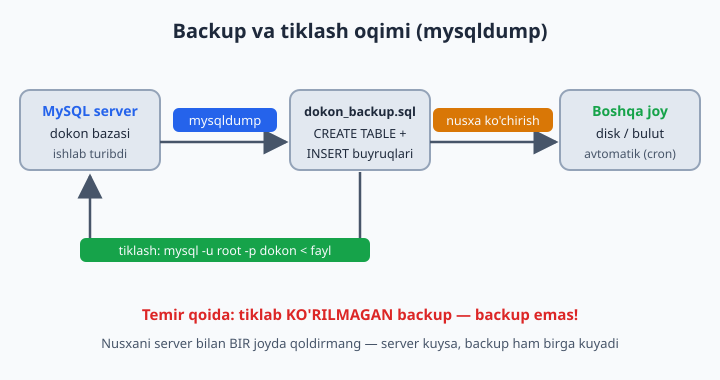

# 24 — Xavfsizlik va administratsiya

[⬅️ Oldingi: 23 — EXPLAIN va optimizatsiya](./23-explain-optimizatsiya.md) · [🏠 README](./README.md) · [Keyingi: 25 — Yakuniy loyihalar ➡️](./25-yakuniy-loyihalar.md)

> **Bu bobda:** bazani himoya qilishni o'rganamiz: SQL injection hujumi qanday ishlashini va prepared statement bilan undan qutulishni, har ilovaga alohida user yaratib minimal huquq berishni (CREATE USER, GRANT, REVOKE), mysqldump bilan backup olish va tiklashni, oxirida server holatini ko'rsatadigan diagnostika buyruqlarini ko'rib chiqamiz.

---

## SQL Injection — №1 xavf

Shu paytgacha query'larni o'zimiz yozdik. Real ilovada esa query ko'pincha **foydalanuvchi kiritgan qiymat** asosida tuziladi: login formasi, qidiruv maydoni, URL'dagi id. Aynan shu yerda web tarixidagi eng mashhur hujum yotadi — **SQL injection**: foydalanuvchi ma'lumot o'rniga SQL KOD yuboradi va sizning query'ingiz uning query'siga aylanib qoladi.

Dastur kodida (PHP misolida) query'ni matn yopishtirish bilan yasash:

```php
// XAVFLI KOD:
$query = "SELECT * FROM userlar WHERE login = '" . $_POST['login'] . "'";
```

Foydalanuvchi login o'rniga yozadi: `' OR '1'='1`. Query bo'ladi:

```sql
SELECT * FROM userlar WHERE login = '' OR '1'='1'
-- '1'='1' doim TRUE → HAMMA userlar qaytadi → parolsiz kirish!
```

Yoki battarrog'i: `'; DROP TABLE userlar; -- ` → jadval yo'qoladi. Oxiridagi `--` — komment belgisi (MySQL'da undan keyin bo'sh joy bo'lishi shart): query'ning qolgan qismini "o'chirib" yuboradi, shunda payload sintaksis xatosiz o'tadi. Muammoning ildizi shunda: server uchun yopishtirilgan satr — bitta butun query. U qayeri sizning kodingiz-u qayeri foydalanuvchi qiymati ekanini ajrata olmaydi.

📌 Adolat uchun: mysqli kabi ba'zi drayverlar (PHP'da `mysqli->query()`, Python'da mysql-connector standart rejimda) bitta so'rovda IKKITA statement bajarishga ruxsat bermaydi, shuning uchun `DROP TABLE` payload har doim ham o'tavermaydi. Lekin hammasi bunday emas: masalan, PHP PDO standart sozlamada ko'p statement'li satrni bemalol bajaradi — aynan shu sabab PDO bilan yozilgan zaif kod bunday hujumga ochiq. Xulosa: drayverga suyanmang — `OR '1'='1'` kabi injection umuman BITTA statement ichida ishlaydi va hech qanday to'siqqa uchramaydi.

**Yechim — parametrli query (prepared statement):** qiymat query MATNI bilan emas, ALOHIDA yuboriladi:

```php
// XAVFSIZ:
$stmt = $pdo->prepare("SELECT * FROM userlar WHERE login = ?");
$stmt->execute([$_POST['login']]);
```

Server avval shablonni oladi va tushunib qo'yadi: "login ustunini BITTA qiymat bilan solishtiraman". Keyin kelgan qiymat nima bo'lishidan qat'i nazar — faqat qiymat. Endi `' OR '1'='1` — shunchaki g'alati login MATNI bo'lib qoladi, kod sifatida bajarilmaydi. **Qoida: foydalanuvchidan kelgan har qanday qiymat — faqat parametr orqali. Hech qanday istisno.**



📌 Bu PHP'ga xos muammo emas: Python, Java, JavaScript, C# — hammasida prepared statement bor (nomi har xil: parameterized query, placeholder). Qaysi tilda yozmang, qoida o'sha-o'sha.

## Userlar va huquqlar

Mehmonxonada farroshga hamma eshikni ochadigan universal kalit berilmaydi — har xodimga faqat o'z eshiklarining kaliti. Bazada bu **eng kam huquq tamoyili** deyiladi: har userga ishi uchun yetarli minimal huquq, ortig'i — yo'q.

Shuning uchun dastur hech qachon `root` bilan ulanmasin! `root` — hamma narsaga qodir administrator; ilova kodida xato yo xakerlik bo'lsa, butun server xavf ostida qoladi. Har ilovaga — o'z useri, minimal huquq:

```sql
CREATE USER 'dokon_app'@'localhost' IDENTIFIED BY 'Kuchli_Parol_123!';

GRANT SELECT, INSERT, UPDATE, DELETE ON dokon.* TO 'dokon_app'@'localhost';
-- DROP, ALTER bermadik — ilova jadval o'chira olmaydi!

SHOW GRANTS FOR 'dokon_app'@'localhost';                  -- huquqlarni ko'rish
REVOKE DELETE ON dokon.* FROM 'dokon_app'@'localhost';    -- huquqni qaytarib olish
ALTER USER 'dokon_app'@'localhost' IDENTIFIED BY 'Yangi_Parol_456!';  -- parolni almashtirish
DROP USER 'dokon_app'@'localhost';                        -- userni o'chirish
```

Eng ko'p beriladigan huquqlar:

| Huquq | Nima beradi | Ilovaga kerakmi? |
|-------|-------------|------------------|
| `SELECT` | o'qish | ha |
| `INSERT`, `UPDATE`, `DELETE` | qator qo'shish / yangilash / o'chirish | odatda ha |
| `CREATE`, `ALTER`, `DROP` | jadval STRUKTURASINI o'zgartirish | yo'q! |
| `ALL PRIVILEGES` | hammasi | faqat administratorga |



💡 `'dokon_app'@'localhost'` — bu nom + manzil juftligi. `localhost` — user faqat server turgan kompyuterning o'zidan ulana oladi; `'%'` — istalgan joydan (kerak bo'lmasa, ochmang!). MySQL uchun `'app'@'localhost'` va `'app'@'%'` — ikkita ALOHIDA user.

📌 Internetdagi eski qo'llanmalarda har `GRANT`'dan keyin `FLUSH PRIVILEGES;` yozishadi — kerak emas: `CREATE USER`, `GRANT`, `REVOKE` o'zgarishni darhol qo'llaydi. `FLUSH PRIVILEGES` faqat huquq jadvallarini qo'lda (to'g'ridan-to'g'ri INSERT/UPDATE bilan) o'zgartirganda kerak bo'ladi — bunday ish esa sizga umuman kerak bo'lmaydi.

💡 Userlar ko'payganda MySQL 8 ning **ROLE** mexanizmi qo'l keladi: huquqlar to'plamiga nom berib, bir nechta userga birdek "kiydirasiz". `CREATE ROLE 'oquvchi'; GRANT SELECT ON dokon.* TO 'oquvchi'; GRANT 'oquvchi' TO 'ali'@'localhost';` — endi o'nlab userning huquqini bitta joydan boshqarasiz (rol kirishda avtomatik yoqilishi uchun yana `SET DEFAULT ROLE ALL TO 'ali'@'localhost';` deyiladi).

## Backup — mysqldump

Disk kuyishi, xato `DELETE`, xakerlik — baza bir kunda yo'q bo'lishi mumkin. Yagona haqiqiy himoya — **backup** (zaxira nusxa). MySQL'da buning klassik quroli — `mysqldump`: bazani bitta `.sql` faylga "to'kib" beradi. Fayl ichi — oddiy matn: jadvallarni qayta yaratadigan `CREATE TABLE` va ma'lumotni qaytaradigan `INSERT` buyruqlari. Tiklash — shu faylni qaytadan bajarish, xolos.

```bash
# Backup (terminalda, mysql ichida emas!):
mysqldump -u root -p dokon > dokon_backup.sql

# Ishlayotgan serverda izchil nusxa (InnoDB uchun tavsiya):
mysqldump -u root -p --single-transaction dokon > dokon_backup.sql

# Hamma bazalar:
mysqldump -u root -p --all-databases > hammasi.sql

# Tiklash:
mysql -u root -p dokon < dokon_backup.sql

# --all-databases faylini tiklash (baza nomi shart emas — fayl ichida CREATE DATABASE va USE bor):
mysql -u root -p < hammasi.sql
```

📌 E'tibor bering: bitta baza dump qilinganda fayl ichida `CREATE DATABASE` BO'LMAYDI — tiklashdan oldin bo'sh bazani o'zingiz yaratasiz (`CREATE DATABASE dokon;`). `--databases` yoki `--all-databases` bilan olingan faylda esa bu buyruq bor, shuning uchun to'g'ridan-to'g'ri tiklayverasiz.



**Temir qoida: tiklab KO'RILMAGAN backup — backup emas.** Faylning borligi yetmaydi — tiklanishini tekshiring.

📌 Backupni baza turgan serverning o'zida qoldirmang: server kuysa, backup ham birga kuyadi. Nusxani boshqa diskka, boshqa serverga yoki bulutga ko'chiring — va buni qo'lda emas, avtomatik (cron) qiling.

## Foydali diagnostika

Server "qornida" nima bo'layotganini ko'rish uchun bir nechta buyruq yetadi:

```sql
SHOW PROCESSLIST;                          -- hozir kim nima qilyapti
KILL 42;                                   -- osilib qolgan query'ni to'xtatish (id — PROCESSLIST'dan)
SHOW STATUS LIKE 'Threads_connected';      -- hozir nechta ulanish bor
SHOW VARIABLES LIKE 'max_connections';     -- ruxsat etilgan maksimum
SELECT table_schema, ROUND(SUM(data_length+index_length)/1024/1024) AS mb
FROM information_schema.tables GROUP BY table_schema;   -- baza hajmlari (MB)
```

`SHOW PROCESSLIST` — serverning "kim bor?" ro'yxati: har bir ulanish qaysi bazada, qancha vaqtdan beri qaysi query'ni bajarayotganini ko'rsatadi. Sayt sekinlashganda birinchi qaraladigan joy — shu. Uzun query matni `...` bilan kesilib ko'rinsa, `SHOW FULL PROCESSLIST;` to'liq ko'rsatadi. Osilib qolgan query'ni `KILL <id>` bilan to'xtatasiz — buni 15-masalada o'zingiz sinab ko'rasiz. Nozik farq: `KILL 42` butun ulanishni uzadi, `KILL QUERY 42` esa ulanishni saqlab faqat hozirgi query'ni to'xtatadi.

## 24-bob masalalari

1. Qog'ozda: `login = ' OR '1'='1` qanday ishlashini qadam-baqadam yozing (query qanday ko'rinishga keladi?)
2. `'; DROP TABLE userlar; -- ` payloadini tahlil qiling: `--` SQL'da nima? (komment — qolgan qismni o'chiradi; MySQL'da `--` dan keyin bo'sh joy bo'lishi shartligini ham eslang)
3. SQL darajasida prepared statement sinang: `PREPARE st FROM 'SELECT * FROM dokon.mijozlar WHERE id = ?'; SET @id = 1; EXECUTE st USING @id;`
4. 3-masalada `SET @id = '1 OR 1=1';` qilib EXECUTE qiling — injection ishladimi? (yo'q — butun matn bitta qiymat sifatida qaraldi!)
5. `dokon_app` userini yarating (SELECT, INSERT, UPDATE huquqlari bilan, DELETE'siz). Bobni o'qib borib allaqachon yaratgan bo'lsangiz, avval `DROP USER` qiling
6. Yangi terminalda `mysql -u dokon_app -p` bilan kiring, SELECT qiling (ishlaydi), DELETE qiling (xato!) — "DELETE command denied" xatosini o'z ko'zingiz bilan ko'ring
7. O'sha user bilan `kutubxona`ga kirib ko'ring — kira olmaysiz (huquq faqat dokon'ga edi)
8. Faqat O'QIY oladigan user yarating: `hisobotchi` — faqat SELECT, hamma bazaga (`*.*`)
9. `SHOW GRANTS`ni ikkala user uchun bajaring va farqini yozing
10. REVOKE bilan dokon_app'dan UPDATE'ni oling, tekshiring, qaytarib bering
11. `dokon`ni mysqldump bilan backup qiling — fayl hajmini ko'ring, ichini matn muharririda oching (oddiy SQL buyruqlar!)
12. Bazani DROP qiling (ha, jasorat!) va backup'dan to'liq tiklang: `mysql -u root -p < ...` (fayl ichida CREATE DATABASE bo'lmasa, avval yaratib `mysql ... dokon < fayl`). Hammasi joyidami — COUNT bilan tekshiring
13. 4 ta bazani bitta faylga backup qiling (`--databases kutubxona dokon klinika taksi`)
14. Cron g'oyasi: har kuni avtomatik backup buyrug'ini yozing (bajarish shart emas, buyruqni tuzing): sana nomli fayl + gzip
15. `SHOW PROCESSLIST;` — o'z ulanishingizni toping. 2-terminal oching, unda uzun query bajaring (`SELECT SLEEP(30);`), 1-terminaldan PROCESSLIST'da ko'rib, `KILL <id>;` bilan to'xtating!
16. Baza hajmlari query'sini bajaring — qaysi baza eng katta? (katta bazasi, albatta)
17. Parol siyosati: `IDENTIFIED BY '123'` bilan user yaratib ko'ring — MySQL 8 e'tiroz bildirishi mumkin (validate_password). Xabarni o'qing
18. O'ylang: nega ilova uchun DROP/ALTER huquqlari berilmaydi? Qanday xavf? (xakerlik yoki kod xatosi jadval strukturasini buzmasin)
19. O'ylang: backup faylni qayerda saqlash kerak — o'sha serverdami? (yo'q! server kuysa backup ham kuyadi — boshqa joyga nusxa)
20. Mini-audit: o'z 4 bazangiz bo'yicha "xavfsizlik cheklisti" yozing: userlar to'g'rimi, parollar kuchlimi, backup bormi, FK'lar joyidami
