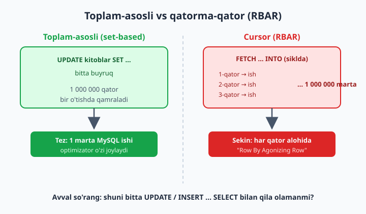
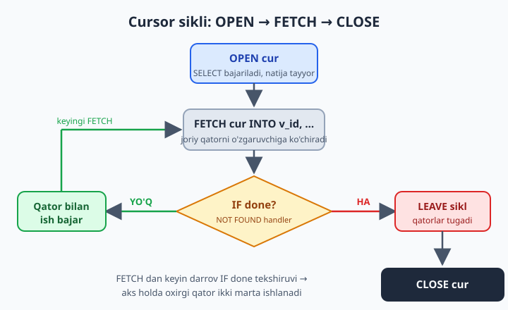

# 25 — Cursor va qatorma-qator ishlov

[⬅️ Oldingi: 24 — Trigger va Event](./24-trigger-event.md) · [🏠 README](./README.md) · [Keyingi: 26 — EXPLAIN va optimizatsiya ➡️](./26-explain-optimizatsiya.md)

> **Bu bobda:** SQL'ning eng nozik va eng ko'p suiiste'mol qilinadigan vositasi — **cursor** bilan tanishamiz. Cursor natija to'plamini qatorma-qator aylanib o'tish imkonini beradi, lekin u deyarli har doim oddiy `SELECT`/`UPDATE`dan **sekinroq** ishlaydi. Shuning uchun bobning yarmi cursor sintaksisiga (`DECLARE`, `OPEN`, `FETCH`, `CLOSE` va `NOT FOUND` handler), ikkinchi yarmi esa eng muhim saboqqa — "cursorni qanday qilib **ishlatmaslik**" va to'plam-asosli (set-based) fikrlashga bag'ishlanadi. Oxirida cursor HAQIQATAN kerak bo'ladigan kam sonli holatlarni ham ko'rib chiqamiz.

---

## Cursor nima va nega kerak

Shu paytgacha SQL'da har bir buyruq **butun jadval** ustida birvarakayiga ishladi. `UPDATE kitoblar SET nusxa_soni = nusxa_soni + 1` deganingizda million qatorni ham bitta buyruq qamrab oladi — siz "har bir qator uchun nima qilishni" emas, "natija qanday bo'lishi kerakligini" aytasiz. Bu — SQL'ning butun falsafasi: **to'plam-asosli (set-based)** fikrlash. Buyruq qaysi qatorni avval, qaysisini keyin qayta ishlashini siz boshqarmaysiz — bu optimizatorning ishi.

Ba'zan esa dasturchiga "har bir qatorni birma-bir olib, alohida-alohida nimadir qilish" kerakdek tuyuladi — xuddi dasturlash tilidagi `for` sikli kabi. Aynan shuning uchun SQL'da **cursor** bor: u natija to'plamining ustiga "ko'rsatkich" qo'yib, qatorlarni **birma-bir** o'qish imkonini beradi.

📌 Cursor — bu oddiy SQL buyrug'i emas. U **faqat stored program ichida** (procedure, function, trigger, event tanasida) yashaydi. `mysql` klientiga to'g'ridan-to'g'ri `DECLARE ... CURSOR` yozolmaysiz — bu xato beradi. Shuning uchun bu bobdagi barcha misollar **procedure ko'rinishida** bo'ladi. Stored procedure va `DELIMITER //` mavzularini 23-bobda ko'rgan edingiz; cursor — o'sha bilimning ustiga quriladi.

Cursorni "kitobni o'qish" deb tasavvur qiling: `SELECT` — bu butun kitob (natija to'plami); cursor — barmog'ingiz, hozir qaysi qatorda turganini ko'rsatadi. Har `FETCH`da barmoq bir qator pastga suriladi va o'sha qatorni o'zgaruvchilarga ko'chirib olasiz. Barmoq oxirgi qatordan ham o'tib ketganda — "kitob tugadi" signali keladi (`NOT FOUND`), va siz siklni to'xtatasiz.

## TO'PLAM-ASOSLI vs QATORMA-QATOR: RBAR antipattern

Cursorni o'rganishdan oldin uning **eng katta tuzog'i**ni aytib qo'yaylik, chunki bu butun bobning markaziy g'oyasi.

Qatorma-qator ishlovning kinoyaviy nomi bor — **RBAR** ("Row By Agonizing Row", ya'ni "azob bilan qatorma-qator"). Sabab oddiy: cursor sikli ichida har bir qator uchun MySQL alohida ish bajaradi — qatorni o'qiydi, o'zgaruvchiga ko'chiradi, balki yana bitta `UPDATE` yoki `SELECT` yuboradi. 100 000 qator bo'lsa — 100 000 marta shu aylanish. Bitta to'plam-asosli `UPDATE` esa o'sha 100 000 qatorni MySQL ichida, optimallashtirilgan tarzda, **bir o'tishda** bajaradi.



Nega bunday? To'plam-asosli buyruqda optimizator butun ishni **bir reja** sifatida ko'radi: indeksdan foydalanadi, JOIN tartibini tanlaydi, qatorlarni paket-paket o'qiydi. Cursor sikli esa har aylanishda alohida "borib-kel" qiladi: SQL ifodasini qayta baholaydi, o'zgaruvchilarni to'ldiradi, mantiqni tekshiradi. Bu "borib-kel"larning yig'indisi — RBAR'ning narxi.

⚠️ **Oltin qoida:** cursor yozishdan oldin har doim o'zingizga savol bering — "shuni bitta `UPDATE`, `INSERT ... SELECT` yoki `DELETE` bilan, ya'ni to'plam sifatida qila olamanmi?". Javob "ha" bo'lsa — cursorni unuting. 90% hollarda javob "ha". Cursorga faqat to'plam-asosli yechim **umuman mumkin bo'lmaganda** o'tasiz (bu holatlarni bob oxirida ko'ramiz).

💡 Cursorni tez-tez ishlatish — odatda "SQL'ni dasturlash tili kabi o'ylash" alomati. Tajribali SQL dasturchisi muammoni avval "qaysi to'plam ustida qanday o'zgartirish kerak?" deb qo'yadi, "har bir element bo'yicha qanday aylanaman?" deb emas. Boshqa tildan (Python, PHP) kelganlar uchun bu fikrlash burilishi — eng qiyin, lekin eng qimmatli odat.

## Cursorning 4 qadami

Har bir cursor bilan ishlash to'rt qadamdan iborat. Avval qadamlarni alohida ko'rib chiqamiz, keyin to'liq procedure'da birlashtiramiz.

**1-qadam — DECLARE cursor.** Cursorga nom beramiz va u qaysi `SELECT` ustida ishlashini aytamiz. Diqqat: bu yerda `SELECT` hali **bajarilmaydi** — faqat "ta'rif" beriladi:

```sql
DECLARE cur CURSOR FOR
    SELECT id, ism FROM azolar;
```

**2-qadam — DECLARE handler.** Cursor qatorlar tugaganini qanday biladi? `FETCH` so'nggi qatordan keyin yana chaqirilsa, MySQL `NOT FOUND` holatini "otadi". Uni ushlab, `done` degan bayroqni `TRUE` qilamiz:

```sql
DECLARE done BOOLEAN DEFAULT FALSE;
DECLARE CONTINUE HANDLER FOR NOT FOUND SET done = TRUE;
```

`CONTINUE` — handler ishlagandan keyin procedure to'xtamaydi, davom etadi (qarama-qarshisi `EXIT` — u butun blokdan chiqib ketadi). `NOT FOUND` — bu `SQLSTATE '02000'`, ya'ni "boshqa qator yo'q" signali. Handler "tuzoq" kabi ishlaydi: shu signal qachon kelsa, o'sha zahoti `SET done = TRUE` bajariladi.

**3-qadam — OPEN.** Cursorni "ochamiz" — aynan shu paytda `SELECT` bajariladi va natija to'plami tayyor turadi, barmoq esa birinchi qatordan oldinga qo'yiladi:

```sql
OPEN cur;
```

**4-qadam — FETCH ... INTO va CLOSE.** Har `FETCH`da joriy qatorni o'zgaruvchilarga ko'chiramiz va barmoqni pastga suramiz; ishimiz tugagach cursorni yopamiz:

```sql
FETCH cur INTO v_id, v_ism;
-- ... qator bilan biror ish ...
CLOSE cur;
```

📌 `FETCH cur INTO v_id, v_ism` dagi o'zgaruvchilar **soni va tartibi** `SELECT`dagi ustunlarga aniq mos kelishi shart. `SELECT id, ism` bo'lsa — `INTO v_id, v_ism`. Mos kelmasa, procedure umuman yaratilmaydi (yaratish vaqtidayoq xato beradi). Bu — yaxshi xabar: xato ishga tushganda emas, kodni saqlaganda topiladi.



## `done` bayroq naqshi va sikl

To'rt qadamni bir sikl ichida birlashtiramiz. Eng keng tarqalgan ikki naqsh bor.

**LOOP / LEAVE naqshi** — `FETCH`ni faqat bir joyda yozish imkonini beradi, shu sababli boshlovchiga xavfsizroq:

```sql
OPEN cur;
sikl: LOOP
    FETCH cur INTO v_id, v_ism;
    IF done THEN
        LEAVE sikl;                  -- qator tugadi -> sikldan chiq
    END IF;
    -- ... v_id, v_ism bilan ish ...
END LOOP sikl;
CLOSE cur;
```

`sikl:` — siklga qo'yilgan **yorliq (label)**; `LEAVE sikl` shu yorliqli sikldan chiqadi. `FETCH`dan keyin darrov `IF done` tekshiruvi turishi muhim: oxirgi qatordan keyingi `FETCH` `done`ni `TRUE` qiladi-yu, lekin o'zgaruvchilarga yangi qiymat KO'CHIRMAYDI — eski qiymat o'zgaruvchida turaveradi. Agar shu yerda chiqmasangiz, oxirgi qatorni **ikki marta** qayta ishlab yuborasiz. Bu — cursor bilan ishlovchilarning №1 xatosi.

**WHILE naqshi** — ba'zilar uchun o'qiluvchanroq, lekin `FETCH` ikki joyda turadi:

```sql
OPEN cur;
FETCH cur INTO v_id, v_ism;          -- "priming read": birinchi qatorni oldindan o'qiymiz
WHILE NOT done DO
    -- ... v_id, v_ism bilan ish ...
    FETCH cur INTO v_id, v_ism;      -- keyingi qatorni o'qiymiz
END WHILE;
CLOSE cur;
```

E'tibor bering: `FETCH` ikki joyda turadi — sikldan **oldin** (birinchi qator) va sikl **oxirida** (keyingisi). Bu "oldindan o'qish" (priming read) naqshi shart, aks holda bo'sh to'plamda ham sikl bir marta ishlab, eskirgan qiymat bilan ish ko'rib qoladi.

💡 Ikkala naqsh ham to'g'ri. Boshlovchiga `LOOP/LEAVE` xavfsizroq, chunki `FETCH` bitta joyda turadi va "ikki marta priming read yozishni unutish" xatosi bo'lmaydi. Quyida shu naqshda davom etamiz.

📌 `DECLARE` tartibi MySQL'da **qat'iy**: blok boshida avval oddiy lokal o'zgaruvchilar (`DECLARE ... INT/BOOLEAN/...`), keyin cursorlar (`DECLARE ... CURSOR`), oxirida handlerlar (`DECLARE ... HANDLER`). Tartibni buzsangiz — procedure yaratishda sintaksis xatosi. Buni yodda saqlash uchun: "o'zgaruvchi → cursor → handler".

## To'liq amaliy misol: har a'zo bo'yicha qarz hisoblash

Endi haqiqiy vazifa. Kutubxonada har bir a'zoning **kechikkan kunlari uchun jarima** hisoblab, natijani alohida hisobot jadvaliga yozmoqchimiz. Qoida: qaytarilmagan (`qaytarilgan_sana IS NULL`) va 14 kundan oshib ketgan har bir ijara uchun, ortiqcha har bir kun = 500 so'm jarima.

Avval hisobot jadvalini yaratamiz:

```sql
USE kutubxona;

CREATE TABLE IF NOT EXISTS qarz_hisoboti (
    azo_id      INT PRIMARY KEY,
    azo_ism     VARCHAR(100),
    jami_qarz   DECIMAL(12,2) NOT NULL DEFAULT 0,
    hisoblangan DATETIME
);
```

### Cursorli yechim (RBAR — o'rganish uchun, lekin sekin)

Quyidagi procedure har bir a'zoni birma-bir aylanib, uning kechikkan ijaralarini sanab, jarimani jamlaydi va `qarz_hisoboti`ga yozadi:

```sql
DELIMITER //

CREATE PROCEDURE qarz_hisobla_cursor()
BEGIN
    -- 1. Lokal o'zgaruvchilar (har doim eng boshda)
    DECLARE v_azo_id   INT;
    DECLARE v_azo_ism  VARCHAR(100);
    DECLARE v_qarz     DECIMAL(12,2);
    DECLARE done       BOOLEAN DEFAULT FALSE;

    -- 2. Cursor: barcha a'zolar ustida
    DECLARE cur CURSOR FOR
        SELECT id, ism FROM azolar;

    -- 3. NOT FOUND handler (cursordan KEYIN e'lon qilinadi)
    DECLARE CONTINUE HANDLER FOR NOT FOUND SET done = TRUE;

    -- Hisobotni har safar toza boshlaymiz
    DELETE FROM qarz_hisoboti;

    OPEN cur;
    azolar_sikli: LOOP
        FETCH cur INTO v_azo_id, v_azo_ism;
        IF done THEN
            LEAVE azolar_sikli;
        END IF;

        -- Shu a'zoning kechikkan jarimasini hisoblaymiz
        SELECT COALESCE(SUM(
                   GREATEST(DATEDIFF(CURDATE(), olingan_sana) - 14, 0) * 500
               ), 0)
          INTO v_qarz
          FROM ijaralar
         WHERE azo_id = v_azo_id
           AND qaytarilgan_sana IS NULL;

        -- Faqat qarzi borlarni yozamiz
        IF v_qarz > 0 THEN
            INSERT INTO qarz_hisoboti (azo_id, azo_ism, jami_qarz, hisoblangan)
            VALUES (v_azo_id, v_azo_ism, v_qarz, NOW());
        END IF;
    END LOOP azolar_sikli;
    CLOSE cur;
END //

DELIMITER ;

CALL qarz_hisobla_cursor();
SELECT * FROM qarz_hisoboti ORDER BY jami_qarz DESC;
```

Bu kodni qadam-baqadam tushunaylik:

- `DECLARE` tartibi **qat'iy**: avval oddiy o'zgaruvchilar, keyin cursor, keyin handler. Tartibni buzsangiz — sintaksis xatosi.
- `GREATEST(DATEDIFF(...) - 14, 0)` — kechikkan kunlar 14 dan kam bo'lsa manfiy chiqadi; `GREATEST(..., 0)` uni 0 ga "qisadi", ya'ni jarima manfiy bo'lmaydi.
- `COALESCE(SUM(...), 0)` — a'zoda hech qanday ochiq ijara bo'lmasa, `SUM` `NULL` qaytaradi; uni 0 ga aylantiramiz.
- Har bir a'zo uchun **alohida `SELECT`** ketyapti — mana shu RBAR'ning narxi. 10 000 a'zo bo'lsa, 10 000 ta `SELECT` so'rovi.

📌 `LEAVE` faqat sikldan chiqaradi, procedure'ni to'xtatmaydi — `CLOSE cur` baribir bajariladi. Cursorni yopishni unutmang: ochiq qolgan cursor sessiya resursini ushlab turadi va procedure qayta chaqirilganda muammoga olib kelishi mumkin.

⚠️ **Nozik tuzoq: ichki `SELECT ... INTO` ham `NOT FOUND` ni "otadi".** Yuqoridagi ichki `SELECT COALESCE(SUM(...), 0) INTO v_qarz` — **agregat** so'rov, u har doim aniq bitta qator qaytaradi (qator bo'lmasa ham, `SUM` `NULL`/`0` beradi). Shuning uchun bu yerda hammasi xavfsiz. Lekin **agregatsiz** `SELECT ustun INTO v_x ... WHERE ...` (masalan `SELECT narx INTO v_narx FROM ... WHERE id = ...`) sikl ichida turib **bo'sh natija** qaytarsa, MySQL o'sha `SQLSTATE '02000'` (NOT FOUND) ni otadi — va siz e'lon qilgan **ayni o'sha** `CONTINUE HANDLER FOR NOT FOUND` ishlab ketadi, `done = TRUE` bo'lib qoladi. Natijada keyingi `FETCH` hali qator bo'lsa-da, sikl muddatidan oldin to'xtaydi. Bu cursorning eng yashirin xatolaridan biri. Yechimlar: ichki so'rovni `COALESCE`/`SUM` bilan har doim bitta qator qaytaradigan qilish; yoki ichki so'rovdan **darrov keyin** `done` ni qayta tiklash (`SET done = FALSE;`); yoki ichki so'rovni alohida ichki `BEGIN ... END` blokiga o'rab, unga **o'z** handlerini berish.

### Xuddi shu natija — sof to'plam-asosli yechim (cursorsiz, tezroq)

Endi diqqat. Yuqoridagi 30 qatorli procedure **bitta** `INSERT ... SELECT` bilan to'liq almashtiriladi — sikl ham, o'zgaruvchi ham, handler ham, cursor ham yo'q:

```sql
DELETE FROM qarz_hisoboti;

INSERT INTO qarz_hisoboti (azo_id, azo_ism, jami_qarz, hisoblangan)
SELECT a.id,
       a.ism,
       SUM(GREATEST(DATEDIFF(CURDATE(), i.olingan_sana) - 14, 0) * 500) AS jami_qarz,
       NOW()
  FROM azolar a
  JOIN ijaralar i ON i.azo_id = a.id
 WHERE i.qaytarilgan_sana IS NULL
 GROUP BY a.id, a.ism
HAVING jami_qarz > 0;
```

Bir xil natija, lekin:

- **Bitta** so'rov — MySQL barcha a'zo va ijaralarni JOIN qilib, `GROUP BY` bilan guruhlab, jarimani bir o'tishda hisoblaydi.
- `HAVING jami_qarz > 0` — cursorli versiyadagi `IF v_qarz > 0` ning to'plam-asosli ekvivalenti: faqat qarzi borlarni qoldiradi.
- Optimizator ichki ishlarni o'zi joylab oladi (indeksdan foydalanish, JOIN tartibini tanlash) — siz qatorlar tartibini boshqarmaysiz, faqat **natijani** tasvirlaysiz.

⚠️ Cursorli versiya nafaqat **uzunroq** (xato qilish ehtimoli ko'proq), balki katta jadvalda **o'nlab marta sekinroq** ishlaydi. Mana bu — bobning eng muhim isboti: ko'pchilik cursor "har bir element uchun nimadir qilish" muammosi aslida `JOIN + GROUP BY + INSERT ... SELECT` muammosi ekan. Cursor yozishdan oldin shuni qidiring.

💡 Solishtirib o'lchash uchun: ikkala usulni ham `SET @t = NOW(6);` bilan boshlab, oxirida `SELECT TIMESTAMPDIFF(MICROSECOND, @t, NOW(6));` deb vaqtni mikrosekundlarda chiqaring. Kichik bazada farq sezilmasligi mumkin, lekin qatorlar soni o'sgan sayin cursor versiyasi keskin orqada qoladi. Ikkala yondashuvni `EXPLAIN` (26-bob) bilan ham taqqoslab ko'ring.

## Ichma-ich (nested) cursor

Ba'zan bitta cursor sikli ichida ikkinchi cursor ochiladi — masalan, "har bir shifokor uchun (tashqi cursor), uning har bir qabuli bo'yicha (ichki cursor) bir narsa qil". Sintaksis ishlaydi, lekin narxi **ko'payadi**: tashqi 100 qator × ichki 100 qator = 10 000 aylanish.

Qisqa namuna (klinika; faqat tuzilmani ko'rsatish uchun):

```sql
DELIMITER //
CREATE PROCEDURE nested_misol()
BEGIN
    DECLARE v_sh_id INT;
    DECLARE done1 BOOLEAN DEFAULT FALSE;
    DECLARE cur_sh CURSOR FOR SELECT id FROM shifokorlar;
    DECLARE CONTINUE HANDLER FOR NOT FOUND SET done1 = TRUE;

    OPEN cur_sh;
    tashqi: LOOP
        FETCH cur_sh INTO v_sh_id;
        IF done1 THEN LEAVE tashqi; END IF;

        -- Bu yerda v_sh_id bo'yicha ichki cursor ochish MUMKIN,
        -- lekin deyarli har doim bitta JOIN'li so'rov tezroq va soddaroq.
        SELECT v_sh_id AS shifokor, COUNT(*) AS qabullar
          FROM qabullar WHERE shifokor_id = v_sh_id;
    END LOOP tashqi;
    CLOSE cur_sh;
END //
DELIMITER ;
```

⚠️ Ichma-ich cursorda har bir cursor uchun **alohida** `done` bayrog'i (`done1`, `done2`) kerak — bitta umumiy bayroq ishlatsangiz, ichki cursor tugaganda u tashqi siklni ham noto'g'ri to'xtatib qo'yadi. Bu juda nozik xato. Aslida nested cursorga ehtiyoj — deyarli har doim "bu masala bitta `JOIN` bilan yechiladi" degan signal.

## Cursor faqat read-only va forward-only (MySQL)

MySQL cursorining ikkita muhim cheklovi bor, ularni boshqa bazalardan (masalan, SQL Server, Oracle) kelganlar bilishi shart:

- **Faqat forward (oldinga):** `FETCH` har doim oldinga yuradi. "Orqaga qaytish", "boshiga sakrash" yoki "5-qatorga o'tish" yo'q. Qaytadan boshlash uchun cursorni `CLOSE` qilib, qayta `OPEN` qilasiz.
- **Faqat read-only (o'qish):** cursor orqali joriy qatorni to'g'ridan-to'g'ri tahrirlay olmaysiz. SQL Server'dagi `UPDATE ... WHERE CURRENT OF cursor` MySQL'da **yo'q**. O'zgartirish kerak bo'lsa, `FETCH` bilan olgan kalitingiz (`v_azo_id`) orqali alohida `UPDATE ... WHERE id = v_azo_id` yozasiz.

📌 Demak MySQL cursorlari "asossiz" emas — ataylab sodda va yengil qilingan: faqat oldinga o'qish. Murakkab "qatorni joyida tahrirlash" senariylari uchun MySQL sizni to'plam-asosli `UPDATE`ga "majburlaydi" — bu aslida foydangizga.

## Qachon cursor HAQIQATAN kerak

Cursorni qoralab keldik, lekin u behuda vosita emas — to'plam-asosli yechim **umuman mumkin bo'lmagan** holatlar bor. Mana o'shalar:

**1. Har qator uchun procedure CALL qilish.** Agar har bir qator uchun yon ta'siri bor (boshqa jadvalga yozadigan, tashqi tizimga signal beradigan) saqlangan procedure'ni chaqirish kerak bo'lsa — `INSERT ... SELECT` buni qila olmaydi, chunki `SELECT` ichida `CALL` yo'q. Bu yerda cursor o'rinli:

```sql
DELIMITER //
CREATE PROCEDURE hamma_azolarni_qayta_ishla()
BEGIN
    DECLARE v_id INT;
    DECLARE done BOOLEAN DEFAULT FALSE;
    DECLARE cur CURSOR FOR SELECT id FROM azolar;
    DECLARE CONTINUE HANDLER FOR NOT FOUND SET done = TRUE;

    OPEN cur;
    sikl: LOOP
        FETCH cur INTO v_id;
        IF done THEN LEAVE sikl; END IF;
        CALL azo_xabar_yubor(v_id);   -- har a'zo uchun alohida procedure
    END LOOP sikl;
    CLOSE cur;
END //
DELIMITER ;
```

**2. Murakkab imperativ mantiq.** Agar har bir qatorni qayta ishlash oldingi qatorlar natijasiga bog'liq bo'lsa va bu mantiqni window funksiya yoki rekursiv CTE bilan ifodalab bo'lmasa (juda kam uchraydi — avval 15-bobdagi CTE va 16-bobdagi window funksiyalarni eslang), cursor qadamma-qadam holatni saqlash imkonini beradi.

**3. Migratsiya / ETL skriptlari.** Bir martalik ma'lumot ko'chirish, eski formatdan yangisiga o'tkazish yoki tashqi tizim bilan qator-baqator sinxronlash kabi ishlarda tezlik birinchi o'rinda turmaydi, "boshqarish va loglashning" qulayligi muhimroq. Bunday bir martalik skriptda cursor maqbul.

💡 Umumiy mezon: **"har qatorda yon ta'siri bor IMPERATIV amal" kerak bo'lsa (CALL, tashqi signal, qadamma-qadam holat) — cursor; "to'plamni boshqa to'plamga aylantirish" kerak bo'lsa — set-based.** Shubha tug'ilsa, set-based tomonga oging: u qariyb har doim to'g'ri tanlov.

## Xulosa

- **Cursor** — natija to'plamini qatorma-qator aylanib o'tish vositasi; faqat **stored program ichida** ishlaydi.
- 4 qadam: `DECLARE ... CURSOR FOR <select>` → `DECLARE CONTINUE HANDLER FOR NOT FOUND SET done = TRUE` → `OPEN` → `FETCH ... INTO` (siklda) → `CLOSE`.
- `DECLARE` tartibi qat'iy: o'zgaruvchilar → cursor → handler.
- `LOOP/LEAVE` naqshida `FETCH`dan keyin darrov `IF done THEN LEAVE` — aks holda oxirgi qator ikki marta qayta ishlanadi.
- Sikl ichidagi **agregatsiz `SELECT ... INTO`** bo'sh natija qaytarsa, u ham `NOT FOUND` ni otib `done = TRUE` qilib qo'yadi va siklni erta to'xtatadi — ichki so'rovni `COALESCE`/`SUM` bilan bekitib qo'ying yoki keyin `SET done = FALSE` bilan tiklang.
- Cursor — **RBAR**, ya'ni ko'pincha **sekin**. Avval to'plam-asosli (`INSERT ... SELECT`, `UPDATE ... JOIN`, `GROUP BY`) yechimni o'ylang.
- MySQL cursorlari **forward-only** va **read-only**.
- Cursor HAQIQATAN kerak bo'ladigan joylar: har qator uchun `CALL`, murakkab imperativ mantiq, bir martalik migratsiya/ETL.

---

## 25-bob masalalari

> Eslatma: barcha cursor masalalari procedure ichida yoziladi (`DELIMITER //` ishlatishni unutmang). Imkon bo'lgan har bir masalada **avval cursor bilan**, **keyin to'plam-asosli yechim bilan** yozishga harakat qiling va ikkalasini solishtiring.

1. (kutubxona) `azolar_royxati()` procedure: barcha a'zolar ustida cursor oching, har birining `ism`ini bitta vaqtinchalik `log` jadvalga `INSERT` qiling. To'rt qadamni (DECLARE/OPEN/FETCH/CLOSE) aniq belgilang.
2. (kutubxona) Yuqoridagi procedure'da `done` bayroq va `NOT FOUND` handler qanday ishlashini izohlovchi komment yozing; handler'ni atayin olib tashlab, qanday xato chiqishini kuzating (so'ng qaytaring).
3. (dokon) `mahsulot_narxlari()` procedure: `mahsulotlar` ustida cursor bilan yuring va har bir mahsulot `nomi` + `narx`ini `LOOP/LEAVE` naqshida o'qing.
4. (dokon) 3-masalani `WHILE NOT done` naqshiga aylantiring (priming read'ni to'g'ri qo'ying). Ikki naqsh natijasi bir xil ekanini tekshiring.
5. (klinika) `shifokor_qabullari()` procedure: har bir shifokor bo'yicha cursorda yurib, uning qabullari sonini hisoblab, `shifokor_statistika(shifokor_id, qabullar_soni)` jadvaliga yozing.
6. (klinika) 5-masalaning **to'plam-asosli** ekvivalentini bitta `INSERT ... SELECT ... GROUP BY` bilan yozing. Ikki natijani solishtiring.
7. (kutubxona) `qarz_hisobla_cursor()` procedure'ini (bobdagi misol) o'zingiz qaytadan yozing, `CALL` qiling va `qarz_hisoboti` natijasini ko'ring.
8. (kutubxona) 7-masalani bitta `INSERT ... SELECT` bilan qayta yozing (bobdagi set-based namuna). Ikkala usul bir xil qatorlarni bermoqdami — tekshiring.
9. (taksi) `haydovchi_daromadi()` procedure: cursorda har bir haydovchi bo'yicha yurib, `safarlar`dagi `narx` yig'indisini hisoblab, natijani chiqaring.
10. (taksi) 9-masalada `LEAVE`dan keyin `CLOSE cur` bajarilishiga ishonch hosil qiling. `CLOSE`ni atayin olib tashlab, procedure'ni ikki marta CALL qilganda nima bo'lishini kuzating.
11. (dokon) `kam_qolgan_mahsulotlar()` procedure: cursorda yurib, `soni < 5` bo'lgan har bir mahsulot uchun `ogohlantirish` jadvaliga qator qo'shing (faqat shartga moslarini).
12. (dokon) 11-masalani `INSERT ... SELECT ... WHERE soni < 5` bilan yozing va cursorsiz tezroq ekanini tushuntiring.
13. (kutubxona) Cursorda har bir a'zoning ochiq (qaytarilmagan) ijaralari sonini hisoblab, `azolar` jadvaliga yangi `ochiq_ijara` ustuni qo'shib (`ALTER TABLE`), uni `UPDATE ... WHERE id = v_azo_id` bilan yangilang.
14. (kutubxona) 13-masalani bitta `UPDATE azolar a JOIN (... GROUP BY ...) ...` bilan yozing — MySQL cursorida `UPDATE ... WHERE CURRENT OF` yo'qligini eslang.
15. (klinika) Ichma-ich cursor: tashqi cursor `shifokorlar`, ichki cursor o'sha shifokorning `qabullar`i. Har bir cursor uchun **alohida** `done` bayroq (`done1`, `done2`) ishlating. Nega bitta bayroq yetmasligini izohlang.
16. (klinika) 15-masalani bitta `JOIN`li so'rov bilan almashtiring va nested cursor deyarli har doim ortiqcha ekanini ko'rsating.
17. (taksi) `reyting_yangila()` procedure: cursorda har bir haydovchi bo'yicha yurib, uning safarlaridagi o'rtacha `baho`ni hisoblab, `haydovchilar.reyting`ni yangilang (NULL baholarni `AVG` o'zi tashlaydi).
18. (taksi) 17-masalani bitta `UPDATE ... JOIN` bilan qayta yozing va EXPLAIN bilan (26-bob) ikki yondashuvni taqqoslang.
19. (kutubxona) "Har qator uchun CALL" senariysi: avval `azo_xabar_yubor(p_azo_id)` nomli kichik procedure yozing (u shunchaki `log` jadvalga "a'zo X ga xabar" deb yozsin), so'ng cursorli procedure'da har a'zo uchun uni `CALL` qiling. Nega bu yerda set-based yechim mumkin emasligini tushuntiring.
20. (umumiy) Fikrlang va yozing: o'zingizning loyihangizdan (yoki yuqoridagi bazalardan) cursor HAQIQATAN o'rinli bo'lgan bitta holat va cursor noto'g'ri tanlov bo'lgan bitta holat toping. Har biriga sababini yozing (javob yo'nalishi: yon ta'sirli `CALL`/migratsiya — cursor; oddiy hisob-kitob/agregatsiya — har doim set-based).
