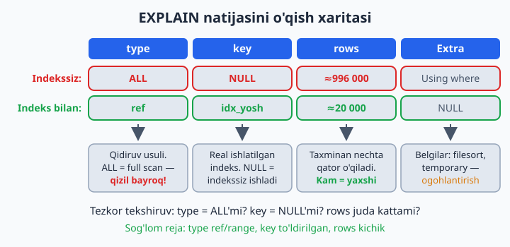
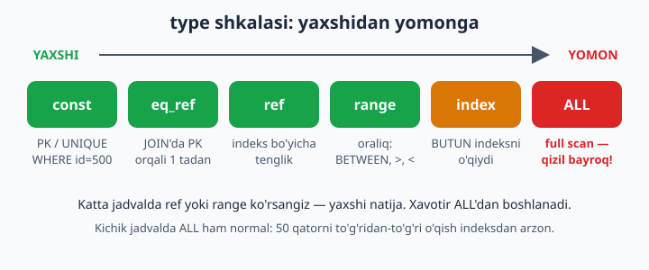
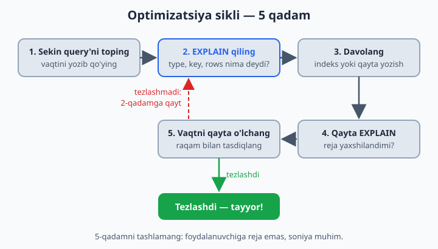

# 26 — EXPLAIN va optimizatsiya

[⬅️ Oldingi: 25 — Cursor va qatorma-qator ishlov](./25-cursor.md) · [🏠 README](./README.md) · [Keyingi: 27 — Xavfsizlik va administratsiya ➡️](./27-xavfsizlik-admin.md)

> **Bu bobda:** sekin query'ning sababini taxmin bilan emas, dalil bilan topishni o'rganamiz: EXPLAIN rejasidagi muhim ustunlarni (type, key, rows, Extra) o'qishni, type shkalasini (const'dan ALL'gacha), EXPLAIN ANALYZE bilan real vaqtlarni ko'rishni, optimizatsiyaning 5 qadamli siklini va eng ko'p uchraydigan 4 ta "kasallik"ni (ustunga funksiya, SELECT *, katta OFFSET, indekssiz JOIN) davolari bilan ko'rib chiqamiz.

---

## Muammo: query ishlayapti, lekin sekin. Sababini qayerdan bilamiz?

21-bobda indeks qidiruvni yuzlab baravar tezlashtirishini o'z ko'zimiz bilan ko'rdik. Lekin real loyihada savol boshqacha turadi: o'nlab query bor — qaysi biri sekin va NEGA sekin?

"Menimcha, indeks yetishmayapti", "balki JOIN aybdor" — bular taxmin. Yaxshi shifokor "qorningiz og'riyaptimi — demak, oshqozon" demaydi, rentgenga yuboradi. MySQL'da ham ana shunday rentgen bor va u bepul: `EXPLAIN`.

## EXPLAIN — query'ning rentgeni

Query OLDIGA `EXPLAIN` so'zini qo'ying — MySQL "men buni QANDAY bajarmoqchiman" degan rejasini ko'rsatadi. Muhim jihati: query'ning o'zi bajarilMAYDI, faqat reja chiqadi — million qatorli jadvalda ham bir zumda:

```sql
USE katta;
EXPLAIN SELECT * FROM foydalanuvchilar WHERE yosh = 25;
```

`yosh`da indeks bo'lmasa, natija taxminan bunday (muhim ustunlarnigina qoldirdik; 21-bobdan `idx_yosh` qolgan bo'lsa, "kasal" holatni ko'rish uchun avval `DROP INDEX idx_yosh ON foydalanuvchilar;` qiling):

| table | type | possible_keys | key | rows | Extra |
|---|---|---|---|---|---|
| foydalanuvchilar | **ALL** | NULL | NULL | ≈996000 | Using where |

O'qilishi: "mos indeks topmadim (`key = NULL`), shuning uchun jadvalni boshidan oxirigacha o'qiyman (`type = ALL`), taxminan 996 ming qatorni tekshiraman". Bitta savol uchun million qator — mana sizga sekinlikning hujjatlashtirilgan sababi, taxminsiz.

Indeks qo'yib, rentgenni takrorlaymiz:

```sql
CREATE INDEX idx_yosh ON foydalanuvchilar(yosh);
EXPLAIN SELECT * FROM foydalanuvchilar WHERE yosh = 25;
```

| table | type | possible_keys | key | rows | Extra |
|---|---|---|---|---|---|
| foydalanuvchilar | **ref** | idx_yosh | idx_yosh | ≈20000 | NULL |

Reja butunlay o'zgardi: `type=ref` (indeks bo'yicha tenglik), `key=idx_yosh` (indeks REAL ishladi), `rows` million emas — 20 ming atrofida (faqat 25 yoshlilar).

Asosiy ustunlar:

| Ustun | Nima | Nimaga qarash kerak |
|-------|------|---------------------|
| `type` | qidiruv usuli | `const`/`ref`/`range` — yaxshi; **`ALL` — full scan, YOMON** |
| `possible_keys` | nazariy mos keladigan indekslar | bo'sh bo'lsa — mos indeksning o'zi yo'q |
| `key` | real ishlatilgan indeks | `NULL` = indekssiz ishlayapti |
| `rows` | taxminan nechta qator o'qiladi | kam = yaxshi |
| `Extra` | qo'shimcha belgilar | `Using index` — zo'r; `Using filesort` — saralash indekssiz; `Using temporary` — vaqtinchalik jadval kerak bo'ldi |



📌 `rows` — aniq son emas, MySQL statistikasiga asoslangan **baho** (shuning uchun sizda biroz boshqacha raqam chiqishi mumkin). Lekin "20 ming yoki million" farqini ko'rsatishga bu bemalol yetadi.

💡 `Using filesort` nomiga aldanmang: bu "diskdagi fayl bilan ishladi" degani emas, "saralashni indekssiz, alohida bosqichda qildim" degani. O'nta qator uchun bu arzon ish, million qator uchun — qimmat.

## type — eng muhim ustun: shkala

`type` MySQL qancha mehnat qilishini bir so'zda aytadi. Qiymatlarini yaxshidan yomonga tersak, shkala hosil bo'ladi:

| type | Ma'nosi | Qachon chiqadi |
|---|---|---|
| `const` | bitta qator, darrov topiladi | PK yoki UNIQUE bo'yicha: `WHERE id = 500` |
| `eq_ref` | JOIN'da har qator uchun PK/UNIQUE orqali bittadan | FK → PK ulanishlari |
| `ref` | indeks bo'yicha tenglik | `WHERE ism = 'User500'` (idx_ism bilan) |
| `range` | indeksning bir oralig'i | `BETWEEN`, `>`, `<`, `LIKE 'User5%'` |
| `index` | BUTUN indeksni o'qish | full scan'dan yengilroq, lekin baribir og'ir |
| `ALL` | butun jadvalni o'qish — full scan | mos indeks yo'q. Qizil bayroq! |



💡 Maqsad — har query'dan `const` undirish emas. Katta jadvalda `ref` yoki `range` ko'rsangiz — bu yaxshi natija. Xavotir `ALL`dan boshlanadi. Kichik jadvalda esa `ALL` ham normal: 50 qatorni to'g'ridan-to'g'ri o'qish indeksga borib kelishdan arzon, MySQL buni o'zi hisoblab tanlaydi.

## EXPLAIN ANALYZE — reja emas, fakt

Oddiy EXPLAIN — "rejam shunday". `EXPLAIN ANALYZE` (MySQL 8.0.18+) esa query'ni **haqiqatdan bajarib**, har bosqichning REAL vaqti va REAL qator sonini ko'rsatadi:

```sql
EXPLAIN ANALYZE SELECT * FROM foydalanuvchilar WHERE yosh = 25;
```

Indeks qo'yishdan oldingi holatda natija taxminan bunday (qisqartirilgan):

```
-> Filter: (foydalanuvchilar.yosh = 25)  (cost=... rows=99633)
   (actual time=0.07..350 rows=20102 loops=1)
    -> Table scan on foydalanuvchilar  (cost=... rows=996357)
       (actual time=0.06..290 rows=1000000 loops=1)
```

O'qilishi: `actual time=0.07..350` — birinchi qator 0.07 ms'da, oxirgisi 350 ms'da kelgan; `rows=20102` — real topilgan qatorlar. Reja `rows=99633` degan edi — baho besh baravar adashibdi, bu normal: reja — bashorat, ANALYZE — fakt.

⚠️ Esda tuting: ANALYZE query'ni chindan ishga tushiradi. SELECT bilan bemalol, lekin yarim soat ishlaydigan og'ir query'ga ANALYZE qo'ysangiz — yarim soat kutasiz. Va eng muhimi: `EXPLAIN ANALYZE` ni UPDATE yoki DELETE'ga qo'llasangiz, ma'lumot CHINDAN o'zgaradi — oddiy `EXPLAIN` esa hech narsani bajarmaydi, xavfsiz.

## Optimizatsiya sikli (har doim shu ketma-ketlik!)

1. **Sekin query'ni toping** va hozirgi vaqtini yozib qo'ying (real loyihada buni slow query log topib beradi — 14-masalada sinaysiz)
2. **EXPLAIN qiling** — type, key, rows nima deyapti?
3. **Davolang**: `type=ALL` yoki katta `rows` ko'rsangiz — WHERE/JOIN ustunlariga indeks qo'ying yoki query'ni qayta yozing
4. **Qayta EXPLAIN** — reja yaxshilandimi?
5. **Vaqtni qayta o'lchang** — raqam bilan tasdiqlang. Tezlashmagan bo'lsa — 2-qadamga qayting



📌 5-qadamni tashlab ketmang! "EXPLAIN chiroyli bo'ldi" — hali natija emas: foydalanuvchiga reja emas, soniya muhim.

## Tipik kasalliklar va davolari

**KASALLIK 1: ustunga funksiya.** Indeks `ism` qiymatlari bo'yicha saralangan — `UPPER(ism)` natijalari bo'yicha emas. Shartda ustunga funksiya qo'ysangiz, MySQL uni har qatorda hisoblashga majbur — indeks o'chadi:

```sql
EXPLAIN SELECT * FROM foydalanuvchilar WHERE UPPER(ism) = 'USER5';   -- type: ALL
-- DAVO: shartni "toza" ustunga yozing:
EXPLAIN SELECT * FROM foydalanuvchilar WHERE ism = 'User5';          -- type: ref
```

(Aytgancha, MySQL'ning standart sozlamasida matn taqqoslash katta-kichik harfni baribir farqlamaydi — UPPER bu yerda umuman ortiqcha edi.) Sanalarda ham xuddi shu hikoya: `YEAR(sana) = 2026` o'rniga `sana >= '2026-01-01' AND sana < '2027-01-01'` yozing (21-bobdan tanish).

**KASALLIK 2: SELECT * (keraksiz ustunlar).** Faqat kerakli ustunlarni so'rang. Bonus: so'ralgan hamma ustun indeksning o'zida bo'lsa, MySQL jadvalga umuman tegmaydi — Extra'da `Using index` chiqadi (bu **covering index** deyiladi):

```sql
EXPLAIN SELECT ism FROM foydalanuvchilar WHERE ism LIKE 'User1%';  -- Extra: Using where; Using index
EXPLAIN SELECT *   FROM foydalanuvchilar WHERE ism LIKE 'User1%';  -- jadvalga ham boradi
```

**KASALLIK 3: katta OFFSET.** OFFSET "sakrab o'tish" emas — MySQL baribir hamma qatorni o'qib, keraksizlarini tashlab yuboradi:

```sql
SELECT * FROM foydalanuvchilar ORDER BY id LIMIT 10 OFFSET 900000;
-- 900 010 qator o'qiladi, 900 000 tasi axlatga!

-- DAVO (keyset pagination): "oxirgi ko'rgan id'dan keyingi 10 tasini ber":
SELECT * FROM foydalanuvchilar WHERE id > 900000 ORDER BY id LIMIT 10;  -- darrov!
```

"Keyingi sahifa" tugmasi bosilganda oxirgi qatorning id'sini eslab qolib shartga qo'yasiz — PK bo'yicha range qidiruv minginchi sahifada ham birinchisidek tez ishlaydi.

**KASALLIK 4: indekssiz JOIN.** JOIN'da MySQL birinchi jadvalning HAR qatori uchun ikkinchisidan mosini qidiradi. Ulanish ustuni indekssiz bo'lsa, eski MySQL'larda har bir qidiruv full scan'ga aylanardi: ming × million = falokat. MySQL 8 esa bunday holatda **hash join** ishlatib falokatni ancha yumshatadi, lekin indeksli ulanish baribir odatda tezroq va xotirani tejaydi. DAVO: `ON`dagi ustunlar (ayniqsa FK) indeksli bo'lsin. FOREIGN KEY constraint qo'ygan bo'lsangiz, indeks avtomatik bor (18-bob); qo'ymagan bo'lsangiz — o'zingiz qo'ying.

## 26-bob masalalari

> `katta` bazasida (1 mln qator) ishlang — kichik jadvalda EXPLAIN doim "hammasi yaxshi" deyveradi, chunki 50 qatorga indeksning o'zi shart emas. Boshlashdan oldin `SHOW INDEX FROM foydalanuvchilar;` bilan **hamma** indekslarni ko'rib chiqing: 21-bobdagi `idx_ism` va bob matnida yaratgan `idx_yosh` turgan bo'lsin; qolgan "meros" indekslarni esa o'chirib tashlang — xususan 21-bob matnidagi `idx_shahar_yosh` kompozitini: `DROP INDEX idx_shahar_yosh ON foydalanuvchilar;`. U turaversa, 10/13/15/16-masalalar natijasi "oldindan berilgan" bo'lib chiqadi va tajribalardan hech narsa o'rganmaysiz.

1. `EXPLAIN SELECT * FROM foydalanuvchilar WHERE id = 500;` — type nima? (const — eng zo'r, PK bo'yicha)
2. `EXPLAIN ... WHERE ism = 'User500';` — idx_ism bor bo'lsa type=ref, key ustunida idx_ism ko'rinadi. Indeksni DROP qilib qayta EXPLAIN — type=ALL! Farqni yozib oling (oxirida indeksni qaytarib qo'ying)
3. `EXPLAIN ... WHERE yosh BETWEEN 25 AND 30;` — indeksli holatda type=range bo'lishi kerak
4. `EXPLAIN ... WHERE UPPER(ism) = 'USER500';` — indeks bor bo'lsa ham type=ALL. Funksiyasiz versiya bilan solishtiring
5. `EXPLAIN ... WHERE ism LIKE 'User5%';` vs `LIKE '%500';` — type farqini ko'ring (range vs ALL — sababi 21-bobdagi lug'at o'xshatishida)
6. rows ustuni: 3 xil query'da (PK bo'yicha, indeksli ustun bo'yicha, indekssiz ustun bo'yicha) rows qiymatlarini solishtirib jadval tuzing
7. `EXPLAIN ANALYZE` bilan 2-masalani takrorlang — actual time'ni o'qing (indeksli va indekssiz farqi necha baravar?)
8. OFFSET kasalligi: `LIMIT 10 OFFSET 900000` vaqtini o'lchang, keyset versiyasi (`WHERE id > 900000`) bilan solishtiring
9. `EXPLAIN SELECT ism FROM foydalanuvchilar WHERE ism LIKE 'User1%';` — Extra'da `Using index` bormi? (faqat indeksdagi ustun so'raldi — jadvalga tegilmadi!) `SELECT *` bilan solishtiring
10. filesort: avval 21-bobdan `idx_shahar_yosh` qolgan bo'lsa, o'chiring: `DROP INDEX idx_shahar_yosh ON foydalanuvchilar;` — kompozit chap prefiksi (`shahar`) orqali saralashga ham xizmat qiladi va filesort umuman chiqmaydi. Endi `EXPLAIN SELECT * FROM foydalanuvchilar ORDER BY shahar LIMIT 10;` — Extra'da `Using filesort`. `shahar`ga indeks qo'yib qayta EXPLAIN — filesort ketdimi?
11. (dokon) Hamma asosiy query'laringizdan 3 tasini EXPLAIN qiling — type'lar qanday?
12. (kutubxona) 12-bobdagi 4 jadvalli JOIN'ni EXPLAIN qiling — natijada har jadval alohida qatorda chiqadi; har birida key ustunini tekshiring (FK indekslari ishlayaptimi?)
13. Sekin query "yasang": `SELECT * FROM foydalanuvchilar WHERE shahar='Toshkent' OR yosh=25;` — EXPLAIN qiling (ikkala ustun ham indeksli bo'lsa, type'da `index_merge` chiqishi mumkin — MySQL ikki indeksni o'zi birlashtirgani). Keyin uni UNION bilan ikkita indeksli query'ga bo'lib yozing (UNION ALL emas: ikkala shartga birdek mos qatorlar ikki marta chiqib qoladi) — tezroqmi?
14. Slow log yoqing: `SET GLOBAL slow_query_log=ON; SET GLOBAL long_query_time=0.5;` (GLOBAL faqat yangi ulanishlarga ta'sir qiladi — joriy oynada `SET SESSION long_query_time=0.5;` ham bajaring). Sekin query bajarib, log faylni toping (`SHOW VARIABLES LIKE 'slow_query_log_file';`)
15. COUNT solishtiruvi: `COUNT(*)` butun jadvalda vs `WHERE shahar='Nukus'` bilan (indeksli) — vaqtlar?
16. 2 ustunli saralash: `ORDER BY shahar, yosh LIMIT 10` — `(shahar)` indeksi yetadimi yoki `(shahar, yosh)` kompoziti kerakmi? Tajriba toza chiqishi uchun avval `shahar`ga aloqador HAMMA indeksni o'chiring: 10-masalada yaratgan `shahar` indeksini (nomini `SHOW INDEX`da ko'rib DROP qiling) va, hali turgan bo'lsa, 21-bobdan qolgan `idx_shahar_yosh`ni ham — ikkalasi birga tursa, EXPLAIN qaysi birini tanlagani noma'lum bo'lib, isbot buziladi. So'ng FAQAT `(shahar)` indeksini yaratib EXPLAIN qiling, keyin uni DROP qilib `(shahar, yosh)` kompozitini yarating va qayta EXPLAIN — filesort bilan isbotlang
17. JOIN tartibi: 5 qatorli kichik jadval yarating (masalan, `shaharlar(nomi, viloyat)`) va `foydalanuvchilar` bilan shahar bo'yicha JOIN qilib EXPLAIN qiling — MySQL qaysi jadvaldan boshlayapti? (Tartibni o'zi tanlaydi — odatda kichigidan)
18. O'zingiz "eng yomon query" yozing (ustunga funksiya + `%` bilan boshlanadigan LIKE + indekssiz ustun bo'yicha ORDER BY) va EXPLAIN'da hamma "qizil bayroq"larni ko'rsating
19. Keyin o'sha query'ni bosqichma-bosqich davolang — har qadamda EXPLAIN va vaqt o'zgarishini jadvalga yozing (bu portfolio'bop mashq!)
20. Xulosa konspekt yozing: "Sekin query ko'rsam, 5 qadamim: ..." — o'z so'zingiz bilan
