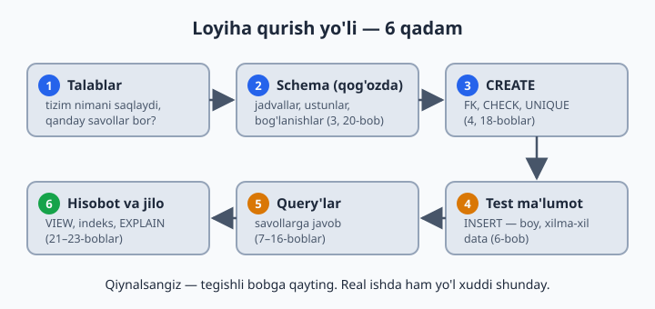
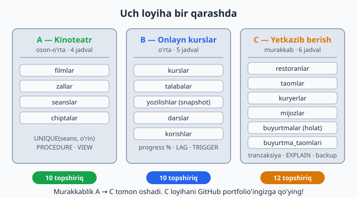
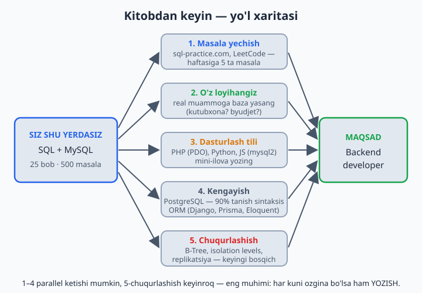

# 28 — Yakuniy loyihalar

[⬅️ Oldingi: 27 — Xavfsizlik va administratsiya](./27-xavfsizlik-admin.md) · [🏠 README](./README.md)

> **Bu bobda:** kitob davomida o'rganganlarimizning hammasini jamlab, 3 ta to'liq tizimni noldan quramiz — kinoteatr, onlayn kurslar platformasi va yetkazib berish xizmati. Har birida yo'l bir xil: talablar → schema → CREATE → test ma'lumot → query'lar → hisobotlar. Oxirida kitobdan keyingi yo'l xaritasi va 28-bob masalalari — intervyuga tayyorgarlik uchun 20 ta klassik savol bor.

---

Bilim sinovdan o'tadi. 3 ta loyiha — har biri "noldan oxirigacha". Hech qayerdan ko'chirmang, o'zingiz yozing. Qiynalsangiz — tegishli bobga qayting: bu mag'lubiyat emas, aynan shunday o'rganiladi. Bu bobda ataylab tayyor kod yo'q — kitob davomida ko'chirib yozdingiz, endi o'zingiz yaratasiz.

## Loyihani qanday qurish kerak — 6 qadam

Uchala loyihada ham ish tartibi bir xil. Real ishda ham xuddi shunday:

1. **Talablar.** Tizim nimani saqlashi va qanday savollarga javob berishi kerak? Bir varaq qog'ozga yozib chiqing.
2. **Schema — avval qog'ozda.** Jadvallar, ustunlar, bog'lanishlar (1:N, N:M) — chizing (3 va 20-boblar). Klaviaturaga shoshilmang: qog'ozdagi xato 1 daqiqada tuzatiladi, to'la bazadagi xato — bir soatda.
3. **CREATE.** Jadvallarni FK, CHECK, UNIQUE bilan yarating (4 va 18-boblar). Tartib muhim: avval "ota" jadvallar, keyin ularga FK bilan bog'lanadigan "bola"lar.
4. **Test ma'lumot.** INSERT bilan boy va xilma-xil data kiriting (6-bob). NULL'lar, bekor qilingan buyurtmalar, sotuvsiz filmlar ham bo'lsin — "ideal" data hech narsani sinamaydi.
5. **Query'lar.** Topshiriqlardagi savollarga javob yozing (7–16-boblar). GROUP BY'da SELECT'ga faqat guruhlangan ustunlar va aggregate'lar yozilishini unutmang — MySQL 8 buni qattiq tekshiradi (ONLY_FULL_GROUP_BY, 11-bob).
6. **Hisobot va jilo.** VIEW, PROCEDURE, TRIGGER, indeks va EXPLAIN (21–26-boblar) — loyihani "mahsulot" darajasiga ko'taring.

📌 Schema tavsiflarida ustun nomlari apostrofsiz yozilgan (`o'rin` emas, `orin_raqami`) — SQL identifikatorlarida apostrof ishlatilmaydi, jadval yaratganingizda siz ham shunday yozing.

Uchala loyiha bir qarashda — jadvallar soni va murakkablik A dan C tomon o'sib boradi:

## LOYIHA A: Kinoteatr (oson-o'rta)

Tanish mavzu, 4 jadval — qizishish uchun ideal. Asosiy "tuz" — bitta o'rin ikki marta sotilmasligini bazaning o'zi kafolatlashi.

**Schema (o'zingiz yarating):** filmlar (nomi, janr, davomiyligi, yil), zallar (nomi, sigimi), seanslar (film, zal, vaqt, narx), chiptalar (seans, orin_raqami, mijoz_ism, sotilgan_vaqt).

**Topshiriqlar:**

1. 4 jadvalni FK'lar bilan yarating (chiptada seans+o'rin UNIQUE bo'lsin — bir o'rin ikki marta sotilmasin!)
2. 5 film, 3 zal, 10 seans, 25 chipta kiriting
3. Bugungi seanslar afishasi: film + zal + vaqt + narx
4. Har film nechta chipta sotgan (sotuvsizlar 0 bilan)
5. Har seansning to'liqlik foizi: chiptalar / zal sig'imi * 100
6. Eng daromadli film (chiptalar narxidan)
7. Birorta ham seansi yo'q filmlar (anti-join)
8. Chipta sotish PROCEDURE'i: o'rin bandligini tekshirib INSERT (band bo'lsa — hech narsa)
9. `v_afisha` view yarating
10. Har janr bo'yicha o'rtacha chipta narxi va jami daromad

💡 Maslahatlar: 4-topshiriq — LEFT JOIN + COUNT (12-bob); 5-da natijani ROUND bilan chiroyli qiling; 7 — anti-join qolipi (12-bob); 8-procedure ichida IF + EXISTS tekshiruvi bo'ladi (23-bob).

## LOYIHA B: Onlayn kurslar platformasi (o'rta)

Endi 5 jadval va eng muhim yangi tushuncha — talabaning **progressi**: ikki xil hisobning (ko'rilgan darslar va jami darslar) nisbati.

**Schema:** kurslar (nomi, narx, daraja), talabalar, yozilishlar (talaba, kurs, sana, tolangan_summa — snapshot, 20-bob!), darslar (kurs, nomi, tartib_raqami), korishlar (talaba, dars, sana).

**Topshiriqlar:**

1. Schema + FK + CHECK'lar (narx >= 0, tartib_raqami > 0)
2. Test data: 5 kurs, 10 talaba, 20 yozilish, 25 dars, 60+ ko'rish
3. Har kursning talabalari soni va jami tushumi
4. Har talabaning progressi: kursdagi ko'rgan darslari / jami darslar * 100 (eng qiyin query — JOIN + GROUP BY + subquery!)
5. Eng mashhur 3 kurs; birorta talabasi yo'q kurslar
6. Oxirgi 7 kunda faol bo'lgan (dars ko'rgan) talabalar
7. "Tashlab qo'yganlar": yozilgan, lekin 14+ kun dars ko'rmaganlar
8. Window: har kurs ichida talabalarni progress bo'yicha reytinglang
9. Oylik tushum + o'tgan oyga nisbatan o'sish (LAG)
10. Trigger: yangi ko'rish yozilganda yozilishlar jadvalidagi `oxirgi_faollik` ustuni yangilansin (ustunni o'zingiz qo'shing)

💡 4-topshiriqda ikki xil hisobni BITTA query'da aralashtirmang — alohida hisoblang-da, keyin birlashtiring: subquery (14-bob) yoki CTE (15-bob) bilan bo'laklang. 6 va 7 uchun sana funksiyalari (10-bob), 8–9 uchun window funksiyalar (16-bob) kerak bo'ladi.

## LOYIHA C: Yetkazib berish xizmati (murakkab — portfolio darajasi!)

6 jadval, tranzaksiya, indeks auditi va backup — bu loyihani tugatsangiz, GitHub'ga qo'yib intervyuda ko'rsatsa bo'ladi.

**Schema:** restoranlar, taomlar (restoran, nomi, narx), kuryerlar (ism, telefon, faolmi), mijozlar, buyurtmalar (mijoz, restoran, kuryer, holat: yangi→tayyorlanmoqda→yolda→yetkazildi/bekor, yaratilgan_vaqt, yetkazilgan_vaqt), buyurtma_taomlari (buyurtma, taom, soni, narx — snapshot).

**Topshiriqlar:**

1. To'liq schema: FK, CHECK, kerakli indekslar (qaysi ustunlarga — o'zingiz asoslang!)
2. Boy test data: 5 restoran, 25 taom, 6 kuryer, 10 mijoz, 30 buyurtma har xil holatda
3. Buyurtma tranzaksiyasi (procedure): buyurtma + taomlar + jami hisoblash — atomar
4. Har restoranning daromadi (faqat 'yetkazildi'lar), kamayish tartibida
5. Har kuryer: yetkazgan buyurtmalari, o'rtacha yetkazish vaqti (TIMESTAMPDIFF(MINUTE, yaratilgan, yetkazilgan))
6. Eng ko'p buyurtma qilingan 5 taom
7. Har mijozning LTV'si (jami xaridi) + birinchi va oxirgi buyurtma sanasi (window yoki MIN/MAX)
8. Soatlar bo'yicha buyurtmalar taqsimoti (HOUR + GROUP BY) — "qaysi soat eng gavjum?"
9. Kunlik tushum + yig'ilib boruvchi summa (running total) + 3 kunlik o'rtacha
10. `v_boshqaruv_paneli` view: bugungi buyurtmalar, tushum, faol kuryerlar, o'rtacha yetkazish vaqti — bitta view'da
11. EXPLAIN audit: 5 ta asosiy query'ngizni tekshirib, kerakli indekslarni isbot bilan qo'ying
12. To'liq backup + tiklash sinovi

💡 Maslahatlar: `holat` ustuni uchun ENUM mos keladi (5-bob); 3-topshiriqda START TRANSACTION + COMMIT/ROLLBACK (19-bob); 9-dagi 3 kunlik o'rtacha — window frame: `ROWS BETWEEN 2 PRECEDING AND CURRENT ROW` (16-bob); 12-da mysqldump (27-bob). `yetkazilgan_vaqt` faqat 'yetkazildi' holatida to'ladi — qolganlarida NULL bo'lishi tabiiy.

## Loyihalardan keyin — keyingi qadamlar

Kitob tugadi, lekin yo'l endi boshlanadi. Mana xarita:

1. **Masala yechish:** sql-practice.com (bepul, brauzerda), LeetCode Database bo'limi, HackerRank SQL — haftasiga 5 ta masala
2. **O'z loyihangiz:** atrofingizdagi real muammoga baza yasang (mahalla kutubxonasi? oilaviy byudjet?)
3. **Dasturlash tiliga ulash:** PHP (PDO), Python (mysql-connector) yoki JavaScript (mysql2) bilan bazaga ulanib, mini-ilova yozing — SQL bilimingiz "jonlanadi"
4. **Kengayish:** PostgreSQL bilan tanishing — sintaksisning 90 foizi sizga tanish bo'ladi; ORM nima ekanini ko'ring (Django ORM, Prisma, Eloquent) — lekin ORM ostida baribir SQL yotganini unutmang
5. **Chuqurlashish:** indekslarning B-Tree tuzilishi, isolation levels, replikatsiya — bular keyingi bosqich

## 28-bob masalalari (intervyuga tayyorgarlik — 20 ta klassik savol)

Bu bobning 20 masalasi — intervyu formatida. Har savolga avval o'zingiz **yozma** javob bering (og'zaki "bilaman" hisobga o'tmaydi!), keyin quyidagi jadval orqali tegishli bobdan tekshiring:

1. PRIMARY KEY va UNIQUE farqi? (PK — bitta, NULL yo'q; UNIQUE — ko'p bo'lishi mumkin, NULL mumkin)
2. INNER JOIN va LEFT JOIN farqi?
3. WHERE va HAVING farqi?
4. `COUNT(*)` va `COUNT(ustun)` farqi?
5. NULL bilan `=` nega ishlamaydi?
6. DELETE, TRUNCATE, DROP farqlari?
7. Indeks nima, qachon ishlamaydi?
8. Kompozit indeksning "chap qism" qoidasi?
9. Tranzaksiya nima? ACID?
10. SQL Injection nima, qanday himoyalanasiz?
11. Normalizatsiya nima? 3 ta anomaliya?
12. N:M bog'lanish qanday quriladi?
13. Subquery va JOIN — qachon qaysi?
14. GROUP BY'da SELECT'ga qanday ustunlar yozish mumkin?
15. Har guruhdagi eng katta yozuvni qanday topasiz? (window: PARTITION + ROW_NUMBER)
16. View nima, ma'lumot saqlaydimi?
17. EXPLAIN'da type=ALL nimani anglatadi?
18. Soft delete nima, nega kerak?
19. FOR UPDATE qachon kerak? (parallel yozishda race condition)
20. Katta OFFSET nega sekin, yechimi? (keyset pagination)

Hammasiga bu kitobda javob bor — bilmaganingizga duch kelsangiz, tegishli bobga qayting:

| Savol | Bob | Savol | Bob |
|---|---|---|---|
| 1 | 04, 18 | 11, 12 | 20 |
| 2 | 12 | 13 | 14 |
| 3, 4, 14 | 11 | 15 | 16 |
| 5 | 08 | 16 | 22 |
| 6, 18 | 17 | 17 | 23 |
| 7, 8 | 21 | 19 | 19 |
| 9 | 19 | 20 | 23 |
| 10 | 24 | | |

💡 Intervyuda "yodlab kelgan ta'rif"dan ko'ra kichik misol kuchliroq ta'sir qiladi: "NULL bilan `=` ishlamaydi, chunki NULL — noma'lum; `WHERE telefon = NULL` hech narsa qaytarmaydi, `IS NULL` kerak" — mana shunday javob bering.

---

## So'nggi so'z

Siz 28 bob va 560 ta masalani bosib o'tdingiz. Endi siz:

- Noldan baza loyihalay olasiz
- Istalgan murakkablikdagi query yoza olasiz
- Sekin query'ni topib, davolay olasiz
- Ma'lumotni xavfsiz saqlay olasiz

SQL 1970-yillarda tug'ilgan — 50 yildan beri asosi o'zgargani yo'q va yana o'nlab yillar xizmat qiladi. Framework'lar keladi-ketadi, SQL qoladi.

**Eng katta sirni oxirida aytaman:** bu kitobdagi eng kuchli o'quvchi — masalalarning hammasini YOZGAN o'quvchi. O'qigan emas. Yozgan. Omad! 🚀
