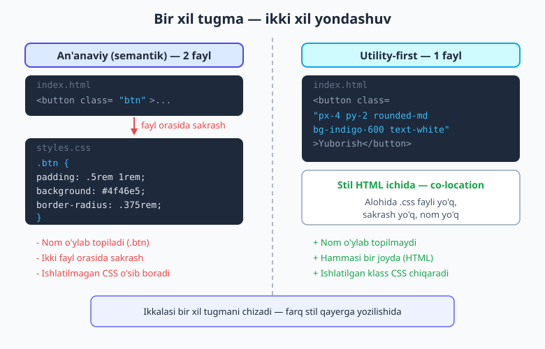
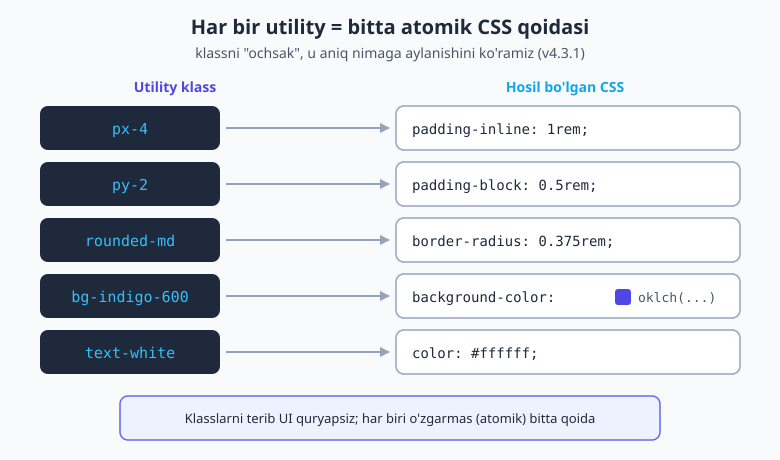
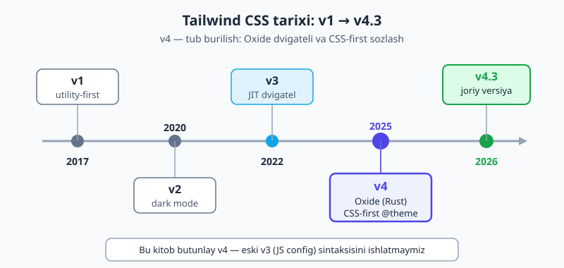

# 01 — Tailwind nima va nega?

[🏠 README](./README.md) · [Keyingi: 02 — O'rnatish va birinchi qadamlar ➡️](./02-ornatish-birinchi-qadam.md)

> **Bu bobda:** an'anaviy CSS katta loyihada nega og'irlashishini ko'ramiz — nom o'ylab topish azobi, hech qachon o'chmaydigan "o'lik" CSS, fayllar orasida sakrab yurish. Keyin Tailwind'ning utility-first falsafasi bu muammolarni qanday hal qilishini, "bu inline stilning o'zi-ku" degan e'tirozga javobni, Bootstrap'dan farqini va v1 → v4 qisqa tarixini o'rganamiz. Bu butun kitobning poydevori.

---

## 1.1 Avval bir og'riqni eslaylik

Siz HTML va CSS'ni bilasiz (bilmasangiz, avval [HTML & CSS kitobini](../html-css/README.md) o'qing — Tailwind CSS o'rnini bosmaydi, CSS ustiga yoziladi). Bitta tugma yoki bitta sahifa uchun an'anaviy CSS ajoyib ishlaydi. Lekin loyiha o'sgan sari — yuzlab komponent, o'nlab sahifa paydo bo'lganda — CSS sekin-asta og'irlashib boradi. Keling, bu og'riqni nomma-nom ataylik. Ularning har biri Tailwind nima uchun yaratilganini tushuntiradi.

**1. Nom o'ylab topish azobi.** CSS yozish uchun avval har bir narsaga *nom* berishingiz kerak: `.card`, `.card-header`, `.card__inner-wrapper`, `.card__inner-wrapper--active`. Bu nom hech narsa "qilmaydi" — u shunchaki HTML bilan CSS o'rtasidagi ko'prik. Kompyuter fanidagi mashhur hazil bor: *"Eng qiyin ikki narsa — keshni eksiz qilish va narsalarga nom berish."* Siz haqiqiy ishni qilishdan oldin `inner-wrapper` ni `content-box` deb atashni yoki yo'qligini hal qilib o'tirasiz.

📌 **Atama:** **semantik klass** — ma'noga ishora qiluvchi nom (masalan `.card`, `.alert`). U "bu narsa nima" ni aytadi, lekin "u qanday ko'rinadi" ni emas. Hozircha biz odatdagi CSS uslubini "semantik" yoki "an'anaviy" deb ataymiz.

**2. O'lik CSS hech qachon o'chmaydi.** Loyiha kattalashganda hech kim eski stillarni o'chirishga jur'at etmaydi. `.card__inner-wrapper` klassi hali kerakmi yoki yo'qmi — kim biladi? O'chirsangiz, qaysidir sahifa buzilishi mumkin. Shuning uchun hech kim teginmaydi. Natijada CSS fayli yildan-yilga **faqat o'sadi**, hech qachon kichraymaydi. Bu — *o'lik kod* (dead code).

**3. Ikki fayl orasida doimiy sakrash.** Tugmaning rangini o'zgartirmoqchimisiz? `index.html` da klass nomini topasiz, keyin `styles.css` ga o'tib o'sha klassni qidirasiz, o'zgartirasiz, brauzerga qaytasiz. Miyangiz doim ikki fayl, ikki "til" orasida kontekstni almashtiradi (context-switching). Bu charchatadi va sekinlashtiradi.

**4. Umumiy faylga teginishdan qo'rqish.** `styles.css` — butun sayt uchun bitta umumiy joy. Bitta klassni o'zgartirsangiz, u **boshqa** sahifadagi elementga ham tegishi mumkin (CSS'da hamma narsa global — buni [CSS arxitekturasi bobida](../html-css/20-arxitektura-uslublar.md) ko'rgansiz). Shuning uchun dasturchilar eski stilni tuzatish o'rniga, ustiga *yangi* stil qo'shadi — "tegmaganim ma'qul". Fayl yana o'sadi.

> **Eslatma.** Bu muammolar CSS *yomon* degani emas. CSS — kuchli til. Lekin u 1996-yilda kichik hujjatlarni bezash uchun o'ylab topilgan; bugungi minglab komponentli ilovalar uchun emas. Tailwind aynan shu masshtab muammosiga javob.

---

## 1.2 Tailwind nima? — utility-first ta'rifi

**Tailwind CSS** — bu *utility-first* (utility-birinchi) CSS freymvorki. Bu nimani anglatadi?

📌 **Atama:** **utility klass** — bitta kichik, aniq ish bajaradigan tayyor klass. Masalan `px-4` faqat gorizontal padding qo'yadi, `bg-indigo-600` faqat fon rangini beradi. Har bir utility — bitta o'zgarmas (atomik) CSS qoidasi. "Atomik" deganda *bo'linmas, eng kichik bo'lak* nazarda tutiladi.

"Utility-first" degani: siz yangi CSS yozish o'rniga, HTML elementiga **bir nechta tayyor utility klassni terib chiqasiz**, va shu klasslar birgalikda kerakli ko'rinishni hosil qiladi. Nom o'ylab topmaysiz, alohida CSS fayli yozmaysiz.

Bitta misol — bir xil tugmani ikki uslubda yozaylik.

**An'anaviy (semantik) usul** — HTML'da nom, CSS'da ta'rif:

```html
<!-- index.html -->
<button class="btn">Yuborish</button>
```

```css
/* styles.css */
.btn {
  padding: 0.5rem 1rem;
  border-radius: 0.375rem;
  background: #4f46e5;
  color: #fff;
}
```

**Tailwind (utility-first) usul** — hammasi HTML'da:

```html
<button class="px-4 py-2 rounded-md bg-indigo-600 text-white">Yuborish</button>
```

Ikkalasi ham **aynan bir xil** tugmani chizadi. Farq — stil qayerga yozilishida va siz qancha qaror qabul qilishingizda. Tailwind usulida alohida `.css` fayl yo'q, `.btn` nomi yo'q, fayl orasida sakrash yo'q.



Har bir utility klass aniq nimaga aylanadi? Mana shu tugmadagi klasslarning haqiqiy CSS'ga "ochilishi" (v4.3.1 bilan jonli tekshirilgan):

```css
/* px-4   → */ padding-inline: calc(var(--spacing) * 4);   /* = 1rem (chap+o'ng) */
/* py-2   → */ padding-block:  calc(var(--spacing) * 2);   /* = 0.5rem (yuqori+past) */
/* rounded-md → */ border-radius: var(--radius-md);        /* = 0.375rem */
/* bg-indigo-600 → */ background-color: var(--color-indigo-600); /* oklch(...) */
/* text-white → */ color: var(--color-white);
```



> **Eslatma.** `--spacing`, `--radius-md`, `--color-indigo-600` — bular Tailwind o'rnatadigan **design token**lar (dizayn o'zgaruvchilari). Asosiy `--spacing` qiymati `0.25rem` (ya'ni 4px). `px-4` esa `4 × 0.25rem = 1rem` beradi. Ya'ni `px-4` dagi "4" — piksel emas, balki *scale qadami*. Bu nega muhimligini 1.3-bo'limda ko'ramiz.

---

## 1.3 Uchta asosiy foyda — "nega"si bilan

Tailwind'ning kuchini tushunish uchun "qanday" emas, "nega" deb so'rash kerak. Uchta tub foyda bor.

### Foyda 1 — siz endi nom o'ylab topmaysiz

Eng katta yengillik shu: `px-4`, `bg-indigo-600` — bular allaqachon mavjud nomlar. Siz `.card__inner-wrapper` nima deb atashini hal qilmaysiz. Klasslar *ko'rinishni* tavsiflaydi, *ma'noni* emas — shuning uchun har gal yangi nom ixtiro qilish kerak emas.

💡 **Hayotiy analogiya:** an'anaviy CSS — har bir kiyimga o'zingiz teglab, "bayram ko'ylagi", "ish shimi" deb nomlab yurishingizdek. Tailwind — kiyimni to'g'ridan-to'g'ri standart o'lcham (M, L) va rang bilan olib kiyish: nom o'ylab o'tirmaysiz, faqat kerakli bo'laklarni tanlaysiz.

### Foyda 2 — HTML'dan chiqmaysiz

Ko'rinishni o'zgartirish uchun aynan o'sha elementning klassini tahrir qilasiz — boshqa faylga o'tmaysiz, klass nomini qidirmaysiz. Ko'z qaerga qarab tursa, stil o'sha yerda. Bu — **co-location** (bir joyda joylashtirish): tarkib (HTML) va uning ko'rinishi (utility) yonma-yon turadi.

Bu shuningdek qo'rquvni yo'qotadi. Bitta tugmaning klassini o'zgartirsangiz, faqat **shu** tugma o'zgaradi — global `styles.css` ga teginmaganingiz uchun boshqa sahifa buzilmaydi. "Bu o'zgarish yana qayerga ta'sir qiladi?" degan vahima yo'q.

### Foyda 3 — stil cheklangan dizayn tizimi ichida qoladi

Bu — eng nozik, lekin eng qimmatli foyda. Oddiy CSS'da har kim ixtiyoriy qiymat yozadi: kimdir `padding: 13px`, boshqasi `padding: 15px`, uchinchisi `padding: 16px`. Sayt sezilmas darajada notekis bo'ladi.

Tailwind'da esa `p-3` (12px), `p-4` (16px), `p-5` (20px) bor — oraliq qadam yo'q. Klasslar oldindan belgilangan **scale** (shkala) dan keladi: spacing, ranglar, shrift o'lchamlari — hammasi cheklangan. Natijada butun jamoa bir xil "lug'at"dan foydalanadi va UI tabiiy ravishda izchil (consistent) chiqadi. Siz qaror qabul qilmaysiz — tizim siz uchun qabul qilgan.

> **Maslahat.** Cheklov bu yerda — *do'st*. Tanlov qancha kam bo'lsa, qarshingizdagi sahifalar shuncha bir xil va professional ko'rinadi. Aynan shu sabab Tailwind'ni "siz boshqaradigan dizayn tizimi" deyishadi.

### Bonus — o'lik CSS muammosi yo'qoladi

Tailwind faqat siz HTML'da *haqiqatan ishlatgan* klasslar uchun CSS chiqaradi. Ishlatilmagan utility umuman generatsiya qilinmaydi. Klassni HTML'dan o'chirsangiz — unga mos CSS keyingi build'da o'z-o'zidan yo'qoladi. "Bu stil hali kerakmi?" degan savol o'rtaga chiqmaydi: kerak bo'lmasa, u allaqachon yo'q. O'sib boruvchi, hech qachon o'chmaydigan CSS fayli muammosi tugaydi.

> **Diqqat.** Bu Tailwind'ning butun CSS kutubxonasini yuklab, keyin keraksizini "tozalashi" (purge) degani emas — bu eski v3 modeli. v4 da dvigatel kodingizni avtomatik skanlaydi va faqat topilgan klasslar uchun CSS yozadi. Hech narsa "tozalanmaydi", chunki ortiqcha narsa boshidanoq yaratilmaydi.

---

## 1.4 "Lekin bu..." — halol e'tirozlar va javoblar

Tailwind'ni birinchi ko'rgan har bir dasturchining xayolidan o'tadigan e'tirozlar bor. Ularni yashirmaymiz — har biriga halol javob beramiz.

### "HTML juda chuvalgan / xunuk ko'rinadi"

To'g'ri, `class="px-4 py-2 rounded-md bg-indigo-600 text-white hover:bg-indigo-700"` birinchi qarashda uzun. Lekin ikki javob bor:

1. **Takrorlanishni komponent hal qiladi.** Siz o'sha tugmani 50 marta yozmaysiz. React, Vue yoki shablon (loop) bilan uni **bir marta** `<Button>` komponenti qilib o'rab, qayta-qayta ishlatasiz. Uzun klass qatori bitta joyda yashaydi. Buni 22-bobda batafsil ko'ramiz.
2. **O'qish — odat masalasi.** Boshda chalkash tuyuladi, lekin bir hafta ichida `px-4` ni xuddi `padding` so'zidek o'qiy boshlaysiz. Buning evaziga siz "bu klass aslida nima qiladi?" deb boshqa faylga o'tishdan qutulasiz — ko'rinish HTML'ning o'zida.

### "Bu shunchaki inline stilning o'zi-ku!"

**Yo'q.** Bu eng keng tarqalgan adashish. `style="padding: 16px"` (inline stil) bilan `class="p-4"` (utility) o'rtasida tub farqlar bor:

| | Inline stil (`style="..."`) | Utility klass (`p-4`) |
|---|---|---|
| `hover:` / `focus:` holatlari | Imkonsiz | Bor (`hover:bg-indigo-700`) |
| Responsive (`md:`, `lg:`) | Imkonsiz | Bor (`md:px-6`) |
| Dark mode (`dark:`) | Imkonsiz | Bor (`dark:bg-slate-800`) |
| Dizayn cheklovi (scale) | Yo'q — ixtiyoriy qiymat | Bor — faqat scale qadamlari |
| Specificity urushi | Bor (inline juda kuchli) | Yo'q — hammasi tekis |

Inline stil bilan siz `:hover` da rangni o'zgartira **olmaysiz** — buning uchun CSS kerak. Tailwind esa `hover:bg-indigo-700` ni haqiqiy CSS qoidasiga aylantiradi. Mana isboti (v4.3.1 chiqargan CSS):

```css
.hover\:bg-indigo-700 {
  &:hover {
    @media (hover: hover) {
      background-color: var(--color-indigo-700);
    }
  }
}
.md\:px-6 {
  @media (width >= 48rem) {   /* 768px va undan keng ekranlar */
    padding-inline: calc(var(--spacing) * 6);
  }
}
```

Inline stil bunday `@media` yoki `:hover` ni umuman yoza olmaydi. Utility — bu **CSS qoidalarining qisqartmasi**, inline stil emas.

### "Tarkib va ko'rinishni ajratish (separation of concerns) tamoyili-chi?"

Klassik tamoyil aytadi: HTML (tarkib) bir faylda, CSS (ko'rinish) boshqa faylda turishi kerak. Tailwind buni "buzayotgandek" tuyuladi.

Javob: zamonaviy front-end'da bu ajratish **fayl darajasida emas, komponent darajasida** sodir bo'ladi. Bitta `<Button>` komponenti o'z tarkibi, ko'rinishi va xulqini bir joyda saqlaydi — chunki ular doim **birga o'zgaradi**. Tugmaning paddingini o'zgartirsangiz, deyarli har doim aynan o'sha tugma ustida ishlayotgan bo'lasiz. Ularni ikki faylga bo'lish ko'pincha *sun'iy* ajratish — bog'liq narsalarni uzoqlashtiradi. Tailwind ularni tabiiy ravishda yaqin tutadi.

---

## 1.5 Tailwind vs Bootstrap — qisqa farq

Ko'pchilik "Bootstrap'ni bilaman, Tailwind ham shunaqami?" deb so'raydi. Yo'q — ular **boshqa darajada** ishlaydi.

**Bootstrap (komponent freymvork)** — tayyor, balandlikdagi komponentlar beradi: `.card`, `.navbar`, `.btn-primary`. Siz ularni shartnoma bo'yicha ulaysiz. Tez, lekin ikki narxi bor: (1) saytlar bir-biriga **o'xshab** qoladi — "bu Bootstrap sayti" deb darrov bilinadi; (2) tayyor komponentni chuqur o'zgartirish qiyin — uning stillariga qarshi kurashasiz.

**Tailwind (utility freymvork)** — past darajadagi qurilish bo'laklari beradi: `flex`, `px-4`, `rounded-md`. Tayyor `.card` yo'q — siz uni shu bo'laklardan **o'zingiz** quryasiz. Sekinroq boshlanadi, lekin dizayn ustidan to'liq nazorat sizda: hech narsaga qarshi kurashmaysiz, chunki hech qanday tayyor stil yo'q.

> **Maslahat.** Soddalashtirilgan tasavvur: Bootstrap — tayyor mebel do'koni (tez, lekin hammada bir xil divan). Tailwind — sifatli yog'och va asbob to'plami (o'zingizga aynan mos mebel yasaysiz). Tailwind ekotizimida ham tayyor komponentlar bor (masalan daisyUI), lekin asos — quyi darajadagi utility'lar.

---

## 1.6 Qisqa tarix: v1 dan v4 gacha

Tailwind nega bugungidek ko'rinishini tushunish uchun uning yo'lini bilish foydali.



- **v1 (2017)** — Adam Wathan utility-first g'oyasini ommaga olib chiqdi. Ko'pchilik "bu jinnilik" dedi; bir qismi sevib qoldi.
- **v2 (2020)** — dark mode, kengaytirilgan rang palitrasi, yangi imkoniyatlar.
- **v3 (2022)** — **JIT** (Just-In-Time) dvigateli. Endi har qanday qiymatni "o'sha zahoti" generatsiya qilardi; build tezlashdi, ixtiyoriy qiymatlar (`top-[117px]`) paydo bo'ldi. Sozlash hali ham JavaScript faylida (`tailwind.config.js`) edi.
- **v4 (2025-yil yanvar)** — tub burilish. Yangi **Oxide** dvigateli (Rust'da yozilgan, ~5 barobar tez build) va **CSS-first** sozlash. Endi sozlash JavaScript'da emas, to'g'ridan-to'g'ri CSS'da (`@theme`). Import bitta qator: `@import "tailwindcss";`. Content-detection avtomatik.
- **v4.3 (2026)** — bu kitob yozilayotgan paytdagi joriy turg'un versiya. v4.1 `text-shadow-*` va `mask-*` qo'shgan edi; ekotizim barqaror.

📌 **Atama:** **dvigatel (engine)** — Tailwind'ning yuragi: u sizning HTML/JS fayllaringizni skanlaydi, qaysi klasslar ishlatilganini topadi va mos CSS'ni yozadi.

> **Diqqat — bu kitob butunlay v4.** Internetdagi eski darslarning aksariyati hali v3 (`tailwind.config.js`, `@tailwind base/components/utilities`) haqida. Bu kitobda siz **faqat v4** sintaksisini ko'rasiz: `@import "tailwindcss";`, `@theme { ... }`, `@utility`. Eski sintaksisni faqat tarixiy izoh sifatida eslatamiz. Agar boshqa joyda `@tailwind base;` ko'rsangiz — bu eskirgan v3.

### Nega aynan v4 muhim?

v4 Tailwind'ni "JavaScript bog'liqligi"dan ozod qildi. Endi sozlash CSS'ning o'zida — ya'ni brauzer platformasiga yaqinroq, OKLCH ranglar va container queries kabi zamonaviy imkoniyatlarga tabiiy tayanadi. Build tezroq, sozlash soddaroq, til nativroq. Aynan shu sabab bugun yangi loyiha boshlasangiz, v4 ni o'rganish — to'g'ri tanlov.

---

## 1.7 Tailwind qachon kerak, qachon ortiqcha?

Hamma narsa kabi, Tailwind ham har joyga mos kelmaydi. (To'liq muhokama — 25-bobda; bu yerda faqat tasavvur uchun.)

**Tailwind a'lo darajada to'g'ri keladi:**

- Doimiy o'sib boruvchi **ilovalar** (dashboard, SaaS, web-app);
- O'z **dizayn tizimi** quriladigan loyihalar (izchillik kerak);
- **Jamoa** ishi — hamma bir xil "lug'at"da yozadi, kelishuv osonlashadi.

**Tailwind ortiqcha bo'lishi mumkin:**

- Bitta-ikkita statik sahifa, bir martalik kichik landing — bunda oddiy CSS yoki tayyor freymvork tezroq bo'lishi mumkin (build sozlash, npm o'rnatish ortiqcha yuk).

> **Eslatma.** "Ortiqcha" degani "yomon" emas. Shunchaki kichik ish uchun katta asbob ko'tarish shartmas. Lekin loyiha o'sish ehtimoli bo'lsa, Tailwind'ni boshidan tanlash keyin pushaymon bo'lmaslikning yo'li.

---

## 1.8 Kitob nima quradi — oldindan xarita

Bu kitob bo'ylab siz quyidagilarni bosqichma-bosqich o'rganasiz va quryasiz:

1. **Asoslar** — o'rnatish (Vite, CLI, PostCSS), utility-first ish jarayoni, spacing va o'lcham tizimi.
2. **Layout** — flexbox, grid, positioning, responsive dizayn va v4 yadrosidagi container queries.
3. **Ko'rinish** — ranglar (OKLCH), tipografiya, fon/gradient/chegara, soya va filter.
4. **Interaktivlik** — holat variantlari (`hover:`, `group`, `has-*`), dark mode, transition va animatsiya.
5. **Sozlash (v4 CSS-first)** — `@theme` bilan o'z dizayn tizimingiz, `@utility` bilan custom utility, plaginlar.
6. **Komponentlar va amaliyot** — React/Vue integratsiyasi, tayyor UI komponentlar, production optimizatsiya, best practices.
7. **Kapston** — o'rgangan hamma narsani birlashtirib, to'liq responsive, dark-mode'li, hammabop (accessible) ilovani noldan quramiz.

Keyingi bobda muhitni o'rnatamiz va birinchi marta `@import "tailwindcss";` ni jonli ishga tushiramiz.

---

## Mashqlar

Quyidagi mashqlarni avval o'zingiz yeching, keyin yechimni oching.

### Mashq 1 — Semantikdan utility'ga

Quyidagi an'anaviy CSS va HTML'ni Tailwind utility klasslariga aylantiring. (Maslahat: bobdagi tugma misoliga qarang. `background: #4f46e5` ≈ `bg-indigo-600`.)

```html
<a class="link">Batafsil</a>
```

```css
.link {
  padding: 0.5rem 1rem;     /* yuqori/past 0.5rem, chap/o'ng 1rem */
  border-radius: 0.375rem;
  background: #4f46e5;
  color: white;
}
```

<details markdown="1"><summary>Yechim — 1</summary>

```html
<a class="px-4 py-2 rounded-md bg-indigo-600 text-white">Batafsil</a>
```

Eslatma: `px-4` = chap+o'ng `1rem`, `py-2` = yuqori+past `0.5rem`, `rounded-md` = `0.375rem`. Alohida `.css` fayl ham, `.link` nomi ham kerak emas — stil to'g'ridan-to'g'ri elementda.

</details>

### Mashq 2 — Inline stil emas: nega?

Do'stingiz: "`class="p-4"` bilan `style="padding:16px"` bir xil narsa, Tailwind bekorga shovqin solyapti" deydi. Unga ikkita aniq misol bilan javob bering — utility qila oladigan, lekin inline stil **qila olmaydigan** ikki narsani ayting.

<details markdown="1"><summary>Yechim — 2</summary>

Inline stil quyidagilarni **qila olmaydi**, utility esa qiladi:

1. **Holat variantlari** — `hover:bg-indigo-700` sichqoncha ustiga kelganda rangni o'zgartiradi. `style=""` da `:hover` yozib bo'lmaydi.
2. **Responsive variantlar** — `md:px-6` faqat 768px dan keng ekranda padding'ni oshiradi (`@media` orqali). Inline stilda `@media` yozib bo'lmaydi.

Qo'shimcha: utility scale'dan keladi (dizayn izchilligi) va specificity urushi yo'q. Demak utility — CSS qoidalarining qisqartmasi, inline stil emas.

</details>

### Mashq 3 — Uchta foydani nomlash

Bobda Tailwind'ning uchta tub foydasi sanaldi. Ularni o'z so'zlaringiz bilan, har biri uchun "nega" bilan ayting.

<details markdown="1"><summary>Yechim — 3</summary>

1. **Nom o'ylab topmaysiz** — `px-4`, `bg-indigo-600` allaqachon mavjud; `.card__inner-wrapper` ixtiro qilish azobi yo'q.
2. **HTML'dan chiqmaysiz** — ko'rinish elementning o'zida (co-location); fayl orasida sakrash va umumiy faylga teginish qo'rquvi yo'q.
3. **Stil cheklangan tizim ichida** — klasslar oldindan belgilangan scale'dan (spacing, rang) keladi, shuning uchun UI tabiiy izchil chiqadi; siz emas, tizim qaror qabul qiladi.

Bonus: o'lik CSS yo'qoladi — ishlatilmagan utility umuman generatsiya qilinmaydi.

</details>

### Mashq 4 — Tailwind yoki Bootstrap?

Quyidagi ikki holatda qaysi birini tanlardingiz va nega?

a) Mijoz brendi uchun butunlay noyob, hech qaysi saytga o'xshamaydigan dizayn kerak.
b) Bir kunda ichki admin-panel prototipi kerak, ko'rinishi muhim emas, faqat ishlasin.

<details markdown="1"><summary>Yechim — 4</summary>

a) **Tailwind** — past darajadagi utility'lar dizayn ustidan to'liq nazorat beradi; tayyor komponentlarning "bir xil ko'rinishi"ga bog'lanmaysiz.

b) **Bootstrap** (yoki boshqa komponent freymvork) — tayyor `.card`, `.navbar`, `.btn` bilan prototip eng tez chiqadi; noyoblik shart bo'lmagani uchun Tailwind'da har bo'lakni qo'lda qurish ortiqcha mehnat bo'lardi.

Asosiy g'oya: Tailwind = nazorat va noyoblik; Bootstrap = tezlik va tayyorlik.

</details>

### Mashq 5 — Versiyani aniqlash

Internetdan topilgan ikki kod parchasi. Qaysi biri eski v3, qaysi biri v4? Nimadan bildingiz?

```css
/* A */
@tailwind base;
@tailwind components;
@tailwind utilities;
```

```css
/* B */
@import "tailwindcss";
```

<details markdown="1"><summary>Yechim — 5</summary>

- **A — eski v3.** Uch qatorli `@tailwind base/components/utilities` — v3 sintaksisi. Bu kitobda ishlatilmaydi.
- **B — v4.** Bitta qator `@import "tailwindcss";` — v4 ning yangi, CSS-native importi.

Qo'shimcha belgi: agar loyihada `tailwind.config.js` JS faylida sozlash bo'lsa — bu v3 uslubi; v4 da sozlash CSS'da `@theme { ... }` ichida bo'ladi.

</details>

### Mashq 6 — "Chuvalgan HTML" e'tiroziga javob

Tajribali dasturchi: "Tailwind HTML'ni o'qib bo'lmas qiladi — har elementda 10 ta klass" deydi. Kitobdagi g'oyalarga tayanib, ikkita javob bering.

<details markdown="1"><summary>Yechim — 6</summary>

1. **Takrorlanish komponentga yig'iladi** — uzun klass qatorini har joyda yozmaysiz; uni bir marta komponent (`<Button>`) yoki shablon loop ichiga olib, qayta ishlatasiz. Uzun qator bitta joyda yashaydi (22-bob).
2. **O'qish — odat** — bir necha kun ichida `px-4` ni `padding` so'zidek o'qiy boshlaysiz; evaziga "bu klass nima qiladi?" deb boshqa faylga o'tishdan qutulasiz (co-location).

Qo'shimcha: utility'lar IntelliSense va Prettier plagin bilan tartiblanadi, shuning uchun amalda HTML kutilganidan ancha boshqarib bo'ladigan bo'lib qoladi.

</details>

---

[🏠 README](./README.md) · [Keyingi: 02 — O'rnatish va birinchi qadamlar ➡️](./02-ornatish-birinchi-qadam.md)
