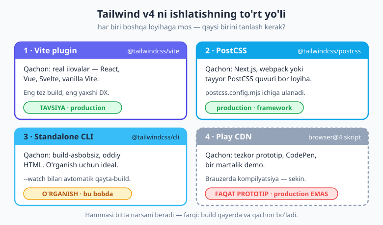
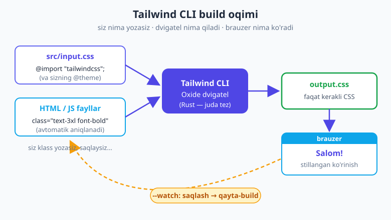
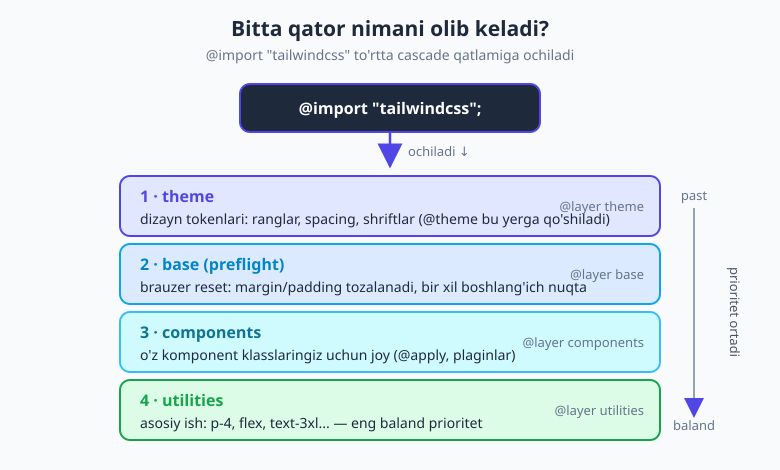

# 02 — O'rnatish va birinchi qadamlar

[⬅️ Oldingi: 01 — Tailwind nima va nega?](./01-tailwind-nima.md) · [🏠 README](./README.md) · [Keyingi: 03 — Utility-first ish jarayoni ➡️](./03-utility-first-ish-jarayoni.md)

> **Bu bobda:** Tailwind v4 ni kompyuteringizga o'rnatib, birinchi stillangan elementni brauzerda ishlatamiz. Avval Node.js bor-yo'qligini tekshiramiz. Keyin Tailwind'ni ishlatishning **to'rt yo'lini** (Vite plugin, PostCSS, Standalone CLI, Play CDN) va qaysi birini qachon tanlashni ko'rib chiqamiz. So'ng eng oddiy yo'l — **CLI** — orqali noldan to'liq loyiha quramiz: papka, `npm init`, `@import "tailwindcss"`, `--watch` va birinchi `text-3xl font-bold` sarlavha. Oxirida `@import "tailwindcss"` ichida nima borligini (cascade qatlamlari), avtomatik content-detection'ni va VS Code IntelliSense'ni o'rganamiz.

---

## Nega oldin "yo'l tanlash"?

01-bobda Tailwind **nima** ekanini bildik. Endi savol — uni qanday ishga tushirish? Bu yerda ko'p yangi o'rganuvchi adashadi: internetda turli darslar turli buyruqlar beradi, ba'zilari eskirgan, ba'zilari boshqa loyiha turi uchun. Natijada odam "nega menda ishlamadi?" deb hafsalasi pir bo'ladi.

Sirning kaliti shu: **Tailwind'ni o'rnatishning bitta yo'li yo'q — to'rt xil yo'l bor, va ularning har biri boshqa vaziyatga mo'ljallangan.** Hammasi oxir-oqibat bitta natijani beradi (sizning klasslaringizdan CSS chiqaradi), farqi faqat shunda: **o'sha CSS qayerda va qachon hosil bo'ladi.** Avval shu to'rt yo'lni xaritada ko'raylik, keyin eng soddasini amalda quramiz.



> 💡 **Bir narsani esda tuting.** Tailwind v4 — bu eski v3 emas. Buyruqlar, import qatori, sozlash — hammasi o'zgargan. Agar biror darsda `@tailwind base;` yoki `npx tailwindcss init` ko'rsangiz — bu **v3** darsi, e'tibor bermang. Bu kitob butunlay **v4** asosida (eng so'nggi turg'un versiya `v4.3`).

## Talab: Node.js va npm

To'rt yo'lning uchtasi (Vite, PostCSS, CLI) **Node.js**ga tayanadi. Node.js — JavaScript'ni terminalingizda ishga tushiradigan dastur; `npm` esa u bilan birga keladigan paket menejeri (boshqa odamlar yozgan kutubxonalarni yuklab oladi). Tailwind ham aynan shunday npm-paketi.

Avval bor-yo'qligini tekshiramiz. Terminalni oching (VS Code'da `Terminal → New Terminal`) va yozing:

```bash
node -v
npm -v
```

Agar quyidagiga o'xshash chiqsa — hammasi tayyor:

```text
v22.14.0
10.9.2
```

Agar `command not found` (yoki Windows'da `'node' is not recognized`) chiqsa — Node.js o'rnatilmagan. [nodejs.org](https://nodejs.org) saytidan **LTS** (Long-Term Support) versiyasini yuklab o'rnating, terminalni qayta oching va yana tekshiring. Tailwind v4 uchun Node 20 yoki undan yangi versiya kerak.

> **Eslatma.** Versiya raqamlari sizda boshqacha bo'lishi mumkin — muhimi `node -v` umuman ishlashi va raqam chiqarishi. Aniq raqamga emas, **chiqqaniga** qarang.

Matn muharriri sifatida **VS Code** ni tavsiya qilamiz — bepul, yengil va Tailwind uchun ajoyib qo'shimchasi bor (bu haqda bob oxirida). [code.visualstudio.com](https://code.visualstudio.com) dan oling.

## To'rt yo'l: qaysi birini qachon

### 1. Vite plugin — `@tailwindcss/vite`

Bu — **real ilovalar uchun tavsiya etilgan** yo'l. Agar siz React, Vue, Svelte yoki oddiy Vite loyihasida ishlasangiz — shuni tanlang. Vite — bu zamonaviy, juda tez "build tool" (loyihangizni yig'ib brauzerga uzatadigan dastur), va Tailwind'ning Vite plugini eng tez build'ni va eng yaxshi tajribani beradi.

To'liq o'rnatish quyidagicha:

```bash
npm create vite@latest mening-ilovam
cd mening-ilovam
npm install
npm install tailwindcss @tailwindcss/vite
```

Keyin `vite.config.js` (yoki `.ts`) faylga Tailwind plugini qo'shasiz:

```js
import { defineConfig } from 'vite'
import tailwindcss from '@tailwindcss/vite'

export default defineConfig({
  plugins: [
    tailwindcss(),
  ],
})
```

So'ng `src/style.css` faylini yaratib, ichiga bitta qator yozasiz:

```css
@import "tailwindcss";
```

Va bu faylni ilovangizning kirish nuqtasida (masalan `main.js` yoki `main.jsx`) import qilasiz:

```js
import './style.css'
```

`npm run dev` deysiz — tamom. Endi istalgan komponentda Tailwind klasslarini yozaversangiz bo'ladi.

> 💡 **Nega Vite tavsiya etiladi?** Chunki u zamonaviy frontend-loyihalarning standartiga aylangan, va Tailwind'ning Vite plugini build'ni eng samarali bog'laydi — siz fayl saqlaganingizda o'zgarish brauzerda deyarli darrov ko'rinadi (HMR — Hot Module Replacement).

### 2. PostCSS — `@tailwindcss/postcss`

Agar loyihangiz allaqachon **PostCSS** quvuriga tayansa — masalan **Next.js**, yoki webpack asosidagi eski loyiha — bu yo'lni tanlaysiz. PostCSS — bu CSS'ni qayta ishlovchi vosita; ko'p framework'lar uni ichkarida ishlatadi.

```bash
npm install tailwindcss @tailwindcss/postcss
```

Loyiha ildizida `postcss.config.mjs` faylini yaratib, Tailwind'ni plugin sifatida ulaysiz:

```js
export default {
  plugins: {
    '@tailwindcss/postcss': {},
  },
}
```

Va asosiy CSS faylingizga o'sha tanish qator:

```css
@import "tailwindcss";
```

> **Eslatma.** Vite va PostCSS o'rtasidagi tanlovni odatda **loyihangiz emas, balki siz tanlamaysiz** — uni framework'ingiz hal qiladi. Yangi Next.js loyihasida PostCSS yo'li tabiiy, sof Vite loyihasida esa Vite plugini. Ikkalasi ham production uchun mos.

### 3. Standalone CLI — `@tailwindcss/cli`

Bu — **hech qanday build-asbobsiz** ishlaydigan yo'l. Sizga faqat oddiy HTML va CSS kerak bo'lsa, yoki Tailwind'ni **endigina o'rganayotgan** bo'lsangiz — eng yaxshi tanlov shu. Hech qanday Vite, hech qanday framework — faqat Tailwind o'zi CSS'ingizni yig'ib beradi.

Aynan shu yo'ldan biz **keyingi bo'limda noldan to'liq loyiha** quramiz, chunki u eng kam "sehr" bilan ishlaydi va nima sodir bo'layotganini ko'z bilan ko'rasiz.

### 4. Play CDN — brauzer skripti

Bu — eng tezkor, lekin eng cheklangan yo'l. Hech narsa o'rnatmaysiz: HTML faylingizga bitta `<script>` qo'shasiz va Tailwind to'g'ridan-to'g'ri **brauzerda** ishlaydi.

```html
<script src="https://cdn.jsdelivr.net/npm/@tailwindcss/browser@4"></script>
```

Bu CodePen'da bir narsani tez sinab ko'rish, yoki do'stga "mana shunaqa qilsang bo'ladi" deb ko'rsatish uchun zo'r. Ammo:

> ⚠️ **Play CDN'ni hech qachon production'da ishlatmang.** Brauzer har sahifa ochilganda CSS'ni qaytadan kompilyatsiya qiladi — bu sekin, og'ir va foydalanuvchi internetiga yuk. U faqat **prototip va o'rganish demosи** uchun. Haqiqiy sayt uchun har doim build qiladigan yo'llardan birini (Vite/PostCSS/CLI) tanlang.

## To'liq amaliyot: CLI bilan noldan loyiha

Endi eng muhim qism — o'z qo'lingiz bilan birinchi Tailwind loyihasini quramiz. **CLI** yo'lini tanlaymiz, chunki u eng tushunarli: kirishda nima bor, chiqishda nima bor — hammasi ko'rinib turadi.

Quyidagi oqimni bosqichma-bosqich bajaramiz: papka yaratamiz → loyihani boshlaymiz → Tailwind o'rnatamiz → kirish CSS yozamiz → HTML yaratamiz → CLI'ni `--watch` bilan ishga tushiramiz → brauzerda ochamiz.



### 1-qadam — Papka va `npm init`

Yangi papka yaratib, ichiga kiramiz va loyihani boshlaymiz:

```bash
mkdir birinchi-tailwind
cd birinchi-tailwind
npm init -y
```

`npm init -y` buyrug'i `package.json` faylini yaratadi — bu loyihangizning "pasporti": qaysi paketlarga bog'liqligini shu yerda yozib boradi. `-y` flag'i hamma savolga "ha" deb javob beradi, shunda darrov tayyor bo'ladi.

### 2-qadam — Tailwind'ni o'rnatish

```bash
npm install tailwindcss @tailwindcss/cli
```

Bu ikkita paketni yuklaydi: `tailwindcss` — dvigatelning o'zi, `@tailwindcss/cli` — terminaldan ishga tushiradigan buyruq qatori vositasi. Endi `package.json` ichida `dependencies` ko'rinadi.

> 💡 **`npx tailwindcss init` kerakmi?** Yo'q! Bu **v3** buyrug'i edi va u `tailwind.config.js` yaratardi. v4'da config fayl shart emas — sozlash to'g'ridan-to'g'ri CSS ichida (`@theme`) bo'ladi (18-bobda). Agar biror joyda bu buyruqni ko'rsangiz, bilingki — eski dars.

### 3-qadam — Kirish CSS (`src/input.css`)

`src` papkasini yaratib, ichida `input.css` faylini oching va ichiga **faqat bitta qator** yozing:

```css
@import "tailwindcss";
```

Mana shu bitta qator butun Tailwind'ni olib keladi — barcha utility'lar, reset, theme. Ichida nima borligini bob oxirida ochib beramiz. Hozircha bilingki: **bu — boshlanish nuqtangiz.**

### 4-qadam — HTML fayl (`index.html`)

Loyiha ildizida `index.html` yaratamiz. E'tibor bering: u `<head>` ichida **`output.css`** ni ulaydi (kirishni emas — chiqishni!), chunki brauzer faqat tayyor CSS'ni tushunadi:

```html
<!DOCTYPE html>
<html lang="uz">
<head>
  <meta charset="UTF-8">
  <meta name="viewport" content="width=device-width, initial-scale=1.0">
  <title>Birinchi Tailwind</title>
  <link rel="stylesheet" href="./output.css">
</head>
<body>
  <h1 class="text-3xl font-bold text-indigo-600 underline">Salom!</h1>
</body>
</html>
```

### 5-qadam — CLI'ni `--watch` bilan ishga tushirish

Endi Tailwind'ga "kiruvchi CSS'ni o'qi, HTML'dagi klasslarni topib, chiquvchi CSS yarat va o'zgarishni kuzatib tur" deb buyramiz:

```bash
npx @tailwindcss/cli -i ./src/input.css -o ./output.css --watch
```

Buyruqni qismlarga ajratamiz:

- `-i ./src/input.css` — **input**: kirish CSS qayerda.
- `-o ./output.css` — **output**: tayyor CSS qayerga yozilsin.
- `--watch` — **kuzatish**: terminalni yopmaguningizcha ishlab turadi; siz biror faylni saqlasangiz, Tailwind avtomatik qayta-build qiladi.

Terminal ochiq qoldiradi va "Done" deb yozadi — endi `output.css` fayli paydo bo'ldi.

### 6-qadam — Brauzerda ochish

`index.html` faylini brauzerda oching (yoki VS Code'da **Live Server** qo'shimchasidan foydalaning). Sahifada katta, qalin, indigo rangli, ostiga chizilgan **Salom!** yozuvini ko'rasiz. Tabriklaymiz — bu sizning birinchi Tailwind elementingiz!

> **Eslatma.** `output.css` faylini hech qachon qo'lda tahrirlamang — uni Tailwind har build'da qaytadan yozadi, o'zgarishingiz yo'qoladi. Siz faqat `input.css` (sozlash uchun) va HTML/JS (klasslar uchun) bilan ishlaysiz.

### Har bir klassni tushunamiz

Endi `<h1>` dagi to'rtta klassni alohida ko'rib chiqamiz — chunki bu Tailwind'ning butun falsafasi:

| Klass | Nima qiladi | CSS ekvivalenti |
|---|---|---|
| `text-3xl` | matn o'lchamini kattalashtiradi | `font-size: 1.875rem; line-height: 2.25rem;` |
| `font-bold` | matnni qalin qiladi | `font-weight: 700;` |
| `text-indigo-600` | matn rangini indigo qiladi | `color: oklch(...)` (indigo-600) |
| `underline` | ostiga chiziq qo'shadi | `text-decoration-line: underline;` |

Ko'rib turibsiz: har bir klass — **bitta kichik, aniq CSS qoidasi**. Siz nom o'ylab topmaysiz, alohida CSS faylga sakramaysiz — to'g'ridan-to'g'ri HTML'da "katta, qalin, indigo, chiziqli" deb yig'ib qo'yasiz. Aynan shu — utility-first; uni 03-bobda chuqurroq ochamiz.

> 💡 **Sinab ko'ring.** `--watch` ishlab turganda `text-3xl` ni `text-5xl` ga o'zgartirib, faylni saqlang va brauzerni yangilang. Yozuv kattalashadi. `text-indigo-600` ni `text-red-500` ga almashtiring — qizil bo'ladi. Mana shu — Tailwind bilan ishlash ritmi: **yoz → saqla → ko'r.**

## `@import "tailwindcss"` — ichida nima bor?

O'sha bitta qator aslida juda ko'p narsani olib keladi. Tailwind'ni **CSS cascade layers** (qatlamlar) yordamida to'rtta bo'limga ajratadi va ularni to'g'ri tartibda joylaydi:



1. **theme** — dizayn tokenlari: barcha standart ranglar, spacing scale, shriftlar. Sizning `@theme` blokingiz (18-bob) aynan shu yerga qo'shiladi.
2. **base (preflight)** — brauzer reset'i: brauzerlarning standart `margin`, `padding` va boshqa farqlarini tozalab, hammaga bir xil, bashorat qilinadigan boshlang'ich nuqta beradi.
3. **components** — sizning komponent klasslaringiz uchun ajratilgan joy (`@apply`, plaginlar — 20, 21-boblar).
4. **utilities** — asosiy ish: `p-4`, `flex`, `text-3xl` kabi minglab utility. Eng baland prioritetga ega, shuning uchun utility doim o'z ishini bajaradi.

Qatlamlarning tartibi muhim: pastdagi utilities yuqoridagi base ustidan g'olib chiqadi. Shuning uchun `text-indigo-600` deb yozsangiz, preflight'ning standart rangini bemalol bosib o'tadi — specificity bilan urishmasdan, faqat qatlam tartibi hisobiga.

> **Eslatma (v3 → v4).** Eski v3'da bu uchta alohida qator edi: `@tailwind base; @tailwind components; @tailwind utilities;`. v4'da ularning hammasi bitta `@import "tailwindcss";` ga birlashtirildi. Agar eski darsda uch qatorli `@tailwind` ko'rsangiz — bu v3, v4'da ishlamaydi.

## Avtomatik content-detection

v3'da `tailwind.config.js` ichida `content: ['./src/**/*.html', ...]` deb qaysi fayllarni skanerlashni qo'lda ko'rsatish kerak edi. **v4'da bu shart emas** — Tailwind loyihangizni **avtomatik** skanerlaydi: u qaysi klasslar ishlatilganini fayllaringizdan o'zi topadi va `.gitignore` da yashiringan papkalarni (masalan `node_modules`, `.git`) o'tkazib yuboradi.

Demak siz hech narsa sozlamasdan ishlay olasiz. Ammo ba'zan Tailwind avtomatik topa olmaydigan joyda klass bo'ladi — masalan o'rnatilgan kutubxona (`node_modules` ichidagi) komponentida. Shunda `@source` direktivasi bilan qo'shimcha manba ko'rsatasiz:

```css
@import "tailwindcss";
@source "../node_modules/qandaydir-kutubxona";
```

Buni hozir yodlash shart emas — faqat bilingki, "klassim ishlatilgan, lekin CSS chiqmayapti" muammosi bo'lsa, ko'pincha sabab content-detection o'sha faylni ko'rmayotgani bo'ladi. Batafsil 24-bobda.

## Muharrir sozlamasi: Tailwind CSS IntelliSense

Tailwind'da yuzlab klass nomi bor — ularni yoddan bilish shart emas, va kerak ham emas. **Tailwind CSS IntelliSense** — VS Code uchun rasmiy qo'shimcha, va uni o'rnatishni qattiq tavsiya qilamiz. U beradi:

- **Avtomatik to'ldirish** — `text-` deb yozsangiz, mavjud variantlar ro'yxati chiqadi.
- **Hover ko'rinishi** — klass ustiga sichqonchani olib borsangiz, u qaysi CSS'ni ishlab chiqarishini ko'rsatadi (`bg-indigo-600` ustida turing — aniq OKLCH rangni ko'rasiz).
- **Linting** — noto'g'ri yoki ziddiyatli klasslarni belgilaydi.

VS Code'da `Extensions` paneliga (`Ctrl+Shift+X`) o'tib, "Tailwind CSS IntelliSense" deb qidiring va o'rnating.

> 💡 **Prettier plugini.** `prettier-plugin-tailwindcss` klasslaringizni avtomatik **standart tartibda** (layout → spacing → rang...) saralaydi, shunda jamoadagi hamma bir xil tartibda yozadi. Buni to'liq 24-bobda sozlaymiz — hozircha shunday vosita borligini bilib qo'ying.

## Ishlab chiqish tsikli (dev loop)

Yuqorida loyiha qurganimizda allaqachon ko'rdik, lekin ataylab nomlab qo'yamiz, chunki bu — Tailwind bilan ishlashning **kunlik ritmi**:

1. HTML/komponentda **klass yozasiz** (`class="..."`).
2. Faylni **saqlaysiz**.
3. Watcher (CLI `--watch`, Vite dev-server yoki PostCSS) avtomatik **qayta-build** qiladi.
4. Brauzer **o'zgarishni ko'rsatadi** (Vite'da hatto sahifani yangilamasdan).

Bu tsikl tezligi Tailwind'ning kuchidir: o'ylash → yozish → ko'rish orasidagi vaqt deyarli nolga teng. Aynan shu "tezkor iteratsiya" 03-bobning yuragi bo'ladi.

**Production uchun build.** Saytni internetga chiqaradigan vaqtda CSS'ni **kichraytirilgan** (minified) holatda yig'asiz:

```bash
npx @tailwindcss/cli -i ./src/input.css -o ./output.css --minify
```

`--minify` flag'i bo'sh joy va izohlarni olib tashlab, faylni iloji boricha kichik qiladi. Build, deploy va optimizatsiyaning to'liq qismi — [24-bob](./24-production-optimizatsiya.md)da.

## Xulosa

Bu bobda Tailwind v4 ni noldan ishga tushirdik. Eslab qolish kerak bo'lgan mag'z:

1. **Talab:** Node.js + npm (`node -v` bilan tekshiring), VS Code tavsiya.
2. **To'rt yo'l:** Vite plugin (real ilovalar, tavsiya) · PostCSS (Next.js/webpack) · Standalone CLI (o'rganish, oddiy HTML) · Play CDN (faqat prototip, **production'da hech qachon**).
3. **CLI oqimi:** `input.css` (`@import "tailwindcss";`) + HTML klasslar → CLI/Oxide → `output.css` → brauzer; `--watch` bilan avtomatik qayta-build.
4. **`@import "tailwindcss";`** to'rt qatlamni olib keladi: theme → base/preflight → components → utilities.
5. **v4 farqi:** `@tailwind` direktivasi va `tailwind.config.js`/`init` — eski v3; v4'da bitta `@import` va CSS-first sozlash.
6. **Content-detection avtomatik** (`@source` faqat zarurda); **IntelliSense** o'rnating.

Endi loyiha tayyor va birinchi element ishlamoqda. Keyingi bobda shu loyihada **utility-first bilan o'ylashni** — klasslar yordamida tezda interfeys qurish, arbitrary qiymatlar va takrorlanishni boshqarishni — o'rganamiz.

---

## Mashqlar

Quyidagi mashqlar — amaliy. Iloji bo'lsa, terminal va brauzerni ochib, har birini o'z qo'lingiz bilan bajaring. Avval o'zingiz urinib ko'ring, keyin yechimni oching.

### Oson

1. **Muhitni tekshiring.** Terminalda Node.js va npm o'rnatilganini qanday tekshirasiz? Ikkita buyruq yozing va ularning natijasi nimani anglatishini tushuntiring.

2. **Yo'lni tanlang.** Quyidagi har bir vaziyat uchun to'rt yo'ldan qaysi birini tanlaysiz va nega: (a) React + Vite bilan haqiqiy ilova; (b) CodePen'da do'stga tez demo; (c) hech qanday build-asbobsiz oddiy HTML sayt; (d) tayyor Next.js loyihasi.

3. **Eski yo'lni toping.** Quyidagi ikki qatordan qaysi biri v4, qaysi biri eski v3? `@import "tailwindcss";` va `@tailwind base; @tailwind components; @tailwind utilities;`. Farqini bir jumlada ayting.

4. **Klassni o'qing.** `<p class="text-xl font-bold text-sky-500">` — bu paragraf brauzerda qanday ko'rinadi? Har bir klassni tushuntiring.

### O'rta

5. **CLI buyrug'ini yozing.** `src/input.css` dan o'qib, `dist/styles.css` ga yozadigan va o'zgarishni kuzatadigan to'liq `@tailwindcss/cli` buyrug'ini yozing. Har bir flag (`-i`, `-o`, `--watch`) nima qilishini ayting.

6. **HTML xatosini toping.** Bir o'rganuvchi `index.html` da `<link rel="stylesheet" href="./src/input.css">` deb yozgan, lekin stillar ishlamayapti. Xato nimada? To'g'rilang va nega ekanini tushuntiring.

7. **Build oqimini chizing.** O'z so'zlaringiz bilan, kirishdan brauzergacha bo'lgan oqimni ketma-ketlikda yozing: nima kiradi, dvigatel nima qiladi, nima chiqadi, brauzer nimani ulaydi.

8. **Qatlamlarni tartiblang.** `@import "tailwindcss";` keltiradigan to'rt qatlamni prioritet bo'yicha (pastdan balandga) tartiblang va nega `text-indigo-600` preflight'ning standart rangini bosib o'tishini tushuntiring.

### Qiyin

9. **Noldan loyiha quring.** Bobdagi 6 qadamni to'liq bajaring: `birinchi-tailwind` papkasini yarating, Tailwind'ni CLI orqali o'rnating, `--watch` ni ishga tushiring va brauzerda **indigo, qalin, chiziqli "Salom!"** ni ko'ring. Keyin `text-3xl` ni `text-5xl` ga, rangni `text-red-500` ga o'zgartirib, brauzerda farqni kuzating.

10. **"Klassim ishlamayapti" muammosini hal qiling.** Tasavvur qiling: HTML'da `class="bg-green-500"` yozdingiz, lekin fon yashil bo'lmadi (CLI `--watch` ishlab turibdi). Sabablar nima bo'lishi mumkin? Kamida 3 ta ehtimolni va har birini qanday tekshirishni yozing.

11. **Production build'ni tayyorlang.** Yuqoridagi loyiha uchun internetga chiqarishdan oldin ishlatadigan buyruqni yozing. `--watch` li dev-build'dan farqi nimada? `--minify` nima beradi va nega production'da kerak (lekin o'rganishda kerak emas)?

12. **To'rt yo'lni taqqoslang.** "Hammasi oxir-oqibat bitta CSS beradi" deganimizning ma'nosi nima? To'rt yo'lning asosiy farqi — **build qayerda va qachon bo'ladi** — degan g'oyani Vite, CLI va Play CDN misolida tushuntiring. Nega Play CDN production'ga yaramaydi?

## Yechimlar

<details markdown="1">
<summary>Yechim — 1</summary>

```bash
node -v
npm -v
```

`node -v` — Node.js o'rnatilganini va versiyasini ko'rsatadi (masalan `v22.14.0`). `npm -v` — Node bilan kelgan paket menejeri versiyasini ko'rsatadi (masalan `10.9.2`). Agar ikkalasi ham raqam chiqarsa — muhit tayyor. Agar `command not found` / `'node' is not recognized` chiqsa — Node.js o'rnatilmagan, [nodejs.org](https://nodejs.org) dan **LTS** versiyani o'rnatish kerak. Aniq raqamga emas, raqam **chiqqaniga** qarang (Tailwind v4 uchun Node 20+).

</details>

<details markdown="1">
<summary>Yechim — 2</summary>

- **(a) React + Vite** → **Vite plugin** (`@tailwindcss/vite`). Vite loyihasi uchun eng tabiiy va tez yo'l, eng yaxshi DX.
- **(b) CodePen demo** → **Play CDN**. Hech narsa o'rnatmasdan bitta `<script>` bilan ishlaydi — tez demo uchun ideal (lekin production emas).
- **(c) Build-asbobsiz oddiy HTML** → **Standalone CLI** (`@tailwindcss/cli`). Vite/framework kerak emas, CLI o'zi CSS yig'adi.
- **(d) Tayyor Next.js** → **PostCSS** (`@tailwindcss/postcss`). Next.js PostCSS quvuriga tayanadi, shuning uchun PostCSS plugini tabiiy mos keladi.

</details>

<details markdown="1">
<summary>Yechim — 3</summary>

- `@import "tailwindcss";` — bu **v4**.
- `@tailwind base; @tailwind components; @tailwind utilities;` — bu eski **v3**.

Farqi: v4 hamma narsani bitta `@import` qatoriga birlashtirdi; uchta alohida `@tailwind` direktivasi v4'da ishlamaydi. Agar darsda uch qatorli `@tailwind` ko'rsangiz — u eskirgan.

</details>

<details markdown="1">
<summary>Yechim — 4</summary>

`<p>` katta (`text-xl`), qalin (`font-bold`) va osmon-ko'k (`text-sky-500`) matn bo'lib ko'rinadi.

- `text-xl` → `font-size: 1.25rem` (oddiy matndan kattaroq).
- `font-bold` → `font-weight: 700` (qalin).
- `text-sky-500` → matn rangi sky (och-ko'k) palette'ining 500-darajasi (OKLCH).

</details>

<details markdown="1">
<summary>Yechim — 5</summary>

```bash
npx @tailwindcss/cli -i ./src/input.css -o ./dist/styles.css --watch
```

- `-i ./src/input.css` — **input** (kirish): qaysi CSS'dan boshlasin (`@import "tailwindcss";` bor fayl).
- `-o ./dist/styles.css` — **output** (chiqish): tayyor CSS qayerga yozilsin.
- `--watch` — fayllarni **kuzatib turadi**; har saqlaganingizda avtomatik qayta-build qiladi, qo'lda qayta ishga tushirish shart emas.

</details>

<details markdown="1">
<summary>Yechim — 6</summary>

Xato: HTML **kirish** CSS'ni (`input.css`) ulagan, lekin brauzer kirishni tushunmaydi — uning ichida `@import "tailwindcss";` bor, oddiy CSS emas. Ulanishi kerak bo'lgani — **chiqish** fayli:

```html
<link rel="stylesheet" href="./output.css">
```

Nega: Tailwind kirishni (`input.css`) o'qib, undan tayyor CSS (`output.css`) hosil qiladi. Brauzer faqat o'sha tayyor, kompilyatsiya qilingan CSS'ni tushunadi. Demak HTML doim **output**'ni ulashi kerak. (Qo'shimcha: CLI `--watch` bilan ishlab turibdimi va `output.css` haqiqatan yaratilganmi — ham tekshiring.)

</details>

<details markdown="1">
<summary>Yechim — 7</summary>

1. **Kiradi:** `input.css` (ichida `@import "tailwindcss";` va ixtiyoriy `@theme`) + loyihadagi HTML/JS fayllar (`class="..."` lar avtomatik aniqlanadi).
2. **Dvigatel (CLI/Oxide):** kirish CSS'ni o'qiydi, fayllardagi ishlatilgan klasslarni topadi, faqat **kerakli** CSS'ni generatsiya qiladi.
3. **Chiqadi:** `output.css` — tayyor, brauzer tushunadigan CSS.
4. **Brauzer:** HTML `<head>` ichida `output.css` ni `<link>` orqali ulaydi va sahifani stillaydi.
5. `--watch` bo'lsa: biror fayl saqlanganda 2–4 avtomatik takrorlanadi.

</details>

<details markdown="1">
<summary>Yechim — 8</summary>

Pastdan (past prioritet) balandga (baland prioritet):

1. **theme** (dizayn tokenlari)
2. **base / preflight** (brauzer reset)
3. **components**
4. **utilities** (eng baland)

`text-indigo-600` — utilities qatlamida; preflight esa base qatlamida. Cascade layers tartibida keyingi (pastroqdagi) qatlam oldingisidan g'olib chiqadi, shuning uchun utility doim base'dagi standart rangni bosib o'tadi — specificity bilan kurashmasdan, faqat qatlam tartibi hisobiga.

</details>

<details markdown="1">
<summary>Yechim — 9</summary>

Amaliy mashq — bobdagi 6 qadamni bajarasiz:

```bash
mkdir birinchi-tailwind
cd birinchi-tailwind
npm init -y
npm install tailwindcss @tailwindcss/cli
```

`src/input.css` → `@import "tailwindcss";`; `index.html` → `output.css` ni ulab, `<h1 class="text-3xl font-bold text-indigo-600 underline">Salom!</h1>`; keyin:

```bash
npx @tailwindcss/cli -i ./src/input.css -o ./output.css --watch
```

Brauzerda ochasiz → indigo, qalin, chiziqli "Salom!". `text-3xl` → `text-5xl` qilsangiz yozuv kattalashadi; `text-indigo-600` → `text-red-500` qilsangiz qizil bo'ladi. Har o'zgarishdan keyin faylni **saqlash** (watcher build qiladi) va brauzerni yangilash kifoya — bu dev tsikl.

</details>

<details markdown="1">
<summary>Yechim — 10</summary>

Ehtimoliy sabablar va tekshirish:

1. **HTML noto'g'ri CSS'ni ulagan** — `output.css` o'rniga `input.css` ulangan bo'lishi mumkin. `<link>` ni tekshiring (`output.css` bo'lsin).
2. **Watcher fayl o'zgarishini ko'rmagan/boshqa joyga build qilgan** — CLI ishlab turibdimi, `-o` yo'li HTML ulagan yo'lga mos keladimi? Faylni qayta saqlab, terminalda "Done" chiqishini kuzating.
3. **Content-detection klassni ko'rmagan** — klass `node_modules` ichidagi yoki `.gitignore` da yashiringan faylda bo'lsa, avtomatik aniqlanmaydi; `@source` qo'shish kerak (24-bob).
4. **Brauzer eski CSS'ni keshlagan** — qattiq yangilang (`Ctrl+F5`).

Tekshirish tartibi: avval `<link>`, keyin terminal (CLI ishlayaptimi), keyin keshни tozalang.

</details>

<details markdown="1">
<summary>Yechim — 11</summary>

```bash
npx @tailwindcss/cli -i ./src/input.css -o ./output.css --minify
```

Farqi: dev-build (`--watch`) doim fonda ishlab turadi va o'zgarishlarni kuzatadi — maqsad **tezkor iteratsiya**. Production build (`--minify`) bir martalik ishlaydi va natijani **kichraytiradi**: bo'sh joy, izoh va keraksiz belgilarni olib tashlaydi.

`--minify` nega kerak: production'da fayl hajmi muhim — kichikroq CSS tezroq yuklanadi, foydalanuvchi internetiga kam yuk. O'rganishda esa kerak emas, chunki kichraytirilgan CSS'ni o'qish qiyin va dev tezligi muhimroq. To'liq deploy oqimi — 24-bobda.

</details>

<details markdown="1">
<summary>Yechim — 12</summary>

"Hammasi bitta CSS beradi" — siz qaysi yo'lni tanlasangiz ham, Tailwind klasslaringizdan **bir xil natija** (kerakli CSS qoidalari) hosil qiladi. Brauzer oxir-oqibat bir xil stillarni ko'radi.

Asosiy farq — **build qayerda va qachon**:

- **Vite plugin** — build dev-serverda/`npm run build`da, sizning mashinangizda, deploydan oldin bo'ladi. Tez, framework bilan chambarchas.
- **CLI** — build terminalda siz `@tailwindcss/cli` ishga tushirganingizda bo'ladi; framework kerak emas.
- **Play CDN** — build **brauzerda**, har foydalanuvchi sahifani ochganda qaytadan bo'ladi.

Play CDN production'ga yaramaydi, chunki har tashrifda brauzer CSS'ni qaytadan kompilyatsiya qiladi — bu sekin, og'ir va keraksiz yuk. Production'da build **oldindan, bir marta** bo'lishi kerak (Vite/PostCSS/CLI) va foydalanuvchiga tayyor, kichraytirilgan CSS yetib borishi kerak.

</details>

---

[⬅️ Oldingi: 01 — Tailwind nima va nega?](./01-tailwind-nima.md) · [🏠 README](./README.md) · [Keyingi: 03 — Utility-first ish jarayoni ➡️](./03-utility-first-ish-jarayoni.md)
