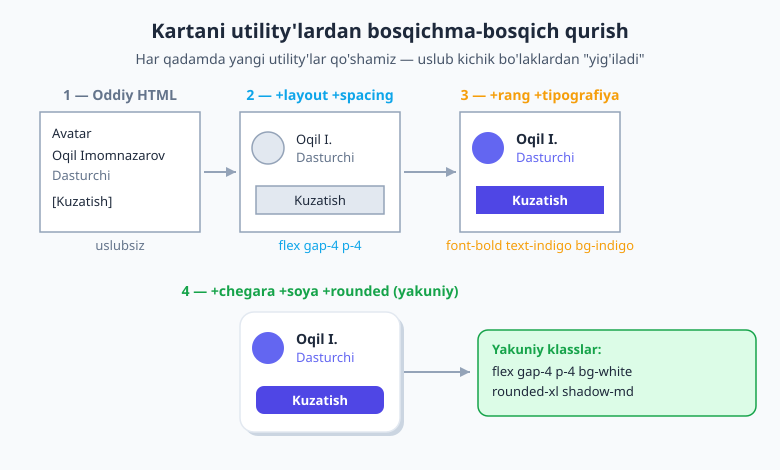
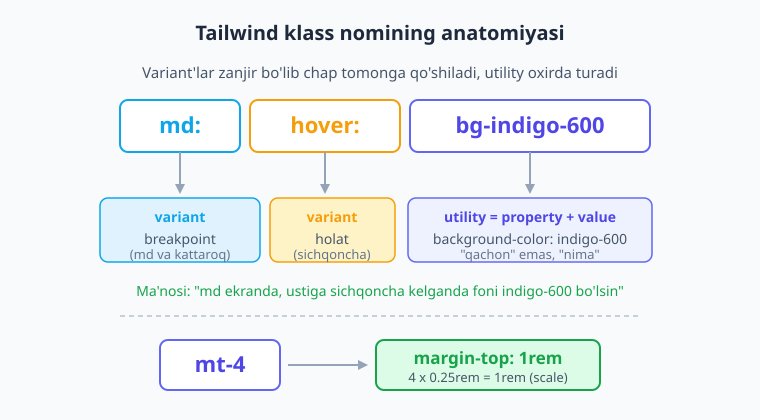
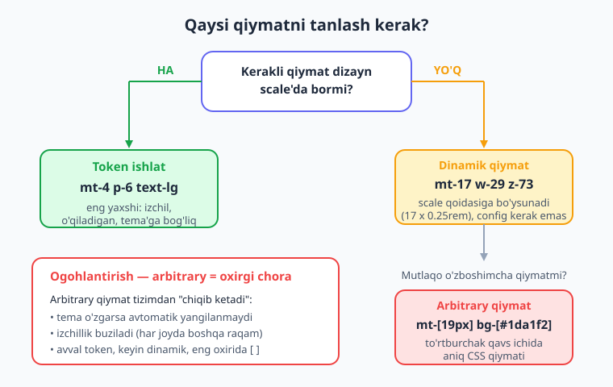

# 03 — Utility-first ish jarayoni

[⬅️ Oldingi: 02 — O'rnatish va birinchi qadamlar](./02-ornatish-birinchi-qadam.md) · [🏠 README](./README.md) · [Keyingi: 04 — Spacing, sizing va o'lcham tizimi ➡️](./04-spacing-sizing.md)

---

> **Bu bobda:** Tailwind bilan ishlashda eng muhim narsa — bu falon klassni yodlash emas, balki **boshqacha o'ylashni** o'rganishdir. Bu bobda biz aniq bir utility kategoriyasiga sho'ng'imasdan oldin, **utility-first uslubida qanday fikrlash va ishlash** kerakligini o'rganamiz: kichik bo'laklardan uslubni "yig'ish" tafakkuri, klass nomi anatomiyasi (`mt-4`, variant prefikslari `hover:`/`md:`), **arbitrary qiymatlar** `[...]`, v4'dagi **dinamik qiymatlar** (`mt-17`), takrorlanish muammosiga javob, klasslarni o'qiladigan tutish va brauzerda tez iteratsiya oqimi. Bobning oxirida siz bo'sh HTML'dan to'liq kartani — har bir qadamni ovoz chiqarib o'ylab — qura olasiz.

---

Oldingi bobda biz Tailwind'ni loyihaga o'rnatdik va birinchi `<h1 class="text-3xl font-bold">` ni ko'rdik. Endi tabiiy savol tug'iladi: "yaxshi, klasslar bor — lekin ularni qanday **ishlataman**? Qaysi birini, qaysi tartibda yozaman? Internetda ko'rgan o'sha 15 ta klassli `<div>`larni odam qanday yozadi?"

Bu bob aynan shu haqida. Va men sizni bir narsadan ogohlantiraman: **Tailwind o'rganishdagi eng katta to'siq texnik emas, balki tafakkuriy.** Klasslarning o'zi oson — `p-4` padding beradi, `flex` flexbox yoqadi. Qiyin qismi — yillar davomida o'rganib qolgan "avval CSS fayl ochaman, klass nomi o'ylab topaman, qoidalar yozaman" odatidan voz kechish. Keling, avval shu tafakkuriy o'zgarishni tushunamiz.

## Tafakkuriy o'zgarish: nom o'ylab topish emas, yig'ish

Klassik CSS'da komponent yasash jarayoni shunaqa ketadi. Siz HTML'da element yaratasiz, unga **nom** berasiz (`class="profile-card"`), keyin CSS faylga o'tasiz, o'sha nomga qoida yozasiz:

```css
.profile-card {
  display: flex;
  gap: 1rem;
  padding: 1rem;
  background: white;
  border-radius: 0.75rem;
  box-shadow: 0 4px 6px rgb(0 0 0 / 0.1);
}
```

Bu jarayonda ikkita **yashirin soliq** bor. Birinchisi — **nom o'ylab topish.** `profile-card` yaxshi nom. Lekin uning ichidagi sarlavhachi uchun nima yozasiz? `.profile-card__name`? `.profile-card-title`? Ichidagi tugma uchun-chi? Har bir element uchun nom o'ylab topish — bu kun bo'yi davom etadigan, charchatadigan va aslida **dizaynga hech narsa qo'shmaydigan** ish. (Dasturlashning eng mashhur hazili bejiz emas: "Kompyuter fanida ikkita qiyin narsa bor — kesh-invalidatsiya va **nom qo'yish**.")

Ikkinchi soliq — **fayllar orasida sakrash.** Siz HTML va CSS o'rtasida doim u yoqdan-bu yoqqa o'tib turasiz. `.profile-card` ni o'zgartirgingiz kelsa, avval HTML'dagi shu nomli elementni topasiz, keyin CSS'dagi shu nomli qoidani topasiz. Loyiha o'sgani sari bu masofa kattalashadi.

**Utility-first** boshqa yo'ldan boradi. Siz nom o'ylab topmaysiz va fayl ham almashtirmaysiz. Uslubni to'g'ridan-to'g'ri, joyida, **kichik utility'lardan yig'asiz**:

```html
<div class="flex gap-4 p-4 bg-white rounded-xl shadow-md">
  ...
</div>
```

Bu yerda har bir so'z — bitta kichik, bitta vazifani bajaradigan CSS qoidasi: `flex` → `display: flex`, `gap-4` → `gap: 1rem`, `p-4` → `padding: 1rem`, va hokazo. Siz xuddi **Lego** qurayotgandek — kichik, standart bo'laklarni biriktirib, kerakli ko'rinishni hosil qilasiz.

> 💡 **Nega bu "teskari" tuyuladi, lekin to'g'ri?** Birinchi marta `class="flex gap-4 p-4 bg-white rounded-xl shadow-md"` ni ko'rganda "bu ifloslik, HTML'ni iflos qilyapti" deb o'ylash tabiiy. Lekin bir oz ishlaganingizdan keyin teskari his paydo bo'ladi: HTML'ga **qarab turib**, element qanday ko'rinishini aniq bilasiz — boshqa faylni ochish shart emas. Uslub va struktura bir joyda. Bu — "lokal fikrlash"ning kuchi: bitta joyni o'qib, hammasini tushunasiz.

Endi keling, shu yig'ish jarayonini **jonli ko'rsatamiz** — bo'sh HTML'dan to'liq kartagacha, qadam-baqadam.

## Kartani qadam-baqadam qurish

Maqsadimiz — oddiy **profil kartasi**: avatar, ism, lavozim va "Kuzatish" tugmasi. Keling, hech qanday uslubsiz, sof HTML'dan boshlaymiz va har qadamda nimani **nega** qo'shayotganimizni ovoz chiqarib aytamiz.



### Qadam 1 — sof HTML (uslubsiz)

Avval struktura. Faqat mazmun, uslub haqida hali o'ylamaymiz:

```html
<div>
  
  <div>
    <p>Oqil Imomnazarov</p>
    <p>Dasturchi</p>
  </div>
  <button>Kuzatish</button>
</div>
```

Brauzerda bu — bir-birining ustiga taxlangan, formatlanmagan elementlar. Xunuk, lekin **to'g'ri struktura.** Uslub keyin keladi.

### Qadam 2 — layout va spacing

Birinchi savol: elementlar qanday **joylashishi** kerak? Men avatar, matn va tugma bir **qatorda** turishini xohlayman. Demak, flexbox. Va ular bir-biriga yopishib turmasligi uchun oralarida joy kerak. Hamda butun karta atrofida ichki bo'shliq (padding) bo'lsin:

```html
<div class="flex items-center gap-4 p-4">
  
  <div>
    <p>Oqil Imomnazarov</p>
    <p>Dasturchi</p>
  </div>
  <button class="ml-auto">Kuzatish</button>
</div>
```

Nima qo'shdik va nega:

- `flex` — bolalarni qatorga tizadi (`display: flex`).
- `items-center` — ularni vertikal o'qda markazga tenglaydi, shunda avatar va matn bir balandlikda turadi.
- `gap-4` — bolalar orasiga `1rem` bo'shliq qo'yadi.
- `p-4` — karta atrofiga `1rem` ichki bo'shliq.
- `size-12` — avatarga kenglik va balandlik (`3rem` × `3rem`) beradi.
- `rounded-full` — avatarni doira qiladi.
- `ml-auto` — tugmaning chap chetiga "avtomatik margin" qo'yib, uni o'ng chetga itaradi.

Endi ko'rinish mantiqiy: qator, bo'shliqlar, dumaloq avatar. Lekin hali rangsiz va silliq emas.

### Qadam 3 — rang va tipografiya

Endi **ko'rinish**ni jonlantiramiz. Ism qalin va to'q bo'lsin, lavozim esa kichikroq va xira (chunki u ikkinchi darajali ma'lumot). Tugmaga rang beramiz:

```html
<div class="flex items-center gap-4 p-4">
  
  <div>
    <p class="font-semibold text-slate-900">Oqil Imomnazarov</p>
    <p class="text-sm text-slate-500">Dasturchi</p>
  </div>
  <button class="ml-auto bg-indigo-600 text-white">Kuzatish</button>
</div>
```

Mana fikrlash izi:

- `font-semibold text-slate-900` — ism qalinroq va deyarli qora; u **asosiy** ma'lumot.
- `text-sm text-slate-500` — lavozim kichikroq va kulrang; **vizual ierarxiya** orqali "men ikkinchi darajaliman" deydi.
- `bg-indigo-600 text-white` — tugma ko'zga tashlanadigan rangda; oq matn to'q fonda yaxshi o'qiladi.

### Qadam 4 — chegara, soya va dumaloqlik (yakuniy silliqlash)

Oxirgi qadam — kartani "qog'oz varaqdek" ko'tarib turuvchi vizual nozikliklar: fon, dumaloq burchaklar, soya. Tugmaga ham padding va dumaloqlik beramiz:

```html
<div class="flex items-center gap-4 p-4 bg-white rounded-xl shadow-md">
  
  <div>
    <p class="font-semibold text-slate-900">Oqil Imomnazarov</p>
    <p class="text-sm text-slate-500">Dasturchi</p>
  </div>
  <button class="ml-auto px-4 py-2 bg-indigo-600 text-white rounded-lg">
    Kuzatish
  </button>
</div>
```

Tamom. To'liq, professional ko'rinishdagi karta — va biz buni **bir marta ham CSS fayl ochmasdan, bitta ham nom o'ylab topmasdan** qurdik. E'tibor bering: biz qiziq tartibda bordik — **layout → spacing → rang/tipografiya → vizual nozikliklar**. Bu tasodifiy emas; ko'pchilik tajribali dasturchi aynan shu tartibda "qatlam-qatlam" o'ylaydi. Bu haqda quyiroqda yana gaplashamiz.

## Klass nomi anatomiyasi

Yig'ishni ko'rdik. Endi har bir "bo'lak"ni — klass nomini — ichidan tushunaylik. Tailwind klasslari **tasodifiy nomlar emas**; ularning aniq, oldindan aytsa bo'ladigan tuzilishi bor. Asosiy shakl:

```text
{property}-{value}
```

Ya'ni: **qaysi xususiyat** va **qaysi qiymat**. Misol uchun:

| Klass | Property | Value | CSS |
|---|---|---|---|
| `mt-4` | `margin-top` | `4` | `margin-top: 1rem` |
| `text-lg` | `font-size` | `lg` | `font-size: 1.125rem` |
| `bg-red-500` | `background-color` | `red-500` | qizil fon |
| `w-1/2` | `width` | `1/2` | `width: 50%` |

Bir necha maxsus shakl ham bor:

- **Manfiy qiymatlar** — minus belgisi **boshiga** qo'yiladi: `-mt-2` → `margin-top: -0.5rem`. (Diqqat: `mt--2` emas, `-mt-2`.)
- **Kasrlar** — foiz uchun: `w-1/2` (50%), `w-1/3` (33.33%), `top-1/4`.
- **Faqat bitta so'z** — ba'zi utility'larda qiymat yo'q: `flex`, `hidden`, `italic`, `underline` — bularning o'zi to'liq qoida.

Eng muhim tushuncha — **scale (shkala).** `mt-4` dagi `4` — bu `4px` emas. Tailwind'da raqamlar **dizayn shkalasi**ga bog'langan: standart o'lchov birligi `0.25rem` (odatda `4px`). Demak `4 × 0.25rem = 1rem`. Shuning uchun `mt-4` = `1rem`, `p-2` = `0.5rem`, `gap-8` = `2rem`.

> 💡 **Nega `4` = `1rem`, shunchaki `4px` emas?** Chunki shkala sizni **izchil** bo'lishga majbur qiladi. Agar har kim xohlagan piksel qiymatini yozsa (`13px`, `17px`, `21px`...), sayt tez orada "biroz nomutanosib" ko'rinadi — odam buni sezadi-yu, sababini topolmaydi. Cheklangan shkala (`4, 8, 12, 16...`) esa barcha bo'shliqlarni bir-biriga moslab, dizaynni **uyg'un** tutadi. To'liq shkalani — barcha raqamlar va `rem` qiymatlari bilan — keyingi [04-bobda](./04-spacing-sizing.md) ko'ramiz.

## Variant prefikslari: holat va sharoit

Hozircha klasslar **doim** ishladi. Lekin ko'pincha uslub faqat **muayyan sharoitda** kerak bo'ladi: tugma **ustiga sichqoncha kelganda** rangini o'zgartirsin, yoki layout faqat **katta ekranda** ikki ustunli bo'lsin. Mana shu yerda **variantlar** ishga tushadi.

Variant — bu klass oldiga qo'yiladigan, ikki nuqta bilan ajratilgan prefiks. Shakl:

```text
{variant}:{utility}
```

Bir necha eng keng tarqalgan misol:

```html
<button class="bg-indigo-600 hover:bg-indigo-700">Tugma</button>
<div class="block md:flex">...</div>
<p class="text-slate-900 dark:text-white">Matn</p>
<input class="focus:ring focus:ring-indigo-500">
```

Ularni o'qib chiqamiz:

- `hover:bg-indigo-700` — "**ustiga sichqoncha kelganda** foni `indigo-700` bo'lsin".
- `md:flex` — "**md (o'rta) breakpoint va undan katta** ekranda `display: flex` bo'lsin".
- `dark:text-white` — "**qorong'u rejimda** matn oq bo'lsin".
- `focus:ring` — "**fokuslanganda** (masalan Tab bilan) atrofida halqa chizilsin".



### Variantlar zanjirlanadi (stacking)

Eng kuchli jihati: variantlarni **bir-birining ustiga qo'yish** mumkin. Bir nechta shartni bitta klassda birlashtirasiz:

```html
<button class="md:hover:bg-indigo-700">...</button>
<p class="dark:md:text-lg">...</p>
```

- `md:hover:bg-indigo-700` — "md ekranda **VA** ustiga sichqoncha kelganda" — ikkala shart ham bajarilishi kerak.
- `dark:md:text-lg` — "qorong'u rejimda **VA** md ekranda".

Prefikslar zanjir bo'lib chap tomonga to'planadi, haqiqiy utility esa doim **eng oxirida** turadi. Tartib odatda muhim emas (`md:hover:` va `hover:md:` bir xil ishlaydi), faqat bir-ikki maxsus holatda farq qiladi — buni keyinroq ko'ramiz.

> 📌 Bu bobda variantlar bilan faqat **tanishtirdik** — naqsh (`variant:utility`) va zanjirlanish g'oyasini bilib qo'yishingiz uchun. Har bir variant turini chuqur o'rganamiz: responsive breakpoint'lar (`sm:`/`md:`/...) — [09-bob](./09-responsive-dizayn.md); `hover`/`focus`/`group`/`peer`/`data-*` kabi holat variantlari va `dark:` rejimi — keyingi qismlarda. Hozir asosiy fikr: **prefiks = "qachon", utility = "nima".**

## Arbitrary qiymatlar: `[...]`

Shkala juda foydali, lekin ba'zan sizga undagi qiymat **yo'q** narsa kerak bo'ladi. Mijoz dizaynda aniq `top: 117px` ni so'ragan. Yoki brendingiz rangi `#1da1f2` — bu Tailwind palitrasida yo'q. Mana shunday holatlar uchun **arbitrary (o'zboshimcha) qiymatlar** bor: kerakli qiymatni **to'rtburchak qavs** `[...]` ichiga yozasiz.

```html
<div class="top-[117px]">...</div>
<button class="bg-[#1da1f2]">Twitter ko'k</button>
<div class="grid grid-cols-[1fr_500px_2fr]">...</div>
<h1 class="text-[clamp(1rem,2vw,1.5rem)]">Moslashuvchi sarlavha</h1>
<div class="w-[calc(100%-2rem)]">...</div>
```

Bu — utility'ning ichiga to'g'ridan-to'g'ri xom CSS qiymatini "qo'lda" joylash usuli. `top-[117px]` aniq `top: 117px` ni, `bg-[#1da1f2]` esa aniq o'sha rangli fonni beradi.

Ikki muhim noziklik:

1. **Bo'shliq o'rniga pastki chiziq.** CSS qiymatida bo'shliq kerak bo'lsa (masalan `grid-cols` da yoki `gap` da), bo'shliq o'rniga **`_`** (underscore) ishlatasiz: `grid-cols-[1fr_500px_2fr]`. Tailwind buni qayta bo'shliqqa aylantiradi.
2. **Arbitrary property'lar.** Faqat qiymat emas, butun CSS xususiyatni ham qavs ichida bera olasiz — Tailwind'da utility'si yo'q nodir xususiyatlar uchun: `[mask-type:luminance]`, `[-webkit-line-clamp:3]`.

> ⚠️ **Arbitrary — eshik emas, balki "favqulodda eshik".** Qavs `[...]` juda kuchli, va aynan shuning uchun xavfli. Har bir arbitrary qiymat — bu dizayn tizimidan **chiqib ketish**: u tema o'zgarsa avtomatik yangilanmaydi, va loyiha bo'ylab `mt-[13px]`, `mt-[15px]`, `mt-[19px]` kabi tartibsiz qiymatlar tarqalsa, izchillik buziladi. Qoida: **avval shkaladagi tokenni qidiring; arbitrary — eng oxirgi chora.** Agar bitta arbitrary qiymatni ko'p joyda ishlatayotgan bo'lsangiz, bu sizning **tema'ga yangi token qo'shish** kerakligi haqidagi signal (buni [18-bobda](./18-theme-dizayn-tizimi.md) ko'ramiz).

## Dinamik qiymatlar: v4'ning "JIT" sehri

Tailwind v4'da yana bir nozik, lekin juda foydali imkoniyat bor — uni arbitrary bilan **adashtirmaslik** muhim. Ko'p utility'lar endi **istalgan raqamni** qabul qiladi — hatto shkalada "rasman" e'lon qilinmagan bo'lsa ham, qavs ham kerak emas:

```html
<div class="mt-17">...</div>
<div class="grid grid-cols-15">...</div>
<div class="w-29">...</div>
<div class="z-73">...</div>
```

`mt-17` — bu xato emas. v4 buni **shkala qoidasi bo'yicha hisoblaydi**: `17 × 0.25rem = 4.25rem`. Ya'ni `mt-4` qanday hisoblansa, `mt-17` ham xuddi shunday — faqat raqam kattaroq. Buni Tailwind `--spacing` o'zgaruvchisidan **kelib chiqarib** (derive qilib) yaratadi.

Mana asosiy farqni tushunib oling — bu boshlovchilarni ko'p chalkashtiradi:

| | Dinamik (`mt-17`) | Arbitrary (`mt-[19px]`) |
|---|---|---|
| **Shakl** | `mt-17` (qavssiz raqam) | `mt-[19px]` (qavs + birlik) |
| **Qiymat manbai** | `--spacing` shkalasidan hisoblanadi (`17 × 0.25rem`) | siz yozgan xom CSS qiymati (`19px`) |
| **Shkalaga mosligi** | **Ha** — shkala uyg'unligini saqlaydi | Yo'q — tizimdan tashqarida |
| **Qachon** | shkala bo'yicha, lekin katta/nostandart raqam kerak | shkala mantig'iga **umuman to'g'ri kelmaydigan** qiymat (aniq `px`, hex rang, `calc`) |

Boshqacha aytganda: `mt-17` hali ham **tizim ichida** — u shunchaki shkalaning uzoqroq nuqtasi. `mt-[19px]` esa tizimdan **tashqarida** — qo'lda kiritilgan xom qiymat. Tanlovda har doim shu tartibni eslang: **token → dinamik → arbitrary.**



## Takrorlanish muammosi: "bir xil 8 ta klassni har joyda yozamanmi?"

Endi har bir Tailwind o'rganuvchining boshiga keladigan savol: "Yaxshi, bitta karta uchun `flex gap-4 p-4 bg-white rounded-xl shadow-md` yozdim. Lekin menda 20 ta shunday karta bor — shu 6 ta klassni **20 marta** takrorlaymanmi?! Bu-ku dahshat."

Tinchlaning — javob **yo'q**, takrorlamaysiz. Lekin yechim siz o'ylagandek (`@apply` bilan birinchi kundan klass yasash) **emas**. Mana to'g'ri tartib:

1. **Sikllar (loops) — eng ko'p uchraydigan yechim.** 20 ta karta deganda, siz amalda 20 ta `<div>` yozmaysiz — ma'lumotlar ustida **sikl** aylantirasiz. Klasslar **bir marta** shablonda yoziladi, 20 marta takrorlanish — bu sizning vazifangiz emas, kompyuterniki:

   ```html
   <!-- shartli psevdo-shablon -->
   {foydalanuvchilar.map(u =>
     <div class="flex gap-4 p-4 bg-white rounded-xl shadow-md">{u.ism}</div>
   )}
   ```

   Bitta sikl ichidagi takrorlanish — **muammo emas.** Klasslar manbada bir joyda turibdi.

2. **Komponentlar.** React, Vue, Svelte yoki Blade ishlatayotgan bo'lsangiz, kartani bir marta **komponent** qilib o'rab qo'yasiz (`<ProfileCard />`), klasslar o'sha yagona faylda yashaydi. Bu — takrorlanishni boshqarishning eng kuchli va idiomatik usuli.

3. **`@apply` — faqat haqiqiy global "primitiv"lar uchun.** Agar sizda butun loyiha bo'ylab bir xil ko'rinadigan element bo'lsa (masalan, hamma yerda aynan bir xil `.btn`), `@apply` bilan utility'larni bitta CSS klassga "yig'ib" olishingiz mumkin. Lekin bu — **oxirgi va eng kam ishlatiladigan** yechim, birinchi emas.

> ⚠️ **Eng katta boshlang'ich xato — erta `@apply` ga yopishish.** Yangi o'rganuvchilar uzun klass qatoridan qo'rqib, darrov `@apply` bilan `.card`, `.btn`, `.title` yasay boshlaydi — va shu zahoti Tailwind'ning butun afzalligini yo'qotadi. Endi yana CSS fayl ochish, nom o'ylab topish va fayl orasida sakrash qaytib keladi! Qoida: **erta abstraksiya qilmang.** Takrorlanish — bu hali muammo emas; takrorlanish **og'riq keltira boshlaganda** (uchinchi-to'rtinchi marta nusxa ko'chirayotganda) yechim qidiring. Takrorlanishni boshqarishning to'liq strategiyasini — komponent vs `@apply`, `clsx`, `tailwind-merge`, `cva` — keyingi [22-bobda](./22-komponentlar-framework.md) chuqur ko'rib chiqamiz.

## Klasslarni o'qiladigan tutish

"Lekin 12 ta klassli qator ko'zni og'ritadi-ku?" — bu o'rinli e'tiroz. Tajribali jamoalar bir necha amaliy taktika bilan buni boshqaradi:

- **Izchil tartib.** Klasslarni har doim bir xil mantiqiy tartibda yozing: **layout → box (spacing/o'lcham) → tipografiya → vizual → holat.** Masalan: `flex items-center gap-4 p-4 text-sm font-medium bg-white rounded-lg shadow hover:shadow-md`. Ko'zingiz tartibga o'rganadi va kerakli klassni tez topadi. Yodingizda bo'lsin — kartani qurganda biz aynan shu tartibda fikrlagandik.
- **Prettier plugin avtomatik tartiblaydi.** Rasmiy `prettier-plugin-tailwindcss` saqlaganingizda klasslarni **tavsiya etilgan tartibda** o'zi qayta tizadi — siz tartib haqida o'ylamaysiz ham. Uni sozlashni keyinroq, production va asboblar bobida ko'ramiz; hozir shunchaki mavjudligini bilib qo'ying.
- **IntelliSense.** VS Code uchun Tailwind kengaytmasi (02-bobda o'rnatgansiz) yozayotganingizda klasslarni avtomatik to'ldiradi, ostiga rangli kvadrat ko'rsatadi va xato klassdan ogohlantiradi.
- **Ko'p-kursorli tahrirlash (multi-cursor).** Bir nechta elementda bir xil o'zgarish kerak bo'lsa, muharrirning ko'p-kursor imkoniyatidan foydalaning.

## Brauzerda iteratsiya oqimi

Utility-first'ning eng yoqimli jihati — **tezlik.** Ish oqimi shunday:

1. Element ustiga klass yozasiz (`bg-indigo-600`).
2. Faylni **saqlaysiz**.
3. Dev-server (Vite) o'zgarishni sezadi, CSS'ni qayta quradi, brauzer **avtomatik yangilanadi** (HMR).
4. Natijani ko'rasiz. Yoqmadimi? `600` ni `500` ga o'zgartirasiz, yana saqlaysiz — bir soniyada yangi natija.

Bu davriy "yoz → saqla → ko'r" sikli shu qadar tez bo'ladiki, dizayn ustida deyarli **jonli o'ynayotgandek** his qilasiz. CSS fayl ochib, qoida yozib, nomni HTML'ga ulab... degan uzun zanjir yo'q.

Yana bir kuchli usul — **brauzer DevTools.** Qaysi utility kerakligini bilmasangiz: elementni DevTools'da tanlang, "Styles" panelida CSS qiymatini (`padding: 1rem`) qo'lda o'zgartirib ko'ring, yoqqan qiymatni topgach — uni Tailwind klassiga aylantiring (`1rem` → `p-4`). Bu, ayniqsa, boshda, "qaysi raqam qaysi klass" intuitsiyasini tez shakllantiradi.

## Boshlang'ich gunohlar — nimadan saqlanish kerak

Bobni yakunlab, sizni eng ko'p uchraydigan to'rtta tuzoqdan ogohlantiraman:

- **Arbitrary qiymatlarga g'arq bo'lish.** `top-[117px] left-[43px] w-[321px] text-[#3a3a3a]` — bu Tailwind emas, bu qavs ichiga yashiringan oddiy inline-CSS. Avval shkalani qidiring.
- **Erta `@apply` ekstraksiyasi.** Yuqorida aytdik: birinchi kundan `.card` yasamang. Takrorlanish og'riq berguncha kuting.
- **Shkala bilan kurashish.** "Menga `15px` kerak, lekin shkalada `16px` (`4`) bor" — deyarli har doim `16px` ni qabul qiling. `1px` farq odamga sezilmaydi, lekin izchillik sezildi. Shkalaga **bo'ysuning**, u bilan kurashmang.
- **Klasslarni tartibsiz yozish.** Bugun `p-4 flex bg-white`, ertaga `bg-white p-4 flex` — keyin o'zingiz ham topolmay qolasiz. Izchil tartib (yoki Prettier plugin) tuting.

Endi siz utility-first'da **fikrlay olasiz**: nom o'ylamasdan, kichik bo'laklardan uslubni yig'asiz; klass nomini ichidan o'qiysiz; variant, dinamik va arbitrary qiymatlar orasidan to'g'risini tanlaysiz. Keyingi boblardan boshlab biz har bir utility kategoriyasiga — avval [spacing va o'lcham tizimiga](./04-spacing-sizing.md) — chuqur kiramiz. Lekin tafakkur poydevori endi sizda bor.

## Mashqlar

### Oson

**1-mashq.** Quyidagi klasslarni "tarjima" qiling — har biri qaysi CSS qoidasini beradi? (a) `mt-6`, (b) `p-2`, (c) `w-1/3`, (d) `-mt-4`, (e) `gap-8`. (`1` shkala birligi = `0.25rem` ekanini eslang.)

**2-mashq.** Quyidagi klassni anatomiyaga ajrating: `lg:hover:text-red-500`. Qaysi qism(lar) variant, qaysi biri utility? Klassning to'liq ma'nosini bitta jumlada ayting.

**3-mashq.** Quyidagilardan qaysilari **dinamik qiymat**, qaysilari **arbitrary qiymat**? (a) `mt-17`, (b) `bg-[#1da1f2]`, (c) `w-29`, (d) `top-[117px]`, (e) `z-50`, (f) `grid-cols-[1fr_2fr]`.

### O'rta

**4-mashq.** Sizga "Yangi xabar keldi" degan oddiy **bildirishnoma** (notification) kerak: chap chetda kichik dumaloq belgi (icon o'rni), o'ng tomonda matn, butun blok oq fonli, dumaloq burchakli va yengil soyali, ichida bo'shliq bilan. Sof HTML'dan boshlab, **kamida 3 qadamda** (layout → rang/tipografiya → chegara/soya) qurib boring; har qadamda HTML'ni va qaysi klassni **nega** qo'shganingizni yozing.

**5-mashq.** Sizga dizaynda `top: 117px` kerak bo'ldi. Buni Tailwind'da yozing. Endi savol: agar `top: 64px` kerak bo'lsa-chi (`64 = 16 × 4`)? Qaysi yo'l (token, dinamik yoki arbitrary) afzal va **nega**? Ikki holatni taqqoslang.

**6-mashq.** Bir dasturchi loyihaning birinchi kunida darrov shunday CSS yozdi: `.card { @apply flex gap-4 p-4 bg-white rounded-xl shadow-md; }` va hamma kartani `class="card"` qildi. Bu yondashuvning **ikki kamchiligini** ayting va qaysi vaziyatda u **to'g'ri** bo'lishini tushuntiring.

### Qiyin

**7-mashq.** Sizga `class="flex gap-4 p-4 bg-white rounded-xl shadow-md"` klassli kartani **15 ta foydalanuvchi** uchun ko'rsatish kerak. Bu klasslarni HTML'da 15 marta nusxalash **noto'g'ri** — nega? Uch xil to'g'ri yechimni (sikl, komponent, `@apply`) sanang va qaysi biri ushbu holat uchun eng mosligini asoslang.

**8-mashq.** Bir jamoa kodida quyidagi qator bor: `class="mt-[15px] mb-[17px] px-[13px] text-[#2a2a2a] bg-[#fafafa]"`. Bu kodning uchta muammosini aniqlang va har birini **izchil, tizimga mos** muqobil bilan qanday tuzatishni tushuntiring (ba'zi qiymatlar uchun token, ba'zilari uchun tema'ga yangi token qo'shish kerak bo'lishi mumkin).

<details markdown="1">
<summary>Yechimlar</summary>

### 1-mashq yechimi

- (a) `mt-6` → `margin-top: 1.5rem` (`6 × 0.25rem`).
- (b) `p-2` → `padding: 0.5rem` (`2 × 0.25rem`).
- (c) `w-1/3` → `width: 33.333%` (kasr → foiz).
- (d) `-mt-4` → `margin-top: -1rem` (manfiy — minus boshida).
- (e) `gap-8` → `gap: 2rem` (`8 × 0.25rem`).

### 2-mashq yechimi

`lg:hover:text-red-500` uch qismdan iborat:

- `lg:` — **variant** (breakpoint: large va undan katta ekran).
- `hover:` — **variant** (holat: ustiga sichqoncha kelganda).
- `text-red-500` — **utility** (property `color`, value `red-500`).

**Ma'nosi:** "lg (katta) ekranda **va** elementning ustiga sichqoncha kelganda matn rangi `red-500` bo'lsin." Ikkala shart ham bir vaqtda bajarilishi kerak.

### 3-mashq yechimi

- **Dinamik (qavssiz, shkaladan hisoblanadi):** (a) `mt-17`, (c) `w-29`.
- **Arbitrary (qavs ichida, xom CSS qiymati):** (b) `bg-[#1da1f2]`, (d) `top-[117px]`, (f) `grid-cols-[1fr_2fr]`.
- **Diqqat — (e) `z-50` na biri:** bu oddiy **token** (shkalada mavjud standart qiymat). Bu uchala toifani bir-biridan farqlash muhim: token → dinamik → arbitrary.

### 4-mashq yechimi

**1-qadam — layout va spacing.** Avatar/belgi va matn bir qatorda, oralarida bo'shliq, blokda padding:

```html
<div class="flex items-center gap-3 p-4">
  <div class="size-10 rounded-full bg-indigo-100"></div>
  <div>
    <p>Yangi xabar keldi</p>
    <p>2 daqiqa oldin</p>
  </div>
</div>
```

`flex items-center` — qator, vertikal markaz; `gap-3` — oraliq; `p-4` — ichki bo'shliq; `size-10 rounded-full` — dumaloq belgi.

**2-qadam — rang va tipografiya.** Asosiy matn qalin va to'q, vaqt esa kichik va xira:

```html
<div class="flex items-center gap-3 p-4">
  <div class="size-10 rounded-full bg-indigo-100"></div>
  <div>
    <p class="font-medium text-slate-900">Yangi xabar keldi</p>
    <p class="text-sm text-slate-500">2 daqiqa oldin</p>
  </div>
</div>
```

**3-qadam — chegara va soya.** Blokni "varaq"dek ko'taramiz:

```html
<div class="flex items-center gap-3 p-4 bg-white rounded-lg shadow-sm">
  <div class="size-10 rounded-full bg-indigo-100"></div>
  <div>
    <p class="font-medium text-slate-900">Yangi xabar keldi</p>
    <p class="text-sm text-slate-500">2 daqiqa oldin</p>
  </div>
</div>
```

`bg-white rounded-lg shadow-sm` — oq fon, dumaloq burchak, yengil soya. (Ranglar/o'lchamlar didingizga ko'ra farq qilishi mumkin — muhim qism: **qatlam-qatlam** fikrlash tartibi.)

### 5-mashq yechimi

- `top: 117px` → `top-[117px]` (**arbitrary**). `117` shkalaga umuman to'g'ri kelmaydi (`117 / 4 = 29.25` — butun emas), shuning uchun qavs zarur.
- `top: 64px` → `top-16` (**token**), chunki `64px = 16 × 4px`, ya'ni `16` — shkaladagi to'liq qiymat.

**Afzal yo'l — har doim shkalaga to'g'ri kelsa, token (`top-16`).** Nega? Token tema'ga bog'langan: agar kelajakda `--spacing` o'zgarsa, `top-16` avtomatik moslashadi, `top-[64px]` esa qotib qoladi. Arbitrary (`top-[117px]`) faqat shkalaga **mos kelmaydigan** qiymat uchun — chinakam favqulodda holat. Xulosa: avval shkalani qidir, faqat bo'lmaganda qavsga o't.

### 6-mashq yechimi

**Ikki kamchilik:**

1. **Tafakkuriy afzallik yo'qoladi.** Endi `.card` ni o'zgartirish uchun yana CSS faylga sakrash, nom (`.card`, `.card-title`...) o'ylab topish va HTML bilan CSS orasida qatnash kerak — ya'ni utility-first nimadan qutqargan bo'lsa, hammasi qaytib keladi.
2. **Erta abstraksiya — moslashuvchanlikni o'ldiradi.** Loyiha o'sgach, kartalarning ko'pchiligi "biroz boshqacha" bo'lib qoladi (biri soyasiz, biri kattaroq padding bilan). Yagona `.card` klassi bularning hammasiga yetmaydi — natijada `.card`, `.card-lg`, `.card-flat`... degan klasslar to'plami paydo bo'ladi (aynan Tailwind qochmoqchi bo'lgan muammo).

**Qachon to'g'ri:** agar element loyiha bo'ylab **chinakam bir xil** va ko'p marta takrorlanadigan "primitiv" bo'lsa (masalan, butun saytda aynan bir xil tugma), `@apply` o'rinli. Lekin bu **istisno**, qoida emas — va odatda bunday holatda ham komponent (React/Vue) afzalroq.

### 7-mashq yechimi

**Nega 15 marta nusxalash noto'g'ri:** (a) bitta klassni o'zgartirsangiz (`shadow-md` → `shadow-lg`), 15 joyni qo'lda topib tuzatish kerak — xato kiritish ehtimoli yuqori; (b) kod hajmi shishadi va o'qish qiyinlashadi; (c) eng muhimi — 15 ta karta odatda **bir xil ma'lumot turi** (foydalanuvchilar ro'yxati), demak bu tabiatan takrorlanuvchi struktura.

**Uch yechim:**

1. **Sikl (loop)** — `foydalanuvchilar.map(...)` ichida kartani **bir marta** yozasiz, ro'yxat bo'ylab kompyuter takrorlaydi. Klass faqat bitta joyda.
2. **Komponent** — `<ProfileCard user={u} />` qilib o'rab, siklda chaqirasiz.
3. **`@apply`** — utility'larni `.profile-card` ga yig'asiz.

**Eng mos:** bu holat uchun **sikl** (1-yechim), agar framework ishlatilayotgan bo'lsa **komponent bilan birga** (1+2). Sabab: ma'lumot bir turdagi ro'yxat — sikl tabiiy va eng kam abstraksiya bilan muammoni hal qiladi. `@apply` (3) bu yerda **ortiqcha** — u faqat ma'lumotdan mustaqil, butun saytda qayta ishlatiladigan global primitivlar uchun. Asosiy saboq: takrorlanishni **shablon darajasida** (sikl/komponent) hal qilish, CSS darajasida (`@apply`) emas.

### 8-mashq yechimi

Qator: `class="mt-[15px] mb-[17px] px-[13px] text-[#2a2a2a] bg-[#fafafa]"`.

**Uch muammo va tuzatish:**

1. **Bo'shliq qiymatlari shkaladan tashqarida (`mt-[15px] mb-[17px] px-[13px]`).** `15`, `17`, `13` — tasodifiy, izchil emas piksellar; ular dizaynni "biroz nomutanosib" qiladi. **Tuzatish:** eng yaqin shkala tokeniga yaxlitlang — `mt-4` (`16px`), `mb-4` (`16px`), `px-3` (`12px`). `1-2px` farq sezilmaydi, izchillik esa sezilarli yaxshilanadi.
2. **Matn rangi xom hex (`text-[#2a2a2a]`).** Bu rang tizimdan tashqarida va tema o'zgarsa yangilanmaydi. **Tuzatish:** Tailwind palitrasidagi yaqin tokenni ishlating (`text-slate-800` yoki `text-neutral-800`). Agar bu aniq rang brend uchun zarur va ko'p ishlatilsa — uni `@theme` da **yangi token** sifatida e'lon qiling (18-bob), keyin `text-brand-ink` kabi nom bilan ishlating.
3. **Fon rangi ham xom hex (`bg-[#fafafa]`).** Xuddi shu muammo. **Tuzatish:** `bg-slate-50` (yoki `bg-neutral-50`) — `#fafafa` ga juda yaqin standart token. Yana, agar aniq qiymat zarur bo'lsa — tema'ga token qo'shing.

**Umumiy saboq:** beshta arbitrary qiymatning bittasi ham aslida zarur emas edi — barchasini token yoki tema-token bilan almashtirsa bo'ladi. Bu — "arbitrary'ga g'arq bo'lish" gunohining tipik namunasi: avval shkalani qidir, faqat haqiqatan mos token bo'lmagandagina qavsga murojaat qil.

</details>

---

[⬅️ Oldingi: 02 — O'rnatish va birinchi qadamlar](./02-ornatish-birinchi-qadam.md) · [🏠 README](./README.md) · [Keyingi: 04 — Spacing, sizing va o'lcham tizimi ➡️](./04-spacing-sizing.md)
